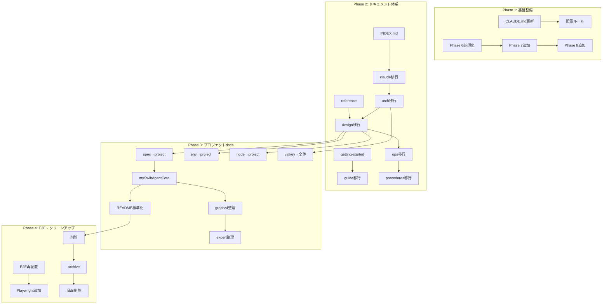

# 作業計画書: Issue #400 CLAUDE.md・pm-auto-dev・ドキュメント体系の改善

**Issue番号**: #400
**サイズ**: XL（42タスク）
**作業見積**: 40時間（5人日）
**優先度**: High（開発効率に直結）
**依存Issue**: なし

---

## 1. Issue概要

CLAUDE.md、pm-auto-devスラッシュコマンド、およびドキュメント体系を改善し、以下の課題を解決します：

- Issue実装内容の完遂率向上
- ドキュメントの実態との一致
- 類似不具合の再発防止
- ドキュメント体系の明確化

---

## 2. 詳細タスク分解

### Phase 1: 基盤整備（8時間）

#### Task 1.1: CLAUDE.md更新（3時間）
- **T1**: プロジェクト位置づけテーブル更新
  - mySwiftAgentCore vs graphAiServer の使い分け明記
  - 各プロジェクトの役割を正確に反映
- **T2**: Issue完遂チェックリスト追加
  - 必須確認項目を明文化
- **T3**: ドキュメント配置ルール追加
  - 全体docs vs プロジェクトdocsの判断基準

#### Task 1.2: スラッシュコマンド更新（5時間）
- **T4**: pm-auto-dev Phase 6 必須化
  - ドキュメンテーション工程を必須に
  - /doc-register の自動実行組み込み
- **T5**: pm-auto-dev Phase 7 追加
  - リグレッションテスト工程の新規実装
- **T6**: pm-auto-dev Phase 8 追加
  - Issue完遂チェック工程の新規実装
- **T7**: pm-bug-fix 強化
  - なぜなぜ分析（5 Whys）追加
  - 影響範囲調査プロセス追加

### Phase 2: ドキュメント体系構築（12時間）

#### Task 2.1: 新規ディレクトリ作成（2時間）
- **T10**: `docs/INDEX.md` 作成
  - 全ドキュメントへのナビゲーション
- **T11**: `docs/getting-started/` 作成
  - quick-start.md
  - installation.md
  - first-workflow.md
- **T12**: `docs/reference/` 作成
  - environment-variables.md（移行）
  - configuration.md
  - glossary.md

#### Task 2.2: ドキュメント移行（全体docs内）（8時間）
- **T13**: `docs/claude/*` → `docs/development/*`（8ファイル）
- **T14**: `docs/arch/*` → `docs/architecture/*`（2ファイル）
- **T15**: `docs/design/*` → 適切な場所へ（7ファイル）
  - architecture-overview.md → architecture/
  - environment-variables.md → reference/
  - その他 → architecture/
- **T16**: `docs/ops/*` → `docs/operations/*`（5ファイル）
- **T17**: `docs/procedures/*` → `docs/operations/*`（3ファイル）
- **T18**: `docs/rule/*` → `docs/development/*`（1ファイル）
- **T19**: `docs/guide/*` → 適切な場所へ（3ファイル）
- **T20**: `docs/spec/*` → 適切な場所へ（4ファイル）
- **T21**: `docs/workflows/*` → `docs/operations/*`（1ファイル）

#### Task 2.3: プロジェクト間移行（2時間）
- **T22**: `docs/spec/job-generation-workflow.md` → `expertAgent/docs/features/`
- **T23**: `docs/design/graphai-env-vars.md` → `graphAiServer/docs/`
- **T24**: `docs/design/node-execution-context.md` → `mySwiftAgentCore/docs/`
- **T25**: `expertAgent/docs/valkey-integration.md` → `docs/architecture/`

### Phase 3: プロジェクトドキュメント整備（12時間）

#### Task 3.1: 新規プロジェクトdocs作成（4時間）
- **T26**: `mySwiftAgentCore/docs/` 作成
  - API_REFERENCE.md
  - features/taskflow-execution.md
  - internals/node-execution-context.md（移行）
- **T27**: `myAgentDesk/docs/` 作成
  - API_REFERENCE.md（UI向け）
  - guides/getting-started.md
- **T28**: `myscheduler/docs/` 作成またはREADME統合
- **T29**: `commonUI/docs/` 作成またはREADME統合

#### Task 3.2: 既存プロジェクトdocs整理（2時間）
- **T30**: graphAiServer/docs/ 構造整理
  - GRAPHAI_WORKFLOW_GENERATION_RULES.md → features/
  - AVAILABLE_AGENTS.md → reference/
  - COMMON_ERRORS.md → troubleshooting.md
- **T31**: expertAgent/docs/ 構造整理
  - job_generator_v2.md → features/
  - prompt-management.md → guides/

#### Task 3.3: README.md標準化（6時間）
- **T32-T39**: 全8プロジェクトのREADME.md標準化
  - テンプレートに沿った内容更新
  - API_REFERENCE.mdへのリンク追加
  - 関連ドキュメントへのリンク追加

### Phase 4: E2Eテスト・クリーンアップ（8時間）

#### Task 4.1: E2Eテスト整備（4時間）
- **T8**: E2Eテストスクリプト再配置
  ```bash
  mkdir -p scripts/e2e/myswiftagentcore
  mv mySwiftAgentCore/e2etest/*.sh scripts/e2e/myswiftagentcore/
  ```
- **T9**: myAgentDesk リグレッションテスト強化
  - ジョブ生成・実行のPlaywrightテスト追加

#### Task 4.2: クリーンアップ（4時間）
- **T40**: 空のプレースホルダーファイル削除
  ```bash
  find . -name "README.md" -type f -empty -delete
  ```
- **T41**: `workspace/*` → `.archive/workspace/` 移動
- **T42**: 旧ディレクトリ削除（移行完了後）

---

## 3. タスク依存関係



---

## 4. 作業スケジュール（5日間）

### Day 1（月）: 基盤整備
- AM: CLAUDE.md更新（T1-T3）
- PM: pm-auto-dev Phase 6-8追加（T4-T6）

### Day 2（火）: スラッシュコマンド完成とドキュメント準備
- AM: pm-bug-fix強化（T7）、新規ディレクトリ作成（T10-T12）
- PM: ドキュメント移行開始（T13-T15）

### Day 3（水）: ドキュメント移行
- AM: 全体docs内移行続き（T16-T21）
- PM: プロジェクト間移行（T22-T25）

### Day 4（木）: プロジェクトdocs整備
- AM: 新規プロジェクトdocs作成（T26-T29）
- PM: 既存docs整理（T30-T31）、README標準化開始（T32-T35）

### Day 5（金）: 仕上げとテスト
- AM: README標準化完了（T36-T39）、E2Eテスト（T8-T9）
- PM: クリーンアップ（T40-T42）、最終確認

---

## 5. チェックポイント

| タイミング | 確認事項 | 成功基準 |
|-----------|---------|---------|
| Phase 1完了時 | CLAUDE.md・コマンド更新 | - 配置ルール明確<br>- Phase 6-8動作確認 |
| Phase 2完了時 | ドキュメント移行 | - 全ファイル移行完了<br>- リンク切れなし |
| Phase 3完了時 | プロジェクトdocs | - 全プロジェクトにdocs/<br>- README標準化 |
| Phase 4完了時 | 全体完成度 | - E2Eテスト合格<br>- 不要ファイル削除 |

---

## 6. リスクと対策

| リスク | 発生確率 | 影響 | 対策 |
|-------|---------|------|------|
| 既存リンク切れ | 高 | 中 | 移行前にgrep検索、移行後に自動リンクチェック |
| pm-auto-dev改修の複雑さ | 中 | 高 | 段階的実装、各Phase個別テスト |
| README標準化の工数超過 | 中 | 低 | テンプレート活用、最小限の更新から開始 |
| ドキュメント移行ミス | 低 | 中 | git mvで履歴保持、事前バックアップ |

---

## 7. 成果物チェックリスト

### コード
- [ ] CLAUDE.md（更新）
- [ ] .claude/commands/pm-auto-dev.md（Phase 6-8追加）
- [ ] .claude/commands/pm-bug-fix.md（なぜなぜ分析追加）
- [ ] scripts/e2e-test.sh（新規）
- [ ] myAgentDesk/tests/e2e/job-flow.spec.ts（新規）

### ドキュメント構造
- [ ] docs/INDEX.md（新規）
- [ ] docs/getting-started/（新規ディレクトリ、3ファイル）
- [ ] docs/reference/（新規ディレクトリ、3ファイル）
- [ ] docs/development/（統合、約15ファイル）
- [ ] docs/architecture/（統合、約10ファイル）
- [ ] docs/operations/（統合、約10ファイル）
- [ ] 各プロジェクト/docs/（整備）
- [ ] 各プロジェクト/README.md（標準化）

### その他
- [ ] .archive/workspace/（移行先）
- [ ] 空ファイル削除完了
- [ ] 旧ディレクトリ削除完了

---

## 8. L3受入テスト計画

### 8.1 ドキュメントリンクテスト

```bash
# リンクチェッカーでドキュメント間のリンクを検証
npx markdown-link-check docs/**/*.md
npx markdown-link-check */docs/**/*.md
```

### 8.2 pm-auto-dev動作確認

```bash
# テストIssueで新Phase動作確認
./scripts/dev-start.sh  # サービス起動

# Phase 6-8が正常に動作することを確認
# （実際のIssueで手動テスト）
```

### 8.3 ドキュメント構造確認

```bash
# 期待するディレクトリ構造の確認
tree docs/ -d -L 2
ls -la */docs/

# ファイル数確認
find docs -name "*.md" | wc -l  # 約40ファイル期待
find . -path "*/docs/*.md" | wc -l  # プロジェクトdocs確認
```

### 8.4 README標準化確認

```bash
# 各プロジェクトのREADME.mdが標準形式に従っているか確認
for project in expertAgent graphAiServer mySwiftAgentCore myAgentDesk jobqueue myVault myscheduler commonUI; do
  echo "=== $project ==="
  head -20 $project/README.md | grep -E "概要|役割|技術スタック|クイックスタート"
done
```

---

## 9. Definition of Done

- [ ] すべての受入条件（AC-1〜AC-7）が満たされている
- [ ] 42タスクすべてが完了している
- [ ] ドキュメント間のリンクがすべて正常に機能する
- [ ] pm-auto-devの新Phase（6-8）が正常動作する
- [ ] 全プロジェクトのREADME.mdが標準形式に従っている
- [ ] 不要ファイル・ディレクトリがすべて削除されている
- [ ] CI/CDグリーン
- [ ] コードレビュー承認

---

**作成日**: 2026-01-25
**作成者**: Claude Code