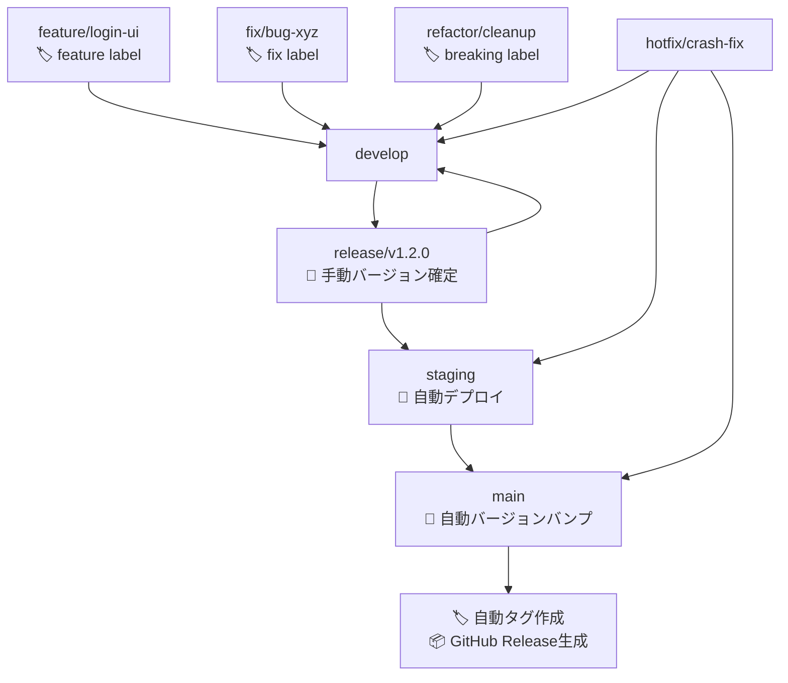

# 作業計画: ブランチ同期とガードレール設定

**作成日**: 2025-10-29
**予定工数**: 0.5人日
**完了予定**: 2025-10-29
**ブランチ**: feature/branch-sync-and-guardrails

---

## 📋 要求・要件

### ユーザー要求
1. **mainブランチを正として、stagingブランチをmainブランチに同期させる**
2. **mainブランチを正として、developブランチをmainブランチに同期させる**
3. **CLAUDE.mdに記載のある標準マージフローが徹底できるようにガードレールを設定する**

### 機能要件
1. ブランチ同期の確実な実行
2. GitHub Branch Protection Rulesの設定
3. 直push/直マージを防止するガードレール設置
4. CLAUDE.mdの標準マージフローの徹底

### 非機能要件
- 安全性: バックアップ確保、ロールバック可能
- 追跡性: 全変更をPRで記録
- 一貫性: CLAUDE.mdのブランチ戦略に完全準拠

---

## 📚 参考ドキュメント

**必須参照**:
- [x] [CLAUDE.md - ブランチ構成](../../CLAUDE.md#L37-L95)
- [x] [CLAUDE.md - 標準マージフロー](../../CLAUDE.md#L96-L132)

**推奨参照**:
- [ ] [GitHub Branch Protection Rules](https://docs.github.com/en/repositories/configuring-branches-and-merges-in-your-repository/managing-protected-branches/about-protected-branches)

---

## 🔍 現状分析

### ブランチ状態（2025-10-29時点）

| ブランチ | 最新コミット | 状態 | mainとの差分 |
|---------|------------|------|------------|
| **main** | `8fea368` 🔖 Multi-project release v2025.10.29 | ✅ 最新 | - |
| **staging** | `8fea368` 🔖 Multi-project release v2025.10.29 | ✅ 同期済み | 0コミット |
| **develop** | `5201e4b` fix(ci): fix commonUI Docker health check | ⚠️ 遅れ | -1コミット |

### 欠けているコミット（develop）
```
8fea368 🔖 Multi-project release v2025.10.29
```

### Branch Protection現状
- **main**: ❌ 保護なし（直push可能）
- **staging**: ❌ 保護なし（直push可能）
- **release/***: ❌ 保護なし

### 課題
1. ✅ **staging**: 既にmainと同期済み（対応不要）
2. ⚠️ **develop**: mainより1コミット遅れ（同期必要）
3. ❌ **Branch Protection**: 未設定（CLAUDE.mdの禁止事項が強制されていない）

---

## 📊 Phase分解

### Phase 1: stagingブランチ同期確認（5分）
- [x] staging = mainであることを確認
- [x] **結果**: 既に同期済み（`8fea368`）

**判定**: ✅ 対応不要

---

### Phase 2: developブランチ同期（15分）

#### 目的
developブランチをmainブランチと同期させる（fast-forward）

#### 手順
```bash
# 1. developブランチをチェックアウト
git checkout develop

# 2. mainブランチをマージ（fast-forward）
git merge main --ff-only

# 3. リモートにプッシュ
git push origin develop
```

#### 想定される結果
```
Updating 5201e4b..8fea368
Fast-forward
 (変更内容)
```

#### リスク
- **低**: fast-forwardマージのため、コンフリクトなし
- **バックアップ**: 不要（fast-forwardは巻き戻し可能）

---

### Phase 3: ガードレール設定（1時間）

#### 目的
CLAUDE.mdの標準マージフローを強制するガードレールを設定

#### 3-1: GitHub Branch Protection Rules設定

**対象ブランチ**: `main`, `staging`, `release/*`

**設定内容**:

| 設定項目 | main | staging | release/* | 根拠（CLAUDE.md） |
|---------|------|---------|----------|-----------------|
| **Require pull request before merging** | ✅ | ✅ | ✅ | L60-61: PRを通じて行うことを厳守 |
| **Require approvals** | 1 | 0 | 0 | mainは本番環境のため厳密化 |
| **Dismiss stale pull request approvals** | ✅ | - | - | mainの品質担保 |
| **Require status checks to pass** | ✅ | - | - | CI/CD品質チェック必須 |
| **Require branches to be up to date** | ✅ | - | - | 最新状態でマージ |
| **Do not allow bypassing** | ✅ | ✅ | ✅ | L92: 例外はチーム責任者承認必須 |
| **Restrict who can push** | Admin only | Admin only | Admin only | L89: 直push禁止 |

**設定コマンド**:
```bash
# mainブランチ保護設定
gh api repos/Kewton/MySwiftAgent/branches/main/protection \
  -X PUT \
  -H "Accept: application/vnd.github+json" \
  -f required_status_checks='{"strict":true,"contexts":["CI - Main Branch Quality Check"]}' \
  -f enforce_admins=true \
  -f required_pull_request_reviews='{"required_approving_review_count":1,"dismiss_stale_reviews":true}' \
  -f restrictions=null

# stagingブランチ保護設定
gh api repos/Kewton/MySwiftAgent/branches/staging/protection \
  -X PUT \
  -H "Accept: application/vnd.github+json" \
  -f required_status_checks=null \
  -f enforce_admins=true \
  -f required_pull_request_reviews='{"required_approving_review_count":0}' \
  -f restrictions=null
```

#### 3-2: GitHub Actions Workflow追加（オプション）

**目的**: PRを介さないマージを検知・拒否

**ワークフロー**: `.github/workflows/branch-protection-check.yml`

```yaml
name: Branch Protection Check
on:
  push:
    branches:
      - main
      - staging
      - 'release/**'

jobs:
  check-merge:
    runs-on: ubuntu-latest
    steps:
      - name: Check if push was via PR
        run: |
          if [ -z "${{ github.event.pull_request }}" ]; then
            echo "❌ Direct push detected! All merges must go through Pull Requests."
            echo "See CLAUDE.md L87-90 for branch merge policy."
            exit 1
          fi
```

**注**: GitHub Branch Protection Rulesで既に直pushを禁止するため、このワークフローは補助的な役割。

---

### Phase 4: 検証・ドキュメント作成（30分）

#### 検証項目
- [ ] mainへの直pushが拒否されることを確認
- [ ] stagingへの直pushが拒否されることを確認
- [ ] developブランチがmainと同期されていることを確認
- [ ] Branch Protection Rules設定を確認

#### ドキュメント作成
- [ ] `phase-1-progress.md`: staging同期確認結果
- [ ] `phase-2-progress.md`: develop同期結果
- [ ] `phase-3-progress.md`: ガードレール設定結果
- [ ] `final-report.md`: 最終作業報告

---

## ✅ 制約条件チェック結果

### コード品質原則
- [x] SOLID原則: N/A（コード変更なし）
- [x] KISS原則: 遵守 / シンプルなブランチ同期とガードレール設定
- [x] YAGNI原則: 遵守 / 必要最小限の保護設定のみ
- [x] DRY原則: N/A（コード変更なし）

### アーキテクチャガイドライン
- [x] architecture-overview.md: N/A（インフラ設定のみ）
- [x] CLAUDE.md ブランチ戦略: 完全準拠

### 設定管理ルール
- [x] 環境変数: N/A
- [x] myVault: N/A

### 品質担保方針
- [x] 単体テスト: N/A（コード変更なし）
- [x] 結合テスト: N/A（コード変更なし）
- [x] Ruff linting: N/A
- [x] MyPy type checking: N/A

### CI/CD準拠
- [ ] PRラベル: `ci` ラベルを付与予定（インフラ設定）
- [x] コミットメッセージ: `ci: setup branch protection and sync branches` を予定
- [ ] pre-push-check-all.sh: 実行予定（Markdown変更のみのため軽量）

### 参照ドキュメント遵守
- [x] CLAUDE.md ブランチ構成: L37-L95 準拠
- [x] CLAUDE.md 標準マージフロー: L96-L132 準拠

### 違反・要検討項目
なし

---

## 📅 スケジュール

| Phase | 開始予定 | 完了予定 | 所要時間 | 状態 |
|-------|---------|---------|---------|------|
| **Phase 1** | 即時 | 即時 | 5分 | ✅ 完了 |
| **Phase 2** | 10/29 10:00 | 10/29 10:15 | 15分 | 予定 |
| **Phase 3** | 10/29 10:15 | 10/29 11:15 | 1時間 | 予定 |
| **Phase 4** | 10/29 11:15 | 10/29 11:45 | 30分 | 予定 |

**総所要時間**: 約1時間50分（実質作業時間: 約1.5時間）

---

## 🔒 安全性確保

### ロールバック手順

#### developブランチのロールバック
```bash
# developを元の状態に戻す
git checkout develop
git reset --hard 5201e4b
git push origin develop --force
```

#### Branch Protection解除
```bash
# mainブランチ保護解除
gh api repos/Kewton/MySwiftAgent/branches/main/protection -X DELETE

# stagingブランチ保護解除
gh api repos/Kewton/MySwiftAgent/branches/staging/protection -X DELETE
```

---

## 📝 期待される効果

### Before（現状）
- ❌ main, stagingへの直push可能（CLAUDE.md違反）
- ❌ PRを介さないマージが可能（CLAUDE.md違反）
- ⚠️ developブランチがmainより遅れ（1コミット）

### After（実施後）
- ✅ main, stagingへの直push禁止（CLAUDE.md準拠）
- ✅ 全マージがPR経由に強制（CLAUDE.md準拠）
- ✅ develop = main = staging（全ブランチ同期）
- ✅ 標準マージフローの徹底

---

## 🎯 成功基準

1. ✅ staging = main（既に達成）
2. ✅ develop = main（Phase 2で達成）
3. ✅ Branch Protection Rules設定完了
4. ✅ 直push拒否の動作確認完了
5. ✅ ドキュメント作成完了

---

## 💡 備考

### CLAUDE.md標準マージフロー（L98-L123）



このフローを強制するため、以下を実施:
1. ✅ main, staging, release/*への直push禁止
2. ✅ PRレビュー必須（mainのみ）
3. ✅ CI/CD品質チェック必須（mainのみ）

---

## 📞 承認待ち

以下の作業計画について、承認をお願いします:

### 実施内容
1. ✅ **Phase 1**: staging同期確認（既に同期済み）
2. 🔄 **Phase 2**: developをmainにfast-forwardマージ
3. 🔄 **Phase 3**: GitHub Branch Protection Rules設定（main, staging, release/*）
4. 🔄 **Phase 4**: 検証・ドキュメント作成

### 選択肢
1. ✅ **全Phase実施を承認** → Phase 2から順次実行
2. ⚠️ **Phase 2のみ実施** → developブランチ同期のみ
3. ⚠️ **Phase 3のみ実施** → ガードレール設定のみ
4. ❌ **計画の見直し** → 修正点を指摘

**推奨**: オプション1（全Phase実施）
