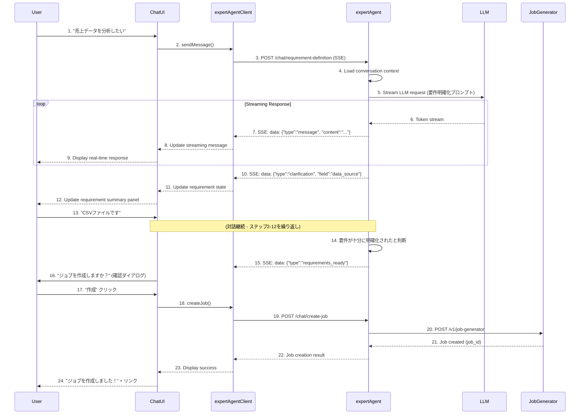

# Phase 1 設計方針: 自然言語ジョブ作成UI

**Issue**: #120
**Phase**: Phase 1
**作成日**: 2025-01-30
**ブランチ**: feature/issue/120
**担当**: Claude Code

---

## 📋 Phase 1 概要

### 目的

ドメインエキスパートが**自然言語のチャット対話**を通じて、プログラミング知識なしでジョブを作成できる基盤UIを実装する。

### 範囲

**実装する要件**:
- ✅ 要件1: 自然言語によるジョブ要件定義（チャット対話UI）
- ✅ 要件2: What重視のジョブ作成（expertAgent Job Generator連携）

**実装するコンポーネント**:
- ✅ myAgentDesk: チャットUIコンポーネント（SvelteKit）
- ✅ myAgentDesk: expertAgent APIクライアント
- ✅ expertAgent: チャット対話API（ストリーミング対応）
- ✅ expertAgent: 要件明確化プロンプトテンプレート

### 期待される成果

**ユーザー視点**:
1. 曖昧な要求からスタート可能（例: "売上データを分析したい"）
2. AIとの対話を通じて要件が段階的に明確化
3. 最終的にJob Generatorが自動でジョブを作成
4. 実装詳細（How）を意識せず、目的（What）に集中できる

**技術的成果物**:
- チャットUIコンポーネント（Svelte）
- expertAgent チャット対話API（FastAPI + SSE）
- 要件明確化プロンプトテンプレート（Jinja2）
- APIクライアント（TypeScript）

---

## 🏗️ アーキテクチャ設計

### システム構成図

```
┌─────────────────────────────────────────────────────────────┐
│ myAgentDesk (Frontend - SvelteKit)                          │
│                                                              │
│  ┌──────────────────────────────────────────────────────┐  │
│  │ Chat UI Component                                     │  │
│  │  - Message List (user/assistant bubbles)            │  │
│  │  - Input Area (Textarea + Send button)              │  │
│  │  - Streaming Message Display                        │  │
│  │  - Requirement Summary Panel (サイドバー)            │  │
│  └──────────────────────────────────────────────────────┘  │
│                           │                                  │
│                           ▼                                  │
│  ┌──────────────────────────────────────────────────────┐  │
│  │ expertAgentClient (TypeScript)                       │  │
│  │  - SSE Connection Management                         │  │
│  │  - Message Stream Parsing                            │  │
│  │  - Error Handling & Retry                            │  │
│  └──────────────────────────────────────────────────────┘  │
└─────────────────────────────────────────────────────────────┘
                           │
                           │ SSE (Server-Sent Events)
                           │ POST /aiagent-api/v1/chat/requirement-definition
                           ▼
┌─────────────────────────────────────────────────────────────┐
│ expertAgent (Backend - FastAPI)                             │
│                                                              │
│  ┌──────────────────────────────────────────────────────┐  │
│  │ Chat Endpoints (app/api/v1/chat_endpoints.py)        │  │
│  │  - POST /requirement-definition                      │  │
│  │  - SSE Response Generator                            │  │
│  └──────────────────────────────────────────────────────┘  │
│                           │                                  │
│                           ▼                                  │
│  ┌──────────────────────────────────────────────────────┐  │
│  │ Requirement Clarification Service                    │  │
│  │  - Conversation State Management (Redis/Memory)      │  │
│  │  - LLM Invocation (Gemini/Claude with streaming)    │  │
│  │  - Requirement Extraction & Validation              │  │
│  └──────────────────────────────────────────────────────┘  │
│                           │                                  │
│                           ▼                                  │
│  ┌──────────────────────────────────────────────────────┐  │
│  │ Prompt Templates (prompts/requirement_clarification) │  │
│  │  - System Prompt: 要件明確化の役割定義               │  │
│  │  - User Prompt: 対話コンテキスト生成                 │  │
│  │  - Structured Output: RequirementState schema        │  │
│  └──────────────────────────────────────────────────────┘  │
│                           │                                  │
│                           ▼                                  │
│  ┌──────────────────────────────────────────────────────┐  │
│  │ Job Generator Integration                            │  │
│  │  - Requirements → Job Generator Request変換          │  │
│  │  - 既存 /v1/job-generator API呼び出し                │  │
│  └──────────────────────────────────────────────────────┘  │
└─────────────────────────────────────────────────────────────┘
```

### データフロー



---

## 🎨 UI/UX設計

### チャットUI構成

#### レイアウト

```
┌────────────────────────────────────────────────────────────────┐
│ myAgentDesk - ジョブ作成                                        │
├────────────────────────────────────────────────────────────────┤
│ ┌─ Chat Area (70%) ──────────┐ ┌─ Requirement Panel (30%) ─┐ │
│ │                             │ │                            │ │
│ │ 🤖 AI Assistant             │ │ 📋 要件サマリー            │ │
│ │ こんにちは！どのようなジョブ │ │                            │ │
│ │ を作成しますか？             │ │ ● データソース: 未定       │ │
│ │                             │ │ ● 処理内容: 未定           │ │
│ │ 👤 You                      │ │ ● 出力形式: 未定           │ │
│ │ 売上データを分析したい       │ │ ● スケジュール: 未定       │ │
│ │                             │ │                            │ │
│ │ 🤖 AI Assistant (streaming) │ │ 🎯 明確化率: 25%           │ │
│ │ かしこまりました。どのような │ │ (1/4項目が明確)           │ │
│ │ 形式の売上データですか？▋   │ │                            │ │
│ │                             │ │ [ジョブ作成] (無効)       │ │
│ │                             │ │                            │ │
│ │                             │ │                            │ │
│ │                             │ │                            │ │
│ │                             │ │                            │ │
│ ├─────────────────────────────┤ └────────────────────────────┘ │
│ │ 💬 メッセージを入力...       │                              │ │
│ │                        [送信]│                              │ │
│ └─────────────────────────────┘                              │ │
└────────────────────────────────────────────────────────────────┘
```

#### コンポーネント設計

##### 1. JobCreationChat.svelte (親コンポーネント)

**責務**: 全体レイアウト、状態管理

```typescript
<script lang="ts">
  import ChatMessageList from '$lib/components/chat/ChatMessageList.svelte';
  import ChatInput from '$lib/components/chat/ChatInput.svelte';
  import RequirementPanel from '$lib/components/chat/RequirementPanel.svelte';
  import { expertAgentClient } from '$lib/services/expertAgentClient';
  import type { Message, RequirementState } from '$lib/types/chat';

  let messages: Message[] = [];
  let requirementState: RequirementState = {
    data_source: null,
    process_description: null,
    output_format: null,
    schedule: null,
    completeness: 0
  };
  let isStreaming = false;
  let conversationId = crypto.randomUUID();

  async function handleSendMessage(content: string) {
    // ユーザーメッセージを追加
    messages = [...messages, { role: 'user', content, timestamp: new Date() }];

    // AI応答をストリーミング受信
    isStreaming = true;
    let assistantMessage: Message = { role: 'assistant', content: '', timestamp: new Date() };
    messages = [...messages, assistantMessage];

    try {
      await expertAgentClient.streamRequirementChat({
        conversationId,
        userMessage: content,
        previousMessages: messages.slice(0, -1),
        currentRequirements: requirementState,
        onMessage: (chunk) => {
          // ストリーミング更新
          assistantMessage.content += chunk;
          messages = [...messages];
        },
        onRequirementUpdate: (newState) => {
          requirementState = newState;
        }
      });
    } catch (error) {
      console.error('Chat error:', error);
      assistantMessage.content = 'エラーが発生しました。もう一度お試しください。';
      messages = [...messages];
    } finally {
      isStreaming = false;
    }
  }

  async function handleCreateJob() {
    const result = await expertAgentClient.createJobFromRequirements({
      conversationId,
      requirements: requirementState
    });
    // ジョブ作成成功 → 詳細ページへ遷移
    goto(`/jobs/${result.job_id}`);
  }
</script>

<div class="grid grid-cols-[1fr_400px] gap-4 h-screen">
  <div class="flex flex-col">
    <ChatMessageList {messages} {isStreaming} />
    <ChatInput onSend={handleSendMessage} disabled={isStreaming} />
  </div>
  <RequirementPanel
    {requirementState}
    onCreateJob={handleCreateJob}
    createDisabled={requirementState.completeness < 0.8}
  />
</div>
```

##### 2. ChatMessageList.svelte

**責務**: メッセージ一覧表示、自動スクロール

```typescript
<script lang="ts">
  import ChatBubble from '$lib/components/ChatBubble.svelte';
  import type { Message } from '$lib/types/chat';

  export let messages: Message[];
  export let isStreaming: boolean;

  let messagesContainer: HTMLDivElement;

  $: if (messages.length > 0) {
    // 新しいメッセージが追加されたら自動スクロール
    setTimeout(() => {
      messagesContainer?.scrollTo({
        top: messagesContainer.scrollHeight,
        behavior: 'smooth'
      });
    }, 100);
  }
</script>

<div bind:this={messagesContainer} class="flex-1 overflow-y-auto p-4 space-y-4">
  {#each messages as message}
    <ChatBubble
      role={message.role}
      message={message.content}
      timestamp={message.timestamp.toLocaleTimeString()}
    />
  {/each}

  {#if isStreaming}
    <div class="flex items-center gap-2 text-gray-400">
      <div class="animate-pulse">💭</div>
      <span>AI is thinking...</span>
    </div>
  {/if}
</div>
```

##### 3. ChatInput.svelte

**責務**: ユーザー入力、送信

```typescript
<script lang="ts">
  export let onSend: (content: string) => void;
  export let disabled: boolean = false;

  let inputValue = '';

  function handleSubmit() {
    if (inputValue.trim() && !disabled) {
      onSend(inputValue.trim());
      inputValue = '';
    }
  }

  function handleKeydown(e: KeyboardEvent) {
    if (e.key === 'Enter' && !e.shiftKey) {
      e.preventDefault();
      handleSubmit();
    }
  }
</script>

<div class="p-4 border-t border-gray-200 dark:border-gray-700">
  <div class="flex gap-2">
    <textarea
      bind:value={inputValue}
      on:keydown={handleKeydown}
      placeholder="メッセージを入力... (Shift+Enterで改行)"
      class="flex-1 px-4 py-2 border rounded-lg resize-none"
      rows="3"
      {disabled}
    />
    <button
      on:click={handleSubmit}
      disabled={disabled || !inputValue.trim()}
      class="px-6 py-2 bg-primary-500 text-white rounded-lg hover:bg-primary-600 disabled:opacity-50"
    >
      送信
    </button>
  </div>
</div>
```

##### 4. RequirementPanel.svelte

**責務**: 要件サマリー表示、ジョブ作成ボタン

```typescript
<script lang="ts">
  import type { RequirementState } from '$lib/types/chat';

  export let requirementState: RequirementState;
  export let onCreateJob: () => void;
  export let createDisabled: boolean;

  $: completenessPercent = Math.round(requirementState.completeness * 100);
  $: requiredFields = [
    { label: 'データソース', value: requirementState.data_source },
    { label: '処理内容', value: requirementState.process_description },
    { label: '出力形式', value: requirementState.output_format },
    { label: 'スケジュール', value: requirementState.schedule }
  ];
</script>

<div class="p-4 border-l border-gray-200 dark:border-gray-700 overflow-y-auto">
  <h2 class="text-xl font-bold mb-4">📋 要件サマリー</h2>

  <div class="space-y-4 mb-6">
    {#each requiredFields as field}
      <div>
        <div class="flex items-center gap-2 mb-1">
          {#if field.value}
            <span class="text-green-500">✓</span>
          {:else}
            <span class="text-gray-400">○</span>
          {/if}
          <span class="font-semibold">{field.label}</span>
        </div>
        <p class="ml-6 text-sm text-gray-600 dark:text-gray-400">
          {field.value || '未定'}
        </p>
      </div>
    {/each}
  </div>

  <div class="mb-6">
    <div class="flex items-center justify-between mb-2">
      <span class="text-sm font-semibold">🎯 明確化率</span>
      <span class="text-sm">{completenessPercent}%</span>
    </div>
    <div class="w-full bg-gray-200 rounded-full h-2">
      <div
        class="bg-primary-500 h-2 rounded-full transition-all"
        style="width: {completenessPercent}%"
      />
    </div>
  </div>

  <button
    on:click={onCreateJob}
    disabled={createDisabled}
    class="w-full py-3 bg-primary-500 text-white rounded-lg hover:bg-primary-600 disabled:opacity-50 disabled:cursor-not-allowed font-semibold"
  >
    {#if createDisabled}
      要件を明確にしてください ({completenessPercent}% / 80%必要)
    {:else}
      ジョブを作成
    {/if}
  </button>
</div>
```

---

## 🔧 技術選定

### フロントエンド (myAgentDesk)

#### SSEクライアント実装

**選定**: EventSource API (ネイティブブラウザAPI)

**理由**:
- ✅ ブラウザ標準API、追加ライブラリ不要
- ✅ 自動再接続機能
- ✅ CORS対応
- ❌ POST リクエスト非対応 → fetch-event-source で代替

**実装ライブラリ**: `@microsoft/fetch-event-source`

```bash
npm install @microsoft/fetch-event-source
```

**利点**:
- POST リクエスト対応（対話コンテキストを送信可能）
- カスタムヘッダー設定可能
- エラーハンドリング強化

#### TypeScript型定義

```typescript
// src/lib/types/chat.ts

export interface Message {
  role: 'user' | 'assistant';
  content: string;
  timestamp: Date;
}

export interface RequirementState {
  data_source: string | null;
  process_description: string | null;
  output_format: string | null;
  schedule: string | null;
  completeness: number;  // 0.0 - 1.0
}

export interface RequirementChatRequest {
  conversation_id: string;
  user_message: string;
  context: {
    previous_messages: Message[];
    current_requirements: RequirementState;
  };
}

export interface StreamEvent {
  type: 'message' | 'requirement_update' | 'requirements_ready' | 'done' | 'error';
  data?: any;
}
```

#### expertAgentClient実装

```typescript
// src/lib/services/expertAgentClient.ts

import { fetchEventSource } from '@microsoft/fetch-event-source';
import type { RequirementChatRequest, RequirementState, StreamEvent } from '$lib/types/chat';

class ExpertAgentClient {
  private baseUrl: string;

  constructor(baseUrl: string = 'http://localhost:8104') {
    this.baseUrl = baseUrl;
  }

  async streamRequirementChat(params: {
    conversationId: string;
    userMessage: string;
    previousMessages: Message[];
    currentRequirements: RequirementState;
    onMessage: (chunk: string) => void;
    onRequirementUpdate: (state: RequirementState) => void;
  }): Promise<void> {
    const request: RequirementChatRequest = {
      conversation_id: params.conversationId,
      user_message: params.userMessage,
      context: {
        previous_messages: params.previousMessages,
        current_requirements: params.currentRequirements
      }
    };

    await fetchEventSource(`${this.baseUrl}/aiagent-api/v1/chat/requirement-definition`, {
      method: 'POST',
      headers: {
        'Content-Type': 'application/json',
      },
      body: JSON.stringify(request),

      onopen: async (response) => {
        if (response.ok) {
          return;
        }
        throw new Error(`SSE connection failed: ${response.status}`);
      },

      onmessage: (event) => {
        if (event.data === '[DONE]') {
          return;
        }

        try {
          const streamEvent: StreamEvent = JSON.parse(event.data);

          switch (streamEvent.type) {
            case 'message':
              params.onMessage(streamEvent.data.content);
              break;

            case 'requirement_update':
              params.onRequirementUpdate(streamEvent.data.requirements);
              break;

            case 'requirements_ready':
              // 要件が十分に明確化された
              console.log('Requirements ready for job creation');
              break;

            case 'error':
              throw new Error(streamEvent.data.message);
          }
        } catch (error) {
          console.error('Failed to parse SSE event:', error);
        }
      },

      onerror: (error) => {
        console.error('SSE error:', error);
        throw error;
      }
    });
  }

  async createJobFromRequirements(params: {
    conversationId: string;
    requirements: RequirementState;
  }): Promise<{ job_id: string }> {
    const response = await fetch(`${this.baseUrl}/aiagent-api/v1/chat/create-job`, {
      method: 'POST',
      headers: {
        'Content-Type': 'application/json',
      },
      body: JSON.stringify({
        conversation_id: params.conversationId,
        requirements: params.requirements
      })
    });

    if (!response.ok) {
      throw new Error(`Failed to create job: ${response.status}`);
    }

    return await response.json();
  }
}

export const expertAgentClient = new ExpertAgentClient();
```

---

### バックエンド (expertAgent)

#### FastAPI SSE実装

**選定**: `sse_starlette`

```bash
cd expertAgent
uv add sse-starlette
```

**理由**:
- ✅ FastAPI公式推奨
- ✅ 非同期対応
- ✅ シンプルなAPI

#### LLMストリーミング

**選定**: 既存の `invoke_structured_llm` をストリーミング対応に拡張

**実装方針**:
- Gemini/Claude APIのストリーミングモードを使用
- `yield` を使った非同期ジェネレーター
- Pydantic構造化出力は最後にまとめてパース

#### 会話状態管理

**選定**: インメモリストア（Phase 1）→ Redis（Phase 2以降）

**理由**:
- Phase 1はシングルユーザー想定
- 認証機能なし
- スケールアウト不要

**実装**:
```python
# expertAgent/app/services/conversation_store.py

from typing import Dict, List
from datetime import datetime, timedelta

class ConversationStore:
    """インメモリ会話ストア（Phase 1用）"""

    def __init__(self, ttl_days: int = 7):
        self._conversations: Dict[str, Dict] = {}
        self._ttl = timedelta(days=ttl_days)

    def save_message(self, conversation_id: str, role: str, content: str):
        if conversation_id not in self._conversations:
            self._conversations[conversation_id] = {
                'messages': [],
                'created_at': datetime.now(),
                'updated_at': datetime.now()
            }

        self._conversations[conversation_id]['messages'].append({
            'role': role,
            'content': content,
            'timestamp': datetime.now()
        })
        self._conversations[conversation_id]['updated_at'] = datetime.now()

    def get_conversation(self, conversation_id: str) -> Dict:
        self._cleanup_expired()
        return self._conversations.get(conversation_id)

    def _cleanup_expired(self):
        now = datetime.now()
        expired = [
            cid for cid, conv in self._conversations.items()
            if now - conv['updated_at'] > self._ttl
        ]
        for cid in expired:
            del self._conversations[cid]

conversation_store = ConversationStore()
```

#### プロンプトテンプレート

**選定**: Jinja2（expertAgent既存統一）

**実装場所**: `expertAgent/aiagent/langgraph/jobTaskGeneratorAgents/prompts/requirement_clarification.py`

**プロンプト構成**:
```python
from pydantic import BaseModel, Field

class RequirementState(BaseModel):
    """要件明確化の状態"""
    data_source: str | None = Field(None, description="データソース（CSV, DB, API等）")
    process_description: str | None = Field(None, description="処理内容の説明")
    output_format: str | None = Field(None, description="出力形式（レポート、グラフ等）")
    schedule: str | None = Field(None, description="実行スケジュール（オンデマンド、定期等）")
    completeness: float = Field(0.0, description="要件明確化の進捗率（0.0-1.0）")

REQUIREMENT_CLARIFICATION_SYSTEM_PROMPT = """
あなたはドメインエキスパート向けのジョブ作成アシスタントです。

## あなたの役割
1. ユーザーの曖昧な要求を段階的に明確化する
2. 技術的な詳細ではなく、ビジネス上の目的（What）に焦点を当てる
3. 必要最小限の情報を収集し、実装方法（How）は自動で決定する

## 明確化すべき要件
- データソース: どのデータを使うか
- 処理内容: 何をしたいか（分析、レポート生成、通知等）
- 出力形式: どのような形式で結果が欲しいか
- スケジュール: いつ実行するか（オンデマンド、定期実行）

## 対話のガイドライン
- 一度に1つの質問をする（複数質問は避ける）
- 専門用語を避け、わかりやすい言葉を使う
- ユーザーが迷っている場合は選択肢を提示する
- 要件が十分に明確になったら、ジョブ作成を提案する

## completeness計算ルール
- data_source明確: +0.25
- process_description明確: +0.35（最重要）
- output_format明確: +0.25
- schedule明確: +0.15
- 合計0.8以上でジョブ作成可能
"""

def create_requirement_clarification_prompt(
    user_message: str,
    previous_messages: List[Dict],
    current_requirements: RequirementState
) -> str:
    """要件明確化プロンプトを生成"""

    # 対話履歴をフォーマット
    history = "\n".join([
        f"{msg['role']}: {msg['content']}"
        for msg in previous_messages
    ])

    # 現在の要件状態をフォーマット
    requirements_status = f"""
現在の要件明確化状態:
- データソース: {current_requirements.data_source or '未定'}
- 処理内容: {current_requirements.process_description or '未定'}
- 出力形式: {current_requirements.output_format or '未定'}
- スケジュール: {current_requirements.schedule or '未定'}
- 明確化率: {int(current_requirements.completeness * 100)}%
"""

    return f"""
{requirements_status}

## 対話履歴
{history}

## ユーザーの最新メッセージ
user: {user_message}

## あなたのタスク
1. ユーザーの最新メッセージから要件を抽出
2. 不明な点があれば1つ質問を返す
3. 要件が十分明確（80%以上）なら、ジョブ作成を提案
4. 更新された RequirementState を返す

応答してください。
"""
```

---

## 🔌 API設計

### expertAgent API仕様

#### 1. POST /aiagent-api/v1/chat/requirement-definition

**目的**: 要件明確化チャット（SSE）

**Request**:
```json
{
  "conversation_id": "uuid-string",
  "user_message": "売上データを分析したい",
  "context": {
    "previous_messages": [
      {"role": "assistant", "content": "こんにちは！どのようなジョブを作成しますか？"},
      {"role": "user", "content": "売上データを分析したい"}
    ],
    "current_requirements": {
      "data_source": null,
      "process_description": null,
      "output_format": null,
      "schedule": null,
      "completeness": 0.0
    }
  }
}
```

**Response (SSE)**:
```
data: {"type": "message", "data": {"content": "かしこまりました。"}}

data: {"type": "message", "data": {"content": "どのような形式の売上データですか？"}}

data: {"type": "requirement_update", "data": {"requirements": {"data_source": null, "process_description": "売上データの分析", "output_format": null, "schedule": null, "completeness": 0.35}}}

data: {"type": "done"}
```

**実装**:
```python
# expertAgent/app/api/v1/chat_endpoints.py

from fastapi import APIRouter, HTTPException
from sse_starlette.sse import EventSourceResponse
from pydantic import BaseModel
from typing import List, Dict
import json

router = APIRouter(prefix="/chat", tags=["chat"])

class RequirementChatRequest(BaseModel):
    conversation_id: str
    user_message: str
    context: Dict

@router.post("/requirement-definition")
async def requirement_definition(request: RequirementChatRequest):
    """要件明確化チャット（SSE）"""

    async def event_generator():
        try:
            # 会話履歴を保存
            conversation_store.save_message(
                request.conversation_id,
                'user',
                request.user_message
            )

            # LLMストリーミング呼び出し
            current_requirements = RequirementState(**request.context['current_requirements'])

            full_response = ""
            async for chunk in stream_requirement_clarification(
                user_message=request.user_message,
                previous_messages=request.context['previous_messages'],
                current_requirements=current_requirements
            ):
                if chunk['type'] == 'message':
                    full_response += chunk['data']['content']
                    yield {
                        "event": "message",
                        "data": json.dumps(chunk, ensure_ascii=False)
                    }
                elif chunk['type'] == 'requirement_update':
                    yield {
                        "event": "message",
                        "data": json.dumps(chunk, ensure_ascii=False)
                    }

            # 応答を保存
            conversation_store.save_message(
                request.conversation_id,
                'assistant',
                full_response
            )

            yield {
                "event": "message",
                "data": json.dumps({"type": "done"}, ensure_ascii=False)
            }

        except Exception as e:
            yield {
                "event": "message",
                "data": json.dumps({
                    "type": "error",
                    "data": {"message": str(e)}
                }, ensure_ascii=False)
            }

    return EventSourceResponse(event_generator())
```

#### 2. POST /aiagent-api/v1/chat/create-job

**目的**: 明確化された要件からジョブ作成

**Request**:
```json
{
  "conversation_id": "uuid-string",
  "requirements": {
    "data_source": "CSVファイル",
    "process_description": "売上データを月別に集計し、前年同月比を計算",
    "output_format": "Excelレポート",
    "schedule": "毎月1日の朝9時",
    "completeness": 0.95
  }
}
```

**Response**:
```json
{
  "job_id": "job_12345",
  "job_master_id": "jm_12345",
  "status": "success",
  "message": "ジョブを作成しました"
}
```

**実装**:
```python
@router.post("/create-job")
async def create_job(request: CreateJobRequest):
    """要件からジョブ作成"""

    # 要件を Job Generator リクエストに変換
    job_generator_request = convert_requirements_to_job_request(request.requirements)

    # 既存 Job Generator API呼び出し
    from app.api.v1.job_generator_endpoints import job_generator_endpoint

    result = await job_generator_endpoint(job_generator_request)

    return {
        "job_id": result["job_id"],
        "job_master_id": result["job_master_id"],
        "status": "success",
        "message": "ジョブを作成しました"
    }

def convert_requirements_to_job_request(requirements: RequirementState) -> Dict:
    """要件を Job Generator リクエストに変換"""

    # 自然言語要件を user_requirement に変換
    user_requirement = f"""
## データソース
{requirements.data_source}

## 処理内容
{requirements.process_description}

## 出力形式
{requirements.output_format}

## スケジュール
{requirements.schedule}
"""

    return {
        "user_requirement": user_requirement,
        "available_capabilities": []  # 既存の全機能を使用
    }
```

---

## 🛡️ エラーハンドリング

### フロントエンド

#### SSE接続エラー

```typescript
// 自動リトライロジック
async streamRequirementChat(...) {
  let retryCount = 0;
  const maxRetries = 3;

  while (retryCount < maxRetries) {
    try {
      await fetchEventSource(..., {
        onopen: async (response) => {
          if (!response.ok) {
            // HTTPエラー
            if (response.status >= 500) {
              // サーバーエラー → リトライ
              throw new Error('Server error');
            } else {
              // クライアントエラー → リトライしない
              throw new FatalError('Client error');
            }
          }
        },
        onerror: (error) => {
          // ネットワークエラー → リトライ
          retryCount++;
          if (retryCount >= maxRetries) {
            throw error;
          }
          // 指数バックオフ
          return Math.min(1000 * Math.pow(2, retryCount), 10000);
        }
      });
      break;  // 成功したらループ終了
    } catch (error) {
      if (error instanceof FatalError) {
        throw error;  // リトライしない
      }
      // 最後のリトライでも失敗
      if (retryCount >= maxRetries) {
        throw error;
      }
    }
  }
}
```

#### タイムアウト処理

```typescript
const STREAM_TIMEOUT = 60000;  // 60秒

const timeoutId = setTimeout(() => {
  controller.abort();
  throw new Error('Stream timeout');
}, STREAM_TIMEOUT);

// ストリーミング完了時
clearTimeout(timeoutId);
```

### バックエンド

#### LLMエラーハンドリング

```python
async def stream_requirement_clarification(...):
    try:
        async for chunk in llm_stream(...):
            yield {"type": "message", "data": {"content": chunk}}
    except LLMRateLimitError as e:
        yield {
            "type": "error",
            "data": {"message": "API制限に達しました。しばらくお待ちください。"}
        }
    except LLMTimeoutError as e:
        yield {
            "type": "error",
            "data": {"message": "応答がタイムアウトしました。もう一度お試しください。"}
        }
    except Exception as e:
        logger.error(f"Unexpected error in stream_requirement_clarification: {e}")
        yield {
            "type": "error",
            "data": {"message": "予期しないエラーが発生しました。"}
        }
```

---

## 🧪 テスト方針

### フロントエンドテスト

#### 単体テスト（Vitest）

**対象**: expertAgentClient

```typescript
// src/lib/services/expertAgentClient.test.ts

import { describe, it, expect, vi } from 'vitest';
import { expertAgentClient } from './expertAgentClient';

describe('expertAgentClient', () => {
  it('should handle streaming messages', async () => {
    const mockOnMessage = vi.fn();

    // fetchEventSource をモック
    // ... テスト実装
  });

  it('should handle requirement updates', async () => {
    // ...
  });
});
```

**カバレッジ目標**: 80%以上

#### コンポーネントテスト（@testing-library/svelte）

**対象**:
- ChatMessageList.svelte
- ChatInput.svelte
- RequirementPanel.svelte

```typescript
// src/lib/components/chat/ChatInput.test.ts

import { render, fireEvent } from '@testing-library/svelte';
import ChatInput from './ChatInput.svelte';

describe('ChatInput', () => {
  it('should call onSend when submit button clicked', async () => {
    const mockOnSend = vi.fn();
    const { getByRole, getByPlaceholderText } = render(ChatInput, {
      props: { onSend: mockOnSend, disabled: false }
    });

    const textarea = getByPlaceholderText('メッセージを入力...');
    await fireEvent.input(textarea, { target: { value: 'Test message' } });

    const button = getByRole('button', { name: '送信' });
    await fireEvent.click(button);

    expect(mockOnSend).toHaveBeenCalledWith('Test message');
  });
});
```

### バックエンドテスト

#### 単体テスト（pytest）

**対象**:
- conversation_store
- requirement_clarification プロンプト生成
- convert_requirements_to_job_request

```python
# expertAgent/tests/unit/test_conversation_store.py

import pytest
from app.services.conversation_store import ConversationStore

def test_save_and_retrieve_message():
    store = ConversationStore(ttl_minutes=60)

    store.save_message('conv_001', 'user', 'Hello')
    conv = store.get_conversation('conv_001')

    assert len(conv['messages']) == 1
    assert conv['messages'][0]['role'] == 'user'
    assert conv['messages'][0]['content'] == 'Hello'
```

**カバレッジ目標**: 90%以上

#### 結合テスト（pytest + httpx）

**対象**: Chat endpoints

```python
# expertAgent/tests/integration/test_chat_endpoints.py

import pytest
from httpx import AsyncClient

@pytest.mark.asyncio
async def test_requirement_definition_sse(client: AsyncClient):
    request = {
        "conversation_id": "test_conv_001",
        "user_message": "売上データを分析したい",
        "context": {
            "previous_messages": [],
            "current_requirements": {
                "data_source": None,
                "process_description": None,
                "output_format": None,
                "schedule": None,
                "completeness": 0.0
            }
        }
    }

    async with client.stream(
        "POST",
        "/aiagent-api/v1/chat/requirement-definition",
        json=request
    ) as response:
        assert response.status_code == 200
        assert response.headers["content-type"] == "text/event-stream"

        events = []
        async for line in response.aiter_lines():
            if line.startswith("data: "):
                events.append(line[6:])

        assert len(events) > 0
        assert "message" in events[0] or "requirement_update" in events[0]
```

### E2Eテスト（手動確認 - Phase 1）

**シナリオ**:
1. ユーザーが「売上データを分析したい」と入力
2. AIが「どのような形式の売上データですか？」と質問
3. ユーザーが「CSVファイルです」と回答
4. ... (対話継続)
5. 要件が80%以上明確化されたら「ジョブを作成」ボタンが有効化
6. ジョブ作成成功 → ジョブ詳細ページへ遷移

**確認項目**:
- ✅ ストリーミング応答がリアルタイム表示される
- ✅ 要件パネルが更新される
- ✅ 明確化率が正しく計算される
- ✅ エラー時の挙動（リトライ、エラーメッセージ表示）

---

## ✅ 制約条件チェック

### CLAUDE.md 参照ドキュメント

**必須参照**:
- [x] myAgentDeskは既存プロジェクト
- [x] expertAgentは既存プロジェクト

**推奨参照**:
- [x] [アーキテクチャ概要](../../docs/design/architecture-overview.md) - UI層とAPI層の分離
- [x] [環境変数管理](../../docs/design/environment-variables.md) - expertAgent API URL

### コード品質原則

- [x] **SOLID原則**:
  - 単一責任: ChatMessageList, ChatInput, RequirementPanelは独立
  - 依存性逆転: expertAgentClientを介してAPI通信
- [x] **KISS原則**: SSE実装はシンプルに（fetch-event-source使用）
- [x] **YAGNI原則**: 認証機能は実装しない（Phase 5以降）
- [x] **DRY原則**: 既存ChatBubble.svelteを再利用

### アーキテクチャガイドライン

- [x] **レイヤー分離**: UI (Svelte) / API Client (TypeScript) / Backend (FastAPI)
- [x] **依存関係**: myAgentDesk → expertAgent（単方向）

### 設定管理ルール

- [x] **環境変数**: expertAgent API URLを.envで管理
  ```bash
  # myAgentDesk/.env
  PUBLIC_EXPERTAGENT_API_URL=http://localhost:8104
  ```

---

## 📊 工数見積もり

### myAgentDesk (Frontend)

| タスク | 工数 |
|--------|------|
| TypeScript型定義 | 1h |
| expertAgentClient実装 | 3-4h |
| ChatMessageList.svelte | 1h |
| ChatInput.svelte | 1h |
| RequirementPanel.svelte | 2h |
| JobCreationChat.svelte (親) | 2h |
| 単体テスト | 2h |
| E2Eテスト（手動） | 1h |
| **合計** | **13-14h** |

### expertAgent (Backend)

| タスク | 工数 |
|--------|------|
| conversation_store実装 | 1h |
| プロンプトテンプレート作成 | 2h |
| SSE endpoint実装 | 3-4h |
| LLMストリーミング統合 | 2h |
| create-job endpoint実装 | 1h |
| 単体テスト | 2h |
| 結合テスト | 2h |
| **合計** | **13-14h** |

### Phase 1 総工数

**26-28時間**（myAgentDesk 13-14h + expertAgent 13-14h）

---

## 🚧 既知の制約・リスク

### リスク1: LLMストリーミングの信頼性

**リスク内容**: LLM APIのストリーミングが不安定な場合、ユーザー体験が低下

**対策**:
- タイムアウト処理（60秒）
- 自動リトライ（最大3回）
- エラー時のフォールバック（非ストリーミングモード）

### リスク2: 要件明確化の精度

**リスク内容**: AIが適切な質問をできず、要件が明確化されない

**対策**:
- プロンプトテンプレートのA/Bテスト
- Few-shot examples追加
- ユーザーフィードバック収集（Phase 3で活用）

### リスク3: インメモリ会話ストアの制約

**リスク内容**: サーバー再起動で会話履歴が消える

**対策**:
- Phase 1では許容（開発環境のみ）
- Phase 2でRedis移行を計画
- ローカルストレージへのバックアップ（オプション）

---

## 🔄 次のステップ

1. **Phase 1設計方針レビュー** ← 今ここ
2. **Phase 1作業計画立案** (work-plan作成)
3. **Phase 1実装開始**

---

## 📝 レビュー観点

### 設計方針レビュー依頼事項

- [ ] **UI/UX設計**: チャットUIのレイアウトは適切か
- [ ] **技術選定**: fetch-event-sourceとsse_starletteは妥当か
- [ ] **API設計**: エンドポイント設計は適切か
- [ ] **エラーハンドリング**: リトライ・タイムアウト戦略は適切か
- [ ] **テスト方針**: カバレッジ目標（80-90%）は現実的か
- [ ] **工数見積もり**: 26-28時間は妥当か

### フィードバック反映（2025-01-30）

1. **会話履歴の保存期間**: ~~60分~~ → **7日** に変更
2. **ストリーミングタイムアウト**: 60秒 → **承認**
3. **要件明確化の閾値**: 80% → **承認**
4. **リトライ回数**: 最大3回 → **承認**

---

**レビューをお願いします。修正・追加要望があればお知らせください。**
