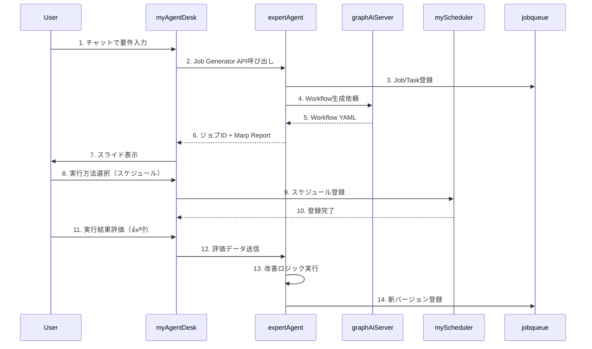

# 要件定義: myAgentDeskドメインエキスパート向けUI

**Issue**: #120
**作成日**: 2025-01-30
**ブランチ**: feature/issue/120
**担当**: Claude Code

---

## 📋 Issue概要

**タイトル**: myAgentDeskにドメインエキスパート向けUIを作成する

**目的**: myAgentDeskに、ドメインエキスパートが自然言語でジョブを定義・実行・改善できる高度なUI機能を追加する

---

## 🎯 ビジネス要求

### ユーザーペルソナ

**対象ユーザー**: ドメインエキスパート
- プログラミング知識は限定的
- 自分のやりたいこと（What）は明確にしたい
- 実現方法（How）にはそれほど興味がない
- 視覚的な情報理解を好む（スライド、図表）
- 試行錯誤しながら要件を明確化したい

### 解決すべき課題

1. **要件定義の困難さ**: 初期段階では自分のやりたいことが明確でない
2. **技術的な障壁**: プログラミングやワークフロー定義の知識が不要であるべき
3. **全体把握の難しさ**: テキストベースの情報では全体像を理解しにくい
4. **継続的改善の手間**: 人間が評価するだけでAIが自動改善してほしい
5. **版数管理の必要性**: ジョブとワークフローの変更履歴を追跡したい

---

## 📝 機能要件

### 要件1: 自然言語によるジョブ要件定義 (優先度: 高)

**要求**:
> チャットI/Fで自然言語でジョブの要件定義を実施したい。なぜなら初めは自分でのやりたいことが明確になっていないからだ。

**機能仕様**:
- **チャット形式の対話UI**
  - ユーザーが自然言語でやりたいことを入力
  - AIエージェントが質問を通じて要件を明確化
  - 対話履歴を保存し、いつでも振り返り可能

- **段階的な要件明確化**
  - 初期入力: 曖昧な要求でOK（例: "売上データを分析したい"）
  - AIの質問: データソース、分析の目的、期待する出力形式などを確認
  - 要件の可視化: 対話中に明確化された要件をリアルタイム表示

- **要件のドラフト保存**
  - 対話途中でも保存可能
  - 後から再開できる
  - 複数の要件案を並行検討可能

**期待される成果物**:
- ジョブ要件定義チャットコンポーネント
- 要件明確化プロンプトテンプレート
- 対話履歴管理機能

---

### 要件2: What重視のジョブ作成 (優先度: 高)

**要求**:
> チャットI/Fで自然言語でWhatを明確にするのみでジョブを作成したい。なぜなら、実現方法にはそれほど興味がないからだ。

**機能仕様**:
- **What（目的）の明確化**
  - 入力: "企業の売上レポートを生成したい"
  - 出力: AIが自動で実現方法（タスク分解、API選定、ワークフロー）を決定

- **How（実現方法）の自動決定**
  - expertAgent（Job Generator）との連携
  - 利用可能なAPI/機能から最適な組み合わせを自動選択
  - ユーザーは実装詳細を意識しない

- **What→Howの透明性**
  - 決定理由の表示（オプション）
  - 実現不可能な場合の代替案提示
  - 要求緩和提案（Marp Report連携）

**期待される成果物**:
- What入力フォーム/チャットUI
- expertAgent連携APIクライアント
- ジョブ作成結果表示コンポーネント

---

### 要件3: ジョブ実行方法の指定 (優先度: 中)

**要求**:
> チャットI/Fでジョブの実行方法（API公開のみか、スケジュール実行も行うか）を指定したい

**機能仕様**:
- **実行方法の選択UI**
  - オプション1: API公開のみ（On-demand実行）
  - オプション2: スケジュール実行（定期実行）
  - オプション3: 両方

- **スケジュール設定UI**
  - Cron式入力またはビジュアル選択
  - プレビュー機能（次回実行日時表示）
  - タイムゾーン設定

- **myScheduler連携**
  - スケジュール登録API呼び出し
  - 実行履歴の確認
  - スケジュール変更/停止機能

**期待される成果物**:
- 実行方法選択UI
- スケジュール設定コンポーネント
- myScheduler連携APIクライアント

---

### 要件4: スライド形式のジョブ概要表示 (優先度: 高)

**要求**:
> AIエージェントが作成したジョブの概要をスライド形式で把握したい。なぜなら、全体を理解するにはそれが一番速いインプット方法だからだ。

**機能仕様**:
- **Marpスライド表示**
  - expertAgent Marp Report API（既存: `/v1/marp-report`）との連携
  - ブラウザ内でスライド表示（Marp Viewer統合）
  - スライド操作: 前後移動、全画面表示、PDF/PNG出力

- **スライド内容**
  - タイトル: ジョブ名、作成日時
  - サマリー: ジョブの目的、タスク数、ステータス
  - タスク詳細: 各タスクの説明、入出力、API使用状況
  - 要求緩和提案: infeasible_tasksがある場合の代替案

- **インタラクティブ機能**
  - スライドから直接編集モードへ遷移
  - 特定タスクの詳細ページへリンク
  - 実行結果との比較表示

**期待される成果物**:
- Marp Viewer コンポーネント（SvelteKit）
- expertAgent Marp Report API連携
- スライド操作UI（ナビゲーション、エクスポート）

**技術選定候補**:
- **オプション1**: Marp CLI + iframe埋め込み
- **オプション2**: marp-core ライブラリ直接統合
- **オプション3**: サーバーサイドHTML生成 + 静的表示

---

### 要件5: 人間評価による自動改善 (優先度: 中)

**要求**:
> ジョブおよび各タスクの実行結果に対して人間が評価をするのみでAIエージェントが自動で改善してほしい。

**機能仕様**:
- **評価UI**
  - 実行結果ごとに評価ボタン（👍 Good / 👎 Bad）
  - コメント入力（任意）
  - 評価理由の選択肢（速度、精度、出力形式など）

- **評価データの蓄積**
  - 評価履歴の保存（ジョブID、タスクID、評価、コメント、タイムスタンプ）
  - 統計情報（Good率、改善回数、平均評価）

- **AIによる自動改善**
  - 評価データをexpertAgentにフィードバック
  - 低評価タスクの自動再生成
  - 改善提案の通知（Slack、メール）

**期待される成果物**:
- 評価UIコンポーネント
- 評価データ保存API
- expertAgent改善トリガー機能

**技術的課題**:
- 評価データの構造設計（どのレベルで評価するか）
- 改善ロジックの実装場所（expertAgent内 or 別サービス）
- フィードバックループの設計

---

### 要件6: 人間によるワークフロー編集 (優先度: 中)

**要求**:
> AIエージェントが作成したLLMワークフローを人間でも改善したい。

**機能仕様**:
- **ワークフロー可視化**
  - GraphAIワークフローのビジュアル表示
  - ノード間の依存関係を矢印で表示
  - ノードタイプごとの色分け

- **ワークフロー編集UI**
  - ノードの追加/削除
  - ノード設定の編集（プロンプト、モデル、パラメータ）
  - エッジの追加/削除（依存関係変更）

- **バリデーション**
  - 循環依存の検出
  - 必須パラメータのチェック
  - GraphAIスキーマ準拠の検証

- **保存とデプロイ**
  - 編集内容の保存
  - graphAiServerへのデプロイ
  - ロールバック機能

**期待される成果物**:
- ワークフローエディタコンポーネント（Dify風ノードエディタ）
- GraphAI YAML ⇔ JSON変換機能
- graphAiServer連携APIクライアント

**技術選定候補**:
- **オプション1**: React Flow / Svelte Flow（ノードエディタライブラリ）
- **オプション2**: D3.js カスタム実装
- **オプション3**: Mermaid.js（可視化のみ、編集は別UI）

---

### 要件7: 版数管理 (優先度: 低)

**要求**:
> タスクおよびLLMワークフローの版数管理をしたい

**機能仕様**:
- **バージョン履歴表示**
  - タスク定義の変更履歴
  - ワークフロー定義の変更履歴
  - 変更差分の表示（diff）

- **バージョン管理機能**
  - コミット（変更の保存）
  - タグ付け（v1.0.0形式）
  - ブランチ（実験的変更の並行管理）

- **ロールバック機能**
  - 過去バージョンへの復元
  - 特定バージョンのデプロイ
  - バージョン間の比較

**期待される成果物**:
- バージョン履歴UIコンポーネント
- 版数管理API（jobqueue拡張 or 新規サービス）
- Diff表示コンポーネント

**技術的課題**:
- 版数管理の実装方式（Git-like or DB-based）
- タスク/ワークフローの一意識別方法
- マイグレーション戦略

---

## 🏗️ システム構成（概要）

### 関連コンポーネント

```
myAgentDesk (Frontend - SvelteKit)
  ├── チャットUI（要件定義）
  ├── ジョブ作成UI（What入力）
  ├── Marpスライドビューアー
  ├── 評価UI（Good/Bad）
  ├── ワークフローエディタ
  └── バージョン履歴UI

expertAgent (Backend - FastAPI)
  ├── Job Generator（既存）
  ├── Marp Report API（既存: /v1/marp-report）
  └── 改善ループ機能（新規）

graphAiServer (Backend - FastAPI)
  ├── Workflow Executor（既存）
  └── Workflow Management API（拡張）

myScheduler (Backend - FastAPI)
  └── スケジュール管理API（既存）

jobqueue (Backend - FastAPI)
  ├── Job/Task管理（既存）
  └── 版数管理（拡張）
```

### API連携フロー



---

## 🎨 UI/UX要件

### デザイン原則

**継承**: OpenWebUI + Dify デザイン（Issue #68 既存実装）

**追加要素**:
1. **チャットUI強化** - ストリーミング応答、コードハイライト、Markdown対応
2. **スライドビューアー** - 全画面モード、ナビゲーション、エクスポート
3. **ワークフローエディタ** - Difyスタイルのノードベースエディタ
4. **評価UI** - シンプルな👍👎ボタン、コメント欄
5. **バージョン履歴** - GitHubスタイルの差分表示

### レスポンシブ対応

- **デスクトップ優先**: ワークフローエディタは大画面が必須
- **タブレット対応**: チャット、スライド閲覧は対応
- **モバイル**: 限定的サポート（閲覧のみ）

---

## 🔧 非機能要件

### パフォーマンス

- **チャット応答時間**: 1秒以内（LLMストリーミング）
- **ジョブ作成時間**: 10秒以内（expertAgent処理）
- **スライド生成時間**: 5秒以内（Marp Report API）
- **ワークフロー可視化**: 100ノードまで対応

### セキュリティ

- **認証**: 将来実装（Phase 5以降）
- **認可**: ジョブ所有者のみ編集可能
- **API通信**: HTTPS必須（本番環境）
- **機密情報**: 環境変数 + myVault管理

### 可用性

- **稼働率**: 99%以上（expertAgent依存）
- **バックアップ**: ジョブ定義の日次バックアップ
- **エラーハンドリング**: ユーザーフレンドリーなエラーメッセージ

---

## ✅ 制約条件チェック

### CLAUDE.md 参照ドキュメント

**必須参照**:
- [x] myAgentDeskは既存プロジェクト（NEW_PROJECT_SETUP.md 不要）
- [x] GraphAI ワークフロー開発: [GRAPHAI_WORKFLOW_GENERATION_RULES.md](../../graphAiServer/docs/GRAPHAI_WORKFLOW_GENERATION_RULES.md)

**推奨参照**:
- [x] [アーキテクチャ概要](../../docs/design/architecture-overview.md)
- [x] [環境変数管理](../../docs/design/environment-variables.md)
- [x] [myVault連携](../../docs/design/myvault-integration.md)

### コード品質原則

- [ ] **SOLID原則**: コンポーネント単一責任、依存性逆転
- [ ] **KISS原則**: 過度な抽象化を避ける
- [ ] **YAGNI原則**: 認証機能は将来実装、今は実装しない
- [ ] **DRY原則**: 既存コンポーネント（Button, Card）を再利用

### アーキテクチャガイドライン

- [ ] **レイヤー分離**: UI層（SvelteKit） / API連携層 / ビジネスロジック層
- [ ] **依存関係**: myAgentDesk → expertAgent, graphAiServer, myScheduler, jobqueue

### 設定管理ルール

- [ ] **環境変数**: expertAgent API URL、graphAiServer API URL
- [ ] **myVault**: 将来的なAPI認証キー管理

---

## 📊 実装優先度

### Phase 1: 基本チャット + Job作成（高優先度）

- [x] 要件1: 自然言語によるジョブ要件定義
- [x] 要件2: What重視のジョブ作成
- [x] expertAgent Job Generator API連携

**工数**: 8-10時間

### Phase 2: スライド表示 + 実行方法指定（高優先度）

- [x] 要件4: スライド形式のジョブ概要表示
- [x] 要件3: ジョブ実行方法の指定
- [x] Marp Viewer統合
- [x] myScheduler連携

**工数**: 6-8時間

### Phase 3: 評価・改善ループ（中優先度）

- [x] 要件5: 人間評価による自動改善
- [x] 評価UI + API
- [x] expertAgent改善ロジック

**工数**: 6-8時間

### Phase 4: ワークフロー編集（中優先度）

- [x] 要件6: 人間によるワークフロー編集
- [x] ワークフローエディタ実装
- [x] graphAiServer連携

**工数**: 10-12時間

### Phase 5: 版数管理（低優先度）

- [x] 要件7: タスクおよびLLMワークフローの版数管理
- [x] バージョン履歴UI
- [x] 版数管理API

**工数**: 6-8時間

---

## 🚧 技術的課題・リスク

### リスク1: Marp Viewer統合の複雑さ

**課題**: Marp SlideをSvelteKit内でインタラクティブに表示する方法

**選択肢**:
1. **Marp CLI + iframe**: 最も簡単だが、カスタマイズ性低い
2. **marp-core ライブラリ**: 柔軟だが、Svelte統合に手間
3. **サーバーサイドHTML生成**: 静的だが高速

**推奨**: オプション1（Phase 2）→ オプション2（Phase 4改善）

### リスク2: ワークフローエディタの実装コスト

**課題**: Dify風のノードベースエディタは実装コストが高い

**選択肢**:
1. **React Flow**: 最も成熟、Svelte wrapperが必要
2. **Svelte Flow**: Svelte専用、機能は限定的
3. **カスタム実装**: 完全制御可能だが工数大

**推奨**: オプション2（Svelte Flow）→ 必要に応じてオプション1へ移行

### リスク3: 評価データの構造設計

**課題**: どのレベルで評価するか（ジョブ全体 vs タスク単位 vs ワークフロー単位）

**推奨アプローチ**:
- Phase 3では**タスク単位の評価**を実装
- ジョブ全体の評価は集約値として自動計算
- ワークフロー単位の評価は将来拡張

---

## 📚 参考資料

### 既存実装（Issue #68）

- **myAgentDesk/README.md**: プロジェクト概要
- **dev-reports/feature/issue/68/**: 設計・実装ドキュメント
- **myAgentDesk/src/lib/components/**: 再利用可能コンポーネント

### expertAgent API仕様

- **Job Generator API**: `/aiagent-api/v1/job-generator`
- **Marp Report API**: `/aiagent-api/v1/marp-report`
- **既存スキーマ**: `expertAgent/app/schemas/`

### GraphAI ワークフロー

- **GRAPHAI_WORKFLOW_GENERATION_RULES.md**: ワークフロー設計ルール
- **graphAiServer/config/graphai/**: 既存ワークフロー例

### UI/UXリファレンス

- **OpenWebUI**: https://github.com/open-webui/open-webui
- **Dify**: https://github.com/langgenius/dify
- **Marp**: https://marp.app/
- **React Flow**: https://reactflow.dev/
- **Svelte Flow**: https://svelteflow.dev/

---

## 🔄 次のステップ

1. **要件定義レビュー** ← 今ここ
2. **設計方針策定** (`design-policy.md` 作成)
3. **作業計画立案** (`work-plan.md` 作成)
4. **Phase 1実装開始**

---

## 📝 レビュー観点

### ユーザーレビュー依頼事項

- [ ] **要件の網羅性**: Issue #120の7要件を正しく理解しているか
- [ ] **優先度**: Phase分けと優先度付けは適切か
- [ ] **実現可能性**: 技術選定候補は妥当か
- [ ] **工数見積もり**: 各Phaseの工数は現実的か
- [ ] **依存関係**: 既存システム（expertAgent, graphAiServer等）との連携は正しく理解されているか

### 追加確認事項

1. **認証機能**: Phase 1-5で実装するか、それとも将来実装か
2. **Marp Viewer**: オプション1（Marp CLI + iframe）で開始して良いか
3. **ワークフローエディタ**: Svelte Flowで開始して良いか
4. **評価データ保存先**: jobqueue拡張 or 新規テーブル作成か
5. **版数管理の実装方式**: Git-like or DB-based、どちらを優先するか

---

**レビューをお願いします。修正・追加要望があればお知らせください。**
