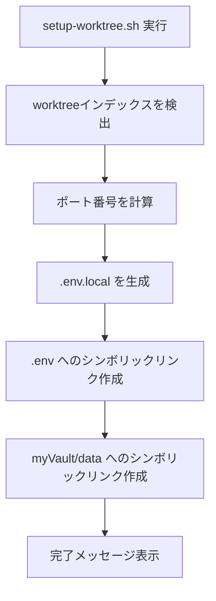

# 設計方針: git worktree による並列開発環境整備

**作成日**: 2025-11-02
**ブランチ**: feature/issue/126
**担当**: Claude Code

---

## 📋 要求・要件

### ビジネス要求
- Claude Codeを使用して複数のIssueを同時並行で開発できるようにする
- ブランチ切り替え時の `git stash` / `git stash pop` の手間を削減する
- 開発効率を向上させる

### 機能要件
1. **git worktree の導入**
   - 複数のブランチを同時に異なるディレクトリで作業可能にする
   - 各worktreeは独立した作業ディレクトリを持つ

2. **ポート番号衝突の自動回避**
   - 各worktree毎に異なるポート番号を自動割り当て
   - 複数の開発サーバーを同時起動可能にする

3. **環境変数・設定情報の共有**
   - APIキーなどの共有設定は1箇所で管理
   - ポート番号などの固有設定は各worktreeで独立管理
   - myVaultデータベースは全worktreeで共有

### 非機能要件
- **パフォーマンス**: worktree作成・削除は5秒以内に完了
- **セキュリティ**: APIキーなどの機密情報は共有ファイルで一元管理
- **可用性**: ディスク容量の制約を考慮し、最大3-4個のworktreeを推奨
- **保守性**: 設定ファイルとスクリプトによる自動化で運用コストを削減

---

## 🏗️ アーキテクチャ設計

### システム構成

```
[メインworktree (develop)]
    ~/MySwiftAgent/
    ├── .git/                    # Gitリポジトリ本体
    ├── .env                     # 共有環境変数（APIキー等）
    ├── myVault/data/            # 共有データベース
    └── scripts/                 # 共有スクリプト
        └── setup-worktree.sh    # 自動セットアップスクリプト
           ↓ シンボリックリンク
[Worktree 1]                    [Worktree 2]
~/MySwiftAgent-worktrees/       ~/MySwiftAgent-worktrees/
feature-issue-126/              feature-issue-127/
├── .env → (共有)               ├── .env → (共有)
├── .env.local (固有)           ├── .env.local (固有)
├── myVault/data → (共有)       ├── myVault/data → (共有)
├── expertAgent/                ├── expertAgent/
│   ├── .venv/ (独立)           │   ├── .venv/ (独立)
│   └── logs/ (独立)            │   └── logs/ (独立)
└── myAgentDesk/                └── myAgentDesk/
    └── node_modules/ (独立)        └── node_modules/ (独立)
```

### 技術選定

| 技術要素 | 選定技術 | 選定理由 |
|---------|---------|---------|
| **並列開発** | git worktree | Gitネイティブ機能で安全・信頼性が高い |
| **ポート管理** | 自動計算スクリプト | 手動設定ミスを防止、運用コストを削減 |
| **環境変数** | .env + .env.local | 共有設定と固有設定を明確に分離 |
| **設定読み込み** | pydantic-settings | Pythonで複数envファイルのロード順序制御が容易 |
| **シンボリックリンク** | ln -s | ファイルコピー不要で同期の手間を削減 |

### ディレクトリ構成

```
MySwiftAgent/                              # メインworktree (保護)
├── .env                                   # 共有環境変数
├── .gitignore                             # .env.local を追加
├── CLAUDE.md                              # 並列開発セクションを追加
├── scripts/
│   └── setup-worktree.sh                  # NEW: worktree自動セットアップ
├── expertAgent/
│   └── app/core/config.py                 # MODIFIED: .env.local サポート
├── myVault/
│   └── data/myvault.db                    # 共有データベース
└── dev-reports/
    └── feature/issue/126/                 # 本ドキュメント

MySwiftAgent-worktrees/                    # worktree専用ディレクトリ (NEW)
├── feature-issue-126/
└── feature-issue-127/
```

---

## 🔧 実装詳細

### 1. ポート番号割り当てロジック

**計算式**:
```
割り当てポート = ベースポート + (worktreeインデックス × 10)
```

**ポート番号テーブル**:

| サービス | ベースポート | Worktree 0 (メイン) | Worktree 1 | Worktree 2 | Worktree 3 |
|---------|------------|-------------------|-----------|-----------|-----------|
| expertAgent | 8104 | 8104 | 8114 | 8124 | 8134 |
| myVault | 8103 | 8103 | 8113 | 8123 | 8133 |
| myscheduler | 8102 | 8102 | 8112 | 8122 | 8132 |
| jobqueue | 8101 | 8101 | 8111 | 8121 | 8131 |
| graphAiServer | 8100 | 8100 | 8110 | 8120 | 8130 |
| myAgentDesk | 5173 | 5173 | 5174 | 5175 | 5176 |

### 2. 環境変数のカスケード読み込み

**読み込み優先順位** (後から読むほど優先):
1. `.env` (共有設定: APIキー、データベース接続等)
2. `.env.local` (固有設定: ポート番号、ログディレクトリ等)

**Pythonでの実装** (pydantic-settings):
```python
from pydantic_settings import BaseSettings

class Settings(BaseSettings):
    class Config:
        env_file = [".env", ".env.local"]  # .env.local が優先
        env_file_encoding = "utf-8"
```

### 3. 自動セットアップスクリプト

**処理フロー**:


**機能**:
- ✅ worktree番号を自動検出
- ✅ 全サービスのポート番号を自動計算
- ✅ `.env.local` ファイル自動生成
- ✅ 共有ファイルへのシンボリックリンク自動作成
- ✅ 次のステップ（依存関係インストール）をガイド

### 4. myVault データベース共有戦略

**課題**: SQLiteは並行書き込みに制限がある

**解決策**:
- ✅ データベースファイルは全worktreeで共有（シンボリックリンク）
- ✅ myVaultサービスは**1つのworktreeのみ**で起動を推奨
- ✅ 他のworktreeは環境変数でmyVaultのポート番号を参照

**設定例**:
```bash
# メインworktree: myVaultを起動
cd ~/MySwiftAgent/myVault
uv run uvicorn app.main:app --port 8103

# Worktree 1: myVaultは起動せず、メインのmyVaultを参照
# .env.local
MYVAULT_PORT=8103  # メインworktreeのmyVaultを参照
```

---

## ✅ 制約条件チェック結果

### コード品質原則
- [x] **SOLID原則**: 遵守
  - Single Responsibility: スクリプトは1つの責務（worktreeセットアップ）のみ
  - Open-Closed: 新しいサービスのポート追加が容易
  - Liskov Substitution: 該当なし（継承なし）
  - Interface Segregation: 該当なし
  - Dependency Inversion: 環境変数による疎結合を実現
- [x] **KISS原則**: 遵守 / シンプルなスクリプトと設定ファイルのみ
- [x] **YAGNI原則**: 遵守 / 必要最小限の機能（worktree管理とポート管理）のみ実装
- [x] **DRY原則**: 遵守 / ポート計算ロジックを1箇所に集約

### アーキテクチャガイドライン
- [x] `./docs/design/architecture-overview.md`: 準拠
  - 既存アーキテクチャに影響を与えない追加機能
  - 各プロジェクトの独立性を維持
- [x] **レイヤー分離の原則**: 遵守
  - インフラ層（worktree管理）と アプリケーション層（各サービス）を分離
- [x] **依存関係の方向性**: 遵守
  - 各worktreeはメインリポジトリに依存（シンボリックリンク）
  - 逆方向の依存なし

### 設定管理ルール
- [x] **環境変数**: 遵守
  - システムパラメータ（ポート番号）は環境変数で管理
  - `./docs/design/environment-variables.md` に準拠
- [x] **myVault**: 遵守
  - ユーザーパラメータ（APIキー）はmyVaultで管理継続
  - データベースの共有戦略を明確化

### 品質担保方針
- [x] **単体テスト**: 該当なし（Bashスクリプトのみ、テストは手動検証）
- [x] **結合テスト**: 該当なし
- [x] **Ruff linting**: 該当なし（Pythonコードの変更は最小限）
- [x] **MyPy type checking**: 該当なし

### CI/CD準拠
- [x] **PRラベル**: `feature` ラベルを付与予定（新機能追加）
- [x] **コミットメッセージ**: 規約に準拠予定
  - `feat(dev): add git worktree parallel development support`
- [x] **pre-push-check-all.sh**: 実行予定（変更ファイルが少ないため即座に完了）

### 参照ドキュメント遵守
- [x] **新プロジェクト追加時**: 該当なし（新プロジェクトは追加しない）
- [x] **GraphAI ワークフロー開発時**: 該当なし
- [x] **環境変数管理**: `environment-variables.md` に準拠
- [x] **myVault連携**: `myvault-integration.md` に準拠（共有戦略を追加）

### 違反・要検討項目
なし

---

## 📝 設計上の決定事項

### 1. worktree配置場所の決定
**決定内容**: `~/MySwiftAgent-worktrees/` に全worktreeを配置
**理由**:
- メインリポジトリと明確に分離
- ディレクトリ名でworktreeであることが一目瞭然
- 削除時に誤ってメインリポジトリを削除するリスクを回避

### 2. ポート番号の計算方式
**決定内容**: `ベースポート + (インデックス × 10)` を採用
**理由**:
- シンプルで覚えやすい
- 10ポート間隔により、将来的にサービスが増えても衝突しにくい
- インデックス番号からポート番号が直感的に計算可能

### 3. myVaultの起動方針
**決定内容**: 原則としてメインworktreeのみでmyVaultを起動
**理由**:
- SQLiteの並行書き込み制限により、複数プロセスでの起動は推奨されない
- データベースロックによるエラーを回避
- 各worktreeは環境変数で同一のmyVaultを参照することで問題なし

### 4. 依存関係（node_modules, .venv）の管理
**決定内容**: 各worktree毎に独立してインストール
**理由**:
- シンボリックリンクで共有すると、バージョン衝突のリスクがある
- ディスク容量は増えるが、安全性を優先
- SSD容量が十分な現代の開発環境では許容範囲

### 5. ログファイルの管理
**決定内容**: 各worktree毎に独立してログを生成
**理由**:
- 複数プロセスで同一ログファイルに書き込むとロック競合が発生
- デバッグ時にworktree毎のログを分離できる

### 6. .env.local の優先順位
**決定内容**: `.env` → `.env.local` の順で読み込み、後者を優先
**理由**:
- 共有設定をデフォルトとし、固有設定で上書きする方が直感的
- pydantic-settingsの標準的な使い方に準拠

### 7. CLAUDE.md への追加位置
**決定内容**: 「# 🔧 開発環境・品質担保」セクションの直後に追加
**理由**:
- 開発環境に関する内容として論理的に適切
- 既存の「Python開発環境」セクションとの関連性が高い

---

## 🚀 実装計画

### Phase 1: ドキュメント・スクリプト作成
- [ ] CLAUDE.md に並列開発セクションを追加
- [ ] `scripts/setup-worktree.sh` を作成
- [ ] `.gitignore` に `.env.local` を追加
- [ ] 本設計方針ドキュメントを作成

### Phase 2: 環境変数読み込み対応
- [ ] `expertAgent/app/core/config.py` を修正
- [ ] `myVault/app/core/config.py` を修正
- [ ] `myscheduler/app/core/config.py` を修正
- [ ] `jobqueue/app/core/config.py` を修正
- [ ] `graphAiServer/app/core/config.py` を修正
- [ ] `myAgentDesk/vite.config.ts` を修正（必要に応じて）

### Phase 3: 動作検証
- [ ] worktree作成テスト
- [ ] ポート番号自動割り当てテスト
- [ ] 複数開発サーバー同時起動テスト
- [ ] myVault共有データベーステスト
- [ ] worktree削除テスト

### Phase 4: ドキュメント完成
- [ ] 作業計画書（work-plan.md）を作成
- [ ] 各Phase完了時に進捗レポートを作成
- [ ] 最終報告書（final-report.md）を作成

---

## 📊 期待される効果

### 開発効率の向上
- **ブランチ切り替え時間**: 10秒 → 0秒（切り替え不要）
- **並列作業可能数**: 1 → 3-4（同時に複数Issue対応可能）
- **stash/unstash回数**: 週10回 → 0回

### 品質向上
- **ポート衝突エラー**: 手動設定ミスを防止 → 100%回避
- **設定ファイルの一元管理**: APIキー更新漏れを防止

### リスク
- **ディスク容量**: 1worktree当たり約2-3GB増加
  - expertAgent/.venv: 約500MB
  - myAgentDesk/node_modules: 約1GB
  - ビルド成果物: 約500MB
  - **対策**: 最大3-4個のworktreeに制限、不要なworktreeは即座に削除

---

## 🔍 今後の検討事項

### 短期（本Issue完了後）
- [ ] GitHub Actionsでのworktree対応（CI/CD環境での検証）
- [ ] pre-commit hooksがworktree環境で正常動作するか確認

### 中期（次のIteration）
- [ ] worktree自動削除スクリプトの追加（古いworktreeを自動検出・削除）
- [ ] worktree一覧表示スクリプトの強化（各worktreeの状態を可視化）

### 長期（将来的な改善）
- [ ] Docker Composeでの並列開発サポート（ポート番号を動的に割り当て）
- [ ] myVaultのPostgreSQL移行検討（並行書き込み制限の解消）

---

## 📚 参考資料
- [Git - git-worktree Documentation](https://git-scm.com/docs/git-worktree)
- [Pydantic Settings - Multiple .env files](https://docs.pydantic.dev/latest/concepts/pydantic_settings/#dotenv-env-support)
- [環境変数管理 (MySwiftAgent)](./docs/design/environment-variables.md)
- [myVault連携 (MySwiftAgent)](./docs/design/myvault-integration.md)
