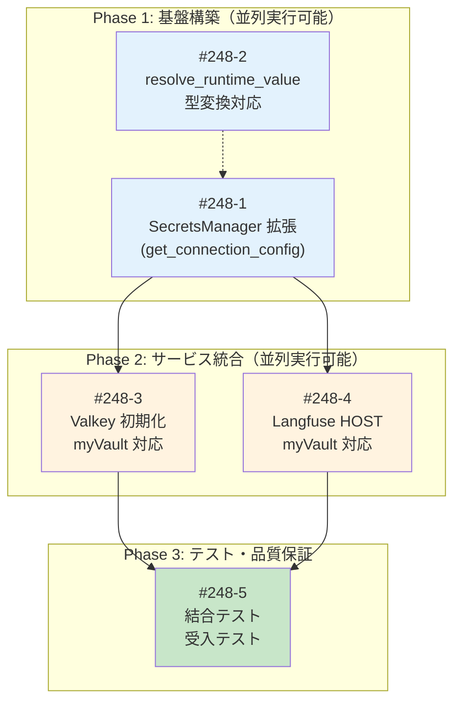

# Issue #248 分割計画書

## 他サービスの接続情報の管理の myVault への集約

**作成日**: 2025-12-07
**親Issue**: [#248](https://github.com/Kewton/MySwiftAgent/issues/248)
**関連ドキュメント**:
- [requirements.md](./requirements.md)
- [design-policy.md](./design-policy.md)
- [architecture-review.md](./architecture-review.md)

---

## Feature概要

Langfuse と Valkey の接続情報を myVault で一元管理し、環境変数への依存を削減する。

### 現状

| 設定項目 | 現在の管理場所 |
|---------|---------------|
| `LANGFUSE_PUBLIC_KEY` | ✅ myVault |
| `LANGFUSE_SECRET_KEY` | ✅ myVault |
| `LANGFUSE_HOST` | ❌ 環境変数 |
| `VALKEY_HOST/PORT/DB/TTL` | ❌ 環境変数 |

### 目標

すべての接続情報を myVault 優先で管理（環境変数フォールバック維持）

---

## Phase毎のイシュー管理

### Phase 1: 基盤構築（並列実行可能）

| Issue | 概要 | 依存 | サイズ | 見積 |
|-------|------|------|--------|------|
| #248-1 | SecretsManager 拡張（get_connection_config） | なし | S | 3h |
| #248-2 | resolve_runtime_value 型変換対応 | なし | XS | 2h |

**Phase 1 完了条件**:
- [ ] `get_connection_config()` メソッド実装完了
- [ ] `resolve_runtime_value()` に `value_type` パラメータ追加
- [ ] 単体テスト 90%以上

### Phase 2: サービス統合（Phase 1 完了後）

| Issue | 概要 | 依存 | サイズ | 見積 |
|-------|------|------|--------|------|
| #248-3 | Valkey 初期化の myVault 対応 | #248-1 | S | 2h |
| #248-4 | Langfuse HOST の myVault 対応 | #248-1 | XS | 1h |

**Phase 2 完了条件**:
- [ ] Valkey 接続情報が myVault から取得される
- [ ] Langfuse HOST が myVault から取得される
- [ ] 環境変数フォールバック動作確認

### Phase 3: テスト・品質保証（Phase 2 完了後）

| Issue | 概要 | 依存 | サイズ | 見積 |
|-------|------|------|--------|------|
| #248-5 | 結合テスト・受入テスト作成 | #248-3, #248-4 | S | 2h |

**Phase 3 完了条件**:
- [ ] 結合テストカバレッジ 50%以上
- [ ] ローカル E2E 動作確認完了
- [ ] CI/CD グリーン

---

## Issue一覧

### Issue #248-1: SecretsManager 拡張（get_connection_config）

**概要**: `SecretsManager` に型変換対応の `get_connection_config()` メソッドを追加

**サイズ**: S (2 Story Points)
**優先度**: High
**作業見積**: 3時間
**担当候補**: Backend

**スコープ**:
- [ ] `get_connection_config()` メソッド実装
- [ ] `_convert_type()` ヘルパーメソッド実装
- [ ] 入力値バリデーション（ポート番号範囲等）
- [ ] 単体テスト作成
- [ ] Ruff/MyPy エラー修正

**技術スタック**:
- 言語/FW: Python 3.11+
- 変更ファイル: `expertAgent/core/secrets.py`
- テストファイル: `expertAgent/tests/unit/test_secrets_connection_config.py`

**受入基準 (Acceptance Criteria)**:

#### 🤖 自動検証可能な基準（pm-auto-devが実施）

**機能要件**:
- [ ] `secrets_manager.get_connection_config("VALKEY_PORT", value_type=int)` が整数を返す
- [ ] `secrets_manager.get_connection_config("VALKEY_ENABLED", value_type=bool)` が真偽値を返す
- [ ] myVault に値がない場合、環境変数から取得する
- [ ] 両方にない場合、`default` パラメータの値を返す
- [ ] `default` もない場合、`ValueError` を発生させる

**品質基準**:
- [ ] 単体テストカバレッジ 90%以上
- [ ] Ruff/MyPy エラーゼロ

**テストケース**:
- [ ] 正常系: myVault から文字列値を取得
- [ ] 正常系: myVault から整数値を取得（型変換）
- [ ] 正常系: myVault から真偽値を取得（型変換）
- [ ] 正常系: myVault 未登録時に環境変数フォールバック
- [ ] 正常系: デフォルト値使用
- [ ] 異常系: 型変換失敗時のエラーメッセージ
- [ ] 異常系: 値が見つからない場合の ValueError
- [ ] エッジケース: ポート番号範囲外（1-65535）

#### 👤 手動検証が必要な基準（ユーザーが実施）

**動作検証**:
- [ ] ログ出力が適切（マスキング含む）

#### ✅ 完了条件
- `/pm-auto-dev` 完了時点: 🤖 自動検証可能な基準 → 全て✅
- ユーザー動作確認後: 👤 手動検証が必要な基準 → 全て✅

---

### Issue #248-2: resolve_runtime_value 型変換対応

**概要**: 既存の `resolve_runtime_value()` 関数に `value_type` パラメータを追加し、`get_connection_config()` との一貫性を確保

**サイズ**: XS (1 Story Point)
**優先度**: Medium
**作業見積**: 2時間
**担当候補**: Backend

**スコープ**:
- [ ] `resolve_runtime_value()` に `value_type` パラメータ追加
- [ ] 既存呼び出し箇所の動作確認（10ファイル）
- [ ] 単体テスト更新
- [ ] docstring 更新

**技術スタック**:
- 変更ファイル: `expertAgent/core/secrets.py`
- 影響ファイル: `expertAgent/mymcp/` 配下10ファイル

**受入基準 (Acceptance Criteria)**:

#### 🤖 自動検証可能な基準

**機能要件**:
- [ ] `resolve_runtime_value("VALKEY_PORT", value_type=int)` が整数を返す
- [ ] `value_type` 未指定時は従来通り文字列を返す（後方互換性）
- [ ] 既存の10ファイルでの呼び出しが正常動作

**品質基準**:
- [ ] 単体テストカバレッジ 90%以上
- [ ] Ruff/MyPy エラーゼロ
- [ ] 既存テスト全パス

**テストケース**:
- [ ] 正常系: 型変換あり呼び出し
- [ ] 正常系: 型変換なし呼び出し（後方互換性）
- [ ] 正常系: 既存呼び出し箇所の動作確認

#### ✅ 完了条件
- 既存テスト全パス
- 新規テスト追加・パス

---

### Issue #248-3: Valkey 初期化の myVault 対応

**概要**: `main.py` の Valkey 初期化処理を myVault 優先に変更

**サイズ**: S (2 Story Points)
**優先度**: High
**作業見積**: 2時間
**担当候補**: Backend

**スコープ**:
- [ ] `main.py` の Valkey 初期化を `get_connection_config()` 使用に変更
- [ ] `ab_test_endpoints.py` の Valkey 設定取得を変更
- [ ] `diagnostic_endpoints.py` の Valkey 設定取得を変更
- [ ] `metrics_aggregation_service.py` の Valkey 設定取得を変更
- [ ] myVault に Valkey 設定を登録（手動）

**技術スタック**:
- 変更ファイル:
  - `expertAgent/app/main.py`
  - `expertAgent/app/api/v1/ab_test_endpoints.py`
  - `expertAgent/app/api/v1/diagnostic_endpoints.py`
  - `expertAgent/app/services/metrics_aggregation_service.py`

**受入基準 (Acceptance Criteria)**:

#### 🤖 自動検証可能な基準

**機能要件**:
- [ ] myVault に `VALKEY_HOST` がある場合、その値で Valkey に接続
- [ ] myVault に値がない場合、環境変数から接続情報を取得
- [ ] Valkey 接続成功時にログ出力

**品質基準**:
- [ ] Ruff/MyPy エラーゼロ
- [ ] 既存テスト全パス

**テストケース**:
- [ ] 正常系: myVault から Valkey 接続情報取得 → 接続成功
- [ ] 正常系: myVault 未登録時に環境変数フォールバック → 接続成功

#### 👤 手動検証が必要な基準

**動作検証**:
- [ ] myVault に `VALKEY_HOST`, `VALKEY_PORT`, `VALKEY_DB` を登録後、サービス起動確認
- [ ] `/v1/health` エンドポイントで Valkey 接続状態確認
- [ ] myVault シークレット削除後、環境変数フォールバック確認

#### ✅ 完了条件
- myVault 優先で Valkey 接続が動作
- 環境変数フォールバックが動作

---

### Issue #248-4: Langfuse HOST の myVault 対応

**概要**: `langfuse_service.py` の `LANGFUSE_HOST` 取得を myVault 優先に変更

**サイズ**: XS (1 Story Point)
**優先度**: High
**作業見積**: 1時間
**担当候補**: Backend

**スコープ**:
- [ ] `langfuse_service.py` の HOST 取得を `get_connection_config()` 使用に変更
- [ ] myVault に `LANGFUSE_HOST` を登録（手動）

**技術スタック**:
- 変更ファイル: `expertAgent/app/services/langfuse_service.py`

**受入基準 (Acceptance Criteria)**:

#### 🤖 自動検証可能な基準

**機能要件**:
- [ ] myVault に `LANGFUSE_HOST` がある場合、その値で Langfuse に接続
- [ ] myVault に値がない場合、環境変数 `LANGFUSE_HOST` を使用

**品質基準**:
- [ ] Ruff/MyPy エラーゼロ
- [ ] 既存テスト全パス

**テストケース**:
- [ ] 正常系: myVault から LANGFUSE_HOST 取得
- [ ] 正常系: 環境変数フォールバック

#### 👤 手動検証が必要な基準

**動作検証**:
- [ ] Langfuse ダッシュボードでトレースが表示される
- [ ] myVault 設定変更後、サービス再起動で新設定が反映される

#### ✅ 完了条件
- Langfuse 接続が myVault 優先で動作

---

### Issue #248-5: 結合テスト・受入テスト作成

**概要**: myVault 接続設定の結合テストと受入テストを作成

**サイズ**: S (2 Story Points)
**優先度**: Medium
**作業見積**: 2時間
**担当候補**: Backend

**スコープ**:
- [ ] 結合テストファイル作成
- [ ] 受入テストスクリプト作成
- [ ] 受入テストドキュメント作成

**技術スタック**:
- 新規ファイル:
  - `expertAgent/tests/integration/test_myvault_connection_config.py`
  - `tests/acceptance/test_issue_248_acceptance.sh`
  - `tests/acceptance/README_issue_248.md`

**受入基準 (Acceptance Criteria)**:

#### 🤖 自動検証可能な基準

**機能要件**:
- [ ] 結合テストが myVault コンテナを使用して実行される
- [ ] myVault → 環境変数フォールバックのテストがパス

**品質基準**:
- [ ] 結合テストカバレッジ 50%以上
- [ ] Ruff/MyPy エラーゼロ

**テストケース**:
- [ ] 正常系: myVault に設定登録 → サービス起動 → 接続成功
- [ ] 正常系: myVault 未登録 → 環境変数フォールバック → 接続成功
- [ ] 異常系: myVault ダウン時のフォールバック動作

#### 👤 手動検証が必要な基準

**E2E検証**:
- [ ] 受入テストスクリプトが正常終了
- [ ] myVault 設定変更 → サービス再起動 → 新設定反映

#### ✅ 完了条件
- 結合テスト全パス
- 受入テストドキュメント完成

---

## 依存関係グラフ



---

## 並列実行可能性マトリクス

| Phase | 並列実行可能なIssue | 理由 |
|-------|-------------------|------|
| Phase 1 | #248-1, #248-2 | 異なる関数への変更、相互依存なし |
| Phase 2 | #248-3, #248-4 | 異なるサービスへの適用 |

---

## 依存関係マトリクス

| Issue | 依存先 | 並列実行可能 | ブロッカー |
|-------|--------|-------------|------------|
| #248-1 | なし | Yes | なし |
| #248-2 | なし（#248-1 と並列可） | Yes | なし |
| #248-3 | #248-1 | Yes（#248-4 と並列可） | #248-1 の完了待ち |
| #248-4 | #248-1 | Yes（#248-3 と並列可） | #248-1 の完了待ち |
| #248-5 | #248-3, #248-4 | No | #248-3, #248-4 の完了待ち |

---

## マイルストーン計画

**Milestone 1: 基盤構築（Day 1）**
- Phase 1: #248-1, #248-2（並列実行）
- 見積: 5時間

**Milestone 2: サービス統合（Day 2）**
- Phase 2: #248-3, #248-4（並列実行）
- 見積: 3時間

**Milestone 3: 品質保証（Day 2-3）**
- Phase 3: #248-5
- 見積: 2時間

**合計見積**: 10時間（1.5日）

---

## リソース配分

| 役割 | 必要人数 | スキル要件 | 担当Issue |
|------|---------|-----------|-----------|
| Backend | 1名 | Python/FastAPI, myVault | 全Issue |

---

## リスク評価

| Issue | リスク | 影響度 | 対策 |
|-------|-------|-------|------|
| #248-1 | 型変換エラーハンドリング不足 | 中 | 詳細なエラーメッセージ設計 |
| #248-2 | 既存呼び出し箇所への影響 | 中 | 後方互換性維持（デフォルト引数） |
| #248-3 | Valkey 接続失敗 | 中 | Graceful Degradation 維持 |
| #248-4 | Langfuse 接続失敗 | 低 | 既存のエラーハンドリング活用 |
| #248-5 | テスト環境依存 | 低 | Docker Compose での再現環境 |

---

## 分割判断チェックリスト

各Issueについて確認:

| チェック項目 | #248-1 | #248-2 | #248-3 | #248-4 | #248-5 |
|-------------|--------|--------|--------|--------|--------|
| 独立してデプロイ可能か | ✅ | ✅ | ✅ | ✅ | ✅ |
| 1-3日で完了可能か | ✅ | ✅ | ✅ | ✅ | ✅ |
| 明確な完了条件があるか | ✅ | ✅ | ✅ | ✅ | ✅ |
| テストが定義できるか | ✅ | ✅ | ✅ | ✅ | ✅ |
| 他Issueへの影響が最小か | ✅ | ✅ | ✅ | ✅ | ✅ |

---

## myVault 登録が必要なシークレット

### 新規登録が必要

| キー名 | 型 | 値の例 | 登録タイミング |
|-------|-----|-------|---------------|
| `LANGFUSE_HOST` | str | `http://localhost:3001` | #248-4 実装前 |
| `VALKEY_HOST` | str | `localhost` | #248-3 実装前 |
| `VALKEY_PORT` | int | `6379` | #248-3 実装前 |
| `VALKEY_DB` | int | `0` | #248-3 実装前 |
| `VALKEY_TTL` | int | `86400` | #248-3 実装前 |

### 登録コマンド例

```bash
# Langfuse HOST
curl -X POST "http://localhost:8103/api/v1/secrets/expertagent/default_project/LANGFUSE_HOST" \
  -H "Content-Type: application/json" \
  -d '{"value": "http://localhost:3001"}'

# Valkey 設定
curl -X POST "http://localhost:8103/api/v1/secrets/expertagent/default_project/VALKEY_HOST" \
  -H "Content-Type: application/json" \
  -d '{"value": "localhost"}'

curl -X POST "http://localhost:8103/api/v1/secrets/expertagent/default_project/VALKEY_PORT" \
  -H "Content-Type: application/json" \
  -d '{"value": "6379"}'

curl -X POST "http://localhost:8103/api/v1/secrets/expertagent/default_project/VALKEY_DB" \
  -H "Content-Type: application/json" \
  -d '{"value": "0"}'

curl -X POST "http://localhost:8103/api/v1/secrets/expertagent/default_project/VALKEY_TTL" \
  -H "Content-Type: application/json" \
  -d '{"value": "86400"}'
```

---

## 次のステップ

1. **Issue作成**: `/issue-create 248` で GitHub Issue を一括作成
2. **ブランチ作成**: `fix/issue/248-1` から順次作成
3. **TDD実装**: 各Issueで `/tdd-impl` を実行
4. **PR作成**: 各Issue完了後 `/pm-create-pr` を実行

---

## 関連ドキュメント

- [Issue #248](https://github.com/Kewton/MySwiftAgent/issues/248)
- [requirements.md](./requirements.md)
- [design-policy.md](./design-policy.md)
- [architecture-review.md](./architecture-review.md)
