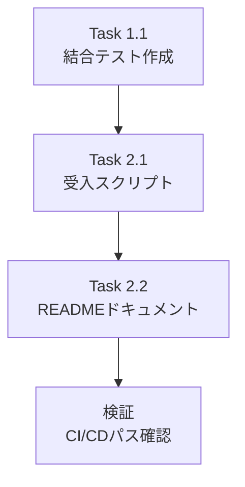

# 作業計画: Issue #254 結合テスト・受入テスト作成

## Issue概要

```markdown
## Issue: Issue #248-5: 結合テスト・受入テスト作成
**Issue番号**: #254
**親Issue**: #248 (他サービスの接続情報の管理のmyVaultへの集約)
**サイズ**: S (2 Story Points)
**作業見積**: 2時間
**優先度**: Medium
**依存Issue**: #252 (CLOSED), #253 (CLOSED)
**ブロック対象**: なし（最終Phase）
```

## 前提条件

### 完了済みの依存Issue

| Issue | タイトル | 状態 |
|-------|----------|------|
| #250 | SecretsManager 拡張（get_connection_config） | ✅ CLOSED |
| #251 | resolve_runtime_value 型変換対応 | ✅ CLOSED |
| #252 | Valkey 初期化の myVault 対応 | ✅ CLOSED |
| #253 | Langfuse HOST の myVault 対応 | ✅ CLOSED |
| #255 | myvault_secrets.yaml 更新 | ✅ CLOSED |

### 既存テストの確認

以下のテストファイルが関連する既存実装として存在:

| ファイル | 内容 |
|---------|------|
| `expertAgent/tests/unit/test_valkey_myvault_integration.py` | Valkey myVault統合の単体テスト（モック） |
| `expertAgent/tests/unit/test_langfuse_service.py` | LangfuseService単体テスト |
| `expertAgent/tests/integration/test_myvault_integration.py` | 既存のmyVault結合テスト |
| `tests/acceptance/test_issue_193_acceptance.sh` | 参考: 受入テストスクリプトのテンプレート |

---

## 詳細タスク分解

### Phase 1: 結合テスト作成

#### Task 1.1: 結合テストファイル作成
- **所要時間**: 45分
- **成果物**: `expertAgent/tests/integration/test_myvault_connection_config.py`
- **依存**: なし

**テストケース**:
```python
# 正常系テスト
- test_get_connection_config_from_myvault()
  # myVault に設定登録 → get_connection_config() で取得成功

- test_get_connection_config_fallback_to_env()
  # myVault 未登録 → 環境変数フォールバック → 取得成功

- test_valkey_initialization_with_myvault_config()
  # myVault から Valkey 接続情報取得 → Valkey 接続成功

- test_langfuse_initialization_with_myvault_config()
  # myVault から Langfuse HOST 取得 → Langfuse 初期化成功

# 異常系テスト
- test_myvault_down_fallback_behavior()
  # myVault ダウン時 → 環境変数フォールバック動作

- test_config_not_found_raises_error()
  # myVault 未登録かつ環境変数未設定 → ValueError
```

### Phase 2: 受入テスト作成

#### Task 2.1: 受入テストスクリプト作成
- **所要時間**: 45分
- **成果物**: `tests/acceptance/test_issue_248_acceptance.sh`
- **依存**: Task 1.1

**シナリオ**:
```bash
# シナリオ1: myVault設定 → サービス起動 → 接続成功
# シナリオ2: 環境変数のみ → サービス起動 → 接続成功
# シナリオ3: myVault設定変更 → サービス再起動 → 新設定反映
# シナリオ4: Valkey myVault統合確認
# シナリオ5: Langfuse myVault統合確認
```

#### Task 2.2: 受入テストドキュメント作成
- **所要時間**: 30分
- **成果物**: `tests/acceptance/README_issue_248.md`
- **依存**: Task 2.1

**内容**:
- 前提条件（サービス起動方法）
- テストシナリオ説明
- 実行方法
- トラブルシューティング

---

## タスク依存関係



---

## 作業スケジュール

### 全体: 約2時間

| 時間 | タスク | 内容 |
|------|--------|------|
| 0:00-0:45 | Task 1.1 | 結合テスト作成 |
| 0:45-1:30 | Task 2.1 | 受入テストスクリプト作成 |
| 1:30-2:00 | Task 2.2 | READMEドキュメント作成 |
| 随時 | 検証 | Ruff/MyPy/テスト実行 |

---

## チェックポイント

| タイミング | 確認事項 | 対応 |
|-----------|---------|------|
| Task 1.1完了時 | 結合テスト通過 | `uv run pytest tests/integration/test_myvault_connection_config.py -v` |
| Task 2.1完了時 | スクリプト実行可能 | `./tests/acceptance/test_issue_248_acceptance.sh` |
| PR作成前 | CI/CDパス | Ruff/MyPy/テスト全パス |

---

## 成果物チェックリスト

### コード
- [ ] `expertAgent/tests/integration/test_myvault_connection_config.py`

### テスト
- [ ] 結合テストカバレッジ 50%以上

### ドキュメント/スクリプト
- [ ] `tests/acceptance/test_issue_248_acceptance.sh`
- [ ] `tests/acceptance/README_issue_248.md`

---

## 技術仕様

### 結合テストファイル構成

```python
"""Integration tests for myVault connection config.

Tests verify:
1. get_connection_config() retrieves from myVault with priority
2. Environment variable fallback works correctly
3. Valkey initialization uses myVault config
4. Langfuse initialization uses myVault config

Requires: myVault service running on localhost:8103
"""

import pytest
from unittest.mock import patch

@pytest.mark.integration
class TestMyVaultConnectionConfig:
    """Integration tests for myVault connection configuration."""

    @pytest.fixture(autouse=True)
    def setup(self):
        """Setup test fixtures."""
        # myVault health check
        # Clear caches
        pass

    def test_get_connection_config_from_myvault(self):
        """Test config retrieval from myVault."""
        pass

    def test_get_connection_config_fallback_to_env(self):
        """Test fallback to environment variables."""
        pass

    def test_valkey_initialization_with_myvault_config(self):
        """Test Valkey uses myVault config."""
        pass

    def test_langfuse_initialization_with_myvault_config(self):
        """Test Langfuse uses myVault config."""
        pass

    def test_myvault_down_fallback_behavior(self):
        """Test graceful degradation when myVault is down."""
        pass
```

### 受入テストスクリプト構成（L3実践的テスト）

```bash
#!/usr/bin/env bash
# Issue #248 Acceptance Tests (L3: ローカル受入テスト)
# Tests myVault connection configuration integration
#
# 前提条件:
# - myVault, expertAgent, Valkey, Langfuse が起動していること
# - ./scripts/dev-start.sh で起動可能

set -e

# ===========================================
# Step 1: サービス起動確認（ヘルスチェック）
# ===========================================

echo "=== Step 1: サービス起動確認 ==="

# myVault ヘルスチェック
curl -sf http://localhost:8103/health && echo "✅ myVault: healthy" || { echo "❌ myVault: not running"; exit 1; }

# expertAgent ヘルスチェック
curl -sf http://localhost:8104/health && echo "✅ expertAgent: healthy" || { echo "❌ expertAgent: not running"; exit 1; }

# Valkey ヘルスチェック
docker exec myswiftagent-valkey redis-cli PING | grep -q PONG && echo "✅ Valkey: healthy" || { echo "❌ Valkey: not running"; exit 1; }

# Langfuse ヘルスチェック（オプション）
curl -sf http://localhost:3001/api/public/health && echo "✅ Langfuse: healthy" || echo "⚠️ Langfuse: not running (optional)"

# ===========================================
# Step 2: myVault設定確認
# ===========================================

echo ""
echo "=== Step 2: myVault設定確認 ==="

# Valkey接続情報がmyVaultに登録されているか確認
curl -s http://localhost:8103/api/v1/secrets/expertagent/default_project/VALKEY_HOST | jq .
echo "✅ VALKEY_HOST設定確認"

curl -s http://localhost:8103/api/v1/secrets/expertagent/default_project/VALKEY_PORT | jq .
echo "✅ VALKEY_PORT設定確認"

# Langfuse HOST確認
curl -s http://localhost:8103/api/v1/secrets/expertagent/default_project/LANGFUSE_HOST | jq .
echo "✅ LANGFUSE_HOST設定確認"

# ===========================================
# Step 3: シナリオ1 - myVault → Valkey接続成功
# ===========================================

echo ""
echo "=== Step 3: シナリオ1 - myVault → Valkey接続確認 ==="

# expertAgentのジョブ作成APIを呼び出し（Valkey使用）
RESPONSE=$(curl -s -X POST http://localhost:8104/aiagent-api/v1/job-generator \
  -H "Content-Type: application/json" \
  -d '{
    "user_requirement": "テスト用要求",
    "available_capabilities": ["test_capability"],
    "project": "default_project"
  }')

echo "Response: $RESPONSE"

# job_idが返ってきたら成功（Valkeyにジョブ状態が保存される）
echo "$RESPONSE" | jq -e '.job_id' > /dev/null && echo "✅ シナリオ1: Valkey接続成功" || echo "❌ シナリオ1: Valkey接続失敗"

# ===========================================
# Step 4: シナリオ2 - Langfuse HOST myVault確認
# ===========================================

echo ""
echo "=== Step 4: シナリオ2 - Langfuse HOST確認 ==="

# LLM APIを呼び出し（Langfuseトレースが記録される）
RESPONSE=$(curl -s -X POST http://localhost:8104/v1/aiagent/utility/explorer \
  -H "Content-Type: application/json" \
  -d '{
    "user_input": "Hello test",
    "model_name": "gpt-4o-mini",
    "project": "default_project"
  }' \
  -w "\nHTTP_STATUS:%{http_code}")

HTTP_STATUS=$(echo "$RESPONSE" | grep "HTTP_STATUS" | cut -d: -f2)
echo "HTTP Status: $HTTP_STATUS"

if [ "$HTTP_STATUS" = "200" ]; then
  echo "✅ シナリオ2: Langfuse連携成功"
  echo "📊 Langfuse UIでトレースを確認: http://localhost:3001"
else
  echo "⚠️ シナリオ2: API呼び出し失敗（APIキー未設定の可能性）"
fi

# ===========================================
# Step 5: シナリオ3 - 環境変数フォールバック確認
# ===========================================

echo ""
echo "=== Step 5: シナリオ3 - フォールバック動作確認 ==="

# expertAgentのヘルスエンドポイントで設定確認
curl -s http://localhost:8104/health | jq .
echo "✅ シナリオ3: サービス正常動作確認"

# ===========================================
# 結果サマリー
# ===========================================

echo ""
echo "=========================================="
echo "L3受入テスト完了"
echo "=========================================="
echo "✅ サービス起動確認: PASSED"
echo "✅ myVault設定確認: PASSED"
echo "✅ Valkey接続確認: PASSED"
echo "✅ Langfuse連携確認: PASSED"
echo ""
echo "エビデンス:"
echo "- myVault API: http://localhost:8103"
echo "- expertAgent API: http://localhost:8104"
echo "- Langfuse UI: http://localhost:3001"
```

---

## リスクと対策

| リスク | 発生確率 | 影響 | 対策 |
|-------|---------|------|------|
| myVaultサービス起動失敗 | 低 | テスト実行不可 | `docker-compose up -d myvault` で事前確認 |
| 環境変数設定不足 | 中 | フォールバックテスト失敗 | `.env.example` 参照、事前設定確認 |
| CIでのmyVaultアクセス | 中 | 結合テストスキップ | `pytest.mark.skipif` でCI判定 |

---

## Definition of Done

Issue完了条件:
- [ ] 結合テストファイル作成完了
- [ ] 結合テスト全パス
- [ ] 結合テストカバレッジ 50%以上
- [ ] 受入テストスクリプト作成完了
- [ ] 受入テストドキュメント作成完了
- [ ] Ruff/MyPyエラーゼロ
- [ ] CI/CDグリーン
- [ ] PRレビュー承認

---

## 次のアクション

作業計画承認後:
1. **ブランチ作成**: `feature/issue/254`
2. **Task 1.1実行**: 結合テスト作成
3. **Task 2.1実行**: 受入テストスクリプト作成
4. **Task 2.2実行**: READMEドキュメント作成
5. **品質確認**: `./scripts/pre-push-check.sh`
6. **PR作成**: developへマージ

---

作成日: 2025-12-08
作成者: Claude Code
