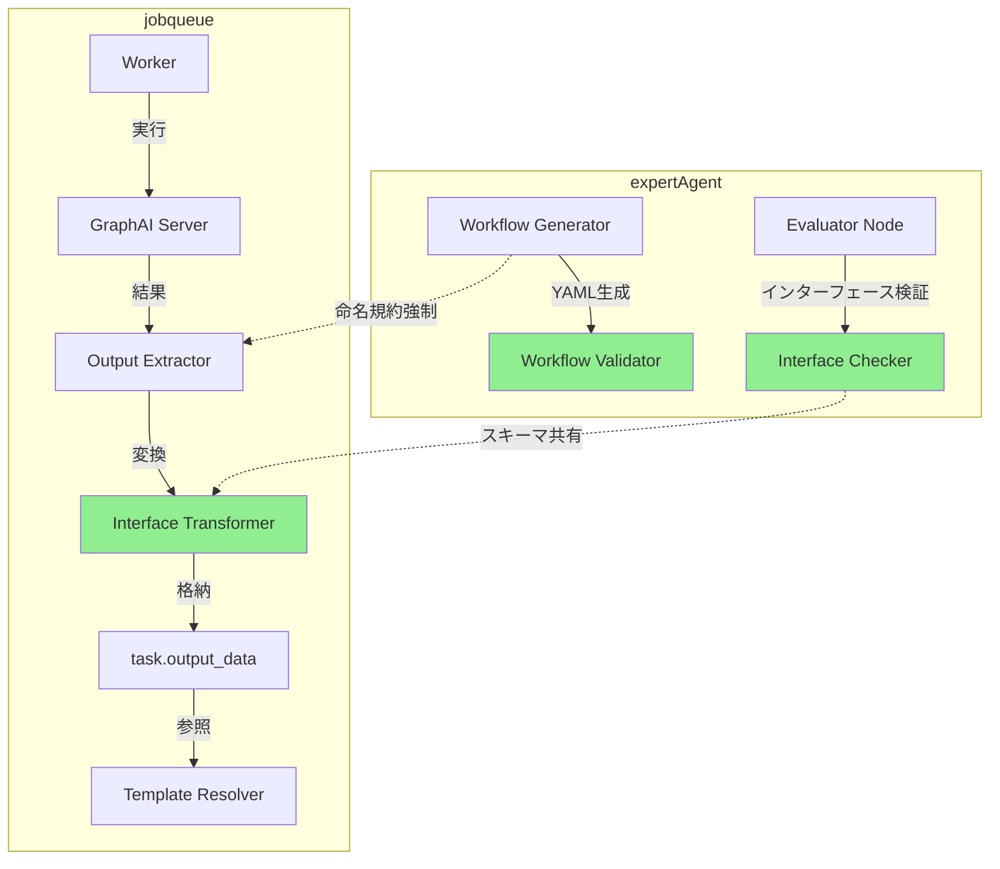
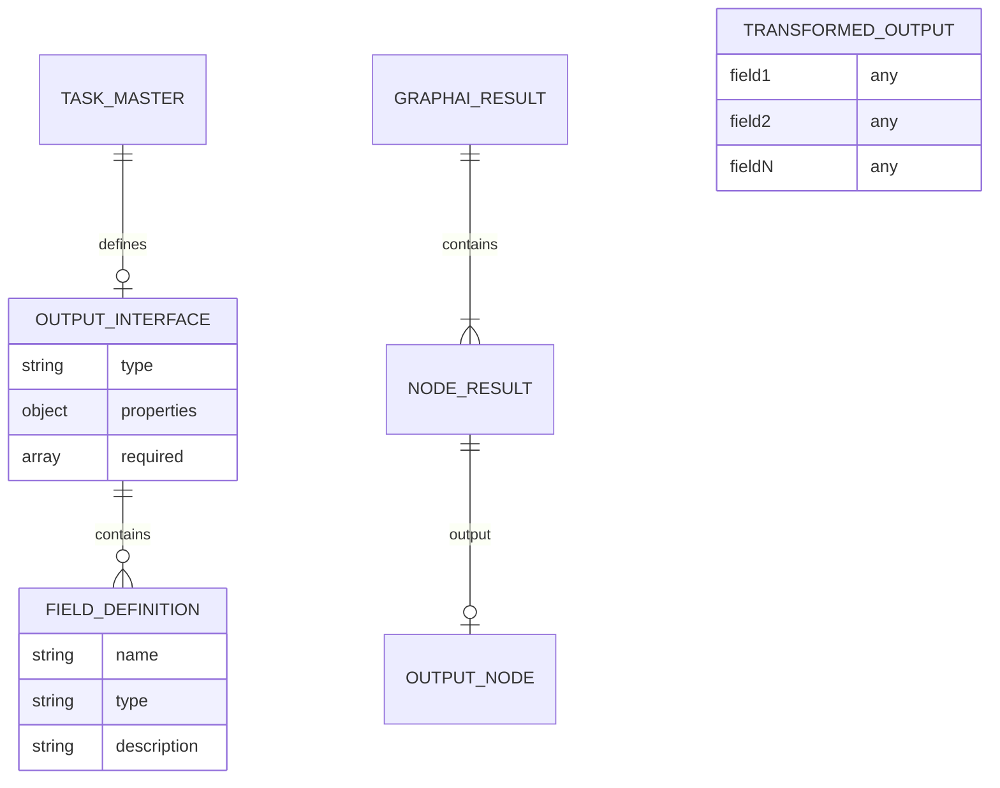

# 設計方針書: タスクチェーン インターフェース契約強制メカニズム

**Issue**: #338
**作成日**: 2026-01-02
**関連Issue**: #337, #333

---

## 現状調査サマリ

### 対象プロジェクト

| プロジェクト | 主要モジュール | 役割 |
|-------------|--------------|------|
| **jobqueue** | `app/core/worker.py` | GraphAI結果抽出、タスク実行 |
| **jobqueue** | `app/services/template_resolver.py` | テンプレート変数解決 |
| **expertAgent** | `aiagent/langgraph/.../evaluator.py` | 実現可能性評価 |
| **expertAgent** | `aiagent/langgraph/.../workflow_generation.py` | ワークフローYAML生成 |
| **graphAiServer** | `src/services/graphai.ts` | GraphAI実行エンジン |

### 既存アーキテクチャパターン

| パターン | 使用箇所 | 目的 |
|---------|---------|------|
| **段階的フォールバック** | `_extract_graphai_output` | 予期しないデータ構造に対応 |
| **多層検証** | `evaluator.py` | 構造妥当性→実現可能性→API具体性 |
| **再帰的解決** | `template_resolver.py` | ネスト構造のテンプレート処理 |
| **リトライ管理** | `evaluator.py` | 最大リトライでのグレースフルデグラデーション |
| **DRY原則** | `template_resolver.py` | 共通パス解決ロジック |

### 問題の真因（根本原因分析より）

```
表層問題
├── 問題1: ワークフローYAMLノード参照エラー
├── 問題2: ワークフロー出力 ↔ output_interface不一致
└── 問題3: タスク間データパス不一致

真因（Root Cause）
└── インターフェース契約の強制メカニズムが存在しない
    - input_interface / output_interface は「宣言」のみ
    - 実際のデータフローは契約を無視して動作
    - 違反を検出するバリデーションがない
```

### 設計上の制約

1. **既存ワークフローとの互換性**: 既存の `isResult: true` ノードを持つワークフローが動作継続
2. **パフォーマンス**: 変換レイヤーによるオーバーヘッド最小化
3. **LLM依存**: ワークフロー生成はLLMに依存するため、100%の精度保証は不可能
4. **後方互換性**: 既存のJobMaster/TaskMaster定義が破壊されない

### 参照したドキュメント

| ドキュメント | 関連内容 |
|-------------|---------|
| `docs/design/architecture-overview.md` | サービス構成、ポート設定 |
| `docs/arch/service-dependencies.md` | サービス間通信フロー |
| `docs/spec/job-generation-workflow.md` | LangGraphエージェント設計 |
| `graphAiServer/docs/GRAPHAI_WORKFLOW_GENERATION_RULES.md` | ワークフロー生成ルール |
| `dev-reports/feature/issue/337/task-chain-failure-analysis.md` | 根本原因分析 |

---

## アーキテクチャ設計

### システム構成図（変更後）



### レイヤー構成

本機能は既存のレイヤー構成を維持しつつ、以下の責務を追加：

| レイヤー | 既存責務 | 追加責務 |
|---------|---------|---------|
| **ワークフロー生成層** | LLMによるYAML生成 | 出力ノード命名規約強制、API応答スキーマ注入 |
| **評価層** | 実現可能性評価 | インターフェース整合性検証 |
| **実行層** | タスク実行 | output_interface変換 |
| **データ連携層** | テンプレート解決 | 変換済みデータの参照 |

---

## 技術選定

| カテゴリ | 選定技術 | 選定理由 | 既存との整合性 |
|---------|---------|---------|---------------|
| 変換ロジック | Python (Pydantic) | 型安全な変換、既存パターン踏襲 | evaluator.pyで既に使用 |
| スキーマ定義 | JSON Schema | output_interface既存形式 | 互換性維持 |
| 検証ロジック | Python (既存evaluator拡張) | LangGraphノードとして統合 | アーキテクチャ一貫性 |
| プロンプト拡張 | YAML | 既存プロンプト形式 | 既存パターン踏襲 |

---

## 設計パターン

### 採用パターンと理由

| パターン | 適用箇所 | 理由 |
|---------|---------|------|
| **Strategy Pattern** | 出力変換 | output_interface有無による分岐 |
| **Decorator Pattern** | ワークフロー検証 | 既存生成ロジックを変更せず検証追加 |
| **Chain of Responsibility** | 多層検証 | 既存evaluatorパターン踏襲 |
| **Template Method** | 変換処理 | フィールド抽出ロジックの標準化 |

### 既存パターンとの整合性

- **段階的フォールバック**: `_extract_graphai_output`の既存ロジックを維持
- **多層検証**: evaluator.pyの3層構造に4層目（インターフェース整合性）を追加
- **リトライ管理**: 既存のMAX_RETRY_COUNT連携

---

## データモデル設計

### 変換後データフロー



### 変換処理の入出力

**入力（GraphAI結果）**:
```json
{
  "results": {
    "source": {...},
    "execute_search": {
      "search_results": [...],
      "search_results_count": 2,
      "status": "ok"
    },
    "format_results": {
      "success": true,
      "error_message": ""
    }
  }
}
```

**output_interface定義**:
```json
{
  "type": "object",
  "properties": {
    "success": {"type": "boolean"},
    "search_results": {"type": "array"},
    "error_message": {"type": "string"}
  },
  "required": ["success", "search_results"]
}
```

**出力（変換後）**:
```json
{
  "success": true,
  "search_results": [...],
  "error_message": ""
}
```

---

## API設計

### 変更なし

本Issue は内部処理の変更であり、外部API仕様の変更は発生しない。

### 内部インターフェース変更

#### 1. `_extract_graphai_output` → `_transform_to_interface`

**現状**:
```python
def _extract_graphai_output(response_data: Any) -> Any:
    # outputノードを探して抽出
```

**変更後**:
```python
def _extract_graphai_output(response_data: Any) -> Any:
    # 既存ロジック維持（後方互換性）

def _transform_to_interface(
    raw_output: dict,
    output_interface: dict | None
) -> dict:
    """output_interface定義に基づいてデータを変換"""
    if output_interface is None:
        return raw_output  # 未定義時はそのまま返却

    result = {}
    properties = output_interface.get("properties", {})

    for field_name in properties.keys():
        value = _find_field_value(raw_output, field_name)
        result[field_name] = value

    # 必須フィールドの存在確認
    required_fields = output_interface.get("required", [])
    missing = [f for f in required_fields if result.get(f) is None]
    if missing:
        logger.warning(
            f"[TRANSFORM] Missing required fields after transformation: {missing}"
        )

    return result
```

#### 2. `_find_field_value` フィールド探索戦略

**設計方針**: 3つの探索戦略をサポートし、段階的にフォールバック

```python
def _find_field_value(
    data: dict,
    field_name: str,
    search_strategy: Literal["direct", "recursive", "path"] = "recursive"
) -> Any:
    """
    output_interface定義のフィールドをGraphAI結果から探索

    Args:
        data: GraphAI結果（全ノード含む）
        field_name: 探索するフィールド名
        search_strategy:
            - "direct": data[field_name] のみ
            - "recursive": ネスト構造を深さ優先探索
            - "path": output_interface に source_path 定義があれば使用

    Returns:
        見つかった値、または None
    """
    if search_strategy == "direct":
        return data.get(field_name)

    if search_strategy == "recursive":
        return _recursive_search(data, field_name)

    if search_strategy == "path":
        # Issue #337 derived_fields の source_mapping を使用
        return _path_based_search(data, field_name)

    return None


def _recursive_search(data: dict, field_name: str, max_depth: int = 5) -> Any:
    """
    ネスト構造を深さ優先探索でフィールドを探索

    Args:
        data: 探索対象のdict
        field_name: 探索するフィールド名
        max_depth: 最大探索深度（無限ループ防止）

    Returns:
        見つかった値、または None
    """
    if max_depth <= 0:
        return None

    # 直接アクセス優先
    if field_name in data:
        return data[field_name]

    # ネスト構造を探索
    for key, value in data.items():
        if isinstance(value, dict):
            result = _recursive_search(value, field_name, max_depth - 1)
            if result is not None:
                return result

    return None


def _path_based_search(data: dict, field_path: str) -> Any:
    """
    ドット区切りパスでフィールドを探索

    Args:
        data: 探索対象のdict
        field_path: ドット区切りパス（例: "execute_search.search_results"）

    Returns:
        見つかった値、または None
    """
    parts = field_path.split(".")
    current = data

    for part in parts:
        if isinstance(current, dict) and part in current:
            current = current[part]
        else:
            return None

    return current
```

**探索戦略の選択ロジック**:

```python
def _determine_search_strategy(
    field_name: str,
    field_def: dict
) -> Literal["direct", "recursive", "path"]:
    """フィールド定義に基づき探索戦略を決定"""

    # source_mapping がある場合は path 戦略
    if "source_mapping" in field_def:
        return "path"

    # デフォルトは recursive 戦略
    return "recursive"
```

**探索優先順位**:
1. `output` ノード内を直接探索
2. `isResult: true` ノード内を探索
3. 全ノードを再帰的に探索
4. 見つからない場合は `None` を返却（ログ出力）

#### 3. evaluator.py 拡張

```python
def check_interface_compatibility(tasks: list[dict]) -> list[str]:
    """タスク間インターフェース整合性検証"""
    warnings = []

    for i in range(len(tasks) - 1):
        current_output = tasks[i].get("output_interface", {})
        next_input = tasks[i + 1].get("input_interface", {})

        required_fields = next_input.get("required", [])
        available_fields = current_output.get("properties", {}).keys()

        for field in required_fields:
            if field not in available_fields:
                warnings.append(
                    f"Task {i+1} output missing '{field}' required by Task {i+2}"
                )

    return warnings
```

---

## セキュリティ設計

### セキュリティ影響評価

本Issue はデータ変換ロジックの追加であり、新たな外部接点は発生しない。ただし、以下の対策を実装する。

### 対策1: 機密フィールドマスキング

変換処理のデバッグログで機密データが露出しないよう、フィールドマスキングを実装:

```python
# 機密フィールドのパターン定義
SENSITIVE_FIELD_PATTERNS = {
    "api_key", "password", "token", "secret", "credential",
    "private_key", "access_key", "auth", "bearer"
}

def _is_sensitive_field(field_name: str) -> bool:
    """フィールド名が機密パターンに該当するか判定"""
    field_lower = field_name.lower()
    return any(pattern in field_lower for pattern in SENSITIVE_FIELD_PATTERNS)

def _mask_value(value: Any) -> str:
    """機密値をマスキング"""
    if value is None:
        return "None"
    str_value = str(value)
    if len(str_value) <= 4:
        return "[MASKED]"
    return f"{str_value[:2]}***{str_value[-2:]}"

def _log_transformation(field_name: str, value: Any, found: bool) -> None:
    """変換結果のログ出力（機密フィールドはマスキング）"""
    if _is_sensitive_field(field_name):
        log_value = _mask_value(value) if found else "[NOT FOUND]"
    else:
        log_value = str(value)[:100] if found else "[NOT FOUND]"

    logger.debug(f"[TRANSFORM] {field_name}: {log_value}")
```

### 対策2: 例外ハンドリング

不正データによるDoS攻撃を防ぐため、変換処理に安全な例外ハンドリングを追加:

```python
def _transform_to_interface(
    raw_output: dict,
    output_interface: dict | None
) -> dict:
    try:
        # 変換処理
        ...
    except RecursionError:
        logger.error("[TRANSFORM] Max recursion depth exceeded")
        return raw_output  # フォールバック
    except (TypeError, KeyError) as e:
        logger.error(f"[TRANSFORM] Data structure error: {e}")
        return raw_output  # フォールバック
```

### 対策3: 入力サイズ制限

```python
MAX_OUTPUT_SIZE_BYTES = 10 * 1024 * 1024  # 10MB
MAX_FIELD_COUNT = 100

def _validate_input_size(raw_output: dict) -> bool:
    """入力サイズの妥当性検証"""
    import json
    output_size = len(json.dumps(raw_output))
    if output_size > MAX_OUTPUT_SIZE_BYTES:
        logger.warning(f"[TRANSFORM] Output size exceeds limit: {output_size} bytes")
        return False
    return True
```

---

## パフォーマンス設計

### 影響分析

| 処理 | 追加オーバーヘッド | 許容範囲 |
|------|------------------|---------|
| 出力変換 | O(n) n=フィールド数 | 通常10フィールド以下、無視可能 |
| インターフェース検証 | O(n*m) n=タスク数, m=フィールド数 | 通常5タスク以下、無視可能 |
| ワークフロー検証 | 既存LLM呼び出しに含む | 追加コストなし |

### 最適化戦略

1. **遅延変換**: output_interfaceが未定義の場合は変換スキップ
2. **キャッシュ**: output_interface定義のメモリキャッシュ（TaskMaster取得時）
3. **早期終了**: 検証失敗時は即座にエラー返却

### オブザーバビリティ（メトリクス）

変換処理の監視・デバッグ・パフォーマンス分析のためのメトリクスを追加:

```python
from prometheus_client import Counter, Histogram

# 変換処理のカウンター
transformation_counter = Counter(
    "interface_transformation_total",
    "Total interface transformations",
    ["status", "task_master_name"]
)

# フィールド探索の所要時間
field_search_histogram = Histogram(
    "field_search_duration_seconds",
    "Field search duration",
    ["strategy"]
)

# 必須フィールド欠落の検出
missing_field_counter = Counter(
    "interface_missing_required_fields_total",
    "Count of missing required fields after transformation",
    ["task_master_name", "field_name"]
)
```

**Langfuse連携**:
```python
# 変換処理のトレース
with langfuse.trace("interface_transformation") as trace:
    trace.update(metadata={
        "task_master_id": task_master_id,
        "output_interface_fields": list(properties.keys()),
        "search_strategy": strategy
    })
    result = _transform_to_interface(raw_output, output_interface)
    trace.update(output={"transformed_fields": list(result.keys())})
```

---

## 設計判断とトレードオフ

### 判断1: 変換レイヤーの配置場所

**選択肢**:
- A) jobqueue worker内（採用）
- B) graphAiServer内
- C) expertAgent内

**採用理由**:
- jobqueue workerは既に`_extract_graphai_output`でGraphAI結果を処理
- 既存の責務に沿った配置
- graphAiServerは汎用エンジンのため、アプリケーション固有ロジックを避ける

### 判断2: 出力ノード命名規約の強制方法

**選択肢**:
- A) プロンプトでの強制（採用）
- B) 生成後のYAML書き換え
- C) `isResult: true`ノードの自動検出

**採用理由**:
- プロンプト強制はLLMの理解を促進
- YAML書き換えは複雑で副作用リスク
- `isResult`検出は既存ワークフローで複数ノードに設定されている可能性

### 判断3: インターフェース不整合時の動作

**選択肢**:
- A) 警告出力のみ（採用 - Phase 1）
- B) エラーで処理中断
- C) 自動修正試行

**採用理由**:
- 段階的導入により既存ワークフローへの影響を最小化
- Phase 2以降でエラー化を検討
- 自動修正は複雑でリスク高

### 判断4: API応答スキーマの提供方法

**選択肢**:
- A) capabilities.yamlからの自動注入（採用）
- B) プロンプトへの静的記載
- C) ワークフロー生成時のAPI呼び出し

**採用理由**:
- capabilities.yamlは既にresponse_schemaを持つ（Issue #270で追加済み）
- 静的記載はメンテナンス負荷
- API呼び出しはレイテンシ増加

---

## 実装フェーズ

> **重要**: アーキテクチャレビューにより、**Phase 1-2 は同一リリースでの実装を推奨**。
>
> Phase 1（命名規約強制）のみでは、問題2（output_interface不一致）・問題3（タスク間データパス不一致）は未解決のままとなる。
> タスクチェーン障害の再発防止のため、Phase 1-2 を同一イテレーションで実装すること。

### Phase 1: 出力ノード命名規約の強制（難易度: 低）

| タスク | ファイル | 変更内容 |
|--------|---------|---------|
| 1.1 | `expertAgent/.../prompts/workflow_generation.yaml` | `output`ノード強制ルール追加 |
| 1.2 | `expertAgent/.../workflow_generation.py` | 生成後検証ロジック追加 |
| 1.3 | 単体テスト | 命名規約検証テスト |

**成果物**: ワークフロー生成時に`output`ノード使用を強制

### Phase 2: output_interface変換レイヤー（難易度: 中）

| タスク | ファイル | 変更内容 |
|--------|---------|---------|
| 2.1 | `jobqueue/app/core/worker.py` | `_transform_to_interface`関数追加 |
| 2.2 | `jobqueue/app/core/worker.py` | `_execute_tasks`での変換呼び出し |
| 2.3 | `jobqueue/app/repositories/task_master.py` | output_interface取得 |
| 2.4 | 単体テスト | 変換ロジックテスト |
| 2.5 | 結合テスト | タスクチェーン変換テスト |

**成果物**: GraphAI結果がoutput_interface定義に従って変換される

### Phase 3: API応答スキーマ提供（難易度: 中）

| タスク | ファイル | 変更内容 |
|--------|---------|---------|
| 3.1 | `expertAgent/.../utils/workflow_helper.py` | スキーマ取得関数 |
| 3.2 | `expertAgent/.../prompts/workflow_generation.yaml` | スキーマ注入プレースホルダー |
| 3.3 | `expertAgent/.../workflow_generation.py` | コンテキストにスキーマ追加 |
| 3.4 | 単体テスト | スキーマ注入テスト |

**成果物**: ワークフロー生成時にAPI応答スキーマがLLMに提供される

### Phase 4: インターフェース整合性検証（難易度: 低）

| タスク | ファイル | 変更内容 |
|--------|---------|---------|
| 4.1 | `expertAgent/.../nodes/evaluator.py` | `check_interface_compatibility`関数追加 |
| 4.2 | `expertAgent/.../nodes/evaluator.py` | evaluator_nodeでの呼び出し |
| 4.3 | 単体テスト | 整合性検証テスト |

**成果物**: ジョブ生成時にインターフェース不整合を警告

---

## 受入条件マッピング

| Issue受入条件 | 設計フェーズ | 検証方法 |
|--------------|-------------|---------|
| ワークフロー生成プロンプトに出力ノード名 `output` の強制ルールを追加 | Phase 1.1 | プロンプトレビュー |
| `isResult: true` と `output` ノード名の組み合わせを必須化 | Phase 1.1 | 単体テスト |
| 生成されたワークフローYAMLの検証機能を追加 | Phase 1.2 | 単体テスト |
| `jobqueue/app/core/worker.py` に `output_interface` 変換ロジックを追加 | Phase 2.1 | 単体テスト |
| GraphAI結果から `output_interface` 定義に基づいてデータを抽出・変換 | Phase 2.1-2.2 | 結合テスト |
| 変換後データを `task.output_data` に設定 | Phase 2.2 | 結合テスト |
| `expert_agent_capabilities.yaml` にAPI応答スキーマを追加 | 既存（Issue #270） | 確認済み |
| ワークフロー生成コンテキストにAPI応答スキーマを自動注入 | Phase 3.2-3.3 | 単体テスト |
| Google Search API等の正確なフィールド名参照を保証 | Phase 3 | E2Eテスト |
| `evaluator.py` にタスク間インターフェース整合性検証関数を追加 | Phase 4.1 | 単体テスト |
| ジョブ生成時に `output_interface` → `input_interface` の整合性チェック | Phase 4.2 | 単体テスト |
| 不整合時の警告出力 | Phase 4.2 | 単体テスト |

---

## リスクと対策

| リスク | 影響度 | 発生確率 | 対策 |
|-------|-------|---------|------|
| 既存ワークフローの動作破壊 | 高 | 低 | 変換ロジックはoutput_interface定義時のみ動作 |
| LLMが命名規約を無視 | 中 | 中 | 生成後検証で再生成促進 |
| 変換処理のパフォーマンス低下 | 低 | 低 | 遅延変換、キャッシュ戦略 |
| フィールド探索の失敗 | 中 | 中 | ログ出力、フォールバック |

---

## 品質基準

- 単体テストカバレッジ: **90%以上**
- 静的解析: **Ruff/MyPyエラーゼロ**
- 既存テスト: **全パス維持**
- 受入テスト: **全Issue受入条件を検証**

---

## 改訂履歴

| 日付 | 版 | 変更内容 |
|------|---|---------|
| 2026-01-02 | 1.0 | 初版作成 |
| 2026-01-02 | 1.1 | アーキテクチャレビュー改善反映 |

### v1.1 改善内容（アーキテクチャレビュー反映）

| 項目 | 改善内容 | 対応セクション |
|------|---------|---------------|
| **MF-1** | `_find_field_value` フィールド探索戦略の詳細設計追加 | 内部インターフェース変更 §2 |
| **MF-2** | Phase 1-2 同時リリース推奨を明記 | 実装フェーズ（注記追加） |
| **SF-1** | 変換後の必須フィールド検証追加 | `_transform_to_interface` 関数内 |
| **SF-2** | メトリクス/オブザーバビリティ追加 | パフォーマンス設計 §3 |
| **Security** | 機密フィールドマスキング、例外ハンドリング、入力サイズ制限 | セキュリティ設計 §1-3 |

---

**設計方針書作成完了**

**承認ステータス**: アーキテクチャレビュー条件付き承認 → **改善反映完了**
