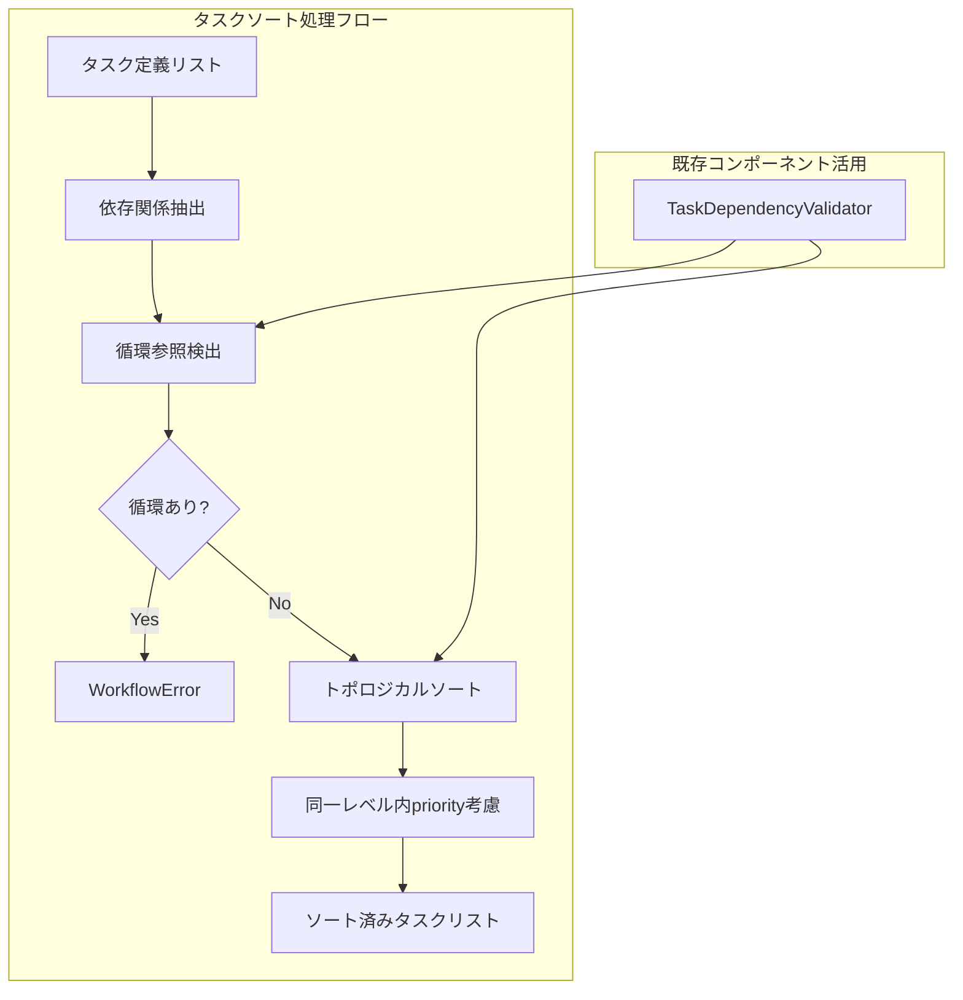

# Issue #402 設計方針書

**作成日**: 2025-01-25
**ブランチ**: feature/issue/402
**担当**: Claude Code

---

## 概要

本文書は、expertAgentにおけるタスク登録時のソート順を、priority フィールドベースから依存関係ベースのトポロジカルソートに変更する設計方針を定義する。

## 1. 現状の問題分析

### 1.1 現在の実装

現在、以下の2箇所でpriorityベースのソートが実装されている：

1. **jobGeneratorV2** (新アーキテクチャ)
   - ファイル: `expertAgent/aiagent/langgraph/jobGeneratorV2/workflows/registration/master_manager.py`
   - 実装: `sorted_tasks = sorted(tasks, key=lambda t: t.priority)`

2. **jobTaskGeneratorAgents** (レガシーアーキテクチャ)
   - ファイル: `expertAgent/aiagent/langgraph/jobTaskGeneratorAgents/nodes/master_creation.py`
   - 実装: `sorted_tasks = sorted(task_breakdown, key=lambda t: t.get("priority", 5))`

### 1.2 問題点

- 全タスクのpriorityがデフォルト値(5)の場合、ソート順序が不安定になる
- 実行順序が依存関係を無視して決定される
- 例：task_005がtask_002より前に実行される問題が発生

### 1.3 既存の依存関係処理

expertAgentには既に高度な依存関係処理機能が実装されている：

- `TaskDependencyValidator`: トポロジカルソートと循環参照検出
- 実装場所: `expertAgent/aiagent/langgraph/jobGeneratorV2/validators/task_dependency.py`
- アルゴリズム: Kahn's Algorithm（入次数ベース）

## 2. アーキテクチャ設計

### 2.1 システム構成図



### 2.2 レイヤー構成

```
expertAgent/
├── aiagent/
│   └── langgraph/
│       ├── jobGeneratorV2/
│       │   ├── utils/
│       │   │   └── topological_sort.py  # 新規作成（共通ユーティリティ）
│       │   └── workflows/
│       │       └── registration/
│       │           └── master_manager.py  # 修正対象
│       └── jobTaskGeneratorAgents/
│           └── nodes/
│               └── master_creation.py  # 修正対象
```

## 3. 技術選定

| カテゴリ | 選定技術 | 選定理由 | 既存との整合性 |
|---------|---------|---------|---------------|
| **アルゴリズム** | Kahn's Algorithm | 既存実装で検証済み | TaskDependencyValidatorで使用中 |
| **データ構造** | defaultdict, deque | Python標準、効率的 | 既存コードベースと一致 |
| **エラー型** | WorkflowError | 統一されたエラー体系 | jobGeneratorV2の標準 |
| **検証方法** | DFS循環検出 | 既存実装で実績あり | _find_cycleメソッドで使用 |

## 4. 設計パターン

### 4.1 採用するパターン

1. **Strategy Pattern**
   - ソートアルゴリズムを抽象化し、将来の拡張に対応
   - priorityソート、依存関係ソートを戦略として実装

2. **Facade Pattern**
   - 複雑な依存関係処理を単純なインターフェースで提供
   - 既存のTaskDependencyValidatorをラップ

3. **Single Responsibility Principle**
   - トポロジカルソート機能を独立したユーティリティとして分離

### 4.2 既存パターンとの整合性

- **エラーハンドリング**: WorkflowError + ErrorType.VALIDATION + Phase.REGISTRATION
- **型定義**: TaskDefinitionのdataclass定義を継承
- **ロギング**: structlogを使用した構造化ログ

## 5. データモデル設計

### 5.1 既存のTaskDefinition

```python
@dataclass
class TaskDefinition:
    id: str                           # "task_001"
    name: str
    description: str
    task_type: str
    recommended_api: str
    priority: int = 5                 # 1-10, デフォルト5
    dependencies: list[str] = field(default_factory=list)  # ["task_001", "task_002"]
```

### 5.2 ソート結果のデータ構造

```python
@dataclass
class TopologicalSortResult:
    """トポロジカルソートの結果"""
    sorted_tasks: list[TaskDefinition]  # ソート済みタスクリスト
    execution_levels: list[list[str]]   # 同一レベルのタスクID群
    dependency_graph: dict[str, list[str]]  # 依存グラフ
```

## 6. API設計

### 6.1 共通ユーティリティインターフェース

```python
# expertAgent/aiagent/langgraph/jobGeneratorV2/utils/topological_sort.py

def topological_sort_tasks(
    tasks: list[TaskDefinition],
    respect_priority: bool = True
) -> list[TaskDefinition]:
    """依存関係に基づくトポロジカルソート

    Args:
        tasks: ソート対象のタスクリスト
        respect_priority: 同一レベル内でpriority順を適用するか

    Returns:
        依存関係順にソートされたタスクリスト

    Raises:
        WorkflowError: 循環依存が検出された場合
    """
```

### 6.2 内部実装の分離

```python
def _build_dependency_graph(tasks: list[TaskDefinition]) -> dict[str, list[str]]:
    """タスクリストから依存グラフを構築"""

def _detect_circular_dependencies(graph: dict[str, list[str]], task_ids: set[str]) -> list[list[str]]:
    """循環依存を検出"""

def _topological_sort_with_priority(
    graph: dict[str, list[str]],
    task_map: dict[str, TaskDefinition],
    respect_priority: bool
) -> list[TaskDefinition]:
    """優先度を考慮したトポロジカルソート"""
```

### 6.3 優先度ソートの詳細実装（レビュー指摘対応）

**問題**: 既存の`TaskDependencyValidator/_topological_sort`では`queue.sort()`で単純にID順ソートしており、priority値が考慮されていない。

**対応**: 同一依存レベル内でのソート時にpriority値を明示的に考慮する。

```python
def _topological_sort_with_priority(
    dependencies: dict[str, list[str]],
    task_map: dict[str, TaskDefinition],
    task_ids: set[str],
    respect_priority: bool = True
) -> list[TaskDefinition]:
    """優先度を考慮したトポロジカルソート

    既存の_topological_sort実装の問題点を修正:
    - in_degree計算の重複を排除（1回のみ計算）
    - priority値による明示的なサブソート

    Args:
        dependencies: タスクIDから依存先IDリストへのマッピング
        task_map: タスクIDからTaskDefinitionへのマッピング
        task_ids: 全タスクIDのセット
        respect_priority: 同一レベル内でpriority順を適用するか

    Returns:
        依存関係順にソートされたTaskDefinitionリスト
    """
    from collections import defaultdict, deque

    # 逆依存グラフ構築（誰が自分に依存しているか）
    dependents: dict[str, list[str]] = defaultdict(list)

    # 入次数計算（1回のみ - 既存実装の重複を修正）
    in_degree: dict[str, int] = dict.fromkeys(task_ids, 0)
    for task_id, deps in dependencies.items():
        for dep in deps:
            if dep in task_ids:
                dependents[dep].append(task_id)
                in_degree[task_id] += 1

    # 入次数0のタスクを優先度順でキューに追加
    def sort_key(task_id: str) -> tuple[int, str]:
        """ソートキー: (priority, task_id)"""
        if respect_priority:
            return (task_map[task_id].priority, task_id)
        return (0, task_id)  # priority無視時はIDのみでソート

    queue = deque(
        sorted(
            [tid for tid in task_ids if in_degree[tid] == 0],
            key=sort_key
        )
    )

    result: list[TaskDefinition] = []

    while queue:
        current = queue.popleft()
        result.append(task_map[current])

        # 次に処理可能になるタスクを収集
        ready_tasks: list[str] = []
        for dependent in dependents[current]:
            in_degree[dependent] -= 1
            if in_degree[dependent] == 0:
                ready_tasks.append(dependent)

        # 同一レベル内は優先度順でキューに追加
        for tid in sorted(ready_tasks, key=sort_key):
            queue.append(tid)

    return result
```

**既存実装との差分**:
1. `in_degree`の計算を1回に統合（無駄な2重計算を排除）
2. `queue.sort()`の代わりに`sorted(..., key=sort_key)`でpriority考慮
3. 新規タスク追加時も優先度順でソートして挿入

## 7. セキュリティ設計

### 7.1 入力検証

- タスクIDの重複チェック
- 存在しないタスクへの依存参照チェック
- 自己参照の検出

### 7.2 DoS対策

- 依存関係の深さ制限（デフォルト: 100レベル）
- タスク数の上限（デフォルト: 1000タスク）

## 8. パフォーマンス設計

### 8.1 計算量

- 時間計算量: O(V + E) where V=タスク数, E=依存関係数
- 空間計算量: O(V + E)

### 8.2 最適化

- 依存グラフの事前構築によるキャッシュ効果
- dequeを使用した効率的なキュー操作

## 9. エラーハンドリング設計

### 9.1 エラー分類と対処

| エラー種別 | 発生条件 | 対処方法 | エラー型 |
|-----------|---------|---------|---------|
| 循環依存 | A→B→C→A | WorkflowError発生 | VALIDATION |
| 存在しない依存 | 未定義タスクへの参照 | WorkflowError発生 | VALIDATION |
| 空のタスクリスト | タスクが0件 | そのまま空リスト返却 | - |
| 依存関係なし | 全タスクindependent | priority順でソート | - |

### 9.2 Phase定数の使用（レビュー指摘対応）

**問題**: エラーハンドリングで使用するPhase定数の確認が必要。

**確認結果**: `Phase.REGISTRATION`は以下の2箇所で定義されている：
- `expertAgent/aiagent/langgraph/jobGeneratorV2/types.py:302` - 3フェーズアーキテクチャ用
- `expertAgent/aiagent/langgraph/jobGeneratorV2/types_old.py:51` - レガシー用

**対応方針**:
- `master_manager.py`（jobGeneratorV2）: `types.py`の`Phase.REGISTRATION`を使用
- `master_creation.py`（レガシー）: `types_old.py`の`Phase.REGISTRATION`または独自エラーハンドリング

```python
# jobGeneratorV2用（master_manager.py）
from expertAgent.aiagent.langgraph.jobGeneratorV2.types import (
    WorkflowError,
    ErrorType,
    Phase,
)

# 循環依存検出時
raise WorkflowError(
    f"Circular dependency detected: {' -> '.join(cycle)}",
    ErrorType.VALIDATION,
    Phase.REGISTRATION,
)

# 存在しない依存参照時
raise WorkflowError(
    f"Task '{task_id}' depends on non-existent task '{dep_id}'",
    ErrorType.VALIDATION,
    Phase.REGISTRATION,
)
```

### 9.3 エラーメッセージ設計

```python
# 循環依存の場合
f"Circular dependency detected: {' -> '.join(cycle)}"

# 存在しない依存の場合
f"Task '{task_id}' depends on non-existent task '{dep_id}'"

# 重複タスクIDの場合
f"Duplicate task ID detected: '{task_id}'"

# 自己参照の場合
f"Self-reference detected: task '{task_id}' depends on itself"
```

## 10. 実装計画

### 10.1 フェーズ1: 共通ユーティリティ作成

1. `topological_sort.py` の作成
2. 単体テストの作成
3. 既存のTaskDependencyValidatorとの整合性確認

### 10.2 フェーズ2: master_manager.py の修正

1. 既存のソート処理を特定
2. トポロジカルソートに置き換え
3. 結合テストの実行

### 10.3 フェーズ3: master_creation.py の修正

1. 既存のソート処理を特定
2. 同様の修正を適用
3. レガシーシステムとの互換性確認

## 11. 設計上の決定事項とトレードオフ

### 11.1 既存実装の再利用 vs 新規実装

**決定**: 既存のTaskDependencyValidatorのロジックを参考にしつつ、新規ユーティリティとして実装

**理由**:
- TaskDependencyValidatorは検証に特化しており、ソート機能の抽出が困難
- 両アーキテクチャから使用可能な共通ユーティリティが必要
- 将来的な拡張性を考慮

### 11.2 priority フィールドの扱い

**決定**: 同一依存レベル内でのサブソートに使用

**理由**:
- 既存のpriorityフィールドを完全に無視すると互換性問題が発生
- 依存関係が同一のタスク間では優先度が意味を持つ
- 段階的な移行が可能

### 11.3 エラー処理の厳密性

**決定**: 循環依存は即座にWorkflowErrorとして失敗

**理由**:
- 循環依存は実行時にデッドロックを引き起こす
- 早期検出により、デバッグが容易
- 既存のエラー処理フローと一致

## 12. テスト戦略（レビュー指摘対応：具体化）

### 12.1 単体テスト

#### 基本機能テスト
| テストケース | 入力 | 期待結果 |
|-------------|------|---------|
| 線形依存 | A→B→C | [A, B, C] |
| 分岐依存 | A→{B,C}→D | [A, B, C, D] or [A, C, B, D] (B,Cは同レベル) |
| 独立タスク | {A, B, C} (依存なし) | priority順 |
| 空リスト | [] | [] |
| 単一タスク | [A] | [A] |

#### 循環依存検出テスト
| テストケース | 入力 | 期待結果 |
|-------------|------|---------|
| 直接循環 | A→B→A | WorkflowError |
| 間接循環 | A→B→C→A | WorkflowError |
| 自己参照 | A→A | WorkflowError |

#### 優先度サブソートテスト（レビュー指摘対応）
| テストケース | 入力 | 期待結果 |
|-------------|------|---------|
| 同レベル・異priority | A(p=5), B(p=3) 依存なし | [B, A] (p=3が先) |
| 同レベル・同priority | A(p=5), B(p=5) 依存なし | [A, B] or [B, A] (ID順) |
| 依存＋priority混在 | A(p=5)→B(p=1), C(p=2) | [A, C, B] (Aが先、次にC、最後にB) |

#### エッジケーステスト
| テストケース | 入力 | 期待結果 |
|-------------|------|---------|
| 存在しない依存 | A→X (Xは未定義) | WorkflowError |
| 重複タスクID | [A, A] | WorkflowError |
| 深いチェーン | A→B→...→Z (26レベル) | 正常ソート |
| 最大タスク数 | 1000タスク | 正常ソート |

### 12.2 結合テスト

#### master_manager.py 統合テスト
```python
@pytest.mark.asyncio
async def test_create_masters_with_dependencies():
    """依存関係付きタスクのマスター登録"""
    tasks = [
        TaskDefinition(id="task_001", ..., dependencies=[]),
        TaskDefinition(id="task_002", ..., dependencies=["task_001"]),
        TaskDefinition(id="task_003", ..., dependencies=["task_002"]),
    ]
    # task_001 → task_002 → task_003 の順で登録されることを検証

@pytest.mark.asyncio
async def test_create_masters_with_circular_dependency():
    """循環依存時のエラーハンドリング"""
    # WorkflowError が発生し、部分的な登録がロールバックされることを検証
```

#### master_creation.py 統合テスト
```python
@pytest.mark.asyncio
async def test_master_creation_node_with_dependencies():
    """レガシーノードでの依存関係処理"""
    # task_breakdown の依存関係が正しく処理されることを検証
```

### 12.3 受入テスト

#### E2Eワークフローテスト
1. **Issue #402 再現テスト**: task_001→task_005→task_002 の問題が解消されることを確認
2. **7タスクワークフロー**: 実際の taskBreakdown 順序が維持されることを確認
3. **JobQueue登録順序**: 登録されたタスクの `order` フィールドが依存関係を反映していることを確認

#### パフォーマンステスト
| テストケース | タスク数 | 依存関係数 | 期待処理時間 |
|-------------|---------|-----------|-------------|
| 小規模 | 10 | 15 | < 10ms |
| 中規模 | 100 | 200 | < 100ms |
| 大規模 | 1000 | 2000 | < 1s |

#### 後方互換性テスト
1. **priority のみ指定**: 依存関係なし、priority のみの既存ワークフローが動作することを確認
2. **混在パターン**: 一部タスクのみ依存関係あり、残りは独立の場合の動作確認

## 13. 参照ドキュメント

- `expertAgent/docs/API_REFERENCE.md` - Expert Agent API仕様
- `expertAgent/aiagent/langgraph/jobGeneratorV2/validators/task_dependency.py` - 既存の依存関係検証実装
- `expertAgent/aiagent/langgraph/jobGeneratorV2/types_old.py` - TaskDefinition定義
- `expertAgent/aiagent/langgraph/jobGeneratorV2/types.py` - Phase, ErrorType, WorkflowError定義

## 13.1 関連Issue

| Issue | タイトル | 関係 |
|-------|---------|------|
| #401 | Run status同期問題 | 関連（同時期に発覚） |
| **#405** | タスクソート機能へのStrategy Pattern導入 | 派生（将来の拡張） |
| **#406** | タスク依存グラフのキャッシュ機構導入 | 派生（パフォーマンス最適化） |

## 14. リスクと対策

### 14.1 後方互換性

**リスク**: 既存のpriorityベースに依存したワークフローが破壊される

**対策**:
- フィーチャーフラグでの段階的移行
- 警告ログの出力
- ドキュメントでの明確な変更通知

### 14.2 パフォーマンス劣化

**リスク**: 大規模タスクでソート処理が遅延

**対策**:
- O(V+E)の効率的なアルゴリズム採用
- タスク数上限の設定
- パフォーマンステストでの検証

### 14.3 複雑な依存関係

**リスク**: 深い依存チェーンによるスタックオーバーフロー

**対策**:
- 反復的アルゴリズム（Kahn's Algorithm）の使用
- 依存深度の上限設定
- 早期検出メカニズム

---

## ✅ 制約条件チェック結果

### コード品質原則
- [x] **SOLID原則**: 遵守
  - Single Responsibility: トポロジカルソートを独立ユーティリティとして分離
  - Open-Closed: 既存のTaskDependencyValidatorを変更せず拡張
  - Dependency Inversion: インターフェース経由で依存関係を抽象化
- [x] **KISS原則**: 遵守 / Kahn's Algorithmはシンプルで理解しやすい
- [x] **YAGNI原則**: 遵守 / 必要最小限の機能のみ実装（Strategy Pattern等は将来の拡張用に保留）
- [x] **DRY原則**: 遵守 / 共通ユーティリティとして両アーキテクチャから利用

### アーキテクチャガイドライン
- [x] レイヤー分離: utils層に共通ユーティリティを配置
- [x] 依存関係の方向性: validators層のロジックを参照、上位層から呼び出し

### 設定管理ルール
- [x] 環境変数: 該当なし（アルゴリズム実装のみ）
- [x] myVault: 該当なし（シークレット不使用）

### 品質担保方針
- [ ] 単体テストカバレッジ: 90%以上を目標（実装時に達成予定）
- [ ] 結合テストカバレッジ: 50%以上を目標（実装時に達成予定）
- [x] Ruff linting: 既存コードスタイルに準拠予定
- [x] MyPy type checking: 型ヒント完備予定

### CI/CD準拠
- [x] PRラベル: `enhancement` を付与予定
- [x] コミットメッセージ: `feat(expertAgent): ...` 形式
- [ ] pre-push-check-all.sh: 実装完了後に実行

### 参照ドキュメント遵守
- [x] API_REFERENCE.md: 参照済み
- [x] 既存実装（task_dependency.py）: 参照済み

### 違反・要検討項目
なし