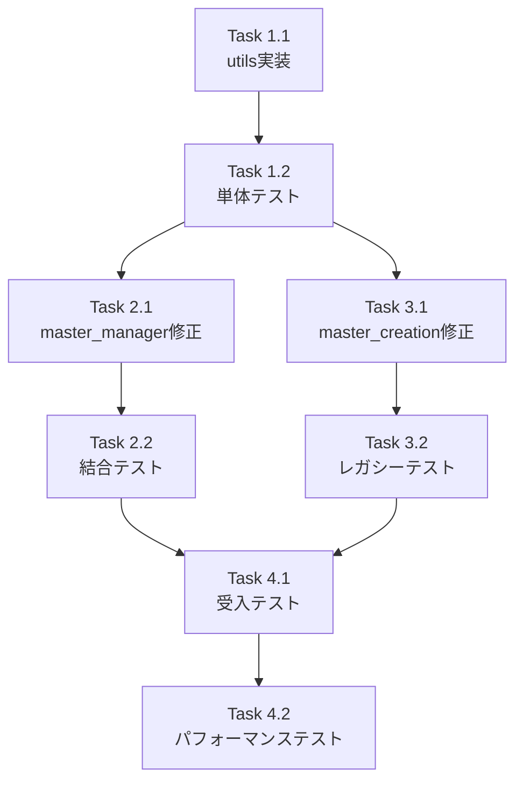

# 作業計画: Issue #402

**作成日**: 2025-01-25
**予定工数**: 16時間（2人日）
**完了予定**: 2025-01-27

---

## 📚 参考ドキュメント

**必須参照** (該当する場合):
- [x] [新プロジェクトセットアップ手順書](../../docs/operations/new-project-setup.md) - utils/ ディレクトリ作成時に参照
- [ ] [GraphAI ワークフロー生成ルール](../../graphAiServer/docs/GRAPHAI_WORKFLOW_GENERATION_RULES.md) - 該当なし

**推奨参照**:
- [x] [アーキテクチャ概要](../../docs/architecture/overview.md)
- [ ] [環境変数管理](../../docs/reference/environment-variables.md) - 該当なし
- [ ] [myVault連携](../../docs/architecture/myvault-integration.md) - 該当なし

**設計方針書**:
- [x] [design-policy.md](./design-policy.md) - 本Issue用設計方針（作成済み）

---

## 📋 Issue概要

**Issue番号**: #402
**タイトル**: feat(expertAgent): タスク登録時のソート順をpriorityから依存関係ベースのトポロジカルソートに変更
**サイズ**: M
**作業見積**: 16時間
**優先度**: High
**依存Issue**: なし（#401と同時期に発覚した独立Issue）

**概要**: タスク登録時のソート順が全タスクのpriority値がデフォルト(5)の場合に不安定となり、期待と異なる実行順序になる問題を修正する。依存関係ベースのトポロジカルソートを実装する。

---

## 📊 Phase分解

### Phase 1: 共通ユーティリティ実装（6時間）

#### Task 1.1: utils/topological_sort.py の実装（3時間）
- [ ] utils/ ディレクトリ作成
- [ ] topological_sort_tasks() 関数の実装
- [ ] _build_dependency_graph() の実装
- [ ] _topological_sort_with_priority() の実装（レビュー指摘反映）
- [ ] エラーハンドリングの実装（WorkflowError）

#### Task 1.2: 単体テスト作成（3時間）
- [ ] test_topological_sort.py の作成
- [ ] 基本機能テスト（線形、分岐、独立タスク）
- [ ] 循環依存検出テスト
- [ ] 優先度サブソートテスト
- [ ] エッジケーステスト（空リスト、最大タスク数）

### Phase 2: master_manager.py 修正（4時間）

#### Task 2.1: MasterManagerSubWorkflow 修正（2時間）
- [ ] create_masters メソッドのソート処理を特定
- [ ] topological_sort_tasks への置き換え
- [ ] import文の追加（utils.topological_sort）
- [ ] エラーハンドリングの追加（Phase.REGISTRATION使用）

#### Task 2.2: 結合テスト作成（2時間）
- [ ] test_master_manager.py への結合テスト追加
- [ ] 依存関係付きタスクのマスター登録テスト
- [ ] 循環依存時のエラーハンドリングテスト

### Phase 3: master_creation.py 修正（3時間）

#### Task 3.1: master_creation_node 修正（1.5時間）
- [ ] sorted_tasks 処理の特定
- [ ] topological_sort_tasks への置き換え（dict→TaskDefinition変換）
- [ ] レガシーシステムとの互換性確認

#### Task 3.2: レガシー用結合テスト（1.5時間）
- [ ] test_master_creation_node.py へのテスト追加
- [ ] 依存関係処理の検証
- [ ] 後方互換性の確認

### Phase 4: 受入テスト実施（3時間）

#### Task 4.1: L3受入テスト作成（2時間）
- [ ] test_issue_402_acceptance.py の作成
- [ ] E2Eワークフローテスト（7タスクシナリオ）
- [ ] JobQueue登録順序の検証
- [ ] Issue #402 再現テスト（task_002より前にtask_005が実行される問題）

#### Task 4.2: パフォーマンステスト（1時間）
- [ ] 小規模（10タスク）ベンチマーク
- [ ] 中規模（100タスク）ベンチマーク
- [ ] 大規模（1000タスク）ベンチマーク

---

## 🔄 タスク依存関係



---

## 📅 作業スケジュール

| Phase | タスク | 開始予定 | 完了予定 | 状態 |
|-------|--------|---------|---------|------|
| Phase 1 | Task 1.1: utils実装 | 2025-01-25 PM | 2025-01-25 夜 | 予定 |
| Phase 1 | Task 1.2: 単体テスト | 2025-01-25 夜 | 2025-01-26 朝 | 予定 |
| Phase 2 | Task 2.1: master_manager | 2025-01-26 朝 | 2025-01-26 昼 | 予定 |
| Phase 2 | Task 2.2: 結合テスト | 2025-01-26 昼 | 2025-01-26 PM | 予定 |
| Phase 3 | Task 3.1: master_creation | 2025-01-26 PM | 2025-01-26 夕 | 予定 |
| Phase 3 | Task 3.2: レガシーテスト | 2025-01-26 夕 | 2025-01-26 夜 | 予定 |
| Phase 4 | Task 4.1: 受入テスト | 2025-01-27 朝 | 2025-01-27 昼 | 予定 |
| Phase 4 | Task 4.2: パフォーマンス | 2025-01-27 昼 | 2025-01-27 PM | 予定 |

---

## ✅ チェックポイント

| タイミング | 確認事項 | 対応 |
|-----------|---------|------|
| Task 1.2 完了時 | 単体テストカバレッジ90%以上 | カバレッジレポート確認 |
| Phase 2 完了時 | 既存E2Eテストが引き続きパス | CI結果確認 |
| Phase 3 完了時 | レガシーシステムとの互換性 | 手動検証 |
| Phase 4 完了前 | pre-push-check-all.sh 実行 | エラー0件確認 |

---

## ⚠️ リスクと対策

| リスク | 発生確率 | 影響 | 対策 |
|-------|---------|------|------|
| 既存のpriorityベース処理に依存した隠れた処理の存在 | 中 | 大 | 全文検索で使用箇所を事前調査 |
| TaskDefinitionとdict形式の変換処理でのバグ | 中 | 中 | 型チェックと単体テストで検証 |
| パフォーマンス劣化（大規模タスク） | 低 | 小 | ベンチマークテストで検証 |
| レガシーシステムでのPhase定数不整合 | 中 | 中 | 独自エラーハンドリングの検討 |

---

## 📦 成果物チェックリスト

### コード（本番）
- [ ] `expertAgent/aiagent/langgraph/jobGeneratorV2/utils/topological_sort.py`
- [ ] `expertAgent/aiagent/langgraph/jobGeneratorV2/workflows/registration/master_manager.py` (修正)
- [ ] `expertAgent/aiagent/langgraph/jobTaskGeneratorAgents/nodes/master_creation.py` (修正)

### テスト
- [ ] `expertAgent/tests/unit/test_topological_sort.py`
- [ ] `expertAgent/tests/unit/test_job_generator_v2/test_master_manager.py` (修正)
- [ ] `expertAgent/tests/unit/test_master_creation_node.py` (修正)
- [ ] `expertAgent/tests/acceptance/test_issue_402_acceptance.py`

### ドキュメント
- [x] `dev-reports/feature/issue/402/design-policy.md` (作成済み)
- [ ] `dev-reports/feature/issue/402/work-plan.md` (本文書)
- [ ] `dev-reports/feature/issue/402/phase-1-progress.md`
- [ ] `dev-reports/feature/issue/402/phase-2-progress.md`
- [ ] `dev-reports/feature/issue/402/phase-3-progress.md`
- [ ] `dev-reports/feature/issue/402/phase-4-progress.md`
- [ ] `dev-reports/feature/issue/402/final-report.md`

---

## 🧪 L3受入テスト計画【必須セクション】

### 前提条件
- 全サービスが起動済み（`./scripts/dev-hybrid.sh`）
- APIキー設定済み（myVault経由）

### テストシナリオ

```bash
# 1. サービス起動確認
curl -sf http://localhost:8104/health && echo "✅ Expert Agent healthy"
curl -sf http://localhost:8001/health && echo "✅ JobQueue healthy"

# 2. Issue #402 再現テスト（依存関係付きジョブ生成）
curl -s -X POST http://localhost:8104/aiagent-api/v1/job/generate \
  -H "Content-Type: application/json" \
  -d '{
    "user_requirement": "以下の7つのタスクを順番に実行してください：1.データ取得 2.前処理 3.分析 4.後処理 5.レポート生成 6.メール送信 7.クリーンアップ。タスク2は1に依存、3は2に依存、4は3に依存、5は4に依存、6は5に依存、7は6に依存します。",
    "project_name": "test_issue_402"
  }' | jq '.job_id'

# JOB_ID を環境変数に保存
export JOB_ID="<上記で取得したID>"

# 3. ジョブ登録状況確認（タスク実行順序の検証）
curl -s http://localhost:8001/api/v1/jobs/$JOB_ID | jq '.tasks[] | {task_id: .task_id, order: .order, status: .status}'

# 期待結果：
# - task_001: order=0
# - task_002: order=1
# - task_003: order=2
# - task_004: order=3
# - task_005: order=4  ← task_002より後になっているか確認
# - task_006: order=5
# - task_007: order=6

# 4. 循環依存エラーテスト
curl -s -X POST http://localhost:8104/aiagent-api/v1/job/generate \
  -H "Content-Type: application/json" \
  -d '{
    "user_requirement": "タスクAはBに依存、BはCに依存、CはAに依存する循環タスクを作成",
    "project_name": "test_circular"
  }' | jq '.error'

# 期待結果：WorkflowError で "Circular dependency detected" メッセージ

# 5. パフォーマンステスト（100タスク）
time curl -s -X POST http://localhost:8104/aiagent-api/v1/job/generate \
  -H "Content-Type: application/json" \
  -d '{
    "user_requirement": "100個の独立したデータ処理タスクを並列実行",
    "project_name": "test_performance"
  }' | jq '.job_id'

# 期待結果：ソート処理が100ms以内に完了
```

---

## ✅ Definition of Done

Issue #402 完了条件：

- [x] 設計方針書のレビューと承認
- [ ] すべてのタスクが完了
- [ ] 単体テストカバレッジ90%以上
- [ ] 結合テスト全パス
- [ ] L3受入テスト全パス（特にIssue #402再現テスト）
- [ ] パフォーマンステスト基準達成（1000タスクで1秒以内）
- [ ] CI/CDグリーン（pre-push-check-all.sh）
- [ ] コードレビュー承認
- [ ] 関連Issue（#405, #406）の作成完了

---

## ✅ 制約条件チェック結果

### コード品質原則
- [x] **SOLID原則**: 遵守 / トポロジカルソートを独立ユーティリティとして設計
- [x] **KISS原則**: 遵守 / Kahn's Algorithmによるシンプルな実装
- [x] **YAGNI原則**: 遵守 / Strategy Patternは別Issue（#405）として分離
- [x] **DRY原則**: 遵守 / 共通ユーティリティで重複排除

### アーキテクチャガイドライン
- [x] レイヤー分離: utils層への適切な配置
- [x] 依存関係の方向性: 上位層→下位層の依存を維持

### 品質担保方針
- [ ] 単体テストカバレッジ: 90%以上（実装時に達成予定）
- [ ] 結合テストカバレッジ: 50%以上（実装時に達成予定）
- [x] Ruff linting: 既存コードスタイルに準拠
- [x] MyPy type checking: 型ヒント完備予定

### CI/CD準拠
- [x] PRラベル: `enhancement` を付与予定
- [x] コミットメッセージ: `feat(expertAgent): ...` 形式
- [ ] pre-push-check-all.sh: 実装完了後に実行

### 参照ドキュメント遵守
- [x] 設計方針書（design-policy.md）作成済み
- [x] 新プロジェクトセットアップ手順書: utils/ディレクトリ作成時に参照予定

### 違反・要検討項目
なし