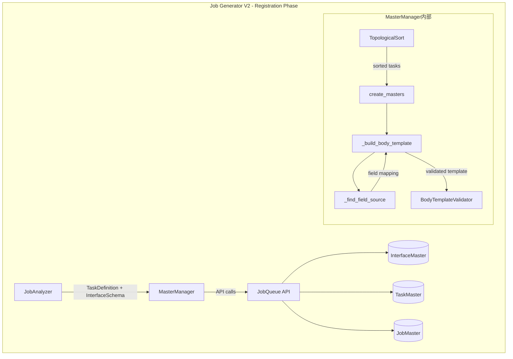
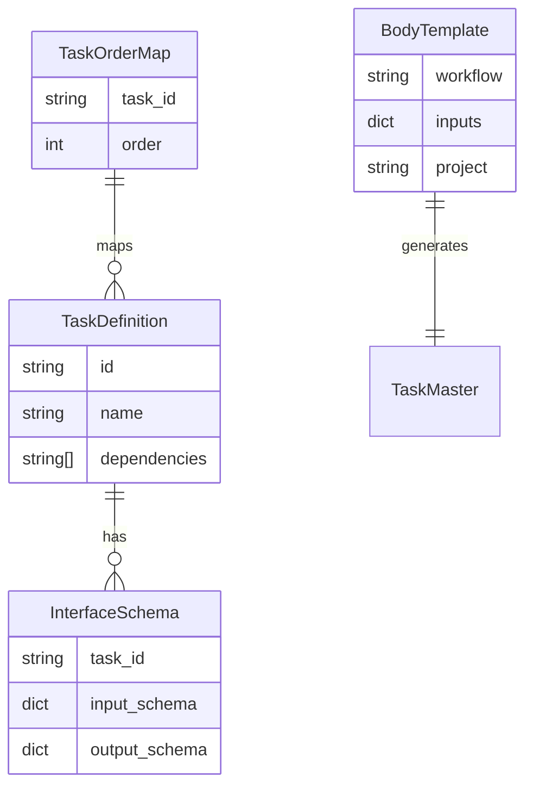

# Issue #403 設計方針書

## 概要

`master_manager.py`の`_build_body_template`メソッドが、interfaceDefinitionsで定義された入力要件を無視し、単に前タスクの出力のみを参照するテンプレートを生成している問題を解決する。これにより、複数タスクからのデータ集約が必要なタスクで必要なデータを正しく取得できるようにする。

## 1. アーキテクチャ設計

### 1.1 システム構成図



### 1.2 レイヤー構成

| レイヤー | 責務 | 主要コンポーネント |
|---------|------|------------------|
| **ワークフロー層** | Job生成フロー制御 | MasterManagerSubWorkflow |
| **ビジネスロジック層** | テンプレート生成・フィールド解決 | _build_body_template, _find_field_source |
| **検証層** | テンプレート整合性検証 | BodyTemplateValidator, ValidationStrategy |
| **データアクセス層** | API通信 | JobqueueClient |

## 2. 技術選定

| カテゴリ | 選定技術 | 選定理由 | 既存との整合性 |
|---------|---------|---------|---------------|
| 言語/フレームワーク | Python 3.12 + dataclass | 型安全性・既存コードベース統一 | ✓ 完全一致 |
| 依存解決アルゴリズム | 既存のtopological_sort | Issue #402で実装済み | ✓ 再利用 |
| テンプレート形式 | Jinja2風変数展開 | 既存の{{}}記法を維持 | ✓ 互換性維持 |
| 検証戦略 | Strategy パターン | Issue #358で導入済み | ✓ 拡張 |

## 3. 設計パターン

### 3.1 採用パターン

1. **Strategy パターン（既存）**
   - BodyTemplateValidator で engine-specific な検証
   - 今回の変更では TaskFlowValidationStrategy を拡張

2. **Builder パターン（新規適用）**
   - body_template の構築を段階的に行う
   - 単一フィールド参照から複数フィールド集約へ拡張

3. **Repository パターン（既存維持）**
   - JobqueueClient を通じたマスターデータアクセス

### 3.2 フィールド解決戦略

```python
# 優先順位ルール（レビュー反映: 2026-01-25）
1. 依存順序優先: 複数の依存タスクが同じフィールドを出力する場合、
                dependenciesリストの順序で最初に見つかったタスクを使用
                ※ 理由: 「最新データ優先」では必要なフィールドが取得できないケースが存在
                ※ 例: task_001(keyword) と task_005(summary,recipient_email) から
                      各フィールドを適切に取得する必要がある
2. フォールバック: 依存タスクに存在しない場合は user_input から取得
3. エラー防止: 循環参照や存在しないフィールドは検証フェーズで検出
4. ログ出力: フォールバック使用時は警告ログを出力
```

## 4. データモデル設計

### 4.1 拡張するデータ構造



### 4.2 body_template の新形式

#### 現在（単一依存）
```json
{
  "workflow": "__PENDING__",
  "inputs": "{{tasks[4].output_data}}",
  "project": "{{job.body.project}}"
}
```

#### 改善後（複数依存集約）
```json
{
  "workflow": "__PENDING__",
  "inputs": {
    "keyword": "{{tasks[0].output_data.keyword}}",
    "summary": "{{tasks[4].output_data.summary}}",
    "recipient_email": "{{tasks[4].output_data.recipient_email}}"
  },
  "project": "{{job.body.project}}"
}
```

## 5. API設計

### 5.1 内部メソッドの変更

#### _build_body_template（シグネチャ変更）

```python
def _build_body_template(
    self,
    order: int,
    task: TaskDefinition | None = None,
    interfaces: dict[str, InterfaceSchema] | None = None,
    task_order_map: dict[str, int] | None = None
) -> dict[str, Any]:
    """
    interfaceDefinitionsを考慮したbody_template生成

    Args:
        order: タスクの実行順序
        task: タスク定義（後方互換性のためオプション）
        interfaces: 全タスクのI/Oスキーマ（後方互換性のためオプション）
        task_order_map: task_id -> order のマッピング（後方互換性のためオプション）

    Returns:
        body_template辞書

    Note:
        task, interfaces, task_order_mapがNoneの場合は従来動作にフォールバック
    """
```

#### _find_field_source（新規追加）

```python
def _find_field_source(
    self,
    field: str,
    dependencies: list[str],
    interfaces: dict[str, InterfaceSchema],
    task_order_map: dict[str, int]
) -> str | None:
    """
    フィールドの取得元タスクを決定する

    Args:
        field: 必要なフィールド名
        dependencies: 依存タスクIDのリスト
        interfaces: 全タスクのI/Oスキーマ
        task_order_map: task_id -> order のマッピング

    Returns:
        フィールドを出力するタスクID（見つからない場合はNone）

    Note:
        【レビュー反映: 2026-01-25】
        dependenciesリストの順序で最初に見つかったタスクを使用する。
        「最新データ優先」戦略では必要なフィールドが取得できないケースが存在するため。
        例: task_001(order=0)のkeywordとtask_005(order=4)のsummaryを
            両方取得する必要がある場合
    """
    # 依存タスクの順序で探索（最初に見つかったものを使用）
    for dep_task_id in dependencies:
        if dep_task_id not in interfaces:
            continue

        output_schema = interfaces[dep_task_id].output_schema
        output_properties = output_schema.get("properties", {})

        if field in output_properties:
            logger.debug(
                f"Field resolution: '{field}' -> '{dep_task_id}' "
                f"(order={task_order_map.get(dep_task_id, -1)})"
            )
            return dep_task_id

    return None
```

### 5.2 エラーハンドリング拡張

```python
# 新規エラータイプ
class FieldResolutionError(WorkflowError):
    """フィールド解決に関するエラー"""

    def __init__(
        self,
        field: str,
        task_id: str,
        dependencies: list[str],
        message: str | None = None,
    ):
        super().__init__(
            message or f"Cannot resolve field '{field}' for task '{task_id}'",
            ErrorType.VALIDATION,
            Phase.REGISTRATION,
        )
        self.field = field
        self.task_id = task_id
        self.dependencies = dependencies
```

### 5.3 ログ出力仕様（レビュー反映: 2026-01-25）

フィールド解決のトレーサビリティを確保するため、以下のログ出力を実装する：

```python
# フィールド解決成功時（DEBUG）
logger.debug(
    f"Field resolution for task '{task.id}': "
    f"{field} -> {source_task} (order={task_order_map.get(source_task, -1)})"
)

# フォールバック使用時（WARNING）
if source_task is None:
    logger.warning(
        f"Field '{required_field}' not found in dependencies "
        f"{task.dependencies} for task '{task.id}', "
        "falling back to user_input"
    )
    inputs_template[field] = f"{{{{job.body.user_input.{field}}}}}"

# フィールド解決完了時（INFO）
logger.info(
    f"Body template generated for task '{task.id}': "
    f"{len(inputs_template)} fields resolved from {len(set(sources))} tasks"
)
```

### 5.4 検証ロジック拡張（レビュー反映: 2026-01-25）

BodyTemplateValidatorに複数フィールド参照の検証を追加：

```python
def validate_multi_field_references(
    self,
    template: dict[str, Any],
    task_id: str,
    interfaces: dict[str, InterfaceSchema],
    task_order_map: dict[str, int]
) -> list[str]:
    """
    複数フィールド参照の妥当性を検証する

    Args:
        template: 生成されたbody_template
        task_id: 対象タスクID
        interfaces: 全タスクのI/Oスキーマ
        task_order_map: task_id -> order のマッピング

    Returns:
        検証エラーのリスト（空なら検証成功）

    検証内容:
        1. 参照先タスクが存在するか
        2. 参照先タスクの出力にフィールドが存在するか
        3. 参照先タスクが依存関係に含まれるか（DAG整合性）
        4. 循環参照がないか
    """
    errors: list[str] = []
    inputs = template.get("inputs", {})

    if not isinstance(inputs, dict):
        return errors  # 旧形式（文字列）の場合はスキップ

    for field, ref in inputs.items():
        # {{tasks[N].output_data.field}} パターンを解析
        match = re.match(r"\{\{tasks\[(\d+)\]\.output_data\.(\w+)\}\}", ref)
        if match:
            order = int(match.group(1))
            ref_field = match.group(2)

            # 参照先タスクの存在確認
            ref_task_id = self._get_task_id_by_order(order, task_order_map)
            if ref_task_id is None:
                errors.append(f"Invalid task reference: order={order} not found")
                continue

            # フィールド存在確認
            if ref_task_id in interfaces:
                output_props = interfaces[ref_task_id].output_schema.get("properties", {})
                if ref_field not in output_props:
                    errors.append(
                        f"Field '{ref_field}' not in output of task '{ref_task_id}'"
                    )

    return errors
```

## 6. セキュリティ設計

### 6.1 テンプレートインジェクション対策

- テンプレート変数は事前定義されたパターンのみ許可
- ユーザー入力の直接埋め込みを禁止
- 検証フェーズでの厳密なチェック

### 6.2 データアクセス制御

- タスク間のデータ参照は依存関係に基づいて制限
- 明示的に依存関係がないタスクのデータへのアクセスを防止

## 7. パフォーマンス設計

### 7.1 計算量の最適化

| 操作 | 計算量 | 説明 |
|-----|--------|------|
| フィールド解決 | O(D × F) | D: 依存数, F: フィールド数 |
| 依存グラフ構築 | O(V + E) | V: タスク数, E: 依存エッジ数 |
| 全体処理 | O(T × (D × F)) | T: タスク数 |

### 7.2 キャッシング戦略

```python
# task_order_map を事前構築してO(1)アクセス
task_order_map: dict[str, int] = {
    task.id: order for order, task in enumerate(sorted_tasks)
}
```

## 8. 設計上の決定事項とトレードオフ

### 8.1 後方互換性の維持

| 決定事項 | 理由 | トレードオフ |
|---------|------|------------|
| オプション引数として拡張 | 既存テストへの影響最小化 | メソッドシグネチャの複雑化 |
| 従来動作へのフォールバック | 段階的移行を可能に | 条件分岐の増加 |
| GraphAIエンジンは変更なし | リスク最小化 | 機能の非対称性 |

### 8.2 フィールド解決の優先順位（レビュー反映: 2026-01-25）

| 決定事項 | 理由 | 代替案 | 変更履歴 |
|---------|------|--------|---------|
| **依存順序で最初に見つかったものを優先** | 各フィールドを適切な依存タスクから取得 | ~~最新データ優先~~ | レビューで変更 |
| user_inputをフォールバック | 初期データの保証 | エラーとして扱う | - |
| フォールバック時は警告ログ出力 | デバッグ容易性・トレーサビリティ | サイレント処理 | レビューで追加 |

**変更理由**:
「最新データ優先」戦略では、以下のケースで必要なフィールドが取得できない：
```
task_001 (order=0): {keyword: "AI"}
task_005 (order=4): {summary: "要約", recipient_email: "test@example.com"}
task_006の入力要件: {keyword, summary, recipient_email}

【旧戦略（最新データ優先）の問題】
- keyword: task_005にないため取得できない（task_001のorder=0 < task_005のorder=4）

【新戦略（依存順序優先）の動作】
- keyword: dependencies=[task_001, task_004, task_005]の順で探索→task_001で発見
- summary: task_001になし→task_004になし→task_005で発見
- recipient_email: task_001になし→task_004になし→task_005で発見
```

### 8.3 実装の段階的アプローチ

**Phase 1（本Issue）**: 基本的な複数依存サポート
- _find_field_source の実装
- _build_body_template の拡張
- 単体・結合テストの追加

**Phase 2（将来）**: 高度な機能
- フィールド変換サポート
- 条件付きフィールド選択
- カスタムフィールドマッピング

## 9. テスト戦略

### 9.1 単体テスト

| テストケース | 目的 | 期待結果 |
|-------------|------|---------|
| test_find_field_source_single | 単一依存の解決 | 正しいタスクID返却 |
| test_find_field_source_multiple | 複数候補からの選択 | **依存順序で最初のタスクを選択** |
| test_find_field_source_not_found | 存在しないフィールド | None返却 |
| test_build_template_multi_deps | 複数依存の集約 | 各フィールド正しく参照 |
| test_backward_compatibility | 旧形式の維持 | 従来動作の保証 |
| **test_multi_source_field_resolution** | **複数ソースからのフィールド取得** | **各フィールドが適切なタスクから取得される** |
| **test_validate_multi_field_references** | **複数フィールド参照の検証** | **不正参照がエラーとして検出される** |
| **test_fallback_with_warning_log** | **フォールバック時のログ出力** | **警告ログが出力される** |

#### 必須テストケース（レビュー反映: 2026-01-25）

```python
def test_multi_source_field_resolution():
    """
    複数の依存タスクから異なるフィールドを取得するテスト

    Setup:
        task_001: output={keyword: "AI"}
        task_004: output={processed: true}
        task_005: output={summary: "要約", recipient_email: "test@example.com"}
        task_006:
            dependencies=[task_001, task_004, task_005]
            input_requirements={keyword, summary, recipient_email}

    Expected:
        body_template.inputs = {
            "keyword": "{{tasks[0].output_data.keyword}}",      # task_001から
            "summary": "{{tasks[4].output_data.summary}}",      # task_005から
            "recipient_email": "{{tasks[4].output_data.recipient_email}}"  # task_005から
        }
    """
    # Given
    interfaces = {
        "task_001": InterfaceSchema(
            task_id="task_001",
            input_schema={},
            output_schema={"properties": {"keyword": {"type": "string"}}}
        ),
        "task_004": InterfaceSchema(
            task_id="task_004",
            input_schema={},
            output_schema={"properties": {"processed": {"type": "boolean"}}}
        ),
        "task_005": InterfaceSchema(
            task_id="task_005",
            input_schema={},
            output_schema={"properties": {
                "summary": {"type": "string"},
                "recipient_email": {"type": "string"}
            }}
        ),
        "task_006": InterfaceSchema(
            task_id="task_006",
            input_schema={"properties": {
                "keyword": {"type": "string"},
                "summary": {"type": "string"},
                "recipient_email": {"type": "string"}
            }},
            output_schema={}
        ),
    }
    task_order_map = {"task_001": 0, "task_004": 3, "task_005": 4, "task_006": 5}
    task = TaskDefinition(
        id="task_006",
        dependencies=["task_001", "task_004", "task_005"]
    )

    # When
    manager = MasterManager(engine="taskflow")
    result = manager._build_body_template(
        order=5, task=task, interfaces=interfaces, task_order_map=task_order_map
    )

    # Then
    assert result["inputs"]["keyword"] == "{{tasks[0].output_data.keyword}}"
    assert result["inputs"]["summary"] == "{{tasks[4].output_data.summary}}"
    assert result["inputs"]["recipient_email"] == "{{tasks[4].output_data.recipient_email}}"
```

### 9.2 結合テスト

```python
# E2Eシナリオ: 実際のワークフロー登録
async def test_multi_dependency_workflow_registration():
    """
    task_001: Gmail検索 → {keyword, message_ids}
    task_004: 要約生成 → {summary}
    task_005: メール詳細 → {recipient_email}
    task_006: メール作成 ← {keyword, summary, recipient_email}
    """
```

## 10. 実装チェックリスト

### 10.1 コア実装
- [ ] _find_field_source メソッドの実装（依存順序優先戦略）
- [ ] _build_body_template の拡張（後方互換性維持）
- [ ] create_masters での task_order_map 構築

### 10.2 検証・ログ（レビュー反映: 2026-01-25）
- [ ] validate_multi_field_references メソッドの実装
- [ ] フィールド解決成功時のDEBUGログ出力
- [ ] フォールバック使用時のWARNINGログ出力
- [ ] フィールド解決完了時のINFOログ出力
- [ ] TaskFlowValidationStrategy の拡張

### 10.3 テスト
- [ ] 単体テストの追加（10件以上）
- [ ] test_multi_source_field_resolution（必須）
- [ ] test_validate_multi_field_references（必須）
- [ ] test_fallback_with_warning_log（必須）
- [ ] 結合テストの追加（E2Eシナリオ）

### 10.4 ドキュメント
- [ ] ドキュメント更新（API_REFERENCE.md）
- [ ] フィールド解決の具体例を追記

## 11. リスクと対策

| リスク | 影響度 | 対策 | 状態 |
|-------|-------|------|------|
| 既存テストの破損 | 高 | オプション引数による後方互換性 | 対策済 |
| 循環参照の複雑化 | 中 | 明確なエラーメッセージ | 対策済 |
| パフォーマンス劣化 | 低 | O(1)アクセスのマップ事前構築 | 対策済 |
| **フィールド解決の優先順位問題** | **高** | **依存順序優先戦略に変更** | **レビューで解決** |
| **デバッグ困難性** | **中** | **ログ出力仕様を追加** | **レビューで解決** |
| **検証不足** | **中** | **validate_multi_field_references追加** | **レビューで解決** |

## 12. 参照ドキュメント

- [expertAgent/docs/API_REFERENCE.md](../expertAgent/docs/API_REFERENCE.md) - Job Generator V2仕様
- [docs/architecture/job-generation-workflow.md](../docs/architecture/job-generation-workflow.md) - ワークフロー全体像
- Issue #402 - トポロジカルソート実装
- Issue #358 - BodyTemplateValidator設計
- Issue #342 - Job Generator V2アーキテクチャ

---

## 13. レビュー履歴

### レビュー #1（2026-01-25）

**レビュワー**: Claude Code（シニアアーキテクト観点）
**判定**: 条件付き承認（Conditionally Approved）

#### 反映した改善項目

**必須改善項目（Must Fix）**:
1. **フィールド解決戦略の修正**
   - 変更前: 「最新データ（order大）優先」
   - 変更後: 「依存順序で最初に見つかったものを優先」
   - 理由: task_001(keyword)とtask_005(summary,recipient_email)から各フィールドを適切に取得する必要があるため

2. **エラーハンドリングの強化**
   - 追加: ログ出力仕様（セクション5.3）
   - 追加: フォールバック使用時の警告ログ

**推奨改善項目（Should Fix）**:
1. **検証ロジックの拡張**
   - 追加: `validate_multi_field_references`メソッド（セクション5.4）
   - 検証内容: 参照先タスク存在確認、フィールド存在確認、DAG整合性

2. **デバッグ情報の追加**
   - 追加: フィールド解決成功時のDEBUGログ
   - 追加: フィールド解決完了時のINFOログ

3. **テストケースの強化**
   - 追加: `test_multi_source_field_resolution`（必須テスト）
   - 追加: `test_validate_multi_field_references`
   - 追加: `test_fallback_with_warning_log`

---

作成日: 2026-01-25
作成者: Claude Code
最終更新: 2026-01-25（レビュー反映）