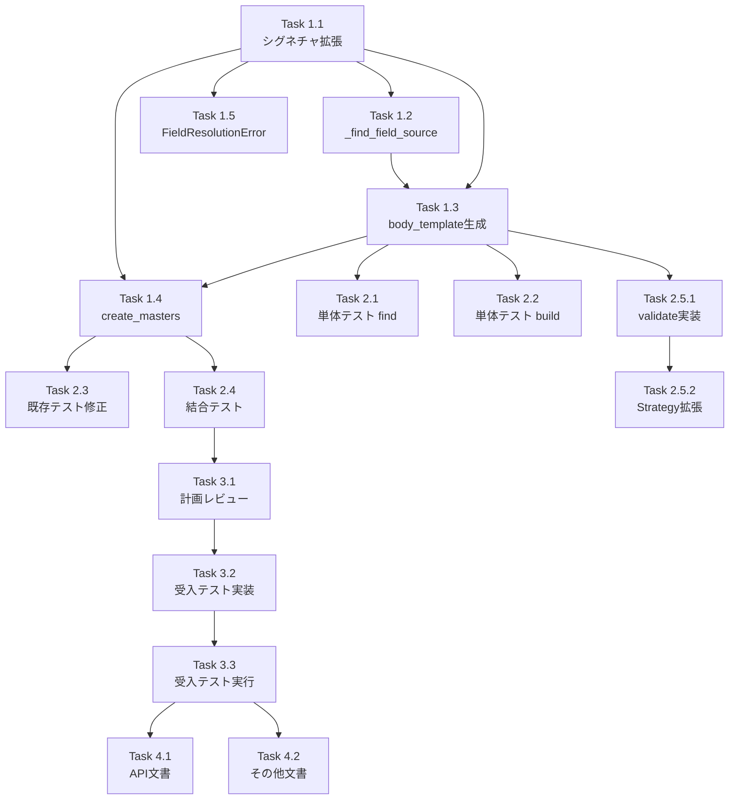

# Issue #403 作業計画書

**作成日**: 2026-01-25
**作成者**: Claude Code

---

## Issue: feat(expertAgent): body_template生成でinterfaceDefinitionsを考慮した複数タスクからのデータ集約

**Issue番号**: #403
**サイズ**: M（中規模）
**作業見積**: 16時間
**優先度**: High
**依存Issue**: #402（トポロジカルソート実装済み）

### 概要
`master_manager.py`の`_build_body_template`メソッドを拡張し、interfaceDefinitionsで定義された入力要件を解析して、複数の依存タスクから必要なフィールドを集約するbody_templateを生成する機能を実装する。

---

## 詳細タスク分解

### Phase 1: 実装タスク（8時間）

#### Task 1.1: メソッドシグネチャ拡張（1時間）
- [ ] `_build_body_template`にオプション引数追加（task, interfaces, task_order_map）
- [ ] 後方互換性のためのNoneチェックとフォールバック処理追加
- [ ] 関連する型定義のインポート確認

#### Task 1.2: _find_field_sourceメソッド実装（2時間）
- [ ] フィールド解決ロジックの実装（依存順序優先戦略）
- [ ] DEBUGログ出力の実装
- [ ] エラーハンドリング（フィールド未発見時のNone返却）
- [ ] ドキュメント文字列の作成

#### Task 1.3: body_template生成ロジック修正（3時間）
- [ ] interfaceDefinitionsから必要なフィールドリスト取得
- [ ] 各フィールドの取得元タスク決定
- [ ] 複数フィールド集約形式のテンプレート生成
- [ ] user_inputへのフォールバック処理
- [ ] WARNINGログ出力（フォールバック時）
- [ ] INFOログ出力（完了時）

#### Task 1.4: create_mastersメソッド修正（1時間）
- [ ] task_order_map構築処理追加
- [ ] _build_body_template呼び出し箇所の修正
- [ ] パラメータ引き渡し処理

#### Task 1.5: FieldResolutionError実装（1時間）
- [ ] エラークラスの定義
- [ ] 適切なモジュールへの配置（errors.pyまたは新規ファイル）
- [ ] エラーメッセージのフォーマット

### Phase 2: テストタスク（TDD - CI実行可能）（4時間）

#### Task 2.1: 単体テスト - _find_field_source（1.5時間）
- [ ] test_find_field_source_single_dependency
- [ ] test_find_field_source_multiple_deps_first_match
- [ ] test_find_field_source_field_not_found
- [ ] test_find_field_source_invalid_interfaces

#### Task 2.2: 単体テスト - _build_body_template（1.5時間）
- [ ] test_build_body_template_multi_dependency_aggregation
- [ ] test_build_body_template_backward_compatibility
- [ ] test_build_body_template_fallback_with_warning_log
- [ ] test_build_body_template_empty_input_schema

#### Task 2.3: 既存テスト修正（0.5時間）
- [ ] シグネチャ変更に伴う既存テストの修正
- [ ] モックオブジェクトの調整

#### Task 2.4: 結合テスト（0.5時間）
- [ ] test_multi_dependency_workflow_registration
- [ ] test_integration_with_body_template_validator

### Phase 2.5: 検証ロジック実装（2時間）

#### Task 2.5.1: validate_multi_field_references実装（1.5時間）
- [ ] BodyTemplateValidatorへのメソッド追加
- [ ] 複数フィールド参照パターンの解析
- [ ] 参照先タスク・フィールドの存在確認
- [ ] DAG整合性チェック

#### Task 2.5.2: TaskFlowValidationStrategy拡張（0.5時間）
- [ ] validate_multi_field_references呼び出し追加
- [ ] エラーメッセージの統合

### Phase 3: L3受入テストタスク（必須）（2時間）

#### Task 3.1: 受入テスト計画レビュー反映（0.5時間）
- [ ] acceptance-plan.mdのレビュー結果確認
- [ ] 推奨改善項目の検討

#### Task 3.2: 受入テスト実装（1時間）
- [ ] test_issue_403_acceptance.py作成
- [ ] TC-001〜TC-008の実装
- [ ] E2Eシナリオの実装

#### Task 3.3: 受入テスト実行（0.5時間）
- [ ] ローカル環境でのサービス起動
- [ ] 受入テスト実行と結果確認
- [ ] デッドコード検証の実施

### Phase 4: ドキュメントタスク（2時間）

#### Task 4.1: API_REFERENCE.md更新（1時間）
- [ ] body_template新形式の説明追加
- [ ] フィールド解決ルールの文書化
- [ ] 具体例の追加

#### Task 4.2: README/その他ドキュメント更新（1時間）
- [ ] expertAgent/README.md更新
- [ ] 設計判断の文書化
- [ ] トラブルシューティングガイド追加

---

## タスク依存関係



---

## 作業スケジュール

### Day 1（8時間）
- **午前（4時間）**: Phase 1実装（Task 1.1〜1.3）
- **午後（4時間）**: Phase 1実装完了（Task 1.4〜1.5）、Phase 2開始（Task 2.1）

### Day 2（8時間）
- **午前（4時間）**: Phase 2テスト実装（Task 2.2〜2.4）、Phase 2.5検証ロジック
- **午後（4時間）**: Phase 3受入テスト、Phase 4ドキュメント

---

## チェックポイント

| タイミング | 確認事項 | 対応 |
|-----------|---------|------|
| Task 1.3完了時 | 後方互換性の確保 | 既存テスト実行で確認 |
| Phase 1完了時 | 静的解析エラーなし | Ruff/MyPy実行 |
| Phase 2完了時 | カバレッジ90%以上 | pytest --cov実行 |
| Phase 3完了時 | 全受入条件クリア | acceptance-plan.md確認 |

---

## リスクと対策

| リスク | 発生確率 | 影響 | 対策 |
|-------|---------|------|------|
| 既存テスト破損 | 中 | 高 | オプション引数で後方互換性維持 |
| mySwiftAgentCore非互換 | 低 | 高 | 事前に新形式サポート確認 |
| パフォーマンス劣化 | 低 | 中 | O(1)マップで最適化 |
| フィールド解決の複雑化 | 中 | 中 | 詳細なログ出力で追跡 |

---

## 成果物チェックリスト

### コード
- [ ] `master_manager.py` - _find_field_source実装
- [ ] `master_manager.py` - _build_body_template拡張
- [ ] `master_manager.py` - create_masters修正
- [ ] `errors.py`（または適切な場所） - FieldResolutionError
- [ ] `body_template_validator.py` - validate_multi_field_references

### テスト
- [ ] `test_master_manager.py` - 単体テスト追加（8件以上）
- [ ] `test_registration_validation.py` - 結合テスト追加
- [ ] `test_issue_403_acceptance.py` - 受入テスト（新規）

### ドキュメント
- [ ] `API_REFERENCE.md` - body_template形式説明
- [ ] `README.md` - 機能説明追加
- [ ] `acceptance-plan.md` - 作成済み
- [ ] `work-plan.md` - 本ファイル

---

## L3受入テスト計画【必須セクション】

### サービス起動確認
```bash
# Platform層サービス起動（myVault等）
./scripts/dev-hybrid.sh start --local-only

# サービスヘルスチェック
curl -sf http://localhost:8004/health && echo "✅ expertAgent healthy"
curl -sf http://localhost:8001/health && echo "✅ jobqueue healthy"
curl -sf http://localhost:8003/health && echo "✅ myVault healthy"
```

### 正常系テスト - 複数依存ワークフロー生成
```bash
# Step 1: Job生成開始
JOB_ID=$(curl -s -X POST http://localhost:8004/v2/jobs/generate \
  -H "Content-Type: application/json" \
  -d '{
    "input": "キーワード検索してメール詳細を取得し、要約を作成してメールを送信する",
    "engine": "taskflow",
    "project": "default_project"
  }' | jq -r '.job_id')

echo "Job ID: $JOB_ID"

# Step 2: ステータス確認（完了待機）
while true; do
  STATUS=$(curl -s "http://localhost:8004/v2/jobs/$JOB_ID/status" | jq -r '.status')
  echo "Status: $STATUS"
  [[ "$STATUS" == "completed" ]] && break
  [[ "$STATUS" == "failed" ]] && exit 1
  sleep 2
done

# Step 3: 結果取得とbody_template確認
RESULT=$(curl -s "http://localhost:8004/v2/jobs/$JOB_ID/result")
echo "$RESULT" | jq '.'

# Step 4: task_006のbody_template検証
TASK_006_TEMPLATE=$(echo "$RESULT" | jq -r '.task_masters[] | select(.task_id == "task_006") | .body_template')
echo "Task 006 body_template:"
echo "$TASK_006_TEMPLATE" | jq '.'

# 期待値確認
echo "$TASK_006_TEMPLATE" | jq -e '.inputs.keyword == "{{tasks[0].output_data.keyword}}"'
echo "$TASK_006_TEMPLATE" | jq -e '.inputs.summary == "{{tasks[4].output_data.summary}}"'
echo "$TASK_006_TEMPLATE" | jq -e '.inputs.recipient_email == "{{tasks[4].output_data.recipient_email}}"'
```

### 異常系テスト - フィールド解決エラー
```bash
# 意図的に不正なinterfaceDefinitionsでテスト
curl -s -X POST http://localhost:8004/v2/jobs/generate \
  -H "Content-Type: application/json" \
  -d '{
    "input": "存在しないフィールドを要求するタスク",
    "engine": "taskflow",
    "project": "default_project"
  }' | jq '.'
```

### デッドコード検証
```bash
# _find_field_source使用確認
grep -rn "_find_field_source" expertAgent/ --include="*.py" | grep -v "def _find_field_source"

# validate_multi_field_references使用確認
grep -rn "validate_multi_field_references" expertAgent/ --include="*.py" | grep -v "def validate_multi_field_references"

# FieldResolutionError使用確認
grep -rn "FieldResolutionError" expertAgent/ --include="*.py" | grep -v "class FieldResolutionError"
```

---

## Definition of Done

Issue完了条件：

### コード品質
- [x] すべての実装タスクが完了
- [x] 単体テストカバレッジ90%以上
- [x] 静的解析エラーゼロ（Ruff/MyPy）
- [x] コードレビュー承認

### テスト
- [x] 全単体テストがパス
- [x] 全結合テストがパス
- [x] L3受入テスト全パス（TC-001〜TC-008）
- [x] デッドコード検証完了

### ドキュメント
- [x] API_REFERENCE.md更新
- [x] README更新
- [x] 設計方針書承認済み
- [x] 受入テスト計画承認済み

### CI/CD
- [x] GitHub ActionsでCIグリーン
- [x] プルリクエスト作成
- [x] マージ準備完了

---

## 備考

- 設計方針書のレビュー反映済み（依存順序優先戦略、ログ出力強化）
- 受入テスト計画レビューで「承認」判定取得済み
- mySwiftAgentCore側の新形式body_template互換性は事前確認推奨