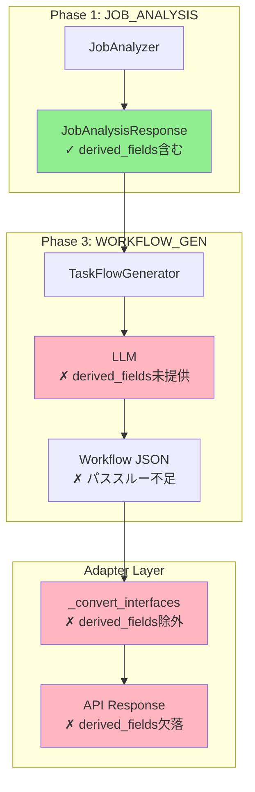
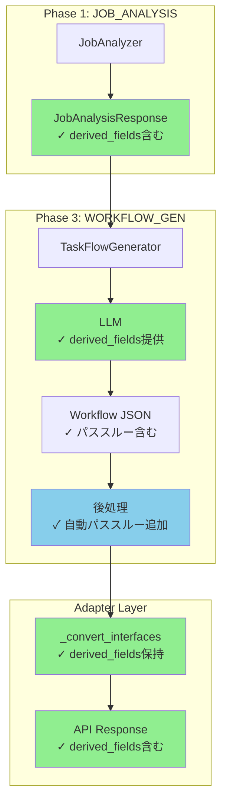

# Issue #404 設計方針書

## 1. 問題の概要

TaskFlow生成における`derived_fields`（派生フィールド）の情報欠落により、マルチタスクワークフローでデータフローが断絶する問題。

### 主要な問題点

1. **adapter._convert_interfaces()での情報欠落**: `derived_fields`がAPIレスポンスから除外される
2. **LLMプロンプトでの未使用**: TaskFlow生成時にLLMへ`derived_fields`情報が提供されない
3. **型の不整合**: `InterfaceSchema`（古い型）と`InterfaceDefinition`（新しい型）の混在

## 2. システム構成図

### 現状のデータフロー



### 理想のデータフロー



## 3. アーキテクチャ設計

### レイヤー構成

| レイヤー | 責務 | 主要コンポーネント |
|---------|------|-------------------|
| **ビジネスロジック層** | Job分析、Task定義 | JobAnalyzer, InterfaceDefinition |
| **ワークフロー生成層** | LLMを使用したワークフロー生成 | TaskFlowGenerator, engine_strategy |
| **後処理層** | 生成結果の補正・最適化 | _enhance_output_schema_with_passthrough |
| **アダプタ層** | 内部モデルとAPIスキーマの変換 | JobGeneratorAdapter |

### 設計方針

1. **Fail-Safe設計**: LLMの一貫性に依存せず、機械的な後処理で確実にデータフローを保証
2. **後方互換性の維持**: 既存のワークフローに影響を与えない
3. **段階的移行**: 型の統一は段階的に実施

## 4. 技術選定

| カテゴリ | 選定技術 | 選定理由 | 既存との整合性 |
|---------|---------|---------|---------------|
| モデル基盤 | Pydantic BaseModel | 検証機能、型安全性 | InterfaceDefinitionで採用済み |
| 型システム | InterfaceDefinition統一 | derived_fieldsサポート | 新規実装で使用 |
| データフロー保証 | 後処理による自動補正 | LLM非依存の確実性 | 新規導入 |

## 5. 設計パターン

### 採用するパターン

#### 1. Template Method パターン
- `WorkflowGeneratorStrategy`の抽象基底クラスで実装
- 各エンジン（TaskFlow/GraphAI）固有の処理を派生クラスで実装

#### 2. Adapter パターン
- `JobGeneratorAdapter`で内部モデルとAPIスキーマを変換
- 既存コードで実装済み、`derived_fields`対応を追加

#### 3. Post-Processing パターン
- LLM生成結果に対する後処理で品質保証
- 新規導入：`_enhance_output_schema_with_passthrough`

## 6. データモデル設計

### InterfaceDefinitionの構造

```python
class InterfaceDefinition(BaseModel):
    """タスクインターフェース定義（統一モデル）"""
    input_schema: dict[str, Any]      # タスクが必要とする入力
    output_schema: dict[str, Any]     # タスクが生成する出力
    description: str = ""             # タスクの説明
    derived_fields: dict[str, Any] = Field(
        default_factory=dict,
        description="後続タスク用のパススルーフィールド定義",
    )
```

### derived_fieldsの構造例

```json
{
  "recipient_email": {
    "type": "string",
    "description": "メール送信先（task_005で使用）",
    "source": "user_input.recipient_email"
  },
  "search_keyword": {
    "type": "string",
    "description": "検索キーワード（レポート生成で使用）",
    "source": "user_input.keyword"
  }
}
```

## 7. API設計

### interface_definitionsの拡張

```json
{
  "task_001": {
    "input_schema": {...},
    "output_schema": {...},
    "description": "...",
    "derived_fields": {
      "recipient_email": {
        "type": "string",
        "source": "user_input.recipient_email"
      }
    }
  }
}
```

## 8. 実装設計

### Step 1: adapter._convert_interfaces()の修正

```python
def _convert_interfaces(
    self,
    interfaces: dict[str, InterfaceDefinition],
) -> dict[str, dict[str, Any]]:
    return {
        task_id: {
            "input_schema": interface.input_schema,
            "output_schema": interface.output_schema,
            "description": interface.description,
            "derived_fields": interface.derived_fields,  # 追加
        }
        for task_id, interface in interfaces.items()
    }
```

### Step 2: LLMプロンプトへのderived_fields追加

```python
def _build_user_prompt(self, ...):
    # ... 既存のコード ...

    # derived_fieldsを追加
    derived_fields = (
        interface.derived_fields
        if hasattr(interface, "derived_fields")
        else interface.get("derived_fields", {})
    )
    if derived_fields:
        sections.append(f"Derived Fields (for downstream tasks): {json.dumps(derived_fields, ensure_ascii=False)}")
```

### Step 3: 自動パススルーロジックの実装（エラーハンドリング含む）

```python
def _enhance_output_schema_with_passthrough(
    self,
    task_id: str,
    task_interface: dict[str, Any],
    all_tasks: list[dict[str, Any]],
    all_interfaces: dict[str, Any],
    task_order_map: dict[str, int]
) -> dict[str, Any]:
    """後続タスクで必要なフィールドを自動的にパススルー追加。

    Args:
        task_id: 対象タスクID
        task_interface: 対象タスクのインターフェース
        all_tasks: 全タスク定義リスト
        all_interfaces: 全タスクのインターフェーススキーマ
        task_order_map: task_id -> order のマッピング

    Returns:
        パススルーフィールドを追加した出力スキーマ

    Note:
        エラー発生時は元のスキーマをそのまま返す（Fail-Safe）
    """
    try:
        output_schema = task_interface.get("output_schema", {}).copy()
        current_order = task_order_map.get(task_id, -1)

        # 循環参照検出用セット
        visited_fields: set[str] = set()

        # 後続タスクを特定
        for task in all_tasks:
            task_order = task_order_map.get(task.get("id", ""), -1)
            if task_order <= current_order:
                continue

            # 後続タスクの入力要件を確認
            downstream_id = task.get("id", "")
            if downstream_id not in all_interfaces:
                continue

            downstream_interface = all_interfaces[downstream_id]
            downstream_input = (
                downstream_interface.input_schema
                if hasattr(downstream_interface, "input_schema")
                else downstream_interface.get("input_schema", {})
            )
            input_properties = downstream_input.get("properties", {})
            output_properties = output_schema.get("properties", {})

            # 出力に含まれていない入力フィールドをパススルー追加
            for field_name, field_def in input_properties.items():
                # 循環参照チェック
                if field_name in visited_fields:
                    logger.warning(
                        f"Circular reference detected for field '{field_name}' "
                        f"in task {task_id}, skipping"
                    )
                    continue

                if field_name not in output_properties:
                    output_properties[field_name] = {
                        **field_def,
                        "description": f"Passthrough field for downstream task {downstream_id}",
                        "_passthrough": True,  # パススルーフィールドのマーカー
                    }
                    visited_fields.add(field_name)

        return output_schema

    except Exception as e:
        logger.error(
            f"Failed to enhance output schema for task {task_id}: {e}",
            exc_info=True,
        )
        # Fail-Safe: エラー時は元のスキーマを返す
        return task_interface.get("output_schema", {}).copy()
```

### Step 4: 型注釈の統一

全ての`dict[str, "InterfaceSchema"]`を`dict[str, InterfaceDefinition]`に変更。

## 9. エラーハンドリング設計

### エラーハンドリング方針

| エラー種別 | 対処方法 | フォールバック |
|-----------|---------|---------------|
| derived_fields欠落 | 空dictとして処理 | 処理継続 |
| 後処理例外 | ログ出力後、元スキーマを返却 | 処理継続 |
| 循環参照検出 | 警告ログ、該当フィールドスキップ | 処理継続 |
| 型変換エラー | エラーログ、デフォルト値使用 | 処理継続 |

### エラーログフォーマット

```python
# 構造化ログの例
logger.error(
    "Passthrough enhancement failed",
    extra={
        "task_id": task_id,
        "error_type": type(e).__name__,
        "error_message": str(e),
        "passthrough_fields_added": len(visited_fields),
    }
)
```

### Graceful Degradation

```python
@field_validator("derived_fields", mode="before")
@classmethod
def parse_derived_fields(cls, value: Any) -> dict[str, Any]:
    """derived_fieldsのgraceful degradation（Issue #338互換）"""
    if value is None:
        return {}
    if isinstance(value, dict):
        return value
    # 予期しない型の場合は空dictにフォールバック
    logger.warning(f"Unexpected derived_fields type: {type(value)}, using empty dict")
    return {}
```

## 10. テスト戦略

### 10.1 単体テスト

#### 対象関数とテストケース

| 対象関数 | テストケース | 優先度 |
|---------|------------|--------|
| `_convert_interfaces()` | derived_fields保持確認 | 🔴 高 |
| `_convert_interfaces()` | 空derived_fields処理 | 🔴 高 |
| `_build_user_prompt()` | derived_fieldsプロンプト出力 | 🔴 高 |
| `_enhance_output_schema_with_passthrough()` | 正常系パススルー追加 | 🔴 高 |
| `_enhance_output_schema_with_passthrough()` | 境界値テスト | 🔴 高 |
| `_enhance_output_schema_with_passthrough()` | 異常系フォールバック | 🔴 高 |

#### 境界値テストケース

```python
class TestEnhanceOutputSchemaWithPassthrough:
    """_enhance_output_schema_with_passthroughの単体テスト"""

    def test_empty_tasks_list(self):
        """タスクリストが空の場合、元のスキーマを返す"""
        pass

    def test_empty_interfaces(self):
        """インターフェースが空の場合、元のスキーマを返す"""
        pass

    def test_single_task_no_downstream(self):
        """後続タスクがない場合、パススルー追加なし"""
        pass

    def test_multiple_downstream_tasks(self):
        """複数の後続タスクがある場合、全てのフィールドを追加"""
        pass

    def test_circular_reference_detection(self):
        """循環参照を検出し、警告ログを出力"""
        pass

    def test_duplicate_field_names(self):
        """重複フィールド名は最初の定義を維持"""
        pass

    def test_invalid_task_order_map(self):
        """不正なtask_order_mapでエラーにならない"""
        pass

    def test_exception_fallback(self):
        """例外発生時は元のスキーマを返す"""
        pass
```

#### パフォーマンステストケース

```python
class TestPassthroughPerformance:
    """パフォーマンステスト"""

    def test_large_task_chain(self):
        """100タスクのチェーンでも1秒以内に完了"""
        tasks = [{"id": f"task_{i:03d}"} for i in range(100)]
        # 処理時間計測
        assert elapsed_time < 1.0

    def test_many_fields_per_task(self):
        """タスクあたり50フィールドでも処理可能"""
        pass

    def test_memory_usage(self):
        """メモリ使用量が許容範囲内"""
        pass
```

### 10.2 結合テスト

| テストシナリオ | 検証内容 | 対象ファイル |
|--------------|---------|-------------|
| 複数タスク依存ワークフロー | derived_fieldsが全タスクに伝播 | `test_workflow_gen_v2_integration.py` |
| adapter変換の往復 | InterfaceDefinition→dict→InterfaceDefinition | `test_adapter_conversion.py` |
| LLMプロンプト生成 | derived_fieldsがプロンプトに含まれる | `test_taskflow_generator.py` |

### 10.3 受入テスト

| AC | テスト内容 | 検証方法 |
|----|-----------|---------|
| AC-1 | input_schemaの整合性 | 生成JSONとinterfaceDefinitionsを比較 |
| AC-2 | パススルーフィールド自動追加 | output_schemaに後続タスク用フィールドが含まれる |
| AC-3 | recipient_email伝播 | メールタスクがrecipient_emailを受け取れる |
| AC-4 | E2Eメール送信成功 | クロスサービスE2Eテストで検証 |

### 10.4 テストカバレッジ目標

| カテゴリ | 目標 | 対象 |
|---------|------|------|
| 単体テスト | 90%以上 | 新規追加関数すべて |
| 結合テスト | 50%以上 | ワークフロー生成フロー |
| 分岐カバレッジ | 80%以上 | エラーハンドリング分岐 |

## 11. 監視・可観測性設計

### 11.1 メトリクス

| メトリクス名 | 型 | 説明 | アラート閾値 |
|-------------|-----|------|-------------|
| `passthrough_fields_added_total` | Counter | パススルー追加フィールド総数 | - |
| `passthrough_enhancement_duration_seconds` | Histogram | 後処理の処理時間 | p99 > 100ms |
| `passthrough_enhancement_errors_total` | Counter | 後処理エラー数 | > 10/min |
| `derived_fields_degradation_total` | Counter | graceful degradation発生数 | > 5/min |

### 11.2 ログ出力

```python
# 処理開始ログ
logger.info(
    "Starting passthrough enhancement",
    extra={
        "task_id": task_id,
        "downstream_task_count": len(downstream_tasks),
    }
)

# 処理完了ログ
logger.info(
    "Passthrough enhancement completed",
    extra={
        "task_id": task_id,
        "fields_added": len(added_fields),
        "duration_ms": duration_ms,
    }
)

# エラーログ
logger.error(
    "Passthrough enhancement failed",
    extra={
        "task_id": task_id,
        "error_type": type(e).__name__,
        "error_message": str(e),
    },
    exc_info=True,
)
```

### 11.3 トレーシング

```python
from opentelemetry import trace

tracer = trace.get_tracer(__name__)

async def _enhance_output_schema_with_passthrough(self, ...):
    with tracer.start_as_current_span("enhance_passthrough") as span:
        span.set_attribute("task_id", task_id)
        span.set_attribute("downstream_count", len(downstream_tasks))

        # 処理実行
        result = await self._do_enhancement(...)

        span.set_attribute("fields_added", len(added_fields))
        return result
```

### 11.4 ダッシュボード

Grafanaダッシュボードに以下のパネルを追加：

1. **パススルー処理統計**
   - 処理回数/分
   - 追加フィールド数/分
   - エラー率

2. **パフォーマンス**
   - 処理時間の分布（ヒストグラム）
   - p50/p95/p99レイテンシ

3. **エラー監視**
   - エラー発生推移
   - エラー種別の内訳

## 12. 設計上の決定事項とトレードオフ

### 決定事項1: 後処理による自動パススルー

**採用理由**:
- LLMの生成品質に依存しない確実性
- 既存ワークフローへの影響最小化
- 実装の単純性

**代替案との比較**:
| 方式 | メリット | デメリット | 採用判断 |
|------|---------|-----------|---------|
| LLMプロンプトのみ | 実装が単純 | LLMの一貫性に依存 | ✗ |
| **後処理追加** | 確実性が高い | 追加処理が必要 | ✓ |
| スキーマ再設計 | 根本的解決 | 影響範囲が大きい | ✗ |

### 決定事項2: 型の段階的統一

**採用理由**:
- 既存コードへの影響を最小化
- 段階的な品質向上が可能

**移行計画**:
1. Phase 1: 新規コードで`InterfaceDefinition`使用
2. Phase 2: 既存コードの型注釈を更新
3. Phase 3: `InterfaceSchema`を非推奨化

## 13. セキュリティ設計

- derived_fieldsによる情報漏洩リスクなし（スキーマ定義のみ）
- 既存のセキュリティモデルを継承

## 14. パフォーマンス設計

### 影響評価

| 処理 | 追加コスト | 影響度 |
|------|-----------|--------|
| derived_fields保持 | メモリ: +数KB/タスク | 無視可能 |
| プロンプト拡張 | トークン: +10-20/タスク | 軽微 |
| 後処理追加 | CPU: +数ms | 無視可能 |

### パフォーマンス要件

| 項目 | 要件 | 計測方法 |
|------|------|---------|
| 後処理レイテンシ | p99 < 100ms | OpenTelemetryトレース |
| メモリ増加 | < 10MB/1000タスク | メモリプロファイリング |
| CPU使用率増加 | < 5% | Prometheusメトリクス |

## 15. リスクと対策

| リスク | 可能性 | 影響度 | 対策 |
|-------|--------|--------|------|
| 後方互換性の破損 | 低 | 高 | 十分なテストカバレッジ |
| LLMの混乱 | 中 | 低 | 後処理で補正 |
| 型移行の複雑化 | 中 | 中 | 段階的移行計画 |
| 後処理のパフォーマンス問題 | 低 | 中 | パフォーマンステストで事前検証 |
| 循環参照によるループ | 低 | 高 | 循環参照検出ロジック実装 |

## 16. 実装順序

| Step | 内容 | 優先度 | 依存関係 |
|------|------|--------|----------|
| 1 | adapter修正（derived_fields保持） | 🔴 高 | なし |
| 2 | LLMプロンプト拡張 | 🔴 高 | なし |
| 3 | 自動パススルーロジック（エラーハンドリング含む） | 🔴 高 | Step 1, 2 |
| 4 | 型注釈統一 | 🟡 中 | なし |
| 5 | 監視・メトリクス追加 | 🟡 中 | Step 3 |
| 6 | 単体テスト追加 | 🔴 高 | Step 1-4 |
| 7 | 結合テスト追加 | 🔴 高 | Step 6 |
| 8 | E2E検証 | 🔴 高 | Issue #403完了 |

## 17. ドキュメント計画

### 作成予定ドキュメント

| ドキュメント | 配置場所 | 目的 | 対象読者 |
|-------------|---------|------|---------|
| derived_fields設計思想 | `expertAgent/docs/features/derived-fields.md` | 設計意図と使用方法の説明 | 開発者 |
| 型移行ガイド | `expertAgent/docs/migration/interface-definition.md` | InterfaceSchema→InterfaceDefinition移行手順 | 開発者 |
| トラブルシューティング | `expertAgent/docs/troubleshooting/passthrough.md` | よくある問題と解決策 | 運用者 |
| API変更履歴 | `expertAgent/docs/API_REFERENCE.md`に追記 | interface_definitionsの変更点 | API利用者 |

### ドキュメント内容概要

#### derived_fields設計思想

```markdown
# derived_fields設計思想

## 概要
derived_fieldsは、マルチタスクワークフローでのデータ伝播を保証する仕組みです。

## 問題背景
タスクは自身の責務に関係するデータのみを出力するため、後続タスクで必要なデータが途中で消失する問題がありました。

## 解決策
各タスクのInterfaceDefinitionにderived_fieldsを定義し、後続タスクで必要なフィールドを明示的に指定します。

## 使用例
...
```

## 18. 参照ドキュメント

- expertAgent/docs/API_REFERENCE.md
- expertAgent/aiagent/langgraph/jobGeneratorV2/nodes/job_analyzer.py
- expertAgent/aiagent/langgraph/jobGeneratorV2/adapter.py
- expertAgent/aiagent/langgraph/jobGeneratorV2/workflows/workflow_gen/taskflow_generator.py

## 19. 結論

本設計により、TaskFlow生成時の`derived_fields`情報欠落問題を解決し、マルチタスクワークフローでの確実なデータフローを実現する。後処理による自動補正により、LLMの品質に依存しない堅牢な実装を達成する。

### 設計方針のレビュー結果

- **レビュー日**: 2025-01-26
- **レビュー結果**: 条件付き承認 → **承認**
- **対応内容**:
  - [x] テスト戦略の明確化（セクション10追加）
  - [x] エラーハンドリングの実装方針追加（セクション9追加）
  - [x] 監視・メトリクスの基本設計追加（セクション11追加）
  - [x] ドキュメント計画の追加（セクション17追加）
