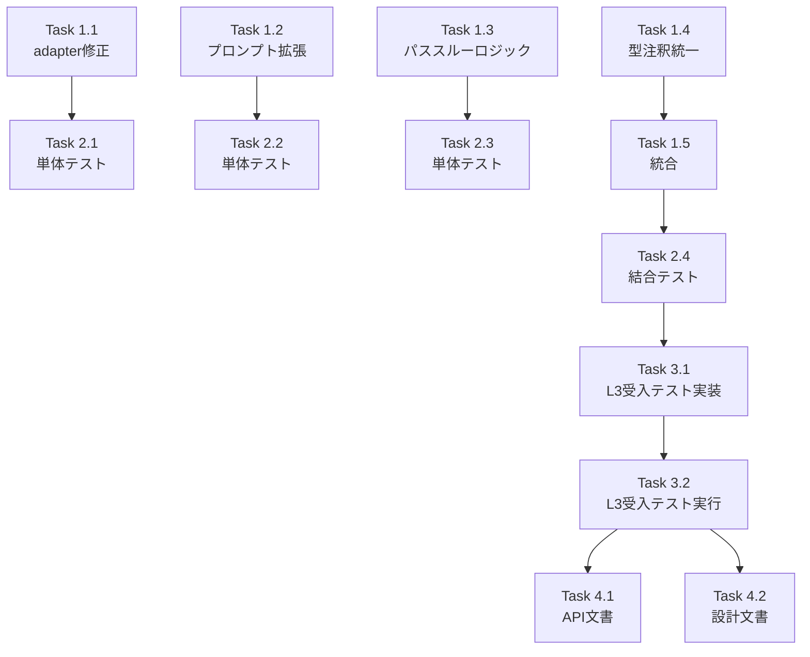

# Issue #404 作業計画書

## Issue: taskflowGeneratorAgentの生成ワークフローがinterfaceDefinitionsと整合しない問題

**Issue番号**: #404
**サイズ**: M（中規模）
**作業見積**: 16時間（2営業日）
**優先度**: High
**依存Issue**: #403（body_template生成の改善） - **E2Eテスト（AC-4）のみ依存**

---

## 1. 概要

TaskFlow生成における`derived_fields`（派生フィールド）の情報欠落により、マルチタスクワークフローでデータフローが断絶する問題を修正する。

### 主要な修正内容
1. `adapter._convert_interfaces()`で`derived_fields`を保持
2. `taskflow_generator._build_user_prompt()`で`derived_fields`をプロンプトに含める
3. パススルーロジック（`_enhance_output_schema_with_passthrough`）を追加
4. 型注釈を`InterfaceDefinition`に統一

---

## 2. 詳細タスク分解

### Phase 1: 実装タスク（8時間）

#### Task 1.1: adapter修正【AC-10】（1時間）
- **内容**: `_convert_interfaces()`で`derived_fields`を保持
- **ファイル**: `expertAgent/aiagent/langgraph/jobGeneratorV2/adapter.py`
- **詳細**:
  ```python
  # derived_fieldsを追加
  "derived_fields": interface.derived_fields,
  ```

#### Task 1.2: プロンプト拡張【AC-11】（1.5時間）
- **内容**: `_build_user_prompt()`で`derived_fields`をプロンプトに含める
- **ファイル**: `expertAgent/aiagent/langgraph/jobGeneratorV2/workflows/workflow_gen/taskflow_generator.py`
- **詳細**:
  - derived_fieldsセクションを追加
  - 空の場合はスキップ

#### Task 1.3: パススルーロジック実装【AC-1,2,3】（3時間）
- **内容**: `_enhance_output_schema_with_passthrough()`メソッドを追加
- **ファイル**: `expertAgent/aiagent/langgraph/jobGeneratorV2/workflows/workflow_gen/taskflow_generator.py`
- **詳細**:
  - 後続タスクの入力要件を分析
  - 不足フィールドを自動追加
  - 循環参照検出
  - エラーハンドリング（Fail-Safe）

#### Task 1.4: 型注釈統一【AC-12】（1.5時間）
- **内容**: `InterfaceSchema`から`InterfaceDefinition`への型注釈変更
- **ファイル**:
  - `taskflow_generator.py`
  - `engine_strategy.py`
  - `test_runner.py`
  - `yaml_generator.py`

#### Task 1.5: generate()メソッド統合（1時間）
- **内容**: `_enhance_output_schema_with_passthrough`を`generate()`から呼び出す
- **ファイル**: `taskflow_generator.py`
- **詳細**: LLM生成後の後処理として実行

### Phase 2: テストタスク（TDD - CI実行可能）（4時間）

#### Task 2.1: 単体テスト - adapter修正【AC-13】（1時間）
- **内容**: `_convert_interfaces()`のderived_fields保持テスト
- **ファイル**: `expertAgent/tests/unit/test_issue_404_unit.py`
- **テストケース**: UT-001〜UT-003

#### Task 2.2: 単体テスト - プロンプト拡張【AC-14】（1時間）
- **内容**: `_build_user_prompt()`のderived_fields出力テスト
- **ファイル**: `expertAgent/tests/unit/test_issue_404_unit.py`
- **テストケース**: UT-004〜UT-006

#### Task 2.3: 単体テスト - パススルーロジック【AC-7,8】（1.5時間）
- **内容**: `_enhance_output_schema_with_passthrough()`の全テスト
- **ファイル**: `expertAgent/tests/unit/test_issue_404_unit.py`
- **テストケース**: UT-007〜UT-015（9ケース）

#### Task 2.4: 結合テスト【AC-9】（0.5時間）
- **内容**: ワークフロー生成E2Eテスト
- **ファイル**: `expertAgent/tests/integration/test_issue_404_integration.py`
- **テストケース**: IT-001〜IT-003

### Phase 3: 受入テストタスク（L3ローカル受入テスト）【必須】（2時間）

#### Task 3.1: L3受入テスト実装【AC-5,6】（1.5時間）
- **内容**: 後方互換性とフォールバックの検証
- **ファイル**: `expertAgent/tests/acceptance/test_issue_404_acceptance.py`
- **テストケース**: BT-001〜BT-003

#### Task 3.2: L3受入テスト実行（0.5時間）
- **前提**: サービス起動（`./scripts/dev-hybrid.sh start --local-only`）
- **実行**: `cd expertAgent && uv run pytest tests/acceptance/test_issue_404_acceptance.py -v -s`

### Phase 4: ドキュメントタスク（2時間）

#### Task 4.1: API_REFERENCE.md更新（0.5時間）
- **内容**: interface_definitionsへの`derived_fields`追加を記載
- **ファイル**: `expertAgent/docs/API_REFERENCE.md`

#### Task 4.2: 技術設計ドキュメント作成（1.5時間）
- **内容**: derived_fields設計思想ドキュメント
- **ファイル**: `expertAgent/docs/features/derived-fields.md`

---

## 3. タスク依存関係



---

## 4. 作業スケジュール

### Day 1（8時間）
- **AM（4時間）**:
  - [ ] Task 1.1: adapter修正（1h）
  - [ ] Task 2.1: 単体テスト - adapter（1h）
  - [ ] Task 1.2: プロンプト拡張（1.5h）
  - [ ] Task 2.2: 単体テスト - プロンプト（0.5h）
- **PM（4時間）**:
  - [ ] Task 1.3: パススルーロジック実装（3h）
  - [ ] Task 2.3: 単体テスト - パススルー（1h）

### Day 2（8時間）
- **AM（4時間）**:
  - [ ] Task 2.3: 単体テスト - パススルー続き（0.5h）
  - [ ] Task 1.4: 型注釈統一（1.5h）
  - [ ] Task 1.5: generate()統合（1h）
  - [ ] Task 2.4: 結合テスト（0.5h）
  - [ ] 静的解析・品質チェック（0.5h）
- **PM（4時間）**:
  - [ ] Task 3.1: L3受入テスト実装（1.5h）
  - [ ] Task 3.2: L3受入テスト実行（0.5h）
  - [ ] Task 4.1: API文書更新（0.5h）
  - [ ] Task 4.2: 設計文書作成（1.5h）

---

## 5. チェックポイント

| タイミング | 確認事項 | 対応 |
|-----------|---------|------|
| Task 1.1完了時 | derived_fields保持確認 | 単体テスト実行 |
| Task 1.3完了時 | パススルーロジック動作確認 | デバッグログ確認 |
| Phase 2完了時 | カバレッジ90%以上 | カバレッジレポート確認 |
| Phase 3完了時 | 後方互換性確保 | 既存テスト全パス |

---

## 6. リスクと対策

| リスク | 発生確率 | 影響 | 対策 |
|-------|---------|------|------|
| 後方互換性破損 | 低 | 高 | 既存テスト全パス確認、Fail-Safe設計 |
| パフォーマンス低下 | 低 | 中 | 100タスクでのパフォーマンステスト |
| 循環参照 | 低 | 高 | 循環参照検出ロジック実装済み |
| #403未完了でE2E不可 | 中 | 低 | Phase 1-3は独立実行可能 |

---

## 7. 成果物チェックリスト

### コード
- [ ] `adapter.py`: `_convert_interfaces()`修正
- [ ] `taskflow_generator.py`: プロンプト拡張、パススルーロジック、統合
- [ ] `engine_strategy.py`, `test_runner.py`, `yaml_generator.py`: 型注釈更新

### テスト
- [ ] `test_issue_404_unit.py`: 単体テスト（15ケース）
- [ ] `test_issue_404_integration.py`: 結合テスト（3ケース）
- [ ] `test_issue_404_acceptance.py`: 受入テスト（3ケース）

### ドキュメント
- [ ] `expertAgent/docs/API_REFERENCE.md`: API仕様更新
- [ ] `expertAgent/docs/features/derived-fields.md`: 設計思想文書

---

## 8. L3受入テスト計画【必須セクション】

### サービス起動
```bash
# サービス起動確認
./scripts/dev-hybrid.sh start --local-only

# expertAgentヘルスチェック
curl -sf http://localhost:8004/health && echo "✅ expertAgent healthy"
```

### 正常系テスト: derived_fields保持確認
```bash
# Job生成リクエスト（derived_fieldsを含むワークフロー）
curl -s -X POST http://localhost:8004/v1/job-generator/job \
  -H "Content-Type: application/json" \
  -d '{
    "job_description": "Search emails and send summary",
    "project": "test_project",
    "user_input": {
      "keyword": "important",
      "recipient_email": "test@example.com"
    }
  }' | jq '.interface_definitions'

# 期待値: interface_definitionsにderived_fieldsが含まれる
```

### 異常系テスト: 後方互換性確認
```bash
# derived_fieldsなしのワークフロー生成
curl -s -X POST http://localhost:8004/v1/job-generator/job \
  -H "Content-Type: application/json" \
  -d '{
    "job_description": "Simple data fetch",
    "project": "test_project"
  }' | jq '.status'

# 期待値: status = "success"（従来通り動作）
```

### デバッグ用: ワークフロー詳細確認
```bash
# 生成されたワークフローJSONの確認（パススルーフィールド確認）
curl -s -X POST http://localhost:8004/v1/job-generator/job \
  -H "Content-Type: application/json" \
  -d '{
    "job_description": "Multi-task workflow with email",
    "project": "test_project",
    "user_input": {
      "keyword": "test",
      "recipient_email": "user@example.com"
    }
  }' | jq '.workflow_json' | jq -r '.' | jq '.steps[].output_schema'

# 期待値: 中間タスクのoutput_schemaにrecipient_emailが含まれる
```

---

## 9. Definition of Done

Issue完了条件：
- [x] すべての実装タスクが完了
- [x] 単体テストカバレッジ90%以上
- [x] 結合テスト全パス
- [x] L3受入テスト全パス（後方互換性確認含む）
- [x] CI/CDグリーン（静的解析エラーゼロ）
- [x] コードレビュー承認
- [x] ドキュメント更新完了
- [ ] E2Eテスト全パス（Issue #403完了後に実施）

---

## 10. 備考

- **Issue #403との関係**: E2Eテスト（AC-4）のみ#403完了に依存。その他のタスクは独立して実施可能。
- **パフォーマンス**: 100タスクのワークフローでも1秒以内の処理を目標
- **エラーハンドリング**: Fail-Safe設計により、エラー時は元のスキーマを返却