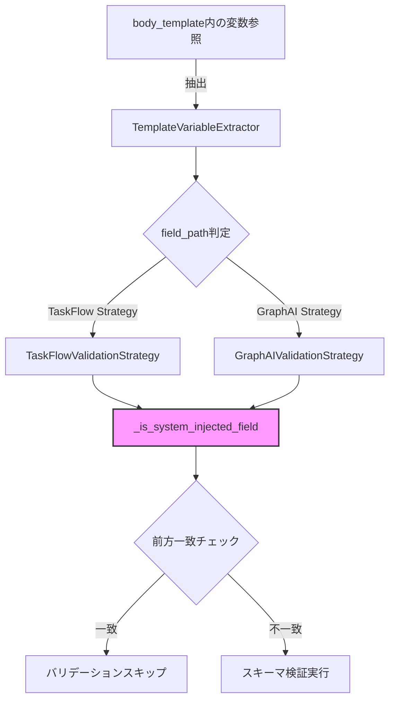

# Issue #407: SYSTEM_INJECTED_FIELDS前方一致チェック対応 - 設計方針書

## 1. 問題の概要

### 現状の課題
`BodyTemplateValidator`の`SYSTEM_INJECTED_FIELDS`チェックが完全一致のみを行っているため、`user_input.{field}`形式の参照がバリデーションエラーとなる。

### 具体例
```python
# 現在の実装
SYSTEM_INJECTED_FIELDS = frozenset({"project", "user_input"})

if field_path in SYSTEM_INJECTED_FIELDS:  # 完全一致チェック
    return errors  # Skip validation

# 結果
"user_input" → スキップ（✓）
"user_input.query" → バリデーション実行（✗）エラー発生
"project.name" → バリデーション実行（✗）潜在的問題
```

### 発生原因
- Issue #403で追加された`_build_multi_dependency_template`のフォールバックロジックが`{{job.body.user_input.{field}}}`形式を生成
- Issue #395/#396で追加された`BodyTemplateValidator`が、この形式を「input_schemaに存在しない参照」として誤検出

## 2. アーキテクチャ設計

### 2.1 設計原則
既存のバリデータアーキテクチャ調査から以下の原則に従う：

1. **ヘルパー関数パターン**: 共通ロジックはモジュールレベルのプライベートヘルパー関数として実装
2. **Strategy パターン維持**: TaskFlowとGraphAIの両方で同じヘルパー関数を利用
3. **セキュリティファースト**: 前方一致チェックでも厳密なドット区切り検証を実施
4. **既存パターンとの整合性**: 他のバリデータと同様の実装パターンを採用

### 2.2 システム構成図



## 3. 技術選定

### 3.1 実装方式の比較

| 選択肢 | 実装内容 | メリット | デメリット | 選定 |
|--------|---------|---------|------------|------|
| **Option A: インライン実装** | 各メソッド内で直接前方一致チェック | シンプル | DRY原則違反、重複コード | ✗ |
| **Option B: ヘルパー関数** | モジュールレベルの共通関数 | DRY原則準拠、テスト容易 | わずかにオーバーヘッド | ✓ |
| Option C: クラスメソッド | 基底クラスに実装 | OOP的 | 現在の設計と不整合 | ✗ |

### 3.2 前方一致アルゴリズムの選定

```python
# 選定案：厳密なドット区切り検証
def _is_system_injected_field(field_path: str) -> bool:
    """Check if field_path is a system-injected field or its sub-field.

    Issue #407: Supports prefix matching for nested fields like 'user_input.query'.
    """
    return any(
        field_path == f or field_path.startswith(f + ".")
        for f in SYSTEM_INJECTED_FIELDS
    )
```

**選定理由**:
- `field_path == f`: 完全一致（既存動作維持）
- `field_path.startswith(f + ".")`: ドット付き前方一致（新規対応）
- `user_inputquery`のような誤マッチを防ぐためドット必須

## 4. 設計パターン

### 4.1 採用パターン
- **Helper Function Pattern**: 共通ロジックの集約
- **Strategy Pattern**: エンジン別のバリデーション戦略（既存維持）
- **Guard Clause Pattern**: 早期リターンによる可読性向上

### 4.2 既存パターンとの整合性
他のバリデータで確認されたパターン：

| バリデータ | ヘルパー関数例 | 用途 |
|-----------|---------------|------|
| schema_comparator | `field_in_schema()` | ネストしたパス検証 |
| template_variable_extractor | `_extract_from_value()` | 再帰的処理 |
| security_constants | `is_local_host()` | ホスト名検証 |
| **body_template_validator（新規）** | **`_is_system_injected_field()`** | **前方一致検証** |

## 5. データモデル設計

### 5.1 影響を受けるデータ構造

```python
# 定数（変更なし）
SYSTEM_INJECTED_FIELDS: frozenset[str] = frozenset({
    "project",      # Issue #391: シークレット解決用
    "user_input",   # Issue #396: ユーザー入力オブジェクト
})

# 新規ヘルパー関数
def _is_system_injected_field(field_path: str) -> bool:
    """前方一致チェック用ヘルパー"""
```

### 5.2 動作変更マトリックス

| field_path | 現在 | 修正後 | 影響 |
|------------|------|---------|------|
| `user_input` | スキップ | スキップ | なし |
| `user_input.query` | **エラー** | スキップ | 修正対象 |
| `user_input.nested.deep` | **エラー** | スキップ | 深いネスト対応 |
| `project` | スキップ | スキップ | なし |
| `project.name` | **エラー** | スキップ | 潜在問題解決 |
| `user_input_extra` | エラー | エラー | なし（前方一致せず） |
| `user_inputquery` | エラー | エラー | なし（ドットなし） |

## 6. API設計

### 6.1 内部API変更
```python
# body_template_validator.py

# 新規追加（SYSTEM_INJECTED_FIELDS定義の直後）
def _is_system_injected_field(field_path: str) -> bool:
    """Check if field_path is a system-injected field or its sub-field.

    Args:
        field_path: Field path to check (e.g., "user_input.query")

    Returns:
        True if field_path is a system field or its sub-field

    Examples:
        >>> _is_system_injected_field("user_input")
        True
        >>> _is_system_injected_field("user_input.query")
        True
        >>> _is_system_injected_field("query")
        False

    Issue #407: Supports prefix matching for nested fields.
    """
    return any(
        field_path == f or field_path.startswith(f + ".")
        for f in SYSTEM_INJECTED_FIELDS
    )
```

### 6.2 外部API影響
- **影響なし**: 公開APIの変更なし
- バリデーションエラーが減少（False Positiveの修正）

## 7. セキュリティ設計

### 7.1 前方一致の安全性
- ドット付き前方一致により、意図しないフィールドのスキップを防止
- `user_input_malicious`のような類似名での攻撃を防御

### 7.2 パフォーマンス考慮
- `frozenset`による高速なメンバーシップテスト
- 短絡評価（any）による効率的な処理

## 8. パフォーマンス設計

### 8.1 計算量
- **現在**: O(1) - セットのメンバーシップテスト
- **修正後**: O(n) - nはSYSTEM_INJECTED_FIELDSの要素数（現在2個）
- **実質的影響**: 無視できるレベル（2要素の線形探索）

### 8.2 最適化
```python
# 短絡評価による最適化
return any(
    field_path == f or field_path.startswith(f + ".")
    for f in SYSTEM_INJECTED_FIELDS
)
# 最初の一致で即座にTrueを返す
```

## 9. 設計上の決定事項とトレードオフ

### 9.1 採用した設計の理由

| 決定事項 | 理由 | トレードオフ |
|---------|------|-------------|
| ヘルパー関数方式 | DRY原則、テスト容易性 | わずかな関数呼び出しオーバーヘッド |
| ドット付き前方一致 | 誤マッチ防止、安全性 | 完全一致より若干遅い |
| モジュールレベル配置 | 既存パターンとの整合性 | グローバルスコープ |
| 両Strategy で共通利用 | コード重複の排除 | Strategy独自のカスタマイズ不可 |

### 9.2 代替案との比較

| 代替案 | 不採用理由 |
|--------|-----------|
| 正規表現パターン | オーバーエンジニアリング、パフォーマンス懸念 |
| 設定ファイル化 | 単純な2要素に対して過度な抽象化 |
| キャッシュ機構 | 2要素の検索に対して不要な複雑性 |

### 9.3 想定されるリスクと対策

| リスク | 影響度 | 対策 |
|--------|--------|------|
| 将来のフィールド追加時の考慮漏れ | 低 | frozensetによる明示的管理 |
| 深いネストでのパフォーマンス | 極低 | 実用上問題なし（2要素） |
| 意図しないフィールドのスキップ | 低 | ドット必須で防止 |

## 10. 実装計画

### 10.1 実装順序
1. `_is_system_injected_field()`ヘルパー関数の追加
2. `TaskFlowValidationStrategy.validate_job_body_reference()`の修正
3. `GraphAIValidationStrategy.validate_job_body_reference()`の修正
4. 単体テストの追加（パラメータライズドテスト）
5. 既存テストの動作確認
6. 受入テストの作成

### 10.2 テスト戦略
- **単体テスト**: 前方一致の境界値テスト
- **結合テスト**: 既存テストがパスすることを確認
- **受入テスト**: Issue #403のフォールバックケースが動作

## 11. 関連ドキュメント

### 11.1 参照したドキュメント
- `expertAgent/docs/API_REFERENCE.md` - ExpertAgent API仕様
- `docs/development/quality-standards.md` - 品質基準
- 既存バリデータ実装パターン（探索結果より）

### 11.2 更新が必要なドキュメント
- なし（内部実装の修正のみ）

## 12. 制約条件の遵守

### CLAUDE.md準拠状況
- ✓ **SOLID原則**: 単一責任（バリデーション）、開放閉鎖（Strategy）
- ✓ **KISS原則**: シンプルな前方一致実装
- ✓ **YAGNI原則**: 必要最小限の実装
- ✓ **DRY原則**: ヘルパー関数による重複排除

### 品質基準
- 単体テストカバレッジ: 90%以上を維持
- 静的解析: Ruff/MyPyエラーゼロを維持
- 既存テスト: 全パスを確認

---

**作成日**: 2024-01-26
**作成者**: Claude Opus 4.5
**Issue**: #407
**優先度**: 高（クロスサービスE2Eテストがブロックされている）