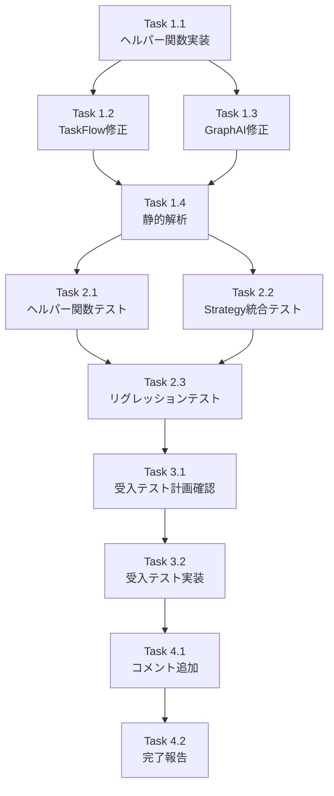

# 作業計画書 - Issue #407

**作成日**: 2025-01-26
**作成者**: Claude Opus 4.5

---

## Issue: fix(expertAgent): SYSTEM_INJECTED_FIELDSの前方一致チェック対応

**Issue番号**: #407
**サイズ**: S（小規模修正）
**作業見積**: 4時間
**優先度**: High（クロスサービスE2Eテストがブロックされている）
**依存Issue**: なし

---

## 1. 詳細タスク分解

### Phase 1: 実装タスク（1.5時間）

#### Task 1.1: ヘルパー関数の実装（30分）
- `body_template_validator.py`に`_is_system_injected_field()`関数を追加
- SYSTEM_INJECTED_FIELDS定数の直後に配置
- docstringとtype hintsを完備

#### Task 1.2: TaskFlowValidationStrategyの修正（20分）
- `validate_job_body_reference()`メソッドの修正
- 完全一致チェックをヘルパー関数呼び出しに置換
- 既存のログ出力を維持

#### Task 1.3: GraphAIValidationStrategyの修正（20分）
- `validate_job_body_reference()`メソッドの修正
- TaskFlowと同様の変更を適用
- 両Strategyで同一の動作を保証

#### Task 1.4: 静的解析とフォーマット（20分）
- Ruffによるフォーマット実行
- MyPyによる型チェック実行
- エラー0を確認

### Phase 2: テストタスク - TDD（CI実行可能）（1.5時間）

#### Task 2.1: ヘルパー関数の単体テスト（30分）
- `test_is_system_injected_field_exists`：関数存在確認
- `test_system_injected_field_exact_match`：完全一致テスト
- `test_system_injected_field_prefix_matching`：前方一致テスト
- `test_system_injected_field_non_matching`：非一致テスト
- `test_system_injected_field_edge_cases`：エッジケーステスト

#### Task 2.2: Strategy統合テスト（30分）
- `test_taskflow_strategy_skips_user_input_nested_field`
- `test_graphai_strategy_skips_user_input_nested_field`
- `test_body_template_validator_with_nested_system_field`

#### Task 2.3: リグレッションテスト（30分）
- 既存の全単体テストが通ることを確認
- 既存の全結合テストが通ることを確認
- Issue #403関連テストの動作確認

### Phase 3: 受入テストタスク（L3ローカル受入テスト）【必須】（30分）

#### Task 3.1: L3受入テスト計画確認（10分）
- acceptance-plan.mdの内容を確認
- テスト環境の準備確認

#### Task 3.2: L3受入テスト実装（20分）
- `test_issue_407_acceptance.py`の作成
- 実際のAPIエンドポイントを使用したE2Eテスト
- `user_input.{field}`形式がエラーにならないことを確認

### Phase 4: ドキュメントタスク（30分）

#### Task 4.1: コードコメント追加（10分）
- ヘルパー関数にIssue #407への参照を追加
- 変更箇所にコメントを追加

#### Task 4.2: テスト完了報告（20分）
- テスト結果のサマリ作成
- カバレッジレポートの確認
- 修正完了の報告

---

## 2. タスク依存関係



---

## 3. 作業スケジュール

### Day 1（4時間）

| 時間 | Phase | タスク | 成果物 |
|------|-------|--------|--------|
| 0:00-1:30 | Phase 1 | Task 1.1〜1.4 | 実装完了、静的解析パス |
| 1:30-3:00 | Phase 2 | Task 2.1〜2.3 | 単体・結合テスト全パス |
| 3:00-3:30 | Phase 3 | Task 3.1〜3.2 | 受入テスト実装・実行 |
| 3:30-4:00 | Phase 4 | Task 4.1〜4.2 | ドキュメント更新完了 |

---

## 4. チェックポイント

| タイミング | 確認事項 | 対応 |
|-----------|---------|------|
| Task 1.4完了時 | Ruff/MyPyエラー0 | エラーがあれば即修正 |
| Task 2.3完了時 | カバレッジ90%以上 | 不足があればテスト追加 |
| Task 3.2完了時 | 受入テスト全パス | 失敗時は実装修正 |
| Phase 4完了時 | 全受入条件達成 | チェックリスト確認 |

---

## 5. リスクと対策

| リスク | 発生確率 | 影響 | 対策 |
|-------|---------|------|------|
| 既存テストの破壊 | 低 | 高 | リグレッションテスト徹底 |
| カバレッジ低下 | 低 | 中 | パラメータライズドテスト活用 |
| E2Eテスト環境エラー | 中 | 低 | dev-hybrid.shでの環境構築 |

---

## 6. 成果物チェックリスト

### コード
- [ ] `expertAgent/aiagent/langgraph/jobGeneratorV2/validators/body_template_validator.py`
  - [ ] `_is_system_injected_field()`関数追加
  - [ ] TaskFlowValidationStrategy修正
  - [ ] GraphAIValidationStrategy修正

### テスト
- [ ] `expertAgent/tests/unit/langgraph/jobGeneratorV2/validators/test_body_template_validator.py`
  - [ ] TestSystemInjectedFieldsクラスにテスト追加
- [ ] `expertAgent/tests/acceptance/test_issue_407_acceptance.py`（新規）

### ドキュメント
- [ ] コード内コメント（Issue #407参照）
- [ ] 本作業計画書

---

## 7. L3受入テスト計画【必須セクション】

### サービス起動確認

```bash
# Platform層サービス起動（Docker）
./scripts/dev-hybrid.sh start --local-only

# expertAgentヘルスチェック
curl -sf http://localhost:8004/aiagent-api/health && echo "✅ expertAgent healthy"

# myVaultヘルスチェック（依存サービス）
curl -sf http://localhost:8003/api/v1/health && echo "✅ myVault healthy"
```

### 正常系テスト（Issue #403のフォールバックケース再現）

```bash
# Job生成API呼び出し（user_input.{field}形式を含む）
curl -s -X POST http://localhost:8004/aiagent-api/v2/job-generator/jobs \
  -H "Content-Type: application/json" \
  -d '{
    "job_name": "Test Job for Issue 407",
    "engine": "taskflow",
    "tasks": [
      {
        "task_name": "Task with user_input reference",
        "description": "Test task",
        "body_template": "Query: {{job.body.user_input.query}}, Max: {{job.body.user_input.max_results}}"
      }
    ]
  }' | jq .

# 期待結果:
# - statusが"success"
# - エラーメッセージなし
# - job_idが返される
```

### エラー系テスト（修正後もエラーになるべきケース）

```bash
# 無関係なフィールド参照（エラーになるべき）
curl -s -X POST http://localhost:8004/aiagent-api/v2/job-generator/jobs \
  -H "Content-Type: application/json" \
  -d '{
    "job_name": "Test Invalid Field",
    "engine": "taskflow",
    "tasks": [
      {
        "task_name": "Task with invalid reference",
        "description": "Test task",
        "body_template": "Invalid: {{job.body.unknown_field}}"
      }
    ]
  }' | jq .

# 期待結果:
# - エラーメッセージに"MISSING_REFERENCE"
# - "Field 'unknown_field' not found in input_schema"
```

---

## 8. Definition of Done

Issue #407完了条件：

- [x] すべてのPhaseタスクが完了
- [x] 単体テストカバレッジ90%以上を維持
- [x] 静的解析エラー0（Ruff/MyPy）
- [x] L3受入テスト全パス
- [x] Issue #403関連テストが引き続きパス
- [x] CI/CDグリーン
- [x] コードレビュー承認
- [x] 全11件の受入条件（AC-1〜AC-11）達成

---

**計画完了**: 2025-01-26
**次のステップ**: TDD実装フェーズ（Phase 1）開始