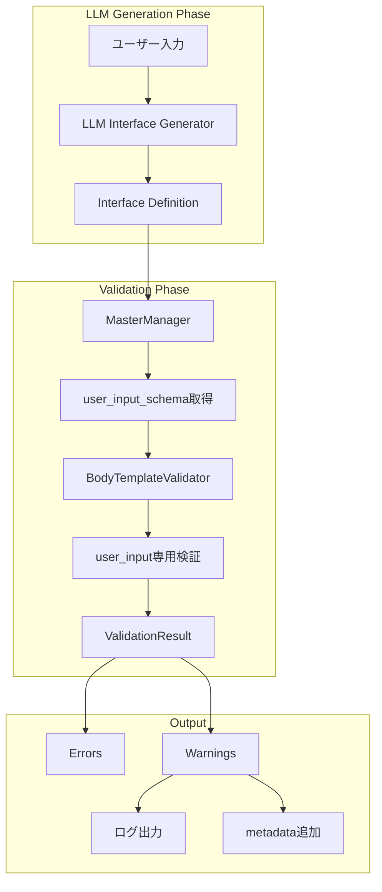
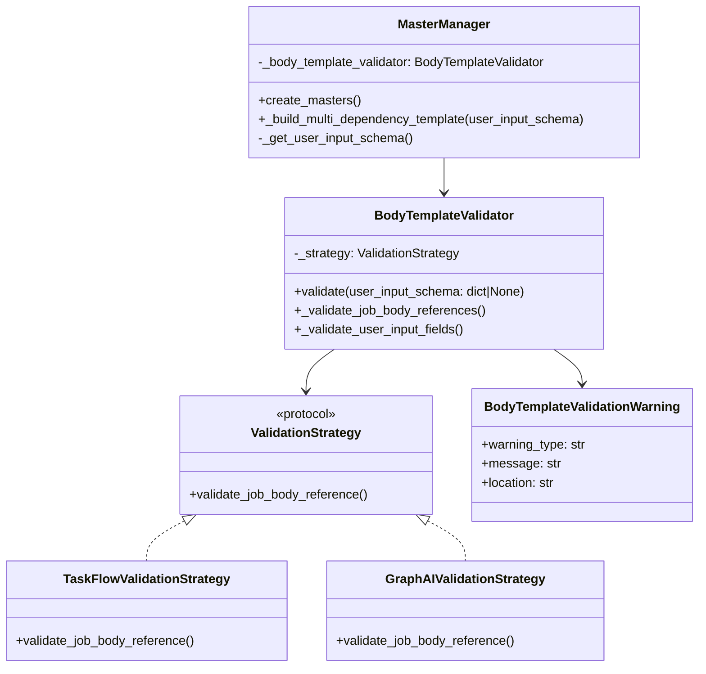
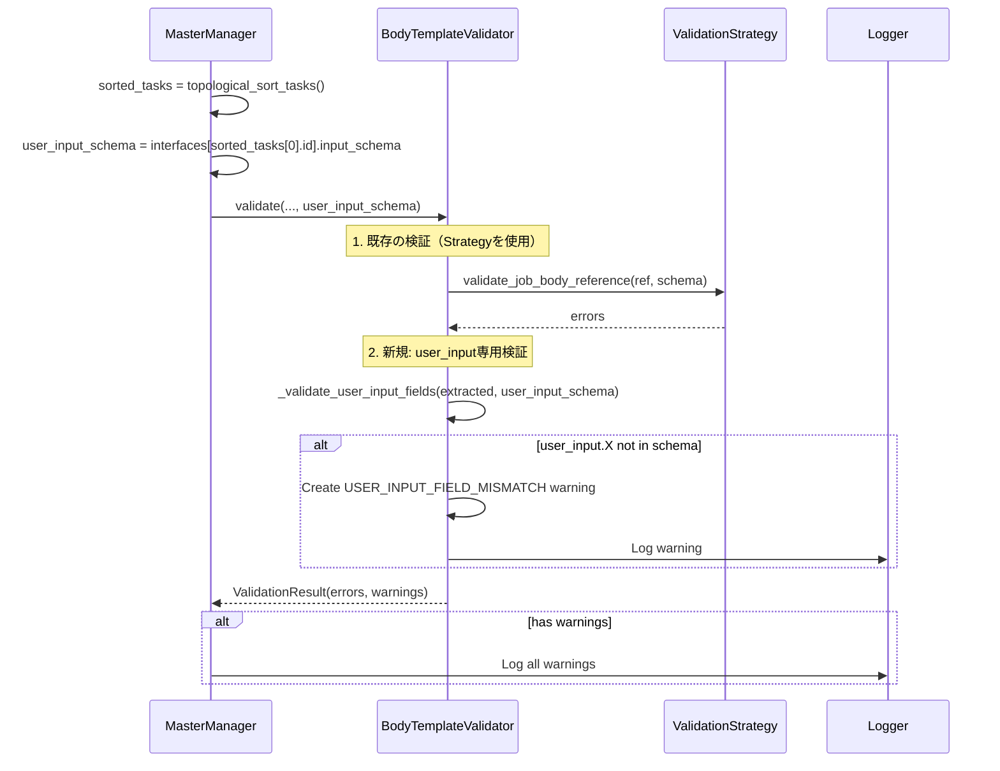
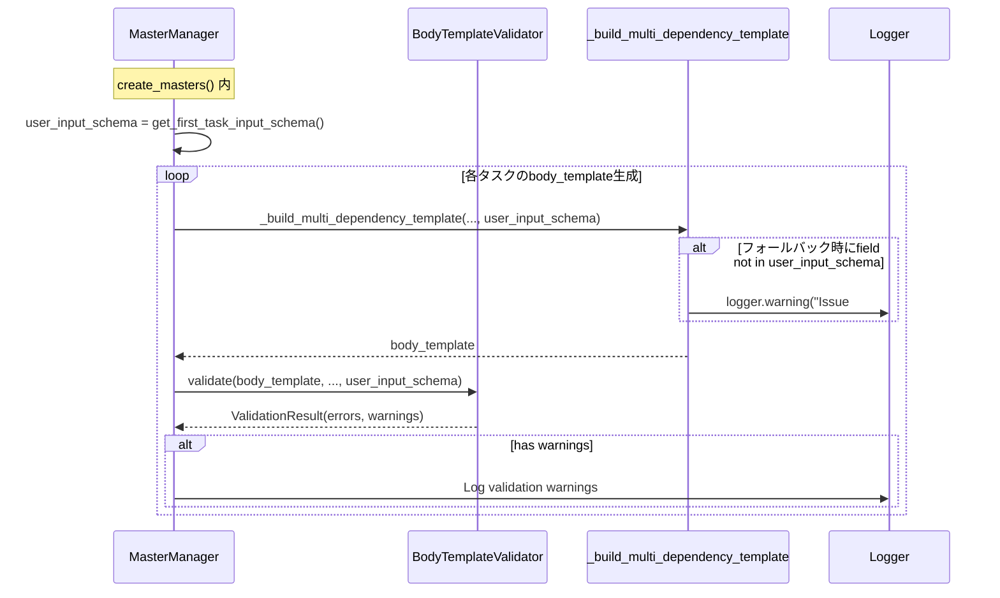

# Issue #408: ユーザー入力フィールド名の整合性検証機能 - 設計方針書

## 1. 概要

### 背景と目的

E2Eテストにおいて、LLM生成のInterface Definitionがユーザー入力フィールド名を変更（例：`email` → `recipient_email`）することで、実行時にフィールド参照が失敗する問題が発生した。

本設計は以下を実現する：
1. プロンプト強化によるフィールド名保持の指示
2. バリデーション強化による実行時エラーの事前検出
3. 警告機能による問題の早期発見と修正支援

### 設計原則

- **KISS原則**: シンプルな追加検証ロジックで実装
- **DRY原則**: 既存のValidationStrategy構造を再利用
- **開放/閉鎖原則**: 既存コードへの変更を最小限に、拡張で対応
- **後方互換性**: 既存APIを破壊しない設計

## 2. システム構成図



## 3. アーキテクチャ設計

### レイヤー構成

| レイヤー | 責務 | 主要コンポーネント |
|----------|------|-------------------|
| **プロンプト層** | LLMへの指示 | interface_schema/default.yaml |
| **検証層** | フィールド整合性検証 | BodyTemplateValidator |
| **データアクセス層** | スキーマ取得 | MasterManager, InterfaceSchema |
| **通知層** | 警告・ログ出力 | ValidationWarning, Logger |

### コンポーネント間の関係



## 4. 技術選定

| カテゴリ | 選定技術 | 選定理由 | 既存との整合性 |
|----------|---------|---------|---------------|
| 設計パターン | Strategy Pattern | 既存実装を活用 | ✓ 既に使用中 |
| 設計パターン | Result Object | エラー/警告の集約 | ✓ ValidationResult使用中 |
| データ構造 | dict[str, Any] | JSON Schema表現 | ✓ 既存と同じ |
| ログ出力 | Python logging | 標準的な手法 | ✓ 既存と統一 |
| 環境変数 | os.getenv | 設定の外部化 | ✓ 既存パターン |

## 5. 設計パターン

### ValidationStrategy維持 + validate()内一括検証（改善）

**設計方針**: ValidationStrategyのインターフェースは**変更しない**。user_input専用の検証は`BodyTemplateValidator.validate()`内で一括実施する。

**理由**:
- Strategyインターフェースの変更は、TaskFlowValidationStrategy/GraphAIValidationStrategyの両方と全呼び出し元に影響
- user_input検証はStrategy固有のロジックではなく、共通の検証ロジック
- 既存テストへの影響を最小化

```python
# ValidationStrategy（変更なし）
def validate_job_body_reference(
    self, reference: str, input_schema: dict[str, Any]
) -> list[BodyTemplateValidationError]

# BodyTemplateValidator.validate()（拡張）
def validate(
    self,
    body_template: dict[str, Any],
    input_schema: dict[str, Any],
    task_count: int,
    task_output_schemas: list[dict[str, Any]],
    user_input_schema: dict[str, Any] | None = None,  # 新規追加
) -> BodyTemplateValidationResult:
    errors, warnings = [], []

    # 1. 既存の検証（変更なし）
    errors.extend(self._validate_job_body_references(extracted, input_schema))

    # 2. 新規: user_input専用検証（validate内で一括実施）
    if user_input_schema:
        warnings.extend(self._validate_user_input_fields(extracted, user_input_schema))

    return BodyTemplateValidationResult(errors=errors, warnings=warnings, ...)
```

### 新規メソッド: _validate_user_input_fields()

```python
def _validate_user_input_fields(
    self,
    extracted: TemplateVariableResult,
    user_input_schema: dict[str, Any],
) -> list[BodyTemplateValidationWarning]:
    """user_input.*参照をuser_input_schemaと照合する.

    Args:
        extracted: 抽出されたテンプレート変数
        user_input_schema: 最初のタスクのinput_schema（ユーザー入力定義）

    Returns:
        USER_INPUT_FIELD_MISMATCH警告のリスト
    """
    warnings = []
    available_fields = set(user_input_schema.get("properties", {}).keys())

    for ref in extracted.job_body_refs:
        field_path = ref.replace("job.body.", "")
        if field_path.startswith("user_input."):
            sub_field = field_path[11:]  # "user_input." を除去
            if sub_field and sub_field not in available_fields:
                warnings.append(
                    BodyTemplateValidationWarning(
                        warning_type="USER_INPUT_FIELD_MISMATCH",
                        message=f"Field '{sub_field}' not found in user_input_schema. "
                                f"Available fields: {sorted(available_fields)}",
                        location=ref,
                    )
                )
    return warnings
```

### Chain of Responsibilityパターン（暗黙的）

検証フローは以下の順で実施：
1. システム注入フィールドチェック（スキップ判定）- 既存
2. **user_inputサブフィールド検証（新規追加）- validate()内**
3. 通常のスキーマ検証（既存）- Strategy経由

## 6. データモデル設計

### 新規追加: USER_INPUT_FIELD_MISMATCH Warning

```python
@dataclass
class BodyTemplateValidationWarning:
    warning_type: str  # "USER_INPUT_FIELD_MISMATCH"
    message: str       # 詳細なエラーメッセージ
    location: str      # "job.body.user_input.recipient_email"
```

### スキーマ構造

```yaml
# user_input_schema例
{
  "type": "object",
  "properties": {
    "email": {
      "type": "string",
      "description": "メールアドレス"
    },
    "keyword": {
      "type": "string",
      "description": "検索キーワード"
    }
  },
  "required": ["email"]
}
```

## 7. API設計

### 拡張されるAPIシグネチャ

#### BodyTemplateValidator.validate()

```python
def validate(
    self,
    body_template: dict[str, Any],
    input_schema: dict[str, Any],
    task_count: int,
    task_output_schemas: list[dict[str, Any]],
    user_input_schema: dict[str, Any] | None = None,  # 新規追加
) -> BodyTemplateValidationResult
```

- **後方互換性**: デフォルト値`None`により既存呼び出しは変更不要

#### ValidationStrategy.validate_job_body_reference()（変更なし）

```python
def validate_job_body_reference(
    self,
    reference: str,
    input_schema: dict[str, Any],
) -> list[BodyTemplateValidationError]
# 戻り値は変更しない - 後方互換性を維持
```

#### MasterManager._build_multi_dependency_template()（シグネチャ変更）

```python
# 現在のシグネチャ
def _build_multi_dependency_template(
    self,
    task: TaskDefinition,
    interfaces: dict[str, InterfaceSchema],
    task_order_map: dict[str, int],
) -> dict[str, Any]

# 変更後のシグネチャ
def _build_multi_dependency_template(
    self,
    task: TaskDefinition,
    interfaces: dict[str, InterfaceSchema],
    task_order_map: dict[str, int],
    user_input_schema: dict[str, Any] | None = None,  # 新規追加
) -> dict[str, Any]
```

**変更内容**:
- AC-4対応: フォールバック時に`field_name`が`user_input_schema`に存在するか検証
- 存在しない場合はWARNINGログを出力

```python
# _build_multi_dependency_template 内の変更例
if source_task_id is not None:
    # ... existing logic ...
else:
    # Fallback to user_input - AC-4: 存在確認を追加
    if user_input_schema and field_name not in user_input_schema.get("properties", {}):
        logger.warning(
            "Issue #408: Field '%s' not found in user_input_schema for task '%s', "
            "fallback may fail at runtime. Available fields: %s",
            field_name,
            task.id,
            list(user_input_schema.get("properties", {}).keys()),
        )
    inputs[field_name] = f"{{{{job.body.user_input.{field_name}}}}}"
```

## 8. セキュリティ設計

### 情報漏洩防止

- 警告メッセージに含まれるフィールド名は既存のsanitize_error_message()で処理
- 使用可能フィールドリストは必要最小限の情報のみ表示

### 環境変数による制御

```python
BODY_TEMPLATE_STRICT_VALIDATION = os.getenv("BODY_TEMPLATE_STRICT_VALIDATION", "false").lower() == "true"

if warning.warning_type == "USER_INPUT_FIELD_MISMATCH" and BODY_TEMPLATE_STRICT_VALIDATION:
    # 警告をエラーとして扱う
    raise ValidationError(...)
```

## 9. パフォーマンス設計

### 計算量

- user_input検証: O(n) - nは参照フィールド数
- 既存処理への影響: 最小限（条件分岐の追加のみ）

### メモリ使用量

- 追加メモリ: user_input_schemaの保持（通常数KB程度）
- 警告リストの拡張（最大でも参照数分）

## 10. 実装フロー



### 警告の収集・伝播フロー



## 11. 設計上の決定事項とトレードオフ

### 決定事項1: 警告のみ vs エラー

**選択**: デフォルトは警告のみ、環境変数で厳格モード

**理由**:
- 既存ワークフローとの後方互換性を維持
- 段階的な移行を可能に
- 開発/本番環境で動作を切り替え可能

**トレードオフ**:
- (+) 既存システムへの影響を最小化
- (-) デフォルトでは実行時エラーを完全には防げない

### 決定事項2: プロンプト強化 + バリデーション併用

**選択**: 両方のアプローチを実装

**理由**:
- プロンプトだけではLLMの非決定性により100%保証できない
- バリデーションだけでは生成時点での問題を防げない

**代替案との比較**:
- プロンプトのみ: 簡単だが信頼性が低い
- バリデーションのみ: 確実だが問題発生が遅い
- **併用（選択）**: 予防と検出の二重防護

### 決定事項3: システム注入フィールドの扱い

**選択**: user_input自体はスキップ、サブフィールドのみ検証

**理由**:
- Issue #407の修正を維持しつつ、きめ細かい検証を実現
- `user_input`の存在は保証されているため

### 決定事項4: ValidationStrategy戻り値の維持（改善）

**選択**: Strategyの戻り値は変更せず、validate()内でuser_input検証を一括実施

**理由**:
- Strategyインターフェースの変更は破壊的変更となり、複数の実装クラスに影響
- user_input検証はStrategy固有のロジックではない（TaskFlow/GraphAI共通）
- 既存テストへの影響を最小化

**代替案との比較**:
- Strategy戻り値をtuple変更: 後方互換性なし、影響範囲大
- **validate()内一括実施（選択）**: 後方互換性あり、変更箇所最小

## 11.5 将来的な改善検討事項

本Issueの範囲外だが、将来的に検討すべき改善点を記録する。

### 検討事項1: ValidationStrategyインターフェースの再検討

#### 現状の設計

本設計では、`ValidationStrategy`インターフェース（`validate_job_body_reference`メソッド）の戻り値を変更せず、`BodyTemplateValidator.validate()`メソッド内でuser_input専用の検証を一括実施する方針としている。

```python
# ValidationStrategy（変更なし）
def validate_job_body_reference(self, reference, input_schema) -> list[Error]

# validate()内で追加検証
def validate(self, ..., user_input_schema=None):
    errors = self._validate_job_body_references(...)  # Strategy経由
    warnings = self._validate_user_input_fields(...)  # 独自実装
```

#### この設計を選択した理由

`ValidationStrategy`インターフェースを変更すると以下の影響がある：

1. **TaskFlowValidationStrategy**と**GraphAIValidationStrategy**の両方を修正する必要がある
2. 全ての呼び出し元のコードを修正する必要がある
3. 既存のテストコードも修正が必要になる

後方互換性を維持しつつ、影響範囲を最小限に抑えるため、Strategyを変更せずにvalidate()メソッド内で追加処理を行う方針を選択した。

#### 将来的な懸念

長期的な視点では以下の点が懸念される：

- **責務の分散**: user_input検証はStrategy固有のロジックではないため、validate()メソッドに直接書くのは妥当。しかし、将来的に別の「共通検証」が追加されると、validate()メソッドが肥大化する可能性がある。
- **一貫性**: TaskFlow用の検証はStrategyを経由するが、user_input検証はvalidate()に直書き、という構造は若干の不一致がある。

#### 将来的な検討案

将来的にこのパターンが増えてきた場合は、以下のような整理を検討する：

```python
# 将来的な検討案
class ValidationStrategy2(Protocol):
    def validate_job_body_reference(...) -> tuple[list[Error], list[Warning]]
    def validate_user_input_fields(...) -> list[Warning]  # 新規追加
```

#### 現時点の判断

**Issue #408の範囲内でこの対応は不要**。設計方針書の通りに実装して問題ない。将来的に警告を返す検証ロジックが増加した場合に再検討する。

### 検討事項2: 警告収集メカニズムの統合

#### 現状の設計

Issue #408の設計では、警告が**2箇所で独立して生成**される：

**場所A: `_build_multi_dependency_template`内**
```python
if field_name not in user_input_schema.get("properties", {}):
    logger.warning("Issue #408: Field '%s' not found...", field_name)
```

**場所B: `BodyTemplateValidator.validate()`内**
```python
warnings = self._validate_user_input_fields(extracted, user_input_schema)
# → BodyTemplateValidationWarning オブジェクトを生成
```

#### 潜在的な問題点

1. **警告の重複**: 同じフィールドの不整合が、フォールバック時（場所A）とバリデーション時（場所B）の両方で検出される可能性がある。ログには2回出力されるが、実際の問題は1つ。

2. **収集方法の違い**: 場所Aでは`logger.warning()`で直接ログ出力し、場所Bでは`BodyTemplateValidationWarning`オブジェクトを生成してリストに追加する。これにより、警告の集約や分析が難しくなる。

3. **追跡の困難さ**: 問題調査時に「この警告はどこから来たのか」を追跡するのが難しくなる可能性がある。

#### 将来的な検討案

警告を一元管理するコンテキストオブジェクトを導入すると、以下のメリットがある：

```python
# 将来的な検討案
class ValidationContext:
    warnings: list[BodyTemplateValidationWarning] = []

    def add_warning(self, warning_type, message, location):
        # 重複チェック
        if not self._is_duplicate(location):
            self.warnings.append(...)

# 使用例
context = ValidationContext()
# 場所Aでも場所Bでも同じcontextに警告を追加
context.add_warning("USER_INPUT_FIELD_MISMATCH", message, location)
```

これにより：
- 重複警告の自動除去
- 警告の一覧表示・集計が容易
- ログ出力の統一

#### 現時点の判断

**Issue #408の範囲内でこの対応は不要**。理由は：

1. Issue #408は特定の問題（フィールド名不整合）を解決する目的であり、警告システム全体の再設計はスコープ外
2. 現時点では警告種別が1つ（USER_INPUT_FIELD_MISMATCH）のみであり、複雑な管理は不要
3. 重複警告が発生しても、デバッグ目的では問題にならない

将来的に警告の種類が増えたり、警告ベースの自動修正機能を追加する際に、このリファクタリングを検討する。

### 検討事項のまとめ

| 検討事項 | 対応時期 | トリガー条件 |
|---------|---------|-------------|
| ValidationStrategyインターフェース再検討 | 将来 | 警告を返す検証ロジックが3つ以上に増加した場合 |
| 警告収集メカニズム統合 | 将来 | 警告種別が3つ以上に増加、または自動修正機能を追加する場合 |

## 12. リスクと対策

| リスク | 可能性 | 影響度 | 対策 |
|--------|--------|--------|------|
| 既存ワークフローの警告大量発生 | 高 | 中 | ログレベルで制御、段階的適用 |
| パフォーマンス劣化 | 低 | 低 | O(n)の処理、影響は限定的 |
| 誤検知による混乱 | 低 | 中 | 明確な警告メッセージで原因を説明 |
| LLMがルールを無視 | 中 | 高 | バリデーションで検出、警告で通知 |

## 13. 移行戦略

### Phase 1: 警告モード（デフォルト）
- 警告ログを出力
- 既存ワークフローは動作継続
- 問題のあるワークフローを特定

### Phase 2: 監視期間
- 警告ログを分析
- 頻出する問題パターンを把握
- 必要に応じてプロンプトを調整

### Phase 3: 厳格モード移行
- 開発環境で`BODY_TEMPLATE_STRICT_VALIDATION=true`
- 新規ワークフローから適用
- 段階的に既存ワークフローを修正

## 14. テスト戦略

### 単体テスト

#### テストファイル
`expertAgent/tests/unit/langgraph/jobGeneratorV2/validators/test_issue_408_user_input_validation.py`

#### テストケース

```python
class TestUserInputFieldValidation:
    """AC-2, AC-3: user_inputフィールド検証のテスト"""

    def test_user_input_field_mismatch_detection(self):
        """存在しないフィールドへの参照を検出"""
        user_input_schema = {"properties": {"email": {"type": "string"}}}
        body_template = {"recipient": "{{job.body.user_input.recipient_email}}"}

        result = validator.validate(
            body_template=body_template,
            input_schema={},
            task_count=1,
            task_output_schemas=[],
            user_input_schema=user_input_schema,
        )

        assert len(result.warnings) == 1
        assert result.warnings[0].warning_type == "USER_INPUT_FIELD_MISMATCH"
        assert "recipient_email" in result.warnings[0].message
        assert "email" in result.warnings[0].message  # 使用可能フィールドを提示

    def test_valid_user_input_field_no_warning(self):
        """存在するフィールドへの参照は警告なし"""
        user_input_schema = {"properties": {"email": {"type": "string"}}}
        body_template = {"recipient": "{{job.body.user_input.email}}"}

        result = validator.validate(
            body_template=body_template,
            input_schema={},
            task_count=1,
            task_output_schemas=[],
            user_input_schema=user_input_schema,
        )

        assert len(result.warnings) == 0

    def test_no_validation_when_user_input_schema_none(self):
        """user_input_schema未指定時は検証スキップ（後方互換性）"""
        body_template = {"recipient": "{{job.body.user_input.any_field}}"}

        result = validator.validate(
            body_template=body_template,
            input_schema={},
            task_count=1,
            task_output_schemas=[],
            user_input_schema=None,  # 未指定
        )

        # user_input検証はスキップされる
        assert len(result.warnings) == 0

    def test_multiple_field_mismatches(self):
        """複数の不整合フィールドを検出"""
        user_input_schema = {"properties": {"email": {"type": "string"}}}
        body_template = {
            "recipient": "{{job.body.user_input.recipient_email}}",
            "query": "{{job.body.user_input.search_keyword}}",
        }

        result = validator.validate(...)

        assert len(result.warnings) == 2


class TestBuildMultiDependencyTemplateValidation:
    """AC-4: _build_multi_dependency_templateのフォールバック検証"""

    def test_fallback_warning_for_missing_field(self, caplog):
        """存在しないフィールドへのフォールバック時に警告"""
        user_input_schema = {"properties": {"email": {"type": "string"}}}

        # field_name="recipient_email" がuser_input_schemaに存在しない場合
        with caplog.at_level(logging.WARNING):
            result = manager._build_multi_dependency_template(
                task=task,
                interfaces=interfaces,
                task_order_map=task_order_map,
                user_input_schema=user_input_schema,
            )

        assert "Issue #408" in caplog.text
        assert "recipient_email" in caplog.text
        assert "not found in user_input_schema" in caplog.text

    def test_no_warning_for_existing_field(self, caplog):
        """存在するフィールドへのフォールバック時は警告なし"""
        user_input_schema = {"properties": {"email": {"type": "string"}}}

        # field_name="email" がuser_input_schemaに存在する場合
        with caplog.at_level(logging.WARNING):
            result = manager._build_multi_dependency_template(
                task=task,
                interfaces=interfaces,
                task_order_map=task_order_map,
                user_input_schema=user_input_schema,
            )

        assert "Issue #408" not in caplog.text
```

### 結合テスト

#### テストファイル
`expertAgent/tests/integration/langgraph/jobGeneratorV2/test_issue_408_integration.py`

#### テストシナリオ

| シナリオ | 検証内容 | 期待結果 |
|----------|---------|---------|
| **1. MasterManager統合** | `create_masters()`で`user_input_schema`が正しく渡されるか | バリデーターが`user_input_schema`を受け取り検証を実施 |
| **2. 複数タスクワークフロー** | 複数タスクを持つワークフローで警告が正しく収集されるか | 各タスクで検出された警告がすべて収集される |
| **3. 警告ログ出力** | 検出された警告がログに出力されるか | WARNINGレベルでログ出力される |
| **4. フォールバック検証統合** | `_build_multi_dependency_template`の警告がログに出力されるか | フォールバック時の警告がログ出力される |
| **5. ValidationResult伝播** | 警告がValidationResultに含まれ呼び出し元に返されるか | `result.warnings`に警告が含まれる |

```python
class TestIssue408Integration:
    """Issue #408 結合テスト"""

    def test_master_manager_passes_user_input_schema_to_validator(self):
        """シナリオ1: MasterManagerがuser_input_schemaをバリデーターに渡す"""
        interfaces = {
            "task_001": InterfaceSchema(
                input_schema={"properties": {"email": {"type": "string"}}},
                ...
            ),
            "task_002": InterfaceSchema(
                input_schema={"properties": {"recipient_email": {"type": "string"}}},
                ...
            ),
        }

        # task_002のbody_templateがuser_input.recipient_emailを参照
        # → user_input_schema（task_001のinput_schema）にrecipient_emailは存在しない

        result = manager.create_masters(tasks, interfaces)

        # 警告が生成されることを確認
        assert any("recipient_email" in str(w) for w in collected_warnings)

    def test_warnings_collected_across_multiple_tasks(self):
        """シナリオ2: 複数タスクの警告が収集される"""
        # 3つのタスクそれぞれで不整合がある場合
        result = manager.create_masters(tasks, interfaces)

        # すべての警告が収集されることを確認
        assert len(collected_warnings) >= 3

    def test_warnings_logged_at_warning_level(self, caplog):
        """シナリオ3: 警告がWARNINGレベルでログ出力される"""
        with caplog.at_level(logging.WARNING):
            result = manager.create_masters(tasks, interfaces)

        assert "USER_INPUT_FIELD_MISMATCH" in caplog.text or "Issue #408" in caplog.text

    def test_fallback_warning_integrated(self, caplog):
        """シナリオ4: フォールバック検証がMasterManager経由で動作"""
        with caplog.at_level(logging.WARNING):
            result = manager.create_masters(tasks, interfaces)

        # _build_multi_dependency_templateからの警告を確認
        assert "fallback may fail at runtime" in caplog.text

    def test_validation_result_contains_warnings(self):
        """シナリオ5: ValidationResultに警告が含まれる"""
        result = validator.validate(
            body_template=body_template,
            input_schema=input_schema,
            task_count=1,
            task_output_schemas=[],
            user_input_schema=user_input_schema,
        )

        assert isinstance(result.warnings, list)
        assert all(isinstance(w, BodyTemplateValidationWarning) for w in result.warnings)
```

### 受入テスト

#### テストファイル
`expertAgent/tests/acceptance/test_issue_408_acceptance.py`

#### テストシナリオ

- E2Eテストでメール送信成功を確認
- 警告ログの出力確認
- 実際のLLM生成結果での動作確認

## 15. 対象ファイル一覧

### 実装ファイル

| ファイル | 変更内容 |
|---------|---------|
| `expertAgent/prompts/interface_schema/default.yaml` | フィールド名保持ルール追加 |
| `expertAgent/aiagent/langgraph/jobTaskGeneratorAgents/prompts/interface_schema.py` | フォールバックプロンプト更新（必要に応じて） |
| `expertAgent/aiagent/langgraph/jobGeneratorV2/validators/body_template_validator.py` | `validate()`シグネチャ変更、`_validate_user_input_fields()`新規追加 |
| `expertAgent/aiagent/langgraph/jobGeneratorV2/workflows/registration/master_manager.py` | バリデーター呼び出し時に`user_input_schema`渡す、`_build_multi_dependency_template`シグネチャ変更・フォールバック検証追加 |

### テストファイル

| テスト種別 | ファイル名 |
|-----------|-----------|
| 単体テスト | `expertAgent/tests/unit/langgraph/jobGeneratorV2/validators/test_issue_408_user_input_validation.py` |
| 結合テスト | `expertAgent/tests/integration/langgraph/jobGeneratorV2/test_issue_408_integration.py` |
| 受入テスト | `expertAgent/tests/acceptance/test_issue_408_acceptance.py` |

### ドキュメントファイル

| ファイル | 変更内容 |
|---------|---------|
| `docs/reference/environment-variables.md` | `BODY_TEMPLATE_STRICT_VALIDATION`環境変数の追加 |

## 16. 環境変数

### 新規追加: BODY_TEMPLATE_STRICT_VALIDATION

| 項目 | 内容 |
|------|------|
| **変数名** | `BODY_TEMPLATE_STRICT_VALIDATION` |
| **デフォルト値** | `false` |
| **説明** | `true`の場合、USER_INPUT_FIELD_MISMATCH警告をエラーとして扱う |
| **用途** | 開発/テスト環境での厳格な検証 |
| **影響範囲** | expertAgent - BodyTemplateValidator |

**ドキュメント更新内容** (`docs/reference/environment-variables.md`に追加):

```markdown
### BODY_TEMPLATE_STRICT_VALIDATION

- **デフォルト**: `false`
- **説明**: Body Template検証で`user_input`フィールドの不整合を検出した際の動作を制御
  - `false`（デフォルト）: 警告ログを出力し、処理を継続
  - `true`: 警告をエラーとして扱い、検証を失敗させる
- **用途**: 開発/テスト環境での厳格な検証。本番環境ではデフォルト（false）推奨
- **関連Issue**: #408
```

## 17. 参照ドキュメント

- Issue #407: SYSTEM_INJECTED_FIELDSの前方一致チェック対応
- Issue #403: 複数タスクからのデータ集約サポート
- `expertAgent/docs/API_REFERENCE.md`: API仕様
- 既存ValidationStrategy実装: `body_template_validator.py`
- `docs/reference/environment-variables.md`: 環境変数リファレンス

## 18. まとめ

本設計は、既存のバリデーション・アーキテクチャを最小限の変更で拡張し、ユーザー入力フィールド名の整合性を保証する。

**主な設計決定**:
1. ValidationStrategyの戻り値は変更せず、validate()内でuser_input検証を一括実施（後方互換性維持）
2. `_build_multi_dependency_template`にuser_input_schemaを追加し、フォールバック時の検証を実施
3. 環境変数`BODY_TEMPLATE_STRICT_VALIDATION`で動作モードを制御

プロンプト強化とバリデーション強化の二重アプローチにより、LLMの非決定性に対してもロバストな解決策を提供する。後方互換性を維持しながら段階的な移行が可能な設計により、既存システムへの影響を最小化しつつ、将来的により厳格な検証への道を開く。
