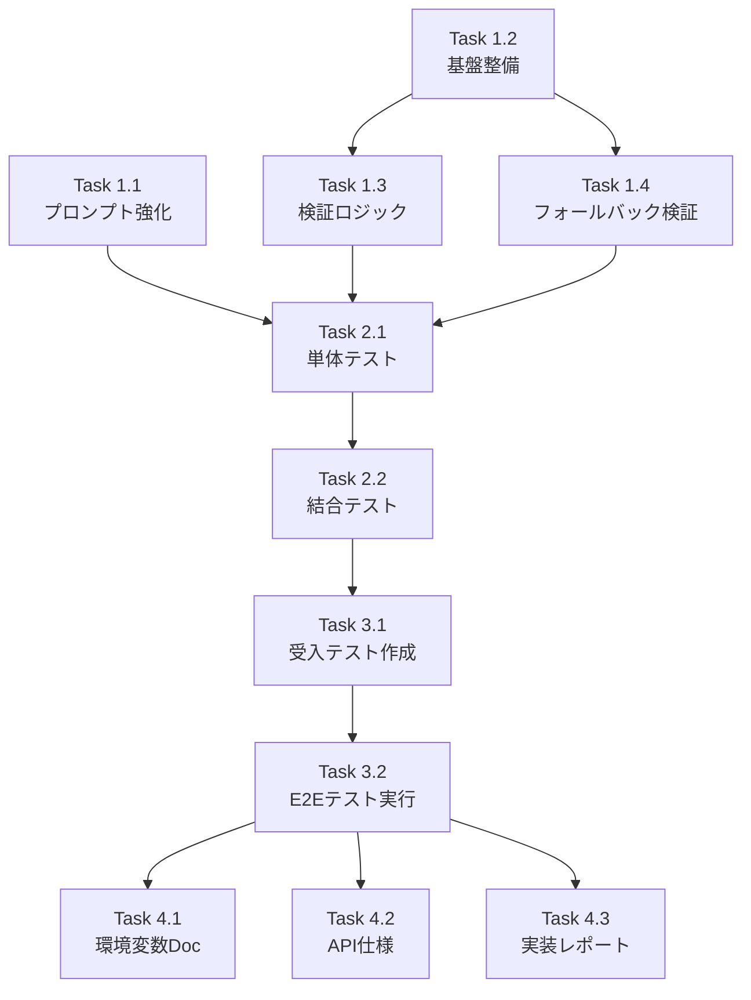

# 作業計画書 - Issue #408: ユーザー入力フィールド名の整合性検証機能

## Issue概要

**Issue番号**: #408
**タイトル**: feat(expertAgent): ユーザー入力フィールド名の整合性検証機能
**サイズ**: M（中規模）
**作業見積**: 16時間
**優先度**: High（E2Eテスト失敗の原因となっている重要な問題）
**依存Issue**: #407（SYSTEM_INJECTED_FIELDSの前方一致チェック対応 - 完了済み）

### 問題の背景

E2Eテストでメール送信タスクが失敗する問題の調査結果、LLMがユーザー入力フィールド名を変更（`email` → `recipient_email`）することで、実行時にフィールド参照が失敗することが判明。

### 解決方針

1. プロンプト強化によるフィールド名保持の指示
2. バリデーション強化による実行時エラーの事前検出
3. 警告機能による問題の早期発見と修正支援

---

## 詳細タスク分解

### Phase 1: 実装タスク（8時間）

#### Task 1.1: プロンプト強化（2時間）
- **内容**: Interface Definitionプロンプトにフィールド名保持ルール追加
- **対象ファイル**:
  - `expertAgent/prompts/interface_schema/default.yaml`
  - `expertAgent/aiagent/langgraph/jobTaskGeneratorAgents/prompts/interface_schema.py`（必要に応じて）
- **作業内容**:
  - フィールド名保持ルールセクションの追加
  - 禁止例・正しい例を5例以上記載
  - なぜ変更してはいけないかの説明追加
- **成果物**: プロンプトファイルの更新

#### Task 1.2: バリデーション基盤整備（2時間）
- **内容**: user_input_schema取得ロジックとシグネチャ変更
- **対象ファイル**:
  - `expertAgent/aiagent/langgraph/jobGeneratorV2/validators/body_template_validator.py`
  - `expertAgent/aiagent/langgraph/jobGeneratorV2/workflows/registration/master_manager.py`
- **作業内容**:
  - `BodyTemplateValidator.validate()`のシグネチャ変更
  - `MasterManager`での`user_input_schema`取得ヘルパー追加
  - キャッシュ戦略の実装
- **成果物**: APIシグネチャの拡張

#### Task 1.3: 検証ロジック実装（3時間）
- **内容**: user_input.*サブフィールド検証機能の実装
- **対象ファイル**:
  - `expertAgent/aiagent/langgraph/jobGeneratorV2/validators/body_template_validator.py`
- **作業内容**:
  - `_validate_user_input_fields()`メソッドの新規追加
  - `USER_INPUT_FIELD_MISMATCH`警告の定義
  - 類似フィールド名サジェスト機能（オプション）
- **成果物**: 検証ロジックの実装

#### Task 1.4: フォールバック検証追加（1時間）
- **内容**: `_build_multi_dependency_template`のフォールバック時検証
- **対象ファイル**:
  - `expertAgent/aiagent/langgraph/jobGeneratorV2/workflows/registration/master_manager.py`
- **作業内容**:
  - `_build_multi_dependency_template`のシグネチャ変更
  - フォールバック時のフィールド存在確認
  - WARNINGログ出力の追加
- **成果物**: フォールバック検証の実装

### Phase 2: テストタスク - TDD（4時間）

#### Task 2.1: 単体テスト作成（2時間）
- **内容**: 検証ロジックの単体テスト
- **対象ファイル**:
  - `expertAgent/tests/unit/langgraph/jobGeneratorV2/validators/test_issue_408_user_input_validation.py`
- **テストケース**:
  - TC-001: 存在しないフィールド名への参照で警告生成
  - TC-002: 正しいフィールド名では警告なし
  - TC-003: 複数の不整合フィールドを全て検出
  - TC-004: user_input_schema=Noneで後方互換性維持
  - TC-005: 類似フィールド名のサジェスト
  - TC-006: フォールバック時の警告ログ
- **成果物**: 単体テストファイル（カバレッジ90%以上）

#### Task 2.2: 結合テスト作成（2時間）
- **内容**: MasterManagerとValidatorの統合テスト
- **対象ファイル**:
  - `expertAgent/tests/integration/langgraph/jobGeneratorV2/test_issue_408_integration.py`
- **テストシナリオ**:
  - MasterManager統合
  - 複数タスクワークフローでの警告収集
  - 警告ログ出力の確認
  - ValidationResult伝播の確認
- **成果物**: 結合テストファイル

### Phase 3: 受入テストタスク - L3ローカル受入テスト（2時間）

#### Task 3.1: 受入テスト作成（1時間）
- **内容**: E2E動作確認テスト
- **対象ファイル**:
  - `expertAgent/tests/acceptance/test_issue_408_acceptance.py`
- **テスト内容**:
  - プロンプトファイルの更新確認
  - 実APIを使用した警告検出確認
  - 環境変数による動作切り替え確認
- **成果物**: 受入テストファイル

#### Task 3.2: E2Eテスト実行（1時間）
- **内容**: クロスサービスE2Eテストの実行
- **実行コマンド**:
  ```bash
  for i in 1 2 3; do
      ./scripts/e2e/cross-service/test_full_workflow_e2e.sh \
          --keyword "テストキーワード" \
          --email "test@example.com"
  done
  ```
- **合格基準**: 3回中3回成功
- **成果物**: テスト実行結果のログ

### Phase 4: ドキュメントタスク（2時間）

#### Task 4.1: 環境変数ドキュメント更新（0.5時間）
- **対象ファイル**: `docs/reference/environment-variables.md`
- **内容**: `BODY_TEMPLATE_STRICT_VALIDATION`環境変数の追加

#### Task 4.2: API仕様更新（0.5時間）
- **対象ファイル**: `expertAgent/docs/API_REFERENCE.md`
- **内容**: シグネチャ変更の反映（必要に応じて）

#### Task 4.3: 実装レポート作成（1時間）
- **対象ファイル**: `dev-reports/feature/issue/408/implementation-report.md`
- **内容**: 実装内容のサマリー、テスト結果、今後の改善点

---

## タスク依存関係



---

## 作業スケジュール

### Day 1（8時間）
- **午前（4時間）**:
  - Task 1.1: プロンプト強化（2時間）
  - Task 1.2: バリデーション基盤整備（2時間）
- **午後（4時間）**:
  - Task 1.3: 検証ロジック実装（3時間）
  - Task 1.4: フォールバック検証追加（1時間）

### Day 2（8時間）
- **午前（4時間）**:
  - Task 2.1: 単体テスト作成（2時間）
  - Task 2.2: 結合テスト作成（2時間）
- **午後（4時間）**:
  - Task 3.1: 受入テスト作成（1時間）
  - Task 3.2: E2Eテスト実行（1時間）
  - Task 4.1-4.3: ドキュメント作成（2時間）

---

## チェックポイント

| タイミング | 確認事項 | 対応 |
|-----------|---------|------|
| Task 1.1完了時 | プロンプトにルールが追加されているか | ファイル確認 |
| Task 1.3完了時 | 検証ロジックが動作するか | 手動テスト実施 |
| Phase 1完了時 | 静的解析エラーがないか | `ruff check`実行 |
| Phase 2完了時 | テストカバレッジ90%以上か | `pytest --cov`確認 |
| Phase 3完了時 | E2Eテスト3回成功か | ログ確認 |

---

## リスクと対策

| リスク | 発生確率 | 影響 | 対策 |
|--------|---------|------|------|
| 既存テストへの影響 | 中 | 高 | 後方互換性を確保（デフォルト値None） |
| LLMがルールを無視 | 中 | 高 | バリデーションで検出・警告出力 |
| パフォーマンス劣化 | 低 | 低 | O(n)の処理、キャッシュ戦略採用 |
| 既存ワークフローで大量警告 | 高 | 中 | デフォルトは警告のみ、厳格モードはopt-in |

---

## 成果物チェックリスト

### コード
- [ ] `expertAgent/prompts/interface_schema/default.yaml` - プロンプト更新
- [ ] `body_template_validator.py` - 検証ロジック実装
- [ ] `master_manager.py` - user_input_schema伝播とフォールバック検証

### テスト
- [ ] `test_issue_408_user_input_validation.py` - 単体テスト
- [ ] `test_issue_408_integration.py` - 結合テスト
- [ ] `test_issue_408_acceptance.py` - 受入テスト

### ドキュメント
- [ ] `environment-variables.md` - 環境変数追加
- [ ] `implementation-report.md` - 実装レポート

---

## L3受入テスト計画

### 前提条件
```bash
# サービス起動
./scripts/dev-hybrid.sh start --local-only

# 環境変数設定
export MYVAULT_ENABLED=true
export MYVAULT_BASE_URL=http://localhost:8003
```

### テストケース1: 警告検出の確認
```bash
# 単体テストで警告検出を確認
uv run pytest expertAgent/tests/unit/langgraph/jobGeneratorV2/validators/test_issue_408_user_input_validation.py::test_user_input_field_mismatch_detection -v -s
```

### テストケース2: MasterManager統合確認
```bash
# 結合テストでMasterManager経由の動作を確認
uv run pytest expertAgent/tests/integration/langgraph/jobGeneratorV2/test_issue_408_integration.py::test_master_manager_passes_user_input_schema_to_validator -v -s
```

### テストケース3: E2Eメール送信成功
```bash
# E2Eテスト3回実行
for i in 1 2 3; do
    echo "=== Run $i ==="
    ./scripts/e2e/cross-service/test_full_workflow_e2e.sh \
        --keyword "テストキーワード" \
        --email "test@example.com"
    echo "Result: $?"
done
```

### テストケース4: 厳格モード確認
```bash
# 環境変数設定
export BODY_TEMPLATE_STRICT_VALIDATION=true

# 警告がエラーとして扱われることを確認
uv run pytest expertAgent/tests/acceptance/test_issue_408_acceptance.py::test_strict_validation_mode -v -s
```

---

## Definition of Done

- [ ] すべての実装タスクが完了
- [ ] 単体テストカバレッジ90%以上
- [ ] 結合テスト全パス
- [ ] L3受入テスト全パス（E2E 3回中3回成功）
- [ ] 静的解析エラーゼロ（Ruff, MyPy）
- [ ] CI/CDグリーン
- [ ] コードレビュー承認
- [ ] ドキュメント更新完了

---

## 実装上の注意点

### 後方互換性の維持
- `user_input_schema`パラメータはすべてオプショナル（デフォルト値None）
- ValidationStrategyインターフェースは変更しない
- 既存のテストが変更なしで通過することを確認

### 設計原則の遵守
- KISS原則: シンプルな追加検証ロジック
- DRY原則: 既存のValidationStrategy構造を再利用
- 開放/閉鎖原則: 既存コードへの最小限の変更

### 重要な実装ポイント
- `task_001`へのハードコード依存を排除（トポロジカルソート結果を使用）
- user_input自体はスキップ、サブフィールドのみ検証（Issue #407との整合性）
- 警告とエラーの適切な使い分け（デフォルトは警告のみ）