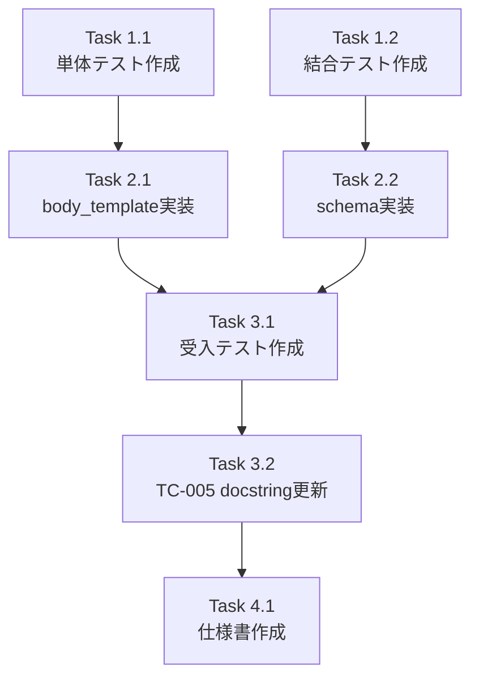

# 作業計画書 - Issue #409

## Issue: 複数独立タスク存在時のデータフロー設計不備

**Issue番号**: #409
**サイズ**: M
**作業見積**: 6時間
**優先度**: High
**関連Issue**: #408（本Issueの修正により#408の検証機能が正常動作する）

## 1. Issue概要

複数の独立タスク（`dependencies=[]`）が存在する場合、2番目以降の独立タスクがユーザー入力を受け取れず、データが失われる問題を修正する。

### 主な問題点

1. `_build_body_template`のレガシーフォールバック
   - `order > 0` かつ `dependencies == []` のタスクが前タスクの出力を参照
   - 正しくは`{{job.body.user_input}}`を使用すべき

2. `_get_user_input_schema`が不完全
   - 最初のタスクの入力スキーマのみを返す
   - 他の独立タスクが必要とするフィールドが含まれない

### 修正対象ファイル

- `expertAgent/aiagent/langgraph/jobGeneratorV2/workflows/registration/master_manager.py`

## 2. 詳細タスク分解（TDD順序）

### Phase 1: テスト作成（Red）- 2時間

#### Task 1.1: 単体テスト追加（1時間）
- **ファイル**: `expertAgent/tests/unit/test_job_generator_v2/test_registration/test_master_manager.py`（既存）
- **追加テストケース**:
  - TC-007: 独立タスク（task指定あり、dependencies=[]）で`{{job.body.user_input}}`が返される
  - TC-009: `_get_user_input_schema`で全独立タスクのフィールドがマージされる
  - TC-011: 同名フィールド衝突時（型一致）に警告ログが出力される
  - TC-012: 同名フィールド衝突時（型不一致）にValueErrorが発生する

#### Task 1.2: 結合テスト追加（1時間）
- **ファイル**: `expertAgent/tests/integration/langgraph/test_issue_409_integration.py`（新規）
- **追加テストケース**:
  - TC-008: 複数独立タスクの統合テスト（両タスクが`{{job.body.user_input}}`を参照）
  - TC-010: Issue #408検証との統合テスト（全フィールドが検証対象）

### Phase 2: 実装（Green）- 2時間

#### Task 2.1: `_build_body_template`メソッドの修正（1時間）
- **修正内容**:
  ```python
  # TaskFlow engine body_template format
  if order == 0 or (task is not None and not task.dependencies):
      # 独立タスクはユーザー入力を直接使用
      return {
          "workflow": "__PENDING__",
          "inputs": "{{job.body.user_input}}",
          "project": "{{job.body.project}}",
      }
  # task=None の場合（レガシー呼び出し）は引き続きレガシー動作を維持
  ```
- **後方互換性**: `task=None`の場合はレガシー動作を維持

#### Task 2.2: `_get_user_input_schema`メソッドの修正（1時間）
- **修正内容**:
  - 全独立タスク（`dependencies=[]`）の入力スキーマをマージ
  - 同名フィールドの型チェック
    - 型一致: 警告ログ出力（両方の型情報含む）、後勝ちでマージ
    - 型不一致: `ValueError`発生
  - `required`フィールドもマージ

### Phase 3: 受入テスト - 1.5時間

#### Task 3.1: 受入テスト作成（1時間）
- **ファイル**: `expertAgent/tests/acceptance/test_issue_409_acceptance.py`（新規）
- **検証内容**:
  - 実際のJob生成API呼び出し
  - 複数独立タスクのデータフロー確認
  - Issue #408の検証が正しく機能することの確認
  - 同名フィールド衝突時の動作確認

#### Task 3.2: 既存テストTC-005のdocstring更新（0.5時間）
- **ファイル**: `expertAgent/tests/acceptance/test_issue_403_acceptance.py`（254行目）
- **修正内容**: レガシー互換性テストであることをdocstringに明記

### Phase 4: ドキュメント - 0.5時間

#### Task 4.1: 独立タスクデータフロー仕様書作成
- **ファイル**: `expertAgent/docs/features/independent-task-dataflow.md`（新規）
- **内容**:
  - 独立タスクの定義（`dependencies=[]`）
  - データフロー仕様
  - 同名フィールドの扱い
  - 設計の理由とトレードオフ

## 3. タスク依存関係



## 4. 作業スケジュール

### Day 1（3時間）
- [ ] Task 1.1: 単体テスト追加（1時間）
- [ ] Task 1.2: 結合テスト追加（1時間）
- [ ] Task 2.1: `_build_body_template`実装（1時間）

### Day 2（3時間）
- [ ] Task 2.2: `_get_user_input_schema`実装（1時間）
- [ ] Task 3.1: 受入テスト作成（1時間）
- [ ] Task 3.2: TC-005 docstring更新（0.5時間）
- [ ] Task 4.1: 仕様書作成（0.5時間）

## 5. チェックポイント

| タイミング | 確認事項 | 対応 |
|-----------|---------|------|
| Phase 1完了時 | テストが全てRed（失敗）であること | テスト実行で確認 |
| Phase 2完了時 | テストが全てGreen（成功）、カバレッジ90%以上 | CI実行で確認 |
| Phase 3完了時 | 受入テスト全パス | ローカル実行で確認 |

## 6. リスクと対策

| リスク | 発生確率 | 影響 | 対策 |
|-------|---------|------|------|
| レガシー呼び出しの互換性破壊 | 中 | 高 | task=None条件で従来動作維持 |
| 同名フィールド衝突（型不一致） | 低 | 中 | ValueErrorで早期検出 |
| 既存テスト（TC-005）の扱い | 中 | 低 | docstringにレガシーテストであることを明記 |
| Issue #408との統合不具合 | 低 | 高 | 結合テストで確認 |

## 7. 成果物チェックリスト

### コード
- [ ] master_manager.py - `_build_body_template`修正
- [ ] master_manager.py - `_get_user_input_schema`修正

### テスト
- [ ] test_master_manager.py - TC-007, TC-009, TC-011, TC-012追加（既存ファイル）
- [ ] test_issue_409_integration.py - TC-008, TC-010（新規）
- [ ] test_issue_409_acceptance.py（新規）
- [ ] test_issue_403_acceptance.py - TC-005 docstring更新（254行目）

### ドキュメント
- [ ] independent-task-dataflow.md（新規）

## 8. L3受入テスト計画

### サービス起動確認
```bash
# ExpertAgent起動確認
curl -sf http://localhost:8004/health && echo "✅ ExpertAgent healthy"
```

### 正常系テスト - 複数独立タスクのJob生成
```bash
# 複数独立タスクを含むJob生成
curl -s -X POST http://localhost:8004/v1/generate-job \
  -H "Content-Type: application/json" \
  -d '{
    "requirements": "キーワード「大谷翔平」についてGoogle検索して、結果をtest@example.comに送信する",
    "options": {
      "engine": "taskflow",
      "include_interface_masters": true
    }
  }' | jq '.tasks[] | {name: .name, dependencies: .dependencies, body_template: .body_template}'

# 期待される結果:
# - Task 1 (keyword取得, dependencies=[]): body_template.inputs = "{{job.body.user_input}}"
# - Task 2 (email取得, dependencies=[]): body_template.inputs = "{{job.body.user_input}}"
#   （修正前は "{{tasks[0].output_data}}" だった）
```

### 検証項目
1. 両独立タスクが`{{job.body.user_input}}`を参照すること
2. user_input_schemaに両フィールド（keyword, email）が含まれること
3. Issue #408の検証が両フィールドを対象とすること

### 同名フィールド衝突テスト（型一致）
```bash
# Task1: {email: string}, Task2: {email: string, name: string}
# 期待: 警告ログ出力、正常終了、マージ結果: {email: string, name: string}

# ログ確認
docker logs expert-agent 2>&1 | grep -i "overrides previous definition"
# 期待: "Field 'email' from task 'Task2' overrides previous definition. Existing type: string, New type: string"
```

### 同名フィールド衝突テスト（型不一致）
```bash
# Task1: {email: string}, Task2: {email: integer}
# 期待: ValueError発生、エラーメッセージに両方の型情報含む

# エラーレスポンス確認
# 期待: "Field 'email' has conflicting types: 'string' vs 'integer'"
```

### レガシー互換性テスト
```bash
# task=None での呼び出し（内部API）が従来通り動作することを確認
# TC-005（test_issue_403_acceptance.py:254）で検証
uv run pytest expertAgent/tests/acceptance/test_issue_403_acceptance.py::TestIssue403BodyTemplate::test_tc005_build_body_template_backward_compatibility -v
```

## 9. Definition of Done

- [ ] すべてのタスクが完了
- [ ] 単体テストカバレッジ90%以上
- [ ] L3受入テスト全パス
- [ ] CI/CDグリーン（Ruff, MyPy エラーゼロ）
- [ ] コードレビュー承認
- [ ] AC-1〜AC-8すべて達成

### 受入条件達成確認

| AC | 内容 | 確認方法 | タスク |
|----|------|---------|--------|
| AC-1 | dependencies=[]のタスクは{{job.body.user_input}}を使用 | TC-007, 受入テスト | Task 2.1, 3.1 |
| AC-2 | _get_user_input_schemaが全独立タスクのフィールドを含む | TC-009 | Task 2.2 |
| AC-3 | Issue #408の検証が正しく機能 | TC-010 | Task 1.2, 2.2 |
| AC-4 | 複数独立タスクのテストケース追加 | TC-007, TC-008 | Task 1.1, 1.2 |
| AC-5 | TC-005はレガシーテストとして残す | docstring確認 | Task 3.2 |
| AC-6 | 同名フィールド衝突時の警告ログ（両方の型情報含む） | TC-011 | Task 2.2 |
| AC-7 | 型不一致時のValueError発生 | TC-012 | Task 2.2 |
| AC-8 | 独立タスクのデータフロー仕様文書化 | ドキュメント確認 | Task 4.1 |

---

## 備考

- GraphAIパスの修正は本Issueのスコープ外（将来対応: AC-Future-1）
- 互換性チェックの拡張は別Issue対応（AC-Future-2）
- モニタリング追加は別Issue対応（AC-Future-4）
- パフォーマンスへの影響は軽微（独立タスク数は通常2-3個）