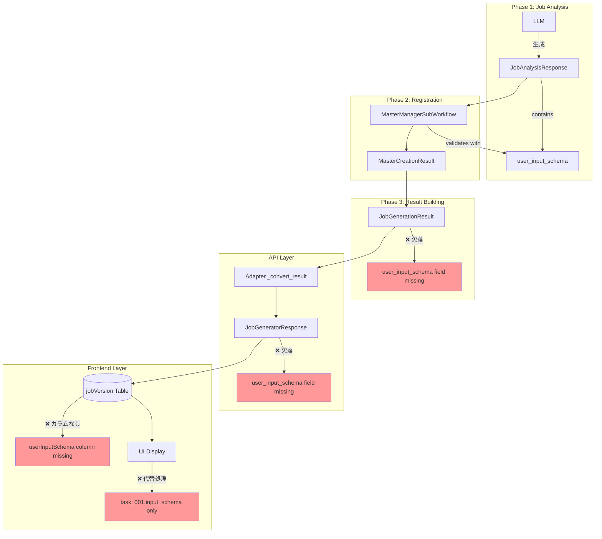
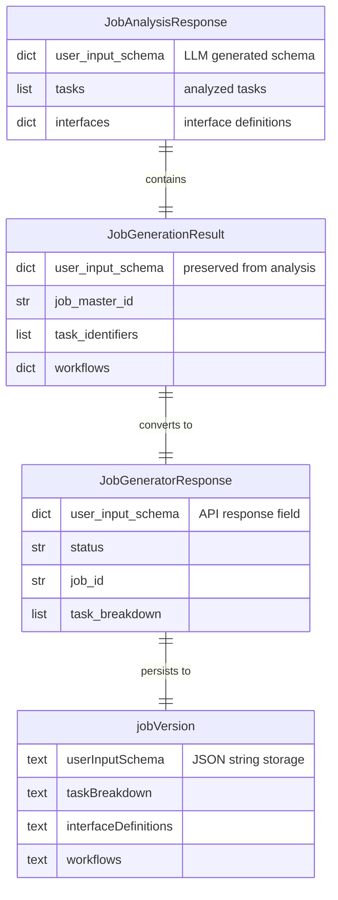

# Issue #410: user_input_schemaのエンドツーエンド伝播 - 設計方針書

## 1. システム構成図

### 現状のデータフロー（問題箇所）



### 修正後のデータフロー

```mermaid
graph TD
    subgraph "Phase 1: Job Analysis"
        LLM2[LLM] -->|生成| JAR2[JobAnalysisResponse]
        JAR2 -->|contains| UIS2[user_input_schema]
    end

    subgraph "Phase 2: Registration"
        JAR2 --> REG2[MasterManagerSubWorkflow]
        REG2 -->|validates with| UIS2
        REG2 --> MCR2[MasterCreationResult]
    end

    subgraph "Phase 3: Result Building"
        JAR2 --> BR[_build_result]
        BR -->|✓ 追加| JGR2[JobGenerationResult.user_input_schema]
    end

    subgraph "API Layer"
        JGR2 --> ADP2[Adapter._convert_result]
        ADP2 -->|✓ 追加| JGResp2[JobGeneratorResponse.user_input_schema]
    end

    subgraph "Frontend Layer"
        JGResp2 --> API[/api/jobs/[id]/status]
        API -->|✓ 保存| DB2[(jobVersion.userInputSchema)]
        DB2 --> REPO[JobVersionRepository]
        REPO --> UI2[getUserInputSchema()]
        UI2 -->|✓ 優先使用| DISPLAY[Dynamic Form Display]
    end

    style JGR2 fill:#99ff99
    style JGResp2 fill:#99ff99
    style DB2 fill:#99ff99
    style DISPLAY fill:#99ff99
```

## 2. レイヤー構成と責務

### レイヤーアーキテクチャ

| レイヤー | 責務 | 主要コンポーネント |
|---------|------|-------------------|
| **生成層** | LLMによるスキーマ生成 | JobAnalysisResponse |
| **オーケストレーション層** | フェーズ間のデータ受け渡し | JobGenerationOrchestrator |
| **アダプター層** | 内部モデル→API形式変換 | JobGeneratorV2Adapter |
| **API層** | HTTPレスポンス生成 | JobGeneratorResponse |
| **永続化層** | データベース保存 | jobVersion table |
| **リポジトリ層** | DB操作の抽象化 | JobVersionRepository |
| **プレゼンテーション層** | UI表示・フォーム生成 | SvelteKit components |

## 3. 技術選定

| カテゴリ | 選定技術 | 選定理由 | 既存との整合性 |
|---------|---------|---------|---------------|
| **データモデル** | Pydantic BaseModel | 型安全性とバリデーション | ✓ 既存パターンに準拠 |
| **DB永続化** | JSON文字列 (text型) | 柔軟なスキーマ拡張 | ✓ 他フィールドと同一 |
| **マイグレーション** | Drizzle Kit | TypeScript統合 | ✓ 既存ツール使用 |
| **API形式** | JSON Schema | 標準規格準拠 | ✓ interface_definitions同様 |
| **UI表示** | 動的フォーム生成 | スキーマ駆動開発 | ✓ 既存の入力フォーム拡張 |

## 4. 設計パターン

### 4.1 Explicit Conversion at Boundaries パターン

各レイヤー境界で明示的な型変換を行う：

```python
# Generation Layer → Orchestration Layer
analysis_result: JobAnalysisResponse  # Pydantic model
    ↓
result: JobGenerationResult  # dataclass
    ↓
# Adapter Layer
response_dict: dict[str, Any]  # 辞書形式
    ↓
# API Layer
response: JobGeneratorResponse  # Pydantic model
```

### 4.2 Graceful Degradation パターン

UI層でのフォールバック処理：

```typescript
export function getUserInputSchema(
    userInputSchema: string | null | undefined,
    interfaceDefinitions: string | null | undefined
): JSONSchema | null {
    // 1. 新フィールド優先
    if (userInputSchema) {
        try {
            return JSON.parse(userInputSchema);
        } catch { /* fallback */ }
    }

    // 2. 既存ロジックへフォールバック
    return getFirstTaskInputSchema(interfaceDefinitions);
}
```

### 4.3 Field Preservation パターン

全レイヤーで明示的にフィールドを保持：

```python
# orchestrator.py
def _build_result(...) -> JobGenerationResult:
    return JobGenerationResult(
        # ... 既存フィールド ...
        user_input_schema=analysis.user_input_schema,  # 明示的追加
    )
```

## 5. データモデル設計

### 5.0 user_input_schemaとinterface_definitionsの関係（改善提案対応）

#### 概念の違い

| 項目 | user_input_schema | interface_definitions |
|------|-------------------|----------------------|
| **スコープ** | システム全体のユーザー入力 | 各タスク固有の入出力 |
| **内容** | ユーザーが入力すべき全フィールド | タスク間のデータ受け渡し定義 |
| **生成元** | LLMが明示的に生成 | タスク分析から自動生成 |
| **用途** | UIフォーム表示、入力検証 | ワークフロー実行時のデータフロー |

#### データフロー図

```
┌─────────────────────────────────────────────────────────────────┐
│                         LLM Analysis                            │
├─────────────────────────────────────────────────────────────────┤
│  user_input_schema:                                             │
│  {                                                              │
│    "properties": {                                              │
│      "keyword": {"type": "string"},                             │
│      "email_address": {"type": "string"}  ← LLMが命名           │
│    }                                                            │
│  }                                                              │
├─────────────────────────────────────────────────────────────────┤
│  interface_definitions:                                         │
│  {                                                              │
│    "task_001": {                                                │
│      "input_schema": {"keyword": ...}     ← task_001の入力      │
│    },                                                           │
│    "task_007": {                                                │
│      "input_schema": {"email_address": ...} ← task_007の入力    │
│    }                                                            │
│  }                                                              │
└─────────────────────────────────────────────────────────────────┘
                              │
                              ▼
┌─────────────────────────────────────────────────────────────────┐
│                    _get_user_input_schema()                     │
│  (Issue #409で実装済み)                                          │
├─────────────────────────────────────────────────────────────────┤
│  Priority:                                                      │
│  1. LLM提供のuser_input_schema（あれば優先）                     │
│  2. 独立タスク（dependencies=[]）のinput_schemaをマージ          │
│                                                                 │
│  Result: マージ済みスキーマ                                      │
│  {                                                              │
│    "properties": {                                              │
│      "keyword": {...},                                          │
│      "email_address": {...}  ← 全独立タスクの入力が含まれる      │
│    }                                                            │
│  }                                                              │
└─────────────────────────────────────────────────────────────────┘
                              │
                              ▼
┌─────────────────────────────────────────────────────────────────┐
│                         UI Display                              │
├─────────────────────────────────────────────────────────────────┤
│  getUserInputSchema() が以下の優先順位で取得:                    │
│  1. JobVersion.userInputSchema（本Issue で追加）                │
│  2. フォールバック: task_001.input_schema（後方互換性）          │
└─────────────────────────────────────────────────────────────────┘
```

#### 使い分けガイド

| シナリオ | 使用するフィールド |
|----------|-------------------|
| UIフォーム生成 | `userInputSchema`（優先）→ `interfaceDefinitions`（フォールバック） |
| ワークフロー実行時のデータ渡し | `interfaceDefinitions` |
| 入力バリデーション | `userInputSchema` |
| タスク間依存関係の解決 | `interfaceDefinitions` |

### 5.1 ER図



### 5.2 JSON Schema形式

```json
{
  "type": "object",
  "properties": {
    "keyword": {
      "type": "string",
      "description": "検索キーワード"
    },
    "email_address": {
      "type": "string",
      "description": "通知先メールアドレス",
      "format": "email"
    }
  },
  "required": ["keyword", "email_address"]
}
```

## 6. API設計

### 6.1 エンドポイント変更

**POST** `/api/v1/job-generator`

#### レスポンス拡張

```json
{
  "status": "success",
  "job_id": "550e8400-e29b-41d4-a716-446655440000",
  "job_master_id": "jm_01K89W9DBHAPWMMZVHWT2N7GX9",
  "user_input_schema": {
    "type": "object",
    "properties": {
      "keyword": {"type": "string", "description": "検索キーワード"},
      "email_address": {"type": "string", "description": "送信先メールアドレス"}
    },
    "required": ["keyword", "email_address"]
  },
  "task_breakdown": [...],
  "interface_definitions": {...}
}
```

### 6.2 後方互換性

- 新規フィールドは省略可能（Optional）
- 既存クライアントは影響を受けない
- フィールドが存在しない場合は従来ロジックで動作

### 6.3 OpenAPI仕様の更新（改善提案対応）

expertAgentはFastAPIを使用しているため、OpenAPI仕様は**Pydanticモデルから自動生成**される。

**更新対象ファイル**:

```
expertAgent/app/schemas/job_generator.py  ← Pydanticモデル定義
```

**変更内容**:

```python
# job_generator.py
from pydantic import BaseModel, Field
from typing import Any

class JobGeneratorResponse(BaseModel):
    """Job Generator API response."""

    status: str = Field(..., description="Generation status")
    job_id: str | None = Field(None, description="Generated job ID")
    job_master_id: str | None = Field(None, description="Job master ID")

    # 新規追加フィールド
    user_input_schema: dict[str, Any] | None = Field(
        None,
        description="JSON Schema defining user input fields. "
                    "Use this to dynamically generate input forms.",
        json_schema_extra={
            "example": {
                "type": "object",
                "properties": {
                    "keyword": {"type": "string", "description": "Search keyword"},
                    "email_address": {"type": "string", "description": "Notification email"}
                },
                "required": ["keyword", "email_address"]
            }
        }
    )

    task_breakdown: list[dict[str, Any]] | None = Field(None, description="Task breakdown")
    interface_definitions: dict[str, Any] | None = Field(None, description="Interface definitions")
```

**自動生成の確認方法**:

```bash
# サーバー起動後、OpenAPI仕様を確認
curl http://localhost:8004/openapi.json | jq '.paths["/api/v1/job-generator"].post.responses["200"]'

# Swagger UIで確認
open http://localhost:8004/docs
```

**注意**: 手動でのOpenAPI仕様ファイル編集は不要。Pydanticモデルを更新すれば自動的に反映される。

## 7. セキュリティ設計

### 7.1 入力検証

- JSON Schemaによる型検証
- SQLiteのtext型でインジェクション回避
- フロントエンドでのサニタイゼーション

### 7.2 データ保護

- user_input_schemaには個人情報を含まない
- スキーマ定義のみを保存（実データは別管理）

### 7.3 スキーマバリデーション（改善提案対応）

LLM生成スキーマがJSON Schema仕様に準拠しているかを検証する多層防御を実装：

```python
# expertAgent/aiagent/langgraph/jobGeneratorV2/validators/schema_validator.py
from jsonschema import Draft7Validator, SchemaError
from typing import Any
import logging

logger = logging.getLogger(__name__)

class UserInputSchemaValidator:
    """Validates user_input_schema conforms to JSON Schema specification."""

    @staticmethod
    def validate(schema: dict[str, Any] | None) -> tuple[bool, str | None]:
        """Validate schema is a valid JSON Schema.

        Args:
            schema: The schema to validate

        Returns:
            Tuple of (is_valid, error_message)
        """
        if schema is None:
            return True, None

        try:
            Draft7Validator.check_schema(schema)
            return True, None
        except SchemaError as e:
            error_msg = f"Invalid JSON Schema: {e.message}"
            logger.warning(error_msg)
            return False, error_msg

    @staticmethod
    def validate_required_structure(schema: dict[str, Any]) -> tuple[bool, str | None]:
        """Validate schema has required structure for user input.

        Required:
        - type: "object"
        - properties: non-empty dict
        """
        if schema.get("type") != "object":
            return False, "Schema type must be 'object'"

        properties = schema.get("properties")
        if not properties or not isinstance(properties, dict):
            return False, "Schema must have non-empty 'properties'"

        return True, None
```

**使用箇所**:

```python
# orchestrator.py の _build_result() 内
from .validators.schema_validator import UserInputSchemaValidator

def _build_result(...) -> JobGenerationResult:
    user_input_schema = analysis.user_input_schema

    # バリデーション実行
    is_valid, error = UserInputSchemaValidator.validate(user_input_schema)
    if not is_valid:
        logger.warning("LLM generated invalid schema: %s", error)
        # フォールバック: 独立タスクから推論
        user_input_schema = self._infer_schema_from_independent_tasks(...)

    return JobGenerationResult(
        # ...
        user_input_schema=user_input_schema,
    )
```

## 8. パフォーマンス設計

### 8.1 データサイズ

- user_input_schemaは通常1KB未満
- 既存のinterface_definitionsと同等規模
- パフォーマンス影響は最小限

### 8.2 キャッシング

- JobVersionのキャッシュに含める
- 頻繁な変更は想定されない

## 9. 設計上の決定事項とトレードオフ

### 9.1 採用した設計

**決定**: user_input_schemaを独立フィールドとして追加

**理由**:
1. 明示的なデータフロー
2. 後方互換性の確保
3. 既存パターンとの一貫性

### 9.2 代替案の検討

| 代替案 | 長所 | 短所 | 不採用理由 |
|--------|------|------|------------|
| interface_definitionsに統合 | フィールド数削減 | 既存構造の破壊的変更 | 後方互換性を損なう |
| 別テーブルで管理 | 正規化 | 複雑性増大 | オーバーエンジニアリング |
| クライアント側で推論 | サーバー変更不要 | 不整合リスク | 信頼性に欠ける |

### 9.3 リスクと対策

| リスク | 影響度 | 対策 |
|--------|--------|------|
| マイグレーション失敗 | 高 | ロールバック手順の準備 |
| 既存データとの不整合 | 中 | フォールバックロジック実装 |
| LLM生成スキーマの品質 | 中 | 多層防御（下記参照） |

#### LLM生成スキーマの品質リスク対策（改善提案対応）

単一の対策では不十分なため、以下の多層防御を実装：

**第1層: プロンプトでの明示的指示**

```python
# job_analyzer.py のシステムプロンプト
USER_INPUT_SCHEMA_INSTRUCTION = """
user_input_schema MUST conform to JSON Schema Draft-07 specification:
- MUST have "type": "object"
- MUST have "properties" with at least one field
- Each property MUST have "type" and "description"
- Use "required" array to specify mandatory fields
- Field names MUST be snake_case (e.g., "email_address", not "emailAddress")
"""
```

**第2層: 生成時バリデーション**

```python
# orchestrator.py
from .validators.schema_validator import UserInputSchemaValidator

def _build_result(...) -> JobGenerationResult:
    schema = analysis.user_input_schema

    # バリデーション
    is_valid, error = UserInputSchemaValidator.validate(schema)
    struct_valid, struct_error = UserInputSchemaValidator.validate_required_structure(schema)

    if not is_valid or not struct_valid:
        logger.warning(
            "LLM schema validation failed: %s / %s",
            error, struct_error
        )
        # フォールバック実行
        schema = self._build_fallback_schema(analysis)

    return JobGenerationResult(user_input_schema=schema, ...)
```

**第3層: フォールバックスキーマ**

```python
def _build_fallback_schema(self, analysis: JobAnalysisResponse) -> dict[str, Any]:
    """独立タスクのinput_schemaからスキーマを推論."""
    # 既存の_get_user_input_schemaロジックを使用
    return self.master_manager._get_user_input_schema(
        sorted_tasks=analysis.tasks,
        interfaces=analysis.interfaces,
        llm_user_input_schema=None,  # LLM提供スキーマを無視
    )
```

**第4層: Langfuseへのログ記録**

```python
from langfuse import Langfuse

langfuse = Langfuse()

def log_schema_validation_failure(
    job_id: str,
    schema: dict,
    error: str,
    fallback_used: bool
):
    """スキーマ検証失敗をLangfuseに記録（品質改善用）."""
    langfuse.event(
        name="user_input_schema_validation_failed",
        metadata={
            "job_id": job_id,
            "original_schema": schema,
            "error": error,
            "fallback_used": fallback_used,
        },
        level="WARNING",
    )
```

**監視ダッシュボード項目**:
- スキーマ検証失敗率（目標: < 5%）
- フォールバック使用率（目標: < 10%）
- 失敗原因の分類（type不正、properties欠落など）

## 10. 実装ガイドライン

### 10.1 命名規則

- Python: `user_input_schema` (snake_case)
- TypeScript: `userInputSchema` (camelCase)
- Database: `user_input_schema` (snake_case)

### 10.2 エラーハンドリング

```python
# expertAgent側
if not analysis.user_input_schema:
    logger.warning("user_input_schema not provided by LLM")
    # Continue without error (optional field)

# myAgentDesk側
try:
    schema = JSON.parse(userInputSchema);
} catch (e) {
    console.warn('Invalid user_input_schema, falling back');
    // Use fallback logic
}
```

### 10.3 テスト戦略

1. **単体テスト**: 各レイヤーでのフィールド存在確認
2. **結合テスト**: エンドツーエンドのデータフロー
3. **E2Eテスト**: 動的スキーマ取得と実行

### 10.4 E2Eテスト修正の詳細実装（改善提案対応）

E2Eテストでスキーマを動的に取得してテストデータを構築する具体的な実装：

```bash
# scripts/e2e/cross-service/test_full_workflow_e2e.sh

# ============================================================
# Phase: Get User Input Schema Dynamically
# ============================================================
get_user_input_schema() {
    local JOB_ID="$1"

    echo "📋 Fetching user input schema for job: ${JOB_ID}"

    # 1. Job詳細からuserInputSchemaを取得
    local SCHEMA_RESPONSE
    SCHEMA_RESPONSE=$(curl -s "http://localhost:5173/api/jobs/${JOB_ID}")

    # 2. userInputSchemaを抽出（存在する場合）
    local USER_INPUT_SCHEMA
    USER_INPUT_SCHEMA=$(echo "$SCHEMA_RESPONSE" | jq -r '.userInputSchema // empty')

    if [[ -z "$USER_INPUT_SCHEMA" || "$USER_INPUT_SCHEMA" == "null" ]]; then
        # 3. フォールバック: interfaceDefinitionsからtask_001.input_schemaを取得
        echo "⚠️ userInputSchema not found, falling back to task_001.input_schema"
        USER_INPUT_SCHEMA=$(echo "$SCHEMA_RESPONSE" | jq -r \
            '.interfaceDefinitions | fromjson | .task_001.input_schema // empty')
    fi

    echo "$USER_INPUT_SCHEMA"
}

# ============================================================
# Phase: Build Dynamic User Input Payload
# ============================================================
build_user_input_payload() {
    local SCHEMA="$1"
    local KEYWORD="$2"
    local EMAIL="$3"

    echo "🔧 Building user input payload from schema"

    # スキーマからフィールド名を動的に取得
    local PROPERTIES
    PROPERTIES=$(echo "$SCHEMA" | jq -r '.properties // {}')

    # キーワード系フィールドを検出（keyword, search_keyword, query等）
    local KEYWORD_FIELD
    KEYWORD_FIELD=$(echo "$PROPERTIES" | jq -r 'keys[] | select(test("keyword|search|query"; "i"))' | head -1)

    # メール系フィールドを検出（email, email_address, recipient等）
    local EMAIL_FIELD
    EMAIL_FIELD=$(echo "$PROPERTIES" | jq -r 'keys[] | select(test("email|mail|recipient"; "i"))' | head -1)

    # デフォルト値（検出できない場合）
    KEYWORD_FIELD="${KEYWORD_FIELD:-keyword}"
    EMAIL_FIELD="${EMAIL_FIELD:-email}"

    echo "  - Keyword field: ${KEYWORD_FIELD}"
    echo "  - Email field: ${EMAIL_FIELD}"

    # 動的にJSONペイロードを構築
    local PAYLOAD
    PAYLOAD=$(jq -n \
        --arg kf "$KEYWORD_FIELD" --arg kv "$KEYWORD" \
        --arg ef "$EMAIL_FIELD" --arg ev "$EMAIL" \
        '{($kf): $kv, ($ef): $ev}')

    echo "$PAYLOAD"
}

# ============================================================
# Usage in main test flow
# ============================================================
main() {
    # ... Job生成処理 ...

    # スキーマ取得
    USER_INPUT_SCHEMA=$(get_user_input_schema "$JOB_ID")

    if [[ -z "$USER_INPUT_SCHEMA" ]]; then
        echo "❌ Failed to retrieve user input schema"
        exit 1
    fi

    # 動的ペイロード構築
    USER_INPUT=$(build_user_input_payload "$USER_INPUT_SCHEMA" "$KEYWORD" "$EMAIL")

    echo "📤 User input payload: $USER_INPUT"

    # ワークフロー実行
    curl -X POST "http://localhost:8006/api/v1/workflow/execute" \
        -H "Content-Type: application/json" \
        -d "{\"job_id\": \"${JOB_ID}\", \"user_input\": ${USER_INPUT}}"
}
```

**テストケース追加**:

```bash
# E2Eテストで検証すべきパターン
# 1. userInputSchemaが存在する場合（正常系）
# 2. userInputSchemaがnullでフォールバックする場合
# 3. LLMが異なるフィールド名を生成した場合（email vs email_address）
```

## 11. 移行計画

### 11.1 段階的リリース

| フェーズ | 内容 | リスク |
|---------|------|--------|
| Phase 1 | expertAgent側の実装・デプロイ | 低（レスポンスのみ） |
| Phase 2 | myAgentDesk DB・API実装 | 中（マイグレーション） |
| Phase 3 | UI実装・E2Eテスト更新 | 低（フォールバック有） |

### 11.2 ロールバック計画

- 各フェーズは独立してロールバック可能
- DBマイグレーションは`down`スクリプト準備
- 機能フラグによる段階的有効化

#### 具体的なロールバック手順（改善提案対応）

**Phase 1 ロールバック（expertAgent）**:

```bash
# Gitでコミットを戻す
git revert <commit-hash>

# テスト実行
cd expertAgent && uv run pytest tests/unit/ -v
```

**Phase 2 ロールバック（myAgentDesk DB）**:

SQLiteはALTER TABLE DROP COLUMNを直接サポートしないため、テーブル再作成が必要：

```typescript
// drizzle/migrations/0002_add_user_input_schema.down.ts
import { sql } from 'drizzle-orm';
import type { SQLiteDatabase } from 'drizzle-orm/sqlite-core';

export async function down(db: SQLiteDatabase) {
    // 1. 新しいテーブルを作成（user_input_schemaカラムなし）
    await db.run(sql`
        CREATE TABLE job_version_new (
            id INTEGER PRIMARY KEY AUTOINCREMENT,
            job_id TEXT NOT NULL,
            version INTEGER NOT NULL DEFAULT 1,
            task_breakdown TEXT,
            interface_definitions TEXT,
            workflows TEXT,
            status TEXT NOT NULL DEFAULT 'pending',
            created_at TEXT NOT NULL DEFAULT CURRENT_TIMESTAMP,
            updated_at TEXT NOT NULL DEFAULT CURRENT_TIMESTAMP,
            FOREIGN KEY (job_id) REFERENCES job(id)
        )
    `);

    // 2. データを移行
    await db.run(sql`
        INSERT INTO job_version_new
        SELECT id, job_id, version, task_breakdown, interface_definitions,
               workflows, status, created_at, updated_at
        FROM job_version
    `);

    // 3. 旧テーブルを削除
    await db.run(sql`DROP TABLE job_version`);

    // 4. 新テーブルをリネーム
    await db.run(sql`ALTER TABLE job_version_new RENAME TO job_version`);

    // 5. インデックス再作成
    await db.run(sql`CREATE INDEX idx_job_version_job_id ON job_version(job_id)`);
}
```

**ロールバック実行コマンド**:

```bash
cd myAgentDesk

# マイグレーション状態確認
npx drizzle-kit status

# ロールバック実行（手動）
npx tsx drizzle/migrations/0002_add_user_input_schema.down.ts

# または、バックアップからリストア
cp data/backup/myagentdesk.db.bak data/myagentdesk.db
```

**Phase 3 ロールバック（UI）**:

```bash
# Gitでコミットを戻す
git revert <commit-hash>

# アプリケーション再起動
npm run dev
```

## 12. 参照ドキュメント

- [expertAgent API Reference](../../../expertAgent/docs/API_REFERENCE.md)
- [Issue #409: 複数独立タスク存在時のデータフロー修正](https://github.com/owner/repo/issues/409)
- [myAgentDesk README](../../../myAgentDesk/README.md)
- [Service Dependencies](../../../docs/architecture/service-dependencies.md)

## 13. 承認事項

本設計方針は以下の原則に準拠しています：

- ✓ SOLID原則: 単一責任、開放閉鎖原則の遵守
- ✓ KISS原則: 既存パターンの踏襲による簡潔性
- ✓ YAGNI原則: 必要最小限の変更
- ✓ DRY原則: 既存ロジックの再利用

---

**作成日**: 2026-01-26
**作成者**: Claude Code (AI Assistant)
**Issue**: #410

---

## 変更履歴

| 日付 | バージョン | 変更内容 |
|------|-----------|---------|
| 2026-01-26 | 1.0 | 初版作成 |
| 2026-01-26 | 1.1 | レビュー指摘事項を反映（改善提案対応） |

### v1.1 改善提案対応内容

1. **セクション5.0追加**: `user_input_schema`と`interface_definitions`の関係を明確化
2. **セクション6.3追加**: OpenAPI仕様の更新方法（FastAPI自動生成）を明記
3. **セクション7.3追加**: JSON Schemaバリデーションの実装詳細
4. **セクション9.3拡充**: LLM生成スキーマの多層防御戦略
5. **セクション10.4追加**: E2Eテストの動的スキーマ取得実装
6. **セクション11.2拡充**: 具体的なロールバック手順（SQLite対応）