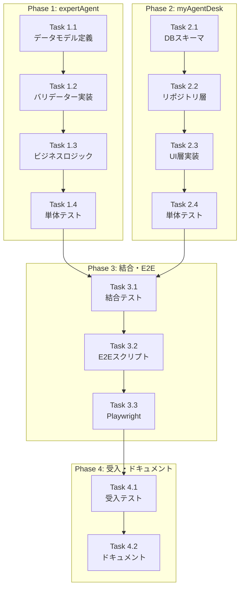

# 作業計画書

**Issue**: #410
**タイトル**: feat: user_input_schemaのエンドツーエンド伝播
**作成日**: 2026-01-26
**作成者**: Claude Code (work-plan)

---

## 1. Issue概要

### 基本情報

| 項目 | 内容 |
|------|------|
| **Issue番号** | #410 |
| **タイトル** | feat: user_input_schemaのエンドツーエンド伝播 |
| **サイズ** | L（Large） |
| **作業見積** | 24時間（3人日） |
| **優先度** | High |
| **依存Issue** | #409（複数独立タスク存在時のデータフロー修正）✅ 完了済み |

### 問題の背景

E2Eテストで「4/4タスク成功」と表示されたが、実際にはメールが送信されなかった。原因は、E2Eテストが`{"email": "..."}`を送信したのに対し、LLMは`{"email_address": "..."}`を期待するワークフローを生成していたため。

### 解決方針

LLMが生成した`user_input_schema`（ユーザーが入力すべきフィールドの定義）をシステム全体で伝播・保存・表示できるようにし、ユーザーが正しいフィールド名で入力できるようにする。

---

## 2. 詳細タスク分解

### Phase 1: expertAgent実装（8時間）

#### Task 1.1: データモデル定義（2時間）
- **内容**:
  - `JobGenerationResult`に`user_input_schema`フィールド追加
  - `JobGeneratorResponse`に`user_input_schema`フィールド追加
  - Pydanticモデルの更新（OpenAPI仕様自動生成）
- **成果物**:
  - `expertAgent/aiagent/langgraph/jobGeneratorV2/orchestrator.py`
  - `expertAgent/app/schemas/job_generator.py`

#### Task 1.2: バリデーター実装（2時間）
- **内容**:
  - `UserInputSchemaValidator`クラスの実装
  - JSON Schema Draft-07準拠のバリデーション
  - 構造チェック（type="object", properties存在）
- **成果物**:
  - `expertAgent/aiagent/langgraph/jobGeneratorV2/validators/schema_validator.py`
- **責務分離**:
  以下の通り、既存の`body_template_validator.py`との責務を明確に分離する：

  | バリデーター | 責務 | 検証対象 | 検証タイミング |
  |------------|------|---------|--------------|
  | `schema_validator.py`（新規） | **スキーマ構造の検証** | `user_input_schema`自体 | `_build_result()`内でスキーマ取得直後 |
  | `body_template_validator.py`（既存） | **テンプレート参照の検証** | `body_template`内の`{{job.body.user_input.X}}` | タスク登録時（既存処理） |

  **詳細**:
  - `schema_validator.py`: LLM生成スキーマがJSON Schema仕様に準拠しているか検証
    - `type: "object"`が指定されているか
    - `properties`が存在し、空でないか
    - 各プロパティに`type`が指定されているか
  - `body_template_validator.py`: テンプレート内のフィールド参照が実在するか検証（Issue #408で実装済み）
    - `{{job.body.user_input.email}}`のような参照が`user_input_schema.properties`に存在するか

  **連携フロー**:
  ```
  1. LLM → user_input_schema生成
  2. schema_validator.py → スキーマ構造検証（不正なら警告ログ＋フォールバック）
  3. body_template_validator.py → テンプレート参照検証（フィールド名不一致を警告）
  ```

#### Task 1.3: ビジネスロジック実装（2時間）
- **内容**:
  - `_build_result()`での`user_input_schema`設定
  - バリデーション失敗時のフォールバック処理
  - `_convert_result()`での値伝播
- **成果物**:
  - `orchestrator.py`の`_build_result()`メソッド更新
  - `adapter.py`の`_convert_result()`メソッド更新

#### Task 1.4: 単体テスト作成（2時間）
- **内容**:
  - データモデルのテスト
  - バリデーターのテスト
  - ビジネスロジックのテスト
- **成果物**:
  - `expertAgent/tests/unit/test_job_generator_v2/test_user_input_schema.py`

### Phase 2: myAgentDesk実装（8時間）

#### Task 2.1: DBスキーマ変更（2時間）
- **内容**:
  - `jobVersion`テーブルに`userInputSchema`カラム追加
  - Drizzleマイグレーション作成・実行
  - ロールバックスクリプト準備
- **成果物**:
  - `myAgentDesk/src/lib/server/db/schema.ts`
  - `myAgentDesk/drizzle/migrations/0002_add_user_input_schema.sql`

#### Task 2.2: リポジトリ層更新（2時間）
- **内容**:
  - `UpdateGenerationResultInput`に`userInputSchema`追加
  - 保存・取得ロジックの実装
- **成果物**:
  - `myAgentDesk/src/lib/server/repositories/job-version.ts`
  - `myAgentDesk/src/routes/api/jobs/[jobId]/status/+server.ts`

#### Task 2.3: UI層実装（2時間）
- **内容**:
  - `getUserInputSchema()`関数の実装
  - フォールバックロジック（null時は`task_001.input_schema`使用）
  - `runs/+page.svelte`の更新
- **成果物**:
  - `myAgentDesk/src/lib/utils/interface-schema.ts`
  - `myAgentDesk/src/routes/projects/[projectId]/workbenches/[workbenchId]/runs/+page.svelte`

#### Task 2.4: 単体テスト作成（2時間）
- **内容**:
  - スキーマユーティリティのテスト
  - リポジトリ層のテスト
  - フォールバックロジックのテスト
- **成果物**:
  - `myAgentDesk/tests/unit/utils/interface-schema.test.ts`
  - `myAgentDesk/tests/unit/repositories/job-version.test.ts`

### Phase 3: 結合テスト・E2E実装（4時間）

#### Task 3.1: 結合テスト作成（1時間）
- **内容**:
  - expertAgent → myAgentDeskのデータフロー検証
  - サービス間通信の確認
- **成果物**:
  - `expertAgent/tests/integration/langgraph/test_issue_410_integration.py`

#### Task 3.2: E2Eテストスクリプト更新（2時間）
- **内容**:
  - スキーマ動的取得関数の実装
  - ペイロード動的構築関数の実装
  - ハードコードされたフィールド名の削除
- **成果物**:
  - `scripts/e2e/cross-service/test_full_workflow_e2e.sh`

#### Task 3.3: Playwright E2Eテスト作成（1時間）
- **内容**:
  - UI動的フォーム生成の検証
  - フィールド名変動対応テスト
- **成果物**:
  - `myAgentDesk/tests/e2e/test_issue_410.spec.ts`
  - `myAgentDesk/tests/e2e/test_dynamic_field_name_variation.spec.ts`

### Phase 4: 受入テスト・ドキュメント（4時間）

#### Task 4.1: 受入テスト実装（2時間）
- **内容**:
  - 全受入条件（AC-1〜AC-5）の検証コード
  - 実APIを使用したE2E検証
- **成果物**:
  - `expertAgent/tests/acceptance/test_issue_410_acceptance.py`

#### Task 4.2: ドキュメント更新（2時間）
- **内容**:
  - API仕様書の更新（OpenAPI自動生成確認）
  - READMEの更新
  - 環境変数ドキュメントの更新
- **成果物**:
  - `expertAgent/docs/API_REFERENCE.md`
  - `myAgentDesk/README.md`
  - `docs/reference/environment-variables.md`

---

## 3. タスク依存関係



---

## 4. 作業スケジュール

### Day 1（8時間）: expertAgent実装
- 09:00-11:00: Task 1.1 データモデル定義
- 11:00-13:00: Task 1.2 バリデーター実装
- 14:00-16:00: Task 1.3 ビジネスロジック実装
- 16:00-18:00: Task 1.4 単体テスト作成

### Day 2（8時間）: myAgentDesk実装
- 09:00-11:00: Task 2.1 DBスキーマ変更
- 11:00-13:00: Task 2.2 リポジトリ層更新
- 14:00-16:00: Task 2.3 UI層実装
- 16:00-18:00: Task 2.4 単体テスト作成

### Day 3（8時間）: 結合・受入・完成
- 09:00-10:00: Task 3.1 結合テスト作成
- 10:00-12:00: Task 3.2 E2Eテストスクリプト更新
- 13:00-14:00: Task 3.3 Playwright E2Eテスト
- 14:00-16:00: Task 4.1 受入テスト実装
- 16:00-18:00: Task 4.2 ドキュメント更新

---

## 5. チェックポイント

| タイミング | 確認事項 | 対応 |
|-----------|---------|------|
| Task 1.4完了時 | expertAgentカバレッジ90%以上 | `pytest --cov`実行 |
| Task 2.4完了時 | myAgentDeskカバレッジ90%以上 | `npm run test:unit -- --coverage`実行 |
| Phase 3完了時 | CI-1整合性検証 | grep検索スクリプト実行 |
| Phase 4完了前 | 全受入条件充足 | 受入テスト計画書と照合 |

---

## 6. リスクと対策

| リスク | 発生確率 | 影響 | 対策 |
|--------|---------|------|------|
| LLM生成スキーマの品質問題 | 中 | 高 | 多層防御（プロンプト、バリデーション、フォールバック、ログ） |
| DBマイグレーション失敗 | 低 | 高 | ロールバックスクリプト準備、バックアップ作成 |
| 既存システムへの影響 | 低 | 中 | 新規フィールドはOptional、フォールバック実装 |
| E2Eテスト修正の複雑性 | 中 | 中 | 段階的修正、動的スキーマ取得の実装 |

---

## 7. 成果物チェックリスト

### コード（実装）
- [ ] `expertAgent/aiagent/langgraph/jobGeneratorV2/orchestrator.py`
- [ ] `expertAgent/app/schemas/job_generator.py`
- [ ] `expertAgent/aiagent/langgraph/jobGeneratorV2/validators/schema_validator.py`
- [ ] `expertAgent/aiagent/langgraph/jobGeneratorV2/adapter.py`
- [ ] `myAgentDesk/src/lib/server/db/schema.ts`
- [ ] `myAgentDesk/src/lib/server/repositories/job-version.ts`
- [ ] `myAgentDesk/src/routes/api/jobs/[jobId]/status/+server.ts`
- [ ] `myAgentDesk/src/lib/utils/interface-schema.ts`
- [ ] `myAgentDesk/src/routes/.../runs/+page.svelte`
- [ ] `scripts/e2e/cross-service/test_full_workflow_e2e.sh`

### テスト
- [ ] `expertAgent/tests/unit/test_job_generator_v2/test_user_input_schema.py`
- [ ] `myAgentDesk/tests/unit/utils/interface-schema.test.ts`
- [ ] `myAgentDesk/tests/unit/repositories/job-version.test.ts`
- [ ] `expertAgent/tests/integration/langgraph/test_issue_410_integration.py`
- [ ] `myAgentDesk/tests/e2e/test_issue_410.spec.ts`
- [ ] `myAgentDesk/tests/e2e/test_dynamic_field_name_variation.spec.ts`
- [ ] `expertAgent/tests/acceptance/test_issue_410_acceptance.py`

### ドキュメント
- [ ] `expertAgent/docs/API_REFERENCE.md`
- [ ] `myAgentDesk/README.md`
- [ ] `docs/reference/environment-variables.md`

---

## 8. L3受入テスト計画【必須セクション】

### 環境起動

```bash
# サービス起動
./scripts/dev-hybrid.sh start --local-only

# ヘルスチェック
curl -sf http://localhost:8004/health && echo "✅ expertAgent healthy"
curl -sf http://localhost:5173/ && echo "✅ myAgentDesk healthy"
curl -sf http://localhost:8003/health && echo "✅ myVault healthy"
curl -sf http://localhost:8001/health && echo "✅ jobqueue healthy"
curl -sf http://localhost:8006/health && echo "✅ mySwiftAgentCore healthy"
```

### 正常系テスト: Job生成とスキーマ確認

```bash
# Job生成APIを呼び出し
JOB_RESPONSE=$(curl -s -X POST http://localhost:8004/api/v1/job-generator \
  -H "Content-Type: application/json" \
  -d '{
    "user_requirement": "キーワードを入力してWeb検索を行い、結果をメールで送信する",
    "project_id": "default_project"
  }')

# レスポンスを確認
echo "Job Generator Response:"
echo "$JOB_RESPONSE" | jq .

# user_input_schemaが含まれているか確認
USER_INPUT_SCHEMA=$(echo "$JOB_RESPONSE" | jq '.user_input_schema')
if [[ "$USER_INPUT_SCHEMA" != "null" ]]; then
  echo "✅ user_input_schema is present in response"
  echo "$USER_INPUT_SCHEMA" | jq .
else
  echo "❌ user_input_schema is missing"
  exit 1
fi

# Job IDを取得
JOB_ID=$(echo "$JOB_RESPONSE" | jq -r '.job_id')
echo "Generated Job ID: $JOB_ID"
```

### DBレベル確認: userInputSchemaの永続化

```bash
# Job詳細を取得（myAgentDesk API経由）
JOB_DETAILS=$(curl -s "http://localhost:5173/api/jobs/${JOB_ID}")

# userInputSchemaがDBに保存されているか確認
DB_SCHEMA=$(echo "$JOB_DETAILS" | jq -r '.versions[0].userInputSchema // empty')
if [[ -n "$DB_SCHEMA" && "$DB_SCHEMA" != "null" ]]; then
  echo "✅ userInputSchema is persisted in DB"
  echo "$DB_SCHEMA" | jq .
else
  echo "❌ userInputSchema is not persisted"
  exit 1
fi
```

### UI確認: 動的フォーム生成

```bash
# UIアクセス可能性確認
echo "Please verify manually:"
echo "1. Navigate to: http://localhost:5173/projects/default_project/workbenches/default_workbench/runs"
echo "2. Select the generated Job Version"
echo "3. Confirm that input fields match the user_input_schema:"
echo "   - Should see 'keyword' field (or 'search_keyword' if LLM generated differently)"
echo "   - Should see 'email_address' field (or 'email' if LLM generated differently)"
echo "4. Field names should match what the LLM generated, NOT hardcoded values"
```

### E2Eワークフロー実行: 動的スキーマ使用

```bash
# 動的にスキーマを取得してワークフロー実行
USER_INPUT_SCHEMA=$(curl -s "http://localhost:5173/api/jobs/${JOB_ID}" | \
  jq -r '.versions[0].userInputSchema // empty')

if [[ -z "$USER_INPUT_SCHEMA" || "$USER_INPUT_SCHEMA" == "null" ]]; then
  echo "⚠️ Falling back to interface_definitions"
  USER_INPUT_SCHEMA=$(curl -s "http://localhost:5173/api/jobs/${JOB_ID}" | \
    jq -r '.versions[0].interfaceDefinitions | fromjson | .task_001.input_schema')
fi

# スキーマからフィールド名を動的に取得
KEYWORD_FIELD=$(echo "$USER_INPUT_SCHEMA" | jq -r '.properties | keys[] | select(test("keyword|search|query"; "i"))' | head -1)
EMAIL_FIELD=$(echo "$USER_INPUT_SCHEMA" | jq -r '.properties | keys[] | select(test("email|mail|recipient"; "i"))' | head -1)

echo "Detected fields:"
echo "- Keyword field: ${KEYWORD_FIELD:-keyword}"
echo "- Email field: ${EMAIL_FIELD:-email}"

# 動的ペイロードを構築
USER_INPUT=$(jq -n \
  --arg kf "${KEYWORD_FIELD:-keyword}" --arg kv "test search" \
  --arg ef "${EMAIL_FIELD:-email}" --arg ev "test@example.com" \
  '{($kf): $kv, ($ef): $ev}')

echo "Dynamic user input: $USER_INPUT"

# ワークフロー実行
WORKFLOW_RESPONSE=$(curl -s -X POST http://localhost:8006/api/v1/workflow/execute \
  -H "Content-Type: application/json" \
  -d "{\"job_id\": \"${JOB_ID}\", \"user_input\": ${USER_INPUT}}")

echo "Workflow execution response:"
echo "$WORKFLOW_RESPONSE" | jq .
```

### OpenAPI仕様確認

```bash
# OpenAPI仕様にuser_input_schemaが含まれているか確認
OPENAPI_SCHEMA=$(curl -s http://localhost:8004/openapi.json | \
  jq '.components.schemas.JobGeneratorResponse.properties.user_input_schema')

if [[ "$OPENAPI_SCHEMA" != "null" ]]; then
  echo "✅ user_input_schema is present in OpenAPI spec"
  echo "$OPENAPI_SCHEMA" | jq .
else
  echo "❌ user_input_schema is missing from OpenAPI spec"
fi
```

---

## 9. Definition of Done

Issue完了条件：
- [ ] すべてのタスクが完了
- [ ] expertAgent単体テストカバレッジ90%以上
- [ ] myAgentDesk単体テストカバレッジ90%以上
- [ ] 結合テストパス
- [ ] E2Eテストパス（動的スキーマ取得）
- [ ] L3受入テスト全パス
- [ ] CI/CDグリーン（静的解析エラーゼロ）
- [ ] コードレビュー承認
- [ ] ドキュメント更新完了
- [ ] デッドコード検出なし
- [ ] 後方互換性確認済み

---

**作成日**: 2026-01-26
**更新日**: 2026-01-27
**レビュー状態**: ✅ レビュー完了（改善反映済み）

---

## 10. 変更履歴

| 日付 | バージョン | 変更内容 |
|------|-----------|---------|
| 2026-01-26 | 1.0 | 初版作成 |
| 2026-01-27 | 1.1 | レビュー指摘事項を反映 |

### v1.1 変更内容

| # | 項目 | 変更内容 |
|---|------|---------|
| 1 | Task 1.2 責務分離追加 | `schema_validator.py`と`body_template_validator.py`の責務境界を明確化 |
| 2 | Definition of Done修正 | チェックボックスを未完了状態`[ ]`に修正（目標値として記載） |