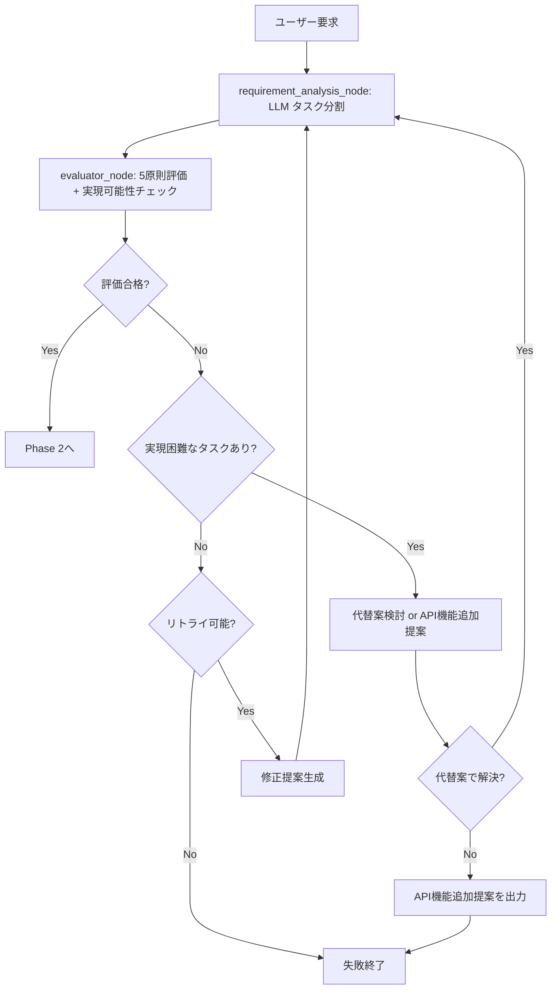
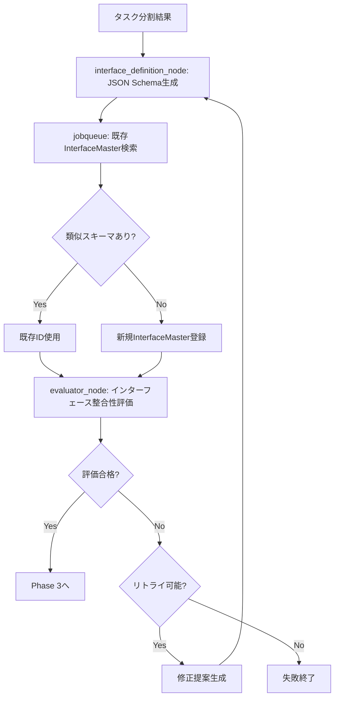
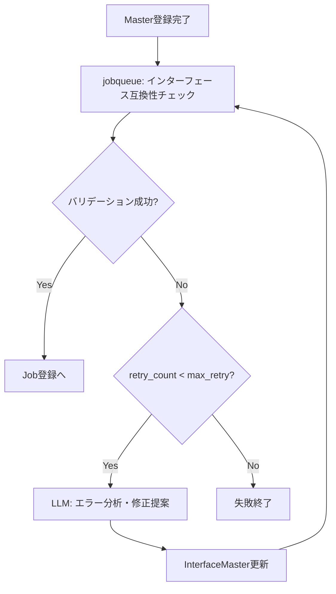

# 設計方針: ジョブ・タスク自動生成エージェント

**作成日**: 2025-10-19
**ブランチ**: feature/issue/97
**担当**: Claude Code
**Issue**: #97

---

## 📋 要求・要件

### ビジネス要求

ユーザーが「やりたいこと」を自然言語で定義すると、それを実現するJob/Taskを自動生成し、jobqueueに登録・実行可能にする。

**具体例**:
```
ユーザー入力: "毎日午前9時にニュースサイトからIT関連ニュースを収集し、要約してメール送信する"

↓ 自動生成 ↓

Job: "daily_it_news_summary"
├── Task1: "fetch_it_news" (ニュース収集)
├── Task2: "summarize_content" (要約生成)
└── Task3: "send_email" (メール送信)
```

### 機能要件

1. **自然言語からのタスク分割**
   - ユーザーの要求を階層的に分解
   - 依存関係を明確化
   - 具体的・実行可能な単位に分割
   - モジュール性・再利用性を考慮

2. **インターフェース自動定義**
   - 各タスクの入出力インターフェースをJSON Schemaで定義
   - InterfaceMaster自動登録
   - 既存InterfaceMasterの検索・再利用

3. **TaskMaster/JobMaster登録**
   - TaskMasterの自動生成・登録
   - JobMasterの自動生成・登録
   - 既存TaskMasterの検索・再利用

4. **バリデーション＆自動修正**
   - jobqueueのバリデーションAPI実行
   - 失敗時は自動修正（デフォルト5回リトライ）
   - リトライ回数はリクエスト時に指定可能

5. **実行可能なJob生成**
   - 最終出力はJob ID（即座に実行可能な状態）
   - jobqueueに登録済み

### 非機能要件

- **パフォーマンス**: LLM呼び出しを含め、合計60秒以内に完了
- **セキュリティ**: LLMプロンプトインジェクション対策実施
- **可用性**: バリデーション失敗時の自動リトライで成功率向上
- **拡張性**: GraphAI YAML生成（別イシュー）への対応を見据えた設計

---

## 🏗️ アーキテクチャ設計

### システム構成

```
┌─────────────────────────────────────────────────────────────┐
│                        CommonUI                              │
│  (チャットインターフェースで要件明確化)                        │
└───────────────────┬─────────────────────────────────────────┘
                    │
                    │ REST API
                    ▼
┌─────────────────────────────────────────────────────────────┐
│                     ExpertAgent                              │
│  ┌───────────────────────────────────────────────────────┐  │
│  │  /api/v1/job-generator (job_generator_endpoints.py)  │  │
│  └───────────────────┬───────────────────────────────────┘  │
│                      │                                       │
│                      ▼                                       │
│  ┌───────────────────────────────────────────────────────┐  │
│  │ LangGraph Agent: jobTaskGeneratorAgents/             │  │
│  │                                                       │  │
│  │  ┌──────────────────────────────────────────────┐    │  │
│  │  │ 1. requirement_analysis_node                │    │  │
│  │  │    (要件分析・タスク分割)                    │    │  │
│  │  └──────────────┬───────────────────────────────┘    │  │
│  │                 │                                     │  │
│  │                 ▼                                     │  │
│  │  ┌──────────────────────────────────────────────┐    │  │
│  │  │ 2. evaluator_node                           │    │  │
│  │  │    (4原則準拠・整合性評価)                   │    │  │
│  │  └──────────────┬───────────────────────────────┘    │  │
│  │                 │ (条件分岐)                          │  │
│  │                 ▼                                     │  │
│  │  ┌──────────────────────────────────────────────┐    │  │
│  │  │ 3. interface_definition_node                │    │  │
│  │  │    (インターフェース定義・既存検索)          │    │  │
│  │  └──────────────┬───────────────────────────────┘    │  │
│  │                 │                                     │  │
│  │                 ▼                                     │  │
│  │  ┌──────────────────────────────────────────────┐    │  │
│  │  │ 2. evaluator_node (再評価)                  │    │  │
│  │  │    (インターフェース整合性評価)              │    │  │
│  │  └──────────────┬───────────────────────────────┘    │  │
│  │                 │ (条件分岐)                          │  │
│  │                 ▼                                     │  │
│  │  ┌──────────────────────────────────────────────┐    │  │
│  │  │ 4. master_creation_node                     │    │  │
│  │  │    (TaskMaster/JobMaster生成・登録)         │    │  │
│  │  └──────────────┬───────────────────────────────┘    │  │
│  │                 │                                     │  │
│  │                 ▼                                     │  │
│  │  ┌──────────────────────────────────────────────┐    │  │
│  │  │ 5. validation_node                          │    │  │
│  │  │    (バリデーション・自動修正)                │    │  │
│  │  └──────────────┬───────────────────────────────┘    │  │
│  │                 │                                     │  │
│  │                 ▼                                     │  │
│  │  ┌──────────────────────────────────────────────┐    │  │
│  │  │ 6. job_registration_node                    │    │  │
│  │  │    (Job登録・実行準備)                       │    │  │
│  │  └──────────────────────────────────────────────┘    │  │
│  │                                                       │  │
│  └───────────────────────────────────────────────────────┘  │
│                                                              │
└──────────────────────┬───────────────────────────────────────┘
                       │
                       │ REST API
                       ▼
┌─────────────────────────────────────────────────────────────┐
│                       JobQueue                               │
│  - InterfaceMaster CRUD API                                  │
│  - TaskMaster CRUD API                                       │
│  - JobMaster CRUD API                                        │
│  - Job CRUD API                                              │
│  - Validation API (/job-masters/{id}/validate-workflow)     │
└─────────────────────────────────────────────────────────────┘
```

### LangGraphエージェント設計

#### **State定義**

```python
from typing import TypedDict, List, Dict, Any, Optional
from langgraph.graph import StateGraph

class JobTaskGeneratorState(TypedDict):
    # Input
    user_requirement: str  # 自然言語要求
    max_retry: int  # バリデーションリトライ回数（デフォルト5）

    # Intermediate
    task_breakdown: List[Dict[str, Any]]  # タスク分割結果
    interface_definitions: List[Dict[str, Any]]  # インターフェース定義
    task_masters: List[Dict[str, Any]]  # TaskMaster定義
    task_master_ids: List[str]  # TaskMaster IDリスト（実行順序を保持）
    job_master: Dict[str, Any]  # JobMaster定義
    job_master_id: Optional[str]  # JobMaster ID

    # Feasibility Analysis
    feasibility_analysis: Optional[Dict[str, Any]]  # 実現可能性分析結果
    infeasible_tasks: List[Dict[str, Any]]  # 実現困難なタスクリスト
    alternative_proposals: List[Dict[str, Any]]  # 代替案リスト
    api_extension_proposals: List[Dict[str, Any]]  # API機能追加提案リスト

    # Evaluation
    evaluation_result: Optional[Dict[str, Any]]  # 評価結果
    evaluation_retry_count: int  # 評価リトライ回数
    evaluation_errors: List[str]  # 評価エラー履歴

    # Validation & Retry
    validation_result: Optional[Dict[str, Any]]  # バリデーション結果
    retry_count: int  # 現在のリトライ回数
    validation_errors: List[str]  # バリデーションエラー履歴

    # Output
    job_id: Optional[str]  # 生成されたJob ID
    status: str  # "in_progress" | "success" | "failed"
    error_message: Optional[str]  # エラーメッセージ
```

#### **Node実装**

**1. requirement_analysis_node**
- **目的**: ユーザー要求をタスクに分割
- **LLMプロンプト**:
  ```
  階層的分解の原則、依存関係の明確化、具体性と実行可能性、モジュール性と再利用性
  に従ってタスク分割を実施してください。

  出力形式:
  [
    {
      "task_name": "fetch_it_news",
      "description": "IT関連ニュースをRSSフィードから収集",
      "sequence": 1,
      "dependencies": [],
      "method": "GET",
      "url_pattern": "https://news-api.example.com/rss/it"
    },
    ...
  ]
  ```

**2. evaluator_node**
- **目的**: タスク分割・インターフェース定義の品質評価 + 実現可能性評価
- **評価観点**:
  1. **階層的分解の原則**: タスクが適切な粒度で分割されているか
  2. **依存関係の明確化**: 各タスクの依存関係が正確に識別されているか
  3. **具体性と実行可能性**: 曖昧さがなく、具体的に実行可能か
  4. **モジュール性と再利用性**: 独立した機能単位として設計されているか
  5. **全体整合性**: タスク間のインターフェースが整合しているか
  6. **実現可能性**: GraphAI標準機能 + expertAgent Direct APIで実現可能か
- **処理フロー**:
  1. LLMで現在の設計を5原則 + 実現可能性に照らして評価
  2. **実現可能性チェック**:
     a. 各タスクをGraphAI標準機能リストと照合
     b. expertAgent Direct APIリストと照合
     c. 実現困難なタスクを検出（例：Slack通知）
  3. 実現困難なタスクがある場合:
     a. **代替案検討**: 既存機能での代替方法を提案（例：Slack → Gmail送信）
     b. **API機能追加提案**: 代替不可の場合、expertAgent Direct APIへの機能追加を提案
  4. 問題がある場合は具体的な修正提案を生成
  5. evaluation_retry_count < max_retry なら修正実施
  6. 評価合格 → 次のNodeへ
  7. 評価不合格 & リトライ超過 → 失敗終了
- **LLMプロンプト**:
  ```
  以下のタスク分割結果を評価してください：
  [タスク分割結果]

  評価基準：
  1. 階層的分解の原則 - 適切な粒度で分割されているか
  2. 依存関係の明確化 - 依存関係が正確か
  3. 具体性と実行可能性 - 実行可能な形で定義されているか
  4. モジュール性と再利用性 - 独立した機能単位か
  5. 実現可能性 - GraphAI + expertAgent Direct APIで実現可能か

  利用可能な機能リスト:
  - GraphAI標準Agent: [fetchAgent, anthropicAgent, geminiAgent, openAIAgent, stringTemplateAgent, arrayJoinAgent, mapAgent, nestedAgent, ...]
  - expertAgent Direct API:
    * Gmail検索/送信 (/v1/utility/gmail_search, /v1/utility/gmail_send)
    * Google検索 (/v1/utility/google_search)
    * Google Drive Upload (/v1/drive/upload)
    * Text-to-Speech (/v1/utility/tts, /v1/utility/tts_upload)
    * Explorer Agent (/aiagent-api/v1/aiagent/utility/explorer) - Web情報収集
    * Action Agent (/aiagent-api/v1/aiagent/utility/action) - Gmail/Calendar操作
    * File Reader Agent (/aiagent-api/v1/aiagent/utility/file_reader) - PDF/画像/音声読み込み
    * Playwright Agent (/aiagent-api/v1/aiagent/utility/playwright) - ログイン/動的コンテンツ
    * JSON Output Agent (/aiagent-api/v1/aiagent/utility/jsonoutput) - 構造化出力
    * 汎用LLM (/aiagent-api/v1/mylllm)

  実現困難なタスク例：
  - Slack/Discord/Teams通知（代替：Gmail送信）
  - SMS送信（代替：Gmail送信）
  - データベース直接操作（代替：ファイル出力 + 手動インポート）
  - AWS/GCP/Azure API（代替：手動操作）

  出力形式:
  {
    "is_valid": bool,
    "issues": [
      {
        "principle": "実現可能性",
        "problem": "タスクAはSlack通知を必要とするが、利用可能APIに存在しない",
        "suggestion": "Gmail送信で代替する",
        "alternative": {
          "type": "substitute",  // "substitute" | "api_extension"
          "description": "Gmail送信APIを使用してメール通知に変更",
          "required_api": null  // api_extension の場合は提案する新API名
        }
      }
    ],
    "infeasible_tasks": [
      {
        "task_name": "slack_notification",
        "reason": "Slack APIは利用不可",
        "alternative": "Gmail送信で代替",
        "requires_api_extension": false
      }
    ],
    "api_extension_proposals": [
      // 代替案がない場合のみ
      {
        "api_name": "slack_notification_api",
        "endpoint": "/v1/utility/slack_send",
        "description": "Slack通知API",
        "priority": "low"  // "high" | "medium" | "low"
      }
    ],
    "overall_assessment": "全体評価コメント"
  }
  ```

**3. interface_definition_node**
- **目的**: 各タスクの入出力インターフェースをJSON Schemaで定義
- **処理フロー**:
  1. LLMで各タスクの入出力スキーマ生成
  2. jobqueue APIで既存InterfaceMaster検索（名前・URL完全一致）
  3. 再利用可能なものは既存ID使用、新規作成が必要なものは登録

**4. master_creation_node**
- **目的**: TaskMaster/JobMaster/JobMasterTask生成・登録
- **処理フロー**:
  1. 既存TaskMaster検索（名前・URL・メソッドで完全一致検索）
  2. 新規TaskMasterの登録（jobqueue POST /api/v1/task-masters）
  3. TaskMaster IDリストを順序付きで保持（state["task_master_ids"]）
  4. JobMaster生成・登録（POST /api/v1/job-masters）
  5. **JobMasterTask登録** (POST /api/v1/job-masters/{master_id}/tasks)
     - 各TaskMasterをJobMasterに関連付け
     - 実行順序（order: 0, 1, 2, ...）を設定
     - is_required=Trueを設定

**5. validation_node**
- **目的**: ワークフローのインターフェース互換性バリデーション
- **処理フロー**:
  1. jobqueue GET /api/v1/job-masters/{master_id}/validate-workflow で検証
  2. 成功 → job_registration_nodeへ
  3. 失敗 → LLMで修正提案 → interface_definition_nodeへ戻る
  4. retry_count が max_retry を超えたら失敗終了
- **バリデーションAPI仕様**:
  ```
  GET /api/v1/job-masters/{master_id}/validate-workflow

  Response:
  {
    "is_valid": bool,
    "errors": List[str],
    "warnings": List[str],
    "task_chain": {...}  # タスクチェーン可視化情報
  }
  ```

**6. job_registration_node**
- **目的**: Job登録・実行準備完了
- **処理フロー**:
  1. JobMasterTaskの取得（GET /api/v1/job-masters/{job_master_id}/tasks）
  2. JobMasterTaskの情報を使ってtasksパラメータを構築
     - order順にソート
     - 各TaskMasterのIDとsequenceを設定
  3. Job作成（POST /api/v1/jobs/from-master/{job_master_id}）
  4. Job ID取得・返却

#### **エッジ定義（フロー制御）**

```python
workflow = StateGraph(JobTaskGeneratorState)

# Node追加
workflow.add_node("requirement_analysis", requirement_analysis_node)
workflow.add_node("evaluator", evaluator_node)
workflow.add_node("interface_definition", interface_definition_node)
workflow.add_node("master_creation", master_creation_node)
workflow.add_node("validation", validation_node)
workflow.add_node("job_registration", job_registration_node)

# エントリーポイント
workflow.set_entry_point("requirement_analysis")

# 基本フロー
workflow.add_edge("requirement_analysis", "evaluator")

# Conditional edge: 評価結果に応じて分岐
def evaluator_router(state: JobTaskGeneratorState) -> str:
    eval_result = state["evaluation_result"]

    if eval_result["is_valid"]:
        # 評価フェーズに応じて次のノードを決定
        if state["interface_definitions"]:
            # インターフェース定義後の評価 → Master作成へ
            return "master_creation"
        else:
            # タスク分割後の評価 → インターフェース定義へ
            return "interface_definition"
    else:
        # 評価不合格
        if state["evaluation_retry_count"] < state["max_retry"]:
            # リトライ可能 → 前のノードに戻る
            if state["interface_definitions"]:
                return "interface_definition"  # インターフェース再定義
            else:
                return "requirement_analysis"  # タスク分割やり直し
        else:
            # リトライ超過 → 失敗終了
            return "END"

workflow.add_conditional_edges(
    "evaluator",
    evaluator_router,
    {
        "requirement_analysis": "requirement_analysis",
        "interface_definition": "interface_definition",
        "master_creation": "master_creation",
        "END": END
    }
)

# インターフェース定義後、再度評価
workflow.add_edge("interface_definition", "evaluator")

# Master作成後、バリデーション
workflow.add_edge("master_creation", "validation")

# Conditional edge: バリデーション結果に応じて分岐
def validation_router(state: JobTaskGeneratorState) -> str:
    if state["validation_result"]["is_valid"]:
        return "job_registration"
    elif state["retry_count"] < state["max_retry"]:
        return "interface_definition"  # インターフェース再定義
    else:
        return "END"  # 失敗終了

workflow.add_conditional_edges(
    "validation",
    validation_router,
    {
        "job_registration": "job_registration",
        "interface_definition": "interface_definition",
        "END": END
    }
)

# Job登録後、完了
workflow.add_edge("job_registration", END)
```

---

## 🔧 技術選定

| 技術要素 | 選定技術 | 選定理由 |
|---------|---------|---------|
| **エージェントフレームワーク** | LangGraph | - expertAgentの標準フレームワーク<br>- 複雑なステート管理・条件分岐に対応<br>- リトライロジック実装が容易 |
| **LLMモデル** | claude-haiku-4-5 | - 高速・低コスト<br>- JSON出力の安定性<br>- 2025年10月リリース最新版 |
| **API通信** | httpx (AsyncClient) | - expertAgentの標準ライブラリ<br>- 非同期処理対応 |
| **スキーマバリデーション** | Pydantic | - expertAgentの標準バリデーション<br>- LLM出力の厳密な検証 |
| **既存検索ロジック** | セマンティック検索（将来） | - 現時点は名前・URL完全一致<br>- 将来的にベクトル検索導入 |

---

## 📚 GraphAI + expertAgent 利用可能機能リファレンス

### **今回のスコープ外だが重要な前提**

- 各タスクは **GraphAI YAML ワークフロー** として実装される
- GraphAI標準Agent + expertAgent Direct APIのみで実現可能なタスクに分割する必要がある
- 実現困難なタスクは代替案検討、または expertAgent Direct API 機能追加提案を行う

### **GraphAI標準Agent（抜粋）**

#### LLM Agents
- `anthropicAgent`, `geminiAgent`, `openAIAgent`, `groqAgent`

#### HTTP/Fetch Agents
- `fetchAgent` - 汎用HTTPクライアント（expertAgent呼び出しに使用）

#### データ変換 Agents
- `arrayJoinAgent`, `arrayFlatAgent`, `arrayToObjectAgent`
- `copyAgent`, `mergeObjectAgent`, `stringTemplateAgent`
- `jsonParserAgent`

#### 制御フロー Agents
- `mapAgent` - 配列の各要素に並列処理
- `nestedAgent` - ネストされたサブグラフ実行
- `compareAgent`, `sortByValuesAgent`

#### ファイル操作 Agents
- `fileReadAgent`, `fileWriteAgent`, `pathUtilsAgent`

#### 外部サービス Agents
- `wikipediaAgent` - Wikipedia検索

**詳細**: [AVAILABLE_AGENTS.md](../../graphAiServer/docs/AVAILABLE_AGENTS.md)

### **expertAgent Direct API**

#### Utility API (Direct API)
| API | エンドポイント | 用途 |
|-----|-------------|------|
| Gmail検索 | `/v1/utility/gmail_search` | Gmail検索 |
| Gmail送信 | `/v1/utility/gmail_send` | メール送信 |
| Google検索 | `/v1/utility/google_search` | Web検索 |
| Google Drive Upload | `/v1/drive/upload` | ファイルアップロード |
| Text-to-Speech | `/v1/utility/tts` | 音声合成 |
| Text-to-Speech (Drive) | `/v1/utility/tts_upload` | 音声合成 + Drive保存 |

#### Utility AI Agent (Agent API)
| Agent | エンドポイント | 用途 |
|-------|-------------|------|
| Explorer Agent | `/aiagent-api/v1/aiagent/utility/explorer` | Web情報収集、HTML→Markdown変換 |
| Action Agent | `/aiagent-api/v1/aiagent/utility/action` | Gmail/Calendar/Drive操作 |
| File Reader Agent | `/aiagent-api/v1/aiagent/utility/file_reader` | PDF/画像/音声/テキスト読み込み |
| Playwright Agent | `/aiagent-api/v1/aiagent/utility/playwright` | ログイン、動的コンテンツ、スクリーンショット |
| JSON Output Agent | `/aiagent-api/v1/aiagent/utility/jsonoutput` | 構造化JSON出力 |

#### LLM API
| API | エンドポイント | 用途 |
|-----|-------------|------|
| 汎用LLM | `/aiagent-api/v1/mylllm` | 汎用LLM実行 |

**詳細**: [GRAPHAI_WORKFLOW_GENERATION_RULES.md](../../graphAiServer/docs/GRAPHAI_WORKFLOW_GENERATION_RULES.md)

### **実現困難なタスクと代替案**

| 実現困難なタスク | 理由 | 代替案 | API機能追加が必要か |
|---------------|------|-------|------------------|
| **Slack通知** | Slack APIなし | Gmail送信で代替 | 低優先度で提案可能 |
| **Discord通知** | Discord APIなし | Gmail送信で代替 | 低優先度で提案可能 |
| **Teams通知** | Teams APIなし | Gmail送信で代替 | 低優先度で提案可能 |
| **SMS送信** | SMS APIなし | Gmail送信で代替 | 中優先度で提案可能 |
| **データベース操作** | DB接続APIなし | ファイル出力 + 手動インポート | 低優先度（セキュリティリスク） |
| **AWS/GCP/Azure API** | クラウドAPIなし | 手動操作 | 低優先度（専用ツール推奨） |
| **GitHub/Jira/Trello** | 統合APIなし | 手動操作 | 中優先度で提案可能 |

**代替案検討の原則**:
1. 既存APIで類似機能を探す（例：Slack → Gmail）
2. 複数APIの組み合わせで実現可能か検討
3. それでも困難な場合のみAPI機能追加を提案

**API機能追加提案の優先度**:
- **高**: ユーザーからの要求が多く、代替困難
- **中**: 特定ユースケースで有用
- **低**: 代替手段が存在する、またはセキュリティ/複雑性の理由で推奨しない

---

## 📁 ディレクトリ構成

```
expertAgent/
├── app/
│   └── api/
│       └── v1/
│           └── job_generator_endpoints.py  # 新規: APIエンドポイント
│
├── aiagent/
│   └── langgraph/
│       └── jobTaskGeneratorAgents/  # 新規ディレクトリ
│           ├── __init__.py
│           ├── agent.py              # LangGraphエージェント本体
│           ├── state.py              # State定義
│           ├── nodes/
│           │   ├── __init__.py
│           │   ├── requirement_analysis.py  # Node 1
│           │   ├── evaluator.py             # Node 2 (評価ノード)
│           │   ├── interface_definition.py  # Node 3
│           │   ├── master_creation.py       # Node 4
│           │   ├── validation.py            # Node 5
│           │   └── job_registration.py      # Node 6
│           ├── prompts/
│           │   ├── __init__.py
│           │   ├── task_breakdown.py        # タスク分割プロンプト
│           │   ├── evaluation.py            # 4原則評価プロンプト
│           │   ├── interface_schema.py      # インターフェース定義プロンプト
│           │   └── validation_fix.py        # バリデーション修正プロンプト
│           └── utils/
│               ├── __init__.py
│               ├── jobqueue_client.py       # jobqueue API client
│               └── schema_matcher.py        # 既存スキーマ検索ロジック
│
└── tests/
    ├── unit/
    │   └── test_job_task_generator/
    │       ├── test_requirement_analysis.py
    │       ├── test_evaluator.py            # 評価ノードテスト
    │       ├── test_interface_definition.py
    │       └── ...
    └── integration/
        └── test_job_task_generator/
            ├── test_end_to_end.py
            └── test_jobqueue_integration.py
```

---

## 🔄 処理フロー詳細

### **Phase 1: 要件分析・タスク分割・評価（実現可能性含む）**



**評価観点（5原則 + 実現可能性）**:
1. **階層的分解の原則** - タスクが適切な粒度で分割されているか
2. **依存関係の明確化** - 各タスクの依存関係が正確に識別されているか
3. **具体性と実行可能性** - 曖昧さがなく、具体的に実行可能か
4. **モジュール性と再利用性** - 独立した機能単位として設計されているか
5. **実現可能性** - GraphAI + expertAgent Direct APIで実現可能か

**実現可能性チェック**:
- 各タスクをGraphAI標準Agent・expertAgent Direct APIと照合
- 実現困難なタスク（Slack通知等）を検出
- 代替案検討（Slack → Gmail送信）
- 代替不可の場合、API機能追加提案（優先度付き）

**出力例**:
```json
{
  "tasks": [
    {
      "task_name": "fetch_it_news",
      "description": "IT関連ニュースをRSSフィードから収集",
      "sequence": 1,
      "dependencies": [],
      "method": "GET",
      "url": "https://news-api.example.com/rss/it",
      "expected_output": "List of news articles with title, url, published_date"
    },
    {
      "task_name": "summarize_content",
      "description": "ニュース記事を要約（Claude APIを使用）",
      "sequence": 2,
      "dependencies": ["fetch_it_news"],
      "method": "POST",
      "url": "https://api.anthropic.com/v1/messages",
      "expected_input": "List of news articles",
      "expected_output": "Summarized news digest"
    },
    {
      "task_name": "send_email",
      "description": "要約結果をメール送信",
      "sequence": 3,
      "dependencies": ["summarize_content"],
      "method": "POST",
      "url": "https://mail-api.example.com/send",
      "expected_input": "Email content (summary)",
      "expected_output": "Email send confirmation"
    }
  ]
}
```

### **Phase 2: インターフェース定義・既存検索・評価**



**評価観点**:
- タスク間のインターフェース互換性
- 入出力スキーマの完全性
- JSON Schemaの妥当性
- 全体整合性

**出力例**:
```json
{
  "interfaces": [
    {
      "interface_name": "news_article_list",
      "input_schema": null,
      "output_schema": {
        "type": "object",
        "properties": {
          "articles": {
            "type": "array",
            "items": {
              "type": "object",
              "properties": {
                "title": {"type": "string"},
                "url": {"type": "string", "format": "uri"},
                "published_date": {"type": "string", "format": "date-time"}
              },
              "required": ["title", "url"]
            }
          }
        },
        "required": ["articles"]
      },
      "existing_id": null,  # 新規作成
      "registered_id": "if_news_article_list_001"
    }
  ]
}
```

### **Phase 3: Master生成・登録**

**TaskMaster登録API呼び出し**:
```http
POST /api/v1/task-masters
{
  "name": "Fetch IT News",
  "description": "IT関連ニュースをRSSフィードから収集",
  "method": "GET",
  "url": "https://news-api.example.com/rss/it",
  "timeout_sec": 30,
  "input_interface_id": null,
  "output_interface_id": "if_news_article_list_001",
  "created_by": "job_generator_agent"
}

Response:
{
  "master_id": "tm_01HABCD1234567890",
  "name": "Fetch IT News",
  "is_active": true
}
```

**JobMaster登録API呼び出し**:
```http
POST /api/v1/job-masters
{
  "name": "Daily IT News Summary",
  "description": "毎日のITニュース要約配信",
  "method": "POST",
  "url": "https://scheduler.example.com/trigger",
  "timeout_sec": 300,
  "created_by": "job_generator_agent"
}

Response:
{
  "master_id": "jm_01HABCD9876543210",
  "name": "Daily IT News Summary",
  "is_active": true
}
```

**JobMasterTask登録API呼び出し（各TaskMasterに対して実行）**:
```http
POST /api/v1/job-masters/jm_01HABCD9876543210/tasks
{
  "task_master_id": "tm_01HABCD1234567890",
  "order": 0,
  "is_required": true,
  "retry_on_failure": false
}

Response:
{
  "task_master_id": "tm_01HABCD1234567890",
  "order": 0,
  "job_master_id": "jm_01HABCD9876543210"
}
```

**重要**:
- TaskMaster登録後、IDリストを順序付きで保存（state["task_master_ids"]）
- JobMaster登録後、各TaskMasterをJobMasterに関連付ける（JobMasterTask登録）
- JobMasterTask登録が完了して初めてバリデーションが実行可能になる

### **Phase 4: バリデーション・自動修正**



**バリデーションAPI呼び出し**:
```http
GET /api/v1/job-masters/jm_01HABCD9876543210/validate-workflow

Response:
{
  "is_valid": false,
  "errors": [
    {
      "type": "interface_mismatch",
      "message": "Interface mismatch between tasks at order 1 and 2",
      "details": {
        "current_task_name": "fetch_it_news",
        "current_task_output_interface_id": "if_news_article_list_001",
        "next_task_name": "summarize_content",
        "next_task_input_interface_id": "if_news_list_002"
      }
    }
  ],
  "warnings": [],
  "task_chain": [
    {
      "order": 0,
      "task_name": "fetch_it_news",
      "input_interface_id": null,
      "output_interface_id": "if_news_article_list_001"
    },
    {
      "order": 1,
      "task_name": "summarize_content",
      "input_interface_id": "if_news_list_002",
      "output_interface_id": "if_summary_001"
    }
  ]
}
```

**LLM修正プロンプト**:
```
バリデーションエラーが発生しました：
- Task 2の入力インターフェースがTask 1の出力と互換性がありません

現在のスキーマ：
Task 1 Output: { "articles": [...] }
Task 2 Input: { "news_list": [...] }

互換性のあるスキーマに修正してください。
```

### **Phase 5: Job登録**

**Step 1: JobMasterTaskの取得**
```http
GET /api/v1/job-masters/jm_01HABCD9876543210/tasks

Response:
{
  "tasks": [
    {
      "id": "jmt_01HAB...",
      "task_master_id": "tm_01HABCD1234567890",
      "order": 0,
      "task_name": "Fetch IT News",
      ...
    },
    {
      "id": "jmt_01HAB...",
      "task_master_id": "tm_01HABCD1234567891",
      "order": 1,
      "task_name": "Summarize Content",
      ...
    }
  ],
  "total": 2
}
```

**Step 2: Job作成（TaskMaster情報を使用）**
```http
POST /api/v1/jobs/from-master/jm_01HABCD9876543210
{
  "name": "Daily IT News Summary - 2025-10-19",
  "priority": 5,
  "tasks": [
    {"master_id": "tm_01HABCD1234567890", "sequence": 0, "input_data": {}},
    {"master_id": "tm_01HABCD1234567891", "sequence": 1, "input_data": {}}
  ],
  "validate_interfaces": false
}

Response:
{
  "job_id": "j_01HABCD1234567890",
  "status": "queued"
}
```

**注**:
- JobMasterTaskの情報（order, task_master_id）を使ってtasksパラメータを構築
- validate_interfaces=false（既にWorkflowレベルでバリデーション済み）
- input_dataは初期実装では空（将来的に動的データ注入対応）

---

## 🔐 セキュリティ考慮

### **プロンプトインジェクション対策**

1. **入力サニタイゼーション**:
   ```python
   def sanitize_user_input(text: str) -> str:
       # 危険な文字列パターン除去
       forbidden_patterns = [
           r"ignore previous instructions",
           r"system:",
           r"assistant:",
           r"<\|im_start\|>",
       ]
       for pattern in forbidden_patterns:
           text = re.sub(pattern, "", text, flags=re.IGNORECASE)
       return text
   ```

2. **構造化出力の強制**:
   - Pydanticモデルで厳密なバリデーション
   - JSON Schema指定でLLM出力を制約

3. **権限チェック**:
   - jobqueue APIトークン認証
   - taskmaster/jobmaster作成権限確認

---

## ✅ 制約条件チェック結果

### コード品質原則
- [x] **SOLID原則**: 各Nodeは単一責任、インターフェース分離
- [x] **KISS原則**: 遵守 / 複雑性を最小限に
- [x] **YAGNI原則**: 遵守 / GraphAI YAML生成は別イシューで対応
- [x] **DRY原則**: 遵守 / 共通処理はutils/に集約

### アーキテクチャガイドライン
- [x] **architecture-overview.md**: 準拠 / expertAgent-jobqueue連携パターン
- [x] **environment-variables.md**: 準拠 / JOBQUEUE_BASE_URL使用
- [x] **myvault-integration.md**: 準拠 / LLM APIキーはmyVaultで管理

### 設定管理ルール
- [x] **環境変数**: JOBQUEUE_BASE_URL, CLAUDE_API_KEY (myVault経由)
- [x] **myVault**: LLM APIキー管理

### 品質担保方針
- [x] **単体テストカバレッジ**: 90%以上 (各Node独立テスト)
- [x] **結合テストカバレッジ**: 50%以上 (E2Eテスト)
- [x] **Ruff linting**: 適用
- [x] **MyPy type checking**: 厳密な型定義

### CI/CD準拠
- [x] **PRラベル**: `feature` ラベル (minor bump)
- [x] **コミットメッセージ**: 規約準拠
- [x] **pre-push-check-all.sh**: 実行予定

### 参照ドキュメント遵守
- [x] **新プロジェクト追加時**: 該当なし（既存expertAgent拡張）
- [x] **GraphAI ワークフロー開発時**: 該当なし（別イシューで対応）

### 違反・要検討項目
なし

---

## 💡 設計上の決定事項

### 決定事項1: LangGraphエージェント採用
- **決定内容**: LangGraphでステートマシン実装
- **理由**:
  - 複雑なリトライロジックの実装が容易
  - 条件分岐・エラーハンドリングが明確
  - expertAgentの標準フレームワーク
- **代替案**:
  - 通常の関数チェーン（拒否: リトライロジックが複雑化）
  - GraphAI workflow（拒否: LLM呼び出し中心の処理に不適）

### 決定事項2: claude-haiku-4-5 使用
- **決定内容**: LLMモデルをclaude-haiku-4-5に固定
- **理由**:
  - 高速・低コスト（タスク分割は複雑な推論不要）
  - JSON出力の安定性が高い
  - 2025年10月リリース最新版
- **補足**: 将来的にモデル選択可能にする余地は残す

### 決定事項3: 既存Master検索は名前・URL完全一致
- **決定内容**: 初期実装では名前・URL完全一致で検索
- **理由**:
  - セマンティック検索（ベクトルDB）は別イシューで対応
  - 初期実装を簡潔に保つ
  - 完全一致でも十分な再利用率が期待できる
- **将来拡張**: Embedding + Pinecone/Weaviateでセマンティック検索

### 決定事項4: バリデーションリトライ回数
- **決定内容**: デフォルト5回、リクエスト時に変更可能
- **理由**:
  - 5回あれば多くのケースで成功する（経験則）
  - ユーザーが急ぎの場合はリトライ回数を減らせる
  - 無限ループ防止

### 決定事項5: GraphAI YAML生成は別イシュー
- **決定内容**: 今回は複雑なタスク時のGraphAI活用は考慮するが、YAML生成は別イシューで対応
- **理由**:
  - YAML生成は別の複雑なロジックが必要
  - スコープ肥大化を防ぐ
  - まずはシンプルなタスクチェーンで実績を作る

### 決定事項6: 出力はJob ID（実行可能状態）
- **決定内容**: API応答でJob IDを即座に返却、すぐに実行可能
- **理由**:
  - ユーザー体験の向上（確認ステップ不要）
  - バリデーション済みなので安全
  - 必要なら後でJob定義を確認可能（GET /api/v1/jobs/{job_id}）
- **補足**: 将来的に「draft mode」（確認後登録）も検討可能

### 決定事項7: JobMasterTask登録の必須化
- **決定内容**: master_creation_nodeでJobMasterTask登録を必須とする
- **理由**:
  - WorkflowValidatorはJobMasterTaskテーブルを参照してバリデーションを実行
  - JobMasterTask登録なしではバリデーションが失敗する（空のワークフロー警告）
  - タスクの実行順序はJobMasterTaskのorderフィールドで管理される
- **実装方針**:
  - TaskMaster登録時にIDリストを順序付きで保存（state["task_master_ids"]）
  - JobMaster登録後、各TaskMasterに対してJobMasterTask登録APIを順次実行
  - is_required=True（全タスク必須）、retry_on_failure=False（初期実装）

### 決定事項8: 実現可能性評価の必須化
- **決定内容**: evaluator_nodeで実現可能性評価を必須とする
- **理由**:
  - 各タスクはGraphAI YAML ワークフローとして実装される（今回のスコープ外だが重要な前提）
  - GraphAI標準Agent + expertAgent Direct APIで実現可能なタスクのみ生成すべき
  - 実現困難なタスク（Slack通知等）は事前に検出し、代替案提示またはAPI機能追加提案を行う
- **実装方針**:
  - **Step 1**: 各タスクをGraphAI標準Agent・expertAgent Direct APIリストと照合
  - **Step 2**: 実現困難なタスクを検出
  - **Step 3**: 代替案検討（Slack → Gmail送信）
  - **Step 4**: 代替不可の場合、API機能追加提案（優先度付き）
  - **Step 5**: 実現困難なタスクが残る場合は失敗終了（API機能追加提案を出力）
- **代替案検討の原則**:
  1. 既存APIで類似機能を探す（例：Slack → Gmail）
  2. 複数APIの組み合わせで実現可能か検討
  3. それでも困難な場合のみAPI機能追加を提案
- **API機能追加提案の優先度基準**:
  - **高**: ユーザーからの要求が多く、代替困難
  - **中**: 特定ユースケースで有用
  - **低**: 代替手段が存在する、またはセキュリティ/複雑性の理由で推奨しない

---

## 📊 リスク分析

| リスク | 発生確率 | 影響度 | 対策 |
|-------|---------|-------|------|
| **LLM出力の不安定性** | 中 | 高 | Pydanticで厳密なバリデーション、リトライロジック |
| **jobqueue APIの変更** | 低 | 高 | jobqueueバージョン固定、統合テストで早期検知 |
| **JobMasterTask登録漏れ** | 中 | 高 | 実装時の厳密なチェック、統合テストで検証 |
| **実現困難なタスクの生成** | 中 | 高 | evaluator_nodeで実現可能性評価、代替案検討、API機能追加提案 |
| **バリデーション無限ループ** | 低 | 中 | max_retry強制、タイムアウト設定 |
| **既存Master検索の精度不足** | 中 | 低 | 将来的にセマンティック検索導入 |
| **パフォーマンス（60秒超過）** | 低 | 中 | 非同期処理、LLM呼び出し最適化 |
| **GraphAI機能リストの陳腐化** | 中 | 中 | GraphAI/expertAgent更新時に機能リストを更新 |

---

## 🧪 テスト戦略

### 単体テスト（90%カバレッジ目標）

- **requirement_analysis_node**:
  - タスク分割ロジック
  - 依存関係検出
  - 階層的分解の検証
- **evaluator_node**:
  - 4原則評価ロジック（各原則の判定精度）
  - 全体整合性評価
  - 修正提案生成
  - リトライロジック（evaluation_retry_count制御）
  - 評価合格/不合格時の分岐処理
- **interface_definition_node**:
  - JSON Schema生成
  - 既存検索ロジック
  - InterfaceMaster登録
- **validation_node**:
  - リトライロジック
  - エラー修正提案
  - max_retry超過時の挙動

### 結合テスト（50%カバレッジ目標）

- **E2Eテスト**:
  - 自然言語入力 → Job ID出力
  - 評価成功ケース（タスク分割・インターフェース定義両方で評価合格）
  - 評価失敗→リトライ→成功ケース
  - バリデーション成功ケース
  - バリデーション失敗→リトライ→成功ケース
  - 評価・バリデーション複合リトライケース
- **jobqueue統合テスト**:
  - InterfaceMaster CRUD
  - TaskMaster CRUD
  - JobMaster CRUD
  - Validation API (/job-masters/{id}/validate-workflow)

---

## 📈 将来拡張

1. **GraphAI YAML自動生成** (別イシュー)
   - 複雑な処理（並列・結合等）をGraphAIで実装
   - YAML生成エージェント連携

2. **セマンティック検索**
   - Embedding + Pineconeで既存Master検索精度向上
   - 類似タスクの推薦機能

3. **Draft Mode**
   - ユーザー確認後に登録するモード
   - Job定義のプレビュー機能

4. **実行結果フィードバック**
   - Job実行結果を学習データとして活用
   - タスク分割精度の向上

---

**設計方針作成完了。work-plan.md の作成に進みます。**
