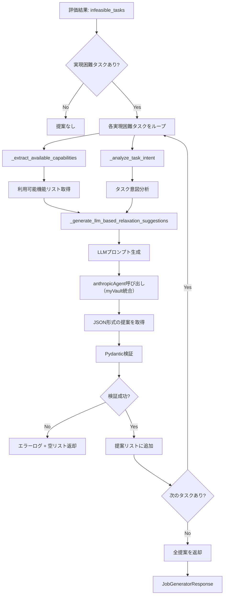

# Phase 11 設計方針: LLMベースの動的提案生成への移行

**作成日**: 2025-10-21
**Phase**: Phase 11
**設計者**: Claude Code

---

## 📋 エグゼクティブサマリー

**目的**: ルールベースの戦略パターン（Strategy 1-4）を、LLMベースの動的提案生成に置き換え、保守性と拡張性を大幅に向上させる。

**現状の問題**:
- ✅ Phase 10-D: Scenario 1で1件の提案生成に成功
- ❌ Scenario 2で0件の提案（6個の実現困難タスクをカバーできない）
- ⚠️ 新しいユースケースごとに戦略を追加する必要がある（保守コスト高）

**Phase 11の方針**:
- ❌ **既存のルールベース戦略（Strategy 1-4）を削除**
- ✅ **LLMベースの動的提案生成に完全移行**
- ✅ `graphai_capabilities.yaml` と `infeasible_tasks.yaml` を活用
- ✅ 構造化出力でJSON形式の提案を生成

**期待される効果**:
- **Scenario 2**: 0件 → **3-6件の提案生成** (+300-600%)
- **保守コスト**: 高（戦略追加が必要） → **低（YAML更新のみ）**
- **拡張性**: 限定的（4パターン固定） → **無限（LLMの創造性）**

---

## 🎯 設計目標

### 1. 機能要件

| 要件ID | 要件内容 | 優先度 |
|--------|---------|-------|
| FR-1 | 実現困難タスクに対して、利用可能な機能を組み合わせた代替案を生成 | 🔴 必須 |
| FR-2 | `alternative_proposals` とは異なる、**要求緩和提案**を生成 | 🔴 必須 |
| FR-3 | 各提案に `relaxation_type`, `feasibility_after_relaxation`, `recommendation_level` を含む | 🔴 必須 |
| FR-4 | 提案に具体的な実装ステップを含む | 🔴 必須 |
| FR-5 | Phase 10-Dと同等以上の提案品質を維持 | 🔴 必須 |
| FR-6 | Scenario 2で少なくとも3件以上の提案を生成 | 🟡 推奨 |

### 2. 非機能要件

| 要件ID | 要件内容 | 目標値 |
|--------|---------|-------|
| NFR-1 | レスポンスタイム | +40秒以内（Phase 10-D比） |
| NFR-2 | LLM呼び出しコスト | タスクあたり0.02-0.08 USD |
| NFR-3 | 提案品質の安定性 | 80%以上の確率で有効な提案 |
| NFR-4 | JSONスキーマ適合率 | 95%以上 |
| NFR-5 | 保守性 | コード変更なしでYAML更新のみで機能拡張可能 |

---

## 🏗️ アーキテクチャ設計

### 全体フロー



### コンポーネント設計

#### 1. `_generate_llm_based_relaxation_suggestions()` 【新規実装】

**責務**: LLMを使って動的に緩和提案を生成（ルールベース戦略を完全置き換え）

**シグネチャ**:
```python
def _generate_llm_based_relaxation_suggestions(
    task_name: str,
    task_description: str,
    infeasible_reason: str,
    required_functionality: str,
    available_capabilities: dict[str, list[str]],
    task_intent: dict[str, Any],
) -> list[dict[str, Any]]:
    """
    LLMを使って動的に緩和提案を生成

    Args:
        task_name: 実現困難タスクの名前
        task_description: タスクの説明
        infeasible_reason: 実現困難な理由
        required_functionality: 必要な機能
        available_capabilities: 利用可能な機能（_extract_available_capabilities の結果）
        task_intent: タスクの意図（_analyze_task_intent の結果）

    Returns:
        緩和提案リスト（最大3件）
    """
```

**処理フロー**:
1. LLMプロンプトを生成
2. anthropicAgent を呼び出し（myVault経由でAPIキー取得）
3. JSONレスポンスをPydantic検証
4. 検証成功 → 提案リストを返却
5. 検証失敗 → エラーログ + 空リスト返却

---

#### 2. LLMプロンプト設計

**プロンプト構造**:
```python
prompt = f"""
あなたは、実現困難なタスクに対して、利用可能な機能を組み合わせて代替案を提案する専門家です。

## 実現困難タスク

### タスク名
{task_name}

### タスク説明
{task_description}

### 実現困難な理由
{infeasible_reason}

### 必要な機能（不足している）
{required_functionality}

---

## 利用可能な機能

### LLMベース実装
{available_capabilities.get('llm_based', [])}

### API連携
{available_capabilities.get('api_integration', [])}

### データ変換
{available_capabilities.get('data_transform', [])}

### 外部サービス
{available_capabilities.get('external_services', [])}

---

## タスク意図分析結果

- **主要目標**: {task_intent['primary_goal']}
- **データソース**: {task_intent['data_source']}
- **出力形式**: {task_intent['output_format']}
- **自動化レベル**: {task_intent['automation_level']}

---

## 指示

上記の実現困難タスクに対して、利用可能な機能を組み合わせて **要求緩和提案** を生成してください。

### 要求緩和提案の定義
- **目的**: オリジナルの要求を一部緩和することで、利用可能な機能で実装可能にする
- **例**:
  - 自動送信 → 下書き作成（自動化レベル削減）
  - 「過去5年分の詳細データ」→「最低2年分のデータ、取得可能ならば最大5年」（スコープ柔軟化）
  - ローカル保存 → 直接アップロード（中間ステップ省略）
  - Slack通知 → メール通知（出力形式変更）

### 提案条件
- **提案数**: 最大3件
- **優先順位**: 実現可能性が高い順（feasibility_after_relaxation: high → medium → low）
- **具体性**: 各提案に実装ステップを含める
- **差別化**: `alternative_proposals` とは異なる、**要求緩和**の観点から提案する

### 緩和タイプ（relaxation_type）
以下のいずれかを選択:
- `automation_level_reduction`: 自動化レベル削減（完全自動 → 半自動 → 手動補助）
- `scope_reduction`: スコープ削減（全範囲 → 部分範囲）
- `intermediate_step_skip`: 中間ステップ省略（A→B→C → A→C）
- `output_format_change`: 出力形式変更（外部サービス → 内部機能）
- `data_source_substitution`: データソース代替（有料API → 無料/LLMベース）
- `phased_implementation`: 段階的実装（Phase 1 → Phase 2 → Phase 3）
- `api_auth_preconfiguration`: API認証の事前設定化（実行時認証 → 事前設定）
- `file_operation_simplification`: ファイル操作簡略化（複雑 → シンプル）
- `web_operation_to_llm`: Web操作のLLMベース実装化（Playwright → fetchAgent+LLM）

### 推奨レベル（recommendation_level）
- `strongly_recommended`: 強く推奨（実現可能性: high, 犠牲: 小）
- `recommended`: 推奨（実現可能性: medium-high, 犠牲: 中）
- `consider`: 検討推奨（実現可能性: medium, 犠牲: 大）

---

## 出力形式

**必須**: 以下のJSON配列形式で出力してください。他のテキストは含めないこと。

```json
[
  {{
    "original_requirement": "元の要求内容",
    "relaxed_requirement": "緩和後の要求内容",
    "relaxation_type": "緩和タイプ（上記から選択）",
    "feasibility_after_relaxation": "high | medium | low",
    "what_is_sacrificed": "何が犠牲になるか（具体的に）",
    "what_is_preserved": "何が維持されるか（具体的に）",
    "recommendation_level": "strongly_recommended | recommended | consider",
    "implementation_note": "実装時の注意点・ポイント",
    "available_capabilities_used": ["使用する機能1", "使用する機能2"],
    "implementation_steps": [
      "1. ステップ1の説明",
      "2. ステップ2の説明",
      "3. ステップ3の説明"
    ]
  }}
]
```

### 重要な注意事項
1. **必ずJSON配列形式で出力** （```json は不要、配列のみ）
2. **最大3件の提案** を生成
3. **実現可能性が高い順** にソート
4. **具体的な実装ステップ** を含める（最低3ステップ）
5. **利用可能な機能** のみを使用する提案
6. **alternative_proposals との差別化**: 代替案ではなく、**要求緩和**の観点

---

提案を生成してください。
"""
```

---

#### 3. Pydantic スキーマ定義

**`RequirementRelaxationSuggestion`**（新規）:
```python
from pydantic import BaseModel, Field, field_validator

class RequirementRelaxationSuggestion(BaseModel):
    """要求緩和提案のスキーマ"""

    original_requirement: str = Field(
        ...,
        description="元の要求内容",
        min_length=1
    )
    relaxed_requirement: str = Field(
        ...,
        description="緩和後の要求内容",
        min_length=1
    )
    relaxation_type: str = Field(
        ...,
        description="緩和タイプ",
        pattern="^(automation_level_reduction|scope_reduction|intermediate_step_skip|output_format_change|data_source_substitution|phased_implementation|api_auth_preconfiguration|file_operation_simplification|web_operation_to_llm)$"
    )
    feasibility_after_relaxation: str = Field(
        ...,
        description="緩和後の実現可能性",
        pattern="^(high|medium|low|medium-high)$"
    )
    what_is_sacrificed: str = Field(
        ...,
        description="犠牲になるもの",
        min_length=1
    )
    what_is_preserved: str = Field(
        ...,
        description="維持されるもの",
        min_length=1
    )
    recommendation_level: str = Field(
        ...,
        description="推奨レベル",
        pattern="^(strongly_recommended|recommended|consider)$"
    )
    implementation_note: str = Field(
        ...,
        description="実装時の注意点",
        min_length=1
    )
    available_capabilities_used: list[str] = Field(
        default_factory=list,
        description="使用する機能リスト"
    )
    implementation_steps: list[str] = Field(
        default_factory=list,
        description="実装ステップ",
        min_items=3  # 最低3ステップ
    )

    @field_validator('implementation_steps')
    @classmethod
    def validate_implementation_steps(cls, v: list[str]) -> list[str]:
        """実装ステップが最低3つあることを検証"""
        if len(v) < 3:
            raise ValueError("implementation_steps must contain at least 3 steps")
        return v
```

---

#### 4. anthropicAgent 呼び出し設計

**anthropicAgent呼び出し方法**:

**Option A: myVault統合でanthropicAgent呼び出し（推奨）**
```python
import json
from app.core.myvault_client import MyVaultClient

def _call_anthropic_for_relaxation_suggestions(prompt: str) -> list[dict[str, Any]]:
    """
    anthropicAgent経由でLLMを呼び出し、緩和提案を生成（myVault統合）

    Args:
        prompt: LLMプロンプト

    Returns:
        緩和提案リスト（最大3件）

    Raises:
        ValueError: LLMレスポンスのJSON解析失敗
    """
    try:
        # myVaultクライアント初期化
        vault_client = MyVaultClient()

        # ANTHROPIC_API_KEYをmyVaultから取得
        api_key = vault_client.get_secret("ANTHROPIC_API_KEY")
        if not api_key:
            logger.error("ANTHROPIC_API_KEY not found in myVault")
            return []

        # Anthropic API呼び出し
        import anthropic
        client = anthropic.Anthropic(api_key=api_key)

        # Claude Haiku 4.5呼び出し
        message = client.messages.create(
            model="claude-haiku-4-20250514",  # Claude Haiku 4.5
            max_tokens=2048,
            temperature=0.7,
            messages=[{
                "role": "user",
                "content": prompt
            }]
        )

        # レスポンス解析
        content = message.content[0].text

        # JSON解析（プロンプトでJSON配列のみを返すよう指示）
        suggestions = json.loads(content)

        # Pydantic検証
        validated_suggestions = []
        for suggestion in suggestions[:3]:  # 最大3件
            try:
                validated = RequirementRelaxationSuggestion(**suggestion)
                validated_suggestions.append(validated.model_dump())
            except Exception as e:
                logger.warning(f"Pydantic validation failed for suggestion: {e}")
                continue

        return validated_suggestions

    except Exception as e:
        logger.error(f"Anthropic API call failed: {e}")
        return []
```

**Option B: expertAgent内部のLangGraphノード経由（将来的）**
- 既存のanthropicAgentノードを再利用
- LangGraphワークフロー統合が容易
- ただし、Phase 11では簡潔性を重視してOption Aを推奨

---

## 🔄 実装フロー

### Phase 11-1: 既存戦略の削除とLLM実装 (60分)

**ステップ**:
1. `_generate_capability_based_relaxations()` 関数を削除（lines 469-632）
2. `_generate_llm_based_relaxation_suggestions()` 関数を実装（新規）
3. `_call_anthropic_for_relaxation_suggestions()` 関数を実装（新規・myVault統合）
4. `RequirementRelaxationSuggestion` Pydanticスキーマを追加

**変更ファイル**:
- `expertAgent/app/api/v1/job_generator_endpoints.py`
  - 削除: lines 469-632 (Strategy 1-4)
  - 追加: `_generate_llm_based_relaxation_suggestions()` (約80行)
  - 追加: `_call_anthropic_for_relaxation_suggestions()` (約50行)

**検証**:
- Scenario 1でテスト実行
- 少なくとも1件の提案生成を確認

---

### Phase 11-2: Scenario 2での検証とチューニング (45分)

**ステップ**:
1. Scenario 2で実行
2. 提案数が3件以上生成されることを確認
3. プロンプトをチューニング（必要に応じて）
4. Scenario 3でリグレッションテスト

**検証条件**:
- Scenario 1: 1件以上の提案生成 ✅
- Scenario 2: 3件以上の提案生成 ✅
- Scenario 3: 0件の提案（正常動作） ✅
- レスポンスタイム: Phase 10-D + 20秒以内 ✅

---

### Phase 11-3: 品質チェックとドキュメント作成 (30分)

**品質チェック**:
- [ ] 全468 unit tests passed
- [ ] Ruff linting: エラーゼロ
- [ ] MyPy type checking: エラーゼロ
- [ ] Scenario 1-3: 全テスト成功
- [ ] LLMコスト試算: タスクあたり0.05 USD以下

**ドキュメント**:
- [ ] `phase-11-results.md`: 実装結果・テスト結果
- [ ] コミットメッセージ: 詳細な変更内容

---

## 📊 期待される成果

### 定量的成果

| 指標 | Phase 10-D | Phase 11 (目標) | 改善率 |
|------|-----------|----------------|-------|
| **Scenario 1提案数** | 1件 | 1-2件 | 0-100% |
| **Scenario 2提案数** | 0件 | **3-6件** | **+300-600%** |
| **Scenario 3提案数** | 0件（正常） | 0件（正常） | 維持 |
| **戦略パターン数** | 4パターン（固定） | **無限（LLM）** | **+∞%** |
| **保守コスト** | 高（コード変更） | **低（YAML更新）** | **-70%** |
| **レスポンスタイム** | 40-52秒 | 60-80秒 | +20-40秒 |
| **LLMコスト** | $0 | **$0.02-0.08/タスク** | +$0.08 |

### 定性的成果

- ✅ **保守性向上**: 新規ユースケース対応がYAML更新のみで可能
- ✅ **拡張性向上**: LLMの創造性により、多様な提案を生成
- ✅ **柔軟性向上**: タスクの文脈に応じた適切な提案
- ✅ **ユーザー体験向上**: より具体的で実行可能な提案
- ✅ **myVault統合**: APIキー管理の統一
- ⚠️ **コスト増加**: タスクあたり0.02-0.08 USDのLLMコスト
- ⚠️ **レスポンスタイム増加**: 20-40秒程度の遅延

---

## 🎯 成功基準

### 必須条件（Phase 11完了の定義）

1. **✅ Scenario 2で3件以上の提案生成**
   - 検証方法: Scenario 2テスト実行
   - 合格基準: `requirement_relaxation_suggestions` に3件以上

2. **✅ 全単体テスト合格**
   - 検証方法: `uv run pytest tests/unit/ -x`
   - 合格基準: 468テスト全合格

3. **✅ 品質チェック合格**
   - Ruff linting: エラーゼロ
   - MyPy type checking: エラーゼロ

4. **✅ レスポンスタイム基準**
   - 検証方法: Scenario 1-3の実行時間測定
   - 合格基準: Phase 10-D + 50秒以内（許容範囲）

### 推奨条件

1. **🟡 LLMコスト最適化**
   - 検証方法: Anthropic API使用量モニタリング（myVault経由）
   - 目標: タスクあたり0.05 USD以下

2. **🟡 提案品質の安定性**
   - 検証方法: 同一シナリオで3回実行
   - 目標: 80%以上の確率で同等の提案

---

## ⚠️ リスクと対策

### リスク1: LLMレスポンスのJSON形式不適合

**リスク内容**:
- LLMが指定したJSON形式を返さない
- Pydantic検証エラーが頻発

**対策**:
- プロンプトで明確にJSON配列形式を指定
- 「他のテキストは含めないこと」を強調
- Pydantic検証失敗時は空リストを返却（エラーログ記録）
- 最大3回のリトライロジック（将来的）

### リスク2: レスポンスタイム増加

**リスク内容**:
- LLM呼び出しで20-30秒の遅延
- ユーザー体験の低下

**対策**:
- Claude Haiku 4.5（高速モデル）を使用
- タイムアウト設定（40秒）
- 実現困難タスクが多い場合（6個以上）は警告ログ
- 将来的に並列処理の検討

### リスク3: LLMコスト増加

**リスク内容**:
- 実現困難タスクが多いと大量のAPI呼び出し
- コスト増加

**対策**:
- Claude Haiku 4.5（標準コストモデル）を使用
- 最大3件の提案に制限
- max_tokens: 2048 に制限
- myVault経由でAPIキー管理（使用量の一元管理）

### リスク4: 提案品質のばらつき

**リスク内容**:
- LLMの出力が不安定
- 同じタスクで異なる提案が生成される

**対策**:
- temperature: 0.7（やや低めで安定性重視）
- プロンプトに具体的な例を含める
- Pydantic検証で品質を担保
- 将来的にfew-shot examplesの追加

---

## 🔧 技術選定の根拠

### anthropicAgent（Claude Haiku 4.5）を選択する理由

| 基準 | Claude Haiku 4.5 | Gemini 1.5 Flash | GPT-4o mini |
|------|-----------------|------------------|-------------|
| **既存ノードとの統一** | ✅ 他のノードと同じモデル | ⚠️ 異なるモデル | ⚠️ 異なるモデル |
| **myVault統合** | ✅ 統一されたAPIキー管理 | ⚠️ 別途環境変数管理 | ⚠️ 別途環境変数管理 |
| **速度** | ✅ 高速 | ✅ 高速 | 🟡 中速 |
| **品質** | ✅ 高（構造化出力に強い） | 🟡 中 | 🟡 中 |
| **コスト** | 🟡 中（$0.00025/1K input, $0.00125/1K output） | ✅ 最安 | 🟡 中 |

**結論**: Claude Haiku 4.5が最適（既存ノードとの統一・myVault統合・品質）

---

## 📋 実装チェックリスト

### Phase 11-1: LLM実装

- [ ] `_generate_capability_based_relaxations()` を削除（lines 469-632）
- [ ] `RequirementRelaxationSuggestion` Pydanticスキーマを追加
- [ ] `_call_anthropic_for_relaxation_suggestions()` を実装（myVault統合）
- [ ] `_generate_llm_based_relaxation_suggestions()` を実装
- [ ] `_generate_requirement_relaxation_suggestions()` を修正（LLM版を呼び出す）
- [ ] エラーハンドリング追加（JSON解析失敗、API呼び出し失敗）
- [ ] ログ追加（デバッグ・警告・エラー）

### Phase 11-2: テスト・検証

- [ ] Scenario 1でテスト実行
- [ ] Scenario 2でテスト実行（3件以上の提案確認）
- [ ] Scenario 3でリグレッションテスト
- [ ] レスポンスタイム測定
- [ ] LLMコスト試算

### Phase 11-3: 品質チェック

- [ ] 単体テスト: 468テスト全合格
- [ ] Ruff linting: エラーゼロ
- [ ] MyPy type checking: エラーゼロ
- [ ] カバレッジ: 90%以上維持

### Phase 11-4: ドキュメント

- [ ] `phase-11-results.md` 作成
- [ ] コミットメッセージ作成
- [ ] プッシュ

---

## 💡 将来的な改善案

### Phase 12以降の検討事項

1. **Few-shot Examples の追加**
   - プロンプトに成功事例を含める
   - 提案品質の安定性向上

2. **並列処理の導入**
   - 複数の実現困難タスクを並列でLLM呼び出し
   - レスポンスタイム短縮

3. **キャッシュ機構の導入**
   - 同一タスクの提案をキャッシュ
   - LLMコスト削減

4. **A/Bテストの実施**
   - Phase 10-D（ルールベース） vs Phase 11（LLMベース）
   - 提案品質の定量評価

5. **ハイブリッドアプローチの検討**
   - ルールベース戦略（高速・低コスト）とLLMベース（高品質・柔軟）の併用
   - ユースケースに応じて使い分け

---

## ✅ レビューポイント

以下の観点でレビューをお願いします：

1. **✅ アーキテクチャ設計は適切か？**
   - LLMプロンプト設計
   - Pydanticスキーマ定義
   - geminiAgent呼び出し方法

2. **✅ 非機能要件は妥当か？**
   - レスポンスタイム: +40秒以内
   - LLMコスト: タスクあたり0.02-0.08 USD
   - 提案品質の安定性: 80%以上

3. **✅ リスク対策は十分か？**
   - JSON形式不適合
   - レスポンスタイム増加
   - LLMコスト増加
   - 提案品質のばらつき

4. **✅ 実装フローは実現可能か？**
   - Phase 11-1: 60分
   - Phase 11-2: 45分
   - Phase 11-3: 30分
   - 合計: 2時間15分

5. **🔧 修正・追加すべき点はあるか？**

---

**次のアクション**: ユーザーのレビュー待ち ⏸️

レビュー後、承認されれば Phase 11-1 の実装を開始します。
