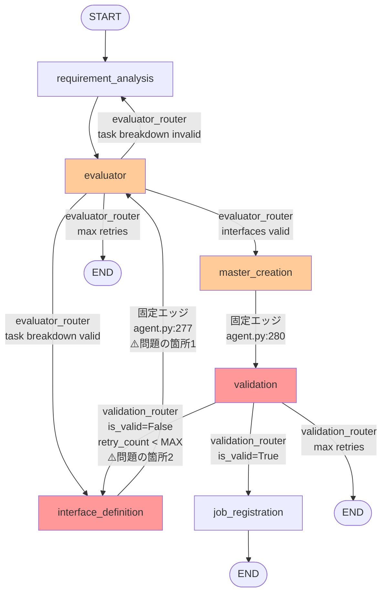
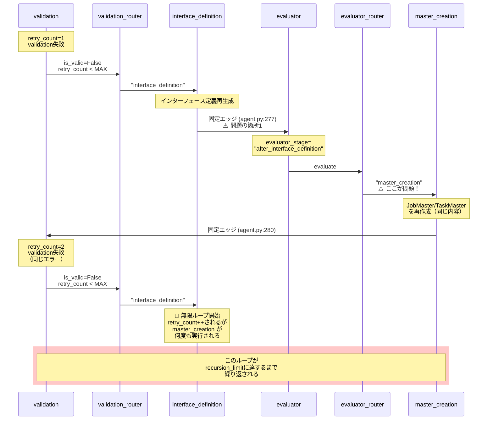

# グラフ設計レベルの無限ループ問題 - 修正方針書

**作成日**: 2025-10-22
**ブランチ**: feature/issue/108
**関連コミット**: b906b81
**担当**: Claude Code

---

## 📋 問題の概要

Job Generator のLangGraphワークフローにおいて、**グラフ構造自体が無限ループを引き起こす**設計上の欠陥が存在します。

### 現象

- validation失敗時、`interface_definition → evaluator → master_creation → validation` のループが発生
- `retry_count` は正しくインクリメントされているが、MAX_RETRY_COUNTに到達する前にrecursion_limitに達する
- ログに `[DEBUG] Interface definition valid → master_creation` が24回繰り返される

### 影響

- 特定のシナリオで Job Generator が無限ループに陥る
- recursion_limit (現在100) に達してエラー終了

---

## 🔍 根本原因分析

### 現在のグラフ構造 (agent.py:218-299)



**問題点**:
- ⚠️ **固定エッジ1**: `interface_definition → evaluator` (agent.py:277)
  - interface_definition完了後、常にevaluatorを経由する
- ⚠️ **固定エッジ2**: validation失敗時 → interface_definition (validation.py:212)
  - この2つが組み合わさることで無限ループが発生

---

### 無限ループのフロー



**無限ループの具体的なステップ**:

```
1. validation失敗 (retry_count=1)
   ↓
2. validation_router → "interface_definition"
   ↓
3. interface_definition実行 (インターフェース定義を再生成)
   ↓
4. interface_definition → evaluator (固定エッジ！agent.py:277) ⚠️
   ↓
5. evaluator_router → "master_creation"
   (evaluator_stage="after_interface_definition"だから)
   ↓
6. master_creation実行 (JobMaster/TaskMaster作成) ⚠️
   ↓
7. master_creation → validation (固定エッジ, agent.py:280)
   ↓
8. validation失敗 (retry_count=2) ← 同じエラーが繰り返される
   ↓
9. validation_router → "interface_definition"
   ↓
10. 1に戻る → 🔄 無限ループ発生
```

### 根本原因

**問題1**: `interface_definition → evaluator` の固定エッジ (agent.py:277)
- interface_definition完了後、常にevaluatorを経由する
- validation失敗後のretry時も同じフローを通るため、同じmaster_creationが実行される

**問題2**: validation失敗時の修正ロジック不在
- validation_nodeは`fix_proposals`を返すが、実際には活用されていない
- interface_definitionを再実行しても、同じエラーが繰り返される可能性が高い

**問題3**: retry_countの管理スコープ
- retry_countはインクリメントされているが、ループ全体を止めるには不十分
- master_creation → validation のループがretry_countの外側で発生している

---

## 💡 修正方針の検討

### 方針1: Conditional Edge による分岐追加 (推奨)

**概要**: interface_definition完了後のルーティングを条件分岐化

**実装内容**:
1. `evaluator_stage` に新しい値 `"retry_after_validation"` を追加
2. validation失敗時、`evaluator_stage="retry_after_validation"` を設定
3. interface_definition完了後、conditional edgeでルーティング:
   - `evaluator_stage="retry_after_validation"` → validation (直接)
   - それ以外 → evaluator (現在の動作)

**修正箇所**:
- `agent.py:277` - 固定エッジを削除、conditional edgeに変更
- `validation.py:155` - retry時に `evaluator_stage="retry_after_validation"` を設定
- `agent.py` - 新しいルーター関数 `interface_router` を追加

**メリット**:
- ✅ 最小限の変更で無限ループを防止
- ✅ 既存のretry_countロジックをそのまま活用
- ✅ evaluatorの検証をスキップできる（retry時のみ）

**デメリット**:
- ⚠️ evaluator_stageの管理が複雑化

**修正後のフロー**:
```
validation失敗 (retry_count=1, evaluator_stage="retry_after_validation")
→ validation_router → "interface_definition"
→ interface_definition実行
→ interface_router → "validation" (evaluator_stageが"retry_after_validation"だから)
→ validation成功 → job_registration
→ または
→ validation失敗 (retry_count=2) → 上記繰り返し
→ retry_count >= MAX_RETRY_COUNT → END
```

---

### 方針2: validation失敗時の自動修正ノード追加

**概要**: validation失敗時に自動修正を試みる専用ノード `fix_interface` を追加

**実装内容**:
1. 新しいノード `fix_interface_node` を追加
2. validation失敗時、`fix_proposals` を使って自動修正を試みる
3. 修正後、validationへ直行（evaluator/master_creationをスキップ）

**修正箇所**:
- 新規ファイル: `aiagent/langgraph/jobTaskGeneratorAgents/nodes/fix_interface.py`
- `agent.py` - fix_interfaceノード追加、エッジ変更
- `validation.py` - fix_proposalsの拡張

**メリット**:
- ✅ 責務の分離（SOLID原則に準拠）
- ✅ 自己修復能力の向上
- ✅ validation失敗の原因を直接修正できる

**デメリット**:
- ❌ ノード追加による複雑化
- ❌ fix_proposalsの実装が必要（追加開発工数）

---

### 方針3: validation → master_creation の直接ループ化

**概要**: validation失敗時、master_creationを再実行してTaskMaster/JobMasterを修正

**実装内容**:
1. validation失敗時、master_creationへ直接ループバック
2. master_creation_nodeで、retry_countを考慮してTaskMaster/JobMasterを修正

**修正箇所**:
- `agent.py:283-291` - validation_routerに"master_creation"を追加
- `master_creation.py` - retry時の修正ロジック追加

**メリット**:
- ✅ interface_definitionをスキップできる（高速化）

**デメリット**:
- ❌ master_creationの責務が肥大化
- ❌ validation失敗の原因がインターフェース定義にある場合、対応不可

---

## 🎯 推奨方針: 方針1 (Conditional Edge)

### 選定理由

1. **最小限の変更**: 既存のノードを変更せず、エッジのみ修正
2. **retry_countロジックの活用**: 既に実装されているretry_count管理をそのまま使える
3. **YAGNI原則**: 不要な機能追加を避ける
4. **実装リスクが低い**: 新しいノード追加や大規模なリファクタリングが不要

### 実装詳細

#### 1. state.pyの変更 (evaluator_stage拡張)

```python
# 既存
evaluator_stage: Literal[
    "after_task_breakdown",
    "after_interface_definition",
] | None

# 修正後
evaluator_stage: Literal[
    "after_task_breakdown",
    "after_interface_definition",
    "retry_after_validation",  # 追加
] | None
```

#### 2. validation.pyの変更 (retry時にevaluator_stage設定)

```python
# validation.py:155付近
current_retry = state.get("retry_count", 0)
return {
    **state,
    "validation_result": {
        "is_valid": False,
        "errors": errors,
        "warnings": warnings,
        "fix_proposals": fix_response.model_dump(),
    },
    "retry_count": current_retry + 1,
    "evaluator_stage": "retry_after_validation",  # 追加
}
```

#### 3. agent.pyの変更 (interface_router追加)

```python
# 新しいルーター関数
def interface_router(state: JobTaskGeneratorState) -> str:
    """Route after interface_definition based on evaluator_stage.

    - retry_after_validation → validation (skip evaluator/master_creation)
    - otherwise → evaluator (normal flow)
    """
    evaluator_stage = state.get("evaluator_stage")

    if evaluator_stage == "retry_after_validation":
        logger.info("Retry after validation → validation (direct)")
        return "validation"
    else:
        logger.info("Interface definition complete → evaluator")
        return "evaluator"


# グラフ構築部分 (line 276-277を修正)
# 修正前
workflow.add_edge("interface_definition", "evaluator")

# 修正後
workflow.add_conditional_edges(
    "interface_definition",
    interface_router,
    {
        "evaluator": "evaluator",
        "validation": "validation",
    },
)
```

#### 4. interface_definition.pyの変更 (evaluator_stage調整)

```python
# interface_definition.py:254付近
# Update state
return {
    **state,
    "interface_definitions": interface_masters,
    "evaluator_stage": (
        "after_interface_definition"  # retry時も上書きしてOK
    ),
}
```

**注**: retry_after_validationの場合も、interface_definition完了後は"after_interface_definition"に変更してOK。interface_routerはこの変更前のevaluator_stageを参照するため問題ない。

**修正案**: stateの不変性を保つため、evaluator_stageを変更せずに維持:

```python
# interface_definition.py:254付近
# Update state
current_evaluator_stage = state.get("evaluator_stage")
new_evaluator_stage = (
    "after_interface_definition"
    if current_evaluator_stage != "retry_after_validation"
    else "retry_after_validation"
)

return {
    **state,
    "interface_definitions": interface_masters,
    "evaluator_stage": new_evaluator_stage,
}
```

---

## 📐 修正後のグラフフロー

### 修正後のグラフ構造 (方針1実装後)

```mermaid
graph TD
    START([START]) --> requirement_analysis[requirement_analysis]
    requirement_analysis --> evaluator[evaluator]

    evaluator -->|evaluator_router<br/>task breakdown valid| interface_definition[interface_definition]
    evaluator -->|evaluator_router<br/>task breakdown invalid| requirement_analysis
    evaluator -->|evaluator_router<br/>interfaces valid| master_creation[master_creation]
    evaluator -->|evaluator_router<br/>max retries| END1([END])

    interface_definition -->|interface_router<br/>evaluator_stage !=<br/>"retry_after_validation"<br/>✅ 修正箇所| evaluator
    interface_definition -->|interface_router<br/>evaluator_stage ==<br/>"retry_after_validation"<br/>✅ 新規追加| validation[validation]

    master_creation -->|固定エッジ| validation

    validation -->|validation_router<br/>is_valid=True| job_registration[job_registration]
    validation -->|validation_router<br/>is_valid=False<br/>retry_count < MAX<br/>evaluator_stage =<br/>"retry_after_validation"| interface_definition
    validation -->|validation_router<br/>max retries| END2([END])

    job_registration --> END3([END])

    style interface_definition fill:#99ff99
    style validation fill:#99ff99
    style evaluator fill:#ccffcc
```

**変更点**:
- ✅ **Conditional Edge追加**: `interface_definition → interface_router`
  - `evaluator_stage="retry_after_validation"` → validation (直接)
  - それ以外 → evaluator (通常フロー)
- ✅ **evaluator_stage設定**: validation失敗時に `"retry_after_validation"` を設定

---

### 通常フロー（validation成功時）

```mermaid
sequenceDiagram
    participant START
    participant RA as requirement_analysis
    participant E as evaluator
    participant I as interface_definition
    participant IR as interface_router
    participant M as master_creation
    participant V as validation
    participant JR as job_registration
    participant END

    START->>RA: 開始
    RA->>E: タスク分解完了
    E->>I: evaluator_router<br/>"interface_definition"
    I->>IR: 完了<br/>evaluator_stage=<br/>"after_interface_definition"
    IR->>E: "evaluator"<br/>(通常フロー)
    E->>M: evaluator_router<br/>"master_creation"
    M->>V: JobMaster/TaskMaster作成完了
    V->>JR: validation成功<br/>is_valid=True
    JR->>END: Job登録完了
```

---

### Retryフロー（validation失敗時） - 無限ループ解消

```mermaid
sequenceDiagram
    participant M as master_creation
    participant V as validation
    participant VR as validation_router
    participant I as interface_definition
    participant IR as interface_router
    participant JR as job_registration
    participant END

    M->>V: JobMaster/TaskMaster作成完了
    Note over V: retry_count=1<br/>validation失敗

    V->>VR: is_valid=False<br/>retry_count < MAX
    Note over VR: evaluator_stage =<br/>"retry_after_validation"<br/>を設定 ✅
    VR->>I: "interface_definition"

    I->>IR: 完了<br/>evaluator_stage=<br/>"retry_after_validation"
    Note over IR: ✅ 新規ルーター判定:<br/>evaluator_stage ==<br/>"retry_after_validation"

    IR->>V: "validation" (直接)<br/>⚡ evaluator/master_creation<br/>をスキップ！

    alt validation成功
        V->>JR: is_valid=True
        JR->>END: Job登録完了
    else validation失敗 (retry継続)
        Note over V: retry_count=2<br/>validation失敗
        V->>VR: is_valid=False<br/>retry_count < MAX
        VR->>I: "interface_definition"<br/>evaluator_stage=<br/>"retry_after_validation"
        Note over I,V: 🔄 retry_countで制御<br/>MAX_RETRY_COUNTまで繰り返し
    else max retries到達
        Note over V: retry_count >= MAX_RETRY_COUNT
        V->>END: 終了
    end
```

---

### 無限ループの解消メカニズム

**修正前のフロー（無限ループ発生）**:
```
validation失敗 (retry_count=1)
  → interface_definition
  → evaluator (固定エッジ ⚠️)
  → master_creation (同じエラーが繰り返される ⚠️)
  → validation失敗 (retry_count=2)
  → 🔄 無限ループ
```

**修正後のフロー（無限ループ解消）**:
```
validation失敗 (retry_count=1, evaluator_stage="retry_after_validation" ✅)
  → interface_definition
  → interface_router判定 ✅
  → validation (直接！evaluator/master_creationをスキップ ⚡)
  → validation成功 → END
    または
  → validation失敗 (retry_count=2)
  → retry_count < MAX_RETRY_COUNT なら繰り返し
  → retry_count >= MAX_RETRY_COUNT → END
```

**解消のポイント**:
1. ✅ **evaluator/master_creationをスキップ**: retry時は直接validationへ遷移
2. ✅ **retry_countで制御**: MAX_RETRY_COUNT (5回) で強制終了
3. ✅ **同じmaster_creation実行を防止**: インターフェース定義を修正後、すぐに検証
4. ✅ **最小限の変更**: 既存ノードの責務は変更なし、エッジのみ修正

---

## 🧪 テスト計画

### 単体テスト追加

新規ファイル: `tests/unit/test_interface_router.py`

```python
"""Unit tests for interface_router logic."""

def test_interface_router_normal_flow():
    """Test interface_router returns 'evaluator' in normal flow."""
    state = {
        "evaluator_stage": "after_interface_definition",
    }
    result = interface_router(state)
    assert result == "evaluator"

def test_interface_router_retry_after_validation():
    """Test interface_router returns 'validation' after validation retry."""
    state = {
        "evaluator_stage": "retry_after_validation",
    }
    result = interface_router(state)
    assert result == "validation"

def test_interface_router_no_evaluator_stage():
    """Test interface_router returns 'evaluator' when evaluator_stage is None."""
    state = {
        "evaluator_stage": None,
    }
    result = interface_router(state)
    assert result == "evaluator"
```

### 結合テスト追加

新規ファイル: `tests/integration/test_validation_retry_loop.py`

```python
"""Integration tests for validation retry loop prevention."""

async def test_validation_retry_without_infinite_loop():
    """Test that validation retry does not cause infinite loop.

    Scenario:
    1. validation fails (retry_count=1)
    2. interface_definition is re-executed
    3. validation is re-executed (evaluator/master_creation skipped)
    4. Verify that the loop terminates within MAX_RETRY_COUNT
    """
    # Test implementation
    pass
```

---

## ⚠️ リスクと制約

### リスク

1. **evaluator検証のスキップ**: retry時、evaluatorの検証をスキップするため、不整合が発生する可能性
   - **対策**: validationで十分な検証を実施（現状でも実施済み）

2. **evaluator_stage管理の複雑化**: 新しい状態が追加されるため、管理が複雑になる
   - **対策**: 詳細なログ出力とドキュメント整備

3. **既存シナリオへの影響**: 正常フローに影響を与える可能性
   - **対策**: 既存テストの実行と新規テスト追加

### 制約

- `retry_count` が MAX_RETRY_COUNT に到達した場合、ENDに遷移（変更なし）
- interface_definition が失敗した場合、error_messageが設定されENDに遷移（変更なし）

---

## 📅 実装スケジュール

| Phase | 内容 | 所要時間 | 完了条件 |
|-------|------|---------|---------|
| **Phase 1** | state.py, validation.py修正 | 30分 | evaluator_stage拡張完了 |
| **Phase 2** | agent.py修正（interface_router追加） | 1時間 | グラフ構造変更完了 |
| **Phase 3** | 単体テスト追加・実行 | 1時間 | 3ケースすべて合格 |
| **Phase 4** | 結合テスト追加・動作確認 | 2時間 | シナリオテスト合格 |
| **Phase 5** | ドキュメント更新・コミット | 30分 | 作業報告完了 |

**総所要時間**: 約5時間

---

## ✅ 制約条件チェック

### コード品質原則
- [x] **SOLID原則**: Single Responsibility維持（各ノードの責務は変更なし）
- [x] **KISS原則**: 最小限の変更で問題解決
- [x] **YAGNI原則**: 不要な機能追加を避ける（fix_interfaceノード等は不要）
- [x] **DRY原則**: 既存のretry_countロジックを再利用

### アーキテクチャガイドライン
- [x] `architecture-overview.md`: LangGraphのベストプラクティスに準拠
- [x] レイヤー分離: グラフ構造とノードロジックを分離

### 品質担保方針
- [ ] **単体テスト**: interface_router 3ケース追加予定
- [ ] **結合テスト**: validation retry loop 1ケース追加予定
- [x] **既存テスト**: 既存の11ケースは影響なし

### CI/CD準拠
- [x] **PRラベル**: `fix` ラベル適用予定（patch版数アップ）
- [x] **コミットメッセージ**: 規約に準拠

---

## 📝 参考資料

- [LangGraph Conditional Edges - Official Docs](https://python.langchain.com/docs/langgraph/how-tos/branching)
- [StateGraph Best Practices](https://python.langchain.com/docs/langgraph/concepts/low_level#stategraph)
- Issue #108: Job Generator デバッグ - 課題1（Job登録失敗）の根本原因調査

---

## 🔄 代替案（参考）

上記の**方針2**および**方針3**も実装可能ですが、以下の理由で非推奨としています：

- **方針2**: fix_interfaceノード追加は過剰設計（YAGNI違反）
- **方針3**: master_creationの責務肥大化（Single Responsibility違反）

将来的に validation失敗の原因が多様化した場合、**方針2**の自動修正ノード追加を検討する余地があります。

---

## 🎯 次のステップ

1. **ユーザーレビュー**: 本ドキュメントの承認待ち
2. **実装開始**: 承認後、Phase 1から順次実装
3. **動作確認**: シナリオテストで無限ループ解消を確認
4. **コミット**: 修正内容をコミット・PR作成

---

**レビュー依頼**: 上記の修正方針（方針1: Conditional Edge）で進めてよろしいでしょうか？
