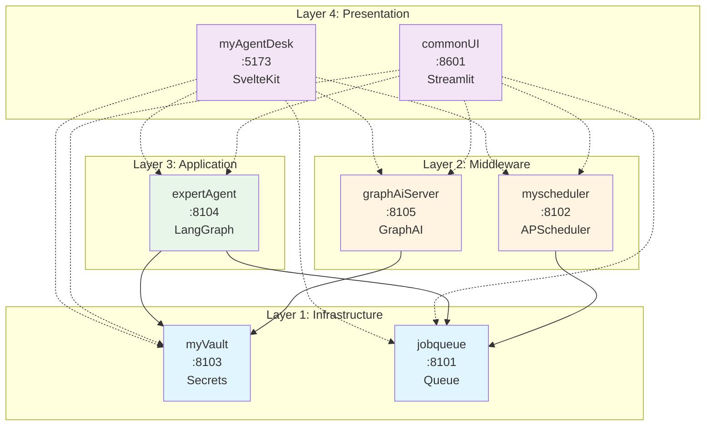
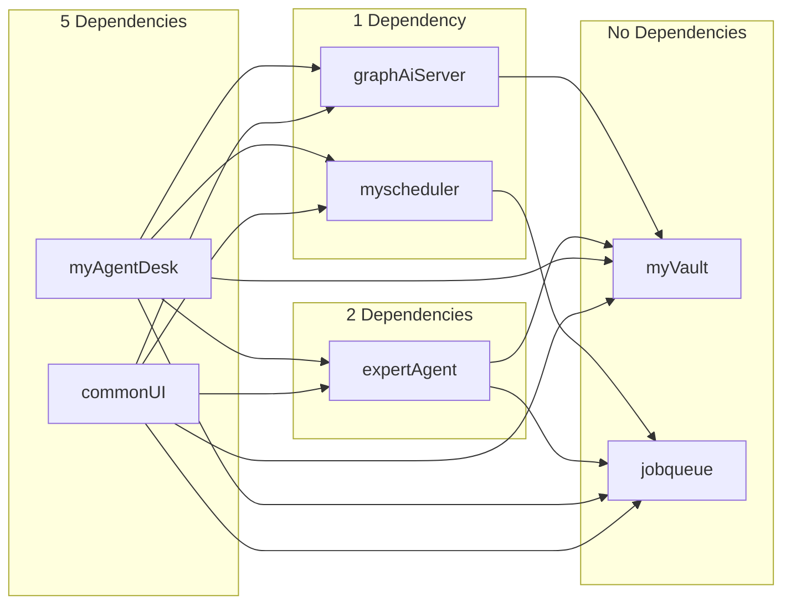
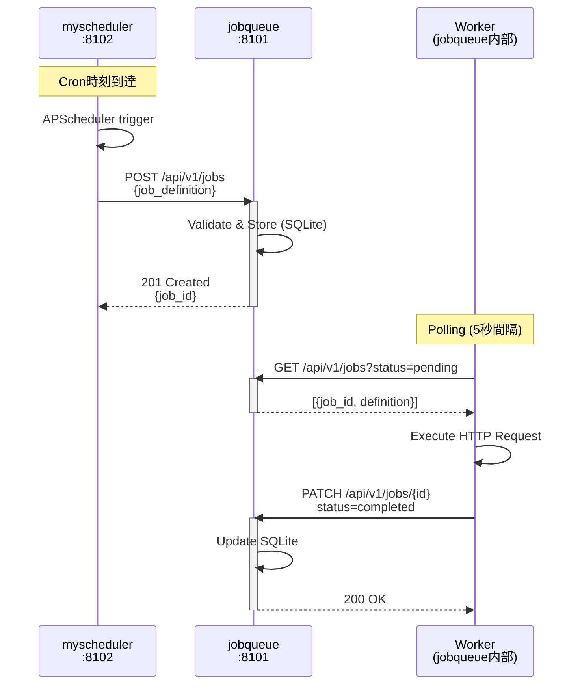
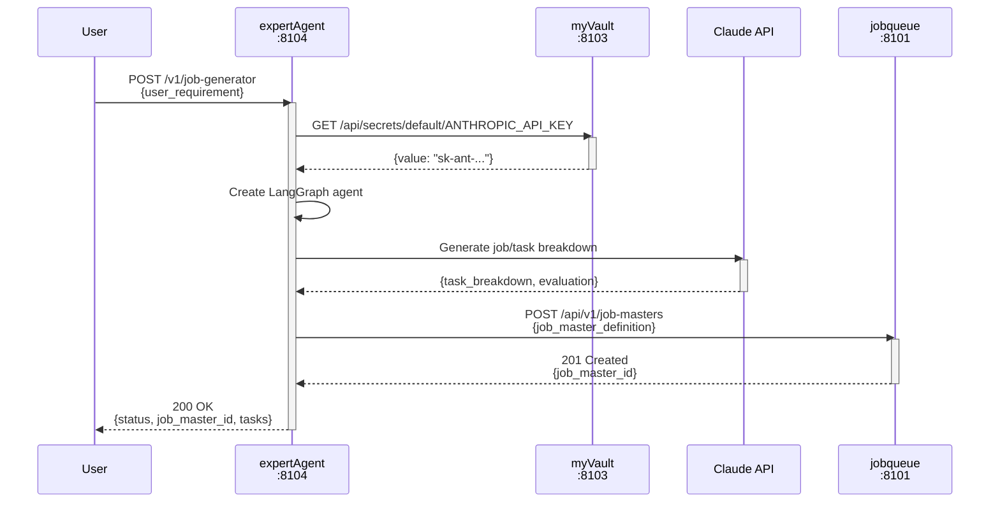
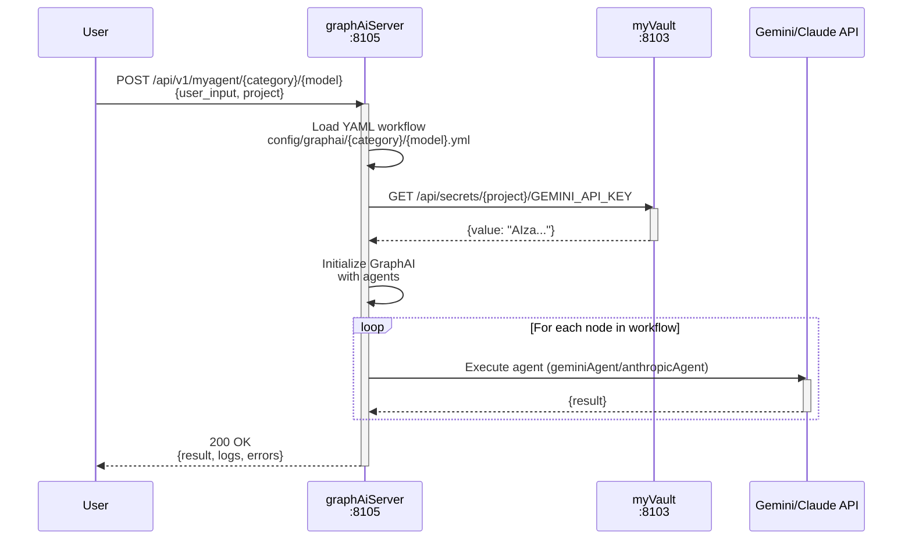
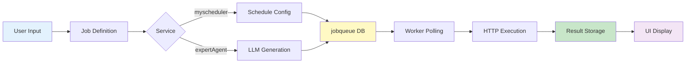
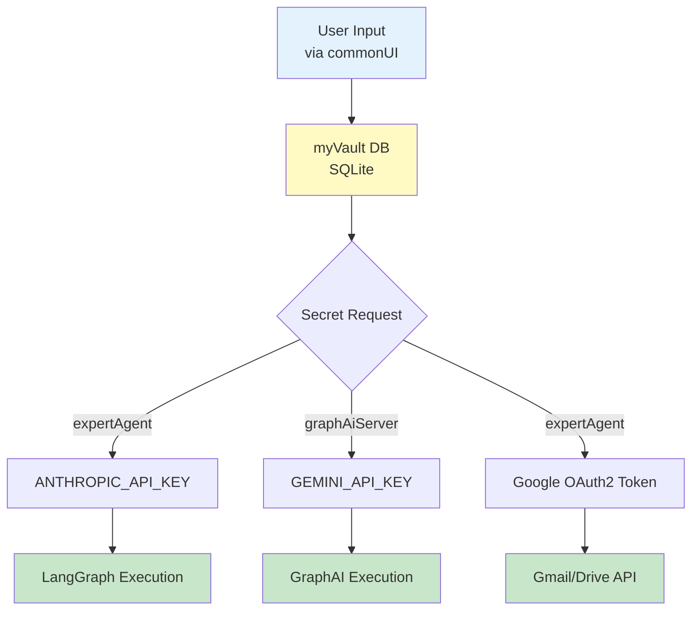
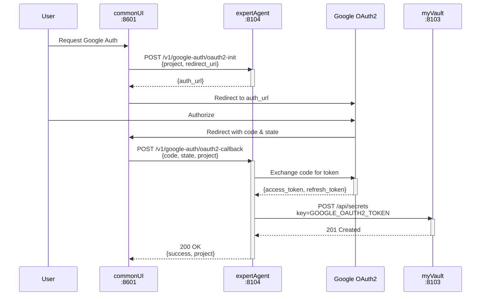

# サービス依存関係

MySwiftAgentのマイクロサービス間の依存関係、通信フロー、データフローを詳細にドキュメント化したアーキテクチャガイドです。

## 目次

- [サービス一覧](#サービス一覧)
- [Docker Composeレイヤ構成](#docker-composeレイヤ構成)
- [依存関係マトリクス](#依存関係マトリクス)
- [アーキテクチャ図](#アーキテクチャ図)
- [通信フロー](#通信フロー)
- [データフロー](#データフロー)
- [API統合](#api統合)
- [起動順序](#起動順序)
- [トラブルシューティング](#トラブルシューティング)

---

## サービス一覧

MySwiftAgentは7つのマイクロサービスで構成されています。各サービスは独立してデプロイ可能ですが、相互に連携して動作します。

| サービス名 | ポート | 技術スタック | 役割 | 依存先サービス |
|-----------|-------|------------|------|--------------|
| **myVault** | 8103 | FastAPI + SQLite | シークレット・認証情報管理 | なし (最下層) |
| **jobqueue** | 8101 | FastAPI + SQLite | ジョブキュー管理・非同期実行 | なし (最下層) |
| **myscheduler** | 8102 | FastAPI + APScheduler | cron/interval/dateベーススケジューリング | jobqueue |
| **expertAgent** | 8104 | FastAPI + LangGraph | AIエージェント・LLMワークフロー | myVault, jobqueue |
| **graphAiServer** | 8105 | Express + GraphAI | GraphAIワークフロー実行エンジン | myVault |
| **myAgentDesk** | 5173 | SvelteKit | Web UI・ダッシュボード | 全サービス (UI層) |
| **commonUI** | 8601 | Streamlit | 管理画面・運用ツール | jobqueue, myscheduler, myVault |

### サービス詳細

#### Layer 1: インフラストラクチャ層

**myVault (8103)**
- 役割: 集中シークレット管理、API認証情報保管
- 特徴: 他サービスから依存されるが、自身は依存なし
- 認証: `X-Service` + `X-Token` ヘッダー
- データ: SQLite (永続化)

**jobqueue (8101)**
- 役割: 非同期ジョブ実行、ステート管理
- 特徴: Worker based architecture、ポーリング実行
- API: RESTful (v1)
- データ: SQLite (永続化)

#### Layer 2: ミドルウェア層

**myscheduler (8102)**
- 役割: スケジュールベースジョブ実行
- 特徴: APScheduler統合、cron/interval/date対応
- 依存: jobqueue (ジョブ投入)

**graphAiServer (8105)**
- 役割: GraphAIワークフロー実行エンジン
- 特徴: Node.js/TypeScript、YAML定義ワークフロー
- 依存: myVault (シークレット取得)

#### Layer 3: アプリケーション層

**expertAgent (8104)**
- 役割: LangGraph AIエージェント、多機能API統合
- 特徴: Google API統合、LLMワークフロー、Job生成
- 依存: myVault (API key管理), jobqueue (Job投入)

#### Layer 4: プレゼンテーション層

**myAgentDesk (5173)**
- 役割: SvelteKit製Web UI
- 特徴: モダンUI、リアクティブ
- 依存: 全APIサービス

**commonUI (8601)**
- 役割: Streamlit製管理画面
- 特徴: 運用ツール、シークレット管理UI
- 依存: jobqueue, myscheduler, myVault, expertAgent, graphAiServer

---

## Docker Composeレイヤ構成

サービスは3つのレイヤに分割されたDocker Composeファイルで管理されています。
`docker-compose.yml` は `include` ディレクティブを使用してこれらのファイルを統合しています。

### レイヤファイル構成

| レイヤ | ファイル | 含まれるサービス | 依存関係 |
|--------|---------|-----------------|----------|
| **Platform** | `docker-compose.platform.yml` | valkey, jobqueue, myscheduler, myvault, langfuse-* | なし（基盤レイヤ） |
| **Agent** | `docker-compose.agent.yml` | expertagent, graphaiserver | Platform層 |
| **Frontend** | `docker-compose.frontend.yml` | commonui, myagentdesk | Agent層 |

### 統合ファイル (docker-compose.yml)

```yaml
# docker-compose.yml
include:
  - path: docker-compose.platform.yml
    project_directory: .
  - path: docker-compose.agent.yml
    project_directory: .
  - path: docker-compose.frontend.yml
    project_directory: .
```

### レイヤ別起動

Makefileを使用してレイヤ別に起動できます：

```bash
# Platform層のみ起動
make dev-platform

# Agent層を追加起動（Platform層が必要）
make dev-agent

# Frontend層を追加起動（Agent層が必要）
make dev-frontend

# 全レイヤを依存順に起動
make dev-all
```

### ネットワーク構成

全レイヤは共通の外部ネットワーク `myswiftagent-network` を使用します：

```bash
# ネットワーク作成（初回のみ）
docker network create myswiftagent-network
# または
make network
```

---

## 依存関係マトリクス

各行が依存元サービス、各列が依存先サービスを表します。✅は直接的な依存関係を示します。

|  | myVault | jobqueue | myscheduler | expertAgent | graphAiServer | myAgentDesk | commonUI |
|--|---------|----------|-------------|-------------|---------------|-------------|----------|
| **myVault** | - | - | - | - | - | - | - |
| **jobqueue** | - | - | - | - | - | - | - |
| **myscheduler** | - | ✅ | - | - | - | - | - |
| **expertAgent** | ✅ | ✅ | - | - | - | - | - |
| **graphAiServer** | ✅ | - | - | - | - | - | - |
| **myAgentDesk** | ✅ | ✅ | ✅ | ✅ | ✅ | - | - |
| **commonUI** | ✅ | ✅ | ✅ | ✅ | ✅ | - | - |

### 依存関係詳細

#### myscheduler → jobqueue
- **目的**: スケジュール実行時のジョブ投入
- **API**: `POST /api/v1/jobs` (ジョブ作成)
- **認証**: `X-API-Token` ヘッダー
- **データフロー**: スケジュール定義 → HTTP実行 → ジョブ投入

#### expertAgent → myVault
- **目的**: API key取得 (ANTHROPIC_API_KEY, Google OAuth2 token等)
- **API**: `GET /api/secrets/{project}/{key}`
- **認証**: `X-Service: expertAgent`, `X-Token`
- **データフロー**: シークレット取得 → LLM API呼び出し

#### expertAgent → jobqueue
- **目的**: Job/Task自動生成からのジョブ投入
- **API**: `POST /api/v1/jobs` (ジョブ作成)
- **認証**: `X-API-Token` ヘッダー
- **データフロー**: LLM生成結果 → JobMaster登録 → ジョブ投入

#### graphAiServer → myVault
- **目的**: GraphAI実行時のAPI key取得
- **API**: `GET /api/secrets/{project}/{key}`
- **認証**: `X-Service: graphAiServer`, `X-Token`
- **データフロー**: ワークフロー実行 → シークレット取得 → Agent実行

#### UI層 (myAgentDesk/commonUI) → 全API
- **目的**: 管理画面からの操作・監視
- **認証**: 各サービス固有の認証方式
- **データフロー**: 双方向 (操作 + 状態取得)

---

## アーキテクチャ図

### サービス構成図



### 依存関係フロー図



---

## 通信フロー

主要なユースケースごとのサービス間通信を詳細化します。

### 1. スケジュールジョブ実行フロー



**通信詳細:**
1. **Scheduler → JobQueue**: HTTP POST (ジョブ投入)
   - エンドポイント: `POST /api/v1/jobs`
   - 認証: `X-API-Token`
   - ボディ: `{url, method, headers, body, timeout_sec, max_retries}`
2. **Worker → JobQueue**: HTTP GET (ジョブ取得)
   - エンドポイント: `GET /api/v1/jobs?status=pending&limit=10`
   - ポーリング間隔: 5秒
3. **Worker → JobQueue**: HTTP PATCH (ステータス更新)
   - エンドポイント: `PATCH /api/v1/jobs/{job_id}`
   - ボディ: `{status: "completed|failed", result}`

### 2. AIエージェントによるジョブ生成フロー



**通信詳細:**
1. **expertAgent → myVault**: シークレット取得
   - エンドポイント: `GET /api/secrets/{project}/{key}`
   - 認証: `X-Service: expertAgent`, `X-Token: <service_token>`
   - レスポンス: `{key, value, project, created_at, updated_at}`
2. **expertAgent → Claude API**: LLM推論
   - API: Anthropic Messages API
   - モデル: `claude-3-haiku-20240307`
   - 認証: `x-api-key: <ANTHROPIC_API_KEY>`
3. **expertAgent → jobqueue**: JobMaster登録
   - エンドポイント: `POST /api/v1/job-masters`
   - 認証: `X-API-Token`
   - ボディ: `{name, description, tasks: [{task_master_id, order}]}`

### 3. GraphAIワークフロー実行フロー



**通信詳細:**
1. **graphAiServer → myVault**: API key取得
   - エンドポイント: `GET /api/secrets/{project}/{key}`
   - 認証: `X-Service: graphAiServer`, `X-Token`
   - キャッシュ: メモリ内キャッシュ (SecretsManager)
2. **graphAiServer → LLM API**: 各Agentノード実行
   - Gemini: `https://generativelanguage.googleapis.com/v1beta/models/gemini-pro:generateContent`
   - Claude: `https://api.anthropic.com/v1/messages`
   - OpenAI: `https://api.openai.com/v1/chat/completions`
3. **ワークフロー管理**:
   - YAML定義: `config/graphai/{category}/{model}.yml`
   - 動的登録: `POST /api/v1/workflows/register`

---

## データフロー

### ジョブデータフロー



**データフロー詳細:**

1. **ジョブ定義 → jobqueue DB**
   - 形式: JSON
   - スキーマ:
     ```json
     {
       "id": "uuid",
       "url": "http://...",
       "method": "POST|GET|PUT|DELETE",
       "headers": {"X-API-Token": "..."},
       "body": {...},
       "timeout_sec": 30,
       "max_retries": 3,
       "retry_backoff_sec": 1.0,
       "status": "pending|running|completed|failed"
     }
     ```
   - ストレージ: SQLite (`jobqueue/data/jobqueue.db`)

2. **Worker実行結果 → jobqueue DB**
   - 更新フィールド: `status`, `result`, `error_message`, `execution_time`
   - 永続化: SQLite transaction

3. **UI表示**
   - API: `GET /api/v1/jobs?status=all&limit=100`
   - リアルタイム更新: Polling (5秒間隔)

### シークレットデータフロー



**シークレット管理詳細:**

1. **保存 (commonUI → myVault)**
   - エンドポイント: `POST /api/secrets`
   - 認証: `X-Service: commonui`, `X-Token`
   - ボディ:
     ```json
     {
       "project": "default_project",
       "key": "ANTHROPIC_API_KEY",
       "value": "sk-ant-...",
       "description": "Claude API Key"
     }
     ```
   - ストレージ: SQLite (`myVault/data/myvault.db`)

2. **取得 (expertAgent → myVault)**
   - エンドポイント: `GET /api/secrets/{project}/{key}`
   - 認証: `X-Service: expertAgent`, `X-Token: <service_token>`
   - レスポンス:
     ```json
     {
       "key": "ANTHROPIC_API_KEY",
       "value": "sk-ant-...",
       "project": "default_project",
       "created_at": "2025-01-01T00:00:00Z",
       "updated_at": "2025-01-01T00:00:00Z"
     }
     ```

3. **キャッシュ管理**
   - graphAiServer: メモリ内キャッシュ (SecretsManager)
   - キャッシュクリア: `POST /api/v1/admin/reload-secrets`

### Google OAuth2データフロー



**OAuth2トークン管理:**

1. **初期化**: `POST /v1/google-auth/oauth2-init`
2. **コールバック**: `POST /v1/google-auth/oauth2-callback`
3. **トークン保存**: myVaultに `GOOGLE_OAUTH2_TOKEN` として保存
4. **トークン使用**: Gmail/Drive API呼び出し時に自動取得・リフレッシュ

---

## API統合

### 認証方式

各サービスは異なる認証方式を採用しています。

| サービス | 認証方式 | ヘッダー | 例 |
|---------|---------|---------|---|
| myVault | Service Token | `X-Service`, `X-Token` | `X-Service: expertAgent`<br/>`X-Token: vault_token_123` |
| jobqueue | API Token | `X-API-Token` | `X-API-Token: jobqueue_token_456` |
| myscheduler | API Token | `X-API-Token` | `X-API-Token: scheduler_token_789` |
| expertAgent | Admin Token (管理API) | `X-Admin-Token` | `X-Admin-Token: expert_admin_abc` |
| graphAiServer | Admin Token (管理API) | `X-Admin-Token` | `X-Admin-Token: graphai_admin_xyz` |

### エンドポイント一覧

#### myVault (8103)

| エンドポイント | メソッド | 認証 | 説明 |
|--------------|---------|------|------|
| `/health` | GET | なし | ヘルスチェック |
| `/api/secrets` | GET | Service Token | シークレット一覧取得 |
| `/api/secrets` | POST | Service Token | シークレット作成 |
| `/api/secrets/{project}/{key}` | GET | Service Token | シークレット取得 |
| `/api/secrets/{project}/{key}` | PUT | Service Token | シークレット更新 |
| `/api/secrets/{project}/{key}` | DELETE | Service Token | シークレット削除 |
| `/projects/default` | GET | Service Token | デフォルトプロジェクト取得 |

**curl例:**
```bash
# シークレット取得
curl -X GET "http://localhost:8103/api/secrets/default_project/ANTHROPIC_API_KEY" \
  -H "X-Service: expertAgent" \
  -H "X-Token: your_service_token"

# シークレット作成
curl -X POST "http://localhost:8103/api/secrets" \
  -H "X-Service: commonui" \
  -H "X-Token: your_service_token" \
  -H "Content-Type: application/json" \
  -d '{
    "project": "default_project",
    "key": "ANTHROPIC_API_KEY",
    "value": "sk-ant-...",
    "description": "Claude API Key"
  }'
```

#### jobqueue (8101)

| エンドポイント | メソッド | 認証 | 説明 |
|--------------|---------|------|------|
| `/health` | GET | なし | ヘルスチェック |
| `/api/v1/jobs` | POST | API Token | ジョブ作成 |
| `/api/v1/jobs` | GET | API Token | ジョブ一覧取得 |
| `/api/v1/jobs/{job_id}` | GET | API Token | ジョブ詳細取得 |
| `/api/v1/jobs/{job_id}` | PATCH | API Token | ジョブステータス更新 |
| `/api/v1/jobs/{job_id}` | DELETE | API Token | ジョブ削除 |
| `/api/v1/job-masters` | POST | API Token | JobMaster作成 |
| `/api/v1/job-masters` | GET | API Token | JobMaster一覧取得 |
| `/api/v1/task-masters` | POST | API Token | TaskMaster作成 |
| `/api/v1/interface-masters` | POST | API Token | InterfaceMaster作成 |

**curl例:**
```bash
# ジョブ作成
curl -X POST "http://localhost:8101/api/v1/jobs" \
  -H "X-API-Token: your_jobqueue_token" \
  -H "Content-Type: application/json" \
  -d '{
    "url": "https://api.example.com/endpoint",
    "method": "POST",
    "headers": {"Content-Type": "application/json"},
    "body": {"key": "value"},
    "timeout_sec": 30,
    "max_retries": 3
  }'

# ジョブ一覧取得
curl -X GET "http://localhost:8101/api/v1/jobs?status=all&limit=50" \
  -H "X-API-Token: your_jobqueue_token"
```

#### myscheduler (8102)

| エンドポイント | メソッド | 認証 | 説明 |
|--------------|---------|------|------|
| `/health` | GET | なし | ヘルスチェック |
| `/api/v1/jobs` | POST | API Token | スケジュールジョブ作成 |
| `/api/v1/jobs` | GET | API Token | スケジュール一覧取得 |
| `/api/v1/jobs/{job_id}` | GET | API Token | スケジュール詳細取得 |
| `/api/v1/jobs/{job_id}` | PUT | API Token | スケジュール更新 |
| `/api/v1/jobs/{job_id}` | DELETE | API Token | スケジュール削除 |
| `/api/v1/jobs/{job_id}/pause` | POST | API Token | スケジュール一時停止 |
| `/api/v1/jobs/{job_id}/resume` | POST | API Token | スケジュール再開 |

**curl例:**
```bash
# Cronスケジュール作成
curl -X POST "http://localhost:8102/api/v1/jobs" \
  -H "X-API-Token: your_scheduler_token" \
  -H "Content-Type: application/json" \
  -d '{
    "job_name": "daily_report",
    "schedule_type": "cron",
    "cron_expression": "0 9 * * *",
    "url": "http://localhost:8101/api/v1/jobs",
    "method": "POST",
    "headers": {"X-API-Token": "jobqueue_token"},
    "body": {"report_type": "daily"}
  }'
```

#### expertAgent (8104)

| エンドポイント | メソッド | 認証 | 説明 |
|--------------|---------|------|------|
| `/health` | GET | なし | ヘルスチェック |
| `/v1/aiagent` | POST | なし | AIエージェント実行 |
| `/v1/job-generator` | POST | なし | Job/Task自動生成 (非同期) |
| `/v1/jobs/{job_id}/status` | GET | なし | Job生成ステータス取得 |
| `/v1/workflow-generator` | POST | なし | GraphAIワークフロー生成 |
| `/v1/google-auth/oauth2-init` | POST | なし | Google OAuth2初期化 |
| `/v1/google-auth/oauth2-callback` | POST | なし | Google OAuth2コールバック |
| `/v1/admin/cache-clear` | POST | Admin Token | キャッシュクリア |

**curl例:**
```bash
# Job/Task自動生成
curl -X POST "http://localhost:8104/aiagent-api/v1/job-generator" \
  -H "Content-Type: application/json" \
  -d '{
    "user_requirement": "毎日朝9時に前日のGmailを要約してSlackに送信",
    "max_retry": 3
  }'

# ステータス確認
curl -X GET "http://localhost:8104/aiagent-api/v1/jobs/{job_id}/status"
```

#### graphAiServer (8105)

| エンドポイント | メソッド | 認証 | 説明 |
|--------------|---------|------|------|
| `/health` | GET | なし | ヘルスチェック |
| `/api/v1/test` | GET | なし | サンプルワークフロー実行 |
| `/api/v1/myagent` | POST | なし | ワークフロー実行 (旧形式) |
| `/api/v1/myagent/{category}/{model}` | POST | なし | ワークフロー実行 (新形式) |
| `/api/v1/workflows/register` | POST | なし | ワークフロー登録 |
| `/api/v1/admin/reload-secrets` | POST | Admin Token | シークレットキャッシュクリア |

**curl例:**
```bash
# ワークフロー実行 (新形式)
curl -X POST "http://localhost:8105/api/v1/myagent/general/summarizer" \
  -H "Content-Type: application/json" \
  -d '{
    "user_input": "AIエージェントの最新動向について300字で要約してください",
    "project": "default_project"
  }'

# ワークフロー登録
curl -X POST "http://localhost:8105/api/v1/workflows/register" \
  -H "Content-Type: application/json" \
  -d '{
    "workflow_name": "my_workflow",
    "yaml_content": "version: 0.5\nloop:\n  while: :continue\nnodes:\n  ...",
    "directory": "custom",
    "overwrite": false
  }'
```

### データフォーマット

#### ジョブ定義 (jobqueue)

```json
{
  "url": "https://api.example.com/endpoint",
  "method": "POST",
  "headers": {
    "Content-Type": "application/json",
    "X-API-Key": "..."
  },
  "body": {
    "key": "value"
  },
  "timeout_sec": 30,
  "max_retries": 3,
  "retry_backoff_sec": 1.0
}
```

#### スケジュール定義 (myscheduler)

**Cron形式:**
```json
{
  "job_name": "daily_backup",
  "schedule_type": "cron",
  "cron_expression": "0 2 * * *",
  "url": "http://localhost:8101/api/v1/jobs",
  "method": "POST",
  "headers": {"X-API-Token": "..."},
  "body": {"action": "backup"}
}
```

**Interval形式:**
```json
{
  "job_name": "health_check",
  "schedule_type": "interval",
  "interval_seconds": 300,
  "url": "http://localhost:8103/health",
  "method": "GET"
}
```

**Date形式:**
```json
{
  "job_name": "one_time_notification",
  "schedule_type": "date",
  "run_date": "2025-12-31T23:59:59",
  "url": "http://localhost:8104/aiagent-api/v1/utility/notification",
  "method": "POST",
  "body": {"message": "Happy New Year!"}
}
```

#### GraphAIワークフロー定義

```yaml
version: 0.5
loop:
  while: :continue

nodes:
  userInput:
    value: {}
    update: :user_input

  geminiAgent:
    agent: geminiAgent
    params:
      model: gemini-2.0-flash-exp
      system_instruction: "あなたは優秀なAIアシスタントです"
    inputs:
      prompt: :userInput

  output:
    value: :geminiAgent.choices.$0.message.content
    isResult: true
```

---

## 起動順序

依存関係に基づく推奨起動順序を示します。各層は前の層が起動完了してから起動することを推奨します。

### Layer 1: インフラストラクチャ層 (並列起動可能)

**myVault** と **jobqueue** は依存関係がないため、並列起動可能です。

```bash
# Terminal 1: myVault起動
cd myVault
uv run uvicorn app.main:app --host 0.0.0.0 --port 8103 --reload

# Terminal 2: jobqueue起動
cd jobqueue
uv run uvicorn app.main:app --host 0.0.0.0 --port 8101 --reload
```

**起動確認:**
```bash
# myVault
curl http://localhost:8103/health
# Expected: {"status":"healthy","service":"myVault"}

# jobqueue
curl http://localhost:8101/health
# Expected: {"status":"healthy","service":"jobqueue"}
```

### Layer 2: ミドルウェア層

**前提条件:** Layer 1が起動完了していること

```bash
# Terminal 3: myscheduler起動
cd myscheduler
uv run uvicorn app.main:app --host 0.0.0.0 --port 8102 --reload

# Terminal 4: graphAiServer起動
cd graphAiServer
npm run dev
```

**起動確認:**
```bash
# myscheduler
curl http://localhost:8102/health
# Expected: {"status":"healthy"}

# graphAiServer
curl http://localhost:8105/health
# Expected: {"status":"healthy","service":"graphAiServer"}
```

### Layer 3: アプリケーション層

**前提条件:** Layer 1, 2が起動完了していること

```bash
# Terminal 5: expertAgent起動
cd expertAgent
uv run uvicorn app.main:app --host 0.0.0.0 --port 8104 --reload
```

**起動確認:**
```bash
curl http://localhost:8104/health
# Expected: {"status":"healthy","service":"expertAgent"}
```

### Layer 4: プレゼンテーション層

**前提条件:** Layer 1, 2, 3が起動完了していること

```bash
# Terminal 6: myAgentDesk起動
cd myAgentDesk
npm run dev

# Terminal 7: commonUI起動
cd commonUI
uv run streamlit run Home.py --server.port 8601
```

**起動確認:**
```bash
# myAgentDesk
curl http://localhost:5173
# Expected: HTML response

# commonUI
curl http://localhost:8601
# Expected: Streamlit HTML response
```

### 一括起動スクリプト (推奨)

```bash
#!/bin/bash
# scripts/start_all_services.sh

echo "🚀 Starting MySwiftAgent services in dependency order..."

# Layer 1: Infrastructure
echo "📦 Layer 1: Starting Infrastructure services..."
(cd myVault && uv run uvicorn app.main:app --host 0.0.0.0 --port 8103 &)
(cd jobqueue && uv run uvicorn app.main:app --host 0.0.0.0 --port 8101 &)
sleep 5  # Wait for Layer 1 to start

# Layer 2: Middleware
echo "⚙️  Layer 2: Starting Middleware services..."
(cd myscheduler && uv run uvicorn app.main:app --host 0.0.0.0 --port 8102 &)
(cd graphAiServer && npm run dev &)
sleep 5  # Wait for Layer 2 to start

# Layer 3: Application
echo "🤖 Layer 3: Starting Application services..."
(cd expertAgent && uv run uvicorn app.main:app --host 0.0.0.0 --port 8104 &)
sleep 3  # Wait for Layer 3 to start

# Layer 4: Presentation
echo "🎨 Layer 4: Starting Presentation services..."
(cd myAgentDesk && npm run dev &)
(cd commonUI && uv run streamlit run Home.py --server.port 8601 &)

echo "✅ All services started!"
echo "Access points:"
echo "  - myVault:        http://localhost:8103"
echo "  - jobqueue:       http://localhost:8101"
echo "  - myscheduler:    http://localhost:8102"
echo "  - expertAgent:    http://localhost:8104"
echo "  - graphAiServer:  http://localhost:8105"
echo "  - myAgentDesk:    http://localhost:5173"
echo "  - commonUI:       http://localhost:8601"
```

### Docker Compose起動順序

`docker-compose.yml` で依存関係を定義:

```yaml
version: '3.8'

services:
  myvault:
    build: ./myVault
    ports:
      - "8103:8103"
    healthcheck:
      test: ["CMD", "curl", "-f", "http://localhost:8103/health"]
      interval: 10s
      timeout: 5s
      retries: 5

  jobqueue:
    build: ./jobqueue
    ports:
      - "8101:8101"
    healthcheck:
      test: ["CMD", "curl", "-f", "http://localhost:8101/health"]
      interval: 10s
      timeout: 5s
      retries: 5

  myscheduler:
    build: ./myscheduler
    ports:
      - "8102:8102"
    depends_on:
      jobqueue:
        condition: service_healthy

  graphaiserver:
    build: ./graphAiServer
    ports:
      - "8105:8105"
    depends_on:
      myvault:
        condition: service_healthy

  expertagent:
    build: ./expertAgent
    ports:
      - "8104:8104"
    depends_on:
      myvault:
        condition: service_healthy
      jobqueue:
        condition: service_healthy

  myagentdesk:
    build: ./myAgentDesk
    ports:
      - "5173:5173"
    depends_on:
      - myvault
      - jobqueue
      - myscheduler
      - expertagent
      - graphaiserver

  commonui:
    build: ./commonUI
    ports:
      - "8601:8601"
    depends_on:
      - myvault
      - jobqueue
      - myscheduler
      - expertagent
      - graphaiserver
```

---

## トラブルシューティング

### 依存関係起因の問題と解決方法

#### 問題1: myschedulerがjobqueueに接続できない

**症状:**
```
ERROR - Failed to execute job: Connection refused (jobqueue:8101)
```

**原因:**
- jobqueueが起動していない
- jobqueueのポート設定が間違っている
- ネットワーク設定の問題

**解決方法:**
```bash
# 1. jobqueueの起動確認
curl http://localhost:8101/health

# 2. myschedulerの環境変数確認
# myscheduler/.env
JOBQUEUE_BASE_URL=http://localhost:8101
JOBQUEUE_API_TOKEN=your_token

# 3. ネットワーク接続確認
nc -zv localhost 8101

# 4. myscheduler再起動
cd myscheduler
uv run uvicorn app.main:app --host 0.0.0.0 --port 8102 --reload
```

#### 問題2: expertAgentがmyVaultからシークレットを取得できない

**症状:**
```
ERROR - Failed to get ANTHROPIC_API_KEY from myVault: HTTP 401
```

**原因:**
- myVaultが起動していない
- Service Token が間違っている
- シークレットが登録されていない

**解決方法:**
```bash
# 1. myVaultの起動確認
curl http://localhost:8103/health

# 2. Service Token確認
# expertAgent/.env
MYVAULT_SERVICE_NAME=expertAgent
MYVAULT_SERVICE_TOKEN=your_service_token

# 3. シークレット登録確認
curl -X GET "http://localhost:8103/api/secrets/default_project/ANTHROPIC_API_KEY" \
  -H "X-Service: expertAgent" \
  -H "X-Token: your_service_token"

# 4. シークレットが未登録の場合は登録
# commonUIから登録 or curl:
curl -X POST "http://localhost:8103/api/secrets" \
  -H "X-Service: commonui" \
  -H "X-Token: your_service_token" \
  -H "Content-Type: application/json" \
  -d '{
    "project": "default_project",
    "key": "ANTHROPIC_API_KEY",
    "value": "sk-ant-...",
    "description": "Claude API Key"
  }'
```

#### 問題3: graphAiServerのワークフローがタイムアウト

**症状:**
```
ERROR - GraphAI execution timed out after 30s
```

**原因:**
- LLM APIレスポンスが遅い
- ワークフロー定義が複雑すぎる
- API keyが無効

**解決方法:**
```bash
# 1. myVaultからAPI key取得確認
curl -X GET "http://localhost:8103/api/secrets/default_project/GEMINI_API_KEY" \
  -H "X-Service: graphAiServer" \
  -H "X-Token: your_service_token"

# 2. ワークフロー定義確認
cat graphAiServer/config/graphai/{category}/{model}.yml

# 3. タイムアウト設定調整
# graphAiServer/.env
GRAPHAI_TIMEOUT=60  # 60秒に延長

# 4. キャッシュクリア
curl -X POST "http://localhost:8105/api/v1/admin/reload-secrets" \
  -H "X-Admin-Token: your_admin_token"
```

#### 問題4: commonUIから複数サービスに接続できない

**症状:**
```
WARNING - Service JobQueue not configured
WARNING - Service MyScheduler not configured
```

**原因:**
- 環境変数が設定されていない
- サービスが起動していない

**解決方法:**
```bash
# 1. .env設定確認
# commonUI/.env
JOBQUEUE_BASE_URL=http://localhost:8101
JOBQUEUE_API_TOKEN=your_jobqueue_token
MYSCHEDULER_BASE_URL=http://localhost:8102
MYSCHEDULER_API_TOKEN=your_scheduler_token
MYVAULT_BASE_URL=http://localhost:8103
MYVAULT_SERVICE_NAME=commonui
MYVAULT_SERVICE_TOKEN=your_service_token
EXPERTAGENT_BASE_URL=http://localhost:8104/aiagent-api
EXPERTAGENT_ADMIN_TOKEN=your_admin_token
GRAPHAISERVER_BASE_URL=http://localhost:8105/api
GRAPHAISERVER_ADMIN_TOKEN=your_admin_token

# 2. 全サービス起動確認
for port in 8101 8102 8103 8104 8105; do
  echo "Checking port $port..."
  curl -s http://localhost:$port/health || echo "  ❌ Service not responding"
done

# 3. commonUI再起動
cd commonUI
uv run streamlit run Home.py --server.port 8601
```

#### 問題5: Docker環境でサービス間通信ができない

**症状:**
```
ERROR - Connection refused (http://localhost:8103)
```

**原因:**
- Dockerコンテナ内では `localhost` が自コンテナを指す
- サービス名でアクセスする必要がある

**解決方法:**
```yaml
# docker-compose.yml
services:
  expertagent:
    environment:
      - MYVAULT_BASE_URL=http://myvault:8103  # ❌ localhost:8103 ではなく
      - JOBQUEUE_BASE_URL=http://jobqueue:8101

# または .env.docker
MYVAULT_BASE_URL=http://myvault:8103
JOBQUEUE_BASE_URL=http://jobqueue:8101
MYSCHEDULER_BASE_URL=http://myscheduler:8102
```

### デバッグツール

#### サービスヘルスチェック一括実行

```bash
#!/bin/bash
# scripts/health_check_all.sh

services=(
  "myVault:8103"
  "jobqueue:8101"
  "myscheduler:8102"
  "expertAgent:8104"
  "graphAiServer:8105"
)

echo "🔍 Checking service health..."
for service in "${services[@]}"; do
  name="${service%%:*}"
  port="${service##*:}"

  response=$(curl -s http://localhost:$port/health)
  if [ $? -eq 0 ]; then
    echo "✅ $name ($port): $response"
  else
    echo "❌ $name ($port): NOT RESPONDING"
  fi
done
```

#### 依存関係検証スクリプト

```bash
#!/bin/bash
# scripts/validate_dependencies.sh

echo "🔍 Validating service dependencies..."

# myscheduler → jobqueue
echo "Testing myscheduler → jobqueue..."
response=$(curl -s -X GET "http://localhost:8101/health" \
  -H "X-API-Token: $JOBQUEUE_API_TOKEN")
if [[ $response == *"healthy"* ]]; then
  echo "✅ myscheduler can reach jobqueue"
else
  echo "❌ myscheduler cannot reach jobqueue"
fi

# expertAgent → myVault
echo "Testing expertAgent → myVault..."
response=$(curl -s -X GET "http://localhost:8103/api/secrets/default_project/ANTHROPIC_API_KEY" \
  -H "X-Service: expertAgent" \
  -H "X-Token: $MYVAULT_SERVICE_TOKEN")
if [[ $response == *"value"* ]]; then
  echo "✅ expertAgent can access myVault secrets"
else
  echo "❌ expertAgent cannot access myVault secrets"
fi

# graphAiServer → myVault
echo "Testing graphAiServer → myVault..."
response=$(curl -s -X GET "http://localhost:8103/api/secrets/default_project/GEMINI_API_KEY" \
  -H "X-Service: graphAiServer" \
  -H "X-Token: $MYVAULT_SERVICE_TOKEN")
if [[ $response == *"value"* ]]; then
  echo "✅ graphAiServer can access myVault secrets"
else
  echo "❌ graphAiServer cannot access myVault secrets"
fi

echo "✅ Dependency validation complete"
```

---

## 参考資料

- [アーキテクチャ概要](../design/architecture-overview.md)
- [環境変数設定](../design/environment-variables.md)
- [myVault統合ガイド](../design/myvault-integration.md)
- [開発フロー](../claude/01-development-workflow.md)
- [GraphAIワークフロー生成ルール](../../graphAiServer/docs/GRAPHAI_WORKFLOW_GENERATION_RULES.md)

---

**ドキュメント作成日**: 2025-01-12
**対象バージョン**: MySwiftAgent v0.2.0
**最終更新日**: 2025-01-12
