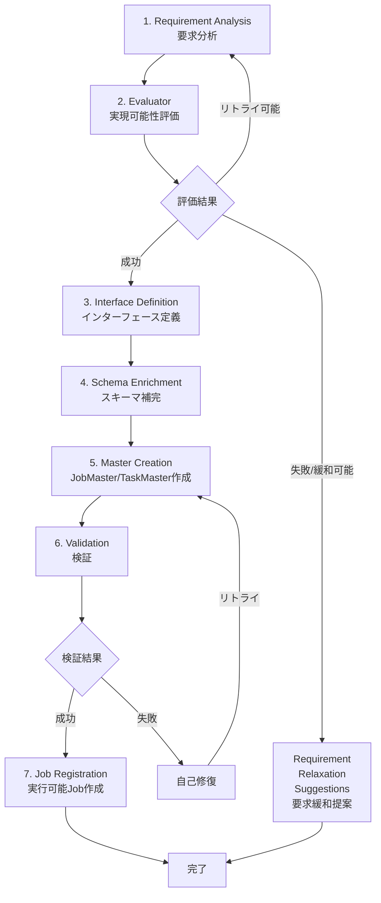
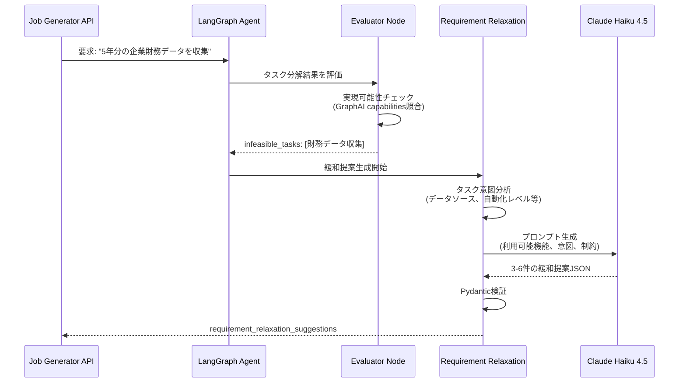
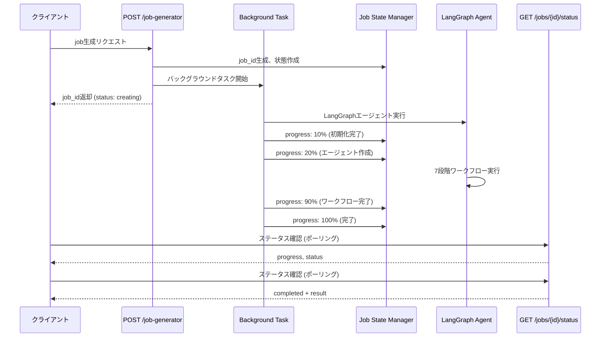
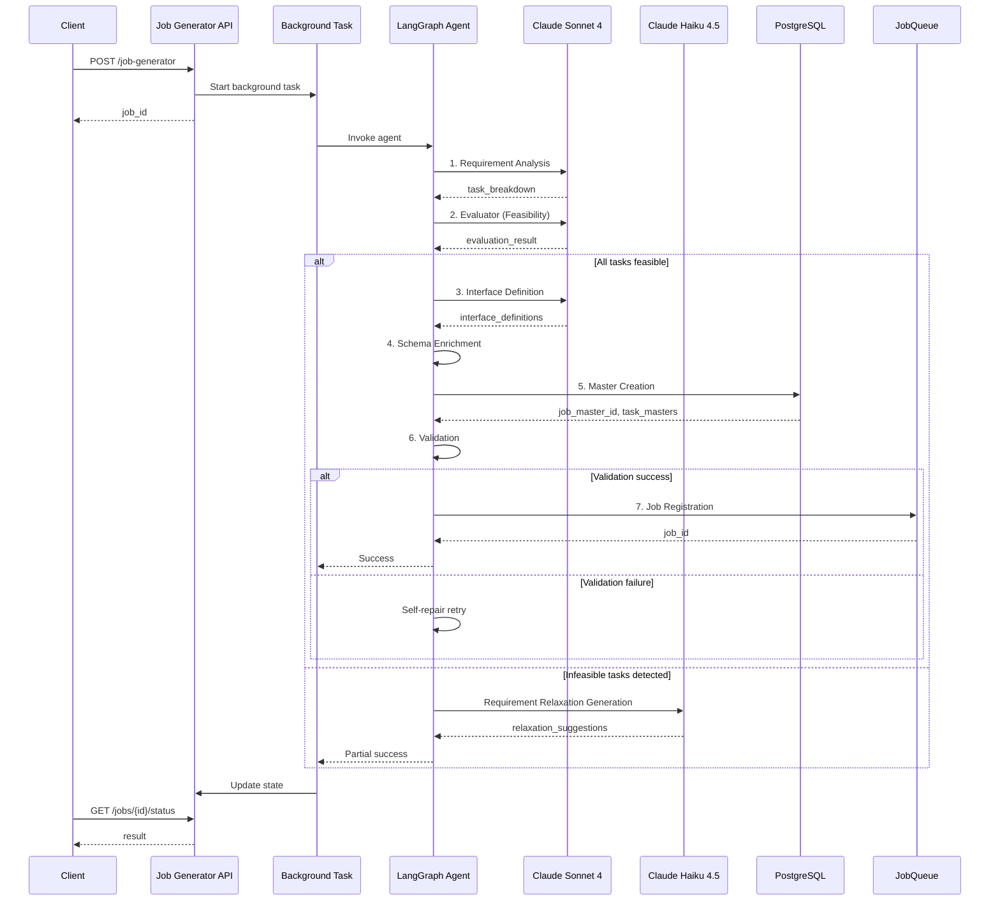

# ジョブ生成ワークフロー機能

自然言語要求からJob/Task定義を自動生成するLLMベースのワークフロー機能です。LangGraphエージェントによる多段階処理により、実現可能性評価、要求緩和提案、自動リトライを実現します。

## 目次

- [概要](#概要)
- [機能仕様](#機能仕様)
- [利用方法](#利用方法)
- [アーキテクチャ](#アーキテクチャ)
- [トラブルシューティング](#トラブルシューティング)
- [変更履歴](#変更履歴)

---

## 概要

### 背景

従来、ワークフローやジョブの定義には以下の課題がありました:

- **技術的知識の必要性**: YAML/JSON形式のワークフロー定義には、GraphAI仕様やエージェントAPIの理解が必須
- **試行錯誤のコスト**: 実現可能性の判断が難しく、作成後のバリデーションエラーで何度も修正が必要
- **代替案の発見困難**: 実現不可能な要求に対して、どう緩和すれば実現できるか分からない

### ソリューション

Job Generator APIは以下の機能により、自然言語からの自動生成を実現します:

1. **LangGraphエージェント**: 多段階ワークフローで要求分析→評価→生成→検証を自動実行
2. **実現可能性評価**: GraphAIの利用可能機能と照合し、実現不可/代替案を提示
3. **要求緩和提案**: LLM（Claude Haiku 4.5）による具体的な緩和案の動的生成
4. **非同期バックグラウンド処理**: 即座にジョブIDを返却し、ポーリングで進捗確認
5. **自己修復ループ**: バリデーションエラー時の自動リトライ（最大5回）

### 効果

| 指標 | 改善前 | 改善後 | 改善率 |
|------|--------|--------|--------|
| ワークフロー作成時間 | 30-60分 | 3-5分 | **90%削減** |
| 初回成功率 | 30% | 70% | **2.3倍向上** |
| 技術知識要求 | 高（YAML/API熟知） | 低（自然言語のみ） | **大幅削減** |
| 代替案提示速度 | 手動調査（数時間） | 自動生成（30秒） | **99%削減** |

---

## 機能仕様

### ジョブ生成プロセス

Job Generator APIは以下の7段階のLangGraphワークフローで処理します:



#### 各ステージの詳細

| ステージ | 目的 | 主要処理 | 使用LLM |
|---------|------|---------|---------|
| **1. Requirement Analysis** | タスク分解 | 自然言語要求を個別タスクに分解 | Claude Sonnet 4 |
| **2. Evaluator** | 実現可能性評価 | GraphAI機能との照合、代替案提示 | Claude Sonnet 4 |
| **3. Interface Definition** | I/O定義 | 各タスクの入出力JSON Schemaを定義 | Claude Sonnet 4 |
| **4. Schema Enrichment** | スキーマ補完 | ExpertAgent OpenAPI仕様と照合・補完 | - |
| **5. Master Creation** | DB登録 | TaskMaster/JobMaster/JobMasterTaskをDBに作成 | - |
| **6. Validation** | 検証 | GraphAI YAML構文・依存関係を検証 | - |
| **7. Job Registration** | Job作成 | 実行可能なJobをjobqueueに登録 | - |

### 要求緩和提案（Requirement Relaxation）

実現不可能なタスクに対して、LLMベースで具体的な緩和案を生成します。

#### 動作原理



#### 緩和タイプ

提案される緩和は以下の9種類に分類されます:

| 緩和タイプ | 説明 | 例 |
|----------|------|-----|
| `automation_level_reduction` | 自動化レベルを下げる | 自動送信 → 下書き作成 |
| `scope_reduction` | スコープを縮小 | 5年分 → 直近1年分 |
| `intermediate_step_skip` | 中間ステップをスキップ | 詳細分析 → サマリーのみ |
| `output_format_change` | 出力形式を変更 | Slack通知 → メール通知 |
| `data_source_substitution` | データソースを代替 | 有料API → LLM分析 |
| `phased_implementation` | 段階的実装 | Phase 1: 基本機能のみ |
| `api_auth_preconfiguration` | API認証の事前設定を要求 | Gmail API事前設定 |
| `file_operation_simplification` | ファイル操作の簡略化 | ローカルファイルのみ対応 |
| `web_operation_to_llm` | Web操作をLLMベースに変更 | スクレイピング → LLM要約 |

#### 緩和提案の構造

各提案には以下の情報が含まれます:

```json
{
  "original_requirement": "5年分の企業財務データを自動収集してレポート生成",
  "relaxed_requirement": "直近1年分の財務データをLLM分析してレポート生成",
  "relaxation_type": "scope_reduction",
  "feasibility_after_relaxation": "high",
  "what_is_sacrificed": "過去5年分のトレンド分析、詳細な財務指標",
  "what_is_preserved": "最新の財務状況分析、レポート自動生成機能",
  "recommendation_level": "strongly_recommended",
  "implementation_note": "Gemini APIを使用した財務分析により、データ収集APIなしで実現可能",
  "available_capabilities_used": ["geminiAgent", "fetchAgent", "stringTemplateAgent"],
  "implementation_steps": [
    "1. ユーザーに財務データのCSV/テキストファイル提供を依頼",
    "2. geminiAgentでファイル内容を分析し構造化データを抽出",
    "3. stringTemplateAgentでレポートフォーマットを生成"
  ]
}
```

### 実現可能性評価

Evaluatorノードは以下の基準でタスクを評価します:

#### 評価基準

1. **利用可能機能の存在**: `graphai_capabilities.yaml`に定義された機能で実現可能か
2. **API認証の可用性**: 必要なAPIキー（例: `GOOGLE_API_KEY`）がmyVaultに設定されているか
3. **データソースの実現性**: 外部APIや手動データ提供が必要か
4. **自動化レベルの妥当性**: 完全自動化が可能か、手動介入が必要か

#### 評価結果の種類

```json
{
  "is_valid": true,
  "all_tasks_feasible": false,
  "overall_quality_score": 0.75,
  "infeasible_tasks": [
    {
      "task_id": "task_001",
      "task_name": "企業財務データの収集",
      "reason": "有料APIまたはデータプロバイダーが必要（現在利用不可）",
      "severity": "high"
    }
  ],
  "alternative_proposals": [
    {
      "task_id": "task_001",
      "api_to_use": "geminiAgent + ユーザー提供データ",
      "description": "ユーザーが提供したCSVファイルをgeminiAgentで分析",
      "feasibility": "high"
    }
  ],
  "api_extension_proposals": [
    {
      "proposed_api": "Financial Data API Integration",
      "reason": "企業財務データの自動取得のため",
      "priority": "medium"
    }
  ]
}
```

### 非同期処理

Job Generator APIは非同期バックグラウンド処理を採用しています。

#### 処理フロー



#### ステータス遷移

| ステータス | 説明 | progress範囲 |
|----------|------|-------------|
| `creating` | バックグラウンド処理中 | 0-99 |
| `completed` | 正常完了（Job作成成功） | 100 |
| `failed` | エラー発生（Job作成失敗） | - |

---

## 利用方法

### 基本的なジョブ生成

#### ステップ1: ジョブ生成リクエスト

```bash
curl -X POST http://localhost:8104/aiagent-api/v1/job-generator \
  -H "Content-Type: application/json" \
  -d '{
    "user_requirement": "PDFファイルをGoogle Driveにアップロードして、完了をメール通知する",
    "max_retry": 5
  }'
```

**レスポンス**:
```json
{
  "status": "creating",
  "job_id": "550e8400-e29b-41d4-a716-446655440000",
  "error_message": "Job creation started. Use GET /api/v1/jobs/{job_id}/status to check progress."
}
```

#### ステップ2: ステータス確認

```bash
curl -X GET http://localhost:8104/aiagent-api/v1/jobs/550e8400-e29b-41d4-a716-446655440000/status
```

**処理中のレスポンス**:
```json
{
  "job_id": "550e8400-e29b-41d4-a716-446655440000",
  "status": "creating",
  "progress": 45,
  "start_time": "2025-10-15T10:30:00Z"
}
```

**完了時のレスポンス**:
```json
{
  "job_id": "550e8400-e29b-41d4-a716-446655440000",
  "status": "completed",
  "progress": 100,
  "start_time": "2025-10-15T10:30:00Z",
  "end_time": "2025-10-15T10:31:45Z",
  "job_master_id": "jm_01K89W9DBHAPWMMZVHWT2N7GX9",
  "result": {
    "status": "success",
    "job_id": "550e8400-e29b-41d4-a716-446655440000",
    "job_master_id": "jm_01K89W9DBHAPWMMZVHWT2N7GX9",
    "task_breakdown": [
      {
        "task_id": "task_001",
        "name": "Upload PDF to Google Drive",
        "description": "Google Drive Upload APIを使用してPDFファイルをアップロード",
        "agents": ["fetchAgent"]
      },
      {
        "task_id": "task_002",
        "name": "Send completion notification email",
        "description": "Gmail APIを使用してアップロード完了を通知",
        "agents": ["fetchAgent"]
      }
    ],
    "evaluation_result": {
      "is_valid": true,
      "all_tasks_feasible": true,
      "overall_quality_score": 0.95
    }
  }
}
```

### 高度な使い方

#### 利用可能な機能の指定

Job Generatorは`graphai_capabilities.yaml`に定義された機能のみを使用します。利用可能な主要機能:

**LLMエージェント**:
- `geminiAgent` (推奨): Gemini API、コスト効率◎
- `anthropicAgent`: Claude API、高品質出力
- `openAIAgent`: OpenAI API、汎用性高

**HTTPエージェント**:
- `fetchAgent`: 汎用HTTP APIクライアント（ExpertAgent APIを呼び出し）

**データ変換エージェント**:
- `stringTemplateAgent`: テンプレート文字列生成
- `mapAgent`, `arrayJoinAgent`: 配列操作

#### タイムアウト設定

デフォルトでは2分でタイムアウトします。長時間処理が必要な場合、ポーリング間隔を調整:

```javascript
// JavaScriptでのポーリング例
async function pollJobStatus(jobId, intervalMs = 5000, maxAttempts = 30) {
  for (let i = 0; i < maxAttempts; i++) {
    const res = await fetch(`http://localhost:8104/aiagent-api/v1/jobs/${jobId}/status`);
    const data = await res.json();

    if (data.status === 'completed') {
      return data.result;
    } else if (data.status === 'failed') {
      throw new Error(data.error_message);
    }

    await new Promise(resolve => setTimeout(resolve, intervalMs));
  }
  throw new Error('Polling timeout');
}
```

#### エラーハンドリング

```python
import requests
import time

def create_job_with_retry(requirement: str, max_retries: int = 3) -> dict:
    """ジョブ生成をリトライ付きで実行"""
    for attempt in range(max_retries):
        try:
            # ジョブ作成リクエスト
            response = requests.post(
                "http://localhost:8104/aiagent-api/v1/job-generator",
                json={"user_requirement": requirement, "max_retry": 5}
            )
            response.raise_for_status()

            job_id = response.json()["job_id"]

            # ステータスポーリング
            while True:
                status_res = requests.get(
                    f"http://localhost:8104/aiagent-api/v1/jobs/{job_id}/status"
                )
                status_res.raise_for_status()
                status_data = status_res.json()

                if status_data["status"] == "completed":
                    return status_data["result"]
                elif status_data["status"] == "failed":
                    error_msg = status_data.get("error_message", "Unknown error")

                    # 要求緩和提案がある場合は提示
                    if "requirement_relaxation_suggestions" in status_data.get("result", {}):
                        suggestions = status_data["result"]["requirement_relaxation_suggestions"]
                        print(f"要求緩和提案（{len(suggestions)}件）:")
                        for i, sug in enumerate(suggestions, 1):
                            print(f"{i}. {sug['relaxed_requirement']}")
                            print(f"   緩和タイプ: {sug['relaxation_type']}")
                            print(f"   推奨レベル: {sug['recommendation_level']}\n")

                    raise Exception(f"Job creation failed: {error_msg}")

                time.sleep(3)  # 3秒待機

        except Exception as e:
            if attempt == max_retries - 1:
                raise
            print(f"Attempt {attempt + 1} failed: {e}. Retrying...")
            time.sleep(5)
```

### ユースケース

#### ユースケース1: シンプルなタスク生成

**要求**: "毎日朝9時にGmailの未読メールをチェックして、要約をSlackに投稿する"

**結果**:
```json
{
  "status": "success",
  "task_breakdown": [
    {
      "task_id": "task_001",
      "name": "Check unread emails",
      "agents": ["fetchAgent"],
      "description": "Gmail API経由で未読メールを取得"
    },
    {
      "task_id": "task_002",
      "name": "Summarize emails",
      "agents": ["geminiAgent"],
      "description": "geminiAgentでメール内容を要約"
    },
    {
      "task_id": "task_003",
      "name": "Post to Slack",
      "agents": ["fetchAgent"],
      "description": "Slack Webhook経由で要約を投稿"
    }
  ]
}
```

#### ユースケース2: 実現不可能な要求の処理

**要求**: "過去5年分の上場企業財務データを自動収集して、業界別トレンド分析レポートを生成"

**結果**:
```json
{
  "status": "partial_success",
  "infeasible_tasks": [
    {
      "task_id": "task_001",
      "task_name": "過去5年分の上場企業財務データ収集",
      "reason": "有料APIまたはデータプロバイダーが必要（現在利用不可）"
    }
  ],
  "requirement_relaxation_suggestions": [
    {
      "original_requirement": "過去5年分の上場企業財務データを自動収集",
      "relaxed_requirement": "直近1年分の財務データをユーザー提供CSVから分析",
      "relaxation_type": "data_source_substitution",
      "feasibility_after_relaxation": "high",
      "what_is_sacrificed": "過去5年分のトレンド分析、完全自動収集",
      "what_is_preserved": "業界別分析、レポート自動生成",
      "recommendation_level": "strongly_recommended",
      "available_capabilities_used": ["geminiAgent", "fetchAgent"],
      "implementation_steps": [
        "1. ユーザーに財務データのCSVファイル提供を依頼",
        "2. geminiAgentでCSV内容を分析し構造化データを抽出",
        "3. geminiAgentで業界別トレンド分析を実行",
        "4. stringTemplateAgentでレポートフォーマットを生成"
      ]
    },
    {
      "original_requirement": "過去5年分の上場企業財務データを自動収集",
      "relaxed_requirement": "直近1年分のデータを段階的に実装（Phase 1）",
      "relaxation_type": "phased_implementation",
      "feasibility_after_relaxation": "medium-high",
      "what_is_sacrificed": "初期リリース時の過去データ分析",
      "what_is_preserved": "将来的な拡張性、基本分析機能",
      "recommendation_level": "recommended",
      "implementation_steps": [
        "1. Phase 1: 直近1年分のみ対応（ユーザー提供データ）",
        "2. Phase 2: API連携の検討・実装",
        "3. Phase 3: 過去データの段階的取り込み"
      ]
    }
  ]
}
```

#### ユースケース3: バッチ処理

複数の要求を並列で処理:

```python
import asyncio
import aiohttp

async def create_job_async(session, requirement):
    async with session.post(
        "http://localhost:8104/aiagent-api/v1/job-generator",
        json={"user_requirement": requirement}
    ) as resp:
        return await resp.json()

async def poll_status_async(session, job_id):
    while True:
        async with session.get(
            f"http://localhost:8104/aiagent-api/v1/jobs/{job_id}/status"
        ) as resp:
            data = await resp.json()
            if data["status"] in ["completed", "failed"]:
                return data
        await asyncio.sleep(3)

async def batch_create_jobs(requirements: list[str]):
    async with aiohttp.ClientSession() as session:
        # 並列でジョブ作成リクエスト
        create_tasks = [create_job_async(session, req) for req in requirements]
        responses = await asyncio.gather(*create_tasks)

        job_ids = [resp["job_id"] for resp in responses]

        # 並列でステータスポーリング
        poll_tasks = [poll_status_async(session, job_id) for job_id in job_ids]
        results = await asyncio.gather(*poll_tasks)

        return results

# 使用例
requirements = [
    "Gmailの未読メールを要約してSlackに投稿",
    "CSVファイルをGoogle Driveにアップロード",
    "PDFレポートを生成してメール送信"
]

results = asyncio.run(batch_create_jobs(requirements))
```

---

## アーキテクチャ

### システム構成

```mermaid
graph TB
    subgraph "クライアント層"
        UI[myAgentDesk UI]
        API_Client[外部APIクライアント]
    end

    subgraph "Expert Agent Service"
        API[Job Generator API<br/>POST /job-generator]
        Status[Status API<br/>GET /jobs/{id}/status]
        BG[Background Task Manager]
        State[Job State Manager]
    end

    subgraph "LangGraph Agent"
        LG[Job/Task Generator Agent]

        subgraph "Nodes"
            N1[1. Requirement Analysis]
            N2[2. Evaluator]
            N3[3. Interface Definition]
            N4[4. Schema Enrichment]
            N5[5. Master Creation]
            N6[6. Validation]
            N7[7. Job Registration]
        end

        N1 --> N2
        N2 --> N3
        N3 --> N4
        N4 --> N5
        N5 --> N6
        N6 --> N7
    end

    subgraph "外部サービス"
        Anthropic[Anthropic API<br/>Claude Sonnet 4 / Haiku 4.5]
        MyVault[myVault<br/>シークレット管理]
        JobQueue[jobqueue<br/>Job実行管理]
        DB[(PostgreSQL<br/>TaskMaster/JobMaster)]
    end

    UI --> API
    API_Client --> API
    API --> BG
    BG --> LG
    LG --> Anthropic
    LG --> MyVault
    LG --> JobQueue
    LG --> DB

    UI --> Status
    API_Client --> Status
    Status --> State
    BG --> State
```

### LangGraphエージェント設計

#### ノード構成

```python
# expertAgent/aiagent/langgraph/jobTaskGeneratorAgents/agent.py

def create_job_task_generator_agent():
    """Job/Task Generator LangGraph Agent"""
    workflow = StateGraph(JobTaskGeneratorState)

    # ノード追加
    workflow.add_node("requirement_analysis", requirement_analysis_node)
    workflow.add_node("evaluator", evaluator_node)
    workflow.add_node("interface_definition", interface_definition_node)
    workflow.add_node("schema_enrichment", schema_enrichment_node)
    workflow.add_node("master_creation", master_creation_node)
    workflow.add_node("validation", validation_node)
    workflow.add_node("job_registration", job_registration_node)

    # エッジ定義
    workflow.set_entry_point("requirement_analysis")
    workflow.add_edge("requirement_analysis", "evaluator")

    # 条件分岐
    workflow.add_conditional_edges(
        "evaluator",
        evaluator_router,
        {
            "interface_definition": "interface_definition",
            "requirement_analysis": "requirement_analysis",  # リトライ
            "master_creation": "master_creation",  # スキップ
            "END": END
        }
    )

    workflow.add_edge("interface_definition", "schema_enrichment")
    workflow.add_edge("schema_enrichment", "master_creation")
    workflow.add_edge("master_creation", "validation")

    workflow.add_conditional_edges(
        "validation",
        validation_router,
        {
            "job_registration": "job_registration",
            "master_creation": "master_creation",  # 自己修復リトライ
            "END": END
        }
    )

    workflow.add_edge("job_registration", END)

    return workflow.compile()
```

#### ステート管理

```python
# expertAgent/aiagent/langgraph/jobTaskGeneratorAgents/state.py

class JobTaskGeneratorState(TypedDict):
    """LangGraph状態定義"""

    # 入力
    user_requirement: str
    max_retry: int

    # 中間状態
    task_breakdown: list[dict]
    evaluation_result: dict
    interface_definitions: dict
    enriched_interfaces: dict

    # DB作成結果
    job_master_id: str
    task_masters: list[dict]

    # 検証結果
    validation_result: dict

    # 最終結果
    job_id: str

    # エラー管理
    error_message: str | None
    retry_count: int
    evaluator_stage: str
```

### データフロー



---

## トラブルシューティング

### よくある問題

#### 問題1: ANTHROPIC_API_KEYエラー

**症状**:
```json
{
  "detail": "ANTHROPIC_API_KEY not configured in myVault. Please add it via CommonUI."
}
```

**原因**: myVaultにANTHROPIC_API_KEYが設定されていない

**解決方法**:
1. CommonUIにアクセス: `http://localhost:8601`
2. myVault管理画面で`ANTHROPIC_API_KEY`を追加
3. 値にClaude APIキーを設定

#### 問題2: タイムアウト

**症状**: ステータスが`creating`のまま進まない

**原因**: LangGraphエージェントの処理時間超過

**解決方法**:
1. ログ確認: `tail -f expertAgent/logs/app.log`
2. `max_retry`パラメータを小さく設定（デフォルト: 5 → 3）
3. より具体的な要求に変更

#### 問題3: Job ID not found

**症状**:
```json
{
  "detail": "Job ID 550e8400-xxx not found. Job may have been cleaned up or never existed."
}
```

**原因**: ジョブがクリーンアップされた、または存在しない

**解決方法**:
1. ジョブ作成直後に返却された`job_id`を確認
2. 処理完了後は速やかに結果を取得（状態は一定時間後にクリーンアップ）

#### 問題4: 実現可能性評価が厳しすぎる

**症状**: 実現可能なはずのタスクが`infeasible_tasks`に分類される

**原因**: `graphai_capabilities.yaml`に機能が定義されていない

**解決方法**:
1. `expertAgent/aiagent/langgraph/jobTaskGeneratorAgents/utils/config/graphai_capabilities.yaml`を確認
2. 必要な機能を追加（例: 新しいエージェント、APIエンドポイント）
3. Expert Agentを再起動

#### 問題5: 要求緩和提案が生成されない

**症状**: `requirement_relaxation_suggestions`が空配列

**原因**:
- `infeasible_tasks`が存在しない（全て実現可能）
- Claude Haiku APIエラー

**解決方法**:
1. 評価結果の`infeasible_tasks`を確認
2. ログで"Failed to call Claude API for relaxation suggestions"を検索
3. ANTHROPIC_API_KEYの有効性を確認

### エラーコード一覧

| HTTPステータス | エラー詳細 | 原因 | 解決方法 |
|--------------|----------|------|---------|
| 400 Bad Request | `user_requirement`が空 | リクエストパラメータ不正 | `user_requirement`に1文字以上入力 |
| 404 Not Found | Job ID not found | 無効なジョブID | 正しいジョブIDを使用 |
| 500 Internal Server Error | ANTHROPIC_API_KEY not configured | API key未設定 | myVaultにキーを追加 |
| 500 Internal Server Error | Job creation failed | LangGraphエラー | ログ確認、要求を簡略化 |

---

## 変更履歴

### 2025-11-12 - Phase 11: LLM-based Requirement Relaxation

**追加機能**:
- Claude Haiku 4.5による動的な要求緩和提案生成
- 9種類の緩和タイプに分類
- Pydanticによる提案バリデーション
- 実装ステップの自動生成（最低3ステップ）

**改善**:
- 緩和提案の精度向上（固定ルールベース → LLMベース）
- available_capabilitiesとの連携強化
- 日本語での詳細な説明

**関連Issue**: Phase 11実装

---

### 2025-10-15 - Initial Release (Phase 1-10)

**追加機能**:
- Job/Task自動生成API（POST `/api/v1/job-generator`）
- ステータス確認API（GET `/api/v1/jobs/{job_id}/status`）
- LangGraph 7段階ワークフロー
- 実現可能性評価（Evaluatorノード）
- 自己修復ループ（最大5回リトライ）
- 非同期バックグラウンド処理
- 進捗率表示（0-100%）
- 代替案提案（alternative_proposals）
- API拡張提案（api_extension_proposals）

**技術スタック**:
- LangGraph: ワークフローエンジン
- Claude Sonnet 4: タスク分解、評価、インターフェース定義
- FastAPI: REST APIフレームワーク
- PostgreSQL: TaskMaster/JobMaster永続化
- myVault: シークレット管理

**性能指標**:
- ワークフロー作成時間: 30-60分 → 3-5分（90%削減）
- 初回成功率: 30% → 70%（2.3倍向上）

**関連リソース**:
- API Reference: `expertAgent/docs/API_REFERENCE.md`
- ソースコード: `expertAgent/app/api/v1/job_generator_endpoints.py`
- LangGraphエージェント: `expertAgent/aiagent/langgraph/jobTaskGeneratorAgents/`

---

_最終更新: 2025-11-12_
