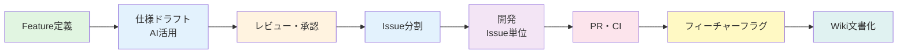

# 🚀 アジャイル開発ワークフロー

本チームは「**フィーチャー駆動開発**」と「**継続的インテグレーション（CI）**」を組み合わせたワークフローを採用します。詳細は[AGILE_WORKFLOW.md](../procedures/AGILE_WORKFLOW.md)を参照してください。

## 📋 開発フロー概要



## 🤖 開発フローとClaude Code Skillsマッピング

各開発フェーズで利用可能なClaude Code Skills（スキルを使用しないフェーズも含む）：

### 📍 セッション区分
- **フェーズ 1-5**: メインセッション（develop ブランチ） - Feature計画
- **フェーズ 6-14**: worktree セッション（issue ブランチ） - Issue開発
- **フェーズ 15-17**: メインセッション（develop ブランチ） - **Featureクローズ処理**

| フェーズ | 利用スキル | モデル | コマンド | セッション | 用途 |
|---------|-----------|--------|----------|-----------|------|
| **1. Feature定義** | 要件定義 | Opus | `/requirements` | メイン | ユーザーストーリー、受入条件作成 |
| **2. 仕様ドラフト** | 設計方針 | Opus | `/design` | メイン | アーキテクチャ設計、技術選定 |
| **3. レビュー・承認** | アーキテクチャレビュー | Opus | `/review-arch` | メイン | 設計レビュー、リスク評価 |
| **4. Issue分割** | Issue分割 | Opus | `/issue-split` | メイン | FeatureをIssueに分割 |
| **5. 作業計画** | 作業計画 | Opus | `/plan` | メイン | Issue単位の詳細作業計画 |
| **6. ブランチ作成** | - | Sonnet | - | **→ worktree** | git worktreeでissueブランチ作成 |
| **7. 開発（実装）** | - | Sonnet | - | worktree | コード実装（手動作業） |
| **8. テスト作成** | - | Sonnet | - | worktree | 単体・結合テスト作成（手動作業） |
| **9. リファクタリング** | リファクタリング | Sonnet | `/refactor` | worktree | コード品質改善（必要時） |
| **10. 進捗管理** | 進捗報告 | Sonnet | `/progress` | worktree | 進捗サマリ、ブロッカー報告 |
| **11. PR作成** | - | Sonnet | - | worktree | Pull Request作成（手動作業） |
| **12. コードレビュー** | アーキテクチャレビュー | Opus | `/review-arch` | worktree | コードレビュー支援（必要時） |
| **13. CI/CD実行** | - | Sonnet | - | worktree | 自動テスト・ビルド（自動処理） |
| **14. マージ** | - | Sonnet | - | worktree | developブランチへマージ（手動作業） |
| 🏁 **Featureクローズ処理** ||||| |
| **15. フィーチャーフラグ設定** | - | Sonnet | - | **← メイン** | フラグ設定（手動作業） |
| **16. Wiki文書化** | - | Sonnet | - | メイン推奨 | 仕様確定・文書化（両セッション可） |
| **17. リリース準備** | - | Sonnet | - | メイン | リリースノート作成等（手動作業） |

### スキル実行フローの例

```mermaid
graph TD
    Start[新機能要求] --> Req["要件定義<br/>(/requirements - Opus)"]
    Req --> Design["設計方針<br/>(/design - Opus)"]
    Design --> Review1["設計レビュー<br/>(/review-arch - Opus)"]
    Review1 -->|承認| IssueSplit["Issue分割<br/>(/issue-split - Opus)"]
    Review1 -->|要修正| Design
    IssueSplit --> Plan["作業計画<br/>(/plan - Opus)<br/>Issue単位"]

    Plan --> SessionSwitch["🔄 セッション切替<br/>worktree作成"]
    SessionSwitch --> Branch["ブランチ作成<br/>(手動 - Sonnet)"]

    Branch --> Dev["開発実装<br/>(手動 - Sonnet)"]
    Dev --> Test["テスト作成<br/>(手動 - Sonnet)"]
    Test --> Refactor{"リファクタ<br/>必要?"}
    Refactor -->|Yes| RefactorExec["リファクタリング<br/>(/refactor - Sonnet)"]
    Refactor -->|No| Progress["進捗報告<br/>(/progress - Sonnet)"]
    RefactorExec --> Progress
    Progress --> Done{完了?}
    Done -->|No| Dev
    Done -->|Yes| PR["PR作成<br/>(手動 - Sonnet)"]
    PR --> Review2["コードレビュー<br/>(/review-arch - Opus)"]
    Review2 --> CI["CI/CD<br/>(自動 - Sonnet)"]
    CI --> Merge["マージ<br/>(手動 - Sonnet)"]

    Merge --> SessionReturn["🔄 セッション戻し<br/>メインに戻る"]
    SessionReturn --> Flag["フラグ設定<br/>(手動 - Sonnet)"]
    Flag --> Wiki["Wiki文書化<br/>(手動 - Sonnet)"]
    Wiki --> End[リリース]

    style Req fill:#e3f2fd
    style Design fill:#e3f2fd
    style Review1 fill:#e3f2fd
    style IssueSplit fill:#e3f2fd
    style Plan fill:#e3f2fd
    style RefactorExec fill:#fff3e0
    style Progress fill:#fff3e0
    style Review2 fill:#e3f2fd
    style SessionSwitch fill:#ffccbc
    style SessionReturn fill:#ffccbc
    style Branch fill:#e8f5e9
    style Dev fill:#e8f5e9
    style Test fill:#e8f5e9
    style PR fill:#e8f5e9
    style CI fill:#fce4ec
    style Merge fill:#e8f5e9
    style Flag fill:#fff9c4
    style Wiki fill:#e0f2f1
```



## 🎯 Feature（フィーチャー）管理

### Feature チケットの要件

Featureは「**ユーザーに価値を届ける単位**」として、以下を必須記載：

1. **ユーザー価値（WHAT & WHY）**
   ```
   As a [ユーザー種別]
   I want to [達成したいこと]
   So that [期待される価値]
   ```

2. **仕様・設計ドラフト（HOW）**
   - AI（LLM）を活用して要件定義と設計方針のドラフトを作成
   - レビューを経て変更されることを前提とする

### レビュープロセス（リファイメント）

- シニアエンジニア/アーキテクトによるレビュー
- 技術的最適性と既存アーキテクチャとの整合性確認
- 承認後「**Ready**」状態へ遷移

## 📝 Issue管理

### Issue分割の原則

- **縦割り（Vertical Slice）**: UI + API等の機能単位で分割
- **横割り禁止**: フェーズ（要件定義→設計→実装）での分割は行わない
- **並列作業**: 依存関係を明確化し、並列実行可能な作業を識別

### Issue記載内容

```markdown
## 依存関係
- [ ] #123 先行Issueの完了が必要

## 作業計画
- [ ] 実装タスク
- [ ] テストタスク
- [ ] ドキュメント更新タスク
```

## 🌿 ブランチ・PR戦略

### ブランチルール

- **作成元**: 常に最新の`develop`ブランチから作成
- **単位**: **Issue単位**でブランチ作成（Feature単位は禁止）
- **命名**: `issue/[Issue番号]-[内容]` (例: `issue/123-add-profile-ui`)

### PR戦略

- **作成タイミング**: Issue完了後即座に作成
- **ターゲット**: 常に`develop`ブランチ
- **方針**: 小さく頻繁に（Small & Frequent）
- **マージ条件**:
  - CIテスト全パス
  - 1名以上のレビュー承認

## 🎛️ フィーチャーフラグ管理

### 基本原則

- `develop`ブランチは常にデプロイ可能状態を維持
- 未完成機能はフィーチャーフラグでデフォルトOFF制御
- Issue単位の高速マージを実現

### アーキテクチャ変更の導入

- ラッパーやエントリーポイントにフラグを仕込む
- 機能本体のコードを先行マージ（動作しない状態で）
- 巨大な変更は小さく分割して段階的に導入

### クリーンアップ

- 機能安定後、フラグ削除用のクリーンアップIssueを作成
- 不要なフラグを定期的に削除

## 📚 ドキュメント（ナレッジ）管理

### ハイブリッド・アプローチ

| 種別 | 配置場所 | 内容 | 用途 |
|------|---------|------|------|
| **一時的情報** | GitHub Issue | ドラフト、議論 | 開発中の速度優先 |
| **永続的情報** | GitHub Wiki | 確定仕様、設計図 | 未来の資産化 |

### Wiki運用ルール

- リポジトリ: `.wiki.git` (別管理)
- 編集方法: ローカルclone + VS Code（Web UI非推奨）
- 構成: `_Sidebar.md`でナビゲーション整備

### Feature完了時の必須タスク

1. Featureチケットのドラフトをレビュー
2. 最新決定を反映し清書
3. GitHub Wikiへ転記または新規作成
4. Wiki転記完了後にFeatureチケットをClose

---

[← CLAUDE.mdに戻る](../../CLAUDE.md) | [次: Claude Code Skills →](./02-claude-skills.md)