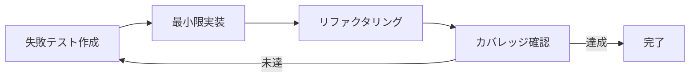

# 🤖 Claude Code Skills

AI開発支援のため、以下のスキルが利用可能です。各スキルは適切なモデル（Opus/Sonnet）を選択し、タスクに最適化されています。

## 📦 利用可能なスキル（10種類）

| スキル名 | モデル | 用途 | 起動方法 |
|---------|--------|------|---------|
| **要件定義** | Opus | ユーザーストーリー・受入条件作成 | `/requirements` または「要件定義を作成」 |
| **UIモックアップ** 🆕 | Sonnet | SvelteKitで4パターンのUI生成 | `/ui-mockup` または「UIモックアップを作成」 |
| **設計方針** | Opus | アーキテクチャ設計・技術選定 | `/design` または「設計方針を作成」 |
| **Issue分割** | Opus | FeatureをIssueに分割・依存関係整理 | `/issue-split` または「Issueに分割」 |
| **作業計画** | Opus | Issue単位の具体的な作業計画立案 | `/plan` または「作業計画を立案」 |
| **TDD実装** 🆕 | Sonnet | テスト駆動開発による品質実装 | `/tdd-impl` または「TDD実装を実行」 |
| **受入テスト** 🆕 | Opus | 自動受入テスト実行・品質保証 | `/acceptance-test` または「受入テストを実行」 |
| **アーキテクチャレビュー** | Opus | 設計レビュー・リスク評価 | `/review-arch` または「アーキテクチャをレビュー」 |
| **進捗報告** | Sonnet | 進捗サマリ・ブロッカー報告 | `/progress` または「進捗を報告」 |
| **リファクタリング** | Sonnet | コード品質改善（Codex CLI連携） | `/refactor` または「リファクタリングを実施」 |

## 🎯 スキル使用例

### Feature全体の流れ
```
1. User: 「ユーザー管理機能の要件定義を作成してください」
   Claude: /requirements を実行...
   → ユーザーストーリー、受入条件、技術要件を生成

2. User: 「設計方針を作成してください」
   Claude: /design を実行...
   → アーキテクチャ設計、技術選定を提案

3. User: 「この設計をレビューしてください」
   Claude: /review-arch を実行...
   → レビューコメント、リスク評価を提供

4. User: 「FeatureをIssueに分割してください」
   Claude: /issue-split を実行...
   → 複数のIssueと依存関係マトリクスを生成

5. User: 「Issue #123の作業計画を立案してください」
   Claude: /plan を実行...
   → Issue単位の詳細タスク、スケジュールを生成
```

### Issue開発中
```
User: 「TDD実装でユーザー認証機能を開発してください」
Claude: /tdd-impl を実行...
→ Red-Green-Refactorサイクルで実装、カバレッジ90%達成

User: 「受入テストを実行してください」
Claude: /acceptance-test を実行...
→ Issue要件に基づく自動テスト実行、合否判定とフィードバック

User: 「進捗を報告してください」
Claude: /progress を実行...
→ 進捗サマリ、ブロッカー、次のステップを報告

User: 「このコードをリファクタリングしてください」
Claude: /refactor を実行...
→ コード品質改善、設計パターン適用を実施
```

## 🆕 新スキルの詳細

### TDD実装スキル (`/tdd-impl`)

**特徴**:
- Red-Green-Refactorサイクルの自動実行
- テストファーストによる品質作り込み
- カバレッジ90%以上の自動達成
- 実装とテストの同時生成

**実行フロー**:


### 受入テストスキル (`/acceptance-test`)

**特徴**:
- Issue要件からのテストケース自動生成
- PlaywrightによるE2Eテスト実行
- スクリーンショット/動画記録
- 詳細なフィードバックレポート

**テスト種別**:
- 機能テスト（ユーザーストーリー検証）
- UIテスト（画面遷移・操作性）
- APIテスト（エンドポイント検証）
- パフォーマンステスト（応答時間測定）

## 🔧 スキルの内部動作

各スキルは`Task`ツールを使用してサブエージェントとして実行されます：

1. **要件定義・設計・Issue分割・作業計画・レビュー・受入テスト**: 複雑なタスクのためOpusモデル使用
2. **TDD実装・進捗報告・リファクタリング**: 定型タスクのためSonnetモデル使用
3. **リファクタリング**: MCP経由でCodex CLIを活用し、実際のコード変更を実行
4. **受入テスト**: Playwrightと連携してGUIテストを自動実行

## 📝 カスタマイズ

スキル定義は`.claude/skills/`ディレクトリに配置されており、必要に応じてカスタマイズ可能です。

### カスタムスキルの作成方法

1. `.claude/skills/` にMarkdownファイルを作成
2. スキル定義を記述
3. Claude Codeを再起動して認識させる

### スキル定義の構造

```yaml
---
name: skill-name
model: opus # または sonnet
trigger: /command-name
---

# スキル内容
実行する処理の詳細...
```

---

[← 開発ワークフロー](./01-development-workflow.md) | [CLAUDE.md](../../CLAUDE.md) | [次: ブランチ戦略 →](./03-branch-strategy.md)