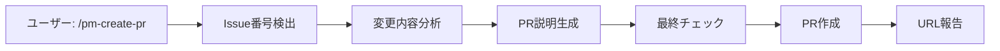
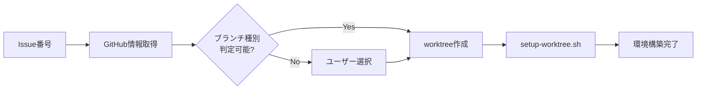
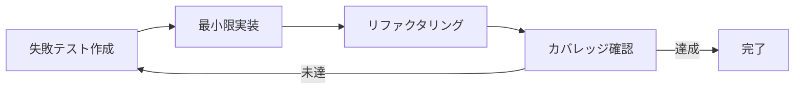

# 🤖 Claude Code Skills

AI開発支援のため、以下のスキルが利用可能です。各スキルは適切なモデル（Opus/Sonnet）を選択し、タスクに最適化されています。

**🔥 スラッシュコマンド対応**: 主要スキルは `.claude/commands/` に配置され、`/skill-name` 形式で直接呼び出し可能です。

## 📦 利用可能なスキル（15種類）

| スキル名 | モデル | 用途 | 起動方法 |
|---------|--------|------|---------|
| **要件定義** | Opus | ユーザーストーリー・受入条件作成 | `/requirements` または「要件定義を作成」 |
| **UIモックアップ** 🆕 | Sonnet | SvelteKitで4パターンのUI生成 | `/ui-mockup` または「UIモックアップを作成」 |
| **設計方針** | Opus | アーキテクチャ設計・技術選定 | `/design` または「設計方針を作成」 |
| **Issue分割** | Opus | FeatureをIssueに分割・依存関係整理 | `/issue-split` または「Issueに分割」 |
| **Issue登録** 🆕✅ | Sonnet | GitHub Issueに一括登録・親子関連付け | **`/issue-create`** または「Issue #152から子Issueを作成」 |
| **作業計画** | Opus | Issue単位の具体的な作業計画立案 | `/work-plan` または「作業計画を立案」 |
| **Worktree自動セットアップ** 🆕✅ | Sonnet | Issue番号から自動でworktree環境構築 | **`/worktree-setup`** または「Issue #123のworktree作成」 |
| **PM自動開発** 🆕🔥✅ | Opus | Issue開発を自律実行（TDD→テスト→報告） | **`/pm-auto-dev`** または「Issue #123を開発」 |
| **PM不具合修正** 🆕🔥✅ | Opus | 不具合の調査・対策案提示・修正を完全自動化 | **`/pm-bug-fix`** または「データベースエラーを修正」 |
| **TDD実装** 🆕✅ | Sonnet | テスト駆動開発による品質実装 | **`/tdd-impl`** または「TDD実装を実行」 |
| **受入テスト** 🆕✅ | Opus | 自動受入テスト実行・品質保証 | **`/acceptance-test`** または「受入テストを実行」 |
| **アーキテクチャレビュー** | Opus | 設計レビュー・リスク評価 | `/review-arch` または「アーキテクチャをレビュー」 |
| **進捗報告** | Sonnet | 進捗サマリ・ブロッカー報告 | `/progress` または「進捗を報告」 |
| **リファクタリング** | Sonnet | コード品質改善（Codex CLI連携） | `/refactor` または「リファクタリングを実施」 |
| **PR作成** 🆕✅ | Sonnet | Pull Request自動作成 | **`/pm-create-pr`** または「PRを作成」 |
| **ドキュメント登録** 🆕✅ | Sonnet | 完成機能をカテゴリ別ドキュメントに統合 | **`/doc-register`** または「Issue #152をドキュメント化」 |

**凡例**: ✅ = スラッシュコマンド対応済み（`.claude/commands/` に配置）

## 🎯 スキル使用例

### Feature全体の流れ
```
1. User: 「ユーザー管理機能の要件定義を作成してください」
   Claude: /requirements を実行...
   → ユーザーストーリー、受入条件、技術要件を生成

2. User: 「設計方針を作成してください」
   Claude: /design を実行...
   → アーキテクチャ設計、技術選定を提案

3. User: 「この設計をレビューしてください」
   Claude: /review-arch を実行...
   → レビューコメント、リスク評価を提供

4. User: 「FeatureをIssueに分割してください」
   Claude: /issue-split を実行...
   → Issue分割計画書（issue-split.md）を作成

5. User: 「Issue #152から子Issueを作成してください」
   Claude: /issue-create を実行...
   → GitHub Issueを一括作成、親子関連付け

6. User: 「Issue #201の作業計画を立案してください」
   Claude: /work-plan を実行...
   → Issue単位の詳細タスク、スケジュールを生成

7. User: 「Issue #201のworktreeを作成してください」
   Claude: /worktree-setup を実行...
   → Issueラベルからブランチ種別判定、worktree自動作成
```

### Issue開発（自動実行 🔥）
```
User: 「Issue #145を開発してください」
Claude: /pm-auto-dev 145 を実行...
→ TDD実装 → 受入テスト → リファクタ → 進捗報告を自律実行
→ イテレーション最大3回（テスト不合格時は自動再実装）
→ 完了後、ユーザーに動作確認を依頼

User: [動作確認OK]
User: 「PRを作成してください」
Claude: /pm-create-pr を実行...
→ Issue情報から自動でタイトル・説明生成、PR作成

User: [動作確認で不具合発見]
User: 「データベース接続エラーが発生しています」
Claude: /pm-bug-fix "データベース接続エラー" を実行...
→ Phase 1: 不具合調査（根本原因特定）
→ Phase 2: 対策案提示（3案を優先度順に提示）
→ User: 対策案1+2を実施
→ Phase 3: 作業計画立案
→ Phase 4: TDD修正実施
→ Phase 5: 受入テスト
→ Phase 6: 進捗報告
→ 不具合修正完了！
```

### Issue開発（手動実行）
```
User: 「TDD実装でユーザー認証機能を開発してください」
Claude: /tdd-impl を実行...
→ Red-Green-Refactorサイクルで実装、カバレッジ90%達成

User: 「受入テストを実行してください」
Claude: /acceptance-test を実行...
→ Issue要件に基づく自動テスト実行、合否判定とフィードバック

User: 「進捗を報告してください」
Claude: /progress を実行...
→ 進捗サマリ、ブロッカー、次のステップを報告

User: 「このコードをリファクタリングしてください」
Claude: /refactor を実行...
→ コード品質改善、設計パターン適用を実施
```

## 🆕 新スキルの詳細

### PM自動開発スキル (`/pm-auto-dev`) 🔥

**最重要スキル**: Issue開発を**完全自動化**するプロジェクトマネージャースキル

**特徴**:
- TDD実装 → 受入テスト → リファクタリング → 進捗報告を**自律実行**
- テスト不合格時は最大3回まで**自動再実装**（イテレーション制御）
- ユーザーは `/pm-auto-dev [Issue番号]` 1回呼ぶだけ
- 完了後は動作確認のみでOK

**実行モード**:
- `full`: 新規開発モード（デフォルト）
- `fix`: 是正モード（動作確認で不具合発見時）

**実行フロー**:
```mermaid
graph TD
    Start[ユーザー: /pm-auto-dev 145] --> PM[PMエージェント起動]
    PM --> TDD[TDD実装エージェント]
    TDD --> Test[受入テストエージェント]
    Test --> Pass{合格?}
    Pass -->|No| Iter{イテレーション<br/>上限?}
    Iter -->|未満| TDD
    Iter -->|到達| Escalate[エスカレーション]
    Pass -->|Yes| Refactor{リファクタ<br/>必要?}
    Refactor -->|Yes| RefactorAgent[リファクタエージェント]
    Refactor -->|No| Progress[進捗報告エージェント]
    RefactorAgent --> Progress
    Progress --> UserCheck[ユーザー動作確認]
    UserCheck -->|OK| PR[/pm-create-pr]
    UserCheck -->|NG| Fix[/pm-auto-dev --mode=fix]
    Fix --> TDD
```

**パラメータ**:
- `issue_number`: 開発対象のIssue番号（必須）
- `mode`: `full` or `fix`（デフォルト: full）
- `max_iterations`: 最大イテレーション回数（デフォルト: 3）
- `skip_refactor`: リファクタリングをスキップ（デフォルト: false）

**使用例**:
```bash
# 基本的な使い方
/pm-auto-dev 145

# 是正モード
/pm-auto-dev 145 --mode=fix

# イテレーション回数変更
/pm-auto-dev 145 --max-iterations=5
```

### PR作成スキル (`/pm-create-pr`)

**特徴**:
- Issue情報から**自動でPRタイトル・説明生成**
- 変更内容の自動分析
- テスト結果の自動埋め込み
- Conventional Commits形式に準拠

**実行条件**:
- `/pm-auto-dev` 完了後
- ユーザーの動作確認OK後
- `pre-push-check-all.sh` 全パス

**実行フロー**:


**パラメータ**:
- `issue_number`: Issue番号（省略時は自動検出）
- `base_branch`: マージ先（デフォルト: develop）
- `draft`: Draft PRとして作成（デフォルト: false）
- `auto_assign`: 自分を自動アサイン（デフォルト: true）

### Worktree自動セットアップスキル (`/worktree-setup`)

**特徴**:
- GitHub Issue番号から自動でworktree環境構築
- Issueラベル/内容からブランチ種別を自動判定
- ポート番号の自動割り当て（衝突回避）
- myVault/langfuse共有モード（デフォルト）

**ブランチ種別判定**:
```
優先度1: ラベル（type: feature, type: fix 等）
優先度2: タイトル/本文のキーワード解析
優先度3: ユーザーへの対話的な選択
```

**実行フロー**:


**対応ブランチ種別**:
- `feature`: 新機能追加
- `fix`: バグ修正
- `refactor`: リファクタリング
- `test`: テスト追加
- `vibe`: UI/UX改善
- `hotfix`: 緊急修正

### TDD実装スキル (`/tdd-impl`)

**特徴**:
- Red-Green-Refactorサイクルの自動実行
- テストファーストによる品質作り込み
- カバレッジ90%以上の自動達成
- 実装とテストの同時生成

**実行フロー**:


### 受入テストスキル (`/acceptance-test`)

**特徴**:
- Issue要件からのテストケース自動生成
- PlaywrightによるE2Eテスト実行
- スクリーンショット/動画記録
- 詳細なフィードバックレポート

**テスト種別**:
- 機能テスト（ユーザーストーリー検証）
- UIテスト（画面遷移・操作性）
- APIテスト（エンドポイント検証）
- パフォーマンステスト（応答時間測定）

## 🔧 スキルの内部動作

各スキルは`Task`ツールを使用してサブエージェントとして実行されます：

1. **要件定義・設計・Issue分割・作業計画・レビュー・受入テスト**: 複雑なタスクのためOpusモデル使用
2. **TDD実装・進捗報告・リファクタリング**: 定型タスクのためSonnetモデル使用
3. **リファクタリング**: MCP経由でCodex CLIを活用し、実際のコード変更を実行
4. **受入テスト**: Playwrightと連携してGUIテストを自動実行

## 📝 カスタマイズ

スラッシュコマンド定義は `.claude/commands/` ディレクトリに配置されており、必要に応じてカスタマイズ可能です。

### スラッシュコマンドについて

| 項目 | 詳細 |
|------|------|
| **配置場所** | `.claude/commands/` |
| **呼び出し方法** | `/command-name` で直接呼び出し |
| **用途** | ユーザーが明示的に実行する開発タスク |

### カスタムスラッシュコマンドの作成方法

1. `.claude/commands/` にMarkdownファイルを作成（例: `my-command.md`）
2. コマンド定義を記述（下記の構造を参照）
3. `/my-command` で直接実行可能

### スラッシュコマンド定義の構造

```markdown
---
model: opus | sonnet
description: "スキルの簡潔な説明（1行）"
phase: "開発フェーズ番号と名称"
session: "main" | "worktree" | "any"
---

# コマンド名

## 概要
このスラッシュコマンドの目的と概要を記述

## 使用方法
- `/command-name [パラメータ]`
- 「〜してください」（自然言語でも可）

## 実行内容
具体的な処理内容を記述...
```

**フロントマター項目**:
- `model`: 使用するClaudeモデル（opus/sonnet）
- `description`: スキルの簡潔な説明（1行）
- `phase`: 開発ワークフローのフェーズ番号と名称
- `session`: 実行するセッション（main/worktree/any）

---

## `/doc-register` - 完成機能のドキュメント登録 🆕✅

### 概要
Issue/Feature完了時に、成果物をカテゴリ別の既存ドキュメントに追記・統合します。

### 用途
- Feature完了後の仕様書作成
- アーキテクチャ変更のドキュメント化
- 運用手順書の更新
- ガイドライン・規約の追加

### 基本構文
```bash
/doc-register <Issue番号> [オプション]
```

### オプション

| オプション | 説明 | デフォルト |
|-----------|------|-----------|
| `--scope <global\|{service}>` | スコープ（global=ルートdocs/, service=マイクロサービス内） | 自動判定 |
| `--category <rule\|arch\|spec\|ops>` | カテゴリ | 自動判定 |
| `--target <ファイル名>` | 追記先ドキュメント | 自動判定 |
| `--section <セクション名>` | 追記先セクション | 自動判定 |
| `--draft` | ドラフトモード（コミットしない） | false |
| `--no-child` | 子Issue自動処理スキップ | false |

### 使用例

#### 例1: 自動判定で登録
```bash
/doc-register 152
# → expertAgent/docs/spec/MLOps-Features.md に追記
```

#### 例2: プロジェクト全体のアーキテクチャに追記
```bash
/doc-register 152 --scope global --category arch
# → docs/arch/System-Overview.md に追記
```

#### 例3: マイクロサービス固有のドキュメントに追記
```bash
/doc-register 169 --scope expertAgent --category arch
# → expertAgent/docs/arch/LangGraph-Design.md に追記
```

#### 例4: myVault固有の仕様に追記
```bash
/doc-register 200 --scope myVault --category spec
# → myVault/docs/spec/Secret-Management.md に追記
```

### 配置ルール

| スコープ | 配置先 | 用途 | 例 |
|---------|-------|------|-----|
| global | `docs/rule/` | プロジェクト全体のガイドライン | 開発フロー、Git戦略 |
| global | `docs/arch/` | プロジェクト全体のアーキテクチャ | システム構成図、DB設計 |
| global | `docs/spec/` | プロジェクト横断機能 | ユーザー管理、決済 |
| global | `docs/ops/` | プロジェクト全体の運用 | リリース手順、監視 |
| {service} | `{service}/docs/arch/` | マイクロサービス固有設計 | LangGraph設計 |
| {service} | `{service}/docs/spec/` | マイクロサービス固有機能 | Job Generator |
| {service} | `{service}/docs/ops/` | マイクロサービス固有運用 | デプロイ手順 |

### 自動判定ロジック

- **スコープ判定**:
  - dev-reportsのプロジェクト言及をカウント
  - ラベル `project:expertAgent` を検出
  - タイトルからプロジェクト名を抽出
  - デフォルト: expertAgent

- **カテゴリ判定**:
  - ラベル: `architecture` → `arch`
  - ラベル: `feature` → `spec`
  - ラベル: `ops` → `ops`
  - タイトルキーワードから判定

- **ターゲットファイル判定**:
  - 既存ドキュメントとの類似度計算
  - 類似度 > 0.6 → 既存ファイルに追記
  - 類似度 < 0.6 → 新規ファイル作成

### ドキュメント構造

生成されるセクションの構造:

```markdown
## Issue #{number}: {title}

**ステータス**: ✅ 完了
**完了日**: {closedAt}
**担当者**: {assignees}
**関連PR**: #{pr_number}

### 📋 概要
### 🎯 ユーザーストーリー
### ✅ 受入基準
### 🏗️ アーキテクチャ
### 🔧 実装詳細
### 🧪 テスト結果
### 📦 関連子Issue（親Issueの場合）
```

### 関連コマンド
- `/issue-create`: Issue一括作成
- `/pm-auto-dev`: Issue自動開発
- `/pm-create-pr`: PR自動作成

### 詳細仕様
→ [ドキュメント管理ルール](./07-documentation-rules.md)

---

[← 開発ワークフロー](./01-development-workflow.md) | [CLAUDE.md](../../CLAUDE.md) | [次: ブランチ戦略 →](./03-branch-strategy.md)