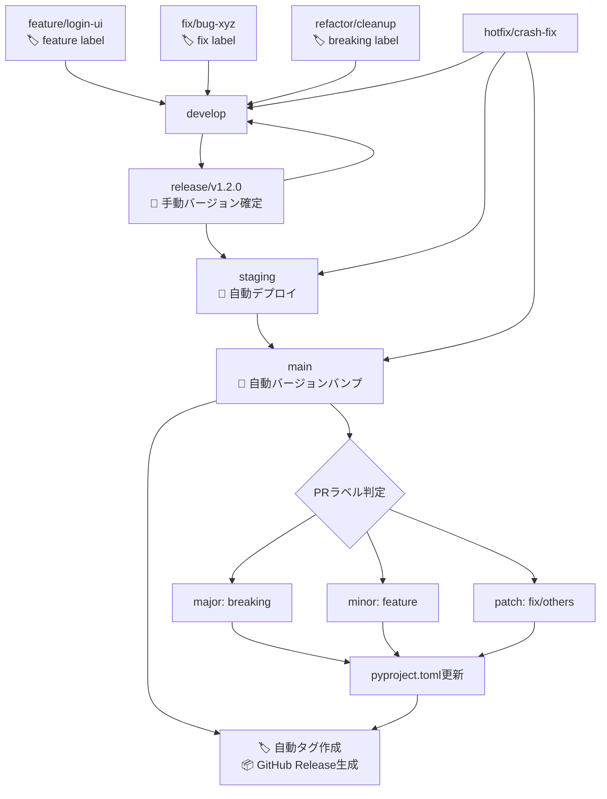

# 🌿 ブランチ構成とマージ戦略

## 🧱 基本ブランチ

| ブランチ名  | 目的                   | 運用ルール                                                                             |
| ----------- | ---------------------- | -------------------------------------------------------------------------------------- |
| `main`      | 本番環境のコードベース | 保護ブランチ。タグ運用（例: `v1.2.0`）。署名付きアプリや公開ビルドに使用。直push禁止。 |
| `develop`   | 開発統合用             | 各 `feature/*` ブランチの統合先。単体・結合テストの対象。直接リリースには使用しない。  |
| `staging`   | UAT・実機確認用        | `release/*` からマージ。自動アップデート対象。                                         |
| `release/*` | リリース準備ブランチ   | `develop` から分岐。最終調整やQA、リリース検証を行う。                                 |

## ✍️ 作業ブランチ（トピックブランチ）

| ブランチ名   | 用途                   | 命名例                     |
| ------------ | ---------------------- | -------------------------- |
| `feature/*`  | 新機能の追加           | `feature/markdown-preview` |
| `fix/*`      | バグ修正               | `fix/window-size-restore`  |
| `refactor/*` | コード構造の改善       | `refactor/ipc-handler`     |
| `test/*`     | 技術検証・PoC          | `test/ipc-benchmark`       |
| `vibe/*`     | AI開発支援・実験的機能 | `vibe/ai-code-generation`  |
| `hotfix/*`   | 本番環境の緊急修正     | `hotfix/urgent-crash-fix`  |

## 📌 ブランチ間マージの原則

当プロジェクトでは、**異なるブランチ間のマージは必ず Pull Request（PR） を通じて行うことを厳守とします。**

### ✅ 原則ルール（バージョン管理自動化対応）

| 作業元ブランチ | マージ先ブランチ             | 備考                                     | 自動化対応                                     |
| -------------- | ---------------------------- | ---------------------------------------- | ---------------------------------------------- |
| `feature/*`    | `develop`                    | 機能追加PR                               | 🏷️ `feature` ラベル必須（minor bump判定）      |
| `fix/*`        | `develop`                    | バグ修正PR                               | 🏷️ `fix` ラベル（patch bump判定）              |
| `vibe/*`       | `develop`                    | AI開発支援・実験的機能PR                 | 🏷️ 適切なラベル付与必須                       |
| `develop`      | `release/*`                  | リリース準備PR                           | 📝 手動バージョン確定・検証                    |
| `release/*`    | `staging`                    | UAT用PR                                  | 🚀 自動デプロイトリガー                        |
| `release/*`    | `main`                       | 本番リリースPR                           | 🔄 自動バージョンバンプ・タグ・Release作成     |
| `release/*`    | `develop`                    | 差分の開発ブランチ反映PR                 | 🔄 バックポート自動化                          |
| `hotfix/*`     | `main`, `staging`, `develop` | 本番障害対応用PR                         | ⚡ 緊急リリース自動化（patch bump + 即時展開） |

### 🏷️ PRラベル運用ルール

**必須ラベル（セマンティックバージョニング）:**
- `breaking` → Major バージョンアップ（例: 1.2.3 → 2.0.0）
- `feature` → Minor バージョンアップ（例: 1.2.3 → 1.3.0）
- `fix` → Patch バージョンアップ（例: 1.2.3 → 1.2.4）

**補助ラベル:**
- `refactor`, `docs`, `test`, `ci` → 基本的にpatch扱い
- `dependencies` → セキュリティ更新時はpatch、機能追加時はminor

### ❌ 禁止事項

- `main`, `release/*`, `staging` への**直push**
- CLI/GitHub UI上での直接マージ（PRを介さない `git merge` 等）

### ❗ 例外対応

CI障害などによるやむを得ない直マージの必要が生じた場合は、**チーム責任者の承認と事前周知**を行ったうえで対応してください。

## 🔁 マージ戦略とフロー

### 標準マージフロー（自動バージョン管理対応）



### バグ修正の方針

| 発生フェーズ   | 修正対象ブランチ                         | 修正後のマージ先             |
| -------------- | ---------------------------------------- | ---------------------------- |
| `release/*`    | `release/*`                              | `staging`, `main`, `develop` |
| `staging`      | `release/*` または `fix/*` → `release/*` | 同上                         |
| `main`（本番） | `hotfix/*`（`main` から作成）            | `main`, `staging`, `develop` |

## 🚀 マルチプロジェクトリリース対応

複数のプロジェクトを同時にリリースする場合の手順：

### 方法1: Workflow Dispatchによる一括リリース

```bash
# GitHub Actions UIから実行、または以下のコマンド
gh workflow run multi-release.yml \
  -f projects="myscheduler,jobqueue,commonUI" \
  -f release_type=minor
```

**命名規則:**
- **単一プロジェクト**: `release/{project}/vX.Y.Z` (例: `release/myscheduler/v1.3.0`)
- **マルチプロジェクト**: `release/multi/vYYYY.MM.DD` (例: `release/multi/v2025.09.30`)

### 方法2: 統合featureブランチによる同時更新

```bash
# 1. 統合featureブランチ作成
git checkout develop
git checkout -b feature/cross-project-update

# 2. 複数プロジェクトを同時に修正
vim myscheduler/app/api/common.py
vim jobqueue/app/api/common.py

# 3. まとめてコミット・PR作成
git add myscheduler/ jobqueue/
git commit -m "feat: update cross-project API interface"
gh pr create --base develop --label feature
```

### 自動リリース検出（auto-release.yml）

mainブランチへのマージ時、変更されたすべてのプロジェクトを自動検出：

**タグ命名規則:** `yyyy.mm.dd.NN/プロジェクト名/バージョン`
- `yyyy.mm.dd`: リリース日（例: 2025.10.05）
- `NN`: その日の連番（01, 02, 03...）
- `プロジェクト名`: expertAgent, myscheduler, jobqueue等
- `バージョン`: vX.Y.Z形式

**例:**
- **単一プロジェクト変更**: `2025.10.05.01/expertAgent/v0.2.1`
- **複数プロジェクト変更**: `2025.10.05.01/myscheduler/v1.3.0`, `2025.10.05.01/jobqueue/v0.2.0`
- **同日2回目のリリース**: `2025.10.05.02/commonUI/v1.0.0`

この命名規則により、以下が一目で分かります：
- ✅ いつ作成されたか（日付）
- ✅ その日の何番目のリリースか（連番）
- ✅ どのプロジェクトか（プロジェクト名）
- ✅ バージョンは何か（セマンティックバージョニング）

---

[← Claude Skills](./02-claude-skills.md) | [CLAUDE.md](../../CLAUDE.md) | [次: 品質基準 →](./04-quality-standards.md)