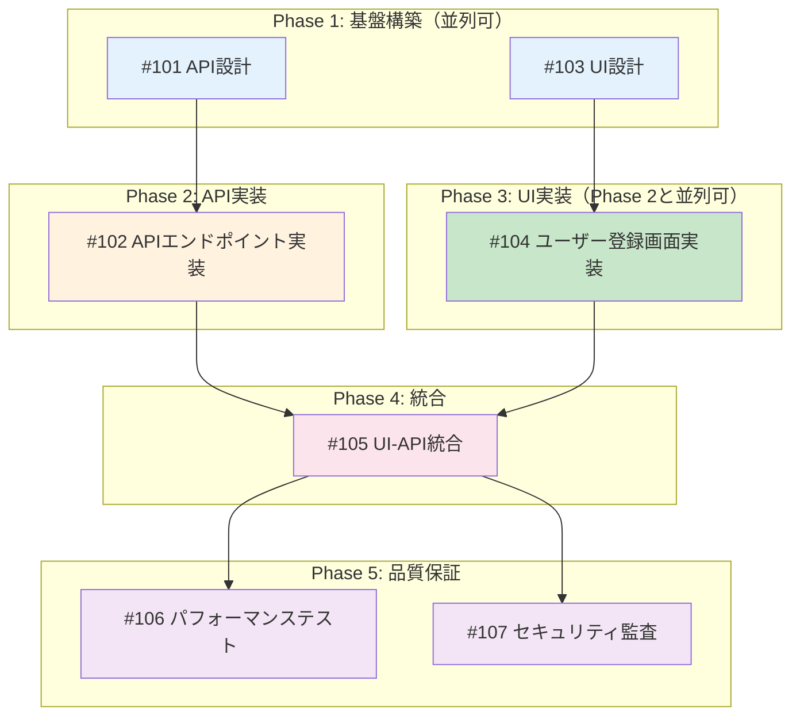
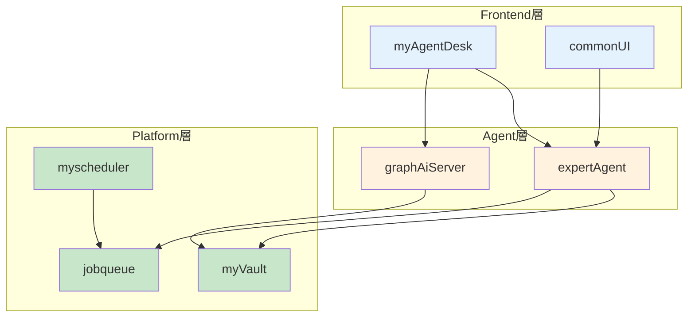
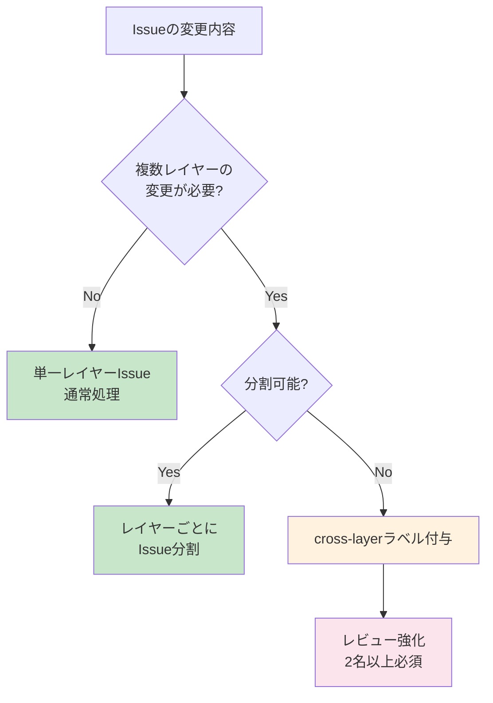

# 🎯 Issue分割ガイド（詳細版）

このドキュメントは、Feature全体を実装可能なIssue単位に分割するための詳細ガイドです。

## 📋 概要

Issue分割は、大きなFeatureを小さく実装可能な単位に分割し、並列開発と段階的デリバリーを実現するための重要なプロセスです。

### Issue分割の目的

1. **並列開発の実現**: 依存関係を最小化し、複数エンジニアが同時に作業可能
2. **リスク最小化**: 小さな単位でのデリバリーにより、問題の早期発見
3. **進捗の可視化**: 完了したIssueの数で進捗を測定可能
4. **品質の向上**: 小さな単位でのテスト・レビューにより品質向上

---

## 🎨 Issue分割の原則

### 1. 縦割り（Vertical Slice）優先

**推奨**: UI + API + DB + テストを1つのIssueに含める

```
✅ Good: Issue「ユーザー登録機能」
  - ユーザー登録画面（UI）
  - ユーザー作成API（API）
  - usersテーブルへの保存（DB）
  - 単体テスト + 統合テスト

❌ Bad: フェーズで分割
  - Issue 1「ユーザー登録の要件定義」
  - Issue 2「ユーザー登録の設計」
  - Issue 3「ユーザー登録の実装」
```

### 2. Issueサイズの目安

| サイズ | Story Point | 作業時間 | 推奨度 | 例 |
|-------|------------|---------|-------|-----|
| XS | 1 | 2-4時間 | ✅ | Typo修正、軽微なバグ修正 |
| S | 2 | 0.5-1日 | ✅ | 単純なAPI追加、UI改善 |
| M | 3-5 | 1-3日 | ✅ | 標準的な機能追加 |
| L | 8 | 3-5日 | ⚠️ | 複雑な機能、分割推奨 |
| XL | 13+ | 1週間以上 | ❌ | 必ず分割 |

### 3. 依存関係の最小化

- **並列実行可能なIssueを優先的に作成**
- 依存関係は明示的に記載
- 循環依存は絶対に作らない

---

## 📝 受入基準の2層構造 🆕

各Issueの受入基準は「自動検証可能」と「手動検証が必要」の2層に分けて定義します。

### 🤖 自動検証可能な基準（pm-auto-devが実施）

**定義**: `/pm-auto-dev` スキルが自動的にテスト実行で検証できる基準

#### 例: 機能要件
```markdown
- [ ] APIエンドポイント `/v1/users` が実装される
- [ ] ユーザー作成時にバリデーションエラーが適切に返される
- [ ] データベースにユーザー情報が正常に保存される
- [ ] メールアドレス重複時に409エラーが返される
```

#### 例: 品質基準
```markdown
- [ ] 単体テストカバレッジ 90%以上
- [ ] 結合テストカバレッジ 50%以上
- [ ] Ruff/MyPy エラーゼロ
- [ ] レスポンスタイム 500ms以内（自動テストで測定）
```

#### 例: テストケース
```markdown
- [ ] 正常系: ユーザー登録成功（201 Created）
- [ ] 異常系: メールアドレス重複エラー（409 Conflict）
- [ ] 異常系: 不正なメールアドレス形式（400 Bad Request）
- [ ] エッジケース: 最大文字数境界値
```

---

### 👤 手動検証が必要な基準（ユーザーが実施）

**定義**: ユーザーが動作確認で実際に操作して確認する必要がある基準

#### 例: UX/UI検証
```markdown
- [ ] ユーザー登録画面のレイアウトが仕様書通り
- [ ] エラーメッセージが分かりやすく表示される
- [ ] 入力フィールドのフォーカス移動が自然
- [ ] 送信ボタンの配置が適切
```

#### 例: ビジネスロジック検証
```markdown
- [ ] 実際のメールアドレスで確認メールが届く
- [ ] 本番環境のサードパーティAPI（Auth0等）と連携できる
- [ ] セキュリティ要件（パスワードハッシュ化等）を満たしている
- [ ] GDPR準拠のデータ保存が行われている
```

#### 例: 運用検証
```markdown
- [ ] ログが適切に出力される（CloudWatchで確認）
- [ ] 管理画面でユーザー情報が確認できる
- [ ] エラー時のアラート通知（Slack/PagerDuty）が機能する
- [ ] モニタリングダッシュボードで正常に表示される
```

---

### ✅ 完了条件の明確化

```markdown
#### ✅ 完了条件

**`/pm-auto-dev` 完了時点**:
- 🤖 自動検証可能な基準 → 全て✅（テスト自動実行で確認済み）

**ユーザー動作確認後**:
- 👤 手動検証が必要な基準 → 全て✅（ユーザーが手動確認）
- 上記完了後に `/pm-create-pr` 実行可能
```

---

## 🗺️ Phase毎のイシュー管理

Feature全体をPhaseに分割し、各PhaseにIssueを配置します。

### Phase分割の例

#### Phase 1: 基盤構築（並列実行可能）

**目的**: 後続フェーズの基礎となる設計・仕様を確定

| Issue | 概要 | 依存 | 担当 | 見積 |
|-------|------|------|------|------|
| #101 | API設計・スキーマ定義 | なし | Backend | 4h |
| #103 | UI設計・コンポーネント設計 | なし | Frontend | 4h |

**Phase 1 完了条件**:
- [ ] API仕様書作成完了（OpenAPI Spec）
- [ ] UIモックアップ承認完了（Figma/Storybook）
- [ ] データベーススキーマ確定

---

#### Phase 2: API実装（Phase 1完了後）

**目的**: Backend機能の実装とテスト

| Issue | 概要 | 依存 | 担当 | 見積 |
|-------|------|------|------|------|
| #102 | APIエンドポイント実装 | #101 | Backend | 1日 |

**Phase 2 完了条件**:
- [ ] `/pm-auto-dev 102` 完了（自動検証済み）
- [ ] API単体動作確認OK（Postman/curl）
- [ ] API仕様書と実装の一致確認

---

#### Phase 3: UI実装（Phase 1完了後、Phase 2と並列可）

**目的**: Frontend機能の実装とテスト

| Issue | 概要 | 依存 | 担当 | 見積 |
|-------|------|------|------|------|
| #104 | ユーザー登録画面実装 | #103 | Frontend | 1日 |

**Phase 3 完了条件**:
- [ ] `/pm-auto-dev 104` 完了（自動検証済み）
- [ ] UI表示確認OK（ブラウザ確認）
- [ ] モックAPIでの動作確認完了

**注意**: Phase 2（API実装）と並列実行可能。APIが未完成の場合はモックAPIを使用。

---

#### Phase 4: 統合（Phase 2, 3完了後）

**目的**: Frontend-Backend統合とE2Eテスト

| Issue | 概要 | 依存 | 担当 | 見積 |
|-------|------|------|------|------|
| #105 | UI-API統合 | #102, #104 | Full-stack | 0.5日 |

**Phase 4 完了条件**:
- [ ] `/pm-auto-dev 105` 完了（E2Eテスト自動検証済み）
- [ ] 実際のユーザー操作フロー確認OK
- [ ] エラーハンドリングが適切に動作

---

#### Phase 5: 品質保証（Phase 4完了後）

**目的**: 非機能要件の検証

| Issue | 概要 | 依存 | 担当 | 見積 |
|-------|------|------|------|------|
| #106 | パフォーマンステスト | #105 | QA | 0.5日 |
| #107 | セキュリティ監査 | #105 | Security | 0.5日 |

**Phase 5 完了条件**:
- [ ] 負荷テスト実施完了（k6/Locust）
- [ ] セキュリティチェック完了（OWASP Top 10）
- [ ] パフォーマンス基準達成

**注意**: Phase 5内のIssueは並列実行可能。

---

## 📊 依存関係グラフの作成

### Mermaidでの可視化



### 並列実行可能性マトリクス

| Phase | 並列実行可能なIssue | 理由 | 注意点 |
|-------|-------------------|------|--------|
| Phase 1 | #101, #103 | 相互依存なし | 同時に作業開始可能 |
| Phase 2-3 | #102, #104 | 異なるレイヤー（Backend/Frontend） | #104はモックAPI使用 |
| Phase 5 | #106, #107 | 異なる検証観点 | 同時に実施可能 |

### 依存関係マトリクス（詳細版）

| Issue | 依存先 | 並列実行可能 | ブロッカー | クリティカルパス |
|-------|--------|-------------|------------|----------------|
| #101 | なし | Yes | なし | ✅ |
| #103 | なし | Yes（#101と並列可） | なし | - |
| #102 | #101 | No | #101の完了待ち | ✅ |
| #104 | #103 | Yes（#102と並列可） | #103の完了待ち | - |
| #105 | #102, #104 | No | #102,#104の完了待ち | ✅ |
| #106 | #105 | Yes（#107と並列可） | #105の完了待ち | - |
| #107 | #105 | Yes（#106と並列可） | #105の完了待ち | - |

**クリティカルパス**: #101 → #102 → #105（最短でも2.5日必要）

---

## 📅 マイルストーン計画

### Milestone 1: 基盤・実装（Week 1-2）

**期間**: 10営業日

| Phase | 期間 | 並列実行 |
|-------|------|---------|
| Phase 1: 基盤構築 | Day 1 | #101, #103 並列実行 |
| Phase 2: API実装 | Day 2 | - |
| Phase 3: UI実装 | Day 2-3 | #102と並列実行可能 |

**完了条件**:
- [ ] API実装完了
- [ ] UI実装完了
- [ ] 単体テスト全パス

---

### Milestone 2: 統合・品質保証（Week 3）

**期間**: 2営業日

| Phase | 期間 | 並列実行 |
|-------|------|---------|
| Phase 4: 統合 | Day 4 | - |
| Phase 5: 品質保証 | Day 5 | #106, #107 並列実行 |

**完了条件**:
- [ ] E2Eテスト全パス
- [ ] パフォーマンステスト合格
- [ ] セキュリティ監査合格

---

## 🏗️ 単一レイヤー改修ルール

### 原則: 1 Issue = 1 Layer

各Issueは原則として**単一のレイヤー**内での変更に限定します。
これは「縦割り（Vertical Slice）優先」原則と補完関係にあり、**機能単位**での分割後に**技術層単位**での制約を適用します。

### レイヤー定義

| レイヤー | プロジェクト | 役割 | テスト責任 |
|---------|-------------|------|-----------|
| **Platform層** | myVault, jobqueue, myscheduler, valkey, langfuse | インフラ・基盤サービス | 単体+結合 |
| **Agent層** | expertAgent, graphAiServer | AIエージェント・ワークフロー | 単体+結合+受入 |
| **Frontend層** | myAgentDesk, commonUI | ユーザーインターフェース | 単体+E2E |
| **Docs層** | docs/, CLAUDE.md, *.md | ドキュメント | 構文チェック |

### レイヤー間依存関係



### なぜ単一レイヤーか？

1. **テスト戦略の明確化**: レイヤーごとにテスト責任が異なる
2. **レビューの効率化**: レビュアーが担当レイヤーに集中できる
3. **デプロイリスクの最小化**: 変更範囲が限定される
4. **並列開発の促進**: 異なるレイヤーは同時に作業可能

### 縦割り原則との関係

現在の「縦割り（Vertical Slice）優先」原則は**機能単位**での分割を推奨します。
「単一レイヤー改修ルール」は**技術層単位**での制約を追加します。

両者は矛盾せず、以下のように補完関係にあります：

- **縦割り原則**: 「何を実装するか」の単位（ユーザー登録機能など）
- **レイヤールール**: 「どこを変更するか」の制約（Agent層のみなど）

つまり、「ユーザー登録機能」というFeatureを「API実装（Agent層）」「UI実装（Frontend層）」のように**レイヤーごとのIssue**に分割するのが推奨アプローチです。

---

### レイヤー跨ぎの例外処理

#### cross-layerラベルの使用条件

以下の場合のみ `cross-layer` ラベルを付与できます：

| 条件 | 例 | 対応 |
|------|-----|------|
| **API契約変更** | Request/Responseスキーマ変更 | 必須: 両レイヤーの同時変更 |
| **データベース移行** | スキーマ変更+API変更 | 推奨: 別Issue分割を検討 |
| **E2Eバグ修正** | UI+API両方の修正が必要 | 許容: 単一Issue |

#### 判定フロー



#### cross-layer Issue のレビュー要件

- [ ] 2名以上のレビュアー（各レイヤーから1名）
- [ ] 変更理由の明記（なぜ分割できないか）
- [ ] 影響範囲の明示（両レイヤーへの影響）
- [ ] ロールバック手順の準備

---

### 良い例・悪い例

**良い例**: 単一レイヤー内の変更

```markdown
Issue: expertAgentにログ出力機能を追加
- 変更対象: expertAgent/app/logging/
- レイヤー: Agent層のみ
- テスト: expertAgent/tests/unit/
```

**悪い例**: レイヤー跨ぎの変更（分割すべき）

```markdown
Issue: ユーザー登録機能の追加
- 変更対象:
  - expertAgent/app/api/users.py (Agent層)
  - myAgentDesk/src/routes/users/ (Frontend層)
  - myVault/app/models/users.py (Platform層)
→ 3つのIssueに分割すべき
```

**許容される例**: cross-layer（分割不可能）

```markdown
Issue: API契約変更（RequestスキーマとUI同時更新）
- ラベル: cross-layer
- 理由: スキーマ変更は両側同時でないと動作しない
- レビュー: Backend担当1名 + Frontend担当1名
```

---

## 🚨 よくある落とし穴と対策

### 1. Issue が大きすぎる

**症状**: 1つのIssueが1週間以上かかる

**対策**:
- Phaseをさらに細分化
- 縦割りで分割（例: ユーザー登録とログインを分離）

### 2. 依存関係が複雑すぎる

**症状**: 全てのIssueが相互依存している

**対策**:
- インターフェースを先に定義（Phase 1で確定）
- モックを活用して並列実行可能にする

### 3. 手動検証が漏れる

**症状**: `/pm-auto-dev` 完了後にバグ発見

**対策**:
- 「手動検証が必要な基準」を明確に記載
- 動作確認チェックリストを作成

### 4. Phaseの順序が不明確

**症状**: どのIssueから着手すべきか分からない

**対策**:
- Phase番号を明記
- クリティカルパスを可視化

---

## 📋 Issue分割チェックリスト

各Issueについて以下を確認：

### 基本要件
- [ ] 独立してデプロイ可能か
- [ ] 1-3日で完了可能か（M以下のサイズか）
- [ ] 明確な完了条件があるか

### 受入基準
- [ ] 🤖 自動検証可能な基準が定義されているか
- [ ] 👤 手動検証が必要な基準が定義されているか
- [ ] `/pm-auto-dev` と手動確認の境界が明確か

### 依存関係
- [ ] 依存するIssueが明記されているか
- [ ] 並列実行可能性が評価されているか
- [ ] 循環依存がないか

### Phase管理
- [ ] どのPhaseに属するか明確か
- [ ] Phase完了条件が定義されているか
- [ ] Phase間の依存関係が明確か

### テスト
- [ ] テストケースが定義できるか
- [ ] カバレッジ目標が明確か（単体90%、統合50%）

### レイヤールール
- [ ] 単一レイヤー内の変更か
- [ ] 複数レイヤーの場合 `cross-layer` ラベルが付与されているか
- [ ] cross-layerの場合、分割不可能な理由が明記されているか

---

## 🔗 関連ドキュメント

- [開発ワークフロー](./01-development-workflow.md)
- [スラッシュコマンド](./02-slash-commands.md)
- [品質基準](./04-quality-standards.md)
- [Issue分割スキル](../../.claude/commands/issue-split.md)（スラッシュコマンド定義）
- [PM自動開発スキル](../../.claude/commands/pm-auto-dev.md)

---

[← ドキュメント管理](./07-documentation-rules.md) | [CLAUDE.md](../../CLAUDE.md)
