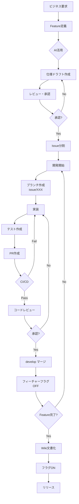
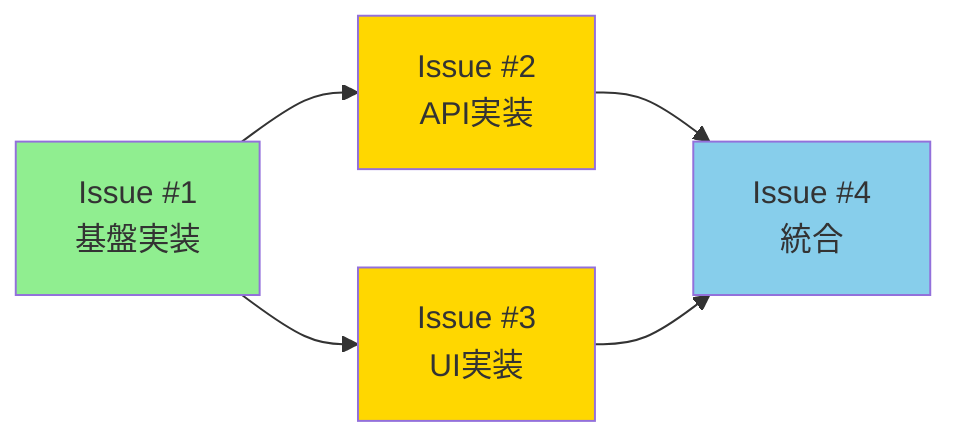
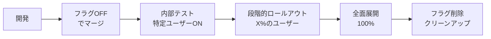

# アジャイル開発ワークフロー

**最終更新**: 2025-11-05
**バージョン**: 1.0.0

---

## 📋 目次

1. [概要](#概要)
2. [全体ワークフロー](#全体ワークフロー)
3. [Feature管理](#feature管理)
4. [Issue管理](#issue管理)
5. [ブランチ・PR戦略](#ブランチpr戦略)
6. [フィーチャーフラグ管理](#フィーチャーフラグ管理)
7. [ドキュメント管理](#ドキュメント管理)
8. [実装例](#実装例)
9. [チェックリスト](#チェックリスト)

---

## 概要

本ドキュメントは、MySwiftAgentプロジェクトにおけるアジャイル開発のワークフローを定義します。
「**フィーチャー駆動開発（FDD）**」と「**継続的インテグレーション（CI）**」を組み合わせ、
AI（Claude Code）を活用した効率的な開発プロセスを実現します。

### 基本原則

- **ユーザー価値中心**: すべての開発はユーザー価値から始まる
- **小さく頻繁に**: 小規模な変更を頻繁にマージ
- **AI活用**: 要件定義、設計、レビューにAIを積極活用
- **継続的改善**: プロセス自体も継続的に改善

---

## 全体ワークフロー



---

## Feature管理

### Feature定義

Featureは「**ユーザーに価値を届ける単位**」です。GitHubのIssueとして作成し、`feature`ラベルを付与します。

#### テンプレート

```markdown
# Feature: [機能名]

## 📊 ユーザー価値（WHAT & WHY）

### ユーザーストーリー
As a [ユーザー種別]
I want to [達成したいこと]
So that [期待される価値/ビジネス価値]

### 背景・課題
- 現状の問題点
- ユーザーからの要望
- ビジネス上の必要性

## 🎯 成功指標（KPI）
- [ ] 指標1: [測定方法と目標値]
- [ ] 指標2: [測定方法と目標値]

## 📝 仕様・設計ドラフト（HOW）

### 機能要件
#### 必須要件（MVP）
- [ ] 要件1
- [ ] 要件2

#### 追加要件（Phase 2）
- [ ] 要件3
- [ ] 要件4

### 非機能要件
- パフォーマンス: [要件]
- セキュリティ: [要件]
- アクセシビリティ: [要件]

### 技術設計（ドラフト）
```mermaid
graph LR
    [アーキテクチャ図]
```

### API設計（ドラフト）
```yaml
endpoints:
  - path: /api/v1/xxx
    method: POST
    request: {}
    response: {}
```

## 🔄 依存関係
- [ ] 他Feature: #XXX
- [ ] 外部サービス: [サービス名]

## ✅ 受入条件
- [ ] 条件1
- [ ] 条件2

## 📅 タイムライン
- ドラフト作成: YYYY-MM-DD
- レビュー予定: YYYY-MM-DD
- 開発開始予定: YYYY-MM-DD
- リリース予定: YYYY-MM-DD
```

### AI活用による仕様ドラフト作成

Claude Codeのスキルを活用：

```bash
# 要件定義の生成
/requirements ユーザープロフィール管理機能

# 設計方針の作成
/design プロフィール管理システムの設計

# レビューの実施
/review-arch [設計書]
```

### レビュープロセス（リファイメント）

#### レビューチェックリスト

- [ ] **ビジネス価値**: ユーザー価値が明確か
- [ ] **技術的実現性**: 実装可能か
- [ ] **アーキテクチャ整合性**: 既存システムと整合するか
- [ ] **セキュリティ**: セキュリティリスクはないか
- [ ] **パフォーマンス**: パフォーマンス影響は許容範囲か
- [ ] **工数見積もり**: 現実的な工数か

#### 承認フロー

1. **ドラフトレビュー**: テックリードによる技術レビュー
2. **ビジネスレビュー**: プロダクトオーナーによる価値確認
3. **最終承認**: 両者の承認で「Ready」状態へ

---

## Issue管理

### Issue分割戦略

#### 縦割り（Vertical Slice）の原則

```
❌ 悪い例（横割り）:
- Issue #1: データベース設計
- Issue #2: API実装
- Issue #3: UI実装
- Issue #4: テスト作成

✅ 良い例（縦割り）:
- Issue #1: ユーザー登録機能（DB + API + UI + テスト）
- Issue #2: ログイン機能（DB + API + UI + テスト）
- Issue #3: パスワードリセット機能（DB + API + UI + テスト）
```

#### Issue サイズの目安

| サイズ | Story Point | 作業時間 | 例 |
|-------|------------|---------|-----|
| XS | 1 | 2-4時間 | 小さなバグ修正、ドキュメント更新 |
| S | 2 | 0.5-1日 | 単純な機能追加、小規模リファクタ |
| M | 3-5 | 1-3日 | 標準的な機能実装 |
| L | 8 | 3-5日 | 複雑な機能（分割を推奨） |
| XL | 13+ | 1週間以上 | 要分割！ |

### Issueテンプレート

```markdown
# Issue: [タイトル]

## 📋 概要
[1-2文で概要説明]

## 🎯 完了条件
- [ ] 実装完了
- [ ] 単体テスト作成（カバレッジ90%以上）
- [ ] 結合テスト作成
- [ ] ドキュメント更新
- [ ] コードレビュー承認

## 🔗 依存関係
- 先行Issue: #XXX（完了待ち）
- 並列可能Issue: #YYY, #ZZZ

## 📝 作業内容

### 実装タスク
- [ ] タスク1: [詳細]
- [ ] タスク2: [詳細]

### テストタスク
- [ ] 単体テスト: [対象]
- [ ] 結合テスト: [シナリオ]

### ドキュメントタスク
- [ ] README.md更新
- [ ] API仕様書更新

## 🏷️ ラベル
- `priority: high/medium/low`
- `size: XS/S/M/L`
- `type: feature/bug/refactor`

## 📅 見積もり
- 作業時間: X時間
- 開始予定: YYYY-MM-DD
- 完了予定: YYYY-MM-DD

## 👤 担当者
- 実装: @developer
- レビュー: @reviewer
```

### 依存関係の管理



凡例:
- 🟢 完了
- 🟡 進行中
- 🔵 未着手

---

## ブランチ・PR戦略

### ブランチ命名規則

```bash
# Issue単位でブランチ作成（Feature単位は禁止）
issue/[Issue番号]-[簡潔な説明]

# 例
issue/123-add-user-profile
issue/124-fix-login-error
issue/125-refactor-api-client
```

### ブランチ作成フロー

```bash
# 1. 最新のdevelopを取得
git checkout develop
git pull origin develop

# 2. Issue用ブランチ作成
git checkout -b issue/123-add-user-profile

# 3. 実装・コミット（頻繁に）
git add .
git commit -m "feat: add user profile model"
git commit -m "test: add unit tests for profile"
git commit -m "docs: update API documentation"

# 4. プッシュ
git push -u origin issue/123-add-user-profile
```

### PR作成ガイドライン

#### PRテンプレート

```markdown
## 📋 概要
Issue #123 を解決

## 🔄 変更内容
- [ ] ユーザープロフィールモデル追加
- [ ] プロフィールAPI実装
- [ ] プロフィールUI実装

## 📸 スクリーンショット
[UIの場合、Before/After画像]

## 🧪 テスト
- [ ] 単体テスト追加
- [ ] 結合テスト追加
- [ ] 手動テスト完了

## 📝 レビューポイント
- セキュリティ: [確認ポイント]
- パフォーマンス: [確認ポイント]

## ✅ チェックリスト
- [ ] コードは自己レビュー済み
- [ ] テストはすべてパス
- [ ] ドキュメント更新済み
- [ ] CIはグリーン
```

#### マージ条件

1. **CI/CD**: すべてのチェックがパス
2. **レビュー**: 最低1名の承認
3. **コンフリクト**: 解消済み
4. **テスト**: カバレッジ基準達成

---

## フィーチャーフラグ管理

### 実装パターン

#### 1. 環境変数による制御

```python
# config.py
FEATURE_FLAGS = {
    'user_profile': os.getenv('FEATURE_USER_PROFILE', 'false').lower() == 'true',
    'new_dashboard': os.getenv('FEATURE_NEW_DASHBOARD', 'false').lower() == 'true',
}

# usage.py
from config import FEATURE_FLAGS

if FEATURE_FLAGS['user_profile']:
    # 新機能のコード
    return render_new_profile()
else:
    # 既存のコード
    return render_old_profile()
```

#### 2. データベースによる制御

```python
# models.py
class FeatureFlag(Base):
    __tablename__ = 'feature_flags'

    name = Column(String, primary_key=True)
    enabled = Column(Boolean, default=False)
    rollout_percentage = Column(Integer, default=0)

# usage.py
def is_feature_enabled(feature_name: str, user_id: str = None) -> bool:
    flag = db.query(FeatureFlag).filter_by(name=feature_name).first()
    if not flag:
        return False

    if flag.rollout_percentage == 100:
        return flag.enabled

    # 段階的ロールアウト
    if user_id:
        hash_value = hash(f"{feature_name}:{user_id}") % 100
        return hash_value < flag.rollout_percentage

    return False
```

### フラグのライフサイクル



### クリーンアップルール

- フラグ作成から3ヶ月経過: レビュー必須
- 全面展開から1ヶ月経過: 削除検討
- 未使用フラグ: 即座に削除

---

## ドキュメント管理

### ドキュメントの配置戦略

| フェーズ | 配置場所 | 内容 | 管理方法 |
|---------|---------|------|----------|
| 計画 | GitHub Issue | ドラフト、議論 | Issueコメント |
| 開発 | ソースコード | コメント、docstring | PRレビュー |
| 完了 | GitHub Wiki | 確定仕様、設計 | Gitリポジトリ |
| 運用 | README/docs/ | ユーザーガイド | メインリポジトリ |

### Wiki構成例

```
Home.md
├── Architecture/
│   ├── Overview.md
│   ├── Database-Design.md
│   └── API-Design.md
├── Features/
│   ├── User-Management.md
│   ├── Authentication.md
│   └── Dashboard.md
├── Development/
│   ├── Setup.md
│   ├── Testing.md
│   └── Deployment.md
└── Operations/
    ├── Monitoring.md
    └── Troubleshooting.md
```

### Wiki更新フロー

```bash
# 1. Wikiリポジトリをクローン
git clone https://github.com/[org]/[repo].wiki.git

# 2. ローカルで編集
cd [repo].wiki
code .  # VS Codeで編集

# 3. コミット・プッシュ
git add .
git commit -m "docs: update user management feature spec"
git push
```

---

## 実装例

### 例: ユーザープロフィール機能の実装

#### Step 1: Feature作成

```markdown
# Feature: ユーザープロフィール管理

## ユーザー価値
As a ユーザー
I want to 自分のプロフィールを管理したい
So that 他のユーザーに自己紹介できる
```

#### Step 2: AI活用による仕様作成

```bash
# Claude Codeで要件定義生成
/requirements ユーザープロフィール管理機能
```

#### Step 3: Issue分割

```
Issue #101: プロフィール基本機能（DB + API + UI）
Issue #102: プロフィール画像アップロード
Issue #103: プロフィール公開設定
```

#### Step 4: 開発（Issue #101）

```bash
# ブランチ作成
git checkout -b issue/101-profile-basic

# 実装（TDD）
1. テスト作成
2. 実装
3. リファクタリング

# PR作成
gh pr create --title "feat: add basic user profile (#101)" \
             --body "$(cat pr-template.md)"
```

#### Step 5: フィーチャーフラグ設定

```python
# .env
FEATURE_USER_PROFILE=false  # デフォルトOFF

# 段階的有効化
FEATURE_USER_PROFILE=true   # 開発環境
FEATURE_USER_PROFILE=false  # 本番（後で有効化）
```

#### Step 6: Wiki文書化

Feature完了後、仕様を確定版としてWikiに転記。

---

## チェックリスト

### Feature開始時

- [ ] ユーザーストーリー明確
- [ ] 受入条件定義
- [ ] AI活用でドラフト作成
- [ ] レビュー・承認取得
- [ ] Issue分割完了

### Issue開始時

- [ ] 依存関係確認
- [ ] ブランチ作成（develop最新）
- [ ] 作業見積もり記載

### PR作成時

- [ ] テスト作成
- [ ] CI/CDグリーン
- [ ] セルフレビュー完了
- [ ] PRテンプレート記入

### Feature完了時

- [ ] 全Issue完了
- [ ] 統合テスト実施
- [ ] Wiki文書化
- [ ] フィーチャーフラグ設定
- [ ] ステークホルダー確認

### リリース時

- [ ] フィーチャーフラグON
- [ ] モニタリング設定
- [ ] ロールバック準備
- [ ] リリースノート作成

---

## 📚 関連ドキュメント

- [CLAUDE.md](../../CLAUDE.md) - プロジェクト全体ガイドライン
- [Claude Code スラッシュコマンド](../../.claude/commands/) - AI活用スラッシュコマンド定義
- [GitHub Wiki](https://github.com/kewton/MySwiftAgent/wiki) - 確定仕様書

---

## 📝 改訂履歴

| バージョン | 日付 | 変更内容 | 作成者 |
|-----------|------|---------|--------|
| 1.0.0 | 2025-11-05 | 初版作成 | Claude Code |