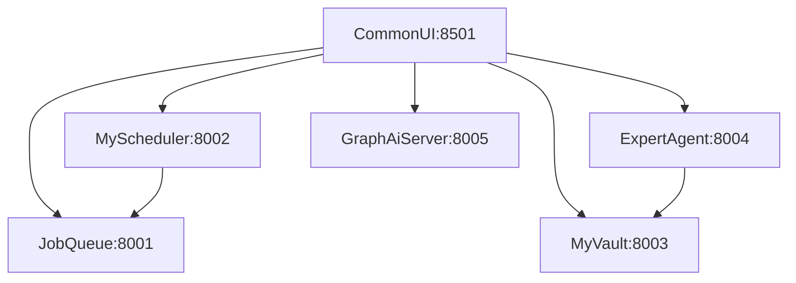

# Docker Compose Guide for MySwiftAgent

このガイドでは、MySwiftAgentプロジェクトをDocker Composeで起動・管理する方法を説明します。

## 📋 目次

- [前提条件](#前提条件)
- [サービス構成](#サービス構成)
- [基本的な使い方](#基本的な使い方)
- [環境変数の設定](#環境変数の設定)
- [開発環境での使用](#開発環境での使用)
- [トラブルシューティング](#トラブルシューティング)

## 前提条件

以下のツールがインストールされている必要があります：

- **Docker**: 20.10以上
- **Docker Compose**: 2.0以上（Docker Desktop に含まれています）

インストール確認：

```bash
docker --version
docker compose version
```

## サービス構成

MySwiftAgentは6つのマイクロサービスで構成されています：

| サービス名 | ポート | 説明 | 技術スタック |
|-----------|--------|------|-------------|
| **JobQueue** | 8001 | ジョブキュー管理API | Python/FastAPI |
| **MyScheduler** | 8002 | ジョブスケジューリングサービス | Python/FastAPI/APScheduler |
| **MyVault** | 8003 | シークレット管理サービス | Python/FastAPI/Cryptography |
| **ExpertAgent** | 8004 | AIエージェントサービス | Python/FastAPI/LangChain |
| **GraphAiServer** | 8005 | グラフAIワークフローサービス | TypeScript/Node.js |
| **CommonUI** | 8501 | Webインターフェース | Python/Streamlit |

> ℹ️ ローカル開発スクリプト（`./scripts/dev-start.sh`）も同じポートを使用します。`./scripts/quick-start.sh` を併用する場合は、デフォルトで **8101〜8105** と **8601** の代替ポートを利用するため Docker Compose と競合しません。必要に応じて `JOBQUEUE_PORT=8111 ./scripts/quick-start.sh` のように環境変数でポートを上書きできます。

### サービス間の依存関係



## イメージのバージョン管理

MySwiftAgentでは、各サービスのDockerイメージにバージョンタグを自動的に付与します。バージョンは各サービスの `pyproject.toml` (Python) または `package.json` (TypeScript) から読み取られます。

### イメージのビルド

専用のビルドスクリプトを使用してバージョンタグ付きイメージをビルドできます：

```bash
# 全サービスをビルド
./scripts/build-images.sh

# 特定のサービスのみビルド
./scripts/build-images.sh --service jobqueue

# レジストリにプッシュ
./scripts/build-images.sh --push --registry ghcr.io/your-org

# ヘルプを表示
./scripts/build-images.sh --help
```

**生成されるイメージタグ**:
- `myswiftagent-jobqueue:0.1.0` (バージョン固定)
- `myswiftagent-jobqueue:latest` (最新版)

### バージョンの確認

```bash
# イメージのバージョンを確認
docker images | grep myswiftagent

# 実行中のコンテナのイメージ情報を確認
docker compose ps --format json | jq -r '.[] | "\(.Service): \(.Image)"'
```

### 特定バージョンの使用

`.env`ファイルで使用するバージョンを指定できます：

```bash
# .env
JOBQUEUE_VERSION=0.1.0
MYSCHEDULER_VERSION=0.2.0
MYVAULT_VERSION=0.1.0
EXPERTAGENT_VERSION=0.1.2
GRAPHAISERVER_VERSION=0.1.0
COMMONUI_VERSION=0.2.0
```

または、環境変数で直接指定：

```bash
JOBQUEUE_VERSION=0.1.1 docker compose up -d jobqueue
```

## 基本的な使い方

### 1. 環境変数の設定

`.env.example`をコピーして`.env`ファイルを作成し、必要なAPIキーとバージョンを設定します：

```bash
cp .env.example .env
```

`.env`ファイルを編集して、APIキーを設定：

```bash
# 必須: AIサービスを使用する場合
OPENAI_API_KEY=sk-your-openai-api-key
ANTHROPIC_API_KEY=sk-ant-your-anthropic-key
GOOGLE_API_KEY=your-google-api-key

# MyVault設定（Secrets Management）
MYVAULT_ENABLED=true
MSA_MASTER_KEY=base64:your-generated-key  # python3 -c "from cryptography.fernet import Fernet; print(Fernet.generate_key().decode())"

# サービス認証トークン
MYVAULT_TOKEN_EXPERTAGENT=your-generated-token
MYVAULT_TOKEN_MYSCHEDULER=your-generated-token
MYVAULT_TOKEN_JOBQUEUE=your-generated-token
MYVAULT_TOKEN_COMMONUI=your-generated-token

# その他の設定は必要に応じて変更
TZ=Asia/Tokyo
```

### 2. 全サービスを起動

```bash
docker compose up -d
```

**オプション説明**:
- `-d`: バックグラウンドで実行（デタッチモード）
- `--build`: イメージを強制的に再ビルド

### 3. サービスの状態確認

```bash
# 全サービスのステータス確認
docker compose ps

# ログの確認（全サービス）
docker compose logs -f

# 特定サービスのログ確認
docker compose logs -f jobqueue
docker compose logs -f myscheduler
docker compose logs -f myvault
docker compose logs -f expertagent
docker compose logs -f graphaiserver
docker compose logs -f commonui
```

### 4. ヘルスチェック

すべてのサービスが起動したら、以下のURLでヘルスチェックを実施：

```bash
# JobQueue
curl http://localhost:8001/health

# MyScheduler
curl http://localhost:8002/health

# MyVault
curl http://localhost:8003/health

# ExpertAgent
curl http://localhost:8004/health

# GraphAiServer
curl http://localhost:8005/health

# CommonUI
curl http://localhost:8501/health
```

または、専用のヘルスチェックスクリプトを使用：

```bash
./scripts/health-check.sh
```

### 5. サービスへのアクセス

各サービスのAPIドキュメント：

- **JobQueue API Docs**: http://localhost:8001/docs
- **MyScheduler API Docs**: http://localhost:8002/docs
- **MyVault API Docs**: http://localhost:8003/docs
- **ExpertAgent API Docs**: http://localhost:8004/aiagent-api/docs
- **CommonUI**: http://localhost:8501

**CommonUI の各ページ:**
- Home: http://localhost:8501/
- JobQueue: http://localhost:8501/JobQueue
- MyScheduler: http://localhost:8501/MyScheduler
- MyVault: http://localhost:8501/MyVault

### 6. サービスの停止

```bash
# すべてのサービスを停止（コンテナは削除されない）
docker compose stop

# すべてのサービスを停止してコンテナを削除
docker compose down

# ボリュームも含めてすべて削除（データベースも削除されます）
docker compose down -v
```

## 環境変数の設定

### 必須の環境変数

| 環境変数 | 必須度 | 説明 |
|---------|--------|------|
| `OPENAI_API_KEY` | オプション | OpenAI APIキー（GPTモデル使用時） |
| `ANTHROPIC_API_KEY` | オプション | Anthropic APIキー（Claudeモデル使用時） |
| `GOOGLE_API_KEY` | オプション | Google APIキー（Geminiモデル使用時） |
| `MSA_MASTER_KEY` | 推奨 | MyVault暗号化キー（Fernet形式） |
| `MYVAULT_TOKEN_*` | 推奨 | 各サービスのMyVault認証トークン |
| `TZ` | 推奨 | タイムゾーン設定（デフォルト: Asia/Tokyo） |

### サービス固有の環境変数

#### JobQueue

```yaml
JOBQUEUE_DB_URL=sqlite+aiosqlite:///./data/jobqueue.db
PYTHONPATH=/app
```

#### MyScheduler

```yaml
JOBQUEUE_API_URL=http://jobqueue:8000
PYTHONPATH=/app
DATABASE_URL=sqlite:///./data/jobs.db
```

#### MyVault

```yaml
MSA_MASTER_KEY=base64:your-generated-key
DATABASE_PATH=./data/myvault.db
PYTHONPATH=/app
```

#### CommonUI

```yaml
JOBQUEUE_BASE_URL=http://jobqueue:8000
MYSCHEDULER_BASE_URL=http://myscheduler:8000
MYVAULT_BASE_URL=http://myvault:8000
MYVAULT_SERVICE_NAME=commonui
MYVAULT_SERVICE_TOKEN=your-service-token
EXPERTAGENT_BASE_URL=http://expertagent:8000
GRAPHAISERVER_BASE_URL=http://graphaiserver:8000
```

## 開発環境での使用

開発環境では、ソースコードの変更をリアルタイムで反映するための設定があります。

### 開発環境での起動

```bash
# docker-compose.yml と docker-compose.dev.yml の両方を使用
docker compose -f docker-compose.yml -f docker-compose.dev.yml up -d
```

### 開発環境の特徴

- **ホットリロード**: ソースコードの変更を自動検出して再起動
- **デバッグモード有効**: `DEBUG=true`、`LOG_LEVEL=DEBUG`
- **ソースコードマウント**: ローカルのソースコードをコンテナにマウント

### 開発環境での個別サービス起動

```bash
# 特定のサービスだけ起動
docker compose -f docker-compose.yml -f docker-compose.dev.yml up expertagent -d

# ログを見ながら起動
docker compose -f docker-compose.yml -f docker-compose.dev.yml up expertagent
```

## 個別サービスの管理

### 特定サービスの再起動

```bash
# 1つのサービスだけ再起動
docker compose restart jobqueue

# イメージを再ビルドして再起動
docker compose up -d --build jobqueue
```

### 特定サービスのスケーリング

```bash
# JobQueueサービスを3インスタンスに増やす
docker compose up -d --scale jobqueue=3
```

**注意**: ポートマッピングがあるサービスはスケーリング時にポート競合が発生します。

### サービスのログ管理

```bash
# 最新100行のログを表示
docker compose logs --tail=100 jobqueue

# ログをファイルに保存
docker compose logs jobqueue > jobqueue.log

# ログをリアルタイム監視
docker compose logs -f --tail=50 expertagent
```

## データの永続化

### ボリューム確認

```bash
# 作成されたボリュームの一覧
docker volume ls | grep myswiftagent

# ボリュームの詳細情報
docker volume inspect myswiftagent-jobqueue-data
docker volume inspect myswiftagent-myscheduler-data
docker volume inspect myswiftagent-myvault-data
```

### データのバックアップ

```bash
# JobQueueのデータベースをバックアップ
docker compose exec jobqueue tar czf /tmp/jobqueue-backup.tar.gz -C /app/data .
docker compose cp jobqueue:/tmp/jobqueue-backup.tar.gz ./jobqueue-backup-$(date +%Y%m%d).tar.gz

# MySchedulerのデータベースをバックアップ
docker compose exec myscheduler tar czf /tmp/myscheduler-backup.tar.gz -C /app/data .
docker compose cp myscheduler:/tmp/myscheduler-backup.tar.gz ./myscheduler-backup-$(date +%Y%m%d).tar.gz

# MyVaultのデータベースをバックアップ
docker compose exec myvault tar czf /tmp/myvault-backup.tar.gz -C /app/data .
docker compose cp myvault:/tmp/myvault-backup.tar.gz ./myvault-backup-$(date +%Y%m%d).tar.gz
```

### データのリストア

```bash
# JobQueueのバックアップを展開
docker compose cp ./jobqueue-backup-20250101.tar.gz jobqueue:/tmp/jobqueue-backup.tar.gz
docker compose exec jobqueue tar xzf /tmp/jobqueue-backup.tar.gz -C /app/data
docker compose restart jobqueue

# MySchedulerのバックアップを展開
docker compose cp ./myscheduler-backup-20250101.tar.gz myscheduler:/tmp/myscheduler-backup.tar.gz
docker compose exec myscheduler tar xzf /tmp/myscheduler-backup.tar.gz -C /app/data
docker compose restart myscheduler

# MyVaultのバックアップを展開
docker compose cp ./myvault-backup-20250101.tar.gz myvault:/tmp/myvault-backup.tar.gz
docker compose exec myvault tar xzf /tmp/myvault-backup.tar.gz -C /app/data
docker compose restart myvault
```

## トラブルシューティング

### よくある問題

#### 1. ポート競合エラー

```
Error: bind: address already in use
```

**原因**: ホスト側で既に同じポートが使用されている

**解決方法**:
```bash
# 使用中のポートを確認（Docker既定ポート + Quick Start 代替ポート）
lsof -i :8001 -i :8002 -i :8003 -i :8004 -i :8005 -i :8501 -i :8101 -i :8102 -i :8103 -i :8104 -i :8105 -i :8601

# ローカル開発スクリプトを利用している場合は停止
./scripts/dev-start.sh stop  # または ./scripts/quick-start.sh stop

# 競合しているプロセスを停止してから再起動
docker compose down
docker compose up -d
```

#### 2. コンテナが起動しない

```bash
# 詳細なログを確認
docker compose logs jobqueue

# コンテナの状態を確認
docker compose ps -a

# ヘルスチェックの状態を確認
docker inspect myswiftagent-jobqueue | jq '.[0].State.Health'
```

#### 3. ネットワーク接続エラー

```bash
# ネットワークの再作成
docker compose down
docker network prune
docker compose up -d
```

#### 4. イメージビルドの失敗

```bash
# キャッシュを使わずに再ビルド
docker compose build --no-cache

# 特定サービスだけ再ビルド
docker compose build --no-cache expertagent
```

#### 5. CommonUI で MyVault 接続エラー

**症状**: CommonUI の MyVault ページで "[Errno 61] Connection refused" エラー

**原因**: 環境変数が正しく読み込まれていない

**解決方法**:
```bash
# 1. CommonUI/.env ファイルを確認
cat commonUI/.env

# 2. MYVAULT_BASE_URL が正しいポートを指しているか確認
# Docker Compose: http://localhost:8003
# Quick Start: http://localhost:8103

# 3. CommonUI を再起動
docker compose restart commonui
# または
./scripts/quick-start.sh restart commonui
```

### デバッグコマンド

```bash
# コンテナ内でシェルを起動
docker compose exec jobqueue sh

# コンテナ内でコマンド実行
docker compose exec jobqueue uv run python -c "import app; print(app.__version__)"

# ネットワーク接続テスト
docker compose exec commonui curl http://jobqueue:8000/health
docker compose exec commonui curl http://myvault:8000/health
```

### リソース使用状況の確認

```bash
# CPU・メモリ使用量を確認
docker stats

# 特定サービスのリソース使用量
docker stats myswiftagent-jobqueue myswiftagent-myscheduler
```

## 本番環境でのベストプラクティス

### 1. リソース制限の設定

`docker-compose.yml`に以下を追加：

```yaml
services:
  jobqueue:
    deploy:
      resources:
        limits:
          cpus: '1.0'
          memory: 512M
        reservations:
          cpus: '0.5'
          memory: 256M
```

### 2. ログローテーション

```yaml
services:
  jobqueue:
    logging:
      driver: "json-file"
      options:
        max-size: "10m"
        max-file: "3"
```

### 3. 自動再起動ポリシー

```yaml
services:
  jobqueue:
    restart: unless-stopped
```

### 4. ヘルスチェックの強化

```yaml
services:
  jobqueue:
    healthcheck:
      test: ["CMD", "curl", "-f", "http://localhost:8000/health"]
      interval: 30s
      timeout: 10s
      retries: 3
      start_period: 40s
```

## 参考リンク

- [Docker Compose公式ドキュメント](https://docs.docker.com/compose/)
- [Docker公式ドキュメント](https://docs.docker.com/)
- [MySwiftAgent公式README](../../README.md)
- [開発環境スクリプト](../../scripts/dev-start.sh)
- [Quick Startスクリプト](../../scripts/quick-start.sh)
