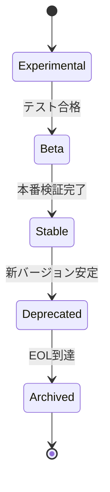

# プロンプト運用ガイド

## 概要

本ドキュメントは、expertAgentのプロンプト管理システムの運用手順を説明します。プロンプトの作成、編集、デプロイ、監視までの一連の運用フローをカバーしています。

## 目次

1. [日常運用](#日常運用)
2. [プロンプト更新手順](#プロンプト更新手順)
3. [バージョン管理](#バージョン管理)
4. [トラブルシューティング](#トラブルシューティング)
5. [監視とアラート](#監視とアラート)
6. [バックアップとリストア](#バックアップとリストア)

## 日常運用

### 運用チェックリスト

#### 日次タスク
- [ ] プロンプト読み込みエラーの確認
- [ ] キャッシュヒット率の確認
- [ ] ホットリロード動作確認

#### 週次タスク
- [ ] パフォーマンスメトリクスのレビュー
- [ ] 使用頻度の低いバージョンの特定
- [ ] プロンプト変更履歴の確認

#### 月次タスク
- [ ] 非推奨バージョンの削除
- [ ] プロンプトバックアップ
- [ ] ドキュメントの更新

### ヘルスチェック

```bash
# プロンプトシステムの状態確認
curl -X GET http://localhost:8104/aiagent-api/v1/health/prompts

# レスポンス例
{
  "status": "healthy",
  "prompt_count": 6,
  "cache_size": 12,
  "cache_hit_rate": 0.85,
  "file_watcher": "active",
  "last_reload": "2025-11-14T10:30:00Z"
}
```

## プロンプト更新手順

### 1. 新規プロンプト作成

#### Step 1: YAMLファイル作成

```bash
# プロンプトディレクトリに移動
cd expertAgent/prompts/

# 新規プロンプト用ディレクトリ作成
mkdir new_feature_prompt

# YAMLファイル作成
cat > new_feature_prompt/default.yaml << 'EOF'
version: "1.0"
name: "new_feature_prompt"
description: "新機能用プロンプト"
author: "運用チーム"
created_at: "2025-11-14"
updated_at: "2025-11-14"

metadata:
  agent_type: "jobTaskGeneratorAgents"
  purpose: "新機能の実装"
  status: "experimental"

system_prompt: |
  あなたは新機能実装の専門家です。
  以下のガイドラインに従って動作してください：

  ## 基本原則
  1. ユーザーの要求を正確に理解する
  2. 実装可能性を評価する
  3. 最適なソリューションを提案する
EOF
```

#### Step 2: バリデーション

```python
# プロンプトバリデーションスクリプト
python scripts/validate_prompt.py new_feature_prompt/default.yaml

# 出力例
✅ YAML syntax: Valid
✅ Required fields: Present
✅ Version format: Valid
✅ Metadata: Complete
```

#### Step 3: テスト環境でのテスト

```bash
# テスト環境でプロンプト読み込みテスト
python -c "
from app.services.prompt_loader import PromptLoader

loader = PromptLoader.create_default()
prompt = loader.load_prompt('new_feature_prompt')
print(f'✅ Loaded: {prompt.get('name')}')
print(f'✅ Version: {prompt.get('version')}')
"
```

### 2. 既存プロンプトの更新

#### Step 1: バージョン分岐

```bash
# 既存プロンプトをバックアップ
cp requirement_clarification/default.yaml requirement_clarification/v1.yaml

# 新バージョン作成
cp requirement_clarification/default.yaml requirement_clarification/v2.yaml

# v2.yamlを編集
vim requirement_clarification/v2.yaml
```

#### Step 2: A/Bテスト設定

```python
# A/Bテスト設定ファイル
cat > ab_test_config.yaml << 'EOF'
test_name: "requirement_clarification_v2"
start_date: "2025-11-14"
end_date: "2025-11-28"
distribution:
  control:
    version: "default"
    weight: 0.7
  treatment:
    version: "v2"
    weight: 0.3
metrics:
  - completion_rate
  - user_satisfaction
  - task_accuracy
EOF
```

### 3. プロンプトのデプロイ

#### 開発環境

```bash
# 開発環境へのデプロイ（ホットリロード有効）
# ファイルをコピーするだけで自動反映
cp new_prompt.yaml expertAgent/prompts/target_prompt/

# 確認
curl -X POST http://localhost:8104/aiagent-api/v1/test/prompt \
  -H "Content-Type: application/json" \
  -d '{"prompt_name": "target_prompt", "version": "default"}'
```

#### ステージング環境

```bash
# Gitでのバージョン管理
git add prompts/
git commit -m "feat: Add new prompt for feature X"
git push origin feature/prompt-update

# PRを作成してレビュー
gh pr create --title "プロンプト更新: Feature X" \
  --body "新機能用プロンプトを追加"

# マージ後、自動デプロイ
```

#### 本番環境

```bash
# 本番デプロイチェックリスト
./scripts/prod_deploy_checklist.sh

# デプロイ実行
kubectl apply -f k8s/expertAgent-deployment.yaml

# ロールバック準備
kubectl set image deployment/expertAgent \
  expertAgent=expertAgent:previous-version --record
```

## バージョン管理

### バージョニング規則

```
major.minor.patch

major: 大規模な構造変更
minor: 新機能追加、振る舞いの変更
patch: バグ修正、微調整
```

### バージョンライフサイクル



### バージョン状態管理

```yaml
# prompts/requirement_clarification/metadata.yaml
versions:
  "1.0":
    status: "deprecated"
    end_of_life: "2025-12-31"
    notes: "v2.0に置き換え"

  "2.0":
    status: "stable"
    released: "2025-11-01"
    notes: "パフォーマンス改善"

  "3.0":
    status: "experimental"
    released: "2025-11-14"
    notes: "新アプローチのテスト中"
```

### 非推奨バージョンの処理

```python
# 非推奨警告の実装
def load_prompt(self, prompt_name: str, version: str = "default"):
    prompt_data = self._load_yaml_file(yaml_path)

    # 非推奨チェック
    if prompt_data.get("status") == "deprecated":
        logger.warning(
            f"Prompt {prompt_name}:{version} is deprecated. "
            f"EOL: {prompt_data.get('end_of_life')}"
        )

    return prompt_data
```

## トラブルシューティング

### 問題別対処法

#### 1. プロンプトが読み込まれない

**症状**: `FileNotFoundError: No YAML found for prompt_name`

**診断手順**:
```bash
# ファイルの存在確認
ls -la prompts/prompt_name/

# パーミッション確認
ls -l prompts/prompt_name/default.yaml

# YAMLの構文チェック
python -c "import yaml; yaml.safe_load(open('prompts/prompt_name/default.yaml'))"
```

**解決策**:
1. ファイルが存在しない → default.yamlを作成
2. パーミッションエラー → `chmod 644 default.yaml`
3. YAML構文エラー → YAMLリンターで修正

#### 2. ホットリロードが動作しない

**症状**: YAMLを変更してもプロンプトが更新されない

**診断手順**:
```python
# FileWatcherの状態確認
from app.services.prompt_loader import PromptLoader

loader = PromptLoader.create_default()
print(f"FileWatcher active: {loader.file_watcher.observer.is_alive()}")

# キャッシュの状態確認
cache = loader.cache
print(f"Cache size: {len(cache._cache)}")
```

**解決策**:
```python
# FileWatcher再起動
loader.file_watcher.stop()
loader.file_watcher.start()

# キャッシュクリア
cache.clear()
```

#### 3. パフォーマンス低下

**症状**: プロンプト読み込みが遅い

**診断手順**:
```python
# パフォーマンス測定
import time
from app.services.prompt_loader import PromptLoader

loader = PromptLoader.create_default()

# キャッシュクリア後の測定
loader.cache.clear()
start = time.time()
loader.load_prompt("requirement_clarification")
print(f"Cold load: {(time.time() - start) * 1000:.2f}ms")

# キャッシュ使用時の測定
start = time.time()
loader.load_prompt("requirement_clarification")
print(f"Cached load: {(time.time() - start) * 1000:.2f}ms")
```

**解決策**:
1. キャッシュサイズを確認・調整
2. YAMLファイルサイズを最適化
3. 不要なメタデータを削除

### ログ分析

```bash
# エラーログの確認
tail -f logs/expertAgent.log | grep "PromptLoader\|PromptCache"

# 統計情報の取得
grep "cache_hit" logs/expertAgent.log | \
  awk '{print $NF}' | \
  awk '{sum+=$1; count++} END {print "Hit rate:", sum/count}'
```

## 監視とアラート

### メトリクス収集

```python
# Prometheusメトリクス設定
from prometheus_client import Counter, Histogram, Gauge

prompt_load_counter = Counter(
    'prompt_loads_total',
    'Total number of prompt loads',
    ['prompt_name', 'version']
)

prompt_load_duration = Histogram(
    'prompt_load_duration_seconds',
    'Prompt load duration',
    ['prompt_name']
)

cache_hit_rate = Gauge(
    'prompt_cache_hit_rate',
    'Cache hit rate'
)
```

### アラート設定

```yaml
# prometheus/alerts.yml
groups:
  - name: prompt_alerts
    rules:
      - alert: HighPromptLoadLatency
        expr: prompt_load_duration_seconds{quantile="0.99"} > 0.1
        for: 5m
        annotations:
          summary: "Prompt load latency is high"
          description: "99th percentile latency > 100ms for 5 minutes"

      - alert: LowCacheHitRate
        expr: prompt_cache_hit_rate < 0.5
        for: 10m
        annotations:
          summary: "Cache hit rate is low"
          description: "Cache hit rate < 50% for 10 minutes"
```

### ダッシュボード

```json
// grafana/dashboards/prompt-system.json
{
  "dashboard": {
    "title": "Prompt System Monitor",
    "panels": [
      {
        "title": "Prompt Load Rate",
        "targets": [
          {
            "expr": "rate(prompt_loads_total[5m])"
          }
        ]
      },
      {
        "title": "Cache Hit Rate",
        "targets": [
          {
            "expr": "prompt_cache_hit_rate"
          }
        ]
      },
      {
        "title": "Load Latency (p99)",
        "targets": [
          {
            "expr": "histogram_quantile(0.99, prompt_load_duration_seconds)"
          }
        ]
      }
    ]
  }
}
```

## バックアップとリストア

### 自動バックアップ

```bash
#!/bin/bash
# scripts/backup_prompts.sh

BACKUP_DIR="/backup/prompts/$(date +%Y%m%d)"
SOURCE_DIR="expertAgent/prompts"

# バックアップディレクトリ作成
mkdir -p "$BACKUP_DIR"

# プロンプトファイルをバックアップ
rsync -av --exclude="*.pyc" "$SOURCE_DIR/" "$BACKUP_DIR/"

# バックアップのハッシュ値記録
find "$BACKUP_DIR" -name "*.yaml" -exec sha256sum {} \; > "$BACKUP_DIR/checksums.txt"

# 古いバックアップの削除（30日以上）
find /backup/prompts -maxdepth 1 -type d -mtime +30 -exec rm -rf {} \;

echo "✅ Backup completed: $BACKUP_DIR"
```

### リストア手順

```bash
#!/bin/bash
# scripts/restore_prompts.sh

if [ $# -ne 1 ]; then
    echo "Usage: $0 <backup_date>"
    exit 1
fi

BACKUP_DATE=$1
BACKUP_DIR="/backup/prompts/$BACKUP_DATE"
TARGET_DIR="expertAgent/prompts"

# バックアップの存在確認
if [ ! -d "$BACKUP_DIR" ]; then
    echo "❌ Backup not found: $BACKUP_DIR"
    exit 1
fi

# チェックサム検証
cd "$BACKUP_DIR"
if ! sha256sum -c checksums.txt; then
    echo "❌ Checksum verification failed"
    exit 1
fi

# 現在のプロンプトをバックアップ
mv "$TARGET_DIR" "${TARGET_DIR}.bak.$(date +%Y%m%d%H%M%S)"

# リストア実行
cp -r "$BACKUP_DIR" "$TARGET_DIR"

# パーミッション修正
find "$TARGET_DIR" -type f -name "*.yaml" -exec chmod 644 {} \;
find "$TARGET_DIR" -type d -exec chmod 755 {} \;

echo "✅ Restore completed from: $BACKUP_DIR"
```

### 災害復旧計画

```yaml
# disaster_recovery.yaml
recovery_objectives:
  rpo: "1 hour"  # Recovery Point Objective
  rto: "15 minutes"  # Recovery Time Objective

backup_strategy:
  frequency:
    local: "hourly"
    remote: "daily"
    archive: "weekly"

  retention:
    local: "7 days"
    remote: "30 days"
    archive: "1 year"

failover_procedures:
  1_detect:
    - "監視システムがアラート発報"
    - "オンコール担当者に通知"

  2_assess:
    - "影響範囲の確認"
    - "復旧方法の決定"

  3_execute:
    - "バックアップからのリストア"
    - "サービス再起動"
    - "動作確認"

  4_verify:
    - "全プロンプト読み込みテスト"
    - "キャッシュ動作確認"
    - "エンドツーエンドテスト"
```

## セキュリティ考慮事項

### アクセス制御

```python
# プロンプト編集権限の制御
class PromptAccessControl:
    ROLES = {
        "admin": ["read", "write", "delete", "approve"],
        "developer": ["read", "write"],
        "viewer": ["read"]
    }

    def check_permission(self, user_role: str, action: str) -> bool:
        return action in self.ROLES.get(user_role, [])
```

### 監査ログ

```python
# プロンプト変更の監査ログ
def audit_log_prompt_change(
    user: str,
    prompt_name: str,
    version: str,
    action: str,
    details: dict
):
    log_entry = {
        "timestamp": datetime.now().isoformat(),
        "user": user,
        "prompt_name": prompt_name,
        "version": version,
        "action": action,  # create, update, delete
        "details": details,
        "ip_address": request.remote_addr
    }

    # 監査ログファイルに記録
    with open("audit/prompt_changes.jsonl", "a") as f:
        f.write(json.dumps(log_entry) + "\n")
```

### プロンプトインジェクション対策

```python
# プレースホルダーのサニタイゼーション
def sanitize_placeholder(value: str) -> str:
    # 潜在的に危険な文字をエスケープ
    dangerous_chars = ["'", '"', "\\", "{", "}", "[", "]"]
    for char in dangerous_chars:
        value = value.replace(char, f"\\{char}")
    return value

def replace_placeholders(prompt: str, values: dict) -> str:
    for key, value in values.items():
        sanitized_value = sanitize_placeholder(str(value))
        prompt = prompt.replace(f"{{{key}}}", sanitized_value)
    return prompt
```

## 運用のベストプラクティス

### 1. 段階的ロールアウト

```python
# フィーチャーフラグによる段階的展開
class FeatureFlags:
    FLAGS = {
        "new_prompt_v2": {
            "enabled": True,
            "rollout_percentage": 10,  # 10%のユーザーに展開
            "whitelist": ["test_user_1", "test_user_2"]
        }
    }

    def is_enabled(self, flag: str, user_id: str) -> bool:
        config = self.FLAGS.get(flag)
        if not config or not config["enabled"]:
            return False

        # ホワイトリスト確認
        if user_id in config.get("whitelist", []):
            return True

        # パーセンテージベースのロールアウト
        import hashlib
        hash_val = int(hashlib.md5(f"{flag}{user_id}".encode()).hexdigest(), 16)
        return (hash_val % 100) < config["rollout_percentage"]
```

### 2. カナリアデプロイ

```yaml
# k8s/canary-deployment.yaml
apiVersion: v1
kind: Service
metadata:
  name: expertAgent
spec:
  selector:
    app: expertAgent
  ports:
    - port: 8104
---
apiVersion: apps/v1
kind: Deployment
metadata:
  name: expertAgent-stable
spec:
  replicas: 9
  selector:
    matchLabels:
      app: expertAgent
      version: stable
---
apiVersion: apps/v1
kind: Deployment
metadata:
  name: expertAgent-canary
spec:
  replicas: 1
  selector:
    matchLabels:
      app: expertAgent
      version: canary
```

### 3. 定期レビュー

```markdown
## 月次プロンプトレビューチェックリスト

- [ ] 使用頻度の分析
  - [ ] 最も使用されているプロンプトTOP5
  - [ ] 使用されていないプロンプトの特定

- [ ] パフォーマンス評価
  - [ ] 成功率の測定
  - [ ] ユーザー満足度スコア
  - [ ] エラー率の分析

- [ ] 最適化の機会
  - [ ] 長すぎるプロンプトの簡略化
  - [ ] 重複するプロンプトの統合
  - [ ] 新機能に対するプロンプトの必要性

- [ ] ドキュメント更新
  - [ ] 変更履歴の記録
  - [ ] ベストプラクティスの追加
  - [ ] FAQの更新
```

## まとめ

プロンプト管理システムの運用は、技術的な側面だけでなく、プロセスとガバナンスが重要です。このガイドに従って運用することで、安定した高品質なプロンプト管理が実現できます。

### 重要なポイント

1. **継続的な監視**: メトリクスとログを定期的に確認
2. **段階的な変更**: 大きな変更は段階的にロールアウト
3. **文書化**: すべての変更を記録し、ナレッジを蓄積
4. **自動化**: 可能な限り手動作業を自動化
5. **セキュリティ**: アクセス制御と監査ログを適切に管理

### サポート

問題が発生した場合は、以下のリソースを参照してください：

- [技術ドキュメント](../expertAgent/docs/prompt-management.md)
- [API Reference](../expertAgent/docs/API_REFERENCE.md)
- [GitHub Issues](https://github.com/Kewton/MySwiftAgent/issues)
- Slackチャンネル: #expertAgent-support