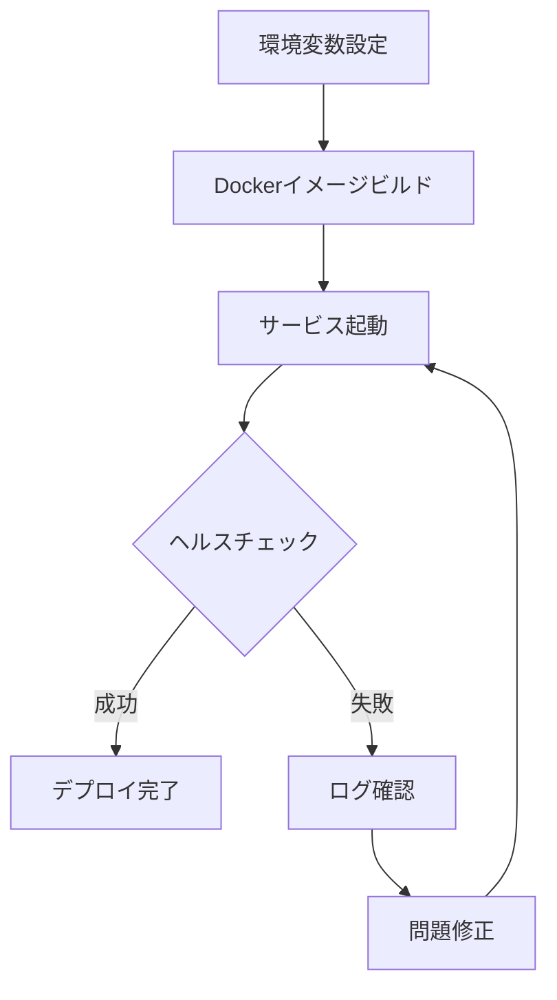
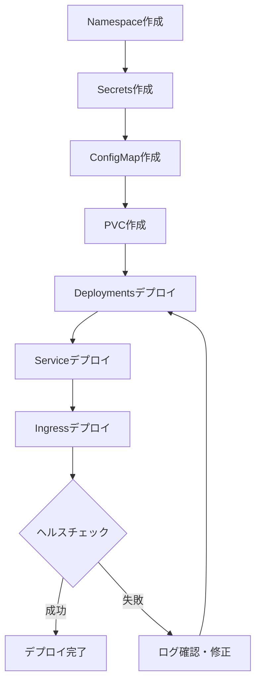

# デプロイメントガイド

MySwiftAgentの本番環境・ステージング環境へのデプロイ手順および運用ガイドです。

## 目次

- [前提条件](#前提条件)
- [デプロイメント方法](#デプロイメント方法)
  - [Docker Composeでのデプロイ](#docker-composeでのデプロイ)
  - [Kubernetesでのデプロイ](#kubernetesでのデプロイ)
- [環境変数設定](#環境変数設定)
- [ヘルスチェック](#ヘルスチェック)
- [モニタリング](#モニタリング)
- [バックアップとリカバリ](#バックアップとリカバリ)
- [スケーリング](#スケーリング)
- [セキュリティ](#セキュリティ)
- [トラブルシューティング](#トラブルシューティング)

---

## 前提条件

### ハードウェア要件

| 環境 | CPU | メモリ | ストレージ |
|-----|-----|--------|-----------|
| **最小構成** | 4コア | 16GB | 50GB |
| **推奨構成** | 8コア | 32GB | 100GB |
| **本番環境** | 16コア | 64GB | 200GB SSD |

### ソフトウェア要件

- **Docker**: 24.0.0以上
- **Docker Compose**: 2.20.0以上
- **Kubernetes** (Kubernetes環境の場合): 1.27以上
- **Python**: 3.12以上 (ローカル開発時)
- **Node.js**: 20.x LTS以上 (ローカル開発時)

### ネットワーク要件

- インターネット接続 (外部APIアクセス用)
- 以下のポートが利用可能であること:
  - `8101-8105`: バックエンドサービス
  - `5173`: myAgentDesk (開発時)
  - `8501`: commonUI (開発時)
  - `8601`: commonUI (本番時)

---

## デプロイメント方法

### Docker Composeでのデプロイ

Docker Composeは、単一ホストでの簡易的なデプロイに適しています。

#### 1. 環境設定ファイルの準備

```bash
# リポジトリのクローン
git clone https://github.com/kewton/MySwiftAgent.git
cd MySwiftAgent

# 環境変数ファイルのコピー
cp .env.example .env.docker

# 環境変数の編集
# 以下の必須変数を設定してください
vim .env.docker
```

**必須設定項目** (`.env.docker`):

```bash
# MyVault Master Encryption Key (必須)
# 生成コマンド: python -c "import secrets, base64; print('base64:' + base64.b64encode(secrets.token_bytes(32)).decode())"
MSA_MASTER_KEY=base64:YOUR_GENERATED_KEY_HERE

# 各サービスの認証トークン (必須)
# 生成コマンド: python -c "import secrets; print(secrets.token_urlsafe(32))"
MYVAULT_TOKEN_EXPERTAGENT=your_expertagent_token_here
MYVAULT_TOKEN_MYSCHEDULER=your_myscheduler_token_here
MYVAULT_TOKEN_JOBQUEUE=your_jobqueue_token_here
MYVAULT_TOKEN_COMMONUI=your_commonui_token_here

# Admin認証トークン
EXPERTAGENT_ADMIN_TOKEN=your_admin_token_here
GRAPHAISERVER_ADMIN_TOKEN=your_admin_token_here

# API Keys (MyVaultが有効な場合、MyVault経由で管理)
OPENAI_API_KEY=your_openai_api_key_here
GOOGLE_API_KEY=your_google_api_key_here
ANTHROPIC_API_KEY=your_anthropic_api_key_here
```

#### 2. Dockerイメージのビルド

```bash
# 全サービスのイメージをビルド
docker compose build

# 特定サービスのみビルド
docker compose build expertagent
```

#### 3. サービスの起動

```bash
# 全サービスを起動 (デタッチドモード)
docker compose up -d

# ログを確認
docker compose logs -f

# 特定サービスのログを確認
docker compose logs -f expertagent
```

#### 4. ヘルスチェック

```bash
# 全サービスのステータス確認
docker compose ps

# 各サービスのヘルスチェック
curl http://localhost:8103/health  # myVault
curl http://localhost:8101/health  # jobqueue
curl http://localhost:8102/health  # myscheduler
curl http://localhost:8104/health  # expertAgent
curl http://localhost:8105/health  # graphAiServer
curl http://localhost:8501/_stcore/health  # commonUI
```

#### 5. サービスの停止

```bash
# 全サービスを停止
docker compose down

# データボリュームも削除 (注意: データが消えます)
docker compose down -v
```

#### デプロイメントフロー



---

### Kubernetesでのデプロイ

Kubernetesは、スケーラブルかつ高可用性が求められる本番環境に適しています。

#### 1. Namespaceの作成

```bash
# MySwiftAgent専用のNamespaceを作成
kubectl create namespace myswiftagent-prod
```

#### 2. Secretsの作成

**マスターキーの作成**:

```bash
# マスター暗号化キーの生成
export MSA_MASTER_KEY=$(python -c "import secrets, base64; print('base64:' + base64.b64encode(secrets.token_bytes(32)).decode())")

# Secretとして登録
kubectl create secret generic myswiftagent-secrets \
  --from-literal=msa-master-key="${MSA_MASTER_KEY}" \
  --namespace=myswiftagent-prod
```

**サービストークンの作成**:

```bash
# 各サービスのトークンを生成
export MYVAULT_TOKEN_EXPERTAGENT=$(python -c "import secrets; print(secrets.token_urlsafe(32))")
export MYVAULT_TOKEN_MYSCHEDULER=$(python -c "import secrets; print(secrets.token_urlsafe(32))")
export MYVAULT_TOKEN_JOBQUEUE=$(python -c "import secrets; print(secrets.token_urlsafe(32))")
export MYVAULT_TOKEN_COMMONUI=$(python -c "import secrets; print(secrets.token_urlsafe(32))")

# Secretとして登録
kubectl create secret generic service-tokens \
  --from-literal=expertagent="${MYVAULT_TOKEN_EXPERTAGENT}" \
  --from-literal=myscheduler="${MYVAULT_TOKEN_MYSCHEDULER}" \
  --from-literal=jobqueue="${MYVAULT_TOKEN_JOBQUEUE}" \
  --from-literal=commonui="${MYVAULT_TOKEN_COMMONUI}" \
  --namespace=myswiftagent-prod
```

**API Keysの作成**:

```bash
# API Keys (環境に応じて設定)
kubectl create secret generic api-keys \
  --from-literal=openai-api-key="${OPENAI_API_KEY}" \
  --from-literal=google-api-key="${GOOGLE_API_KEY}" \
  --from-literal=anthropic-api-key="${ANTHROPIC_API_KEY}" \
  --namespace=myswiftagent-prod
```

#### 3. ConfigMapの作成

```bash
# ConfigMapマニフェストの適用
cat <<EOF | kubectl apply -f -
apiVersion: v1
kind: ConfigMap
metadata:
  name: myswiftagent-config
  namespace: myswiftagent-prod
data:
  LOG_LEVEL: "INFO"
  TZ: "Asia/Tokyo"
  MYVAULT_ENABLED: "true"
  MYVAULT_DEFAULT_PROJECT: "expertagent"
  GRAPH_AGENT_MODEL: "gemini-2.5-flash"
  PODCAST_SCRIPT_DEFAULT_MODEL: "gpt-4o-mini"
EOF
```

#### 4. Persistent Volume Claimの作成

```yaml
# pvc.yaml
apiVersion: v1
kind: PersistentVolumeClaim
metadata:
  name: myswiftagent-data
  namespace: myswiftagent-prod
spec:
  accessModes:
    - ReadWriteOnce
  resources:
    requests:
      storage: 50Gi
  storageClassName: standard  # 環境に応じて変更
```

```bash
kubectl apply -f pvc.yaml
```

#### 5. Deploymentsの作成

**myVault Deployment**:

```yaml
# myvault-deployment.yaml
apiVersion: apps/v1
kind: Deployment
metadata:
  name: myvault
  namespace: myswiftagent-prod
spec:
  replicas: 2
  selector:
    matchLabels:
      app: myvault
  template:
    metadata:
      labels:
        app: myvault
    spec:
      containers:
      - name: myvault
        image: ghcr.io/kewton/myswiftagent-myvault:0.1.0
        ports:
        - containerPort: 8000
        env:
        - name: PYTHONPATH
          value: "/app"
        - name: DATABASE_URL
          value: "sqlite:///./data/myvault.db"
        - name: MSA_MASTER_KEY
          valueFrom:
            secretKeyRef:
              name: myswiftagent-secrets
              key: msa-master-key
        - name: TOKEN_expertagent
          valueFrom:
            secretKeyRef:
              name: service-tokens
              key: expertagent
        - name: TOKEN_myscheduler
          valueFrom:
            secretKeyRef:
              name: service-tokens
              key: myscheduler
        - name: TOKEN_jobqueue
          valueFrom:
            secretKeyRef:
              name: service-tokens
              key: jobqueue
        - name: TOKEN_commonui
          valueFrom:
            secretKeyRef:
              name: service-tokens
              key: commonui
        envFrom:
        - configMapRef:
            name: myswiftagent-config
        volumeMounts:
        - name: data
          mountPath: /app/data
          subPath: myvault
        livenessProbe:
          httpGet:
            path: /health
            port: 8000
          initialDelaySeconds: 10
          periodSeconds: 30
        readinessProbe:
          httpGet:
            path: /health
            port: 8000
          initialDelaySeconds: 5
          periodSeconds: 10
      volumes:
      - name: data
        persistentVolumeClaim:
          claimName: myswiftagent-data
---
apiVersion: v1
kind: Service
metadata:
  name: myvault
  namespace: myswiftagent-prod
spec:
  selector:
    app: myvault
  ports:
  - protocol: TCP
    port: 8000
    targetPort: 8000
  type: ClusterIP
```

**expertAgent Deployment**:

```yaml
# expertagent-deployment.yaml
apiVersion: apps/v1
kind: Deployment
metadata:
  name: expertagent
  namespace: myswiftagent-prod
spec:
  replicas: 3
  selector:
    matchLabels:
      app: expertagent
  template:
    metadata:
      labels:
        app: expertagent
    spec:
      containers:
      - name: expertagent
        image: ghcr.io/kewton/myswiftagent-expertagent:0.1.2
        ports:
        - containerPort: 8000
        env:
        - name: PYTHONPATH
          value: "/app"
        - name: MYVAULT_BASE_URL
          value: "http://myvault:8000"
        - name: MYVAULT_SERVICE_NAME
          value: "expertagent"
        - name: MYVAULT_SERVICE_TOKEN
          valueFrom:
            secretKeyRef:
              name: service-tokens
              key: expertagent
        - name: OLLAMA_URL
          value: "http://ollama:11434"  # 別途デプロイが必要
        envFrom:
        - configMapRef:
            name: myswiftagent-config
        volumeMounts:
        - name: data
          mountPath: /app/data
          subPath: expertagent
        - name: logs
          mountPath: /app/logs
        livenessProbe:
          httpGet:
            path: /health
            port: 8000
          initialDelaySeconds: 15
          periodSeconds: 30
        readinessProbe:
          httpGet:
            path: /health
            port: 8000
          initialDelaySeconds: 10
          periodSeconds: 10
        resources:
          requests:
            memory: "2Gi"
            cpu: "1000m"
          limits:
            memory: "4Gi"
            cpu: "2000m"
        # Playwright向けのセキュリティ設定
        securityContext:
          capabilities:
            add:
            - SYS_ADMIN
      volumes:
      - name: data
        persistentVolumeClaim:
          claimName: myswiftagent-data
      - name: logs
        emptyDir: {}
---
apiVersion: v1
kind: Service
metadata:
  name: expertagent
  namespace: myswiftagent-prod
spec:
  selector:
    app: expertagent
  ports:
  - protocol: TCP
    port: 8000
    targetPort: 8000
  type: ClusterIP
```

#### 6. Ingressの設定

```yaml
# ingress.yaml
apiVersion: networking.k8s.io/v1
kind: Ingress
metadata:
  name: myswiftagent-ingress
  namespace: myswiftagent-prod
  annotations:
    nginx.ingress.kubernetes.io/rewrite-target: /
    cert-manager.io/cluster-issuer: letsencrypt-prod
spec:
  ingressClassName: nginx
  tls:
  - hosts:
    - myswiftagent.example.com
    secretName: myswiftagent-tls
  rules:
  - host: myswiftagent.example.com
    http:
      paths:
      - path: /api/vault
        pathType: Prefix
        backend:
          service:
            name: myvault
            port:
              number: 8000
      - path: /api/jobs
        pathType: Prefix
        backend:
          service:
            name: jobqueue
            port:
              number: 8000
      - path: /api/scheduler
        pathType: Prefix
        backend:
          service:
            name: myscheduler
            port:
              number: 8000
      - path: /aiagent-api
        pathType: Prefix
        backend:
          service:
            name: expertagent
            port:
              number: 8000
      - path: /graphai
        pathType: Prefix
        backend:
          service:
            name: graphaiserver
            port:
              number: 8000
      - path: /
        pathType: Prefix
        backend:
          service:
            name: myagentdesk
            port:
              number: 5173
```

#### 7. デプロイの実行

```bash
# 全マニフェストを適用
kubectl apply -f myvault-deployment.yaml
kubectl apply -f jobqueue-deployment.yaml
kubectl apply -f myscheduler-deployment.yaml
kubectl apply -f expertagent-deployment.yaml
kubectl apply -f graphaiserver-deployment.yaml
kubectl apply -f myagentdesk-deployment.yaml
kubectl apply -f ingress.yaml

# デプロイステータスの確認
kubectl get pods -n myswiftagent-prod
kubectl get services -n myswiftagent-prod
kubectl get ingress -n myswiftagent-prod
```

#### Kubernetesデプロイメントフロー



---

## 環境変数設定

### 環境変数の階層構造

MySwiftAgentは、以下の優先順位で環境変数を読み込みます:

```
1. Kubernetes Secrets/ConfigMap (Kubernetes環境)
2. Docker Compose env_file (.env.docker)
3. カスタムファイル (--env-file オプション)
4. .env.local (worktree固有のオーバーライド)
5. .env (ベース設定)
6. コード内のデフォルト値
```

### 必須環境変数

| 変数名 | 説明 | 例 |
|-------|------|-----|
| `MSA_MASTER_KEY` | MyVaultマスター暗号化キー (Base64エンコード) | `base64:abcd1234...` |
| `MYVAULT_TOKEN_*` | 各サービスの認証トークン | `dQw4w9WgXcQ...` |
| `EXPERTAGENT_ADMIN_TOKEN` | ExpertAgent管理者トークン | `dQw4w9WgXcQ...` |
| `GRAPHAISERVER_ADMIN_TOKEN` | GraphAiServer管理者トークン | `dQw4w9WgXcQ...` |

### オプション環境変数

| 変数名 | デフォルト値 | 説明 |
|-------|------------|------|
| `LOG_LEVEL` | `INFO` | ログレベル (DEBUG/INFO/WARNING/ERROR) |
| `TZ` | `Asia/Tokyo` | タイムゾーン |
| `MYVAULT_ENABLED` | `true` | MyVault有効化フラグ |
| `GRAPH_AGENT_MODEL` | `gemini-2.5-flash` | デフォルトLLMモデル |

詳細は [environment-variables.md](../design/environment-variables.md) を参照してください。

---

## ヘルスチェック

### エンドポイント一覧

各サービスは `/health` エンドポイントでヘルスチェックを提供します:

| サービス | エンドポイント | 正常レスポンス |
|---------|--------------|---------------|
| myVault | `http://localhost:8103/health` | `{"status": "healthy"}` |
| jobqueue | `http://localhost:8101/health` | `{"status": "healthy"}` |
| myscheduler | `http://localhost:8102/health` | `{"status": "healthy"}` |
| expertAgent | `http://localhost:8104/health` | `{"status": "healthy"}` |
| graphAiServer | `http://localhost:8105/health` | `{"status": "healthy"}` |
| commonUI | `http://localhost:8501/_stcore/health` | Streamlit標準レスポンス |

### ヘルスチェックスクリプト

**Docker Compose環境**:

```bash
#!/bin/bash
# health-check.sh

SERVICES=("myVault:8103" "jobqueue:8101" "myscheduler:8102" "expertAgent:8104" "graphAiServer:8105")

for service in "${SERVICES[@]}"; do
  name="${service%:*}"
  port="${service#*:}"

  if curl -f -s "http://localhost:${port}/health" > /dev/null; then
    echo "✅ $name is healthy"
  else
    echo "❌ $name is unhealthy"
  fi
done
```

**Kubernetes環境**:

```bash
#!/bin/bash
# k8s-health-check.sh

NAMESPACE="myswiftagent-prod"
SERVICES=("myvault" "jobqueue" "myscheduler" "expertagent" "graphaiserver")

for service in "${SERVICES[@]}"; do
  POD=$(kubectl get pod -n $NAMESPACE -l app=$service -o jsonpath='{.items[0].metadata.name}')

  if kubectl exec -n $NAMESPACE $POD -- curl -f -s http://localhost:8000/health > /dev/null; then
    echo "✅ $service is healthy"
  else
    echo "❌ $service is unhealthy"
  fi
done
```

---

## モニタリング

### Prometheusメトリクス

各サービスは `/metrics` エンドポイントでPrometheusメトリクスを公開します（FastAPIサービスの場合）。

**主要メトリクス**:
- `http_requests_total`: HTTPリクエスト総数
- `http_request_duration_seconds`: リクエスト処理時間
- `active_jobs_count`: アクティブなジョブ数
- `queue_depth`: キュー深度

**Prometheus設定例**:

```yaml
# prometheus.yml
scrape_configs:
  - job_name: 'myswiftagent'
    static_configs:
      - targets:
          - 'myvault:8000'
          - 'jobqueue:8000'
          - 'myscheduler:8000'
          - 'expertagent:8000'
          - 'graphaiserver:8000'
    metrics_path: '/metrics'
```

### ログ管理

**Docker Compose環境**:

```bash
# ログローテーション設定 (logrotate)
cat <<EOF > /etc/logrotate.d/myswiftagent
/path/to/docker-compose-data/*/logs/*.log {
    daily
    rotate 14
    compress
    delaycompress
    missingok
    notifempty
    create 0644 root root
}
EOF
```

**Kubernetes環境**:

ログは標準出力に出力され、Fluentd/Fluent Bit等のログコレクタで収集します。

```yaml
# fluentd-configmap.yaml
apiVersion: v1
kind: ConfigMap
metadata:
  name: fluentd-config
  namespace: kube-system
data:
  fluent.conf: |
    <source>
      @type tail
      path /var/log/containers/myswiftagent-*.log
      pos_file /var/log/fluentd-myswiftagent.pos
      tag myswiftagent.*
      <parse>
        @type json
      </parse>
    </source>

    <match myswiftagent.**>
      @type elasticsearch
      host elasticsearch.logging.svc.cluster.local
      port 9200
      index_name myswiftagent
    </match>
```

---

## バックアップとリカバリ

### バックアップ対象

1. **データベースファイル** (SQLite)
   - `myvault.db` - シークレット管理データ
   - `jobqueue.db` - ジョブキューデータ
   - `jobs.db` - スケジューラデータ

2. **設定ファイル**
   - `.env.docker` / `.env` - 環境変数
   - `config.yaml` (myVault)

### バックアップスクリプト

**Docker Compose環境**:

```bash
#!/bin/bash
# backup.sh

BACKUP_DIR="/backup/myswiftagent/$(date +%Y%m%d_%H%M%S)"
DATA_DIR="./docker-compose-data"

mkdir -p "$BACKUP_DIR"

# データベースファイルのバックアップ
cp -r "$DATA_DIR/myvault" "$BACKUP_DIR/"
cp -r "$DATA_DIR/jobqueue" "$BACKUP_DIR/"
cp -r "$DATA_DIR/myscheduler" "$BACKUP_DIR/"

# 設定ファイルのバックアップ
cp .env.docker "$BACKUP_DIR/"
cp myVault/config.yaml "$BACKUP_DIR/"

# 圧縮
tar -czf "$BACKUP_DIR.tar.gz" -C "$(dirname $BACKUP_DIR)" "$(basename $BACKUP_DIR)"
rm -rf "$BACKUP_DIR"

echo "✅ Backup created: $BACKUP_DIR.tar.gz"
```

**Kubernetes環境**:

```bash
#!/bin/bash
# k8s-backup.sh

NAMESPACE="myswiftagent-prod"
BACKUP_DIR="/backup/myswiftagent/$(date +%Y%m%d_%H%M%S)"
mkdir -p "$BACKUP_DIR"

# データベースファイルのバックアップ (PVCからコピー)
for service in myvault jobqueue myscheduler; do
  POD=$(kubectl get pod -n $NAMESPACE -l app=$service -o jsonpath='{.items[0].metadata.name}')
  kubectl cp -n $NAMESPACE "$POD:/app/data" "$BACKUP_DIR/$service"
done

# Secretsのバックアップ
kubectl get secret -n $NAMESPACE myswiftagent-secrets -o yaml > "$BACKUP_DIR/secrets.yaml"
kubectl get secret -n $NAMESPACE service-tokens -o yaml > "$BACKUP_DIR/service-tokens.yaml"

# ConfigMapのバックアップ
kubectl get configmap -n $NAMESPACE myswiftagent-config -o yaml > "$BACKUP_DIR/configmap.yaml"

# 圧縮
tar -czf "$BACKUP_DIR.tar.gz" -C "$(dirname $BACKUP_DIR)" "$(basename $BACKUP_DIR)"
rm -rf "$BACKUP_DIR"

echo "✅ Backup created: $BACKUP_DIR.tar.gz"
```

### リストアスクリプト

**Docker Compose環境**:

```bash
#!/bin/bash
# restore.sh

BACKUP_FILE="$1"

if [ -z "$BACKUP_FILE" ]; then
  echo "Usage: $0 <backup-file.tar.gz>"
  exit 1
fi

# サービスを停止
docker compose down

# バックアップを展開
TEMP_DIR=$(mktemp -d)
tar -xzf "$BACKUP_FILE" -C "$TEMP_DIR"
BACKUP_DIR=$(find "$TEMP_DIR" -mindepth 1 -maxdepth 1 -type d)

# データをリストア
cp -r "$BACKUP_DIR/myvault" ./docker-compose-data/
cp -r "$BACKUP_DIR/jobqueue" ./docker-compose-data/
cp -r "$BACKUP_DIR/myscheduler" ./docker-compose-data/

# 設定ファイルをリストア
cp "$BACKUP_DIR/.env.docker" ./
cp "$BACKUP_DIR/config.yaml" ./myVault/

# サービスを再起動
docker compose up -d

# クリーンアップ
rm -rf "$TEMP_DIR"

echo "✅ Restore completed from: $BACKUP_FILE"
```

### 自動バックアップ (Cron)

```bash
# crontab -e

# 毎日午前2時にバックアップ
0 2 * * * /path/to/backup.sh >> /var/log/myswiftagent-backup.log 2>&1

# 7日以上前のバックアップを削除
0 3 * * * find /backup/myswiftagent -type f -name "*.tar.gz" -mtime +7 -delete
```

---

## スケーリング

### 水平スケーリング (Kubernetes)

**Deployment replicas数の調整**:

```bash
# expertAgentを5インスタンスにスケール
kubectl scale deployment expertagent -n myswiftagent-prod --replicas=5

# オートスケーリング (HPA) の設定
kubectl autoscale deployment expertagent \
  -n myswiftagent-prod \
  --cpu-percent=70 \
  --min=2 \
  --max=10
```

**HPA設定例**:

```yaml
# hpa.yaml
apiVersion: autoscaling/v2
kind: HorizontalPodAutoscaler
metadata:
  name: expertagent-hpa
  namespace: myswiftagent-prod
spec:
  scaleTargetRef:
    apiVersion: apps/v1
    kind: Deployment
    name: expertagent
  minReplicas: 2
  maxReplicas: 10
  metrics:
  - type: Resource
    resource:
      name: cpu
      target:
        type: Utilization
        averageUtilization: 70
  - type: Resource
    resource:
      name: memory
      target:
        type: Utilization
        averageUtilization: 80
```

### 垂直スケーリング

**リソースリクエスト/リミットの調整**:

```yaml
# 垂直スケーリング例 (deployment patch)
spec:
  template:
    spec:
      containers:
      - name: expertagent
        resources:
          requests:
            memory: "4Gi"
            cpu: "2000m"
          limits:
            memory: "8Gi"
            cpu: "4000m"
```

### データベーススケーリング

SQLiteはシングルホスト向けのため、本番環境では以下の選択肢を検討:

1. **PostgreSQL** への移行
   - 高可用性と水平スケーリング
   - 複数のサービスインスタンスからの同時アクセス

2. **Read Replica** の構築
   - 読み取り専用レプリカによる負荷分散

---

## セキュリティ

### 認証・認可

1. **サービス間認証**
   - MyVaultトークンベース認証
   - 各サービスは専用トークンを保持

2. **管理者認証**
   - Admin Token による API アクセス制御
   - `Authorization: Bearer <token>` ヘッダー

### シークレット管理

**推奨事項**:
- MyVaultを常に有効化 (`MYVAULT_ENABLED=true`)
- マスターキーは環境変数またはKubernetes Secretsで管理
- API Keyは MyVault 経由で取得（環境変数に直接設定しない）

### ネットワークセキュリティ

**Docker Compose環境**:
```yaml
networks:
  myswiftagent:
    driver: bridge
    internal: false  # 外部アクセスが必要な場合
```

**Kubernetes環境**:
```yaml
# NetworkPolicy例
apiVersion: networking.k8s.io/v1
kind: NetworkPolicy
metadata:
  name: myswiftagent-network-policy
  namespace: myswiftagent-prod
spec:
  podSelector:
    matchLabels:
      app: expertagent
  policyTypes:
  - Ingress
  - Egress
  ingress:
  - from:
    - podSelector:
        matchLabels:
          app: myagentdesk
    ports:
    - protocol: TCP
      port: 8000
  egress:
  - to:
    - podSelector:
        matchLabels:
          app: myvault
    ports:
    - protocol: TCP
      port: 8000
```

### Dockerイメージのセキュリティ

1. **非rootユーザーでの実行** (推奨):
   ```dockerfile
   RUN useradd -m -u 1000 appuser
   USER appuser
   ```

2. **脆弱性スキャン**:
   ```bash
   # Trivyでイメージスキャン
   docker run --rm -v /var/run/docker.sock:/var/run/docker.sock \
     aquasec/trivy image myswiftagent-expertagent:0.1.2
   ```

---

## トラブルシューティング

### 一般的な問題

#### 1. サービスが起動しない

**症状**: `docker compose up` が失敗する

**原因と対処**:

| 原因 | 対処方法 |
|------|---------|
| ポート競合 | `lsof -i :8104` でポート使用状況を確認し、競合プロセスを停止 |
| 環境変数未設定 | `.env.docker` の必須変数 (`MSA_MASTER_KEY` 等) を確認 |
| ディスク容量不足 | `df -h` で空き容量を確認し、不要なイメージを削除 (`docker system prune`) |

**確認コマンド**:
```bash
# サービスのログを確認
docker compose logs -f <service-name>

# コンテナの状態を確認
docker compose ps
```

#### 2. ヘルスチェックが失敗する

**症状**: `docker compose ps` で `unhealthy` と表示される

**対処方法**:
1. サービスログを確認
   ```bash
   docker compose logs -f expertagent
   ```

2. ヘルスチェックエンドポイントに直接アクセス
   ```bash
   curl -v http://localhost:8104/health
   ```

3. 依存サービスの起動を確認
   ```bash
   # myVaultが起動していないとexpertAgentは起動できない
   docker compose ps myvault
   ```

#### 3. MyVaultへのアクセスエラー

**症状**: `Failed to connect to MyVault`

**対処方法**:
1. MyVaultが起動していることを確認
   ```bash
   curl http://localhost:8103/health
   ```

2. サービストークンが正しいことを確認
   ```bash
   # .env.docker の MYVAULT_TOKEN_EXPERTAGENT を確認
   grep MYVAULT_TOKEN_EXPERTAGENT .env.docker
   ```

3. ネットワーク接続を確認
   ```bash
   docker compose exec expertagent curl http://myvault:8000/health
   ```

#### 4. Playwright (Chromium) が動作しない

**症状**: `Browser not found` エラー

**原因と対処**:
- expertAgentコンテナに必要な共有メモリ不足
- `docker-compose.yml` で `shm_size: 2gb` が設定されていることを確認

```yaml
expertagent:
  shm_size: 2gb
  security_opt:
    - seccomp=unconfined
  cap_add:
    - SYS_ADMIN
```

#### 5. Kubernetes Podが起動しない

**症状**: Pod が `CrashLoopBackOff` 状態

**確認手順**:
```bash
# Podのステータス確認
kubectl get pods -n myswiftagent-prod

# Podのログ確認
kubectl logs -n myswiftagent-prod <pod-name>

# Podのイベント確認
kubectl describe pod -n myswiftagent-prod <pod-name>

# Secretsが正しく設定されているか確認
kubectl get secret -n myswiftagent-prod myswiftagent-secrets -o yaml
```

### パフォーマンス問題

#### 高レイテンシ

**原因と対処**:
1. **リソース不足**: CPU/メモリ使用率を確認
   ```bash
   docker stats
   # または
   kubectl top pods -n myswiftagent-prod
   ```

2. **ネットワーク遅延**: サービス間通信のレイテンシを確認
   ```bash
   # コンテナ内から他のサービスにpingテスト
   docker compose exec expertagent curl -w "@curl-format.txt" http://myvault:8000/health
   ```

3. **データベースボトルネック**: SQLiteファイルI/Oの確認
   - 本番環境ではPostgreSQLへの移行を検討

### ログレベルの変更

デバッグ時は `LOG_LEVEL=DEBUG` に設定:

```bash
# Docker Compose環境
echo "LOG_LEVEL=DEBUG" >> .env.docker
docker compose restart

# Kubernetes環境
kubectl set env deployment/expertagent -n myswiftagent-prod LOG_LEVEL=DEBUG
```

---

## 変更履歴

### Issue #140 関連改善

| 項目 | 変更内容 | 関連Issue |
|------|---------|----------|
| 統一起動スクリプト | `scripts/unified-start.sh` による全サービス一括管理 | [#140](https://github.com/kewton/MySwiftAgent/issues/140) |
| Worktree対応 | 複数ブランチでの並列デプロイサポート | #140-4, #140-5 |
| ヘルスチェック | 各サービスの `/health` エンドポイント標準化 | #140-2 |
| エラーハンドリング | 起動失敗時の自動ロールバック機能 | #140-3 |

### 今後の拡張予定

- Kubernetes Helm Chart の提供
- Terraform による IaC (Infrastructure as Code)
- CI/CD パイプラインのテンプレート化
- 本番環境向け PostgreSQL マイグレーションガイド

---

_最終更新: 2025-11-12_
