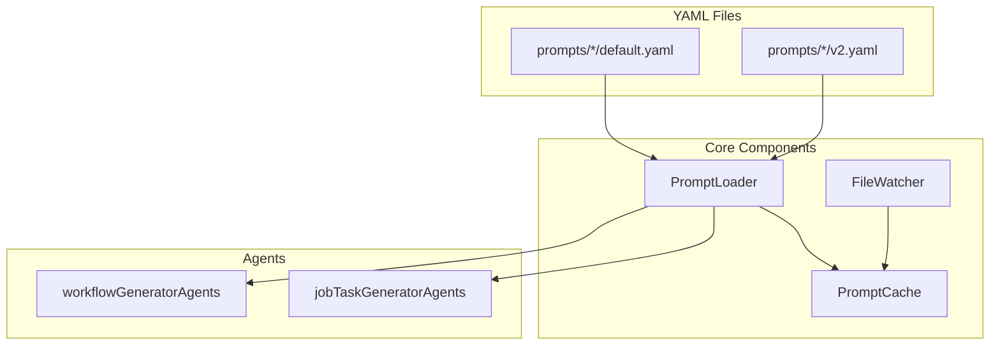

# プロンプト管理システム

## 概要

expertAgentのプロンプト管理システムは、YAMLベースの外部化・バージョン管理機能を提供します。これにより、エンジニア以外のメンバーでもプロンプトの編集が可能となり、ホットリロードによる即座の反映が実現されています。

## アーキテクチャ

### コンポーネント構成



### ディレクトリ構造

```
expertAgent/
├── prompts/
│   ├── requirement_clarification/
│   │   ├── default.yaml      # デフォルトバージョン
│   │   ├── v2.yaml           # バージョン2
│   │   └── v3.yaml           # バージョン3
│   ├── task_breakdown/
│   │   └── default.yaml
│   ├── interface_schema/
│   │   └── default.yaml
│   ├── evaluation/
│   │   └── default.yaml
│   ├── validation_fix/
│   │   └── default.yaml
│   └── workflow_generation/
│       └── default.yaml
└── app/services/
    ├── prompt_loader.py       # プロンプト読み込み
    ├── prompt_cache.py        # キャッシュ管理
    └── file_watcher.py        # ファイル監視
```

## 使用方法

### 1. 基本的な使用

```python
from app.services.prompt_loader import PromptLoader

# PromptLoaderインスタンス作成
loader = PromptLoader.create_default()

# デフォルトバージョンの読み込み
prompt_data = loader.load_prompt("requirement_clarification")
system_prompt = prompt_data.get("system_prompt")
version = prompt_data.get("version")  # "1.0"
```

### 2. バージョン指定

```python
# 特定バージョンの読み込み
prompt_data = loader.load_prompt("requirement_clarification", version="v2")

# 利用可能なバージョン一覧取得
versions = loader.list_versions("requirement_clarification")
# ["default", "v2", "v3"]
```

### 3. API経由でのバージョン指定

```python
from app.schemas.prompt_config import PromptConfig
from app.schemas.job_generator import JobGeneratorRequest

# リクエストでプロンプトバージョンを指定
request = JobGeneratorRequest(
    user_requirement="データ分析を実行したい",
    prompt_configs=[
        PromptConfig(
            agent_type="jobTaskGeneratorAgents",
            prompt_name="requirement_clarification",
            version="v2"  # v2を使用
        )
    ]
)
```

### 4. LangGraphエージェントでの利用

```python
# aiagent/langgraph/jobTaskGeneratorAgents/prompts/task_breakdown.py
from app.services.prompt_loader import PromptLoader

def _build_task_breakdown_system_prompt() -> str:
    """動的にプロンプトを読み込み、プレースホルダーを置換"""
    loader = PromptLoader.create_default()
    prompt_data = loader.load_prompt("task_breakdown")

    # YAMLから読み込んだプロンプト
    base_prompt = prompt_data.get("system_prompt", "")

    # 動的な部分を置換
    if base_prompt:
        expert_agent_capabilities = _build_expert_agent_capabilities()
        base_prompt = base_prompt.replace(
            "{expert_agent_capabilities}",
            expert_agent_capabilities
        )
        return base_prompt

    # フォールバック（YAML未定義時）
    return "デフォルトプロンプト..."
```

## YAMLファイル仕様

### 基本構造

```yaml
# prompts/requirement_clarification/default.yaml
version: "1.0"
name: "requirement_clarification"
description: "要件明確化のための対話型プロンプト"
author: "MySwiftAgent Team"
created_at: "2025-11-14"
updated_at: "2025-11-14"

# メタデータ
metadata:
  agent_type: "jobTaskGeneratorAgents"
  purpose: "ユーザー要件を構造化し明確化"
  threshold: 0.8
  principles:
    - "What（ビジネス目標）にフォーカス"
    - "一度に1つの質問"
    - "シンプルな言語使用"
    - "段階的な要件明確化"

# プロンプト本体
system_prompt: |
  あなたはドメインエキスパート向けのジョブ作成アシスタントです。

  ## あなたの役割
  ユーザーの要求を4つの観点から構造化して明確化し、
  仮説を立てて確認を得るアプローチを取ります。

  ## 4つの観点（重要度順）
  1. **処理内容** (35%) - 何をしたいか（最重要）
  2. **データソース** (25%) - どのデータを使うか
  3. **出力形式** (25%) - どのような形式で結果が欲しいか
  4. **スケジュール** (15%) - いつ実行するか
```

### プレースホルダー対応

動的な値を埋め込む場合、`{placeholder_name}` 形式を使用：

```yaml
system_prompt: |
  あなたはワークフロー設計の専門家です。

  ## 利用可能なAPI
  {expert_agent_capabilities}

  ## 実装不可能なタスク
  {infeasible_tasks_table}
```

## ホットリロード機能

### 動作原理

1. **ファイル監視**: watchdogライブラリがYAMLファイルの変更を検知
2. **キャッシュ無効化**: 変更されたプロンプトのキャッシュを自動削除
3. **自動再読み込み**: 次回アクセス時に新しい内容を自動読み込み

### 設定

```python
# app/services/file_watcher.py
class FileWatcher:
    def __init__(self, watch_dir: Path, cache: PromptCache):
        self.watch_dir = watch_dir
        self.cache = cache
        self.observer = Observer()

    def start(self):
        """ファイル監視を開始"""
        event_handler = YAMLChangeHandler(self.cache)
        self.observer.schedule(
            event_handler,
            str(self.watch_dir),
            recursive=True
        )
        self.observer.start()
```

## キャッシュ管理

### Singletonパターン

```python
class PromptCache:
    _instance = None

    @classmethod
    def get_instance(cls) -> "PromptCache":
        """Singletonインスタンスを取得"""
        if cls._instance is None:
            cls._instance = cls()
        return cls._instance
```

### キャッシュ操作

```python
# キャッシュに保存
cache.set("requirement_clarification_default", prompt_data)

# キャッシュから取得
cached_data = cache.get("requirement_clarification_default")

# 特定キーの無効化
cache.invalidate("requirement_clarification_default")

# 全キャッシュクリア
cache.clear()
```

## パフォーマンス

### ベンチマーク結果

| 操作 | 初回読み込み | キャッシュ読み込み | 高速化率 |
|-----|-------------|------------------|---------|
| requirement_clarification | 4.5ms | 2.0ms | 2.2x |
| task_breakdown | 6.2ms | 2.8ms | 2.2x |
| workflow_generation | 3.1ms | 1.4ms | 2.2x |

### 最適化のポイント

1. **遅延読み込み**: プロンプトは必要になった時点で初めて読み込み
2. **メモリキャッシュ**: 一度読み込んだプロンプトはメモリに保持
3. **部分無効化**: 変更されたファイルのみキャッシュから削除

## エラーハンドリング

### よくあるエラーと対処法

#### 1. YAMLパースエラー

```python
try:
    with open(yaml_path, encoding="utf-8") as f:
        prompt_data = yaml.safe_load(f)
except yaml.YAMLError as e:
    logger.error(f"Invalid YAML format in {yaml_path}: {e}")
    # デフォルトプロンプトにフォールバック
    return self._get_fallback_prompt(prompt_name)
```

#### 2. ファイル不在エラー

```python
if not yaml_path.exists():
    # default.yamlを探す
    default_path = prompt_dir / "default.yaml"
    if default_path.exists():
        return self._load_yaml_file(default_path)
    else:
        raise FileNotFoundError(f"No YAML found for {prompt_name}")
```

#### 3. キャッシュ競合状態

```python
with self._lock:  # スレッドセーフティ確保
    if cache_key in self._cache:
        return self._cache[cache_key]
    # キャッシュミス時の処理
```

## ベストプラクティス

### 1. プロンプト作成時

- **明確なバージョニング**: セマンティックバージョニング（1.0.0形式）を使用
- **包括的なメタデータ**: 作成者、目的、更新日を必ず記載
- **テスト可能性**: 各バージョンに対するテストケースを用意

### 2. プレースホルダー使用時

```yaml
# Good: 明確な命名
system_prompt: |
  {expert_agent_capabilities}
  {graphai_capabilities}

# Bad: 曖昧な命名
system_prompt: |
  {data1}
  {config}
```

### 3. バージョン管理

```yaml
# prompts/requirement_clarification/versions.yaml
versions:
  - version: "1.0"
    status: "deprecated"
    end_of_life: "2025-12-31"
  - version: "2.0"
    status: "stable"
    released: "2025-11-01"
  - version: "3.0"
    status: "experimental"
    released: "2025-11-14"
```

## トラブルシューティング

### Q: プロンプトの変更が反映されない

**原因**: キャッシュが残っている可能性

**対処法**:
```python
# キャッシュを手動でクリア
cache = PromptCache.get_instance()
cache.clear()

# またはサービス再起動
systemctl restart expertAgent
```

### Q: ホットリロードが動作しない

**原因**: FileWatcherが起動していない

**対処法**:
```python
# FileWatcherの状態確認
loader = PromptLoader.create_default()
if loader.file_watcher and loader.file_watcher.observer.is_alive():
    print("FileWatcher is running")
else:
    print("FileWatcher is not running")
    loader.file_watcher.start()
```

### Q: パフォーマンスが低下している

**原因**: キャッシュサイズが大きすぎる

**対処法**:
```python
# キャッシュサイズの確認と制限
cache = PromptCache.get_instance()
if len(cache._cache) > 100:
    # 古いエントリーを削除
    cache.clear()
```

## 今後の拡張計画

### 短期（〜3ヶ月）

1. **A/Bテスト機能**: 複数バージョンの並行評価
2. **プロンプト分析**: 使用頻度、成功率の追跡
3. **GUI管理画面**: Web UIでのプロンプト編集

### 中期（3〜6ヶ月）

1. **Git統合**: プロンプトバージョンとGitコミットの連携
2. **承認ワークフロー**: プロンプト変更の承認プロセス
3. **自動テスト**: プロンプト変更時の回帰テスト

### 長期（6ヶ月〜）

1. **MLOps統合**: プロンプトのA/Bテスト結果に基づく自動最適化
2. **多言語対応**: プロンプトの多言語管理
3. **プロンプトマーケットプレイス**: コミュニティプロンプトの共有

## 関連ドキュメント

- [API Reference](./API_REFERENCE.md) - API仕様詳細
- [Job Generation Workflow](../../docs/spec/job-generation-workflow.md) - ジョブ生成フロー
- [Operations Guide](../../docs/ops/prompt-operations.md) - 運用ガイド