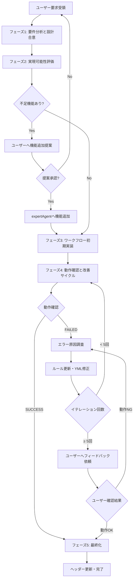

# GraphAI Workflow Generation Rules

このドキュメントは、GraphAI YMLワークフローファイルを自動生成する際のルールと設計指針をまとめています。

## 目次

1. [基本構造](#基本構造)
2. [必須要素](#必須要素)
3. [エージェント種別](#エージェント種別)
4. [データフローパターン](#データフローパターン)
5. [expertAgent API統合](#expertagent-api統合)
   - [テストモード機能](#テストモード機能)
6. [エラー回避パターン](#エラー回避パターン)
7. [パフォーマンスと並列処理の最適化](#パフォーマンスと並列処理の最適化)
8. [命名規則](#命名規則)
9. [デバッグとログ](#デバッグとログ)
10. [実装例](#実装例)
11. [YMLファイルのヘッダーコメント規約](#ymlファイルのヘッダーコメント規約)
12. [LLMワークフロー作成手順](#llmワークフロー作成手順)
13. [ワークフロー作成時の動作確認方法](#ワークフロー作成時の動作確認方法)

---

## 基本構造

### ファイルフォーマット

```yaml
version: 0.5
nodes:
  # ノード定義
  node_name:
    agent: agentType
    inputs:
      # 入力定義
    params:
      # パラメータ定義
    console:
      # デバッグログ設定
    isResult: true  # 最終出力ノードの場合
```

### 必須項目

- `version`: GraphAIバージョン（現在は `0.5` 固定）
- `nodes`: ノード定義オブジェクト
- 最低1つの `isResult: true` を持つ出力ノード

---

## 必須要素

### 1. sourceノード

ユーザー入力を受け取るエントリーポイント。

```yaml
nodes:
  source: {}
```

**重要**: `source` は実行時に文字列が直接注入される。プロパティアクセスは不要。

**正しい参照**:
```yaml
inputs:
  keywords: :source  # ✅ 正しい
```

**誤った参照**:
```yaml
inputs:
  keywords: :source.text  # ❌ 間違い（undefinedになる）
```

### 2. outputノード

最終結果を出力するノード。必ず `isResult: true` を設定。

```yaml
output:
  agent: copyAgent
  params:
    namedKey: text
  inputs:
    text: :previous_node.result
  isResult: true
```

---

## エージェント種別

### fetchAgent

外部API（expertAgent含む）を呼び出すエージェント。expertAgentだけでなく、**任意の外部APIも呼び出し可能**です。

```yaml
node_name:
  agent: fetchAgent
  inputs:
    url: http://127.0.0.1:8104/aiagent-api/v1/endpoint
    method: POST  # GET, POST, PUT, DELETEなど
    body:
      user_input: :previous_node
      model_name: gpt-oss:20b
  timeout: 30  # オプション: タイムアウト（秒）
  retry: 0     # オプション: リトライ回数
```

**外部API利用時の注意**:
- インターフェース（リクエスト/レスポンス形式）を明確に定義すること
- タイムアウト値を適切に設定すること
- エラーハンドリングを考慮すること

### anthropicAgent

Claude APIを直接呼び出すGraphAI標準エージェント。

```yaml
node_name:
  agent: anthropicAgent
  inputs:
    prompt: :previous_node
  params:
    model: claude-sonnet-4.5  # Claude Sonnet 4.5（最新）
    # または claude-opus-4.1（エージェントタスク特化）
```

### geminiAgent

Google Gemini APIを直接呼び出すGraphAI標準エージェント。

```yaml
node_name:
  agent: geminiAgent
  inputs:
    prompt: :previous_node
  params:
    model: gemini-2.5-pro  # Gemini 2.5 Pro（最新・最高精度）
    # または gemini-2.5-flash（高速・バランス型）
    # または gemini-2.5-flash-lite（超高速・低コスト）
```

### stringTemplateAgent

テンプレート文字列を生成するエージェント。

```yaml
prompt_builder:
  agent: stringTemplateAgent
  inputs:
    variable1: :source
    variable2: :other_node.result
  params:
    template: |-
      # プロンプトテンプレート
      ユーザー入力: ${variable1}
      追加情報: ${variable2}
```

### mapAgent

配列の各要素に対して並列処理を実行するエージェント。

```yaml
mapper:
  agent: mapAgent
  inputs:
    rows: :planner.result.outline  # 配列データ
  params:
    compositeResult: true  # 結果を統合
  graph:
    nodes:
      # 各要素に対して実行されるサブグラフ
      process_item:
        agent: fetchAgent
        inputs:
          url: http://127.0.0.1:8104/api/endpoint
          body:
            data: :row.field  # 各要素にアクセス
```

### arrayJoinAgent

配列を結合するエージェント。

```yaml
join_results:
  agent: arrayJoinAgent
  params:
    separator: \n---\n
  inputs:
    array: :mapper.result_field
```

### copyAgent

データをコピー・変換するエージェント。

```yaml
output:
  agent: copyAgent
  params:
    namedKey: text  # 特定のキーを抽出
  inputs:
    text: :previous_node.result
  isResult: true
```

---

## データフローパターン

### パターン1: シンプルな順次処理

```yaml
version: 0.5
nodes:
  source: {}

  process_step1:
    agent: fetchAgent
    inputs:
      url: http://127.0.0.1:8104/api/step1
      body:
        input: :source

  process_step2:
    agent: fetchAgent
    inputs:
      url: http://127.0.0.1:8104/api/step2
      body:
        input: :process_step1.result

  output:
    agent: copyAgent
    inputs:
      text: :process_step2.result
    isResult: true
```

### パターン2: プロンプトビルダーパターン

```yaml
version: 0.5
nodes:
  source: {}

  # パラメータ定義
  common_param:
    value:
      target: 39歳、男性
      tone: 深掘り討論

  # プロンプト構築
  prompt_builder:
    agent: stringTemplateAgent
    inputs:
      user_input: :source
      target: :common_param.target
    params:
      template: |-
        # 指示書
        対象ユーザー: ${target}

        # ユーザー入力
        ${user_input}

  # LLM実行
  llm_execution:
    agent: fetchAgent
    inputs:
      url: http://127.0.0.1:8104/aiagent-api/v1/mylllm
      method: POST
      body:
        user_input: :prompt_builder
        model_name: gpt-oss:20b

  output:
    agent: copyAgent
    inputs:
      text: :llm_execution.text
    isResult: true
```

### パターン3: 並列処理パターン（MapAgent）

```yaml
version: 0.5
nodes:
  source: {}

  # プランナー: タスクを複数の章に分割
  planner:
    agent: fetchAgent
    inputs:
      url: http://127.0.0.1:8104/aiagent-api/v1/aiagent/utility/jsonoutput
      method: POST
      body:
        user_input: :source
        model_name: gpt-oss:20b

  # 各章を並列処理
  process_mapper:
    agent: mapAgent
    inputs:
      rows: :planner.result.outline
    params:
      compositeResult: true
    graph:
      nodes:
        # Google検索
        search:
          agent: fetchAgent
          inputs:
            url: http://127.0.0.1:8104/aiagent-api/v1/utility/google_search
            method: POST
            body:
              queries: :row.query_hint

        # 情報収集
        explorer:
          agent: fetchAgent
          inputs:
            url: http://127.0.0.1:8104/aiagent-api/v1/aiagent/utility/explorer
            method: POST
            body:
              user_input: :row.overview
              search_result: :search.result
              model_name: gpt-oss:20b

        # 結果サマリー
        summary:
          agent: stringTemplateAgent
          inputs:
            title: :row.title
            content: :explorer.result
          params:
            template: |-
              ### ${title}
              ${content}
          isResult: true

  # 結果統合
  join_results:
    agent: arrayJoinAgent
    params:
      separator: \n---\n
    inputs:
      array: :process_mapper.summary

  output:
    agent: copyAgent
    inputs:
      text: :join_results.text
    isResult: true
```

---

## expertAgent API統合

### 重要: ポート番号とエンドポイント

**正しいポート番号**: `8104`（expertAgent）

```yaml
# ✅ 正しい
url: http://127.0.0.1:8104/aiagent-api/v1/endpoint

# ❌ 間違い
url: http://127.0.0.1:8000/aiagent-api/v1/endpoint  # ポート8000は使用不可
```

### 主要エンドポイント

#### 1. `/aiagent-api/v1/mylllm` - 汎用LLM実行

**提供サービス**: 任意のLLMモデルを指定してテキスト生成を実行。ローカルLLM（gpt-oss、Ollama）およびクラウドLLM（Gemini、Claude、GPT）に対応。

**用途**: シンプルなテキスト生成、要約、翻訳、質問応答など基本的なLLMタスク。

```yaml
llm_node:
  agent: fetchAgent
  inputs:
    url: http://127.0.0.1:8104/aiagent-api/v1/mylllm
    method: POST
    body:
      user_input: :prompt_builder
      model_name: gpt-oss:20b  # モデル指定（後述）
      system_input: システムプロンプト（オプション）
```

#### 2. `/aiagent-api/v1/aiagent/utility/jsonoutput` - JSON構造化出力

**提供サービス**: LLMにJSON形式での出力を指示し、生成されたテキストをJSONとしてパース・検証して返却。構造化データの確実な生成を保証。

**用途**: アウトライン生成、タスク分割リスト、データベース挿入用構造化データ、API連携用フォーマット変換。

```yaml
json_output:
  agent: fetchAgent
  inputs:
    url: http://127.0.0.1:8104/aiagent-api/v1/aiagent/utility/jsonoutput
    method: POST
    body:
      user_input: :prompt_with_json_format
      model_name: gpt-oss:120b
```

#### 3. `/aiagent-api/v1/aiagent/utility/explorer` - 情報収集エージェント

**提供サービス**: 複数の情報源から情報を収集・分析し、詳細なレポートを生成。検索結果の深掘り調査、情報の統合・整理、エビデンスベースの分析を実行。

**用途**: 市場調査レポート、技術動向分析、競合分析、学術的調査、複数情報源からの包括的な情報整理。

**🆕 利用可能なMCPツール**:
- **html2markdown**: WebページをMarkdown形式に変換（Webページからのテキスト・情報抽出に最適、Playwright Agentより高精度）
- **google_search**: Google Custom Search APIでキーワード検索
- **gmail_search**: Gmail検索（OAuth2認証、MyVault経由）

**推奨用途**: Webページからのテキスト抽出は **html2markdown** を使用することで、Playwright Agentより高精度な結果が得られます。

```yaml
explorer:
  agent: fetchAgent
  inputs:
    url: http://127.0.0.1:8104/aiagent-api/v1/aiagent/utility/explorer
    method: POST
    body:
      user_input: :prompt_builder
      search_result: :previous_search.result  # オプション: 事前検索結果
      model_name: gpt-oss:120b
```

#### 4. `/aiagent-api/v1/aiagent/utility/action` - アクション実行エージェント

**提供サービス**: ユーザーの指示に基づき、メール送信、ファイル操作、外部API呼び出しなど実世界のアクションを実行。LangGraphベースのエージェントが利用可能なツールを自動選択・実行。

**用途**: Gmail経由のメール送信、Google Driveファイル操作、カレンダー操作、自動化されたワークフロー実行、外部サービスとの統合。

**注意: 利用可能なツールの制約**
`action` エージェントが内部で使用するツールには、それぞれ固有の制約が存在する場合があります。

**例: `send_email_tool` の場合**
- **宛先の固定**: 現在の実装では、メールの宛先はツール内部で設定された固定のアドレスとなっており、プロンプトから動的に宛先を指定することはできません。

ワークフロー設計時には、このようなツールの制約を考慮する必要があります。

```yaml
action:
  agent: fetchAgent
  inputs:
    url: http://127.0.0.1:8104/aiagent-api/v1/aiagent/utility/action
    method: POST
    body:
      user_input: :action_prompt
      model_name: gpt-oss:20b
      project: default_project  # オプション: プロジェクト指定
```

#### 5. `/aiagent-api/v1/aiagent/utility/playwright` - Webブラウザ操作エージェント

**提供サービス**: Playwrightを使用した高度なWebブラウザ自動操作。フォーム入力・送信、ボタンクリック、スクリーンショット取得、JavaScript実行に対応。

**⚠️ 重要な制限事項**:
- **Webサイトからの情報抽出には不向き**: ブラウザの構造化データ取得の精度が低く、特定要素の抽出が困難
- **推奨用途**: フォーム操作、スクリーンショット取得、JavaScript実行など、ブラウザ操作が必要な場合のみ
- **代替手段**: Webページからのテキスト・情報抽出には **Explorer Agent（html2markdown）** の使用を強く推奨

**適切な用途**: ログイン必須サイトへのアクセス、フォーム自動入力、UI操作の自動化、スクリーンショット取得、JavaScript実行。

```yaml
playwright:
  agent: fetchAgent
  inputs:
    url: http://127.0.0.1:8104/aiagent-api/v1/aiagent/utility/playwright
    method: POST
    body:
      user_input: :scraping_instruction  # 自然言語での操作指示
      model_name: gpt-oss:20b  # 操作プラン生成用モデル
      # 返却: { "result": "抽出されたデータ", "screenshot": "base64画像（オプション）" }
```

#### 6. `/aiagent-api/v1/aiagent/utility/wikipedia` - Wikipedia検索エージェント

**提供サービス**: Wikipedia APIを使用した百科事典情報の検索・要約。指定言語（日本語・英語など）でのページ内容取得と、LLMによる分かりやすい要約を提供。

**用途**: 用語の基礎知識調査、歴史的背景の理解、専門用語の説明、学術研究の前提知識収集、教育コンテンツ作成。

```yaml
wikipedia:
  agent: fetchAgent
  inputs:
    url: http://127.0.0.1:8104/aiagent-api/v1/aiagent/utility/wikipedia
    method: POST
    body:
      user_input: :search_query  # 検索キーワードまたは質問
      model_name: gpt-oss:20b
      language: ja  # 言語コード（ja, en等、デフォルト: ja）
      # 返却: { "summary": "Wikipediaの要約", "source_url": "元記事URL" }
```

#### 7. `/aiagent-api/v1/utility/google_search` - Google検索

**提供サービス**: Google Serper APIを使用して複数クエリのWeb検索を一括実行。検索結果（タイトル、URL、スニペット）を構造化データとして返却。

**用途**: 最新ニュース収集、市場調査、トレンド分析、複数トピックの並列調査、情報収集エージェントの前段処理。

```yaml
search:
  agent: fetchAgent
  inputs:
    url: http://127.0.0.1:8104/aiagent-api/v1/utility/google_search
    method: POST
    body:
      queries: :query_list  # List[str] - 検索クエリのリスト
      num: 3  # 各クエリの取得結果数（デフォルト: 3）
      # 返却: { "results": [{ "title": "...", "link": "...", "snippet": "..." }, ...] }
```

#### 8. `/aiagent-api/v1/utility/google_search_overview` - Google検索概要

**提供サービス**: Google検索結果を取得し、LLMによる要約・サマリーを生成。検索結果の簡潔な概要を自然言語で提供。

**用途**: クイックリサーチ、トピックの即時理解、検索結果の効率的な把握、プレゼンテーション用サマリー作成。

```yaml
search_overview:
  agent: fetchAgent
  inputs:
    url: http://127.0.0.1:8104/aiagent-api/v1/utility/google_search_overview
    method: POST
    body:
      queries: :query_list  # List[str]
      num: 3  # 各クエリの取得結果数（オプション）
      model_name: gpt-oss:20b  # サマリー生成用モデル
      # 返却: { "summary": "検索結果の要約テキスト" }
```

#### 9. `/aiagent-api/v1/utility/tts_and_upload_drive` - 音声合成＆Google Drive連携

**提供サービス**: テキスト台本を音声合成（Text-to-Speech）でMP3/MP4ファイルに変換し、Google Driveにアップロード。アップロード完了後、共有可能なリンクURLを返却。

**用途**: ポッドキャスト台本の音声化、プレゼンテーション音声作成、教育コンテンツの音声版生成、音声配信コンテンツの自動生成・公開。

```yaml
tts_upload:
  agent: fetchAgent
  inputs:
    url: http://127.0.0.1:8104/aiagent-api/v1/utility/tts_and_upload_drive
    method: POST
    body:
      user_input: :podcast_script  # 音声化する台本テキスト
      # 返却: { "drive_link": "https://drive.google.com/...", "file_id": "..." }
```

#### 10. `/aiagent-api/v1/aiagent/sample` - サンプルエージェント

LangGraphベースのサンプルエージェント実行。

```yaml
sample:
  agent: fetchAgent
  inputs:
    url: http://127.0.0.1:8104/aiagent-api/v1/aiagent/sample
    method: POST
    body:
      user_input: :instruction
      project: default_project  # プロジェクト名（オプション）
```

### テストモード機能

**🆕 すべてのexpertAgentエンドポイントでテストモードが利用可能です。**

テストモードを使用すると、実際のLLM呼び出しや外部API呼び出しを行わず、事前に定義したモックレスポンスを返却できます。これにより、ワークフロー開発時のトライアンドエラーを大幅に削減できます。

#### テストモードの利点

1. **開発時間の短縮**: LLM呼び出しなしでレスポンス構造を確認可能
2. **コスト削減**: テスト時のLLM API呼び出しコストが不要
3. **エラー特定の効率化**: レスポンス構造の問題とYML記述ミスを明確に分離
4. **高速な反復開発**: 即座にレスポンスが返るため、ワークフロー構造のみを素早く検証可能

#### 使用方法

すべてのexpertAgentエンドポイントで以下の2つのパラメータが使用可能です：

- **`test_mode`**: `true` に設定するとテストモードが有効化されます（デフォルト: `false`）
- **`test_response`**: テストモード時に返却するモックレスポンス（文字列または辞書）

#### テストレスポンスの形式

**文字列レスポンス** - 簡単なテキスト返却:
```yaml
body:
  user_input: :source
  test_mode: true
  test_response: "これはテストレスポンスです"
```

返却されるレスポンス:
```json
{
  "result": "これはテストレスポンスです",
  "text": "これはテストレスポンスです",
  "type": "mylllm_test"
}
```

**辞書型レスポンス** - カスタムフィールドを含む構造化データ（推奨）:
```yaml
body:
  user_input: :source
  test_mode: true
  test_response:
    result:
      outline:
        - title: "第1章"
          overview: "概要1"
          query_hint: ["クエリ1", "クエリ2"]
        - title: "第2章"
          overview: "概要2"
          query_hint: ["クエリ3", "クエリ4"]
```

返却されるレスポンス:
```json
{
  "result": {
    "outline": [
      {"title": "第1章", "overview": "概要1", "query_hint": ["クエリ1", "クエリ2"]},
      {"title": "第2章", "overview": "概要2", "query_hint": ["クエリ3", "クエリ4"]}
    ]
  }
}
```

**辞書型の利点**: GraphAIワークフローで `:node.field` アクセスが可能になり、複雑なデータフロー検証ができます。

#### 実践例1: プランナーのテスト

jsonoutputエンドポイントでアウトライン構造をテスト:

```yaml
planner_test:
  agent: fetchAgent
  inputs:
    url: http://127.0.0.1:8104/aiagent-api/v1/aiagent/utility/jsonoutput
    method: POST
    body:
      user_input: :source
      test_mode: true
      test_response:
        result:
          outline:
            - title: "【序論】量子コンピュータとは"
              overview: "量子コンピュータの基本原理を説明"
              query_hint: ["量子コンピュータ 基本", "量子ビット"]
            - title: "【本論】最新動向"
              overview: "2025年の技術動向"
              query_hint: ["量子コンピュータ 2025", "量子超越性"]
```

データアクセス:
- `:planner_test.result.outline` → 配列全体にアクセス
- mapAgentで `:row.title`, `:row.overview`, `:row.query_hint` にアクセス可能

#### 実践例2: MapAgentと組み合わせたテスト

プランナー + マッパー + エクスプローラーの全体をテストモードで検証:

```yaml
version: 0.5
nodes:
  source: {}

  # プランナー（テストモード）
  planner:
    agent: fetchAgent
    inputs:
      url: http://127.0.0.1:8104/aiagent-api/v1/aiagent/utility/jsonoutput
      method: POST
      body:
        user_input: :source
        test_mode: true
        test_response:
          result:
            outline:
              - title: "Chapter 1"
                overview: "Overview 1"
                query_hint: ["query 1", "query 2"]
              - title: "Chapter 2"
                overview: "Overview 2"
                query_hint: ["query 3", "query 4"]

  # マッパー（各章を並列処理）
  mapper:
    agent: mapAgent
    inputs:
      rows: :planner.result.outline  # テストレスポンスの配列にアクセス
    graph:
      nodes:
        # 検索（テストモード）
        search:
          agent: fetchAgent
          inputs:
            url: http://127.0.0.1:8104/aiagent-api/v1/utility/google_search
            method: POST
            body:
              queries: :row.query_hint  # テストレスポンスのフィールドにアクセス
              test_mode: true
              test_response:
                results:
                  - title: "Search Result"
                    url: "https://example.com"

        # エクスプローラー（テストモード）
        explorer:
          agent: fetchAgent
          inputs:
            url: http://127.0.0.1:8104/aiagent-api/v1/aiagent/utility/explorer
            method: POST
            body:
              user_input: :row.overview  # テストレスポンスのフィールドにアクセス
              test_mode: true
              test_response:
                result: "詳細レポートのテキスト"
          isResult: true

  output:
    agent: copyAgent
    inputs:
      text: :mapper
    isResult: true
```

このワークフローでは：
1. プランナーがモックのアウトラインを返却
2. マッパーが各章に対してループ処理
3. 検索とエクスプローラーがそれぞれテストレスポンスを返却
4. すべてLLM呼び出しなしで、ワークフロー構造を素早く検証可能

#### 実践例3: 段階的な本番移行

開発段階に応じてテストモードと本番モードを組み合わせ:

```yaml
# フェーズ1: 全体をテストモードで構造検証
planner:
  inputs:
    body:
      test_mode: true
      test_response: { ... }

# フェーズ2: プランナーのみ本番実行、後続はテスト
planner:
  inputs:
    body:
      test_mode: false  # 本番LLM実行

explorer:
  inputs:
    body:
      test_mode: true  # まだテスト
      test_response: "..."

# フェーズ3: 全体を本番実行
# test_mode パラメータを削除またはfalse設定
```

#### 対応エンドポイント

以下のすべてのエンドポイントでテストモードが利用可能です：

- `/aiagent-api/v1/mylllm`
- `/aiagent-api/v1/aiagent/sample`
- `/aiagent-api/v1/aiagent/utility/jsonoutput`
- `/aiagent-api/v1/aiagent/utility/explorer`
- `/aiagent-api/v1/aiagent/utility/action`
- `/aiagent-api/v1/aiagent/utility/playwright`
- `/aiagent-api/v1/aiagent/utility/wikipedia`
- `/aiagent-api/v1/aiagent/utility/file_reader`
- `/aiagent-api/v1/utility/google_search`
- `/aiagent-api/v1/utility/google_search_overview`
- `/aiagent-api/v1/utility/tts_and_upload_drive`

#### 注意事項

- `test_mode: false` または省略時は通常の本番実行になります
- `test_response` が `null` の場合はデフォルトメッセージが返却されます
- 文字列レスポンスは自動で標準レスポンス形式にラップされます
- 辞書型レスポンスはそのまま返却されるため、GraphAIでの柔軟なデータアクセスが可能です

### 利用可能なモデル

expertAgentのすべてのエンドポイントで `model_name` パラメータによりモデルを指定できます。

#### ローカルLLMモデル（推奨）

| モデル名 | 用途 | 特徴 | パラメータ数 |
|---------|------|------|------------|
| **gpt-oss:120b** | 複雑な処理 | 高精度、詳細な分析、複雑な推論 | 120B |
| **gpt-oss:20b** | 通常の処理 | バランス型、日常的なタスク | 20B |
| **pielee/qwen3-4b-thinking-2507_q8** | 軽量処理 | 高速、シンプルなタスク | 4B  |

**ローカルLLMの利点**:
- API料金不要
- プライバシー保護
- レスポンス速度の安定性

#### クラウドLLMモデル

| モデル名 | プロバイダー | 特徴 | リリース |
|---------|------------|------|---------|
| **gemini-2.5-pro** | Google | 最高精度、思考プロセス付き、100万トークンコンテキスト | 2025年3月 |
| **gemini-2.5-flash** | Google | 高速、コスト効率、バランス型 | 2025年6月 |
| **gemini-2.5-flash-lite** | Google | 超高速、最小コスト | 2025年6月 |
| **claude-sonnet-4.5** | Anthropic | コーディング世界最高、複雑なエージェント構築に最適 | 2025年9月 |
| **claude-opus-4.1** | Anthropic | エージェントタスク・実世界コーディング・推論に特化 | 2025年発表 |
| **gpt-5** | OpenAI | 統合システム、27万トークン入力、コーディング・数学に優れる | 2025年8月 |
| **gpt-5-mini** | OpenAI | バランス型、コスト効率重視 | 2025年8月 |
| **gpt-5-nano** | OpenAI | 軽量・超低コスト | 2025年8月 |

#### その他のローカルモデル（Ollama）

- **qwen3-next-80b-a3b-thinking-mlx**: 80Bパラメータ、思考プロセス付き
- **gemma3n:latest**: Google Gemma系軽量モデル

#### モデル選択ガイドライン

| タスクの種類 | 推奨モデル | 理由 |
|------------|----------|------|
| **複雑な推論・分析** | gpt-oss:120b | パラメータ数が多く詳細な処理が可能 |
| **レポート生成** | gpt-oss:120b | 長文生成、文脈理解に優れる |
| **情報収集・要約** | gpt-oss:20b | バランスが良く、実用的 |
| **JSON出力** | gpt-oss:20b | 構造化出力に十分な性能 |
| **簡単な変換** | pielee/qwen3-4b-thinking-2507_q8 | 高速処理、軽量タスク向け |
| **クリエイティブ作業** | gemini-2.5-pro / claude-sonnet-4.5 | クラウドモデルの強み |

---

## エラー回避パターン

### 1. sourceノードの参照エラー

**エラー**: `undefined` が出力に含まれる

**原因**: `:source.text` のように存在しないプロパティを参照

**解決策**:
```yaml
# ❌ 間違い
inputs:
  keywords: :source.text

# ✅ 正しい
inputs:
  keywords: :source
```

### 2. 非同期関数のawait漏れ

**エラー**: `RuntimeWarning: coroutine was never awaited`

**原因**: MCP toolsで非同期関数を同期的に呼び出している

**解決策**: expertAgent側のPythonコードで `await` を追加
```python
# ❌ 間違い
return get_overview_by_google_serper(input_query)

# ✅ 正しい
return await get_overview_by_google_serper(input_query)
```

### 3. ポート番号の誤り

**エラー**: `fetch failed` - connection refused

**原因**: 間違ったポート番号を使用（8000など）

**解決策**:
```yaml
# ❌ 間違い
url: http://127.0.0.1:8000/api/endpoint

# ✅ 正しい
url: http://127.0.0.1:8104/api/endpoint
```

### 4. mapAgentでのデータ参照エラー

**エラー**: `:row.field` が undefined

**原因**: 配列要素の構造を正しく理解していない

**解決策**:
```yaml
# planner が以下を返す場合:
# { "outline": [{"title": "...", "query_hint": ["..."]}] }

mapper:
  agent: mapAgent
  inputs:
    rows: :planner.result.outline  # ✅ .outline まで指定
  graph:
    nodes:
      process:
        inputs:
          title: :row.title        # ✅ 各要素のフィールドにアクセス
          queries: :row.query_hint # ✅
```

### 5. APIエンドポイントの不一致

**エラー**: `Cannot POST /api/v1/workflow/execute`

**原因**: ドキュメント等で参照したエンドポイントが、実際の `graphAiServer` の実装と異なっている。

**解決策**: `graphAiServer/src/app.ts` などのルーティング定義ファイルを確認し、正しいエンドポイントを使用する。2025年10月現在、ワークフロー実行用のエンドポイントは `POST /api/v1/myagent` です。

```bash
# ❌ 間違い
curl -X POST http://127.0.0.1:8105/api/v1/workflow/execute

# ✅ 正しい
curl -X POST http://127.0.0.1:8105/api/v1/myagent
```

---

## パフォーマンスと並列処理の最適化

### 並列処理における注意事項

mapAgentで大量の並列処理を実行する際、以下のパフォーマンス問題が発生する可能性があります：

1. **expertAgentサービスの過負荷**
2. **HTTPタイムアウトエラー（fetch failed）**
3. **リクエストキューイングによる遅延**

### 問題発生パターンの例

以下のような並列処理YAMLは問題を引き起こす可能性があります：

```yaml
# ❌ 問題あり: 並列数の制限なし
explorer_mapper:
  agent: mapAgent
  inputs:
    rows: :planner.result.outline  # 仮に4章のデータ
  params:
    compositeResult: true
  graph:
    nodes:
      explorer:
        agent: fetchAgent
        inputs:
          url: http://127.0.0.1:8104/aiagent-api/v1/aiagent/utility/explorer
          method: POST
          body:
            user_input: :row.overview
            model_name: gpt-oss:20b  # 重い処理
```

**問題点**:
- 4章すべてが同時にexpertAgentへリクエスト
- expertAgent（デフォルトは1ワーカー）が過負荷
- 4番目のリクエストがタイムアウト（fetch failed）

### 解決策1: mapAgentの並列数制限

`concurrency` パラメータで並列実行数を制限します：

```yaml
# ✅ 改善版: 並列数を2に制限
explorer_mapper:
  agent: mapAgent
  inputs:
    rows: :planner.result.outline
  params:
    compositeResult: true
    concurrency: 2  # 同時実行を2つまでに制限
  graph:
    nodes:
      explorer:
        agent: fetchAgent
        inputs:
          url: http://127.0.0.1:8104/aiagent-api/v1/aiagent/utility/explorer
          method: POST
          body:
            user_input: :row.overview
            model_name: gpt-oss:20b
```

**効果**:
- 4章を2つずつ順次処理（バッチ処理）
- expertAgentへの同時リクエストが2つまで
- サービス過負荷を防止

**concurrency値の決め方**:
| 処理の重さ | 推奨並列数 | 説明 |
|----------|----------|------|
| **軽量** (Google検索のみ) | 4-8 | expertAgentへの負荷が小さい |
| **中程度** (explorer, jsonoutput) | 2-3 | LLM処理あり、中程度の負荷 |
| **重い** (gpt-oss:120b等の大型モデル) | 1-2 | 大型LLMモデル使用時 |

### 解決策2: グローバルfetchタイムアウトの延長

Node.jsのデフォルトHTTPタイムアウト（約10秒）は、LLM処理には短すぎます。

**graphAiServer起動時の設定** (src/index.ts):

```typescript
// Configure global fetch timeout (300 seconds)
const originalFetch = global.fetch;
global.fetch = async (url: RequestInfo | URL, options?: RequestInit): Promise<Response> => {
  const controller = new AbortController();
  const timeoutId = setTimeout(() => controller.abort(), 300000); // 300 seconds

  try {
    const response = await originalFetch(url, {
      ...options,
      signal: controller.signal,
    });
    return response;
  } finally {
    clearTimeout(timeoutId);
  }
};
```

**効果**:
- すべてのfetchAgent呼び出しに300秒タイムアウトが適用
- LLM処理の長時間実行に対応
- タイムアウトエラー（fetch failed）を防止

**タイムアウト値の選択**:
- **30秒**: 軽量なAPI呼び出し（Google検索、単純な応答）
- **60秒**: 中程度のLLM処理（gpt-oss:20b, gemini-2.5-flash）
- **300秒**: 大型LLM処理（gpt-oss:120b, gemini-2.5-pro, 複雑なexplorer処理）

### 解決策3: expertAgentのワーカー数増加

expertAgentはデフォルトで1ワーカーで起動します。並列リクエストに対応するには、ワーカー数を増やす必要があります。

**dev-start.shでの設定**:

```bash
# ❌ デフォルト: 1ワーカー
uv run uvicorn app.main:app --host 0.0.0.0 --port 8104

# ✅ 改善版: 4ワーカー
uv run uvicorn app.main:app --host 0.0.0.0 --port 8104 --workers 4
```

**ワーカー数の決め方**:
- **基本方針**: `ワーカー数 ≥ mapAgent の concurrency`
- **推奨設定**:
  - concurrency: 2 → workers: 4（余裕を持たせる）
  - concurrency: 4 → workers: 4-8
  - concurrency: 8 → workers: 8-16

**注意点**:
- ワーカー数を増やすとメモリ使用量が増加
- CPU コア数も考慮する（コア数 × 2 程度が上限目安）

### 3層アーキテクチャでの最適化

並列処理の安定性を確保するには、3層すべてで対策が必要です：

| 層 | 対策 | 設定場所 | 効果 |
|----|------|---------|------|
| **Layer 1: Client** | 並列数制限 | YAMLファイル (`concurrency: 2`) | リクエスト過負荷防止 |
| **Layer 2: Transport** | タイムアウト延長 | graphAiServer/src/index.ts | 長時間処理対応 |
| **Layer 3: Server** | ワーカー増加 | dev-start.sh (`--workers 4`) | 真の並列処理実現 |

### トラブルシューティング: "fetch failed" エラー

#### 症状

```
TypeError: fetch failed
    at node:internal/deps/undici/undici:15363:13
```

並列処理の途中（例: 4章中の4番目）で発生

#### 診断手順

1. **ログのタイムスタンプ確認**:
```bash
grep "explorer_mapper start" logs/graphaiserver.log
# すべてのリクエストが同時刻に集中していないか確認
```

2. **expertAgentのワーカー数確認**:
```bash
grep "Started server process" logs/expertagent.log | wc -l
# 1の場合は並列処理に対応できていない
```

3. **並列数確認**:
YAMLファイルでmapAgentに `concurrency` パラメータがあるか確認

#### 解決手順

```yaml
# 1. YAMLに並列数制限を追加
explorer_mapper:
  agent: mapAgent
  params:
    concurrency: 2  # ← 追加
```

```typescript
// 2. graphAiServer/src/index.ts でタイムアウト延長
// （上記「解決策2」のコード参照）
```

```bash
# 3. expertAgentのワーカー数増加
# dev-start.sh を編集して --workers 4 を追加

# 4. サービス再起動
./scripts/dev-start.sh restart
```

### ベストプラクティス

#### 新規ワークフロー設計時

1. **並列処理の規模を見積もる**:
   - 処理する配列の要素数（章数、アイテム数）
   - 各要素の処理時間（LLMモデルの種類）

2. **concurrency値を設定**:
   - 軽量処理: 4-8
   - 中程度: 2-3
   - 重い処理: 1-2

3. **expertAgentのワーカー数を調整**:
   - `workers ≥ concurrency` を確保

4. **タイムアウトを確認**:
   - グローバルタイムアウトが300秒に設定済みか確認

#### 既存ワークフローの改善

以下のエラーが発生する場合は並列処理の最適化を検討：

- ❌ `TypeError: fetch failed`
- ❌ タイムアウトエラー
- ❌ 4番目以降の処理が失敗
- ❌ expertAgentのログに処理記録がない

**チェックリスト**:
- [ ] mapAgentに `concurrency` パラメータがある
- [ ] graphAiServer/src/index.ts でグローバルタイムアウト設定済み
- [ ] dev-start.sh で expertAgent に `--workers 4` 以上を設定
- [ ] 負荷テストで4-8並列処理が成功する

---

## 命名規則

### ノード名

- **小文字スネークケース**: `node_name`, `prompt_builder`
- **意味のある名前**: 処理内容が分かる名前を使用
- **接尾辞の使用**:
  - `_builder`: プロンプト構築ノード
  - `_mapper`: mapAgentノード
  - `_search`: 検索ノード
  - `_output`: 結果統合ノード

### 例

```yaml
nodes:
  source: {}

  # プロンプト構築
  pre_planner_prompt_builder:
    agent: stringTemplateAgent

  # プランニング
  pre_planner:
    agent: fetchAgent

  # 検索
  pre_explorer_search:
    agent: fetchAgent

  # 情報収集
  pre_explorer:
    agent: fetchAgent

  # 本処理のプロンプト
  planner_prompt_builder:
    agent: stringTemplateAgent

  # 本処理
  planner:
    agent: fetchAgent

  # 並列処理
  explorer_mapper:
    agent: mapAgent

  # 結果統合
  explorer_mapper_output:
    agent: arrayJoinAgent

  # 最終生成
  generator:
    agent: fetchAgent

  # アクション実行
  action:
    agent: fetchAgent

  # 最終出力
  output:
    agent: copyAgent
    isResult: true
```

---

## デバッグとログ

### consoleログの設定

```yaml
node_name:
  agent: fetchAgent
  console:
    before: node_name start  # 実行前ログ
    after: true              # 実行後に結果を出力
  inputs:
    # ...
```

### テンプレート変数のデバッグ

```yaml
prompt_builder:
  agent: stringTemplateAgent
  console:
    before: prompt_builder start
    after: true  # テンプレート展開結果を確認
  inputs:
    variable1: :source
  params:
    template: |-
      変数1: ${variable1}
```

### 推奨ログ設定

- **開発時**: すべてのノードで `after: true` を設定
- **本番**: 重要なノード（planner, generator, action）のみ `after: true`

---

## 実装例

### 例1: シンプルなLLM呼び出し

```yaml
version: 0.5
nodes:
  source: {}

  llm_call:
    agent: fetchAgent
    console:
      before: llm_call start
      after: true
    inputs:
      url: http://127.0.0.1:8104/aiagent-api/v1/mylllm
      method: POST
      body:
        user_input: :source
        model_name: gpt-oss:20b

  output:
    agent: copyAgent
    console:
      before: output start
    inputs:
      text: :llm_call.text
    isResult: true
```

### 例2: Google検索 → 情報整理 → レポート生成

```yaml
version: 0.5
nodes:
  source: {}

  # 検索クエリ生成
  query_builder:
    agent: stringTemplateAgent
    inputs:
      topic: :source
    params:
      template: |-
        # 指示書
        以下のトピックに関する検索クエリを3つ生成してください。

        トピック: ${topic}

        # 出力形式（JSON）
        {
          "querylist": ["クエリ1", "クエリ2", "クエリ3"]
        }

  query_generator:
    agent: fetchAgent
    inputs:
      url: http://127.0.0.1:8104/aiagent-api/v1/aiagent/utility/jsonoutput
      method: POST
      body:
        user_input: :query_builder
        model_name: gpt-oss:20b

  # Google検索実行
  search:
    agent: fetchAgent
    console:
      after: true
    inputs:
      url: http://127.0.0.1:8104/aiagent-api/v1/utility/google_search
      method: POST
      body:
        queries: :query_generator.result.querylist
        num: 3

  # 情報整理
  info_organizer_prompt:
    agent: stringTemplateAgent
    inputs:
      topic: :source
      search_result: :search.result
    params:
      template: |-
        # 指示書
        以下の検索結果を整理し、重要な情報を箇条書きでまとめてください。

        トピック: ${topic}

        検索結果:
        ${search_result}

  info_organizer:
    agent: fetchAgent
    inputs:
      url: http://127.0.0.1:8104/aiagent-api/v1/aiagent/utility/explorer
      method: POST
      body:
        user_input: :info_organizer_prompt
        model_name: gpt-oss:120b

  # レポート生成
  report_generator_prompt:
    agent: stringTemplateAgent
    inputs:
      topic: :source
      organized_info: :info_organizer.result
    params:
      template: |-
        # 指示書
        以下の情報を元に、包括的なレポートを作成してください。

        トピック: ${topic}

        整理された情報:
        ${organized_info}

  report_generator:
    agent: fetchAgent
    console:
      after: true
    inputs:
      url: http://127.0.0.1:8104/aiagent-api/v1/mylllm
      method: POST
      body:
        user_input: :report_generator_prompt
        model_name: gpt-oss:120b

  output:
    agent: copyAgent
    inputs:
      text: :report_generator.text
    isResult: true
```

### 例3: ポッドキャスト台本生成（複雑な並列処理）

```yaml
version: 0.5
nodes:
  source: {}

  common_param:
    value:
      target: 39歳、男性

  # 検索クエリ生成
  pre_planner_prompt_builder:
    agent: stringTemplateAgent
    inputs:
      keywords: :source
    params:
      template: |-
        # 指示書
        以下のキーワードに関するGoogle検索クエリを2-3個生成してください。

        キーワード: ${keywords}

        # 出力形式（JSON）
        {
          "querylist": ["クエリ1", "クエリ2", "クエリ3"]
        }

  pre_planner:
    agent: fetchAgent
    inputs:
      url: http://127.0.0.1:8104/aiagent-api/v1/aiagent/utility/jsonoutput
      method: POST
      body:
        user_input: :pre_planner_prompt_builder
        model_name: gpt-oss:120b

  # 事前検索
  pre_explorer_search:
    agent: fetchAgent
    inputs:
      url: http://127.0.0.1:8104/aiagent-api/v1/utility/google_search
      method: POST
      body:
        queries: :pre_planner.result.querylist
        num: 3

  # 事前情報収集
  pre_explorer_prompt_builder:
    agent: stringTemplateAgent
    inputs:
      keywords: :source
      target: :common_param.target
      search_result: :pre_explorer_search.result
    params:
      template: |-
        # 指示書
        以下の検索結果から重要な用語と事実を抽出してください。

        対象: ${target}
        キーワード: ${keywords}

        検索結果:
        ${search_result}

  pre_explorer:
    agent: fetchAgent
    inputs:
      url: http://127.0.0.1:8104/aiagent-api/v1/aiagent/utility/explorer
      method: POST
      body:
        user_input: :pre_explorer_prompt_builder
        model_name: gpt-oss:120b

  # アウトライン生成
  planner_prompt_builder:
    agent: stringTemplateAgent
    inputs:
      keywords: :source
      target: :common_param.target
      infolist: :pre_explorer.result
    params:
      template: |-
        # 指示書
        以下の情報を元に、ポッドキャスト台本のアウトラインを生成してください。

        対象: ${target}
        キーワード: ${keywords}

        収集情報:
        ${infolist}

        # 出力形式（JSON）
        {
          "outline": [
            {
              "title": "序論タイトル",
              "overview": "概要",
              "query_hint": ["検索クエリ1", "検索クエリ2"]
            }
          ]
        }

  planner:
    agent: fetchAgent
    console:
      after: true
    inputs:
      url: http://127.0.0.1:8104/aiagent-api/v1/aiagent/utility/jsonoutput
      method: POST
      body:
        user_input: :planner_prompt_builder
        model_name: gpt-oss:20b

  # 各章の情報収集（並列処理）
  explorer_mapper:
    agent: mapAgent
    inputs:
      rows: :planner.result.outline
    params:
      compositeResult: true
    graph:
      nodes:
        explorer_search:
          agent: fetchAgent
          inputs:
            url: http://127.0.0.1:8104/aiagent-api/v1/utility/google_search
            method: POST
            body:
              queries: :row.query_hint

        explorer_prompt_builder:
          agent: stringTemplateAgent
          inputs:
            title: :row.title
            overview: :row.overview
            search_result: :explorer_search.result
          params:
            template: |-
              # 指示書
              以下の情報を元に台本の初版を作成してください。

              タイトル: ${title}
              概要: ${overview}

              検索結果:
              ${search_result}

        explorer:
          agent: fetchAgent
          inputs:
            url: http://127.0.0.1:8104/aiagent-api/v1/aiagent/utility/explorer
            method: POST
            body:
              user_input: :explorer_prompt_builder
              model_name: gpt-oss:20b

        explorer_result_summary:
          agent: stringTemplateAgent
          inputs:
            title: :row.title
            content: :explorer.result
          params:
            template: |-
              ### ${title}
              ${content}
          isResult: true

  # 結果統合
  explorer_mapper_output:
    agent: arrayJoinAgent
    params:
      separator: \n---\n
    inputs:
      array: :explorer_mapper.explorer_result_summary

  # 最終台本生成
  generator_prompt_builder:
    agent: stringTemplateAgent
    inputs:
      source: :source
      target: :common_param.target
      infolist: :pre_explorer.result
      explorer_result: :explorer_mapper_output.text
    params:
      template: |-
        # 指示書
        以下の情報を統合してポッドキャスト台本を作成してください。

        対象: ${target}
        キーワード: ${source}

        事前情報:
        ${infolist}

        各章の情報:
        ${explorer_result}

  generator:
    agent: fetchAgent
    console:
      after: true
    inputs:
      url: http://127.0.0.1:8104/aiagent-api/v1/mylllm
      method: POST
      body:
        user_input: :generator_prompt_builder
        model_name: gpt-oss:120b

  output:
    agent: copyAgent
    inputs:
      text: :generator.text
    isResult: true
```

---

## LLMプロンプト生成時の推奨事項

AIエージェントがYMLファイルを自動生成する際、以下のルールに従ってください：

### 1. 基本構造の確認

- [ ] `version: 0.5` を含む
- [ ] `nodes:` セクションがある
- [ ] `source: {}` ノードがある
- [ ] 最低1つの `isResult: true` ノードがある

### 2. データフローの検証

- [ ] すべてのノード間のデータ参照が正しい（`:node_name.field`）
- [ ] `source` ノードは直接参照（`:source`）している
- [ ] `mapAgent` 内では `:row.field` でアクセスしている

### 3. エージェント選択の検証

#### fetchAgent vs GraphAI標準エージェント

- [ ] **fetchAgent**: expertAgentの高度な機能が必要な場合（情報収集、アクション実行など）
- [ ] **anthropicAgent**: Claude APIの直接利用（高度な推論、長文生成）
- [ ] **geminiAgent**: Gemini APIの直接利用（高速処理、コスト効率）

#### エージェント選択基準

| タスク | 推奨エージェント | 理由 |
|-------|----------------|------|
| **情報収集・検索** | fetchAgent (expertAgent) | Google検索、Wikipedia、Webスクレイピング機能 |
| **複雑な推論** | anthropicAgent / fetchAgent | Claude or gpt-oss:120bの高度な推論能力 |
| **高速処理** | geminiAgent / fetchAgent | 低レイテンシー、リアルタイム応答 |
| **アクション実行** | fetchAgent (expertAgent) | メール送信、ファイル操作などのツール統合 |
| **構造化出力** | fetchAgent (expertAgent) | jsonoutputエンドポイントによる確実なJSON生成 |

### 4. expertAgent API統合の検証

- [ ] すべてのAPI URLが `http://127.0.0.1:8104` を使用
- [ ] 使用するエンドポイントが存在する（10種類のエンドポイントを確認）
- [ ] `model_name` パラメータが有効なモデル名

#### エンドポイント選択基準

| タスク | 推奨エンドポイント | 理由 |
|-------|----------------|------|
| **シンプルなLLM呼び出し** | `/mylllm` | 最も基本的、直接的なLLM実行 |
| **JSON形式の出力** | `/utility/jsonoutput` | 構造化データ生成に特化 |
| **情報収集** | `/utility/explorer` | 複雑な調査・レポート作成 |
| **Web検索** | `/utility/google_search` | 最新情報の取得 |
| **Webスクレイピング** | `/utility/playwright` | 動的サイトの情報取得 |
| **百科事典情報** | `/utility/wikipedia` | 基礎知識の調査 |
| **アクション実行** | `/utility/action` | メール送信、ファイル操作 |
| **音声合成** | `/utility/tts_and_upload_drive` | ポッドキャスト作成 |

### 5. モデル選択の検証

#### ローカルLLM優先原則

- [ ] **デフォルト**: ローカルLLMモデルを優先的に使用
- [ ] **gpt-oss:120b**: 複雑な推論・分析が必要な場合
- [ ] **gpt-oss:20b**: 通常の処理・バランス型タスク
- [ ] **pielee/qwen3-4b-thinking-2507_q8**: 軽量・高速処理が必要な場合

#### クラウドLLM使用条件

- [ ] **gemini-2.5-pro**: 最高精度、思考プロセス必要時、100万トークンコンテキスト活用時
- [ ] **gemini-2.5-flash**: 高速処理、コスト重視、バランス型タスク
- [ ] **claude-sonnet-4.5**: コーディング、複雑なエージェント構築、最高品質のクリエイティブ作業
- [ ] **claude-opus-4.1**: エージェントタスク、実世界コーディング、詳細な推論が必要な場合
- [ ] **gpt-5**: OpenAI最高精度、コーディング・数学タスク、27万トークン入力必要時
- [ ] **gpt-5-mini**: バランス型、コスト効率重視の汎用タスク

#### モデル選択チェックリスト

- [ ] タスクの複雑度を評価した
- [ ] 処理時間の要件を確認した
- [ ] コスト（ローカル vs クラウド）を考慮した
- [ ] 並列処理の規模に応じたモデルを選択した

### 6. エラー処理

- [ ] タイムアウトが適切に設定されている
- [ ] 重要なノードで `console.after: true` を設定
- [ ] 並列処理に `concurrency` パラメータを設定

### 7. 命名規則

- [ ] ノード名が意味のある名前
- [ ] 小文字スネークケースを使用
- [ ] 適切な接尾辞（`_builder`, `_mapper` など）を使用

---

## YMLファイルのヘッダーコメント規約

すべてのGraphAI YMLワークフローファイルには、以下の形式のヘッダーコメントを記載してください。

### ヘッダーフォーマット

```yaml
# =============================================================================
# GraphAI Workflow File
# =============================================================================
# Created: YYYY-MM-DD HH:MM:SS
# User Request:
#   [ユーザーからの要求を簡潔に記述]
#   [複数行にわたる場合は、適切にインデントして記載]
#
# Test Results:
#   - [YYYY-MM-DD HH:MM] Status: SUCCESS - [動作確認の詳細]
#   - [YYYY-MM-DD HH:MM] Status: FAILED - [エラー内容と原因]
#   - [YYYY-MM-DD HH:MM] Status: SUCCESS - [修正後の動作確認]
#
# Description:
#   [ワークフローの目的と概要を簡潔に記述]
#   [主要な処理フロー、使用するエージェント、期待される出力など]
#
# Notes:
#   - [実装時の注意点や制約事項]
#   - [今後の改善点や検討事項]
# =============================================================================

version: 0.5
nodes:
  # ワークフロー定義
```

### ヘッダー項目の説明

| 項目 | 必須 | 説明 |
|-----|------|------|
| **Created** | ✅ | ワークフロー作成日時（ISO 8601形式推奨） |
| **User Request** | ✅ | ユーザーからの要求内容を明確に記述 |
| **Test Results** | ✅ | 動作確認の履歴（日時、ステータス、結果） |
| **Description** | ✅ | ワークフローの目的・概要・主要処理フロー |
| **Notes** | ⭕ | 実装時の注意点、制約事項、改善点（任意） |

### Test Resultsステータス一覧

| ステータス | 意味 | 使用例 |
|----------|------|--------|
| **SUCCESS** | 正常動作確認完了 | `Status: SUCCESS - 全ノードが正常に実行され、期待通りの出力を確認` |
| **FAILED** | エラー・不具合発生 | `Status: FAILED - mapAgentでタイムアウト、concurrency未設定が原因` |
| **PARTIAL** | 一部動作確認 | `Status: PARTIAL - 前半ノードは正常、後半ノードは未検証` |
| **SKIP** | スキップ（検証不要） | `Status: SKIP - ユーザー環境での検証を推奨` |

### ヘッダー記載例

#### 例1: シンプルなワークフロー

```yaml
# =============================================================================
# GraphAI Workflow File
# =============================================================================
# Created: 2025-10-12 14:30:00
# User Request:
#   Google検索結果をもとに、技術トレンドレポートを生成する
#
# Test Results:
#   - [2025-10-12 14:45] Status: SUCCESS - 検索からレポート生成まで正常動作
#   - [2025-10-12 15:00] Status: SUCCESS - 複数トピックでの動作確認完了
#
# Description:
#   ユーザー入力トピックに対し、Google検索→情報整理→レポート生成を実行。
#   gpt-oss:120bモデルで詳細な分析レポートを出力。
# =============================================================================

version: 0.5
nodes:
  source: {}
  # ...
```

#### 例2: 複雑な並列処理ワークフロー

```yaml
# =============================================================================
# GraphAI Workflow File
# =============================================================================
# Created: 2025-10-12 16:00:00
# User Request:
#   ポッドキャスト台本を自動生成する。
#   - 事前調査（Google検索、Wikipedia）
#   - アウトライン生成（4-6章構成）
#   - 各章を並列で詳細調査・執筆
#   - 最終統合・音声ファイル化
#
# Test Results:
#   - [2025-10-12 16:30] Status: FAILED - mapAgentでfetch failed、concurrency未設定
#   - [2025-10-12 16:45] Status: FAILED - expertAgentワーカー数不足（1→4に変更必要）
#   - [2025-10-12 17:00] Status: SUCCESS - concurrency:2、workers:4で全4章正常処理
#   - [2025-10-12 17:15] Status: SUCCESS - 音声合成・Google Driveアップロード確認
#
# Description:
#   複雑な並列処理ワークフロー。事前調査→プランニング→並列執筆→統合→音声化。
#   mapAgentでconcurrency:2を設定し、expertAgentは4ワーカーで運用。
#   最終的にGoogle DriveへMP3ファイルをアップロードし、共有リンクを返却。
#
# Notes:
#   - expertAgent起動時は必ず --workers 4 を指定すること
#   - 大型モデル（gpt-oss:120b）使用時はタイムアウト300秒を確認
#   - concurrency値は処理の重さに応じて調整（軽量:4-8、中程度:2-3、重い:1-2）
# =============================================================================

version: 0.5
nodes:
  source: {}
  # ...
```

### ヘッダー記載のベストプラクティス

1. **User Request**: ユーザーの意図を正確に記録
   - 技術的な実装詳細ではなく、「何をしたいか」を記載
   - 複雑な要求は箇条書きで整理

2. **Test Results**: 時系列で動作確認履歴を記録
   - 失敗時はエラー内容と原因を必ず記載
   - 成功時も簡潔に動作確認内容を記載
   - 日時は `YYYY-MM-DD HH:MM` 形式推奨

3. **Description**: 技術的な概要を記載
   - 使用するエージェント・エンドポイント
   - データフローの概略
   - 期待される出力形式

4. **Notes**: 運用時の重要情報を記載
   - 前提条件（expertAgentのワーカー数など）
   - 制約事項（タイムアウト、並列数など）
   - 今後の改善点

---

## LLMワークフロー作成手順

AIエージェント（Claude、Gemini等）がGraphAI YMLワークフローファイルを作成する際の標準手順を示します。

### 全体フロー図



---

### フェーズ1: 要件分析と設計合意

#### 目的
ユーザーの要求を正確に理解し、実装すべきワークフローの全体像を合意する。

#### 実施内容

1. **ユーザー要求の確認**
   - 入力データ形式
   - 期待される出力形式
   - 処理フロー（順次処理 or 並列処理）
   - 品質要件（精度、速度、コスト）

2. **大まかな処理フローの提示**
   ```
   例：
   1. ユーザー入力（キーワード）
   2. Google検索でクエリ生成
   3. 検索実行（3件取得）
   4. 情報整理（explorerエージェント）
   5. レポート生成（LLM）
   6. 結果出力
   ```

3. **ユーザーとの合意形成**
   - 処理フローが要求に合致しているか確認
   - 必要に応じてフローを調整
   - 処理時間の目安を提示（軽量: 1-2分、中程度: 5-10分、重い: 20-30分）

---

### フェーズ2: 実現可能性評価

#### 目的
現在のexpertAgent機能で要求を実現できるか評価し、不足機能があればユーザーに提案する。

#### 評価項目と判定基準

| 評価項目 | 判定基準 | 対応 |
|---------|---------|------|
| **エンドポイントの存在** | 必要なAPIエンドポイントがexpertAgentに実装済みか | 未実装なら機能追加提案 |
| **データ形式の互換性** | 入力/出力データ形式が既存エンドポイントと互換性があるか | 不整合なら中間変換処理を追加 |
| **並列処理の必要性** | 大量データ処理でmapAgentが必要か | 必要ならconcurrency設定を計画 |
| **タイムアウトリスク** | 処理時間が長く、タイムアウトのリスクがあるか | リスクあればユーザーに事前通知 |

#### 不足機能の例と提案方法

**例1: YouTube字幕取得機能が必要な場合**

```
【実現可能性評価結果】

ユーザー要求: YouTubeの動画URLから字幕テキストを取得し、要約レポートを生成

評価結果:
  ✅ Google検索: 実装済み (/utility/google_search)
  ✅ LLM要約: 実装済み (/mylllm)
  ❌ YouTube字幕取得: 未実装

【機能追加提案】

expertAgentに以下のエンドポイント追加を推奨します：

エンドポイント: /utility/youtube_transcript
機能: YouTubeのURLまたは動画IDから字幕テキストを取得
実装方法: youtube-transcript-api パッケージを使用
処理時間: 約5-10秒（動画長により変動）

追加実装の工数: 約1-2時間

このまま進めますか？
  A) 機能追加を実施してから続行
  B) 現在の機能でできる範囲で代替案を検討
  C) 要求を見直す
```

**例2: 外部API連携が必要な場合**

```
【実現可能性評価結果】

ユーザー要求: 株価データを取得して投資レポートを生成

評価結果:
  ✅ Google検索: 実装済み
  ✅ LLM分析: 実装済み
  ⚠️ 株価データ取得: fetchAgentで外部API呼び出しは可能だが、
                      専用エンドポイントがないため、YMLファイルで
                      直接APIを指定する必要がある

【実装方針提案】

方針A（推奨）: Yahoo Finance APIを直接fetchAgentで呼び出す
  - YMLファイルで以下を記述:
    url: https://query1.finance.yahoo.com/v8/finance/chart/{symbol}
  - expertAgentへの変更: 不要
  - 制約: API仕様変更リスクあり

方針B: expertAgentに専用エンドポイント追加
  - エンドポイント: /utility/stock_data
  - 工数: 約2-3時間
  - メリット: エラーハンドリング、キャッシュ機能を実装可能

どちらで進めますか？
```

#### 機能追加が必要な場合の対応フロー

1. **ユーザーへ提案を提示**（上記例を参照）
2. **承認待ち**
   - 承認された場合: expertAgentへの機能追加を実施
   - 却下された場合: 代替案を検討、または要求を見直し
3. **機能追加後の確認**
   - 新エンドポイントの動作テスト
   - ドキュメント更新（本ルールファイルへの追記）

---

### フェーズ3: ワークフロー初期実装

#### 目的
`./graphAiServer/config/graphai/llmwork` ディレクトリにYMLファイルを作成し、初期実装を行う。

#### 実施内容

1. **ファイル命名**
   ```
   命名規則: {purpose}_{timestamp}.yml
   例: podcast_generation_20251012.yml
       stock_report_20251012.yml
   ```

2. **ヘッダーコメント記載**（前述の規約に従う）
   ```yaml
   # =============================================================================
   # GraphAI Workflow File
   # =============================================================================
   # Created: 2025-10-12 16:00:00
   # User Request:
   #   [フェーズ1で合意した内容を記載]
   #
   # Test Results:
   #   - [初期実装時点では空欄]
   #
   # Description:
   #   [フェーズ1で設計した処理フローを記載]
   # =============================================================================
   ```

3. **ワークフロー実装のチェックリスト**

   - [ ] `version: 0.5` を記載
   - [ ] `source: {}` ノードを定義
   - [ ] 最低1つの `isResult: true` ノードを定義
   - [ ] データフロー参照が正しい（`:source`, `:node_name.field`）
   - [ ] mapAgent使用時は `concurrency` を設定（推奨: 2-3）
   - [ ] 重要ノードに `console.after: true` を設定
   - [ ] モデル選択が適切（軽量: 4B、通常: 20B、複雑: 120B）
   - [ ] エンドポイントURLが正しい（ポート8104）

4. **実装時の注意点**

   | 注意項目 | 推奨事項 |
   |---------|---------|
   | **sourceノード参照** | `:source` で直接参照（`:source.text` は NG） |
   | **mapAgent並列数** | 軽量:4-8、中程度:2-3、重い:1-2 |
   | **タイムアウト** | graphAiServerでグローバル300秒設定を確認 |
   | **expertAgentワーカー** | 並列処理時は `--workers 4` 以上を推奨 |

---

### フェーズ4: 動作確認と改善サイクル（最大5イテレーション）

#### 目的
graphAiServer経由で動作確認を行い、エラーがあれば原因を調査・修正する。

#### イテレーションフロー

```
イテレーション N (N = 1, 2, 3, 4, 5)
├─ ステップ1: graphAiServerで実行
├─ ステップ2: 結果判定
│   ├─ SUCCESS → フェーズ5へ
│   └─ FAILED → ステップ3へ
├─ ステップ3: エラー原因調査
│   ├─ ログ確認（graphAiServer、expertAgent）
│   ├─ YMLファイル検証
│   └─ エンドポイント動作確認
├─ ステップ4: ルール更新・YML修正
│   ├─ 本ドキュメント（GRAPHAI_WORKFLOW_GENERATION_RULES.md）更新
│   ├─ YMLファイル修正
│   └─ expertAgent側の修正（必要に応じて）
└─ ステップ5: Test Resultsヘッダー更新
    └─ YMLファイルのヘッダーに動作確認結果を追記
```

#### ステップ1: graphAiServerで実行

**実行コマンド例**:
```bash
# graphAiServerが起動していることを確認
curl http://127.0.0.1:8105/health

# ワークフロー実行
curl -X POST http://127.0.0.1:8105/api/v1/myagent \
  -H "Content-Type: application/json" \
  -d '{
    "model_name": "llmwork/{your_workflow_name_without_extension}",
    "user_input": "ユーザー入力テキスト"
  }'
```

**確認ポイント**:
- HTTPステータスコード（200 OK / 500 Internal Server Error）
- レスポンスボディの内容
- 処理時間

#### ステップ2: 結果判定

| 判定 | 条件 | 次のアクション |
|-----|------|--------------|
| **SUCCESS** | - HTTPステータス200<br>- 期待通りの出力<br>- エラーログなし | フェーズ5へ進む |
| **FAILED** | - HTTPエラー<br>- 出力が不正<br>- タイムアウト<br>- エラーログあり | ステップ3（原因調査）へ |

#### ステップ3: エラー原因調査

**調査手順**:

1. **graphAiServerログ確認**
   ```bash
   tail -n 100 logs/graphaiserver.log | grep -i error
   ```

2. **expertAgentログ確認**
   ```bash
   tail -n 100 logs/expertagent.log | grep -i error
   ```

3. **YMLファイル構文検証**
   - sourceノード参照が正しいか
   - mapAgent使用時に `concurrency` があるか
   - エンドポイントURLが正しいか（ポート8104）

4. **エンドポイント動作確認**
   ```bash
   # expertAgentエンドポイントを直接テスト
   curl -X POST http://127.0.0.1:8104/aiagent-api/v1/mylllm \
     -H "Content-Type: application/json" \
     -d '{"user_input": "test", "model_name": "gpt-oss:20b"}'
   ```

**よくあるエラーと対応**:

| エラーパターン | 原因 | 対応 |
|-------------|------|------|
| `TypeError: fetch failed` | expertAgentへの接続失敗 | - expertAgent起動確認<br>- ポート番号確認（8104）<br>- ワーカー数確認（`--workers 4`） |
| `undefined` が出力に含まれる | sourceノード参照エラー | `:source.text` → `:source` に修正 |
| `RuntimeWarning: coroutine was never awaited` | expertAgent側のawait漏れ | expertAgentのPythonコードに `await` 追加 |
| `mapAgentでタイムアウト` | 並列処理過負荷 | YMLに `concurrency: 2` 追加 |

#### ステップ4: ルール更新・YML修正

**ルール更新の判断基準**:

| 状況 | ルール更新の必要性 | 更新内容 |
|-----|----------------|---------|
| **新しいエラーパターン発見** | ✅ 必要 | 「エラー回避パターン」セクションに追記 |
| **新機能追加** | ✅ 必要 | 「expertAgent API統合」セクションに追記 |
| **既知のエラー** | ⭕ 不要 | YMLファイルのみ修正 |
| **ユーザー固有のエラー** | ⭕ 不要 | YMLファイルのNotesに記載 |

**YML修正例**:

```yaml
# 修正前（エラー発生）
explorer_mapper:
  agent: mapAgent
  inputs:
    rows: :planner.result.outline
  params:
    compositeResult: true
  # ← concurrency がない

# 修正後（エラー解消）
explorer_mapper:
  agent: mapAgent
  inputs:
    rows: :planner.result.outline
  params:
    compositeResult: true
    concurrency: 2  # ← 追加
```

#### ステップ5: Test Resultsヘッダー更新

**YMLファイルのヘッダーに動作確認結果を追記**:

```yaml
# Test Results:
#   - [2025-10-12 16:30] Status: FAILED - mapAgentでfetch failed、concurrency未設定
#   - [2025-10-12 16:45] Status: SUCCESS - concurrency:2追加で全ノード正常動作
```

#### イテレーション終了条件

| 条件 | 判定 | 次のアクション |
|-----|------|--------------|
| **SUCCESS判定** | ✅ | フェーズ5へ進む |
| **イテレーション回数 < 5** | ⏩ | 次のイテレーションへ |
| **イテレーション回数 ≥ 5** | ⚠️ | フェーズ4.1（ユーザーフィードバック依頼）へ |

---

### フェーズ4.1: ユーザーフィードバック依頼（イテレーション5回超過時）

#### 目的
5回のイテレーションで解決できない場合、ユーザーに動作確認を依頼し、フィードバックを得る。

#### 実施内容

1. **現状報告**
   ```
   【動作確認依頼】

   5回のイテレーションを実施しましたが、以下の課題が未解決です：

   問題点:
     - [具体的なエラー内容]
     - [再現手順]
     - [試した対策]

   確認依頼事項:
     1. 以下のコマンドでワークフローを実行してください
        $ curl -X POST http://127.0.0.1:8105/api/v1/workflow/execute ...

     2. 実行結果（成功 or 失敗）を教えてください

     3. 失敗した場合、エラーログを共有してください
        $ tail -n 50 logs/graphaiserver.log
        $ tail -n 50 logs/expertagent.log
   ```

2. **ユーザーからのフィードバック受領**
   - 成功した場合: フェーズ5へ進む
   - 失敗した場合: 新しいエラー情報をもとに再度原因調査

3. **フィードバックをもとにした修正**
   - ユーザー環境固有の問題であれば、YMLファイルのNotesに記載
   - 一般的な問題であれば、ルール更新を実施

---

### フェーズ5: 最終化

#### 目的
動作確認が完了したワークフローを最終化し、ヘッダー情報を更新する。

#### 実施内容

1. **Test Resultsヘッダーの最終更新**
   ```yaml
   # Test Results:
   #   - [2025-10-12 16:30] Status: FAILED - mapAgentでfetch failed、concurrency未設定
   #   - [2025-10-12 16:45] Status: SUCCESS - concurrency:2追加で全4章正常処理
   #   - [2025-10-12 17:00] Status: SUCCESS - 音声合成・Google Driveアップロード確認
   #   - [2025-10-12 17:15] Status: SUCCESS - ユーザー環境での最終動作確認完了
   ```

2. **Notesセクションの追加（必要に応じて）**
   ```yaml
   # Notes:
   #   - expertAgent起動時は必ず --workers 4 を指定すること
   #   - 大型モデル（gpt-oss:120b）使用時はタイムアウト300秒を確認
   #   - YouTube動画URLの場合、字幕が存在しない動画ではエラーになる
   ```

3. **ファイル配置の確認**
   - 初期実装時: `./graphAiServer/config/graphai/llmwork/` に配置
   - 本番運用時: `./graphAiServer/config/graphai/default/` または `./graphAiServer/config/graphai/tutorial/` に移動（用途に応じて）

4. **ドキュメント更新（必要に応じて）**
   - 新しいエンドポイントを追加した場合: 本ドキュメントの「expertAgent API統合」セクションに追記
   - 新しいエラーパターンを発見した場合: 「エラー回避パターン」セクションに追記

5. **ユーザーへの完了報告**
   ```
   【ワークフロー作成完了】

   ファイル: ./graphAiServer/config/graphai/llmwork/podcast_generation_20251012.yml

   動作確認結果: SUCCESS
   - 全ノードが正常に動作
   - 期待通りの出力を確認
   - 処理時間: 約15分（4章構成の場合）

   使用方法:
     $ curl -X POST http://127.0.0.1:8105/api/v1/workflow/execute \
       -H "Content-Type: application/json" \
       -d '{"workflow_file": "llmwork/podcast_generation_20251012.yml", "input": "量子コンピュータの最新動向"}'

   注意事項:
     - expertAgentは --workers 4 で起動してください
     - 処理時間は入力内容により変動します（10-30分程度）
   ```

---

### 作成手順のチェックリスト（全フェーズ共通）

AIエージェントは以下のチェックリストを参照し、各フェーズで必要な確認を実施してください。

#### フェーズ1: 要件分析と設計合意

- [ ] ユーザー要求の入力データ形式を確認した
- [ ] 期待される出力形式を確認した
- [ ] 処理フロー（順次 or 並列）を確認した
- [ ] 品質要件（精度、速度、コスト）を確認した
- [ ] 大まかな処理フローをユーザーに提示した
- [ ] ユーザーから設計合意を得た

#### フェーズ2: 実現可能性評価

- [ ] 必要なエンドポイントがexpertAgentに実装済みか確認した
- [ ] データ形式の互換性を確認した
- [ ] 並列処理の必要性を評価した
- [ ] タイムアウトリスクを評価した
- [ ] 不足機能がある場合、ユーザーに提案を提示した
- [ ] 提案が承認された場合、expertAgentへの機能追加を実施した

#### フェーズ3: ワークフロー初期実装

- [ ] ファイル名を適切に命名した（`{purpose}_{timestamp}.yml`）
- [ ] ヘッダーコメントを規約に従って記載した
- [ ] `version: 0.5` を記載した
- [ ] `source: {}` ノードを定義した
- [ ] 最低1つの `isResult: true` ノードを定義した
- [ ] データフロー参照が正しい（`:source`, `:node_name.field`）
- [ ] mapAgent使用時は `concurrency` を設定した
- [ ] 重要ノードに `console.after: true` を設定した
- [ ] モデル選択が適切（軽量: 4B、通常: 20B、複雑: 120B）
- [ ] エンドポイントURLが正しい（ポート8104）

#### フェーズ4: 動作確認と改善サイクル

- [ ] graphAiServer経由でワークフローを実行した
- [ ] 実行結果を判定した（SUCCESS or FAILED）
- [ ] FAILED時、エラー原因を調査した
- [ ] 必要に応じてルールを更新した
- [ ] YMLファイルを修正した
- [ ] Test Resultsヘッダーに動作確認結果を追記した
- [ ] イテレーション回数を確認した（最大5回）
- [ ] 5回超過時、ユーザーにフィードバック依頼を送信した

#### フェーズ5: 最終化

- [ ] Test Resultsヘッダーを最終更新した
- [ ] Notesセクションに注意事項を記載した（必要に応じて）
- [ ] ファイル配置が適切か確認した
- [ ] ドキュメント更新を実施した（必要に応じて）
- [ ] ユーザーへ完了報告を送信した

---

## ワークフロー作成時の動作確認方法

GraphAI YMLワークフローを実行する前に、必要なサービスが正常に起動しているか確認し、適切な方法でワークフローを実行してください。

### 前提条件の確認

#### 1. graphAiServerの起動確認

**ポート**: 8105

**確認方法**:
```bash
# ヘルスチェック
curl http://127.0.0.1:8105/health

# 期待されるレスポンス
# {"status": "healthy", "service": "graphAiServer"}
```

**起動方法（未起動の場合）**:
```bash
# プロジェクトルートから実行
./scripts/dev-start.sh

# またはgraphAiServerディレクトリから実行
cd graphAiServer
npm run dev
```

**ログ確認**:
```bash
# graphAiServerのログを確認
tail -f logs/graphaiserver.log
```

#### 2. expertAgentの起動確認

**ポート**: 8104

**確認方法**:
```bash
# ヘルスチェック
curl http://127.0.0.1:8104/health

# 期待されるレスポンス
# {"status": "healthy", "service": "expertAgent"}
```

**起動方法（未起動の場合）**:
```bash
# プロジェクトルートから実行
./scripts/dev-start.sh

# または手動でワーカー数を指定して起動
cd expertAgent
uv run uvicorn app.main:app --host 0.0.0.0 --port 8104 --workers 4
```

**ワーカー数の確認**:
```bash
# expertAgentのプロセス一覧を確認
ps aux | grep "uvicorn.*8104"

# 並列処理を行う場合は --workers 4 以上を推奨
# 1ワーカーのみの場合、mapAgentで並列処理がタイムアウトする可能性がある
```

**ログ確認**:
```bash
# expertAgentのログを確認
tail -f logs/expertagent.log

# エラーログのみ確認
tail -f logs/expertagent.log | grep -i error
```

#### 3. myVaultの起動確認

**ポート**: 8103

**確認方法**:
```bash
# ヘルスチェック
curl http://127.0.0.1:8103/health

# 期待されるレスポンス
# {"status": "healthy", "service": "myVault"}
```

**起動方法（未起動の場合）**:
```bash
# プロジェクトルートから実行
./scripts/dev-start.sh

# または手動で起動
cd myVault
uv run uvicorn app.main:app --host 0.0.0.0 --port 8103
```

**ログ確認**:
```bash
# myVaultのログを確認
tail -f logs/myvault.log
```

### LLMワークフローの実行方法

#### 方法1: graphAiServer経由での実行（推奨）

graphAiServerは、YMLワークフローファイルを読み込み、GraphAIエンジンで実行します。

**実行コマンド例**:
```bash
# graphAiServerのAPIエンドポイント経由で実行
curl -X POST http://127.0.0.1:8105/api/v1/workflow/execute \
  -H "Content-Type: application/json" \
  -d '{
    "workflow_file": "llmwork/podcast_generation_20251012.yml",
    "input": "量子コンピュータの最新動向"
  }'
```

**パラメータ説明**:
- `workflow_file`: `./graphAiServer/config/graphai/` 以下の相対パス
  - 例: `llmwork/sample.yml` → `./graphAiServer/config/graphai/llmwork/sample.yml`
  - 例: `default/test.yml` → `./graphAiServer/config/graphai/default/test.yml`
- `input`: sourceノードに注入される文字列データ

**成功時のレスポンス例**:
```json
{
  "status": "success",
  "result": {
    "text": "生成された最終テキスト..."
  },
  "execution_time_ms": 45000
}
```

**エラー時のレスポンス例**:
```json
{
  "status": "error",
  "error": "TypeError: fetch failed",
  "details": "expertAgentへの接続失敗。ポート8104が起動しているか確認してください。"
}
```

#### 方法2: expertAgentのエンドポイント直接呼び出し

expertAgentの個別機能を単体テストする場合に使用します。

**mylllmエンドポイント（汎用LLM実行）**:
```bash
curl -X POST http://127.0.0.1:8104/aiagent-api/v1/mylllm \
  -H "Content-Type: application/json" \
  -d '{
    "user_input": "量子コンピュータの最新動向を教えてください",
    "model_name": "gpt-oss:20b"
  }'
```

**jsonoutputエンドポイント（JSON構造化出力）**:
```bash
curl -X POST http://127.0.0.1:8104/aiagent-api/v1/aiagent/utility/jsonoutput \
  -H "Content-Type: application/json" \
  -d '{
    "user_input": "以下の形式でアウトラインを生成してください: {\"outline\": [{\"title\": \"章タイトル\", \"overview\": \"概要\"}]}",
    "model_name": "gpt-oss:20b"
  }'
```

**google_searchエンドポイント（Google検索）**:
```bash
curl -X POST http://127.0.0.1:8104/aiagent-api/v1/utility/google_search \
  -H "Content-Type: application/json" \
  -d '{
    "queries": ["量子コンピュータ 2025", "量子ビット 最新技術"],
    "num": 3
  }'
```

### トラブルシューティング

#### エラーパターン1: サービス起動失敗

**症状**:
```bash
curl: (7) Failed to connect to 127.0.0.1 port 8104: Connection refused
```

**原因**: expertAgentが起動していない

**対応**:
```bash
# expertAgentを起動
cd expertAgent
uv run uvicorn app.main:app --host 0.0.0.0 --port 8104 --workers 4

# または dev-start.sh で全サービス起動
./scripts/dev-start.sh
```

#### エラーパターン2: fetch failed（並列処理時）

**症状**:
```
TypeError: fetch failed
    at node:internal/deps/undici/undici:15363:13
```

**原因**:
1. expertAgentのワーカー数不足（1ワーカーで並列リクエスト処理不可）
2. mapAgentの`concurrency`設定なし

**対応**:
```yaml
# YMLファイルに concurrency を追加
explorer_mapper:
  agent: mapAgent
  params:
    concurrency: 2  # ← 追加
```

```bash
# expertAgentをワーカー数4で再起動
pkill -f "uvicorn.*8104"
cd expertAgent
uv run uvicorn app.main:app --host 0.0.0.0 --port 8104 --workers 4
```

#### エラーパターン3: タイムアウトエラー

**症状**:
```
Error: Request timeout after 30000ms
```

**原因**: graphAiServerのグローバルfetchタイムアウトが短い

**対応**:
graphAiServer/src/index.ts で以下を確認:
```typescript
// グローバルfetchタイムアウト設定（300秒）
const originalFetch = global.fetch;
global.fetch = async (url: RequestInfo | URL, options?: RequestInit): Promise<Response> => {
  const controller = new AbortController();
  const timeoutId = setTimeout(() => controller.abort(), 300000); // 300秒

  try {
    const response = await originalFetch(url, {
      ...options,
      signal: controller.signal,
    });
    return response;
  } finally {
    clearTimeout(timeoutId);
  }
};
```

設定後、graphAiServerを再起動:
```bash
./scripts/dev-start.sh restart
```

### 動作確認チェックリスト

ワークフローを実行する前に、以下を確認してください：

- [ ] graphAiServerが起動している（ポート8105）
- [ ] expertAgentが起動している（ポート8104）
- [ ] myVaultが起動している（ポート8103）
- [ ] expertAgentは `--workers 4` 以上で起動している（並列処理を行う場合）
- [ ] YMLファイルが正しいディレクトリに配置されている（`./graphAiServer/config/graphai/`）
- [ ] YMLファイルに `concurrency` パラメータが設定されている（mapAgent使用時）
- [ ] graphAiServerのグローバルfetchタイムアウトが300秒に設定されている

### ログ監視方法

ワークフロー実行中は、以下のコマンドで各サービスのログをリアルタイム監視してください：

```bash
# graphAiServerのログ監視（新しいターミナル）
tail -f logs/graphaiserver.log

# expertAgentのログ監視（新しいターミナル）
tail -f logs/expertagent.log

# エラーログのみ監視
tail -f logs/graphaiserver.log | grep -i error
tail -f logs/expertagent.log | grep -i error
```

---

## まとめ

このルールに従うことで、GraphAI YMLワークフローファイルを効率的かつエラーなく生成できます。

### 最重要ポイント

#### 基本設定

1. **ポート番号**: expertAgentは `8104`
2. **sourceノード**: `:source` で直接参照（`.text` は不要）
3. **mapAgent**: `:row.field` でデータアクセス

#### パフォーマンス最適化

4. **並列処理**: mapAgentに `concurrency` を設定（推奨: 2-3）
5. **タイムアウト**: グローバルfetchタイムアウト300秒を確認
6. **ワーカー数**: expertAgentは `--workers 4` 以上で起動

#### エージェントとモデル選択

7. **エージェント選択**:
   - 情報収集・アクション実行: fetchAgent (expertAgent)
   - 高度な推論: anthropicAgent / fetchAgent (gpt-oss:120b)
   - 高速処理: geminiAgent / fetchAgent

8. **モデル選択**:
   - 複雑な処理: `gpt-oss:120b`
   - 通常の処理: `gpt-oss:20b`（デフォルト推奨）
   - 軽量処理: `pielee/qwen3-4b-thinking-2507_q8`

9. **外部API統合**: fetchAgentは任意の外部APIを呼び出し可能（インターフェース定義が必要）

10. **デバッグログ**: `console.after: true` を活用

### 次のステップ

- 既存のYMLファイルを参考に新しいワークフローを設計
- 小さなワークフローから始めて段階的に複雑化
- デバッグログを活用して動作確認
- エラーが発生したら本ドキュメントのエラー回避パターンを確認
