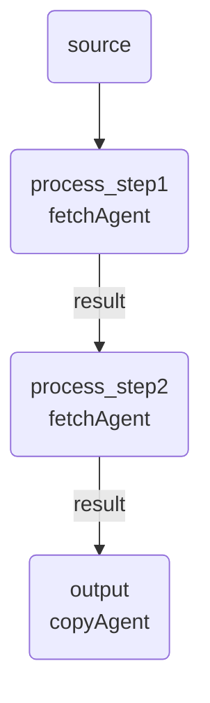
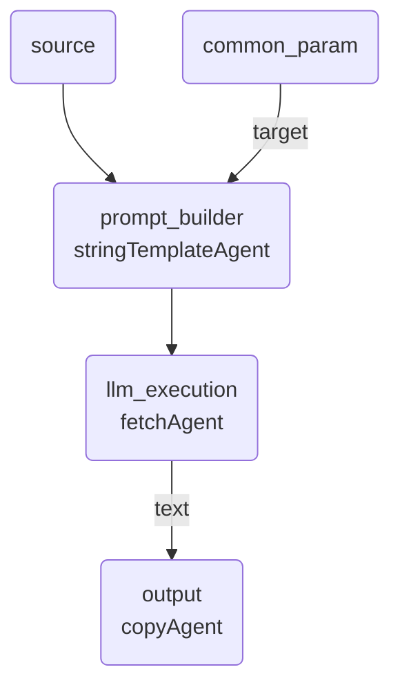
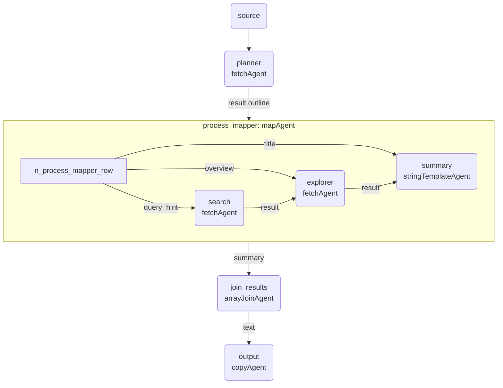
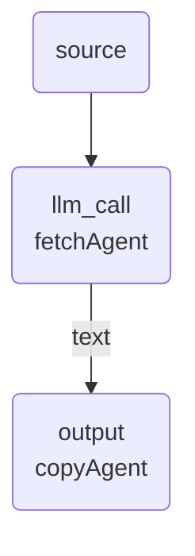
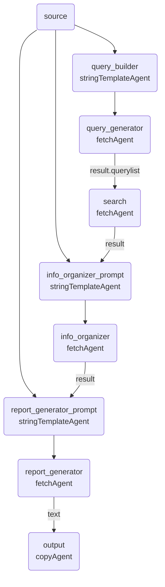
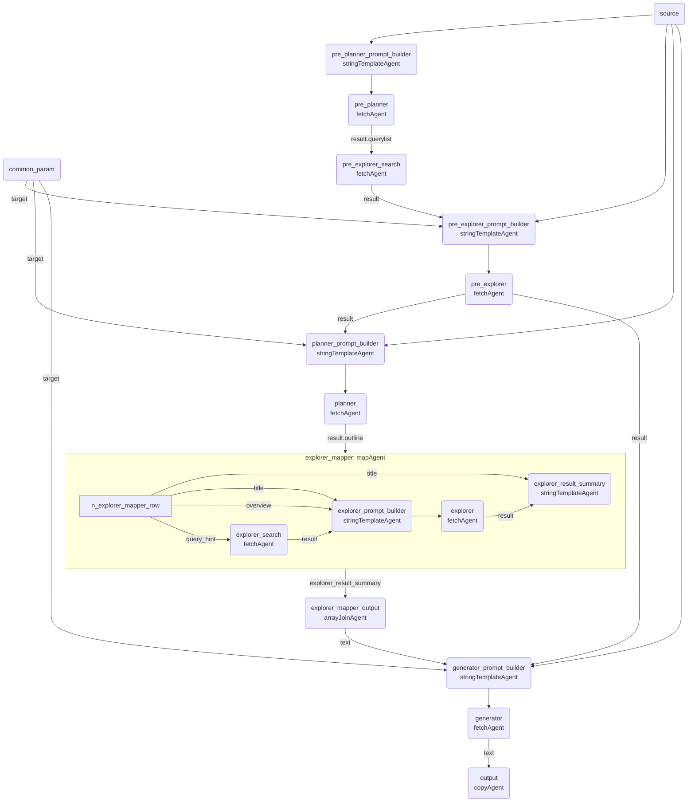

# GraphAI Workflow Generation Rules

このドキュメントは、GraphAI YMLワークフローファイルを自動生成する際のルールと設計指針をまとめています。

## 目次

1. [基本構造](#基本構造)
2. [必須要素](#必須要素)
3. [エージェント種別](#エージェント種別)
4. [データフローパターン](#データフローパターン)
5. [Agent選択指針](#agent選択指針)
6. [モデル選択指針](#モデル選択指針)
7. [expertAgent API統合](#expertagent-api統合)
   - [共通APIスキーマ](#共通apiスキーマ)
   - [テストモード機能](#テストモード機能)
8. [エラー回避パターン](#エラー回避パターン)
9. [パフォーマンスと並列処理の最適化](#パフォーマンスと並列処理の最適化)
10. [命名規則](#命名規則)
11. [デバッグとログ](#デバッグとログ)
12. [実装例](#実装例)
13. [YMLファイルのヘッダーコメント規約](#ymlファイルのヘッダーコメント規約)
14. [Agent専用ガイド](./agents/)
    - [Playwright Agent 完全ガイド](./agents/playwright-agent-guide.md)
    - [Explorer Agent 完全ガイド](./agents/explorer-agent-guide.md)
    - [File Reader Agent 完全ガイド](./agents/file-reader-agent-guide.md)

---

## 基本構造

### ファイルフォーマット

```yaml
version: 0.5
nodes:
  # ノード定義
  node_name:
    agent: agentType
    inputs:
      # 入力定義
    params:
      # パラメータ定義
    console:
      # デバッグログ設定
    isResult: true  # 最終出力ノードの場合
```

### 必須項目

- `version`: GraphAIバージョン（現在は `0.5` 固定）
- `nodes`: ノード定義オブジェクト
- 最低1つの `isResult: true` を持つ出力ノード

---

## 必須要素

### 1. sourceノード

ユーザー入力を受け取るエントリーポイント。

```yaml
nodes:
  source: {}
```

**重要**: `source` は実行時に文字列が直接注入される。プロパティアクセスは不要。

**正しい参照**:
```yaml
inputs:
  keywords: :source  # ✅ 正しい
```

**誤った参照**:
```yaml
inputs:
  keywords: :source.text  # ❌ 間違い（undefinedになる）
```

### 2. outputノード

最終結果を出力するノード。必ず `isResult: true` を設定。

```yaml
output:
  agent: copyAgent
  params:
    namedKey: text
  inputs:
    text: :previous_node.result
  isResult: true
```

---

## エージェント種別

### fetchAgent

外部API（expertAgent含む）を呼び出すエージェント。expertAgentだけでなく、**任意の外部APIも呼び出し可能**です。

```yaml
node_name:
  agent: fetchAgent
  inputs:
    url: http://127.0.0.1:8104/aiagent-api/v1/endpoint
    method: POST  # GET, POST, PUT, DELETEなど
    body:
      user_input: :previous_node
      model_name: gpt-oss:20b
  timeout: 30  # オプション: タイムアウト（秒）
  retry: 0     # オプション: リトライ回数
```

**外部API利用時の注意**:
- インターフェース（リクエスト/レスポンス形式）を明確に定義すること
- タイムアウト値を適切に設定すること
- エラーハンドリングを考慮すること

### anthropicAgent

Claude APIを直接呼び出すGraphAI標準エージェント。

```yaml
node_name:
  agent: anthropicAgent
  inputs:
    prompt: :previous_node
  params:
    model: claude-sonnet-4.5  # Claude Sonnet 4.5（最新）
    # または claude-opus-4.1（エージェントタスク特化）
```

### geminiAgent

Google Gemini APIを直接呼び出すGraphAI標準エージェント。

```yaml
node_name:
  agent: geminiAgent
  inputs:
    prompt: :previous_node
  params:
    model: gemini-2.5-pro  # Gemini 2.5 Pro（最新・最高精度）
    # または gemini-2.5-flash（高速・バランス型）
    # または gemini-2.5-flash-lite（超高速・低コスト）
```

### stringTemplateAgent

テンプレート文字列を生成するエージェント。

```yaml
prompt_builder:
  agent: stringTemplateAgent
  inputs:
    variable1: :source
    variable2: :other_node.result
  params:
    template: |-
      # プロンプトテンプレート
      ユーザー入力: ${variable1}
      追加情報: ${variable2}
```

### mapAgent

配列の各要素に対して並列処理を実行するエージェント。

```yaml
mapper:
  agent: mapAgent
  inputs:
    rows: :planner.result.outline  # 配列データ
  params:
    compositeResult: true  # 結果を統合
  graph:
    nodes:
      # 各要素に対して実行されるサブグラフ
      process_item:
        agent: fetchAgent
        inputs:
          url: http://127.0.0.1:8104/api/endpoint
          body:
            data: :row.field  # 各要素にアクセス
```

#### mapAgentの出力形式と参照方法（重要）

mapAgentの出力形式は `compositeResult` パラメータによって大きく異なります。
後続ノードでの参照方法も変わるため、**必ず理解してください**。

##### パターンA: compositeResult なし（デフォルト）

**出力形式**: オブジェクトの配列

```json
[
  {
    "read_pdf": {...},
    "summarize_content": {...},
    "format_summary": "文字列"
  },
  {
    "read_pdf": {...},
    "summarize_content": {...},
    "format_summary": "文字列"
  }
]
```

**後続ノードでの参照**:
- ❌ `:mapAgentノード名.format_summary` → **機能しない**
- ✅ `nestedAgent` を使って変換が必要（後述のSolution 1参照）

**YML例**:
```yaml
summarize_pdfs:
  agent: mapAgent
  # compositeResult 未指定
  graph:
    nodes:
      format_summary:
        agent: stringTemplateAgent
        params:
          template: "Result: ${input}"
        isResult: true

# この場合、後続ノードで nestedAgent が必要
extract_summaries:
  agent: nestedAgent
  inputs:
    array: :summarize_pdfs
  graph:
    nodes:
      extract:
        value: :row.format_summary
        isResult: true
  params:
    compositeResult: true

join_results:
  agent: arrayJoinAgent
  inputs:
    array: :extract_summaries
```

##### パターンB: compositeResult: true（推奨）

**出力形式**: `{ "isResultノード名": [...] }` 形式のオブジェクト

```json
{
  "format_summary": [
    "文字列1",
    "文字列2",
    "文字列3"
  ]
}
```

**重要**:
- オブジェクトのキー名は、サブグラフ内で `isResult: true` が指定されたノードの名前
- 値は、そのノードの出力の配列

**後続ノードでの参照**:
- ✅ `:mapAgentノード名.isResultノード名` → **配列が取得できる**

**YML例**:
```yaml
summarize_pdfs:
  agent: mapAgent
  params:
    compositeResult: true  # ← 必須
  graph:
    nodes:
      format_summary:
        agent: stringTemplateAgent
        params:
          template: "Result: ${input}"
        isResult: true  # ← この名前が出力オブジェクトのキーになる

# 直接参照可能（nestedAgent 不要）
join_results:
  agent: arrayJoinAgent
  inputs:
    array: :summarize_pdfs.format_summary  # ← プロパティアクセス
```

##### 推奨事項

**mapAgentを使用する場合**:
1. **必ず `compositeResult: true` を指定する**（パターンB）
2. サブグラフの最終ノードに `isResult: true` を指定
3. 後続ノードで `:mapAgentノード名.isResultノード名` で参照

**理由**:
- nestedAgentによる変換が不要（シンプル）
- データ構造が予測可能
- デバッグが容易

---

### arrayJoinAgent

配列を結合するエージェント。

```yaml
join_results:
  agent: arrayJoinAgent
  params:
    separator: \n---\n
  inputs:
    array: :mapper.result_field
```

### copyAgent

データをコピー・変換するエージェント。

```yaml
output:
  agent: copyAgent
  params:
    namedKey: text  # 特定のキーを抽出
  inputs:
    text: :previous_node.result
  isResult: true
```

---

## データフローパターン

### パターン1: シンプルな順次処理

**データフロー図**:


**YAML定義**:
```yaml
version: 0.5
nodes:
  source: {}

  process_step1:
    agent: fetchAgent
    inputs:
      url: http://127.0.0.1:8104/api/step1
      body:
        input: :source

  process_step2:
    agent: fetchAgent
    inputs:
      url: http://127.0.0.1:8104/api/step2
      body:
        input: :process_step1.result

  output:
    agent: copyAgent
    inputs:
      text: :process_step2.result
    isResult: true
```

### パターン2: プロンプトビルダーパターン

**データフロー図**:


**YAML定義**:
```yaml
version: 0.5
nodes:
  source: {}

  # パラメータ定義
  common_param:
    value:
      target: 39歳、男性
      tone: 深掘り討論

  # プロンプト構築
  prompt_builder:
    agent: stringTemplateAgent
    inputs:
      user_input: :source
      target: :common_param.target
    params:
      template: |-
        # 指示書
        対象ユーザー: ${target}

        # ユーザー入力
        ${user_input}

  # LLM実行
  llm_execution:
    agent: fetchAgent
    inputs:
      url: http://127.0.0.1:8104/aiagent-api/v1/mylllm
      method: POST
      body:
        user_input: :prompt_builder
        model_name: gpt-oss:20b

  output:
    agent: copyAgent
    inputs:
      text: :llm_execution.text
    isResult: true
```

### パターン3: 並列処理パターン（MapAgent）

**データフロー図**:


**YAML定義**:
```yaml
version: 0.5
nodes:
  source: {}

  # プランナー: タスクを複数の章に分割
  planner:
    agent: fetchAgent
    inputs:
      url: http://127.0.0.1:8104/aiagent-api/v1/aiagent/utility/jsonoutput
      method: POST
      body:
        user_input: :source
        model_name: gpt-oss:20b

  # 各章を並列処理
  process_mapper:
    agent: mapAgent
    inputs:
      rows: :planner.result.outline
    params:
      compositeResult: true
    graph:
      nodes:
        # Google検索
        search:
          agent: fetchAgent
          inputs:
            url: http://127.0.0.1:8104/aiagent-api/v1/utility/google_search
            method: POST
            body:
              queries: :row.query_hint

        # 情報収集
        explorer:
          agent: fetchAgent
          inputs:
            url: http://127.0.0.1:8104/aiagent-api/v1/aiagent/utility/explorer
            method: POST
            body:
              user_input: :row.overview
              search_result: :search.result
              model_name: gpt-oss:20b

        # 結果サマリー
        summary:
          agent: stringTemplateAgent
          inputs:
            title: :row.title
            content: :explorer.result
          params:
            template: |-
              ### ${title}
              ${content}
          isResult: true

  # 結果統合
  join_results:
    agent: arrayJoinAgent
    params:
      separator: \n---\n
    inputs:
      array: :process_mapper.summary

  output:
    agent: copyAgent
    inputs:
      text: :join_results.text
    isResult: true
```

---

## Agent選択指針

このセクションでは、タスクに応じて最適なAgentを選択するための指針を提供します。

### 選択フローチャート

```
タスクを分析
  │
  ├─ Web情報収集が必要？
  │   YES → Explorer Agent or Playwright Agent
  │          （詳細は下記比較表参照）
  │   NO → 次へ
  │
  ├─ ファイル読み込みが必要？
  │   YES → File Reader Agent
  │   NO → 次へ
  │
  ├─ 構造化JSON出力が必要？
  │   YES → jsonoutput Agent
  │   NO → 次へ
  │
  ├─ Gmail/カレンダー操作が必要？
  │   YES → Action Agent
  │   NO → 次へ
  │
  └─ その他のLLM処理
      → mylllm Agent（汎用LLM呼び出し）
```

### Web情報収集: Explorer Agent vs Playwright Agent

**重要**: Webページからの情報抽出には **Explorer Agent（html2markdown MCP）** の使用を強く推奨します。

| 観点 | Explorer Agent | Playwright Agent |
|------|---------------|------------------|
| **推奨用途** | ✅ **Webページのテキスト・情報抽出** | ⚠️ ブラウザ操作・スクリーンショット |
| **テキスト抽出精度** | ⭐⭐⭐⭐⭐ 高精度<br>（html2markdown MCP） | ⭐⭐ 低精度<br>（アクセシビリティツリー） |
| **構造保持** | ⭐⭐⭐⭐⭐ Markdown形式<br>（見出し、リスト、表を保持） | ⭐⭐ アクセシビリティツリー<br>（構造が崩れやすい） |
| **処理速度** | ⭐⭐⭐⭐⭐ 高速 | ⭐⭐⭐ 中速 |
| **コスト** | $ 低コスト | $$ 中コスト |
| **典型的なユースケース** | ・ニュース記事の本文抽出<br>・ブログ記事の取得<br>・PDFリンクの一括抽出<br>・技術ドキュメントの解析<br>・Google検索結果の詳細取得 | ・フォーム操作（入力、送信）<br>・スクリーンショット取得<br>・JavaScript実行 |

**判断基準**:
- **テキスト抽出が主目的** → **Explorer Agent**
- **ブラウザ操作が必要** → Playwright Agent
- **迷ったら** → まず**Explorer Agent**を試す

**例: ニュース記事の抽出**
```yaml
# ✅ 推奨: Explorer Agent
news_extractor:
  agent: fetchAgent
  params:
    url: "http://127.0.0.1:8104/aiagent-api/v1/aiagent/utility/explorer"
    method: "POST"
    body:
      user_input: "下記サイトの記事本文をMarkdown形式で抽出してください。\nhttps://example.com/news/article-123"
      model_name: "gpt-4o-mini"

# ⚠️ 非推奨: Playwright Agent（精度が低い）
news_extractor_playwright:
  agent: fetchAgent
  params:
    url: "http://127.0.0.1:8104/aiagent-api/v1/aiagent/utility/playwright"
    method: "POST"
    body:
      user_input: "下記サイトから記事のタイトルと本文を抽出してください。\nhttps://example.com/news/article-123"
      model_name: "gpt-4o-mini"
```

### ファイル処理: File Reader Agent

**対応ファイル形式**:

| ファイル形式 | 処理方法 | コスト | 備考 |
|------------|---------|--------|------|
| **PDF** | PyPDF2で全文抽出 | 無料 | 要約なし、原文そのまま |
| **画像** (PNG/JPG) | OpenAI Vision API | $$$ | gpt-4o使用 |
| **音声** (MP3/WAV) | OpenAI Whisper API | $ | whisper-1使用 |
| **テキスト/CSV** | Python標準ライブラリ | 無料 | 複数エンコーディング対応 |

**データソース**:
- ✅ インターネットURL（HTTP/HTTPS）
- ✅ Google Drive（OAuth2認証、MyVault管理）
- ✅ ローカルファイル（セキュリティ制限あり: `/tmp`, `~/Downloads`, `~/Documents`）

**重要な注意点**:

1. **画像処理時の必須表現**:
   ```yaml
   # ❌ NG: LLMがツール呼び出しを拒否
   user_input: "テキストを抽出してください。\nhttps://example.com/image.png"

   # ✅ OK: 「画像ファイルの」を明記
   user_input: "下記画像ファイルのテキストを抽出してください。\nhttps://example.com/image.png"
   ```

2. **Google Driveアクセス**:
   - ユーザーがMyVaultでGoogle認証を完了している必要あり
   - 権限エラー発生時は「リンクを知っている全員」に共有設定

**例: PDF全文抽出**
```yaml
pdf_extractor:
  agent: fetchAgent
  params:
    url: "http://127.0.0.1:8104/aiagent-api/v1/aiagent/utility/file_reader"
    method: "POST"
    body:
      user_input: "下記PDFファイルのテキストを全て抽出してください。\nhttps://example.com/whitepaper.pdf"
      model_name: "gpt-4o-mini"
```

### 構造化JSON出力: jsonoutput Agent

**用途**: LLMの出力を特定のJSON構造に整形する必要がある場合

**典型的なユースケース**:
- アウトライン生成（章立て、見出し構造）
- プランナーとして複数タスクのリストを生成
- MapAgentの入力データ作成

**例: アウトライン生成**
```yaml
planner:
  agent: fetchAgent
  params:
    url: "http://127.0.0.1:8104/aiagent-api/v1/aiagent/utility/jsonoutput"
    method: "POST"
    body:
      user_input: |
        下記トピックについて、4-6章構成のアウトラインを作成してください。
        各章には title, overview, query_hint を含めてください。

        トピック: :source
      model_name: "gpt-oss:120b"
```

### Gmail/カレンダー操作: Action Agent

**用途**: Gmail送信、Googleカレンダー操作など、外部サービスとの連携

**典型的なユースケース**:
- メール送信
- カレンダーイベント作成
- Google Drive操作

**例: メール送信**
```yaml
send_notification:
  agent: fetchAgent
  params:
    url: "http://127.0.0.1:8104/aiagent-api/v1/aiagent/utility/action"
    method: "POST"
    body:
      user_input: |
        下記の内容でメールを送信してください。
        宛先: user@example.com
        件名: レポート完成のお知らせ
        本文: :report_result
      model_name: "gpt-4o-mini"
```

### Wikipedia検索: wikipedia Agent

**用途**: Wikipedia記事の検索と要約取得

**典型的なユースケース**:
- 基礎知識の取得
- 用語の定義確認
- 概要情報の収集

**例: Wikipedia検索**
```yaml
wiki_search:
  agent: fetchAgent
  params:
    url: "http://127.0.0.1:8104/aiagent-api/v1/aiagent/utility/wikipedia"
    method: "POST"
    body:
      user_input: "量子コンピュータについて調べてください"
      model_name: "gpt-4o-mini"
```

---

## モデル選択指針

このセクションでは、タスクに応じて最適なLLMモデルを選択するための指針を提供します。

### 推奨モデル一覧

| モデル | 推奨度 | 特徴 | 使用ケース | コスト |
|--------|--------|------|-----------|--------|
| **gpt-oss:20b** | ⭐⭐⭐ | 軽量・高速、ローカル実行 | 単純なタスク、リアルタイム応答 | 無料 |
| **gpt-oss:120b** | ⭐⭐⭐ | 高精度、ローカル実行 | 複雑な推論、レポート生成 | 無料 |
| **gpt-4o-mini** | ⭐⭐⭐ | バランス型、API | Agent統合（Playwright/Explorer） | $ |
| **Gemini 2.5 Flash** | ⭐⭐⭐ | 高速、100万トークン | 大規模文書処理 | $ |
| **Gemini 2.5 Pro** | ⭐⭐ | 最高精度、思考プロセス付き | 極めて複雑なタスク | $$$ |
| **Claude Sonnet 4.5** | ⭐⭐ | コーディング最高精度 | ワークフロー生成、コード生成 | $$ |

### タスク別推奨モデル

#### 1. ワークフロー生成・コーディング

- **第1選択**: Claude Sonnet 4.5
- **第2選択**: Gemini 2.5 Flash
- **理由**: YML構造の正確な理解、長文コンテキスト対応

#### 2. レポート生成・要約

- **第1選択**: gpt-oss:120b（ローカル）
- **第2選択**: Gemini 2.5 Flash
- **理由**: コスト無料、高精度

#### 3. Agent統合（Playwright/Explorer/File Reader）

- **第1選択**: gpt-4o-mini
- **理由**: Agent指示理解に最適、コスト効率良好

**重要**: Agent統合時は必ず **gpt-4o-mini** を使用してください。他のモデルではツール呼び出しが正常に動作しない場合があります。

#### 4. リアルタイム対話

- **第1選択**: gpt-oss:20b（ローカル）
- **理由**: 高速応答、コスト無料

#### 5. 大規模文書処理（100ページ以上のPDF等）

- **第1選択**: Gemini 2.5 Flash
- **理由**: 100万トークンコンテキスト

### コスト最適化戦略

1. **ローカルLLM優先**: まず **gpt-oss:20b/120b** を試す
2. **Agent統合は gpt-4o-mini**: Playwright/Explorer/File Reader統合時は必須
3. **高精度が必要な場合のみクラウドLLM**: Gemini/Claude
4. **段階的スケールアップ**: 20b → 120b → gpt-4o-mini → Gemini Flash → Gemini Pro

### expertAgent APIでのモデル指定方法

```yaml
# ローカルLLM（推奨・無料）
model_name: "gpt-oss:20b"    # 軽量・高速
model_name: "gpt-oss:120b"   # 高精度

# クラウドLLM（有料）
model_name: "gpt-4o-mini"       # Agent統合時に推奨
model_name: "gemini-2.5-flash"  # 大規模文書処理
model_name: "gemini-2.5-pro"    # 最高精度
model_name: "claude-sonnet-4-5" # コーディング
```

### モデル選択の実践例

#### 例1: ニュース記事の要約

```yaml
# ✅ 推奨: ローカルLLM（無料）
summarizer:
  agent: fetchAgent
  params:
    url: "http://127.0.0.1:8104/aiagent-api/v1/mylllm"
    method: "POST"
    body:
      user_input: "下記記事を3行で要約してください。\n:article_content"
      model_name: "gpt-oss:120b"  # 高精度、無料
```

#### 例2: Playwright Agentでのスクレイピング

```yaml
# ⚠️ 必須: gpt-4o-mini を使用
web_scraper:
  agent: fetchAgent
  params:
    url: "http://127.0.0.1:8104/aiagent-api/v1/aiagent/utility/playwright"
    method: "POST"
    body:
      user_input: "下記サイトからタイトルを抽出してください。\nhttps://example.com"
      model_name: "gpt-4o-mini"  # Agent統合時は必須
```

#### 例3: 大規模PDF処理

```yaml
# ✅ 推奨: Gemini 2.5 Flash（100万トークン対応）
pdf_processor:
  agent: fetchAgent
  params:
    url: "http://127.0.0.1:8104/aiagent-api/v1/aiagent/utility/file_reader"
    method: "POST"
    body:
      user_input: "下記200ページのPDFから重要ポイントを抽出してください。\n:pdf_url"
      model_name: "gemini-2.5-flash"  # 長文対応
```

---

## expertAgent API統合

### 重要: ポート番号とエンドポイント

**正しいポート番号**: `8104`（expertAgent）

```yaml
# ✅ 正しい
url: http://127.0.0.1:8104/aiagent-api/v1/endpoint

# ❌ 間違い
url: http://127.0.0.1:8000/aiagent-api/v1/endpoint  # ポート8000は使用不可
```

### 共通APIスキーマ

expertAgent APIのエンドポイントは、以下の2種類のスキーマを使用します。

#### 標準LLMエンドポイント用スキーマ

`/aiagent-api/v1/mylllm`、`/aiagent-api/v1/aiagent/utility/jsonoutput` が使用。

**リクエストボディ（ExpertAiAgentRequest）**:
| パラメータ | 型 | 必須 | デフォルト | 説明 |
|----------|-----|------|-----------|------|
| `user_input` | string | ✅ | - | ユーザーからの指示・プロンプト |
| `system_imput` | string | ❌ | null | システムプロンプト（注: typo "imput"） |
| `model_name` | string | ❌ | `gpt-oss:20b` | 使用するLLMモデル名 |
| `project` | string | ❌ | null | MyVaultプロジェクト名 |
| `test_mode` | boolean | ❌ | false | テストモードフラグ |
| `test_response` | dict/string | ❌ | null | テストモード用モックレスポンス |

**レスポンスボディ（ExpertAiAgentResponse）**:
| フィールド | 型 | 説明 |
|-----------|-----|------|
| `result` | string | LLM生成結果（jsonoutputの場合はJSONオブジェクト） |
| `text` | string | `result`と同じ（互換性のため） |
| `type` | string | レスポンスタイプ（オプション） |
| `chathistory` | array | チャット履歴（オプション） |

#### Utilityエンドポイント用スキーマ

`/aiagent-api/v1/aiagent/utility/explorer`、`action`、`playwright`、`wikipedia`、`file_reader` が使用。

**リクエストボディ（UtilityRequest）**:
| パラメータ | 型 | 必須 | デフォルト | 説明 |
|----------|-----|------|-----------|------|
| `user_input` | string | ✅ | - | 実行する指示・タスク |
| `project` | string | ❌ | null | MyVaultプロジェクト名（認証情報取得用） |
| `test_mode` | boolean | ❌ | false | テストモードフラグ |
| `test_response` | dict/string | ❌ | null | テストモード用モックレスポンス |

**レスポンスボディ（UtilityResponse）**:
| フィールド | 型 | 説明 |
|-----------|-----|------|
| `result` | string | 実行結果・生成されたレポート |

#### Google検索エンドポイント用スキーマ

`/aiagent-api/v1/utility/google_search`、`google_search_overview` が使用。

**リクエストボディ（SearchUtilityRequest）**:
| パラメータ | 型 | 必須 | デフォルト | 説明 |
|----------|-----|------|-----------|------|
| `queries` | array[string] | ✅ | - | 検索クエリのリスト |
| `num` | integer | ❌ | 3 | 検索結果数（1クエリあたり） |
| `project` | string | ❌ | null | MyVaultプロジェクト名 |

**レスポンスボディ（SearchUtilityResponse）**:
| フィールド | 型 | 説明 |
|-----------|-----|------|
| `result` | array | 検索結果のリスト（タイトル、URL、スニペット含む） |

---

### 主要エンドポイント

#### 1. `/aiagent-api/v1/mylllm` - 汎用LLM実行

**提供サービス**: 任意のLLMモデルを指定してテキスト生成を実行。ローカルLLM（gpt-oss、Ollama）およびクラウドLLM（Gemini、Claude、GPT）に対応。

**用途**: シンプルなテキスト生成、要約、翻訳、質問応答など基本的なLLMタスク。

**リクエストボディスキーマ**:
| パラメータ | 型 | 必須 | デフォルト | 説明 |
|----------|-----|------|-----------|------|
| `user_input` | string | ✅ | - | ユーザーからの指示・プロンプト |
| `system_imput` | string | ❌ | null | システムプロンプト（typo注意: "imput"） |
| `model_name` | string | ❌ | `gpt-oss:20b` | 使用するLLMモデル名 |
| `project` | string | ❌ | null | MyVaultプロジェクト名（秘密情報用） |
| `test_mode` | boolean | ❌ | false | テストモードフラグ（開発用） |
| `test_response` | dict/string | ❌ | null | テストモード用モックレスポンス |

**レスポンスボディスキーマ**:
| フィールド | 型 | 説明 |
|-----------|-----|------|
| `result` | string | LLMの生成結果テキスト（主要フィールド） |
| `text` | string | `result`と同じ内容（互換性のため） |
| `type` | string | レスポンスタイプ（オプション） |
| `chathistory` | array | チャット履歴（オプション） |

**使用例**:
```yaml
llm_node:
  agent: fetchAgent
  inputs:
    url: http://127.0.0.1:8104/aiagent-api/v1/mylllm
    method: POST
    body:
      user_input: :prompt_builder
      model_name: gpt-oss:20b  # モデル指定（後述）
      system_imput: システムプロンプト（オプション）
```

#### 2. `/aiagent-api/v1/aiagent/utility/jsonoutput` - JSON構造化出力

**提供サービス**: LLMにJSON形式での出力を指示し、生成されたテキストをJSONとしてパース・検証して返却。構造化データの確実な生成を保証。

**用途**: アウトライン生成、タスク分割リスト、データベース挿入用構造化データ、API連携用フォーマット変換。

**リクエストボディスキーマ**:
| パラメータ | 型 | 必須 | デフォルト | 説明 |
|----------|-----|------|-----------|------|
| `user_input` | string | ✅ | - | JSON出力を指示するプロンプト |
| `model_name` | string | ❌ | `gpt-oss:20b` | 使用するLLMモデル名 |
| `project` | string | ❌ | null | MyVaultプロジェクト名 |
| `test_mode` | boolean | ❌ | false | テストモードフラグ |
| `test_response` | dict/string | ❌ | null | テストモード用モックレスポンス |

**レスポンスボディスキーマ**:
| フィールド | 型 | 説明 |
|-----------|-----|------|
| `result` | object | パース済みJSON（LLM出力をJSON解析した結果） |
| `text` | string | 元のLLM出力テキスト |

**使用例**:
```yaml
json_output:
  agent: fetchAgent
  inputs:
    url: http://127.0.0.1:8104/aiagent-api/v1/aiagent/utility/jsonoutput
    method: POST
    body:
      user_input: :prompt_with_json_format
      model_name: gpt-oss:120b
```

#### 3. `/aiagent-api/v1/aiagent/utility/explorer` - 情報収集エージェント

**提供サービス**: 複数の情報源から情報を収集・分析し、詳細なレポートを生成。検索結果の深掘り調査、情報の統合・整理、エビデンスベースの分析を実行。

**用途**: 市場調査レポート、技術動向分析、競合分析、学術的調査、複数情報源からの包括的な情報整理。

**🆕 利用可能なMCPツール**:
- **html2markdown**: WebページをMarkdown形式に変換（Webページからのテキスト・情報抽出に最適、Playwright Agentより高精度）
- **google_search**: Google Custom Search APIでキーワード検索
- **gmail_search**: Gmail検索（OAuth2認証、MyVault経由）

**推奨用途**: Webページからのテキスト抽出は **html2markdown** を使用することで、Playwright Agentより高精度な結果が得られます。

**リクエストボディスキーマ**:
| パラメータ | 型 | 必須 | デフォルト | 説明 |
|----------|-----|------|-----------|------|
| `user_input` | string | ✅ | - | 情報収集・調査の指示 |
| `project` | string | ❌ | null | MyVaultプロジェクト名（MCPツール認証用） |
| `test_mode` | boolean | ❌ | false | テストモードフラグ |
| `test_response` | dict/string | ❌ | null | テストモード用モックレスポンス |

**レスポンスボディスキーマ**:
| フィールド | 型 | 説明 |
|-----------|-----|------|
| `result` | string | 情報収集・分析結果のレポート |

**使用例**:
```yaml
explorer:
  agent: fetchAgent
  inputs:
    url: http://127.0.0.1:8104/aiagent-api/v1/aiagent/utility/explorer
    method: POST
    body:
      user_input: :prompt_builder
      project: default_project  # MCPツール認証用
```

**詳細ガイド**: [Explorer Agent 完全ガイド](agents/explorer-agent-guide.md)

#### 4. `/aiagent-api/v1/aiagent/utility/action` - アクション実行エージェント

**提供サービス**: ユーザーの指示に基づき、メール送信、ファイル操作、外部API呼び出しなど実世界のアクションを実行。LangGraphベースのエージェントが利用可能なツールを自動選択・実行。

**用途**: Gmail経由のメール送信、Google Driveファイル操作、カレンダー操作、自動化されたワークフロー実行、外部サービスとの統合。

**注意: 利用可能なツールの制約**
`action` エージェントが内部で使用するツールには、それぞれ固有の制約が存在する場合があります。

**例: `send_email_tool` の場合**
- **宛先の固定**: 現在の実装では、メールの宛先はツール内部で設定された固定のアドレスとなっており、プロンプトから動的に宛先を指定することはできません。

ワークフロー設計時には、このようなツールの制約を考慮する必要があります。

```yaml
action:
  agent: fetchAgent
  inputs:
    url: http://127.0.0.1:8104/aiagent-api/v1/aiagent/utility/action
    method: POST
    body:
      user_input: :action_prompt
      model_name: gpt-oss:20b
      project: default_project  # オプション: プロジェクト指定
```

#### 5. `/aiagent-api/v1/aiagent/utility/playwright` - Webブラウザ操作エージェント

**提供サービス**: Playwrightを使用した高度なWebブラウザ自動操作。フォーム入力・送信、ボタンクリック、スクリーンショット取得、JavaScript実行に対応。

**⚠️ 重要な制限事項**:
- **Webサイトからの情報抽出には不向き**: ブラウザの構造化データ取得の精度が低く、特定要素の抽出が困難
- **推奨用途**: フォーム操作、スクリーンショット取得、JavaScript実行など、ブラウザ操作が必要な場合のみ
- **代替手段**: Webページからのテキスト・情報抽出には **Explorer Agent（html2markdown）** の使用を強く推奨

**適切な用途**: ログイン必須サイトへのアクセス、フォーム自動入力、UI操作の自動化、スクリーンショット取得、JavaScript実行。

```yaml
playwright:
  agent: fetchAgent
  inputs:
    url: http://127.0.0.1:8104/aiagent-api/v1/aiagent/utility/playwright
    method: POST
    body:
      user_input: :scraping_instruction  # 自然言語での操作指示
      model_name: gpt-oss:20b  # 操作プラン生成用モデル
      # 返却: { "result": "抽出されたデータ", "screenshot": "base64画像（オプション）" }
```

**詳細ガイド**: [Playwright Agent 完全ガイド](agents/playwright-agent-guide.md)

#### 6. `/aiagent-api/v1/aiagent/utility/wikipedia` - Wikipedia検索エージェント

**提供サービス**: Wikipedia APIを使用した百科事典情報の検索・要約。指定言語（日本語・英語など）でのページ内容取得と、LLMによる分かりやすい要約を提供。

**用途**: 用語の基礎知識調査、歴史的背景の理解、専門用語の説明、学術研究の前提知識収集、教育コンテンツ作成。

```yaml
wikipedia:
  agent: fetchAgent
  inputs:
    url: http://127.0.0.1:8104/aiagent-api/v1/aiagent/utility/wikipedia
    method: POST
    body:
      user_input: :search_query  # 検索キーワードまたは質問
      model_name: gpt-oss:20b
      language: ja  # 言語コード（ja, en等、デフォルト: ja）
      # 返却: { "summary": "Wikipediaの要約", "source_url": "元記事URL" }
```

#### 11. `/aiagent-api/v1/aiagent/utility/file_reader` - ファイル読み込みエージェント

**提供サービス**: PDF、画像、音声、テキストなど様々なファイル形式からコンテンツを抽出。Google Drive、URL、ローカルファイルに対応。

**対応形式**: PDF（PyPDF2）、画像（OpenAI Vision API）、音声（OpenAI Whisper API）、テキスト、CSV

**用途**: PDF文書の全文抽出、画像からのOCR、音声文字起こし、技術ドキュメント処理、議事録作成、マルチメディアコンテンツ分析

```yaml
file_reader:
  agent: fetchAgent
  inputs:
    url: http://127.0.0.1:8104/aiagent-api/v1/aiagent/utility/file_reader
    method: POST
    body:
      user_input: "下記PDFファイルのテキストを全て抽出してください。\nhttps://example.com/document.pdf"
      model_name: gpt-4o-mini
      # 返却: { "result": "抽出されたテキスト..." }
```

**詳細ガイド**: [File Reader Agent 完全ガイド](agents/file-reader-agent-guide.md)

#### 7. `/aiagent-api/v1/utility/google_search` - Google検索

**提供サービス**: Google Serper APIを使用して複数クエリのWeb検索を一括実行。検索結果（タイトル、URL、スニペット）を構造化データとして返却。

**用途**: 最新ニュース収集、市場調査、トレンド分析、複数トピックの並列調査、情報収集エージェントの前段処理。

```yaml
search:
  agent: fetchAgent
  inputs:
    url: http://127.0.0.1:8104/aiagent-api/v1/utility/google_search
    method: POST
    body:
      queries: :query_list  # List[str] - 検索クエリのリスト
      num: 3  # 各クエリの取得結果数（デフォルト: 3）
      # 返却: { "results": [{ "title": "...", "link": "...", "snippet": "..." }, ...] }
```

#### 8. `/aiagent-api/v1/utility/google_search_overview` - Google検索概要

**提供サービス**: Google検索結果を取得し、LLMによる要約・サマリーを生成。検索結果の簡潔な概要を自然言語で提供。

**用途**: クイックリサーチ、トピックの即時理解、検索結果の効率的な把握、プレゼンテーション用サマリー作成。

```yaml
search_overview:
  agent: fetchAgent
  inputs:
    url: http://127.0.0.1:8104/aiagent-api/v1/utility/google_search_overview
    method: POST
    body:
      queries: :query_list  # List[str]
      num: 3  # 各クエリの取得結果数（オプション）
      model_name: gpt-oss:20b  # サマリー生成用モデル
      # 返却: { "summary": "検索結果の要約テキスト" }
```

#### 9. `/aiagent-api/v1/utility/tts_and_upload_drive` - 音声合成＆Google Drive連携

**提供サービス**: テキスト台本を音声合成（Text-to-Speech）でMP3/MP4ファイルに変換し、Google Driveにアップロード。アップロード完了後、共有可能なリンクURLを返却。

**用途**: ポッドキャスト台本の音声化、プレゼンテーション音声作成、教育コンテンツの音声版生成、音声配信コンテンツの自動生成・公開。

```yaml
tts_upload:
  agent: fetchAgent
  inputs:
    url: http://127.0.0.1:8104/aiagent-api/v1/utility/tts_and_upload_drive
    method: POST
    body:
      user_input: :podcast_script  # 音声化する台本テキスト
      # 返却: { "drive_link": "https://drive.google.com/...", "file_id": "..." }
```

#### 10. `/aiagent-api/v1/aiagent/sample` - サンプルエージェント

LangGraphベースのサンプルエージェント実行。

```yaml
sample:
  agent: fetchAgent
  inputs:
    url: http://127.0.0.1:8104/aiagent-api/v1/aiagent/sample
    method: POST
    body:
      user_input: :instruction
      project: default_project  # プロジェクト名（オプション）
```

### テストモード機能

**🆕 すべてのexpertAgentエンドポイントでテストモードが利用可能です。**

テストモードを使用すると、実際のLLM呼び出しや外部API呼び出しを行わず、事前に定義したモックレスポンスを返却できます。これにより、ワークフロー開発時のトライアンドエラーを大幅に削減できます。

#### テストモードの利点

1. **開発時間の短縮**: LLM呼び出しなしでレスポンス構造を確認可能
2. **コスト削減**: テスト時のLLM API呼び出しコストが不要
3. **エラー特定の効率化**: レスポンス構造の問題とYML記述ミスを明確に分離
4. **高速な反復開発**: 即座にレスポンスが返るため、ワークフロー構造のみを素早く検証可能

#### 使用方法

すべてのexpertAgentエンドポイントで以下の2つのパラメータが使用可能です：

- **`test_mode`**: `true` に設定するとテストモードが有効化されます（デフォルト: `false`）
- **`test_response`**: テストモード時に返却するモックレスポンス（文字列または辞書）

#### テストレスポンスの形式

**文字列レスポンス** - 簡単なテキスト返却:
```yaml
body:
  user_input: :source
  test_mode: true
  test_response: "これはテストレスポンスです"
```

返却されるレスポンス:
```json
{
  "result": "これはテストレスポンスです",
  "text": "これはテストレスポンスです",
  "type": "mylllm_test"
}
```

**辞書型レスポンス** - カスタムフィールドを含む構造化データ（推奨）:
```yaml
body:
  user_input: :source
  test_mode: true
  test_response:
    result:
      outline:
        - title: "第1章"
          overview: "概要1"
          query_hint: ["クエリ1", "クエリ2"]
        - title: "第2章"
          overview: "概要2"
          query_hint: ["クエリ3", "クエリ4"]
```

返却されるレスポンス:
```json
{
  "result": {
    "outline": [
      {"title": "第1章", "overview": "概要1", "query_hint": ["クエリ1", "クエリ2"]},
      {"title": "第2章", "overview": "概要2", "query_hint": ["クエリ3", "クエリ4"]}
    ]
  }
}
```

**辞書型の利点**: GraphAIワークフローで `:node.field` アクセスが可能になり、複雑なデータフロー検証ができます。

#### 実践例1: プランナーのテスト

jsonoutputエンドポイントでアウトライン構造をテスト:

```yaml
planner_test:
  agent: fetchAgent
  inputs:
    url: http://127.0.0.1:8104/aiagent-api/v1/aiagent/utility/jsonoutput
    method: POST
    body:
      user_input: :source
      test_mode: true
      test_response:
        result:
          outline:
            - title: "【序論】量子コンピュータとは"
              overview: "量子コンピュータの基本原理を説明"
              query_hint: ["量子コンピュータ 基本", "量子ビット"]
            - title: "【本論】最新動向"
              overview: "2025年の技術動向"
              query_hint: ["量子コンピュータ 2025", "量子超越性"]
```

データアクセス:
- `:planner_test.result.outline` → 配列全体にアクセス
- mapAgentで `:row.title`, `:row.overview`, `:row.query_hint` にアクセス可能

#### 実践例2: MapAgentと組み合わせたテスト

プランナー + マッパー + エクスプローラーの全体をテストモードで検証:

```yaml
version: 0.5
nodes:
  source: {}

  # プランナー（テストモード）
  planner:
    agent: fetchAgent
    inputs:
      url: http://127.0.0.1:8104/aiagent-api/v1/aiagent/utility/jsonoutput
      method: POST
      body:
        user_input: :source
        test_mode: true
        test_response:
          result:
            outline:
              - title: "Chapter 1"
                overview: "Overview 1"
                query_hint: ["query 1", "query 2"]
              - title: "Chapter 2"
                overview: "Overview 2"
                query_hint: ["query 3", "query 4"]

  # マッパー（各章を並列処理）
  mapper:
    agent: mapAgent
    inputs:
      rows: :planner.result.outline  # テストレスポンスの配列にアクセス
    graph:
      nodes:
        # 検索（テストモード）
        search:
          agent: fetchAgent
          inputs:
            url: http://127.0.0.1:8104/aiagent-api/v1/utility/google_search
            method: POST
            body:
              queries: :row.query_hint  # テストレスポンスのフィールドにアクセス
              test_mode: true
              test_response:
                results:
                  - title: "Search Result"
                    url: "https://example.com"

        # エクスプローラー（テストモード）
        explorer:
          agent: fetchAgent
          inputs:
            url: http://127.0.0.1:8104/aiagent-api/v1/aiagent/utility/explorer
            method: POST
            body:
              user_input: :row.overview  # テストレスポンスのフィールドにアクセス
              test_mode: true
              test_response:
                result: "詳細レポートのテキスト"
          isResult: true

  output:
    agent: copyAgent
    inputs:
      text: :mapper
    isResult: true
```

このワークフローでは：
1. プランナーがモックのアウトラインを返却
2. マッパーが各章に対してループ処理
3. 検索とエクスプローラーがそれぞれテストレスポンスを返却
4. すべてLLM呼び出しなしで、ワークフロー構造を素早く検証可能

#### 実践例3: 段階的な本番移行

開発段階に応じてテストモードと本番モードを組み合わせ:

```yaml
# フェーズ1: 全体をテストモードで構造検証
planner:
  inputs:
    body:
      test_mode: true
      test_response: { ... }

# フェーズ2: プランナーのみ本番実行、後続はテスト
planner:
  inputs:
    body:
      test_mode: false  # 本番LLM実行

explorer:
  inputs:
    body:
      test_mode: true  # まだテスト
      test_response: "..."

# フェーズ3: 全体を本番実行
# test_mode パラメータを削除またはfalse設定
```

#### 対応エンドポイント

以下のすべてのエンドポイントでテストモードが利用可能です：

- `/aiagent-api/v1/mylllm`
- `/aiagent-api/v1/aiagent/sample`
- `/aiagent-api/v1/aiagent/utility/jsonoutput`
- `/aiagent-api/v1/aiagent/utility/explorer`
- `/aiagent-api/v1/aiagent/utility/action`
- `/aiagent-api/v1/aiagent/utility/playwright`
- `/aiagent-api/v1/aiagent/utility/wikipedia`
- `/aiagent-api/v1/aiagent/utility/file_reader`
- `/aiagent-api/v1/utility/google_search`
- `/aiagent-api/v1/utility/google_search_overview`
- `/aiagent-api/v1/utility/tts_and_upload_drive`

#### 注意事項

- `test_mode: false` または省略時は通常の本番実行になります
- `test_response` が `null` の場合はデフォルトメッセージが返却されます
- 文字列レスポンスは自動で標準レスポンス形式にラップされます
- 辞書型レスポンスはそのまま返却されるため、GraphAIでの柔軟なデータアクセスが可能です

### 利用可能なモデル

expertAgentのすべてのエンドポイントで `model_name` パラメータによりモデルを指定できます。

#### ローカルLLMモデル（推奨）

| モデル名 | 用途 | 特徴 | パラメータ数 |
|---------|------|------|------------|
| **gpt-oss:120b** | 複雑な処理 | 高精度、詳細な分析、複雑な推論 | 120B |
| **gpt-oss:20b** | 通常の処理 | バランス型、日常的なタスク | 20B |
| **pielee/qwen3-4b-thinking-2507_q8** | 軽量処理 | 高速、シンプルなタスク | 4B  |

**ローカルLLMの利点**:
- API料金不要
- プライバシー保護
- レスポンス速度の安定性

#### クラウドLLMモデル

| モデル名 | プロバイダー | 特徴 | リリース |
|---------|------------|------|---------|
| **gemini-2.5-pro** | Google | 最高精度、思考プロセス付き、100万トークンコンテキスト | 2025年3月 |
| **gemini-2.5-flash** | Google | 高速、コスト効率、バランス型 | 2025年6月 |
| **gemini-2.5-flash-lite** | Google | 超高速、最小コスト | 2025年6月 |
| **claude-sonnet-4.5** | Anthropic | コーディング世界最高、複雑なエージェント構築に最適 | 2025年9月 |
| **claude-opus-4.1** | Anthropic | エージェントタスク・実世界コーディング・推論に特化 | 2025年発表 |
| **gpt-5** | OpenAI | 統合システム、27万トークン入力、コーディング・数学に優れる | 2025年8月 |
| **gpt-5-mini** | OpenAI | バランス型、コスト効率重視 | 2025年8月 |
| **gpt-5-nano** | OpenAI | 軽量・超低コスト | 2025年8月 |

#### その他のローカルモデル（Ollama）

- **qwen3-next-80b-a3b-thinking-mlx**: 80Bパラメータ、思考プロセス付き
- **gemma3n:latest**: Google Gemma系軽量モデル

#### モデル選択ガイドライン

| タスクの種類 | 推奨モデル | 理由 |
|------------|----------|------|
| **複雑な推論・分析** | gpt-oss:120b | パラメータ数が多く詳細な処理が可能 |
| **レポート生成** | gpt-oss:120b | 長文生成、文脈理解に優れる |
| **情報収集・要約** | gpt-oss:20b | バランスが良く、実用的 |
| **JSON出力** | gpt-oss:20b | 構造化出力に十分な性能 |
| **簡単な変換** | pielee/qwen3-4b-thinking-2507_q8 | 高速処理、軽量タスク向け |
| **クリエイティブ作業** | gemini-2.5-pro / claude-sonnet-4.5 | クラウドモデルの強み |

---

## エラー回避パターン

### 1. sourceノードの参照エラー

**エラー**: `undefined` が出力に含まれる

**原因**: `:source.text` のように存在しないプロパティを参照

**解決策**:
```yaml
# ❌ 間違い
inputs:
  keywords: :source.text

# ✅ 正しい
inputs:
  keywords: :source
```

### 2. 非同期関数のawait漏れ

**エラー**: `RuntimeWarning: coroutine was never awaited`

**原因**: MCP toolsで非同期関数を同期的に呼び出している

**解決策**: expertAgent側のPythonコードで `await` を追加
```python
# ❌ 間違い
return get_overview_by_google_serper(input_query)

# ✅ 正しい
return await get_overview_by_google_serper(input_query)
```

### 3. ポート番号の誤り

**エラー**: `fetch failed` - connection refused

**原因**: 間違ったポート番号を使用（8000など）

**解決策**:
```yaml
# ❌ 間違い
url: http://127.0.0.1:8000/api/endpoint

# ✅ 正しい
url: http://127.0.0.1:8104/api/endpoint
```

### 4. mapAgentでのデータ参照エラー

**エラー**: `:row.field` が undefined

**原因**: 配列要素の構造を正しく理解していない

**解決策**:
```yaml
# planner が以下を返す場合:
# { "outline": [{"title": "...", "query_hint": ["..."]}] }

mapper:
  agent: mapAgent
  inputs:
    rows: :planner.result.outline  # ✅ .outline まで指定
  graph:
    nodes:
      process:
        inputs:
          title: :row.title        # ✅ 各要素のフィールドにアクセス
          queries: :row.query_hint # ✅
```

### 5. APIエンドポイントの不一致

**エラー**: `Cannot POST /api/v1/workflow/execute`

**原因**: ドキュメント等で参照したエンドポイントが、実際の `graphAiServer` の実装と異なっている。

**解決策**: `graphAiServer/src/app.ts` などのルーティング定義ファイルを確認し、正しいエンドポイントを使用する。2025年10月現在、ワークフロー実行用のエンドポイントは以下の通りです：

```bash
# ❌ 間違い
curl -X POST http://127.0.0.1:8105/api/v1/workflow/execute

# ✅ 正しい（新形式推奨: モデル名をURLパスに含める）
curl -X POST http://127.0.0.1:8105/api/v1/myagent/llmwork/{workflow_name} \
  -H "Content-Type: application/json" \
  -d '{"user_input": "..."}'

# ✅ 正しい（旧形式: 後方互換性のためサポート継続）
curl -X POST http://127.0.0.1:8105/api/v1/myagent \
  -H "Content-Type: application/json" \
  -d '{"model_name": "llmwork/{workflow_name}", "user_input": "..."}'
```

### 6. mapAgent出力のオブジェクト配列変換エラー

**エラー**: mapAgentの出力が `[{"key": "value"}, ...]` という形式で、後続のarrayJoinAgentが処理できない

**原因**: mapAgentのサブグラフがオブジェクトを返すため、配列の各要素がオブジェクトになる

**問題のある例**:
```yaml
summarize_pdfs:
  agent: mapAgent
  inputs:
    rows: :pdf_urls
  graph:
    nodes:
      summarizer:
        agent: fetchAgent
        params:
          url: "http://127.0.0.1:8104/aiagent-api/v1/mylllm"
          method: "POST"
          data:
            user_input: "要約してください"
        isResult: true  # ← オブジェクトが返される
  params:
    compositeResult: true

# 出力: [{"result": "要約1"}, {"result": "要約2"}]
# 期待: ["要約1", "要約2"]
```

**解決策1: nestedAgent を使用（推奨）**

nestedAgentで配列の各要素からプロパティを抽出:

```yaml
summarize_pdfs:
  agent: mapAgent
  inputs:
    rows: :pdf_urls
  graph:
    nodes:
      summarizer:
        agent: fetchAgent
        params:
          url: "http://127.0.0.1:8104/aiagent-api/v1/mylllm"
          method: "POST"
          data:
            user_input: "要約してください"
        isResult: true
  params:
    compositeResult: true

# mapAgentの出力を文字列配列に変換
extract_summaries:
  agent: nestedAgent
  inputs:
    array: :summarize_pdfs
  graph:
    nodes:
      extract:
        value: :row.result  # 各オブジェクトから result プロパティを抽出
        isResult: true
  params:
    compositeResult: true  # 配列として結果を返す

# 出力: ["要約1", "要約2", "要約3"]
```

**解決策2: stringTemplateAgent + compositeResult（推奨）**

mapAgentの `compositeResult: true` パラメータと `isResult: true` を組み合わせて、
文字列を直接返却する方法です。

**重要**: この方法では、mapAgentの出力が `{ "isResultノード名": [...] }` 形式になるため、
後続ノードで `:mapAgentノード名.isResultノード名` という参照が必要です。

```yaml
summarize_pdfs:
  agent: mapAgent
  params:
    compositeResult: true  # ← 必須
    concurrency: 2
  inputs:
    rows: :pdf_urls
  graph:
    nodes:
      read_pdf:
        agent: fetchAgent
        inputs:
          url: http://127.0.0.1:8104/aiagent-api/v1/aiagent/utility/file_reader
          method: POST
          body:
            user_input: "PDFを読み込んでください: ${row}"

      summarize:
        agent: fetchAgent
        inputs:
          url: http://127.0.0.1:8104/aiagent-api/v1/mylllm
          method: POST
          body:
            user_input: "要約してください: :read_pdf.result"
            model_name: "gpt-oss:120b"

      format_summary:
        agent: stringTemplateAgent
        inputs:
          pdf_url: :row
          summary: :summarize.result
        params:
          template: |
            PDF: ${pdf_url}
            Summary: ${summary}
        isResult: true  # ← この名前が重要

# mapAgentの出力: { "format_summary": ["文字列1", "文字列2"] }

join_summaries:
  agent: arrayJoinAgent
  inputs:
    array: :summarize_pdfs.format_summary  # ← プロパティアクセス
  params:
    separator: "\n\n---\n\n"
```

**期待される動作**:
1. `summarize_pdfs` の出力:
   ```json
   {
     "format_summary": [
       "PDF: url1\nSummary: 要約1",
       "PDF: url2\nSummary: 要約2"
     ]
   }
   ```

2. `join_summaries` の入力:
   ```json
   ["PDF: url1\nSummary: 要約1", "PDF: url2\nSummary: 要約2"]
   ```

3. `join_summaries` の出力:
   ```json
   {
     "text": "PDF: url1\nSummary: 要約1\n\n---\n\nPDF: url2\nSummary: 要約2"
   }
   ```

**解決策3: copyAgentで単一フィールドを抽出**

特定のフィールドのみを取り出す:

```yaml
summarize_pdfs:
  agent: mapAgent
  inputs:
    rows: :pdf_urls
  graph:
    nodes:
      summarizer:
        agent: fetchAgent
        params:
          url: "http://127.0.0.1:8104/aiagent-api/v1/mylllm"
          method: "POST"
          data:
            user_input: "要約してください"

      final_output:
        agent: copyAgent
        params:
          namedKey: result
        inputs:
          result: :summarizer.result  # resultフィールドのみ返す
        isResult: true
  params:
    compositeResult: true

# 出力: ["要約1", "要約2", "要約3"]
```

**推奨**:
- **シンプルな変換**: 解決策2（文字列直接返却）
- **複雑なオブジェクト**: 解決策1（nestedAgent）
- **既存YML修正**: 解決策1（既存mapAgentの後にnestedAgentを追加）

---

## パフォーマンスと並列処理の最適化

### 並列処理における注意事項

mapAgentで大量の並列処理を実行する際、以下のパフォーマンス問題が発生する可能性があります：

1. **expertAgentサービスの過負荷**
2. **HTTPタイムアウトエラー（fetch failed）**
3. **リクエストキューイングによる遅延**

### 問題発生パターンの例

以下のような並列処理YAMLは問題を引き起こす可能性があります：

```yaml
# ❌ 問題あり: 並列数の制限なし
explorer_mapper:
  agent: mapAgent
  inputs:
    rows: :planner.result.outline  # 仮に4章のデータ
  params:
    compositeResult: true
  graph:
    nodes:
      explorer:
        agent: fetchAgent
        inputs:
          url: http://127.0.0.1:8104/aiagent-api/v1/aiagent/utility/explorer
          method: POST
          body:
            user_input: :row.overview
            model_name: gpt-oss:20b  # 重い処理
```

**問題点**:
- 4章すべてが同時にexpertAgentへリクエスト
- expertAgent（デフォルトは1ワーカー）が過負荷
- 4番目のリクエストがタイムアウト（fetch failed）

### 解決策1: mapAgentの並列数制限

`concurrency` パラメータで並列実行数を制限します：

```yaml
# ✅ 改善版: 並列数を2に制限
explorer_mapper:
  agent: mapAgent
  inputs:
    rows: :planner.result.outline
  params:
    compositeResult: true
    concurrency: 2  # 同時実行を2つまでに制限
  graph:
    nodes:
      explorer:
        agent: fetchAgent
        inputs:
          url: http://127.0.0.1:8104/aiagent-api/v1/aiagent/utility/explorer
          method: POST
          body:
            user_input: :row.overview
            model_name: gpt-oss:20b
```

**効果**:
- 4章を2つずつ順次処理（バッチ処理）
- expertAgentへの同時リクエストが2つまで
- サービス過負荷を防止

**concurrency値の決め方**:
| 処理の重さ | 推奨並列数 | 説明 |
|----------|----------|------|
| **軽量** (Google検索のみ) | 4-8 | expertAgentへの負荷が小さい |
| **中程度** (explorer, jsonoutput) | 2-3 | LLM処理あり、中程度の負荷 |
| **重い** (gpt-oss:120b等の大型モデル) | 1-2 | 大型LLMモデル使用時 |

### 解決策2: グローバルfetchタイムアウトの延長

Node.jsのデフォルトHTTPタイムアウト（約10秒）は、LLM処理には短すぎます。

**graphAiServer起動時の設定** (src/index.ts):

```typescript
// Configure global fetch timeout (300 seconds)
const originalFetch = global.fetch;
global.fetch = async (url: RequestInfo | URL, options?: RequestInit): Promise<Response> => {
  const controller = new AbortController();
  const timeoutId = setTimeout(() => controller.abort(), 300000); // 300 seconds

  try {
    const response = await originalFetch(url, {
      ...options,
      signal: controller.signal,
    });
    return response;
  } finally {
    clearTimeout(timeoutId);
  }
};
```

**効果**:
- すべてのfetchAgent呼び出しに300秒タイムアウトが適用
- LLM処理の長時間実行に対応
- タイムアウトエラー（fetch failed）を防止

**タイムアウト値の選択**:
- **30秒**: 軽量なAPI呼び出し（Google検索、単純な応答）
- **60秒**: 中程度のLLM処理（gpt-oss:20b, gemini-2.5-flash）
- **300秒**: 大型LLM処理（gpt-oss:120b, gemini-2.5-pro, 複雑なexplorer処理）

### 解決策3: expertAgentのワーカー数増加

expertAgentはデフォルトで1ワーカーで起動します。並列リクエストに対応するには、ワーカー数を増やす必要があります。

**dev-start.shでの設定**:

```bash
# ❌ デフォルト: 1ワーカー
uv run uvicorn app.main:app --host 0.0.0.0 --port 8104

# ✅ 改善版: 4ワーカー
uv run uvicorn app.main:app --host 0.0.0.0 --port 8104 --workers 4
```

**ワーカー数の決め方**:
- **基本方針**: `ワーカー数 ≥ mapAgent の concurrency`
- **推奨設定**:
  - concurrency: 2 → workers: 4（余裕を持たせる）
  - concurrency: 4 → workers: 4-8
  - concurrency: 8 → workers: 8-16

**注意点**:
- ワーカー数を増やすとメモリ使用量が増加
- CPU コア数も考慮する（コア数 × 2 程度が上限目安）

### 3層アーキテクチャでの最適化

並列処理の安定性を確保するには、3層すべてで対策が必要です：

| 層 | 対策 | 設定場所 | 効果 |
|----|------|---------|------|
| **Layer 1: Client** | 並列数制限 | YAMLファイル (`concurrency: 2`) | リクエスト過負荷防止 |
| **Layer 2: Transport** | タイムアウト延長 | graphAiServer/src/index.ts | 長時間処理対応 |
| **Layer 3: Server** | ワーカー増加 | dev-start.sh (`--workers 4`) | 真の並列処理実現 |

### トラブルシューティング: "fetch failed" エラー

#### 症状

```
TypeError: fetch failed
    at node:internal/deps/undici/undici:15363:13
```

並列処理の途中（例: 4章中の4番目）で発生

#### 診断手順

1. **ログのタイムスタンプ確認**:
```bash
grep "explorer_mapper start" logs/graphaiserver.log
# すべてのリクエストが同時刻に集中していないか確認
```

2. **expertAgentのワーカー数確認**:
```bash
grep "Started server process" logs/expertagent.log | wc -l
# 1の場合は並列処理に対応できていない
```

3. **並列数確認**:
YAMLファイルでmapAgentに `concurrency` パラメータがあるか確認

#### 解決手順

```yaml
# 1. YAMLに並列数制限を追加
explorer_mapper:
  agent: mapAgent
  params:
    concurrency: 2  # ← 追加
```

```typescript
// 2. graphAiServer/src/index.ts でタイムアウト延長
// （上記「解決策2」のコード参照）
```

```bash
# 3. expertAgentのワーカー数増加
# dev-start.sh を編集して --workers 4 を追加

# 4. サービス再起動
./scripts/dev-start.sh restart
```

### ベストプラクティス

#### 新規ワークフロー設計時

1. **並列処理の規模を見積もる**:
   - 処理する配列の要素数（章数、アイテム数）
   - 各要素の処理時間（LLMモデルの種類）

2. **concurrency値を設定**:
   - 軽量処理: 4-8
   - 中程度: 2-3
   - 重い処理: 1-2

3. **expertAgentのワーカー数を調整**:
   - `workers ≥ concurrency` を確保

4. **タイムアウトを確認**:
   - グローバルタイムアウトが300秒に設定済みか確認

#### 既存ワークフローの改善

以下のエラーが発生する場合は並列処理の最適化を検討：

- ❌ `TypeError: fetch failed`
- ❌ タイムアウトエラー
- ❌ 4番目以降の処理が失敗
- ❌ expertAgentのログに処理記録がない

**チェックリスト**:
- [ ] mapAgentに `concurrency` パラメータがある
- [ ] graphAiServer/src/index.ts でグローバルタイムアウト設定済み
- [ ] dev-start.sh で expertAgent に `--workers 4` 以上を設定
- [ ] 負荷テストで4-8並列処理が成功する

---

## 命名規則

### ノード名

- **小文字スネークケース**: `node_name`, `prompt_builder`
- **意味のある名前**: 処理内容が分かる名前を使用
- **接尾辞の使用**:
  - `_builder`: プロンプト構築ノード
  - `_mapper`: mapAgentノード
  - `_search`: 検索ノード
  - `_output`: 結果統合ノード

### 例

```yaml
nodes:
  source: {}

  # プロンプト構築
  pre_planner_prompt_builder:
    agent: stringTemplateAgent

  # プランニング
  pre_planner:
    agent: fetchAgent

  # 検索
  pre_explorer_search:
    agent: fetchAgent

  # 情報収集
  pre_explorer:
    agent: fetchAgent

  # 本処理のプロンプト
  planner_prompt_builder:
    agent: stringTemplateAgent

  # 本処理
  planner:
    agent: fetchAgent

  # 並列処理
  explorer_mapper:
    agent: mapAgent

  # 結果統合
  explorer_mapper_output:
    agent: arrayJoinAgent

  # 最終生成
  generator:
    agent: fetchAgent

  # アクション実行
  action:
    agent: fetchAgent

  # 最終出力
  output:
    agent: copyAgent
    isResult: true
```

---

## デバッグとログ

### consoleログの設定

```yaml
node_name:
  agent: fetchAgent
  console:
    before: node_name start  # 実行前ログ
    after: true              # 実行後に結果を出力
  inputs:
    # ...
```

### テンプレート変数のデバッグ

```yaml
prompt_builder:
  agent: stringTemplateAgent
  console:
    before: prompt_builder start
    after: true  # テンプレート展開結果を確認
  inputs:
    variable1: :source
  params:
    template: |-
      変数1: ${variable1}
```

### 推奨ログ設定

- **開発時**: すべてのノードで `after: true` を設定
- **本番**: 重要なノード（planner, generator, action）のみ `after: true`

---

## 実装例

### 例1: シンプルなLLM呼び出し

**データフロー図**:


**YAML定義**:
```yaml
version: 0.5
nodes:
  source: {}

  llm_call:
    agent: fetchAgent
    console:
      before: llm_call start
      after: true
    inputs:
      url: http://127.0.0.1:8104/aiagent-api/v1/mylllm
      method: POST
      body:
        user_input: :source
        model_name: gpt-oss:20b

  output:
    agent: copyAgent
    console:
      before: output start
    inputs:
      text: :llm_call.text
    isResult: true
```

### 例2: Google検索 → 情報整理 → レポート生成

**データフロー図**:


**YAML定義**:
```yaml
version: 0.5
nodes:
  source: {}

  # 検索クエリ生成
  query_builder:
    agent: stringTemplateAgent
    inputs:
      topic: :source
    params:
      template: |-
        # 指示書
        以下のトピックに関する検索クエリを3つ生成してください。

        トピック: ${topic}

        # 出力形式（JSON）
        {
          "querylist": ["クエリ1", "クエリ2", "クエリ3"]
        }

  query_generator:
    agent: fetchAgent
    inputs:
      url: http://127.0.0.1:8104/aiagent-api/v1/aiagent/utility/jsonoutput
      method: POST
      body:
        user_input: :query_builder
        model_name: gpt-oss:20b

  # Google検索実行
  search:
    agent: fetchAgent
    console:
      after: true
    inputs:
      url: http://127.0.0.1:8104/aiagent-api/v1/utility/google_search
      method: POST
      body:
        queries: :query_generator.result.querylist
        num: 3

  # 情報整理
  info_organizer_prompt:
    agent: stringTemplateAgent
    inputs:
      topic: :source
      search_result: :search.result
    params:
      template: |-
        # 指示書
        以下の検索結果を整理し、重要な情報を箇条書きでまとめてください。

        トピック: ${topic}

        検索結果:
        ${search_result}

  info_organizer:
    agent: fetchAgent
    inputs:
      url: http://127.0.0.1:8104/aiagent-api/v1/aiagent/utility/explorer
      method: POST
      body:
        user_input: :info_organizer_prompt
        model_name: gpt-oss:120b

  # レポート生成
  report_generator_prompt:
    agent: stringTemplateAgent
    inputs:
      topic: :source
      organized_info: :info_organizer.result
    params:
      template: |-
        # 指示書
        以下の情報を元に、包括的なレポートを作成してください。

        トピック: ${topic}

        整理された情報:
        ${organized_info}

  report_generator:
    agent: fetchAgent
    console:
      after: true
    inputs:
      url: http://127.0.0.1:8104/aiagent-api/v1/mylllm
      method: POST
      body:
        user_input: :report_generator_prompt
        model_name: gpt-oss:120b

  output:
    agent: copyAgent
    inputs:
      text: :report_generator.text
    isResult: true
```

### 例3: ポッドキャスト台本生成（複雑な並列処理）

**データフロー図**:


**YAML定義**:
```yaml
version: 0.5
nodes:
  source: {}

  common_param:
    value:
      target: 39歳、男性

  # 検索クエリ生成
  pre_planner_prompt_builder:
    agent: stringTemplateAgent
    inputs:
      keywords: :source
    params:
      template: |-
        # 指示書
        以下のキーワードに関するGoogle検索クエリを2-3個生成してください。

        キーワード: ${keywords}

        # 出力形式（JSON）
        {
          "querylist": ["クエリ1", "クエリ2", "クエリ3"]
        }

  pre_planner:
    agent: fetchAgent
    inputs:
      url: http://127.0.0.1:8104/aiagent-api/v1/aiagent/utility/jsonoutput
      method: POST
      body:
        user_input: :pre_planner_prompt_builder
        model_name: gpt-oss:120b

  # 事前検索
  pre_explorer_search:
    agent: fetchAgent
    inputs:
      url: http://127.0.0.1:8104/aiagent-api/v1/utility/google_search
      method: POST
      body:
        queries: :pre_planner.result.querylist
        num: 3

  # 事前情報収集
  pre_explorer_prompt_builder:
    agent: stringTemplateAgent
    inputs:
      keywords: :source
      target: :common_param.target
      search_result: :pre_explorer_search.result
    params:
      template: |-
        # 指示書
        以下の検索結果から重要な用語と事実を抽出してください。

        対象: ${target}
        キーワード: ${keywords}

        検索結果:
        ${search_result}

  pre_explorer:
    agent: fetchAgent
    inputs:
      url: http://127.0.0.1:8104/aiagent-api/v1/aiagent/utility/explorer
      method: POST
      body:
        user_input: :pre_explorer_prompt_builder
        model_name: gpt-oss:120b

  # アウトライン生成
  planner_prompt_builder:
    agent: stringTemplateAgent
    inputs:
      keywords: :source
      target: :common_param.target
      infolist: :pre_explorer.result
    params:
      template: |-
        # 指示書
        以下の情報を元に、ポッドキャスト台本のアウトラインを生成してください。

        対象: ${target}
        キーワード: ${keywords}

        収集情報:
        ${infolist}

        # 出力形式（JSON）
        {
          "outline": [
            {
              "title": "序論タイトル",
              "overview": "概要",
              "query_hint": ["検索クエリ1", "検索クエリ2"]
            }
          ]
        }

  planner:
    agent: fetchAgent
    console:
      after: true
    inputs:
      url: http://127.0.0.1:8104/aiagent-api/v1/aiagent/utility/jsonoutput
      method: POST
      body:
        user_input: :planner_prompt_builder
        model_name: gpt-oss:20b

  # 各章の情報収集（並列処理）
  explorer_mapper:
    agent: mapAgent
    inputs:
      rows: :planner.result.outline
    params:
      compositeResult: true
    graph:
      nodes:
        explorer_search:
          agent: fetchAgent
          inputs:
            url: http://127.0.0.1:8104/aiagent-api/v1/utility/google_search
            method: POST
            body:
              queries: :row.query_hint

        explorer_prompt_builder:
          agent: stringTemplateAgent
          inputs:
            title: :row.title
            overview: :row.overview
            search_result: :explorer_search.result
          params:
            template: |-
              # 指示書
              以下の情報を元に台本の初版を作成してください。

              タイトル: ${title}
              概要: ${overview}

              検索結果:
              ${search_result}

        explorer:
          agent: fetchAgent
          inputs:
            url: http://127.0.0.1:8104/aiagent-api/v1/aiagent/utility/explorer
            method: POST
            body:
              user_input: :explorer_prompt_builder
              model_name: gpt-oss:20b

        explorer_result_summary:
          agent: stringTemplateAgent
          inputs:
            title: :row.title
            content: :explorer.result
          params:
            template: |-
              ### ${title}
              ${content}
          isResult: true

  # 結果統合
  explorer_mapper_output:
    agent: arrayJoinAgent
    params:
      separator: \n---\n
    inputs:
      array: :explorer_mapper.explorer_result_summary

  # 最終台本生成
  generator_prompt_builder:
    agent: stringTemplateAgent
    inputs:
      source: :source
      target: :common_param.target
      infolist: :pre_explorer.result
      explorer_result: :explorer_mapper_output.text
    params:
      template: |-
        # 指示書
        以下の情報を統合してポッドキャスト台本を作成してください。

        対象: ${target}
        キーワード: ${source}

        事前情報:
        ${infolist}

        各章の情報:
        ${explorer_result}

  generator:
    agent: fetchAgent
    console:
      after: true
    inputs:
      url: http://127.0.0.1:8104/aiagent-api/v1/mylllm
      method: POST
      body:
        user_input: :generator_prompt_builder
        model_name: gpt-oss:120b

  output:
    agent: copyAgent
    inputs:
      text: :generator.text
    isResult: true
```

---

## LLMプロンプト生成時の推奨事項

AIエージェントがYMLファイルを自動生成する際、以下のルールに従ってください：

### 1. 基本構造の確認

- [ ] `version: 0.5` を含む
- [ ] `nodes:` セクションがある
- [ ] `source: {}` ノードがある
- [ ] 最低1つの `isResult: true` ノードがある

### 2. データフローの検証

- [ ] すべてのノード間のデータ参照が正しい（`:node_name.field`）
- [ ] `source` ノードは直接参照（`:source`）している
- [ ] `mapAgent` 内では `:row.field` でアクセスしている

### 3. エージェント選択の検証

#### fetchAgent vs GraphAI標準エージェント

- [ ] **fetchAgent**: expertAgentの高度な機能が必要な場合（情報収集、アクション実行など）
- [ ] **anthropicAgent**: Claude APIの直接利用（高度な推論、長文生成）
- [ ] **geminiAgent**: Gemini APIの直接利用（高速処理、コスト効率）

#### エージェント選択基準

| タスク | 推奨エージェント | 理由 |
|-------|----------------|------|
| **情報収集・検索** | fetchAgent (expertAgent) | Google検索、Wikipedia、Webスクレイピング機能 |
| **複雑な推論** | anthropicAgent / fetchAgent | Claude or gpt-oss:120bの高度な推論能力 |
| **高速処理** | geminiAgent / fetchAgent | 低レイテンシー、リアルタイム応答 |
| **アクション実行** | fetchAgent (expertAgent) | メール送信、ファイル操作などのツール統合 |
| **構造化出力** | fetchAgent (expertAgent) | jsonoutputエンドポイントによる確実なJSON生成 |

### 4. expertAgent API統合の検証

- [ ] すべてのAPI URLが `http://127.0.0.1:8104` を使用
- [ ] 使用するエンドポイントが存在する（10種類のエンドポイントを確認）
- [ ] `model_name` パラメータが有効なモデル名

#### エンドポイント選択基準

| タスク | 推奨エンドポイント | 理由 |
|-------|----------------|------|
| **シンプルなLLM呼び出し** | `/mylllm` | 最も基本的、直接的なLLM実行 |
| **JSON形式の出力** | `/utility/jsonoutput` | 構造化データ生成に特化 |
| **情報収集** | `/utility/explorer` | 複雑な調査・レポート作成 |
| **Web検索** | `/utility/google_search` | 最新情報の取得 |
| **Webスクレイピング** | `/utility/playwright` | 動的サイトの情報取得 |
| **百科事典情報** | `/utility/wikipedia` | 基礎知識の調査 |
| **アクション実行** | `/utility/action` | メール送信、ファイル操作 |
| **音声合成** | `/utility/tts_and_upload_drive` | ポッドキャスト作成 |

### 5. モデル選択の検証

#### ローカルLLM優先原則

- [ ] **デフォルト**: ローカルLLMモデルを優先的に使用
- [ ] **gpt-oss:120b**: 複雑な推論・分析が必要な場合
- [ ] **gpt-oss:20b**: 通常の処理・バランス型タスク
- [ ] **pielee/qwen3-4b-thinking-2507_q8**: 軽量・高速処理が必要な場合

#### クラウドLLM使用条件

- [ ] **gemini-2.5-pro**: 最高精度、思考プロセス必要時、100万トークンコンテキスト活用時
- [ ] **gemini-2.5-flash**: 高速処理、コスト重視、バランス型タスク
- [ ] **claude-sonnet-4.5**: コーディング、複雑なエージェント構築、最高品質のクリエイティブ作業
- [ ] **claude-opus-4.1**: エージェントタスク、実世界コーディング、詳細な推論が必要な場合
- [ ] **gpt-5**: OpenAI最高精度、コーディング・数学タスク、27万トークン入力必要時
- [ ] **gpt-5-mini**: バランス型、コスト効率重視の汎用タスク

#### モデル選択チェックリスト

- [ ] タスクの複雑度を評価した
- [ ] 処理時間の要件を確認した
- [ ] コスト（ローカル vs クラウド）を考慮した
- [ ] 並列処理の規模に応じたモデルを選択した

### 6. エラー処理

- [ ] タイムアウトが適切に設定されている
- [ ] 重要なノードで `console.after: true` を設定
- [ ] 並列処理に `concurrency` パラメータを設定

### 7. 命名規則

- [ ] ノード名が意味のある名前
- [ ] 小文字スネークケースを使用
- [ ] 適切な接尾辞（`_builder`, `_mapper` など）を使用

---

## YMLファイルのヘッダーコメント規約

すべてのGraphAI YMLワークフローファイルには、以下の形式のヘッダーコメントを記載してください。

### ヘッダーフォーマット

```yaml
# =============================================================================
# GraphAI Workflow File
# =============================================================================
# Created: YYYY-MM-DD HH:MM:SS
# User Request:
#   [ユーザーからの要求を簡潔に記述]
#   [複数行にわたる場合は、適切にインデントして記載]
#
# Test Results:
#   - [YYYY-MM-DD HH:MM] Status: SUCCESS - [動作確認の詳細]
#   - [YYYY-MM-DD HH:MM] Status: FAILED - [エラー内容と原因]
#   - [YYYY-MM-DD HH:MM] Status: SUCCESS - [修正後の動作確認]
#
# Description:
#   [ワークフローの目的と概要を簡潔に記述]
#   [主要な処理フロー、使用するエージェント、期待される出力など]
#
# Notes:
#   - [実装時の注意点や制約事項]
#   - [今後の改善点や検討事項]
# =============================================================================

version: 0.5
nodes:
  # ワークフロー定義
```

### ヘッダー項目の説明

| 項目 | 必須 | 説明 |
|-----|------|------|
| **Created** | ✅ | ワークフロー作成日時（ISO 8601形式推奨） |
| **User Request** | ✅ | ユーザーからの要求内容を明確に記述 |
| **Test Results** | ✅ | 動作確認の履歴（日時、ステータス、結果） |
| **Description** | ✅ | ワークフローの目的・概要・主要処理フロー |
| **Notes** | ⭕ | 実装時の注意点、制約事項、改善点（任意） |

### Test Resultsステータス一覧

| ステータス | 意味 | 使用例 |
|----------|------|--------|
| **SUCCESS** | 正常動作確認完了 | `Status: SUCCESS - 全ノードが正常に実行され、期待通りの出力を確認` |
| **FAILED** | エラー・不具合発生 | `Status: FAILED - mapAgentでタイムアウト、concurrency未設定が原因` |
| **PARTIAL** | 一部動作確認 | `Status: PARTIAL - 前半ノードは正常、後半ノードは未検証` |
| **SKIP** | スキップ（検証不要） | `Status: SKIP - ユーザー環境での検証を推奨` |

### ヘッダー記載例

#### 例1: シンプルなワークフロー

```yaml
# =============================================================================
# GraphAI Workflow File
# =============================================================================
# Created: 2025-10-12 14:30:00
# User Request:
#   Google検索結果をもとに、技術トレンドレポートを生成する
#
# Test Results:
#   - [2025-10-12 14:45] Status: SUCCESS - 検索からレポート生成まで正常動作
#   - [2025-10-12 15:00] Status: SUCCESS - 複数トピックでの動作確認完了
#
# Description:
#   ユーザー入力トピックに対し、Google検索→情報整理→レポート生成を実行。
#   gpt-oss:120bモデルで詳細な分析レポートを出力。
# =============================================================================

version: 0.5
nodes:
  source: {}
  # ...
```

#### 例2: 複雑な並列処理ワークフロー

```yaml
# =============================================================================
# GraphAI Workflow File
# =============================================================================
# Created: 2025-10-12 16:00:00
# User Request:
#   ポッドキャスト台本を自動生成する。
#   - 事前調査（Google検索、Wikipedia）
#   - アウトライン生成（4-6章構成）
#   - 各章を並列で詳細調査・執筆
#   - 最終統合・音声ファイル化
#
# Test Results:
#   - [2025-10-12 16:30] Status: FAILED - mapAgentでfetch failed、concurrency未設定
#   - [2025-10-12 16:45] Status: FAILED - expertAgentワーカー数不足（1→4に変更必要）
#   - [2025-10-12 17:00] Status: SUCCESS - concurrency:2、workers:4で全4章正常処理
#   - [2025-10-12 17:15] Status: SUCCESS - 音声合成・Google Driveアップロード確認
#
# Description:
#   複雑な並列処理ワークフロー。事前調査→プランニング→並列執筆→統合→音声化。
#   mapAgentでconcurrency:2を設定し、expertAgentは4ワーカーで運用。
#   最終的にGoogle DriveへMP3ファイルをアップロードし、共有リンクを返却。
#
# Notes:
#   - expertAgent起動時は必ず --workers 4 を指定すること
#   - 大型モデル（gpt-oss:120b）使用時はタイムアウト300秒を確認
#   - concurrency値は処理の重さに応じて調整（軽量:4-8、中程度:2-3、重い:1-2）
# =============================================================================

version: 0.5
nodes:
  source: {}
  # ...
```

### ヘッダー記載のベストプラクティス

1. **User Request**: ユーザーの意図を正確に記録
   - 技術的な実装詳細ではなく、「何をしたいか」を記載
   - 複雑な要求は箇条書きで整理

2. **Test Results**: 時系列で動作確認履歴を記録
   - 失敗時はエラー内容と原因を必ず記載
   - 成功時も簡潔に動作確認内容を記載
   - 日時は `YYYY-MM-DD HH:MM` 形式推奨

3. **Description**: 技術的な概要を記載
   - 使用するエージェント・エンドポイント
   - データフローの概略
   - 期待される出力形式

4. **Notes**: 運用時の重要情報を記載
   - 前提条件（expertAgentのワーカー数など）
   - 制約事項（タイムアウト、並列数など）
   - 今後の改善点

---

## まとめ

このルールに従うことで、GraphAI YMLワークフローファイルを効率的かつエラーなく生成できます。

### 最重要ポイント

#### 基本設定

1. **ポート番号**: expertAgentは `8104`
2. **sourceノード**: `:source` で直接参照（`.text` は不要）
3. **mapAgent**: `:row.field` でデータアクセス

#### パフォーマンス最適化

4. **並列処理**: mapAgentに `concurrency` を設定（推奨: 2-3）
5. **タイムアウト**: グローバルfetchタイムアウト300秒を確認
6. **ワーカー数**: expertAgentは `--workers 4` 以上で起動

#### エージェントとモデル選択

7. **エージェント選択**:
   - 情報収集・アクション実行: fetchAgent (expertAgent)
   - 高度な推論: anthropicAgent / fetchAgent (gpt-oss:120b)
   - 高速処理: geminiAgent / fetchAgent

8. **モデル選択**:
   - 複雑な処理: `gpt-oss:120b`
   - 通常の処理: `gpt-oss:20b`（デフォルト推奨）
   - 軽量処理: `pielee/qwen3-4b-thinking-2507_q8`

9. **外部API統合**: fetchAgentは任意の外部APIを呼び出し可能（インターフェース定義が必要）

10. **デバッグログ**: `console.after: true` を活用

### 次のステップ

- 既存のYMLファイルを参考に新しいワークフローを設計
- 小さなワークフローから始めて段階的に複雑化
- デバッグログを活用して動作確認
- エラーが発生したら本ドキュメントのエラー回避パターンを確認

---

## よくあるエラーパターンと対策

### エラー1: `[object Object]` が出力される

#### 症状
arrayJoinAgent の出力が以下のようになる:
```
"[object Object]\n\n---\n\n[object Object]"
```

#### 原因
1. mapAgentの出力がオブジェクトの配列
2. arrayJoinAgentがオブジェクトを文字列化している

#### 診断方法
GraphAI APIレスポンスの `results` フィールドを確認:
```json
{
  "results": {
    "summarize_pdfs": [
      {
        "read_pdf": {...},
        "format_summary": "文字列"  // ← オブジェクト内に文字列がある
      }
    ],
    "join_summaries": {
      "text": "[object Object]\\n\\n---\\n\\n[object Object]"
    }
  }
}
```

#### 解決策
**方法1**: `compositeResult: true` を追加（推奨）
```yaml
summarize_pdfs:
  agent: mapAgent
  params:
    compositeResult: true  # ← 追加

join_summaries:
  agent: arrayJoinAgent
  inputs:
    array: :summarize_pdfs.format_summary  # ← プロパティアクセス
```

**方法2**: `nestedAgent` で変換
```yaml
extract_summaries:
  agent: nestedAgent
  inputs:
    array: :summarize_pdfs
  graph:
    nodes:
      extract:
        value: :row.format_summary
        isResult: true
  params:
    compositeResult: true

join_summaries:
  agent: arrayJoinAgent
  inputs:
    array: :extract_summaries
```

---

### エラー2: arrayJoinAgent で `namedInputs.array is UNDEFINED`

#### 症状
```
arrayJoinAgent: namedInputs.array is UNDEFINED!
```

#### 原因
`:mapAgentノード名.プロパティ名` の参照が機能していない

#### 診断方法
GraphAI APIレスポンスで mapAgent の出力形式を確認:
```json
{
  "results": {
    "summarize_pdfs": [...]  // ← 配列の場合、プロパティアクセス不可
  }
}
```

#### 解決策
`compositeResult: true` が指定されているか確認:
```yaml
summarize_pdfs:
  agent: mapAgent
  params:
    compositeResult: true  # ← これがないとプロパティアクセス不可
```

---

### エラー3: Silent Failure（データ捏造）

#### 症状
- エラーは発生しない
- ワークフローは正常終了
- しかし、最終出力が元データと異なる

#### 原因
1. 中間ノードでデータ破損（例: `[object Object]`）
2. 後続のLLMが破損データを受け取る
3. LLMが「それらしい内容」を生成（Hallucination）

#### 診断方法
**必須**: 中間ノードの出力を検証
```yaml
重要なノード:
  agent: 何らかのエージェント
  console:
    after: true  # ← ログ出力を有効化
```

**確認**: GraphAI APIレスポンスの `results` フィールド
```json
{
  "results": {
    "join_summaries": {
      "text": "[object Object]..."  // ← データ破損を検出
    },
    "create_email_body": {
      "result": "それらしい内容"  // ← LLMが捏造
    }
  }
}
```

#### 解決策
1. **データフローの検証**
   - 各ノードの出力形式を確認
   - 期待値と実際値を比較

2. **入力検証の追加**
   - LLMノードの前に検証ノードを追加
   - データ型チェック

3. **デバッグの優先順位**
   - ① GraphAI APIレスポンスの `results` フィールド
   - ② コンソール出力（`console.after: true`）
   - ③ ログファイル

---

### エラー4: jsonoutput Agent で HTTP 500 エラー

#### 症状
```
parse_input node failed with HTTP error: 500
The jsonoutput agent failed because the LLM did not return a valid JSON
```

#### 原因
LLMへのプロンプトが不明確で、JSON形式で返さない

#### 解決策
**stringTemplateAgent で明確なプロンプトを作成**:
```yaml
parse_input_prompt:
  agent: stringTemplateAgent
  inputs:
    source: :source
  params:
    template: |
      Please parse the following JSON string and return it as a valid JSON object.
      Do not add any commentary, just return the JSON object.
      Input:
      ${source}

parse_input:
  agent: fetchAgent
  inputs:
    url: http://127.0.0.1:8104/aiagent-api/v1/aiagent/utility/jsonoutput
    method: POST
    body:
      user_input: :parse_input_prompt
      model_name: "gpt-oss:20b"
```

---

### デバッグのベストプラクティス

#### 1. console.after を活用
```yaml
重要なノード:
  agent: mapAgent
  console:
    after: true  # ← 必ず追加
```

#### 2. GraphAI APIレスポンスを記録
```bash
curl -X POST http://localhost:8105/api/v1/myagent/test \
  -H "Content-Type: application/json" \
  -d '{"user_input": "..."}' \
  | jq '.' > response.json
```

#### 3. 中間データの検証
```json
{
  "results": {
    "mapAgentノード": {
      // ← この構造を確認
      "isResultノード名": [...]
    }
  }
}
```

#### 4. エラーなし ≠ 正しい動作
- LLMは破損データを受け取っても「それらしい出力」を生成する
- 必ず中間ノードの出力を検証
- 最終出力が元データに基づいているか確認

---

