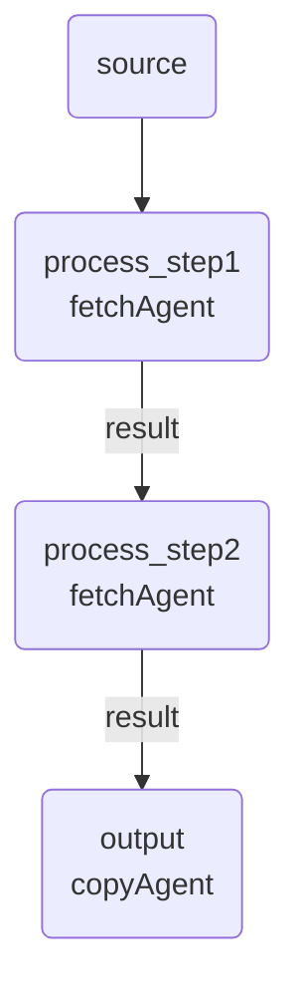
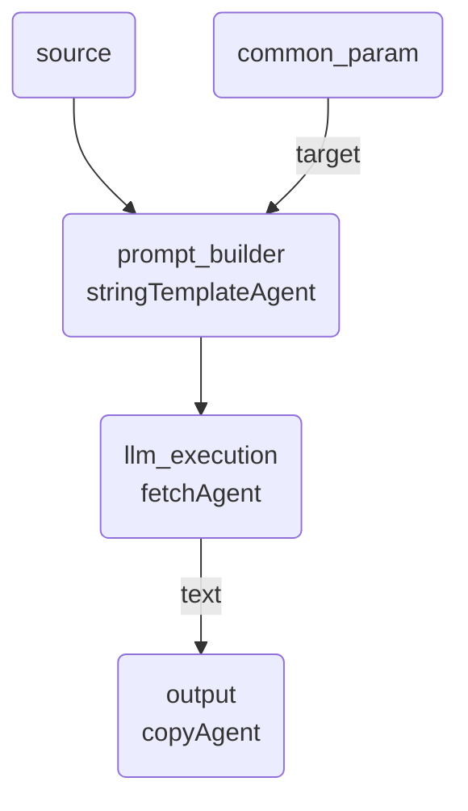
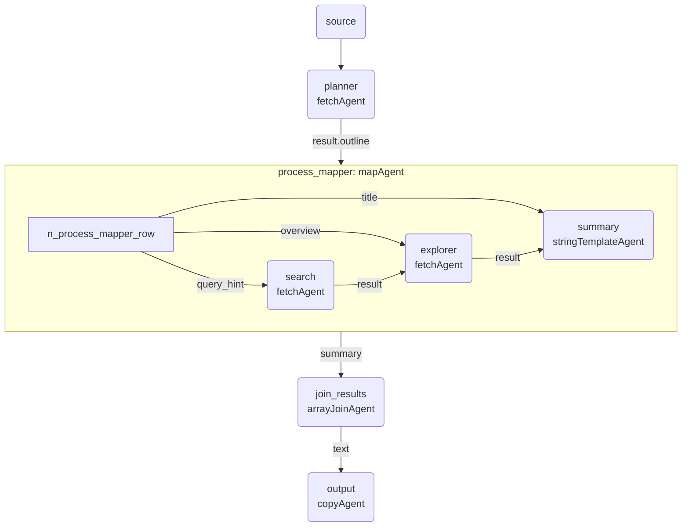
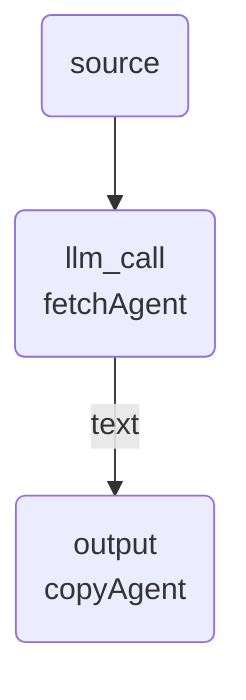
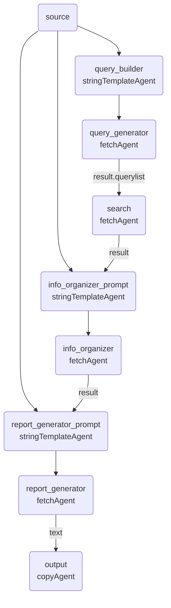
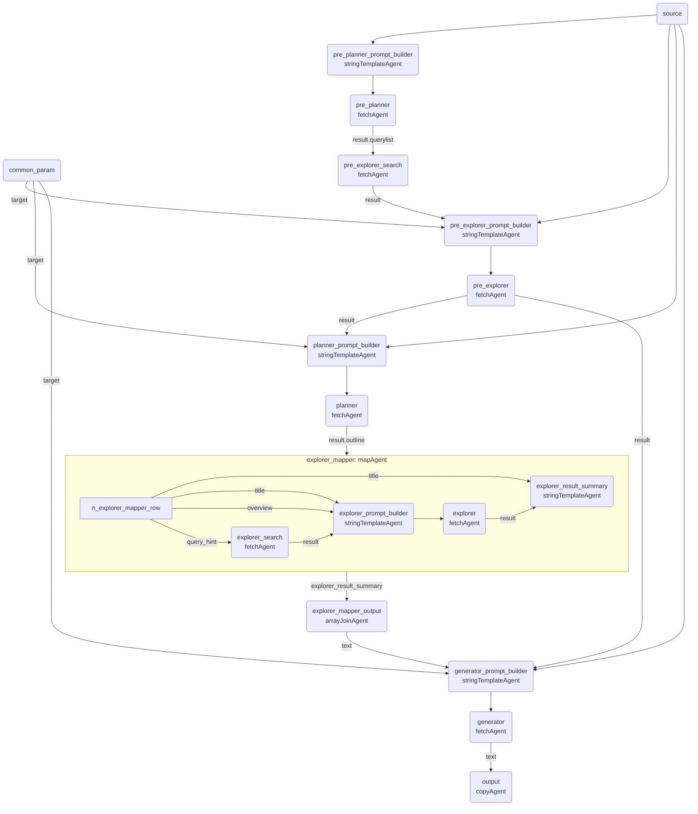

# GraphAI Workflow Generation Rules

このドキュメントは、GraphAI YMLワークフローファイルを自動生成する際のルールと設計指針をまとめています。

## ⚠️ 重要: 利用可能Agentの確認

**ワークフロー作成前に必ず確認**: [利用可能Agent一覧](./AVAILABLE_AGENTS.md)

このプロジェクトで実際に使用可能なAgentのみを使用してください。ドキュメントに記載されていても、実際の環境に存在しないAgentがあります。

## 目次

1. [基本構造](#基本構造)
2. [ワークフロー実行エンドポイント](#ワークフロー実行エンドポイント)
3. [必須要素](#必須要素)
4. [エージェント種別](#エージェント種別)
5. [データフローパターン](#データフローパターン)
6. [Agent選択指針](#agent選択指針)
7. [モデル選択指針](#モデル選択指針)
8. [環境変数プレースホルダー](#環境変数プレースホルダー)
   - [利用可能な環境変数](#利用可能な環境変数)
   - [使用例](#使用例)
   - [環境別の自動切り替え](#環境別の自動切り替え)
9. [expertAgent API統合](#expertagent-api統合)
   - [1. Utility API（Direct API）](#1-utility-apidirect-api---推奨)
     - [Gmail検索API](#11-gmail検索api)
     - [Gmail送信API](#12-gmail送信api)
     - [Google検索API](#13-google検索api)
     - [Google Drive UploadAPI](#14-google-drive-uploadapi)
     - [Text-to-Speech API (Base64)](#15-text-to-speech-api-base64)
     - [Text-to-Speech API (Google Drive Upload)](#16-text-to-speech-api-google-drive-upload)
   - [2. Utility AI Agent（Agent API）](#2-utility-ai-agentagent-api)
     - [Explorer Agent](#21-explorer-agent)
     - [Action Agent](#22-action-agent)
     - [その他のAgent](#23-その他のagent)
   - [3. LLM API](#3-llm-api)
     - [汎用LLM実行](#31-汎用llm実行)
     - [JSON Output Agent](#32-json-output-agent)
   - [4. API選択ガイド](#4-api選択ガイド)
10. [エラー回避パターン](#エラー回避パターン)
11. [パフォーマンスと並列処理の最適化](#パフォーマンスと並列処理の最適化)
12. [命名規則](#命名規則)
13. [デバッグとログ](#デバッグとログ)
14. [実装例](#実装例)
15. [LLMプロンプト生成時の推奨事項](#llmプロンプト生成時の推奨事項)
16. [YMLファイルのヘッダーコメント規約](#ymlファイルのヘッダーコメント規約)
17. [まとめ](#まとめ)
18. [よくあるエラーパターンと対策](#よくあるエラーパターンと対策)
19. [Agent専用ガイド](./agents/)
    - [Playwright Agent 完全ガイド](./agents/playwright-agent-guide.md)
    - [Explorer Agent 完全ガイド](./agents/explorer-agent-guide.md)
    - [File Reader Agent 完全ガイド](./agents/file-reader-agent-guide.md)

---

## 基本構造

### ファイルフォーマット

```yaml
version: 0.5
nodes:
  # ノード定義
  node_name:
    agent: agentType
    inputs:
      # 入力定義
    params:
      # パラメータ定義
    console:
      # デバッグログ設定
    isResult: true  # 最終出力ノードの場合
```

### 必須項目

- `version`: GraphAIバージョン（現在は `0.5` 固定）
- `nodes`: ノード定義オブジェクト
- 最低1つの `isResult: true` を持つ出力ノード

---

## ワークフロー実行エンドポイント

GraphAI Serverでワークフローを実行する際のエンドポイントURL生成ルールです。

### URL生成ルール

ワークフローYAMLファイルの配置場所によってエンドポイントURLが決まります。

**基本構造**:
- **ベースパス**: `./graphAiServer/config/graphai/`
- **エンドポイント**: `/api/v1/myagent/[directory/]filename`

**ルール**:
1. **直下に配置した場合**: `/api/v1/myagent/{filename}`
   - 例: `./graphAiServer/config/graphai/keyword_analysis.yml`
   - URL: `POST http://localhost:8105/api/v1/myagent/keyword_analysis`

2. **サブディレクトリに配置した場合**: `/api/v1/myagent/{directory}/{filename}`
   - 例: `./graphAiServer/config/graphai/podcast/script_generation.yml`
   - URL: `POST http://localhost:8105/api/v1/myagent/podcast/script_generation`

**重要事項**:
- ファイル名から `.yml` 拡張子は除く
- ディレクトリ階層はそのままURLパスに反映される
- 複数階層も可能: `category/subcategory/workflow_name`

**リクエスト例**:
```bash
curl -X POST "http://localhost:8105/api/v1/myagent/keyword_analysis" \
  -H "Content-Type: application/json" \
  -d '{
    "user_input": {"keyword": "AI技術"}
  }'
```

---

## 必須要素

### 1. sourceノード

ユーザー入力を受け取るエントリーポイント。

```yaml
nodes:
  source: {}
```

**重要**: `source`ノードには、APIリクエストの`user_input`がそのままの型で注入されます。

**📖 詳細仕様**: [GraphAI Input Schema](./GRAPHAI_INPUT_SCHEMA.md) を必ず参照してください。

#### sourceノードへのデータ注入仕様

GraphAI APIの`user_input`は**2つの形式**で送信可能です：

**1️⃣ オブジェクト形式（推奨）**:
```json
{
  "user_input": {
    "url": "https://example.com",
    "count": 10
  }
}
```

この場合、`source`はオブジェクトとして注入され、プロパティに直接アクセス可能：
```yaml
nodes:
  source: {}

  use_properties:
    agent: stringTemplateAgent
    inputs:
      url: :source.url      # ✅ "https://example.com"
      count: :source.count  # ✅ 10
    params:
      template: "URL: ${url}, Count: ${count}"
```

**2️⃣ 文字列形式（非推奨）**:
```json
{
  "user_input": "東京の天気を教えて"
}
```

この場合、`source`は文字列として注入される：
```yaml
nodes:
  source: {}

  use_string:
    agent: geminiAgent
    inputs:
      prompt: :source  # ✅ "東京の天気を教えて"
    params:
      model: gemini-2.0-flash-exp
```

**ベストプラクティス**:
- ✅ **オブジェクト形式を使用**することを強く推奨
- ✅ プロパティ名を明確にする（`q`ではなく`query`など）
- ✅ YMLファイルのコメントにInput Schemaを記載
- ❌ JSON文字列形式は避ける（`jsonParserAgent`が必要になり複雑化）

**よくあるエラー**:

誤: 文字列を`:source.property`で参照
```yaml
# user_input = "単純な文字列"

inputs:
  url: :source.url  # ❌ undefinedになる
```

誤: オブジェクトを`jsonParserAgent`でパース
```yaml
# user_input = { "url": "..." }

parse:
  agent: jsonParserAgent
  inputs:
    json: :source  # ❌ "Unexpected end of JSON input"エラー
```

正: オブジェクトなら直接参照、文字列ならそのまま使用
```yaml
# user_input = { "url": "..." }

use_url:
  agent: stringTemplateAgent
  inputs:
    url: :source.url  # ✅ 正しい
```

### 2. outputノード

最終結果を出力するノード。必ず `isResult: true` を設定。

```yaml
output:
  agent: copyAgent
  params:
    namedKey: text
  inputs:
    text: :previous_node.result
  isResult: true
```

---

## エージェント種別

**📋 完全なAgent一覧**: [AVAILABLE_AGENTS.md](./AVAILABLE_AGENTS.md) を参照してください。

以下は代表的なAgentの使用例です。

### fetchAgent

外部API（expertAgent含む）を呼び出すエージェント。expertAgentだけでなく、**任意の外部APIも呼び出し可能**です。

#### ✅ 正しい構造（推奨）

**重要**: `url`, `method`, `body`は**すべて`inputs`ブロック内**に配置してください。

**基本形**:
```yaml
node_name:
  agent: fetchAgent
  inputs:
    url: http://127.0.0.1:8104/aiagent-api/v1/endpoint
    method: POST  # GET, POST, PUT, DELETEなど
    body:
      user_input: :previous_node
      model_name: gpt-4o-mini
  console:
    after: true  # デバッグ時に推奨
```

**ポイント**:
- ✅ `url`, `method`, `body`を**inputsブロック内**に配置
- ✅ `params`ブロックは使用しない（fetchAgentでは不要）
- ✅ `body`内で他ノードの値を参照可能（`:previous_node`など）

#### 動的URLの場合

前段のノードから取得したURLを使用する場合：

```yaml
call_dynamic_api:
  agent: fetchAgent
  inputs:
    url: :previous_node.api_url  # ✅ 動的にURLを参照
    method: POST
    body:
      user_input: :source
      model_name: gpt-4o-mini
```

#### 固定URLの場合

URLが固定値の場合：

```yaml
call_fixed_api:
  agent: fetchAgent
  inputs:
    url: http://127.0.0.1:8104/aiagent-api/v1/mylllm  # ✅ 固定値を直接指定
    method: POST
    body:
      user_input: :source
      model_name: gpt-4o-mini
```

#### テンプレート文字列を使う場合

bodyプロパティでテンプレート変数を使用する場合：

```yaml
call_with_template:
  agent: fetchAgent
  inputs:
    url: http://127.0.0.1:8104/aiagent-api/v1/mylllm
    method: POST
    body:
      user_input: |-
        以下のURLを処理してください：
        URL: ${target_url}
        処理内容: ${action}
      model_name: gpt-4o-mini
      target_url: :source.url      # ✅ body内で参照可能
      action: :source.action       # ✅ body内で参照可能
```

#### ❌ 誤った構造（よくあるエラー）

**エラーパターン1: inputsとparamsでurlが競合**

```yaml
# ❌ 間違い
node_name:
  agent: fetchAgent
  inputs:
    url: :source.url          # ❌ inputsにurl
  params:
    url: http://127.0.0.1:8104/api/endpoint  # ❌ paramsにもurl（競合！）
    method: POST
    body:
      user_input: :url        # ❌ :urlは未定義（inputsのurlと混同）
```

**問題点**:
- `inputs.url`と`params.url`が競合し、GraphAIがどちらを使うべきか判断できない
- `body`内の`:url`参照が未定義（inputsブロック内の`url`はbody内では直接参照不可）
- 結果: APIリクエストが失敗、または予期しない動作

**エラーパターン2: paramsブロックにurl/method/bodyを配置**

```yaml
# ❌ 間違い
node_name:
  agent: fetchAgent
  params:                     # ❌ fetchAgentではparamsは使用しない
    url: http://...
    method: POST
    body:
      user_input: :source
```

**問題点**:
- fetchAgentは`params`ブロックを認識しない
- `inputs`ブロックを使用する必要がある

**正しい修正例**:

```yaml
# ✅ 正しい
node_name:
  agent: fetchAgent
  inputs:                     # ✅ すべてinputsブロック内
    url: http://127.0.0.1:8104/api/endpoint
    method: POST
    body:
      user_input: :source.url  # ✅ sourceから直接参照
      model_name: gpt-4o-mini
```

#### オプションパラメータ

```yaml
node_name:
  agent: fetchAgent
  inputs:
    url: http://127.0.0.1:8104/api/endpoint
    method: POST
    body:
      user_input: :source
  timeout: 30   # オプション: タイムアウト（秒）デフォルト30秒
  retry: 0      # オプション: リトライ回数、デフォルト0
  console:
    before: true  # オプション: 実行前のログ出力
    after: true   # オプション: 実行後のログ出力（推奨）
```

#### 外部API利用時の注意

- ✅ **インターフェース定義**: リクエスト/レスポンス形式を明確に定義すること
- ✅ **タイムアウト設定**: 適切なタイムアウト値を設定すること（デフォルト30秒）
  - **重要**: API定義に `recommended_timeout` がある場合はその値を使用すること
  - 例: Google検索API (`/v1/utility/google_search`) は `timeout: 180` を設定すること（LLMナレッジ抽出のため処理時間が長い）
- ✅ **エラーハンドリング**: APIエラー時の動作を考慮すること
- ✅ **デバッグログ**: `console.after: true`でレスポンスを確認すること

#### 処理時間の長いAPI

以下のAPIはLLM処理を含むため、タイムアウトを長めに設定すること：

| API | 推奨timeout | 理由 |
|-----|------------|------|
| `/v1/utility/google_search` | 180秒 | 検索結果ごとにLLMナレッジ抽出を実行 |
| `/v1/utility/google_search_overview` | 60秒 | LLMを使用しないが、複数クエリで時間がかかる場合あり |

### anthropicAgent

Claude APIを直接呼び出すGraphAI標準エージェント。

```yaml
node_name:
  agent: anthropicAgent
  inputs:
    prompt: :previous_node
  params:
    model: claude-sonnet-4.5  # Claude Sonnet 4.5（最新）
    # または claude-opus-4.1（エージェントタスク特化）
```

### geminiAgent

Google Gemini APIを直接呼び出すGraphAI標準エージェント。

```yaml
node_name:
  agent: geminiAgent
  inputs:
    prompt: :previous_node
  params:
    model: gemini-2.5-pro  # Gemini 2.5 Pro（最新・最高精度）
    # または gemini-2.5-flash（高速・バランス型）
    # または gemini-2.5-flash-lite（超高速・低コスト）
```

### stringTemplateAgent

テンプレート文字列を生成するエージェント。

```yaml
prompt_builder:
  agent: stringTemplateAgent
  inputs:
    variable1: :source
    variable2: :other_node.result
  params:
    template: |-
      # プロンプトテンプレート
      ユーザー入力: ${variable1}
      追加情報: ${variable2}
```

### mapAgent

配列の各要素に対して並列処理を実行するエージェント。

```yaml
mapper:
  agent: mapAgent
  inputs:
    rows: :planner.result.outline  # 配列データ
  params:
    compositeResult: true  # 結果を統合
  graph:
    nodes:
      # 各要素に対して実行されるサブグラフ
      process_item:
        agent: fetchAgent
        inputs:
          url: http://127.0.0.1:8104/api/endpoint
          body:
            data: :row.field  # 各要素にアクセス
```

#### mapAgentの出力形式と参照方法（重要）

mapAgentの出力形式は `compositeResult` パラメータによって大きく異なります。
後続ノードでの参照方法も変わるため、**必ず理解してください**。

##### パターンA: compositeResult なし（デフォルト）

**出力形式**: オブジェクトの配列

```json
[
  {
    "read_pdf": {...},
    "summarize_content": {...},
    "format_summary": "文字列"
  },
  {
    "read_pdf": {...},
    "summarize_content": {...},
    "format_summary": "文字列"
  }
]
```

**後続ノードでの参照**:
- ❌ `:mapAgentノード名.format_summary` → **機能しない**
- ✅ `nestedAgent` を使って変換が必要（後述のSolution 1参照）

**YML例**:
```yaml
summarize_pdfs:
  agent: mapAgent
  # compositeResult 未指定
  graph:
    nodes:
      format_summary:
        agent: stringTemplateAgent
        params:
          template: "Result: ${input}"
        isResult: true

# この場合、後続ノードで nestedAgent が必要
extract_summaries:
  agent: nestedAgent
  inputs:
    array: :summarize_pdfs
  graph:
    nodes:
      extract:
        value: :row.format_summary
        isResult: true
  params:
    compositeResult: true

join_results:
  agent: arrayJoinAgent
  inputs:
    array: :extract_summaries
```

##### パターンB: compositeResult: true（推奨）

**出力形式**: `{ "isResultノード名": [...] }` 形式のオブジェクト

```json
{
  "format_summary": [
    "文字列1",
    "文字列2",
    "文字列3"
  ]
}
```

**重要**:
- オブジェクトのキー名は、サブグラフ内で `isResult: true` が指定されたノードの名前
- 値は、そのノードの出力の配列

**後続ノードでの参照**:
- ✅ `:mapAgentノード名.isResultノード名` → **配列が取得できる**

**YML例**:
```yaml
summarize_pdfs:
  agent: mapAgent
  params:
    compositeResult: true  # ← 必須
  graph:
    nodes:
      format_summary:
        agent: stringTemplateAgent
        params:
          template: "Result: ${input}"
        isResult: true  # ← この名前が出力オブジェクトのキーになる

# 直接参照可能（nestedAgent 不要）
join_results:
  agent: arrayJoinAgent
  inputs:
    array: :summarize_pdfs.format_summary  # ← プロパティアクセス
```

##### 推奨事項

**mapAgentを使用する場合**:
1. **必ず `compositeResult: true` を指定する**（パターンB）
2. サブグラフの最終ノードに `isResult: true` を指定
3. 後続ノードで `:mapAgentノード名.isResultノード名` で参照

**理由**:
- nestedAgentによる変換が不要（シンプル）
- データ構造が予測可能
- デバッグが容易

---

### arrayJoinAgent

配列を結合するエージェント。

```yaml
join_results:
  agent: arrayJoinAgent
  params:
    separator: \n---\n
  inputs:
    array: :mapper.result_field
```

### copyAgent

データをコピー・変換するエージェント。

```yaml
output:
  agent: copyAgent
  params:
    namedKey: text  # 特定のキーを抽出
  inputs:
    text: :previous_node.result
  isResult: true
```

---

## データフローパターン

### パターン1: シンプルな順次処理

**データフロー図**:

```mermaid
flowchart TD
  n_source(source)
  n_process_step1(process_step1<br/>fetchAgent)
  n_source --> n_process_step1
  n_process_step2(process_step2<br/>fetchAgent)
  n_process_step1 -- result --> n_process_step2
  n_output(output<br/>copyAgent)
  n_process_step2 -- result --> n_output
  class n_source staticNode
  class n_process_step1,n_process_step2,n_output computedNode
```

**YAML定義**:
```yaml
version: 0.5
nodes:
  source: {}

  process_step1:
    agent: fetchAgent
    inputs:
      url: http://127.0.0.1:8104/api/step1
      body:
        input: :source

  process_step2:
    agent: fetchAgent
    inputs:
      url: http://127.0.0.1:8104/api/step2
      body:
        input: :process_step1.result

  output:
    agent: copyAgent
    inputs:
      text: :process_step2.result
    isResult: true
```

### パターン2: プロンプトビルダーパターン

**データフロー図**:

```mermaid
flowchart TD
  n_source(source)
  n_common_param(common_param)
  n_prompt_builder(prompt_builder<br/>stringTemplateAgent)
  n_source --> n_prompt_builder
  n_common_param -- target --> n_prompt_builder
  n_llm_execution(llm_execution<br/>fetchAgent)
  n_prompt_builder --> n_llm_execution
  n_output(output<br/>copyAgent)
  n_llm_execution -- text --> n_output
  class n_source,n_common_param staticNode
  class n_prompt_builder,n_llm_execution,n_output computedNode
```

**YAML定義**:
```yaml
version: 0.5
nodes:
  source: {}

  # パラメータ定義
  common_param:
    value:
      target: 39歳、男性
      tone: 深掘り討論

  # プロンプト構築
  prompt_builder:
    agent: stringTemplateAgent
    inputs:
      user_input: :source
      target: :common_param.target
    params:
      template: |-
        # 指示書
        対象ユーザー: ${target}

        # ユーザー入力
        ${user_input}

  # LLM実行
  llm_execution:
    agent: fetchAgent
    inputs:
      url: http://127.0.0.1:8104/aiagent-api/v1/mylllm
      method: POST
      body:
        user_input: :prompt_builder
        model_name: gpt-oss:20b

  output:
    agent: copyAgent
    inputs:
      text: :llm_execution.text
    isResult: true
```

### パターン3: 並列処理パターン（MapAgent）

**データフロー図**:

```mermaid
flowchart TD
  n_source(source)
  n_planner(planner<br/>fetchAgent)
  n_source --> n_planner
  subgraph n_process_mapper[process_mapper: mapAgent]
    n_process_mapper_search(search<br/>fetchAgent)
    n_process_mapper_row -- query_hint --> n_process_mapper_search
    n_process_mapper_explorer(explorer<br/>fetchAgent)
    n_process_mapper_row -- overview --> n_process_mapper_explorer
    n_process_mapper_search -- result --> n_process_mapper_explorer
    n_process_mapper_summary(summary<br/>stringTemplateAgent)
    n_process_mapper_row -- title --> n_process_mapper_summary
    n_process_mapper_explorer -- result --> n_process_mapper_summary
  end
  n_planner -- result.outline --> n_process_mapper
  n_join_results(join_results<br/>arrayJoinAgent)
  n_process_mapper -- summary --> n_join_results
  n_output(output<br/>copyAgent)
  n_join_results -- text --> n_output
  class n_source staticNode
  class n_planner,n_process_mapper_search,n_process_mapper_explorer,n_process_mapper_summary,n_join_results,n_output computedNode
  class n_process_mapper nestedGraph
```

**YAML定義**:
```yaml
version: 0.5
nodes:
  source: {}

  # プランナー: タスクを複数の章に分割
  planner:
    agent: fetchAgent
    inputs:
      url: http://127.0.0.1:8104/aiagent-api/v1/aiagent/utility/jsonoutput
      method: POST
      body:
        user_input: :source
        model_name: gpt-oss:20b

  # 各章を並列処理
  process_mapper:
    agent: mapAgent
    inputs:
      rows: :planner.result.outline
    params:
      compositeResult: true
    graph:
      nodes:
        # Google検索
        search:
          agent: fetchAgent
          inputs:
            url: http://127.0.0.1:8104/aiagent-api/v1/utility/google_search
            method: POST
            body:
              queries: :row.query_hint

        # 情報収集
        explorer:
          agent: fetchAgent
          inputs:
            url: http://127.0.0.1:8104/aiagent-api/v1/aiagent/utility/explorer
            method: POST
            body:
              user_input: :row.overview
              search_result: :search.result
              model_name: gpt-oss:20b

        # 結果サマリー
        summary:
          agent: stringTemplateAgent
          inputs:
            title: :row.title
            content: :explorer.result
          params:
            template: |-
              ### ${title}
              ${content}
          isResult: true

  # 結果統合
  join_results:
    agent: arrayJoinAgent
    params:
      separator: \n---\n
    inputs:
      array: :process_mapper.summary

  output:
    agent: copyAgent
    inputs:
      text: :join_results.text
    isResult: true
```

---

## Agent選択指針

このセクションでは、タスクに応じて最適なAgentを選択するための指針を提供します。

### 選択フローチャート

```
タスクを分析
  │
  ├─ Web情報収集が必要？
  │   YES → Explorer Agent or Playwright Agent
  │          （詳細は下記比較表参照）
  │   NO → 次へ
  │
  ├─ ファイル読み込みが必要？
  │   YES → File Reader Agent
  │   NO → 次へ
  │
  ├─ 構造化JSON出力が必要？
  │   YES → jsonoutput Agent
  │   NO → 次へ
  │
  ├─ Gmail/カレンダー操作が必要？
  │   YES → Action Agent
  │   NO → 次へ
  │
  └─ その他のLLM処理
      → mylllm Agent（汎用LLM呼び出し）
```

### Web情報収集: Explorer Agent vs Playwright Agent

**重要**: Webページからの情報抽出には **Explorer Agent（html2markdown MCP）** の使用を強く推奨します。

| 観点 | Explorer Agent | Playwright Agent |
|------|---------------|------------------|
| **推奨用途** | ✅ **Webページのテキスト・情報抽出** | ⚠️ ブラウザ操作・スクリーンショット |
| **テキスト抽出精度** | ⭐⭐⭐⭐⭐ 高精度<br>（html2markdown MCP） | ⭐⭐ 低精度<br>（アクセシビリティツリー） |
| **構造保持** | ⭐⭐⭐⭐⭐ Markdown形式<br>（見出し、リスト、表を保持） | ⭐⭐ アクセシビリティツリー<br>（構造が崩れやすい） |
| **処理速度** | ⭐⭐⭐⭐⭐ 高速 | ⭐⭐⭐ 中速 |
| **コスト** | $ 低コスト | $$ 中コスト |
| **典型的なユースケース** | ・ニュース記事の本文抽出<br>・ブログ記事の取得<br>・PDFリンクの一括抽出<br>・技術ドキュメントの解析<br>・Google検索結果の詳細取得 | ・フォーム操作（入力、送信）<br>・スクリーンショット取得<br>・JavaScript実行 |

**判断基準**:
- **テキスト抽出が主目的** → **Explorer Agent**
- **ブラウザ操作が必要** → Playwright Agent
- **迷ったら** → まず**Explorer Agent**を試す

**例: ニュース記事の抽出**
```yaml
# ✅ 推奨: Explorer Agent
news_extractor:
  agent: fetchAgent
  params:
    url: "${EXPERTAGENT_BASE_URL}/aiagent-api/v1/aiagent/utility/explorer"
    method: "POST"
    body:
      user_input: "下記サイトの記事本文をMarkdown形式で抽出してください。\nhttps://example.com/news/article-123"
      model_name: "gemini-2.5-flash"

# ⚠️ 非推奨: Playwright Agent（精度が低い）
news_extractor_playwright:
  agent: fetchAgent
  params:
    url: "${EXPERTAGENT_BASE_URL}/aiagent-api/v1/aiagent/utility/playwright"
    method: "POST"
    body:
      user_input: "下記サイトから記事のタイトルと本文を抽出してください。\nhttps://example.com/news/article-123"
      model_name: "gemini-2.5-flash"
```

#### Explorer Agentのhtml2markdown機能

**getMarkdown_tool** を使用してHTMLをMarkdown形式に変換します。

**特徴**:
- ✅ **リンク保持**: `[テキスト](URL)` 形式でリンク構造を保持
- ✅ **不要要素削除**: script, style, nav, header, footer を自動削除
- ✅ **高速**: LLM推論不要で3-5秒で完了
- ✅ **決定的**: 同じURLから常に同じMarkdown生成

**使用例: HTMLをMarkdownに変換**

```yaml
get_markdown:
  agent: fetchAgent
  inputs:
    url: "${EXPERTAGENT_BASE_URL}/aiagent-api/v1/aiagent/utility/explorer"
    method: "POST"
    body:
      user_input: "次のURLからMarkdownを取得: https://example.com/page.html"
      model_name: "gemini-2.5-flash"
```

**使用例: PDF URL抽出の完全な例**

```yaml
version: 0.5
nodes:
  source:
    value:
      url: "https://japancredit.go.jp/about/mrv/"

  # ステップ1: HTMLをMarkdownに変換
  html_to_markdown:
    agent: fetchAgent
    inputs:
      url: "${EXPERTAGENT_BASE_URL}/aiagent-api/v1/aiagent/utility/explorer"
      method: "POST"
      body:
        user_input: "URLからMarkdownを取得: ${source.url}"
        model_name: "gemini-2.5-flash"

  # ステップ2: PDF URLをLLM抽出（正規表現でも可）
  extract_pdf_urls:
    agent: fetchAgent
    inputs:
      url: "${EXPERTAGENT_BASE_URL}/aiagent-api/v1/aiagent/utility/jsonoutput"
      method: "POST"
      body:
        user_input: |
          次のMarkdownテキストからPDF URLを全て抽出してJSON配列で出力してください。

          Markdown:
          ${html_to_markdown.result}

          出力形式: ["https://example.com/file1.pdf", "https://example.com/file2.pdf"]
        model_name: "gemini-2.5-flash"

  # ステップ3: mapAgentで並列アップロード
  upload_to_drive:
    agent: mapAgent
    inputs:
      rows: :extract_pdf_urls
    graph:
      nodes:
        upload:
          agent: fetchAgent
          inputs:
            url: "${EXPERTAGENT_BASE_URL}/v1/drive/upload"
            method: "POST"
            body:
              file_url: ":row"
              folder_id: "google_drive_folder_id_here"
          isResult: true
    params:
      compositeResult: true
```

**正規表現を使った高速抽出（推奨）**

LLMを使わずに正規表現でPDF URLを抽出する方が高速で確実です：

```yaml
version: 0.5
nodes:
  source:
    value:
      url: "https://japancredit.go.jp/about/mrv/"

  # ステップ1: HTMLをMarkdownに変換
  html_to_markdown:
    agent: fetchAgent
    inputs:
      url: "${EXPERTAGENT_BASE_URL}/aiagent-api/v1/aiagent/utility/explorer"
      method: "POST"
      body:
        user_input: "URLからMarkdownを取得: ${source.url}"
        model_name: "gemini-2.5-flash"

  # ステップ2: 正規表現でPDF URLを抽出（LLM不要、高速）
  extract_pdf_urls:
    agent: pythonAgent
    inputs:
      markdown: :html_to_markdown.result
    params:
      code: |
        import re
        # Markdown形式: [text](url) からPDF URLを抽出
        pdf_links = re.findall(r'\[.*?\]\((https?://[^\)]+\.pdf)\)', markdown)
        # 重複削除
        return list(set(pdf_links))

  # ステップ3: mapAgentで並列アップロード
  upload_to_drive:
    agent: mapAgent
    inputs:
      rows: :extract_pdf_urls
    graph:
      nodes:
        upload:
          agent: fetchAgent
          inputs:
            url: "${EXPERTAGENT_BASE_URL}/v1/drive/upload"
            method: "POST"
            body:
              file_url: ":row"
              folder_id: "google_drive_folder_id_here"
          isResult: true
    params:
      compositeResult: true
```

### ファイル処理: File Reader Agent

**対応ファイル形式**:

| ファイル形式 | 処理方法 | コスト | 備考 |
|------------|---------|--------|------|
| **PDF** | PyPDF2で全文抽出 | 無料 | 要約なし、原文そのまま |
| **画像** (PNG/JPG) | OpenAI Vision API | $$$ | gpt-4o使用 |
| **音声** (MP3/WAV) | OpenAI Whisper API | $ | whisper-1使用 |
| **テキスト/CSV** | Python標準ライブラリ | 無料 | 複数エンコーディング対応 |

**データソース**:
- ✅ インターネットURL（HTTP/HTTPS）
- ✅ Google Drive（OAuth2認証、MyVault管理）
- ✅ ローカルファイル（セキュリティ制限あり: `/tmp`, `~/Downloads`, `~/Documents`）

**重要な注意点**:

1. **画像処理時の必須表現**:
   ```yaml
   # ❌ NG: LLMがツール呼び出しを拒否
   user_input: "テキストを抽出してください。\nhttps://example.com/image.png"

   # ✅ OK: 「画像ファイルの」を明記
   user_input: "下記画像ファイルのテキストを抽出してください。\nhttps://example.com/image.png"
   ```

2. **Google Driveアクセス**:
   - ユーザーがMyVaultでGoogle認証を完了している必要あり
   - 権限エラー発生時は「リンクを知っている全員」に共有設定

**例: PDF全文抽出**
```yaml
pdf_extractor:
  agent: fetchAgent
  params:
    url: "http://127.0.0.1:8104/aiagent-api/v1/aiagent/utility/file_reader"
    method: "POST"
    body:
      user_input: "下記PDFファイルのテキストを全て抽出してください。\nhttps://example.com/whitepaper.pdf"
      model_name: "gpt-4o-mini"
```

### 構造化JSON出力: jsonoutput Agent

**用途**: LLMの出力を特定のJSON構造に整形する必要がある場合

**典型的なユースケース**:
- アウトライン生成（章立て、見出し構造）
- プランナーとして複数タスクのリストを生成
- MapAgentの入力データ作成

**例: アウトライン生成**
```yaml
planner:
  agent: fetchAgent
  params:
    url: "http://127.0.0.1:8104/aiagent-api/v1/aiagent/utility/jsonoutput"
    method: "POST"
    body:
      user_input: |
        下記トピックについて、4-6章構成のアウトラインを作成してください。
        各章には title, overview, query_hint を含めてください。

        トピック: :source
      model_name: "gpt-oss:120b"
```

### Gmail/カレンダー操作: Action Agent

**用途**: Gmail送信、Googleカレンダー操作など、外部サービスとの連携

**典型的なユースケース**:
- メール送信
- カレンダーイベント作成
- Google Drive操作

**例: メール送信**
```yaml
send_notification:
  agent: fetchAgent
  params:
    url: "http://127.0.0.1:8104/aiagent-api/v1/aiagent/utility/action"
    method: "POST"
    body:
      user_input: |
        下記の内容でメールを送信してください。
        宛先: user@example.com
        件名: レポート完成のお知らせ
        本文: :report_result
      model_name: "gpt-4o-mini"
```

### Wikipedia検索: wikipedia Agent

**用途**: Wikipedia記事の検索と要約取得

**典型的なユースケース**:
- 基礎知識の取得
- 用語の定義確認
- 概要情報の収集

**例: Wikipedia検索**
```yaml
wiki_search:
  agent: fetchAgent
  params:
    url: "http://127.0.0.1:8104/aiagent-api/v1/aiagent/utility/wikipedia"
    method: "POST"
    body:
      user_input: "量子コンピュータについて調べてください"
      model_name: "gpt-4o-mini"
```

---

## モデル選択指針

このセクションでは、タスクに応じて最適なLLMモデルを選択するための指針を提供します。

### 推奨モデル一覧

| モデル | 推奨度 | 特徴 | 使用ケース | コスト |
|--------|--------|------|-----------|--------|
| **gpt-oss:20b** | ⭐⭐⭐ | 軽量・高速、ローカル実行 | 単純なタスク、リアルタイム応答 | 無料 |
| **gpt-oss:120b** | ⭐⭐⭐ | 高精度、ローカル実行 | 複雑な推論、レポート生成 | 無料 |
| **gpt-4o-mini** | ⭐⭐⭐ | バランス型、API | Agent統合（Playwright/Explorer） | $ |
| **Gemini 2.5 Flash** | ⭐⭐⭐ | 高速、100万トークン | 大規模文書処理 | $ |
| **Gemini 2.5 Pro** | ⭐⭐ | 最高精度、思考プロセス付き | 極めて複雑なタスク | $$$ |
| **Claude Sonnet 4.5** | ⭐⭐ | コーディング最高精度 | ワークフロー生成、コード生成 | $$ |

### タスク別推奨モデル

#### 1. ワークフロー生成・コーディング

- **第1選択**: Claude Sonnet 4.5
- **第2選択**: Gemini 2.5 Flash
- **理由**: YML構造の正確な理解、長文コンテキスト対応

#### 2. レポート生成・要約

- **第1選択**: gpt-oss:120b（ローカル）
- **第2選択**: Gemini 2.5 Flash
- **理由**: コスト無料、高精度

#### 3. Agent統合（Playwright/Explorer/File Reader）

- **第1選択**: gpt-4o-mini
- **理由**: Agent指示理解に最適、コスト効率良好

**重要**: Agent統合時は必ず **gpt-4o-mini** を使用してください。他のモデルではツール呼び出しが正常に動作しない場合があります。

#### 4. リアルタイム対話

- **第1選択**: gpt-oss:20b（ローカル）
- **理由**: 高速応答、コスト無料

#### 5. 大規模文書処理（100ページ以上のPDF等）

- **第1選択**: Gemini 2.5 Flash
- **理由**: 100万トークンコンテキスト

### コスト最適化戦略

1. **ローカルLLM優先**: まず **gpt-oss:20b/120b** を試す
2. **Agent統合は gpt-4o-mini**: Playwright/Explorer/File Reader統合時は必須
3. **高精度が必要な場合のみクラウドLLM**: Gemini/Claude
4. **段階的スケールアップ**: 20b → 120b → gpt-4o-mini → Gemini Flash → Gemini Pro

### expertAgent APIでのモデル指定方法

```yaml
# ローカルLLM（推奨・無料）
model_name: "gpt-oss:20b"    # 軽量・高速
model_name: "gpt-oss:120b"   # 高精度

# クラウドLLM（有料）
model_name: "gpt-4o-mini"       # Agent統合時に推奨
model_name: "gemini-2.5-flash"  # 大規模文書処理
model_name: "gemini-2.5-pro"    # 最高精度
model_name: "claude-sonnet-4-5" # コーディング
```

### モデル選択の実践例

#### 例1: ニュース記事の要約

```yaml
# ✅ 推奨: ローカルLLM（無料）
summarizer:
  agent: fetchAgent
  params:
    url: "http://127.0.0.1:8104/aiagent-api/v1/mylllm"
    method: "POST"
    body:
      user_input: "下記記事を3行で要約してください。\n:article_content"
      model_name: "gpt-oss:120b"  # 高精度、無料
```

#### 例2: Playwright Agentでのスクレイピング

**⚠️ 重要**: Playwright Agentは **LLMベースの自然言語出力** を行うため、以下のタスクには**不適切**です：

### ❌ Playwright Agent を使うべきでないケース

- ❌ PDF URLリストの抽出
- ❌ ニュース記事の本文取得
- ❌ 商品価格の一覧取得
- ❌ テーブルデータの抽出
- ❌ JSON形式での構造化データ出力

**理由**: Playwright は **LLMベースの自然言語出力** を行うため、構造化データ抽出に不向き。

### ✅ Playwright Agent を使うべきケース

- ✅ ログインフォームへの入力・送信
- ✅ JavaScriptレンダリング後の動的コンテンツ取得
- ✅ スクリーンショット撮影
- ✅ ファイルダウンロード（直接URL指定不可の場合）
- ✅ ページ内のボタンクリック操作

**使用例（適切なケース）**:

```yaml
# ✅ 推奨: フォーム操作やスクリーンショット取得
web_scraper:
  agent: fetchAgent
  params:
    url: "${EXPERTAGENT_BASE_URL}/aiagent-api/v1/aiagent/utility/playwright"
    method: "POST"
    body:
      user_input: "下記サイトのスクリーンショットを取得してください。\nhttps://example.com"
      model_name: "gpt-4o-mini"  # Agent統合時は必須
```

#### 例3: 大規模PDF処理

```yaml
# ✅ 推奨: Gemini 2.5 Flash（100万トークン対応）
pdf_processor:
  agent: fetchAgent
  params:
    url: "http://127.0.0.1:8104/aiagent-api/v1/aiagent/utility/file_reader"
    method: "POST"
    body:
      user_input: "下記200ページのPDFから重要ポイントを抽出してください。\n:pdf_url"
      model_name: "gemini-2.5-flash"  # 長文対応
```

---

## 環境変数プレースホルダー

**🚨 重要**: ワークフロー内でexpertAgent等のサービスを呼び出す際は、**必ず環境変数プレースホルダーを使用**してください。

### なぜ環境変数プレースホルダーが必要か

MySwiftAgentは複数の実行環境をサポートしており、各環境でポート番号が異なります：

| 環境 | expertagent | graphaiserver | myvault |
|------|------------|--------------|---------|
| **quick-start.sh** | `localhost:8104` | `localhost:8105` | `localhost:8103` |
| **dev-start.sh** | `localhost:8004` | `localhost:8005` | `localhost:8003` |
| **docker-compose** | `expertagent:8000` | `graphaiserver:8000` | `myvault:8000` |

**ハードコードされたURL**は特定環境でしか動作しないため、**環境変数プレースホルダー**を使用します。

### 利用可能な環境変数

| プレースホルダー | quick-start.sh | dev-start.sh | docker-compose |
|---------------|---------------|-------------|---------------|
| `${EXPERTAGENT_BASE_URL}` | `http://localhost:8104` | `http://localhost:8004` | `http://expertagent:8000` |
| `${GRAPHAISERVER_BASE_URL}` | `http://localhost:8105` | `http://localhost:8005` | `http://graphaiserver:8000` |
| `${MYVAULT_BASE_URL}` | `http://localhost:8103` | `http://localhost:8003` | `http://myvault:8000` |
| `${JOBQUEUE_BASE_URL}` | `http://localhost:8101` | `http://localhost:8001` | `http://jobqueue:8000` |
| `${MYSCHEDULER_BASE_URL}` | `http://localhost:8102` | `http://localhost:8002` | `http://myscheduler:8000` |

### 使用例

#### ✅ 推奨: 環境変数プレースホルダーを使用

```yaml
# Gmail検索APIの例
search_email:
  agent: fetchAgent
  inputs:
    url: "${EXPERTAGENT_BASE_URL}/aiagent-api/v1/utility/gmail/search"
    method: "POST"
    body:
      keyword: :source.keyword
      top: 1
```

**メリット**:
- ✅ quick-start.sh / dev-start.sh / docker-compose 全環境で動作
- ✅ ポート変更時もワークフローファイルの修正不要
- ✅ Gemini が生成したワークフローが環境非依存

#### ❌ 非推奨: ハードコードされたURL

```yaml
# quick-start.sh 専用（他環境で動作しない）
url: "http://127.0.0.1:8104/aiagent-api/v1/utility/gmail/search"

# dev-start.sh 専用（他環境で動作しない）
url: "http://127.0.0.1:8004/aiagent-api/v1/utility/gmail/search"

# docker-compose 専用（ローカル開発で動作しない）
url: "http://expertagent:8000/aiagent-api/v1/utility/gmail/search"
```

**問題点**:
- ❌ 特定環境でしか動作しない
- ❌ 環境を変える度にファイル修正が必要
- ❌ タイムアウトエラーの原因になる

### 環境別の自動切り替え

環境変数プレースホルダーは、GraphAI Server起動時に自動的に置換されます：

```typescript
// graphAiServer/src/services/graphai.ts (自動処理)
// quick-start.sh環境
"${EXPERTAGENT_BASE_URL}" → "http://localhost:8104"

// dev-start.sh環境
"${EXPERTAGENT_BASE_URL}" → "http://localhost:8004"

// docker-compose環境
"${EXPERTAGENT_BASE_URL}" → "http://expertagent:8000"
```

**通常は手動設定不要**: 各起動スクリプトが自動的に環境変数を設定します。

### よくあるエラーと対処法

#### エラー1: 接続タイムアウト（60秒）

**症状**:
```
fetchAgent error: connect ETIMEDOUT
```

**原因**: 存在しないポート（8104等）にアクセスしている

**解決策**: 環境変数プレースホルダーを使用
```yaml
# 修正前
url: "http://127.0.0.1:8104/..."

# 修正後
url: "${EXPERTAGENT_BASE_URL}/..."
```

#### エラー2: ECONNREFUSED

**症状**:
```
fetchAgent error: connect ECONNREFUSED 127.0.0.1:8104
```

**原因**: Docker環境で localhost を使用している

**解決策**: 環境変数プレースホルダーを使用（自動的にコンテナ名に置換される）

---

## expertAgent API統合

### 重要: URL指定ルール

**expertAgent APIを呼び出す際は、必ず環境変数プレースホルダーを使用してください：**

```yaml
# ✅ 推奨
url: "${EXPERTAGENT_BASE_URL}/aiagent-api/v1/endpoint"

# ❌ 非推奨（環境依存）
url: "http://127.0.0.1:8104/aiagent-api/v1/endpoint"
```

### expertAgentの機能分類

expertAgentは3種類のAPI群を提供します：

| API種別 | 特徴 | 速度 | JSON保証 | 用途 |
|---------|------|------|---------|------|
| **Utility API** | LLM推論なし、Direct API | ⚡ 高速（3-5秒） | ✅ 100% | 確実な実行が必要な操作 |
| **Utility AI Agent** | LLMが実行判断 | 🐢 低速（20-180秒） | ❌ 要パース | 条件付き実行、柔軟な判断 |
| **LLM API** | 汎用テキスト生成 | ⚡ 高速（5-20秒） | - | テキスト生成、JSON出力 |

### Utility API vs Utility AI Agent 比較

#### **Utility API（Direct API）の特徴**

**メリット**:
- ⚡ **超高速**: LLM推論を介さないため3-5秒で完了（Agent比6-36倍高速）
- ✅ **JSON保証**: レスポンスが100%構造化データ（パース不要）
- 🎯 **確実性**: 指定した操作を確実に実行（LLMの判断ミスなし）
- 💰 **低コスト**: LLM APIコールが不要
- 🔄 **リトライ不要**: 失敗時も明確なエラーメッセージ
- 📊 **予測可能**: 実行時間・結果形式が一定

**デメリット**:
- 🤖 **柔軟性欠如**: 条件分岐や複雑な判断ができない
- 📝 **パラメータ明示必須**: すべてのパラメータを事前に指定する必要がある
- 🔧 **プロンプト不可**: 自然言語での指示ができない

**適した利用シーン**:
1. **ワークフローの確実な実行**: 前段のノード結果を確実に次の処理へ渡す
   - 例: LLM生成コンテンツ→Gmail送信→Drive保存
2. **高速な情報取得**: 検索結果やメール一覧を高速取得
   - 例: Gmail検索→LLMで分析→レポート生成
3. **バッチ処理**: mapAgentでの並列大量処理
   - 例: 100件のレポート一括Gmail送信
4. **決定論的な操作**: 実行結果が予測可能な処理
   - 例: 毎日定時にレポートをDrive保存

#### **Utility AI Agent（Agent API）の特徴**

**メリット**:
- 🧠 **高い柔軟性**: LLMが状況に応じて最適な実行判断
- 📝 **自然言語指示**: プロンプトで複雑な条件を指定可能
- 🔍 **複合操作**: 複数のMCPツールを組み合わせて実行
- 🤔 **条件付き実行**: 「〜の場合のみ実行」などの判断が可能
- 🔄 **自動リトライ**: LLMが失敗時に別の方法を試行

**デメリット**:
- 🐢 **低速**: LLM推論で20-180秒かかる（Utility API比6-36倍遅い）
- ❌ **JSON非保証**: レスポンスが自然言語テキスト（パース必要）
- 🎲 **不確実性**: LLMの判断ミスや実行漏れのリスク
- 💸 **高コスト**: LLM APIコール分のコスト増
- ⚠️ **デバッグ困難**: 失敗原因がLLMの判断か実装かの特定が難しい

**適した利用シーン**:
1. **条件付き実行**: 状況に応じて実行を判断
   - 例: 「エラーがある場合のみ管理者にメール送信」
2. **複雑な情報収集**: Web探索＋情報抽出＋整理
   - 例: 「最新AI技術動向を調査してサマリ作成」
3. **柔軟な判断が必要**: ユーザー意図の解釈が必要
   - 例: 「重要そうなメールを検索して返信案を作成」
4. **試行錯誤が必要**: 最適な方法をLLMが探索
   - 例: 「Webページから特定情報を抽出（構造不明）」

#### **LLMワークフローでの選択指針**

**Utility APIを選ぶべき場合**:
```yaml
# ✅ Utility API推奨: 確実・高速な実行が必要
nodes:
  # LLMでメール本文生成
  generate_email:
    agent: fetchAgent
    inputs:
      url: http://127.0.0.1:8104/aiagent-api/v1/mylllm
      body:
        user_input: "レポート用のメール本文を生成"

  # 生成結果を確実にGmail送信（Utility API）
  send_email:
    agent: fetchAgent
    inputs:
      url: http://127.0.0.1:8104/v1/utility/gmail/send
      body:
        to: "manager@example.com"
        subject: "日次レポート"
        body: :generate_email.result  # 前段の結果を確実に送信
```

**Utility AI Agentを選ぶべき場合**:
```yaml
# ✅ Agent推奨: 柔軟な判断が必要
nodes:
  # 状況に応じた情報収集と判断
  analyze_and_notify:
    agent: fetchAgent
    inputs:
      url: http://127.0.0.1:8104/aiagent-api/v1/aiagent/utility/explorer
      body:
        user_input: |-
          最新のAI技術動向をWeb検索で調査し、
          重要なニュースがあれば管理者にメール送信してください。
          特に変更がなければメール送信は不要です。
```

#### **ハイブリッド戦略（推奨）**

最適なワークフローは両者を組み合わせます：

```yaml
# ✅ ベストプラクティス: AgentとUtility APIの組み合わせ
nodes:
  # 1. Agentで柔軟な情報収集・分析
  research:
    agent: fetchAgent
    inputs:
      url: http://127.0.0.1:8104/aiagent-api/v1/aiagent/utility/explorer
      body:
        user_input: "AI技術動向を調査してレポート作成"

  # 2. Utility APIで確実にDrive保存
  save_to_drive:
    agent: fetchAgent
    inputs:
      url: http://127.0.0.1:8104/v1/utility/drive/upload
      body:
        content: :research.result
        file_format: "md"
        create_file: true

  # 3. Utility APIで確実にメール送信
  notify:
    agent: fetchAgent
    inputs:
      url: http://127.0.0.1:8104/v1/utility/gmail/send
      body:
        to: "team@example.com"
        subject: "AI技術動向レポート"
        body: :save_to_drive.web_view_link
```

**戦略のポイント**:
- **情報収集・分析**: Agent（柔軟性重視）
- **確実な保存・通知**: Utility API（速度・確実性重視）

---

### 1. Utility API（Direct API）- 推奨

**特徴**: MCPツールを直接呼び出す高速API。LLM推論を介さないため、確実・高速。

#### 1.1 Gmail検索API

**POST** `/v1/utility/gmail/search`

**用途**: Gmailメールの高速検索（5秒、Agent比36倍高速）

**リクエスト**:
```yaml
gmail_search:
  agent: fetchAgent
  inputs:
    url: http://127.0.0.1:8104/v1/utility/gmail/search
    method: POST
    body:
      keyword: "会議"          # 必須: 検索キーワード
      top: 5                  # オプション: 取得件数（デフォルト: 5）
      search_in: "all"        # オプション: 検索対象（all/subject/body/from/to）
      unread_only: false      # オプション: 未読のみ（デフォルト: false）
      has_attachment: null    # オプション: 添付ファイル有無（true/false/null）
      date_after: "7d"        # オプション: 指定日以降（"7d", "2025/10/01"）
      date_before: null       # オプション: 指定日以前
      labels: []              # オプション: ラベルフィルタ
      include_summary: false  # オプション: AI要約を含める
```

**レスポンス**: `total_count`, `returned_count`, `emails[]`, `ai_prompt_snippet`

#### 1.2 Gmail送信API

**POST** `/v1/utility/gmail/send`

**用途**: Gmailメール送信（3秒、Agent比20倍高速）

**リクエスト**:
```yaml
gmail_send:
  agent: fetchAgent
  inputs:
    url: http://127.0.0.1:8104/v1/utility/gmail/send
    method: POST
    body:
      to: "recipient@example.com"  # 必須: 宛先（文字列 or 配列）
      subject: "件名"              # 必須: 件名
      body: "本文"                 # 必須: 本文
      project: "default_project"  # オプション: MyVaultプロジェクト
```

**レスポンス**: `message_id`, `thread_id`, `sent_to`, `web_view_link`

#### 1.3 Google検索API

**POST** `/aiagent-api/v1/utility/google_search`

**用途**: Google検索結果リストを取得（高速、LLM推論なし）

**リクエスト**:
```yaml
google_search:
  agent: fetchAgent
  inputs:
    url: http://127.0.0.1:8104/aiagent-api/v1/utility/google_search
    method: POST
    body:
      queries: ["検索クエリ1", "検索クエリ2"]  # 必須: 検索クエリリスト
      num: 3                                # オプション: 1クエリあたりの結果数
```

**レスポンス**:

| フィールド | 型 | 説明 |
|-----------|-----|------|
| `search_results` | array | 検索結果の配列 |
| `search_results_count` | integer | 検索結果の件数 |
| `status` | string | ステータス（通常は "ok"） |

**レスポンス例**:
```json
{
  "search_results": [
    {"title": "...", "link": "...", "knowledge": "...", "original_query": "..."}
  ],
  "search_results_count": 3,
  "status": "ok"
}
```

**ワークフローでの参照方法**:
```yaml
# 検索結果配列へのアクセス
results: :google_search.search_results

# 検索結果件数へのアクセス
count: :google_search.search_results_count
```

**POST** `/aiagent-api/v1/utility/google_search_overview`

**用途**: Google検索結果の概要を取得（サマリ付き）

**リクエスト**: 同上

**レスポンス**: `result` (検索結果の概要サマリ) ※旧形式

#### 1.4 Google Drive UploadAPI

**POST** `/v1/utility/drive/upload`

**用途**: ファイルアップロード（5-10秒、Agent比6-12倍高速）

**リクエスト**:
```yaml
drive_upload:
  agent: fetchAgent
  inputs:
    url: http://127.0.0.1:8104/v1/utility/drive/upload
    method: POST
    body:
      file_path: "/tmp/report.md"          # 必須: ファイルパス
      content: :llm_result.text            # オプション: コンテンツ（create_file=true時）
      file_format: "md"                    # オプション: 拡張子（create_file=true時）
      create_file: true                    # オプション: コンテンツからファイル作成
      drive_folder_url: "https://..."      # オプション: フォルダURL
      sub_directory: "reports/2025"        # オプション: サブディレクトリ
      size_threshold_mb: 100               # オプション: Resumable閾値
```

**レスポンス**: `file_id`, `file_name`, `web_view_link`, `folder_path`

#### 1.5 Text-to-Speech API (Base64)

**POST** `/v1/utility/text_to_speech`

**用途**: テキストを音声に変換し、Base64エンコードされた音声データを返却（3-5秒）

**リクエスト**:
```yaml
tts_base64:
  agent: fetchAgent
  inputs:
    url: http://127.0.0.1:8104/v1/utility/text_to_speech
    method: POST
    body:
      text: "こんにちは。これはテスト音声です。"  # 必須: 音声合成するテキスト（最大4096文字）
      model: "tts-1"                           # オプション: tts-1（標準）/ tts-1-hd（高品質）
      voice: "alloy"                           # オプション: alloy/echo/fable/onyx/nova/shimmer
```

**レスポンス**: `audio_content` (Base64文字列), `format` (mp3), `size_bytes`

**使用例**:
- 音声データをフロントエンドで再生
- 他のAPIに音声データを転送
- 一時的な音声生成

#### 1.6 Text-to-Speech API (Google Drive Upload)

**POST** `/v1/utility/text_to_speech_drive`

**用途**: テキストを音声に変換し、Google Driveにアップロード（5-10秒）

**リクエスト**:
```yaml
tts_drive:
  agent: fetchAgent
  inputs:
    url: http://127.0.0.1:8104/v1/utility/text_to_speech_drive
    method: POST
    body:
      text: "こんにちは。これはテスト音声です。"    # 必須: 音声合成するテキスト（最大4096文字）
      drive_folder_url: "https://drive.google.com/drive/folders/xxx"  # 必須: アップロード先フォルダURL
      file_name: "greeting"                        # オプション: ファイル名（拡張子なし）
      sub_directory: "podcasts/2025"               # オプション: サブディレクトリパス
      model: "tts-1"                               # オプション: tts-1（標準）/ tts-1-hd（高品質）
      voice: "alloy"                               # オプション: alloy/echo/fable/onyx/nova/shimmer
```

**レスポンス**: `file_id`, `file_name`, `web_view_link`, `web_content_link`, `folder_path`, `file_size_mb`

**使用例**:
- ポッドキャスト用音声生成
- レポート読み上げ音声の保存
- アナウンス音声の作成と共有

**音声タイプ (voice) の選択**:
| 音声タイプ | 特徴 | 推奨用途 |
|----------|------|---------|
| **alloy** | 中性的、バランス型 | 汎用的なナレーション |
| **echo** | 男性的、落ち着いた声 | ビジネスプレゼンテーション |
| **fable** | 柔らかく暖かい声 | ストーリーテリング |
| **onyx** | 深みのある男性的な声 | ニュースアナウンス |
| **nova** | 明るく活発な声 | カジュアルな解説 |
| **shimmer** | 優しく柔らかい声 | リラックス系コンテンツ |

**モデルの選択**:
| モデル | 品質 | 速度 | コスト | 推奨用途 |
|--------|-----|------|-------|---------|
| **tts-1** | 標準品質 | 高速 | $ | 一般的な音声生成 |
| **tts-1-hd** | 高品質 | 中速 | $$ | プロフェッショナル品質が必要な場合 |

---

### 2. Utility AI Agent（Agent API）

**特徴**: LLMがタスク実行を判断。柔軟だが低速。

**共通リクエストスキーマ**:
| パラメータ | 型 | 必須 | デフォルト | 説明 |
|----------|-----|------|-----------|------|
| `user_input` | string | ✅ | - | 実行する指示・タスク |
| `model_name` | string | ❌ | `gpt-oss:20b` | 使用LLMモデル |
| `project` | string | ❌ | null | MyVaultプロジェクト名 |

#### 2.1 Explorer Agent

**POST** `/aiagent-api/v1/aiagent/utility/explorer`

**提供MCPツール**: `google_search_tool`, `getMarkdown_tool`, `gmail_search_search_tool`

**用途**: Web探索、Gmail検索、HTML→Markdown変換

#### 2.2 Action Agent

**POST** `/aiagent-api/v1/aiagent/utility/action`

**提供MCPツール**: `send_email_tool`, `upload_file_to_drive_tool`, `tts_and_upload_drive_tool`

**用途**: メール送信、Drive Upload、TTS→Drive Upload

#### 2.3 その他のAgent

| Agent | エンドポイント | 用途 |
|-------|--------------|------|
| **JSON Output** | `/aiagent/utility/jsonoutput` | JSON出力保証 |
| **Wikipedia** | `/aiagent/utility/wikipedia` | Wikipedia検索 |
| **File Reader** | `/aiagent/utility/filereader` | ファイル読み込み |
| **Playwright** | `/aiagent/utility/playwright` | ブラウザ自動化 |

---

### 3. LLM API

#### 3.1 汎用LLM実行

**POST** `/aiagent-api/v1/mylllm`

**用途**: シンプルなテキスト生成、要約、翻訳

**リクエスト**:
```yaml
llm_call:
  agent: fetchAgent
  inputs:
    url: http://127.0.0.1:8104/aiagent-api/v1/mylllm
    method: POST
    body:
      user_input: "要約してください: ..."
      model_name: "gpt-oss:20b"  # オプション
      system_imput: "あなたは..."  # オプション（typo注意: "imput"）
```

**レスポンス**: `result`, `text`

#### 3.2 JSON Output Agent

**POST** `/aiagent-api/v1/aiagent/utility/jsonoutput`

**用途**: JSON形式での出力保証（リトライ付き）

**リクエスト**:
```yaml
json_generator:
  agent: fetchAgent
  inputs:
    url: http://127.0.0.1:8104/aiagent-api/v1/aiagent/utility/jsonoutput
    method: POST
    body:
      user_input: |-
        以下の形式でJSON出力してください:
        { "title": "...", "items": [...] }
      model_name: "gpt-oss:20b"
```

**レスポンス**: `result` (JSONオブジェクト)

---

### 4. API選択ガイド（タスク別）

#### Google検索

| タスク | 推奨API | タイプ | 理由 |
|-------|---------|-------|------|
| **構造化された検索結果取得** | `/utility/google_search` | Utility API | 高速、結果リスト取得、次段LLMで分析可能 |
| **検索結果の概要サマリ** | `/utility/google_search_overview` | Utility API | 高速、サマリ付き、すぐに利用可能 |
| **深掘り情報分析** | Explorer Agent | AI Agent | LLMが複数ソースから情報を深掘り・統合 |

**選択の判断基準**:
- ✅ Utility API: 検索結果をLLMで後処理する場合（高速、確実）
- ✅ AI Agent: 情報の深掘りと分析までまとめて依頼したい場合（柔軟、遅い）

#### Gmail操作

| タスク | 推奨API | タイプ | 理由 |
|-------|---------|-------|------|
| **メール検索（条件明確）** | `/v1/utility/gmail/search` | Utility API | 36倍高速、JSON保証、検索条件を明示指定 |
| **条件付き検索** | Explorer Agent | AI Agent | LLMが検索条件を解釈・判断 |
| **メール送信（宛先・件名・本文確定）** | `/v1/utility/gmail/send` | Utility API | 20倍高速、確実に送信 |
| **条件付き送信** | Action Agent | AI Agent | LLMが送信要否を判断 |

**選択の判断基準**:
- ✅ Utility API: ワークフローで検索条件・送信内容が確定している場合
- ✅ AI Agent: LLMに条件判断や内容生成を任せたい場合

#### Google Drive操作

| タスク | 推奨API | タイプ | 理由 |
|-------|---------|-------|------|
| **コンテンツ→Drive保存** | `/v1/utility/drive/upload` (create_file=true) | Utility API | 12倍高速、確実、LLM生成コンテンツをそのまま保存 |
| **ローカルファイル→Drive** | `/v1/utility/drive/upload` | Utility API | 6倍高速、確実 |
| **条件付きアップロード** | Action Agent | AI Agent | LLMがアップロード要否を判断 |

**選択の判断基準**:
- ✅ Utility API: ワークフローで保存対象が確定している場合（推奨）
- ✅ AI Agent: LLMに保存判断を任せたい場合（稀）

#### テキスト生成

| タスク | 推奨API | タイプ | 理由 |
|-------|---------|-------|------|
| **通常のテキスト生成** | `/aiagent-api/v1/mylllm` | LLM API | シンプル、高速 |
| **JSON出力保証** | `/aiagent/utility/jsonoutput` | AI Agent | JSON構造保証、リトライ機能付き |

**選択の判断基準**:
- ✅ `/mylllm`: 自由形式のテキスト生成
- ✅ `/jsonoutput`: 構造化データが必須の場合

#### Text-to-Speech（音声合成）

| タスク | 推奨API | タイプ | 理由 |
|-------|---------|-------|------|
| **音声データ取得（Base64）** | `/v1/utility/text_to_speech` | Utility API | 3-5秒、フロントエンド再生・API転送に最適 |
| **音声ファイル保存（Drive）** | `/v1/utility/text_to_speech_drive` | Utility API | 5-10秒、ポッドキャスト・レポート音声等の永続化 |
| **条件付き音声生成** | Action Agent (`tts_and_upload_drive_tool`) | AI Agent | LLMが音声生成要否を判断 |

**選択の判断基準**:
- ✅ `/text_to_speech`: リアルタイム再生、一時的な音声データ取得
- ✅ `/text_to_speech_drive`: ファイルとして保存・共有が必要な場合（推奨）
- ✅ Action Agent: LLMに音声生成判断を任せたい場合（稀）

**使用例シナリオ**:
```yaml
# シナリオ1: レポート生成 → 音声化 → Drive保存
nodes:
  # 1. LLMでレポート生成
  generate_report:
    agent: fetchAgent
    inputs:
      url: http://127.0.0.1:8104/aiagent-api/v1/mylllm
      body:
        user_input: "日次レポートを作成"
        model_name: "gpt-oss:120b"

  # 2. レポート本文をTTS変換してDrive保存（推奨）
  save_audio:
    agent: fetchAgent
    inputs:
      url: http://127.0.0.1:8104/v1/utility/text_to_speech_drive
      body:
        text: :generate_report.result
        drive_folder_url: "https://drive.google.com/drive/folders/xxx"
        file_name: "daily_report"
        sub_directory: "reports/audio"
        voice: "onyx"  # ビジネス向けの落ち着いた声
```

#### **総合的な選択フローチャート**

```
┌─────────────────────────┐
│ タスクを実行したい      │
└────────┬────────────────┘
         │
         ▼
    ┌────────────────┐
    │ 条件判断が必要？│
    └────┬───────┬───┘
         │Yes    │No
         ▼       ▼
    ┌────────┐ ┌─────────────┐
    │AI Agent│ │ Utility API │ ← 推奨（高速・確実）
    └────────┘ └─────────────┘

    ✅ Utility API優先の原則:
    - 条件が確定 → Utility API
    - 条件が不明 → AI Agent
    - 迷ったら → Utility API（後でAgentに変更可能）
```

---

## エラー回避パターン

### 1. sourceノードの参照エラー

**エラー**: `undefined` が出力に含まれる

**原因**: `:source.text` のように存在しないプロパティを参照

**解決策**:
```yaml
# ❌ 間違い
inputs:
  keywords: :source.text

# ✅ 正しい
inputs:
  keywords: :source
```

### 2. 非同期関数のawait漏れ

**エラー**: `RuntimeWarning: coroutine was never awaited`

**原因**: MCP toolsで非同期関数を同期的に呼び出している

**解決策**: expertAgent側のPythonコードで `await` を追加
```python
# ❌ 間違い
return get_overview_by_google_serper(input_query)

# ✅ 正しい
return await get_overview_by_google_serper(input_query)
```

### 3. ポート番号の誤り

**エラー**: `fetch failed` - connection refused

**原因**: 間違ったポート番号を使用（8000など）

**解決策**:
```yaml
# ❌ 間違い
url: http://127.0.0.1:8000/api/endpoint

# ✅ 正しい
url: http://127.0.0.1:8104/api/endpoint
```

### 4. mapAgentでのデータ参照エラー

**エラー**: `:row.field` が undefined

**原因**: 配列要素の構造を正しく理解していない

**解決策**:
```yaml
# planner が以下を返す場合:
# { "outline": [{"title": "...", "query_hint": ["..."]}] }

mapper:
  agent: mapAgent
  inputs:
    rows: :planner.result.outline  # ✅ .outline まで指定
  graph:
    nodes:
      process:
        inputs:
          title: :row.title        # ✅ 各要素のフィールドにアクセス
          queries: :row.query_hint # ✅
```

### 5. APIエンドポイントの不一致

**エラー**: `Cannot POST /api/v1/workflow/execute`

**原因**: ドキュメント等で参照したエンドポイントが、実際の `graphAiServer` の実装と異なっている。

**解決策**: `graphAiServer/src/app.ts` などのルーティング定義ファイルを確認し、正しいエンドポイントを使用する。2025年10月現在、ワークフロー実行用のエンドポイントは以下の通りです：

```bash
# ❌ 間違い
curl -X POST http://127.0.0.1:8105/api/v1/workflow/execute

# ✅ 正しい（新形式推奨: モデル名をURLパスに含める）
curl -X POST http://127.0.0.1:8105/api/v1/myagent/llmwork/{workflow_name} \
  -H "Content-Type: application/json" \
  -d '{"user_input": "..."}'

# ✅ 正しい（旧形式: 後方互換性のためサポート継続）
curl -X POST http://127.0.0.1:8105/api/v1/myagent \
  -H "Content-Type: application/json" \
  -d '{"model_name": "llmwork/{workflow_name}", "user_input": "..."}'
```

### 6. mapAgent出力のオブジェクト配列変換エラー

**エラー**: mapAgentの出力が `[{"key": "value"}, ...]` という形式で、後続のarrayJoinAgentが処理できない

**原因**: mapAgentのサブグラフがオブジェクトを返すため、配列の各要素がオブジェクトになる

**問題のある例**:
```yaml
summarize_pdfs:
  agent: mapAgent
  inputs:
    rows: :pdf_urls
  graph:
    nodes:
      summarizer:
        agent: fetchAgent
        params:
          url: "http://127.0.0.1:8104/aiagent-api/v1/mylllm"
          method: "POST"
          data:
            user_input: "要約してください"
        isResult: true  # ← オブジェクトが返される
  params:
    compositeResult: true

# 出力: [{"result": "要約1"}, {"result": "要約2"}]
# 期待: ["要約1", "要約2"]
```

**解決策1: nestedAgent を使用（推奨）**

nestedAgentで配列の各要素からプロパティを抽出:

```yaml
summarize_pdfs:
  agent: mapAgent
  inputs:
    rows: :pdf_urls
  graph:
    nodes:
      summarizer:
        agent: fetchAgent
        params:
          url: "http://127.0.0.1:8104/aiagent-api/v1/mylllm"
          method: "POST"
          data:
            user_input: "要約してください"
        isResult: true
  params:
    compositeResult: true

# mapAgentの出力を文字列配列に変換
extract_summaries:
  agent: nestedAgent
  inputs:
    array: :summarize_pdfs
  graph:
    nodes:
      extract:
        value: :row.result  # 各オブジェクトから result プロパティを抽出
        isResult: true
  params:
    compositeResult: true  # 配列として結果を返す

# 出力: ["要約1", "要約2", "要約3"]
```

**解決策2: stringTemplateAgent + compositeResult（推奨）**

mapAgentの `compositeResult: true` パラメータと `isResult: true` を組み合わせて、
文字列を直接返却する方法です。

**重要**: この方法では、mapAgentの出力が `{ "isResultノード名": [...] }` 形式になるため、
後続ノードで `:mapAgentノード名.isResultノード名` という参照が必要です。

```yaml
summarize_pdfs:
  agent: mapAgent
  params:
    compositeResult: true  # ← 必須
    concurrency: 2
  inputs:
    rows: :pdf_urls
  graph:
    nodes:
      read_pdf:
        agent: fetchAgent
        inputs:
          url: http://127.0.0.1:8104/aiagent-api/v1/aiagent/utility/file_reader
          method: POST
          body:
            user_input: "PDFを読み込んでください: ${row}"

      summarize:
        agent: fetchAgent
        inputs:
          url: http://127.0.0.1:8104/aiagent-api/v1/mylllm
          method: POST
          body:
            user_input: "要約してください: :read_pdf.result"
            model_name: "gpt-oss:120b"

      format_summary:
        agent: stringTemplateAgent
        inputs:
          pdf_url: :row
          summary: :summarize.result
        params:
          template: |
            PDF: ${pdf_url}
            Summary: ${summary}
        isResult: true  # ← この名前が重要

# mapAgentの出力: { "format_summary": ["文字列1", "文字列2"] }

join_summaries:
  agent: arrayJoinAgent
  inputs:
    array: :summarize_pdfs.format_summary  # ← プロパティアクセス
  params:
    separator: "\n\n---\n\n"
```

**期待される動作**:
1. `summarize_pdfs` の出力:
   ```json
   {
     "format_summary": [
       "PDF: url1\nSummary: 要約1",
       "PDF: url2\nSummary: 要約2"
     ]
   }
   ```

2. `join_summaries` の入力:
   ```json
   ["PDF: url1\nSummary: 要約1", "PDF: url2\nSummary: 要約2"]
   ```

3. `join_summaries` の出力:
   ```json
   {
     "text": "PDF: url1\nSummary: 要約1\n\n---\n\nPDF: url2\nSummary: 要約2"
   }
   ```

**解決策3: copyAgentで単一フィールドを抽出**

特定のフィールドのみを取り出す:

```yaml
summarize_pdfs:
  agent: mapAgent
  inputs:
    rows: :pdf_urls
  graph:
    nodes:
      summarizer:
        agent: fetchAgent
        params:
          url: "http://127.0.0.1:8104/aiagent-api/v1/mylllm"
          method: "POST"
          data:
            user_input: "要約してください"

      final_output:
        agent: copyAgent
        params:
          namedKey: result
        inputs:
          result: :summarizer.result  # resultフィールドのみ返す
        isResult: true
  params:
    compositeResult: true

# 出力: ["要約1", "要約2", "要約3"]
```

**推奨**:
- **シンプルな変換**: 解決策2（文字列直接返却）
- **複雑なオブジェクト**: 解決策1（nestedAgent）
- **既存YML修正**: 解決策1（既存mapAgentの後にnestedAgentを追加）

---

## パフォーマンスと並列処理の最適化

### 並列処理における注意事項

mapAgentで大量の並列処理を実行する際、以下のパフォーマンス問題が発生する可能性があります：

1. **expertAgentサービスの過負荷**
2. **HTTPタイムアウトエラー（fetch failed）**
3. **リクエストキューイングによる遅延**

### 問題発生パターンの例

以下のような並列処理YAMLは問題を引き起こす可能性があります：

```yaml
# ❌ 問題あり: 並列数の制限なし
explorer_mapper:
  agent: mapAgent
  inputs:
    rows: :planner.result.outline  # 仮に4章のデータ
  params:
    compositeResult: true
  graph:
    nodes:
      explorer:
        agent: fetchAgent
        inputs:
          url: http://127.0.0.1:8104/aiagent-api/v1/aiagent/utility/explorer
          method: POST
          body:
            user_input: :row.overview
            model_name: gpt-oss:20b  # 重い処理
```

**問題点**:
- 4章すべてが同時にexpertAgentへリクエスト
- expertAgent（デフォルトは1ワーカー）が過負荷
- 4番目のリクエストがタイムアウト（fetch failed）

### 解決策1: mapAgentの並列数制限

`concurrency` パラメータで並列実行数を制限します：

```yaml
# ✅ 改善版: 並列数を2に制限
explorer_mapper:
  agent: mapAgent
  inputs:
    rows: :planner.result.outline
  params:
    compositeResult: true
    concurrency: 2  # 同時実行を2つまでに制限
  graph:
    nodes:
      explorer:
        agent: fetchAgent
        inputs:
          url: http://127.0.0.1:8104/aiagent-api/v1/aiagent/utility/explorer
          method: POST
          body:
            user_input: :row.overview
            model_name: gpt-oss:20b
```

**効果**:
- 4章を2つずつ順次処理（バッチ処理）
- expertAgentへの同時リクエストが2つまで
- サービス過負荷を防止

**concurrency値の決め方**:
| 処理の重さ | 推奨並列数 | 説明 |
|----------|----------|------|
| **軽量** (Google検索のみ) | 4-8 | expertAgentへの負荷が小さい |
| **中程度** (explorer, jsonoutput) | 2-3 | LLM処理あり、中程度の負荷 |
| **重い** (gpt-oss:120b等の大型モデル) | 1-2 | 大型LLMモデル使用時 |

### 解決策2: グローバルfetchタイムアウトの延長

Node.jsのデフォルトHTTPタイムアウト（約10秒）は、LLM処理には短すぎます。

**graphAiServer起動時の設定** (src/index.ts):

```typescript
// Configure global fetch timeout (300 seconds)
const originalFetch = global.fetch;
global.fetch = async (url: RequestInfo | URL, options?: RequestInit): Promise<Response> => {
  const controller = new AbortController();
  const timeoutId = setTimeout(() => controller.abort(), 300000); // 300 seconds

  try {
    const response = await originalFetch(url, {
      ...options,
      signal: controller.signal,
    });
    return response;
  } finally {
    clearTimeout(timeoutId);
  }
};
```

**効果**:
- すべてのfetchAgent呼び出しに300秒タイムアウトが適用
- LLM処理の長時間実行に対応
- タイムアウトエラー（fetch failed）を防止

**タイムアウト値の選択**:
- **30秒**: 軽量なAPI呼び出し（Google検索、単純な応答）
- **60秒**: 中程度のLLM処理（gpt-oss:20b, gemini-2.5-flash）
- **300秒**: 大型LLM処理（gpt-oss:120b, gemini-2.5-pro, 複雑なexplorer処理）

### 解決策3: expertAgentのワーカー数増加

expertAgentはデフォルトで1ワーカーで起動します。並列リクエストに対応するには、ワーカー数を増やす必要があります。

**dev-start.shでの設定**:

```bash
# ❌ デフォルト: 1ワーカー
uv run uvicorn app.main:app --host 0.0.0.0 --port 8104

# ✅ 改善版: 4ワーカー
uv run uvicorn app.main:app --host 0.0.0.0 --port 8104 --workers 4
```

**ワーカー数の決め方**:
- **基本方針**: `ワーカー数 ≥ mapAgent の concurrency`
- **推奨設定**:
  - concurrency: 2 → workers: 4（余裕を持たせる）
  - concurrency: 4 → workers: 4-8
  - concurrency: 8 → workers: 8-16

**注意点**:
- ワーカー数を増やすとメモリ使用量が増加
- CPU コア数も考慮する（コア数 × 2 程度が上限目安）

### 3層アーキテクチャでの最適化

並列処理の安定性を確保するには、3層すべてで対策が必要です：

| 層 | 対策 | 設定場所 | 効果 |
|----|------|---------|------|
| **Layer 1: Client** | 並列数制限 | YAMLファイル (`concurrency: 2`) | リクエスト過負荷防止 |
| **Layer 2: Transport** | タイムアウト延長 | graphAiServer/src/index.ts | 長時間処理対応 |
| **Layer 3: Server** | ワーカー増加 | dev-start.sh (`--workers 4`) | 真の並列処理実現 |

### トラブルシューティング: "fetch failed" エラー

#### 症状

```
TypeError: fetch failed
    at node:internal/deps/undici/undici:15363:13
```

並列処理の途中（例: 4章中の4番目）で発生

#### 診断手順

1. **ログのタイムスタンプ確認**:
```bash
grep "explorer_mapper start" logs/graphaiserver.log
# すべてのリクエストが同時刻に集中していないか確認
```

2. **expertAgentのワーカー数確認**:
```bash
grep "Started server process" logs/expertagent.log | wc -l
# 1の場合は並列処理に対応できていない
```

3. **並列数確認**:
YAMLファイルでmapAgentに `concurrency` パラメータがあるか確認

#### 解決手順

```yaml
# 1. YAMLに並列数制限を追加
explorer_mapper:
  agent: mapAgent
  params:
    concurrency: 2  # ← 追加
```

```typescript
// 2. graphAiServer/src/index.ts でタイムアウト延長
// （上記「解決策2」のコード参照）
```

```bash
# 3. expertAgentのワーカー数増加
# dev-start.sh を編集して --workers 4 を追加

# 4. サービス再起動
./scripts/dev-start.sh restart
```

### ベストプラクティス

#### 新規ワークフロー設計時

1. **並列処理の規模を見積もる**:
   - 処理する配列の要素数（章数、アイテム数）
   - 各要素の処理時間（LLMモデルの種類）

2. **concurrency値を設定**:
   - 軽量処理: 4-8
   - 中程度: 2-3
   - 重い処理: 1-2

3. **expertAgentのワーカー数を調整**:
   - `workers ≥ concurrency` を確保

4. **タイムアウトを確認**:
   - グローバルタイムアウトが300秒に設定済みか確認

#### 既存ワークフローの改善

以下のエラーが発生する場合は並列処理の最適化を検討：

- ❌ `TypeError: fetch failed`
- ❌ タイムアウトエラー
- ❌ 4番目以降の処理が失敗
- ❌ expertAgentのログに処理記録がない

**チェックリスト**:
- [ ] mapAgentに `concurrency` パラメータがある
- [ ] graphAiServer/src/index.ts でグローバルタイムアウト設定済み
- [ ] dev-start.sh で expertAgent に `--workers 4` 以上を設定
- [ ] 負荷テストで4-8並列処理が成功する

---

## 命名規則

### ノード名

- **小文字スネークケース**: `node_name`, `prompt_builder`
- **意味のある名前**: 処理内容が分かる名前を使用
- **接尾辞の使用**:
  - `_builder`: プロンプト構築ノード
  - `_mapper`: mapAgentノード
  - `_search`: 検索ノード
  - `_output`: 結果統合ノード

### 例

```yaml
nodes:
  source: {}

  # プロンプト構築
  pre_planner_prompt_builder:
    agent: stringTemplateAgent

  # プランニング
  pre_planner:
    agent: fetchAgent

  # 検索
  pre_explorer_search:
    agent: fetchAgent

  # 情報収集
  pre_explorer:
    agent: fetchAgent

  # 本処理のプロンプト
  planner_prompt_builder:
    agent: stringTemplateAgent

  # 本処理
  planner:
    agent: fetchAgent

  # 並列処理
  explorer_mapper:
    agent: mapAgent

  # 結果統合
  explorer_mapper_output:
    agent: arrayJoinAgent

  # 最終生成
  generator:
    agent: fetchAgent

  # アクション実行
  action:
    agent: fetchAgent

  # 最終出力
  output:
    agent: copyAgent
    isResult: true
```

---

## デバッグとログ

### consoleログの設定

```yaml
node_name:
  agent: fetchAgent
  console:
    before: node_name start  # 実行前ログ
    after: true              # 実行後に結果を出力
  inputs:
    # ...
```

### テンプレート変数のデバッグ

```yaml
prompt_builder:
  agent: stringTemplateAgent
  console:
    before: prompt_builder start
    after: true  # テンプレート展開結果を確認
  inputs:
    variable1: :source
  params:
    template: |-
      変数1: ${variable1}
```

### 推奨ログ設定

- **開発時**: すべてのノードで `after: true` を設定
- **本番**: 重要なノード（planner, generator, action）のみ `after: true`

---

## 実装例

### 例1: シンプルなLLM呼び出し

**データフロー図**:

```mermaid
flowchart TD
  n_source(source)
  n_llm_call(llm_call<br/>fetchAgent)
  n_source --> n_llm_call
  n_output(output<br/>copyAgent)
  n_llm_call -- text --> n_output
  class n_source staticNode
  class n_llm_call,n_output computedNode
```

**YAML定義**:
```yaml
version: 0.5
nodes:
  source: {}

  llm_call:
    agent: fetchAgent
    console:
      before: llm_call start
      after: true
    inputs:
      url: http://127.0.0.1:8104/aiagent-api/v1/mylllm
      method: POST
      body:
        user_input: :source
        model_name: gpt-oss:20b

  output:
    agent: copyAgent
    console:
      before: output start
    inputs:
      text: :llm_call.text
    isResult: true
```

### 例2: Google検索 → 情報整理 → レポート生成

**データフロー図**:

```mermaid
flowchart TD
  n_source(source)
  n_query_builder(query_builder<br/>stringTemplateAgent)
  n_source --> n_query_builder
  n_query_generator(query_generator<br/>fetchAgent)
  n_query_builder --> n_query_generator
  n_search(search<br/>fetchAgent)
  n_query_generator -- result.querylist --> n_search
  n_info_organizer_prompt(info_organizer_prompt<br/>stringTemplateAgent)
  n_source --> n_info_organizer_prompt
  n_search -- result --> n_info_organizer_prompt
  n_info_organizer(info_organizer<br/>fetchAgent)
  n_info_organizer_prompt --> n_info_organizer
  n_report_generator_prompt(report_generator_prompt<br/>stringTemplateAgent)
  n_source --> n_report_generator_prompt
  n_info_organizer -- result --> n_report_generator_prompt
  n_report_generator(report_generator<br/>fetchAgent)
  n_report_generator_prompt --> n_report_generator
  n_output(output<br/>copyAgent)
  n_report_generator -- text --> n_output
  class n_source staticNode
  class n_query_builder,n_query_generator,n_search,n_info_organizer_prompt,n_info_organizer,n_report_generator_prompt,n_report_generator,n_output computedNode
```

**YAML定義**:
```yaml
version: 0.5
nodes:
  source: {}

  # 検索クエリ生成
  query_builder:
    agent: stringTemplateAgent
    inputs:
      topic: :source
    params:
      template: |-
        # 指示書
        以下のトピックに関する検索クエリを3つ生成してください。

        トピック: ${topic}

        # 出力形式（JSON）
        {
          "querylist": ["クエリ1", "クエリ2", "クエリ3"]
        }

  query_generator:
    agent: fetchAgent
    inputs:
      url: http://127.0.0.1:8104/aiagent-api/v1/aiagent/utility/jsonoutput
      method: POST
      body:
        user_input: :query_builder
        model_name: gpt-oss:20b

  # Google検索実行
  search:
    agent: fetchAgent
    console:
      after: true
    inputs:
      url: http://127.0.0.1:8104/aiagent-api/v1/utility/google_search
      method: POST
      body:
        queries: :query_generator.result.querylist
        num: 3

  # 情報整理
  info_organizer_prompt:
    agent: stringTemplateAgent
    inputs:
      topic: :source
      search_result: :search.result
    params:
      template: |-
        # 指示書
        以下の検索結果を整理し、重要な情報を箇条書きでまとめてください。

        トピック: ${topic}

        検索結果:
        ${search_result}

  info_organizer:
    agent: fetchAgent
    inputs:
      url: http://127.0.0.1:8104/aiagent-api/v1/aiagent/utility/explorer
      method: POST
      body:
        user_input: :info_organizer_prompt
        model_name: gpt-oss:120b

  # レポート生成
  report_generator_prompt:
    agent: stringTemplateAgent
    inputs:
      topic: :source
      organized_info: :info_organizer.result
    params:
      template: |-
        # 指示書
        以下の情報を元に、包括的なレポートを作成してください。

        トピック: ${topic}

        整理された情報:
        ${organized_info}

  report_generator:
    agent: fetchAgent
    console:
      after: true
    inputs:
      url: http://127.0.0.1:8104/aiagent-api/v1/mylllm
      method: POST
      body:
        user_input: :report_generator_prompt
        model_name: gpt-oss:120b

  output:
    agent: copyAgent
    inputs:
      text: :report_generator.text
    isResult: true
```

### 例3: ポッドキャスト台本生成（複雑な並列処理）

**データフロー図**:

```mermaid
flowchart TD
  n_source(source)
  n_common_param(common_param)
  n_pre_planner_prompt_builder(pre_planner_prompt_builder<br/>stringTemplateAgent)
  n_source --> n_pre_planner_prompt_builder
  n_pre_planner(pre_planner<br/>fetchAgent)
  n_pre_planner_prompt_builder --> n_pre_planner
  n_pre_explorer_search(pre_explorer_search<br/>fetchAgent)
  n_pre_planner -- result.querylist --> n_pre_explorer_search
  n_pre_explorer_prompt_builder(pre_explorer_prompt_builder<br/>stringTemplateAgent)
  n_source --> n_pre_explorer_prompt_builder
  n_common_param -- target --> n_pre_explorer_prompt_builder
  n_pre_explorer_search -- result --> n_pre_explorer_prompt_builder
  n_pre_explorer(pre_explorer<br/>fetchAgent)
  n_pre_explorer_prompt_builder --> n_pre_explorer
  n_planner_prompt_builder(planner_prompt_builder<br/>stringTemplateAgent)
  n_source --> n_planner_prompt_builder
  n_common_param -- target --> n_planner_prompt_builder
  n_pre_explorer -- result --> n_planner_prompt_builder
  n_planner(planner<br/>fetchAgent)
  n_planner_prompt_builder --> n_planner
  subgraph n_explorer_mapper[explorer_mapper: mapAgent]
    n_explorer_mapper_explorer_search(explorer_search<br/>fetchAgent)
    n_explorer_mapper_row -- query_hint --> n_explorer_mapper_explorer_search
    n_explorer_mapper_explorer_prompt_builder(explorer_prompt_builder<br/>stringTemplateAgent)
    n_explorer_mapper_row -- title --> n_explorer_mapper_explorer_prompt_builder
    n_explorer_mapper_row -- overview --> n_explorer_mapper_explorer_prompt_builder
    n_explorer_mapper_explorer_search -- result --> n_explorer_mapper_explorer_prompt_builder
    n_explorer_mapper_explorer(explorer<br/>fetchAgent)
    n_explorer_mapper_explorer_prompt_builder --> n_explorer_mapper_explorer
    n_explorer_mapper_explorer_result_summary(explorer_result_summary<br/>stringTemplateAgent)
    n_explorer_mapper_row -- title --> n_explorer_mapper_explorer_result_summary
    n_explorer_mapper_explorer -- result --> n_explorer_mapper_explorer_result_summary
  end
  n_planner -- result.outline --> n_explorer_mapper
  n_explorer_mapper_output(explorer_mapper_output<br/>arrayJoinAgent)
  n_explorer_mapper -- explorer_result_summary --> n_explorer_mapper_output
  n_generator_prompt_builder(generator_prompt_builder<br/>stringTemplateAgent)
  n_source --> n_generator_prompt_builder
  n_common_param -- target --> n_generator_prompt_builder
  n_pre_explorer -- result --> n_generator_prompt_builder
  n_explorer_mapper_output -- text --> n_generator_prompt_builder
  n_generator(generator<br/>fetchAgent)
  n_generator_prompt_builder --> n_generator
  n_output(output<br/>copyAgent)
  n_generator -- text --> n_output
  class n_source,n_common_param staticNode
  class n_pre_planner_prompt_builder,n_pre_planner,n_pre_explorer_search,n_pre_explorer_prompt_builder,n_pre_explorer,n_planner_prompt_builder,n_planner,n_explorer_mapper_explorer_search,n_explorer_mapper_explorer_prompt_builder,n_explorer_mapper_explorer,n_explorer_mapper_explorer_result_summary,n_explorer_mapper_output,n_generator_prompt_builder,n_generator,n_output computedNode
  class n_explorer_mapper nestedGraph
```

**YAML定義**:
```yaml
version: 0.5
nodes:
  source: {}

  common_param:
    value:
      target: 39歳、男性

  # 検索クエリ生成
  pre_planner_prompt_builder:
    agent: stringTemplateAgent
    inputs:
      keywords: :source
    params:
      template: |-
        # 指示書
        以下のキーワードに関するGoogle検索クエリを2-3個生成してください。

        キーワード: ${keywords}

        # 出力形式（JSON）
        {
          "querylist": ["クエリ1", "クエリ2", "クエリ3"]
        }

  pre_planner:
    agent: fetchAgent
    inputs:
      url: http://127.0.0.1:8104/aiagent-api/v1/aiagent/utility/jsonoutput
      method: POST
      body:
        user_input: :pre_planner_prompt_builder
        model_name: gpt-oss:120b

  # 事前検索
  pre_explorer_search:
    agent: fetchAgent
    inputs:
      url: http://127.0.0.1:8104/aiagent-api/v1/utility/google_search
      method: POST
      body:
        queries: :pre_planner.result.querylist
        num: 3

  # 事前情報収集
  pre_explorer_prompt_builder:
    agent: stringTemplateAgent
    inputs:
      keywords: :source
      target: :common_param.target
      search_result: :pre_explorer_search.result
    params:
      template: |-
        # 指示書
        以下の検索結果から重要な用語と事実を抽出してください。

        対象: ${target}
        キーワード: ${keywords}

        検索結果:
        ${search_result}

  pre_explorer:
    agent: fetchAgent
    inputs:
      url: http://127.0.0.1:8104/aiagent-api/v1/aiagent/utility/explorer
      method: POST
      body:
        user_input: :pre_explorer_prompt_builder
        model_name: gpt-oss:120b

  # アウトライン生成
  planner_prompt_builder:
    agent: stringTemplateAgent
    inputs:
      keywords: :source
      target: :common_param.target
      infolist: :pre_explorer.result
    params:
      template: |-
        # 指示書
        以下の情報を元に、ポッドキャスト台本のアウトラインを生成してください。

        対象: ${target}
        キーワード: ${keywords}

        収集情報:
        ${infolist}

        # 出力形式（JSON）
        {
          "outline": [
            {
              "title": "序論タイトル",
              "overview": "概要",
              "query_hint": ["検索クエリ1", "検索クエリ2"]
            }
          ]
        }

  planner:
    agent: fetchAgent
    console:
      after: true
    inputs:
      url: http://127.0.0.1:8104/aiagent-api/v1/aiagent/utility/jsonoutput
      method: POST
      body:
        user_input: :planner_prompt_builder
        model_name: gpt-oss:20b

  # 各章の情報収集（並列処理）
  explorer_mapper:
    agent: mapAgent
    inputs:
      rows: :planner.result.outline
    params:
      compositeResult: true
    graph:
      nodes:
        explorer_search:
          agent: fetchAgent
          inputs:
            url: http://127.0.0.1:8104/aiagent-api/v1/utility/google_search
            method: POST
            body:
              queries: :row.query_hint

        explorer_prompt_builder:
          agent: stringTemplateAgent
          inputs:
            title: :row.title
            overview: :row.overview
            search_result: :explorer_search.result
          params:
            template: |-
              # 指示書
              以下の情報を元に台本の初版を作成してください。

              タイトル: ${title}
              概要: ${overview}

              検索結果:
              ${search_result}

        explorer:
          agent: fetchAgent
          inputs:
            url: http://127.0.0.1:8104/aiagent-api/v1/aiagent/utility/explorer
            method: POST
            body:
              user_input: :explorer_prompt_builder
              model_name: gpt-oss:20b

        explorer_result_summary:
          agent: stringTemplateAgent
          inputs:
            title: :row.title
            content: :explorer.result
          params:
            template: |-
              ### ${title}
              ${content}
          isResult: true

  # 結果統合
  explorer_mapper_output:
    agent: arrayJoinAgent
    params:
      separator: \n---\n
    inputs:
      array: :explorer_mapper.explorer_result_summary

  # 最終台本生成
  generator_prompt_builder:
    agent: stringTemplateAgent
    inputs:
      source: :source
      target: :common_param.target
      infolist: :pre_explorer.result
      explorer_result: :explorer_mapper_output.text
    params:
      template: |-
        # 指示書
        以下の情報を統合してポッドキャスト台本を作成してください。

        対象: ${target}
        キーワード: ${source}

        事前情報:
        ${infolist}

        各章の情報:
        ${explorer_result}

  generator:
    agent: fetchAgent
    console:
      after: true
    inputs:
      url: http://127.0.0.1:8104/aiagent-api/v1/mylllm
      method: POST
      body:
        user_input: :generator_prompt_builder
        model_name: gpt-oss:120b

  output:
    agent: copyAgent
    inputs:
      text: :generator.text
    isResult: true
```

---

## LLMプロンプト生成時の推奨事項

AIエージェントがYMLファイルを自動生成する際、以下のルールに従ってください：

### 1. 基本構造の確認

- [ ] `version: 0.5` を含む
- [ ] `nodes:` セクションがある
- [ ] `source: {}` ノードがある
- [ ] 最低1つの `isResult: true` ノードがある

### 2. データフローの検証

- [ ] すべてのノード間のデータ参照が正しい（`:node_name.field`）
- [ ] `source` ノードは直接参照（`:source`）している
- [ ] `mapAgent` 内では `:row.field` でアクセスしている

### 3. エージェント選択の検証

#### fetchAgent vs GraphAI標準エージェント

- [ ] **fetchAgent**: expertAgentの高度な機能が必要な場合（情報収集、アクション実行など）
- [ ] **anthropicAgent**: Claude APIの直接利用（高度な推論、長文生成）
- [ ] **geminiAgent**: Gemini APIの直接利用（高速処理、コスト効率）

#### エージェント選択基準

| タスク | 推奨エージェント | 理由 |
|-------|----------------|------|
| **情報収集・検索** | fetchAgent (expertAgent) | Google検索、Wikipedia、Webスクレイピング機能 |
| **複雑な推論** | anthropicAgent / fetchAgent | Claude or gpt-oss:120bの高度な推論能力 |
| **高速処理** | geminiAgent / fetchAgent | 低レイテンシー、リアルタイム応答 |
| **アクション実行** | fetchAgent (expertAgent) | メール送信、ファイル操作などのツール統合 |
| **構造化出力** | fetchAgent (expertAgent) | jsonoutputエンドポイントによる確実なJSON生成 |

### 4. expertAgent API統合の検証

- [ ] すべてのAPI URLが `http://127.0.0.1:8104` を使用
- [ ] 使用するエンドポイントが存在する（10種類のエンドポイントを確認）
- [ ] `model_name` パラメータが有効なモデル名

#### エンドポイント選択基準

| タスク | 推奨エンドポイント | 理由 |
|-------|----------------|------|
| **シンプルなLLM呼び出し** | `/mylllm` | 最も基本的、直接的なLLM実行 |
| **JSON形式の出力** | `/utility/jsonoutput` | 構造化データ生成に特化 |
| **情報収集** | `/utility/explorer` | 複雑な調査・レポート作成 |
| **Web検索** | `/utility/google_search` | 最新情報の取得 |
| **静的Webページ情報抽出** | `/utility/explorer` | **HTML→Markdown変換、リンク抽出、テキスト抽出** |
| **動的ブラウザ操作** | `/utility/playwright` | フォーム入力、JavaScript実行、スクリーンショット |
| **百科事典情報** | `/utility/wikipedia` | 基礎知識の調査 |
| **アクション実行** | `/utility/action` | メール送信、ファイル操作 |
| **音声合成** | `/utility/tts_and_upload_drive` | ポッドキャスト作成 |

### ⚠️ 重要: Web情報抽出はExplorer Agentを使用

**90%以上のケースでExplorer Agentが適切です。**

- ✅ **Explorer Agent**: HTML→Markdown変換、PDF/画像URLリスト抽出、記事本文取得
- ❌ **Playwright Agent**: ログイン操作、動的コンテンツの待機、スクリーンショット

**判断基準**: URLからテキスト・リンクを抽出したい → **Explorer Agent**

### 5. モデル選択の検証

#### ローカルLLM優先原則

- [ ] **デフォルト**: ローカルLLMモデルを優先的に使用
- [ ] **gpt-oss:120b**: 複雑な推論・分析が必要な場合
- [ ] **gpt-oss:20b**: 通常の処理・バランス型タスク
- [ ] **pielee/qwen3-4b-thinking-2507_q8**: 軽量・高速処理が必要な場合

#### クラウドLLM使用条件

- [ ] **gemini-2.5-pro**: 最高精度、思考プロセス必要時、100万トークンコンテキスト活用時
- [ ] **gemini-2.5-flash**: 高速処理、コスト重視、バランス型タスク
- [ ] **claude-sonnet-4.5**: コーディング、複雑なエージェント構築、最高品質のクリエイティブ作業
- [ ] **claude-opus-4.1**: エージェントタスク、実世界コーディング、詳細な推論が必要な場合
- [ ] **gpt-5**: OpenAI最高精度、コーディング・数学タスク、27万トークン入力必要時
- [ ] **gpt-5-mini**: バランス型、コスト効率重視の汎用タスク

#### モデル選択チェックリスト

- [ ] タスクの複雑度を評価した
- [ ] 処理時間の要件を確認した
- [ ] コスト（ローカル vs クラウド）を考慮した
- [ ] 並列処理の規模に応じたモデルを選択した

### 6. エラー処理

- [ ] タイムアウトが適切に設定されている
- [ ] 重要なノードで `console.after: true` を設定
- [ ] 並列処理に `concurrency` パラメータを設定

### 7. 命名規則

- [ ] ノード名が意味のある名前
- [ ] 小文字スネークケースを使用
- [ ] 適切な接尾辞（`_builder`, `_mapper` など）を使用

---

## YMLファイルのヘッダーコメント規約

すべてのGraphAI YMLワークフローファイルには、以下の形式のヘッダーコメントを記載してください。

### ヘッダーフォーマット

```yaml
# =============================================================================
# GraphAI Workflow File
# =============================================================================
# Created: YYYY-MM-DD HH:MM:SS
# User Request:
#   [ユーザーからの要求を簡潔に記述]
#   [複数行にわたる場合は、適切にインデントして記載]
#
# Test Results:
#   - [YYYY-MM-DD HH:MM] Status: SUCCESS - [動作確認の詳細]
#   - [YYYY-MM-DD HH:MM] Status: FAILED - [エラー内容と原因]
#   - [YYYY-MM-DD HH:MM] Status: SUCCESS - [修正後の動作確認]
#
# Description:
#   [ワークフローの目的と概要を簡潔に記述]
#   [主要な処理フロー、使用するエージェント、期待される出力など]
#
# Notes:
#   - [実装時の注意点や制約事項]
#   - [今後の改善点や検討事項]
# =============================================================================

version: 0.5
nodes:
  # ワークフロー定義
```

### ヘッダー項目の説明

| 項目 | 必須 | 説明 |
|-----|------|------|
| **Created** | ✅ | ワークフロー作成日時（ISO 8601形式推奨） |
| **User Request** | ✅ | ユーザーからの要求内容を明確に記述 |
| **Test Results** | ✅ | 動作確認の履歴（日時、ステータス、結果） |
| **Description** | ✅ | ワークフローの目的・概要・主要処理フロー |
| **Notes** | ⭕ | 実装時の注意点、制約事項、改善点（任意） |

### Test Resultsステータス一覧

| ステータス | 意味 | 使用例 |
|----------|------|--------|
| **SUCCESS** | 正常動作確認完了 | `Status: SUCCESS - 全ノードが正常に実行され、期待通りの出力を確認` |
| **FAILED** | エラー・不具合発生 | `Status: FAILED - mapAgentでタイムアウト、concurrency未設定が原因` |
| **PARTIAL** | 一部動作確認 | `Status: PARTIAL - 前半ノードは正常、後半ノードは未検証` |
| **SKIP** | スキップ（検証不要） | `Status: SKIP - ユーザー環境での検証を推奨` |

### ヘッダー記載例

#### 例1: シンプルなワークフロー

```yaml
# =============================================================================
# GraphAI Workflow File
# =============================================================================
# Created: 2025-10-12 14:30:00
# User Request:
#   Google検索結果をもとに、技術トレンドレポートを生成する
#
# Test Results:
#   - [2025-10-12 14:45] Status: SUCCESS - 検索からレポート生成まで正常動作
#   - [2025-10-12 15:00] Status: SUCCESS - 複数トピックでの動作確認完了
#
# Description:
#   ユーザー入力トピックに対し、Google検索→情報整理→レポート生成を実行。
#   gpt-oss:120bモデルで詳細な分析レポートを出力。
# =============================================================================

version: 0.5
nodes:
  source: {}
  # ...
```

#### 例2: 複雑な並列処理ワークフロー

```yaml
# =============================================================================
# GraphAI Workflow File
# =============================================================================
# Created: 2025-10-12 16:00:00
# User Request:
#   ポッドキャスト台本を自動生成する。
#   - 事前調査（Google検索、Wikipedia）
#   - アウトライン生成（4-6章構成）
#   - 各章を並列で詳細調査・執筆
#   - 最終統合・音声ファイル化
#
# Test Results:
#   - [2025-10-12 16:30] Status: FAILED - mapAgentでfetch failed、concurrency未設定
#   - [2025-10-12 16:45] Status: FAILED - expertAgentワーカー数不足（1→4に変更必要）
#   - [2025-10-12 17:00] Status: SUCCESS - concurrency:2、workers:4で全4章正常処理
#   - [2025-10-12 17:15] Status: SUCCESS - 音声合成・Google Driveアップロード確認
#
# Description:
#   複雑な並列処理ワークフロー。事前調査→プランニング→並列執筆→統合→音声化。
#   mapAgentでconcurrency:2を設定し、expertAgentは4ワーカーで運用。
#   最終的にGoogle DriveへMP3ファイルをアップロードし、共有リンクを返却。
#
# Notes:
#   - expertAgent起動時は必ず --workers 4 を指定すること
#   - 大型モデル（gpt-oss:120b）使用時はタイムアウト300秒を確認
#   - concurrency値は処理の重さに応じて調整（軽量:4-8、中程度:2-3、重い:1-2）
# =============================================================================

version: 0.5
nodes:
  source: {}
  # ...
```

### ヘッダー記載のベストプラクティス

1. **User Request**: ユーザーの意図を正確に記録
   - 技術的な実装詳細ではなく、「何をしたいか」を記載
   - 複雑な要求は箇条書きで整理

2. **Test Results**: 時系列で動作確認履歴を記録
   - 失敗時はエラー内容と原因を必ず記載
   - 成功時も簡潔に動作確認内容を記載
   - 日時は `YYYY-MM-DD HH:MM` 形式推奨

3. **Description**: 技術的な概要を記載
   - 使用するエージェント・エンドポイント
   - データフローの概略
   - 期待される出力形式

4. **Notes**: 運用時の重要情報を記載
   - 前提条件（expertAgentのワーカー数など）
   - 制約事項（タイムアウト、並列数など）
   - 今後の改善点

---

## まとめ

このルールに従うことで、GraphAI YMLワークフローファイルを効率的かつエラーなく生成できます。

### 最重要ポイント

#### 基本設定

1. **ポート番号**: expertAgentは `8104`
2. **sourceノード**: `:source` で直接参照（`.text` は不要）
3. **mapAgent**: `:row.field` でデータアクセス

#### パフォーマンス最適化

4. **並列処理**: mapAgentに `concurrency` を設定（推奨: 2-3）
5. **タイムアウト**: グローバルfetchタイムアウト300秒を確認
6. **ワーカー数**: expertAgentは `--workers 4` 以上で起動

#### エージェントとモデル選択

7. **エージェント選択**:
   - 情報収集・アクション実行: fetchAgent (expertAgent)
   - 高度な推論: anthropicAgent / fetchAgent (gpt-oss:120b)
   - 高速処理: geminiAgent / fetchAgent

8. **モデル選択**:
   - 複雑な処理: `gpt-oss:120b`
   - 通常の処理: `gpt-oss:20b`（デフォルト推奨）
   - 軽量処理: `pielee/qwen3-4b-thinking-2507_q8`

9. **外部API統合**: fetchAgentは任意の外部APIを呼び出し可能（インターフェース定義が必要）

10. **デバッグログ**: `console.after: true` を活用

### 次のステップ

- 既存のYMLファイルを参考に新しいワークフローを設計
- 小さなワークフローから始めて段階的に複雑化
- デバッグログを活用して動作確認
- エラーが発生したら本ドキュメントのエラー回避パターンを確認

---

## よくあるエラーパターンと対策

### エラー1: `[object Object]` が出力される

#### 症状
arrayJoinAgent の出力が以下のようになる:
```
"[object Object]\n\n---\n\n[object Object]"
```

#### 原因
1. mapAgentの出力がオブジェクトの配列
2. arrayJoinAgentがオブジェクトを文字列化している

#### 診断方法
GraphAI APIレスポンスの `results` フィールドを確認:
```json
{
  "results": {
    "summarize_pdfs": [
      {
        "read_pdf": {...},
        "format_summary": "文字列"  // ← オブジェクト内に文字列がある
      }
    ],
    "join_summaries": {
      "text": "[object Object]\\n\\n---\\n\\n[object Object]"
    }
  }
}
```

#### 解決策
**方法1**: `compositeResult: true` を追加（推奨）
```yaml
summarize_pdfs:
  agent: mapAgent
  params:
    compositeResult: true  # ← 追加

join_summaries:
  agent: arrayJoinAgent
  inputs:
    array: :summarize_pdfs.format_summary  # ← プロパティアクセス
```

**方法2**: `nestedAgent` で変換
```yaml
extract_summaries:
  agent: nestedAgent
  inputs:
    array: :summarize_pdfs
  graph:
    nodes:
      extract:
        value: :row.format_summary
        isResult: true
  params:
    compositeResult: true

join_summaries:
  agent: arrayJoinAgent
  inputs:
    array: :extract_summaries
```

---

### エラー2: arrayJoinAgent で `namedInputs.array is UNDEFINED`

#### 症状
```
arrayJoinAgent: namedInputs.array is UNDEFINED!
```

#### 原因
`:mapAgentノード名.プロパティ名` の参照が機能していない

#### 診断方法
GraphAI APIレスポンスで mapAgent の出力形式を確認:
```json
{
  "results": {
    "summarize_pdfs": [...]  // ← 配列の場合、プロパティアクセス不可
  }
}
```

#### 解決策
`compositeResult: true` が指定されているか確認:
```yaml
summarize_pdfs:
  agent: mapAgent
  params:
    compositeResult: true  # ← これがないとプロパティアクセス不可
```

---

### エラー3: Silent Failure（データ捏造）

#### 症状
- エラーは発生しない
- ワークフローは正常終了
- しかし、最終出力が元データと異なる

#### 原因
1. 中間ノードでデータ破損（例: `[object Object]`）
2. 後続のLLMが破損データを受け取る
3. LLMが「それらしい内容」を生成（Hallucination）

#### 診断方法
**必須**: 中間ノードの出力を検証
```yaml
重要なノード:
  agent: 何らかのエージェント
  console:
    after: true  # ← ログ出力を有効化
```

**確認**: GraphAI APIレスポンスの `results` フィールド
```json
{
  "results": {
    "join_summaries": {
      "text": "[object Object]..."  // ← データ破損を検出
    },
    "create_email_body": {
      "result": "それらしい内容"  // ← LLMが捏造
    }
  }
}
```

#### 解決策
1. **データフローの検証**
   - 各ノードの出力形式を確認
   - 期待値と実際値を比較

2. **入力検証の追加**
   - LLMノードの前に検証ノードを追加
   - データ型チェック

3. **デバッグの優先順位**
   - ① GraphAI APIレスポンスの `results` フィールド
   - ② コンソール出力（`console.after: true`）
   - ③ ログファイル

---

### エラー4: jsonoutput Agent で HTTP 500 エラー

#### 症状
```
parse_input node failed with HTTP error: 500
The jsonoutput agent failed because the LLM did not return a valid JSON
```

#### 原因
LLMへのプロンプトが不明確で、JSON形式で返さない

#### 解決策
**stringTemplateAgent で明確なプロンプトを作成**:
```yaml
parse_input_prompt:
  agent: stringTemplateAgent
  inputs:
    source: :source
  params:
    template: |
      Please parse the following JSON string and return it as a valid JSON object.
      Do not add any commentary, just return the JSON object.
      Input:
      ${source}

parse_input:
  agent: fetchAgent
  inputs:
    url: http://127.0.0.1:8104/aiagent-api/v1/aiagent/utility/jsonoutput
    method: POST
    body:
      user_input: :parse_input_prompt
      model_name: "gpt-oss:20b"
```

---

### デバッグのベストプラクティス

#### 1. console.after を活用
```yaml
重要なノード:
  agent: mapAgent
  console:
    after: true  # ← 必ず追加
```

#### 2. GraphAI APIレスポンスを記録
```bash
curl -X POST http://localhost:8105/api/v1/myagent/test \
  -H "Content-Type: application/json" \
  -d '{"user_input": "..."}' \
  | jq '.' > response.json
```

#### 3. 中間データの検証
```json
{
  "results": {
    "mapAgentノード": {
      // ← この構造を確認
      "isResultノード名": [...]
    }
  }
}
```

#### 4. エラーなし ≠ 正しい動作
- LLMは破損データを受け取っても「それらしい出力」を生成する
- 必ず中間ノードの出力を検証
- 最終出力が元データに基づいているか確認

---

