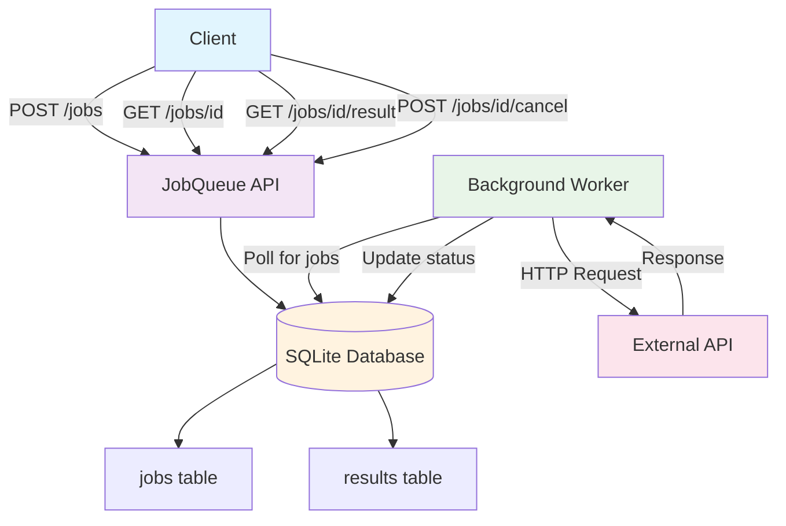

# JobQueue

FastAPI 上で **任意のHTTP API 呼び出し** をジョブとして非同期実行・永続化・監視するための軽量ジョブキュー。

- 🚀 **任意APIをジョブ化**：`method / url / headers / params / body / timeout` を指定して実行  
- 💾 **SQLite永続化**：シンプル導入、WALモードで高並行アクセスも対応  
- 🔁 **リトライ&バックオフ**：`max_attempts / backoff_strategy` を指定して自動再試行  
- 📊 **状態/結果参照**：`queued / running / succeeded / failed / canceled`、レスポンス保持  
- 🧹 **キャンセル・TTL**：途中キャンセル、保存期間満了時の削除も可能  

---

## アーキテクチャ



---

## クイックスタート

### インストール

```bash
pip install -r requirements.txt
```

### 起動

```bash
uvicorn app.main:app --reload
```

SQLite DB はデフォルトで ./data/jobqueue.db を使用。
必要に応じて WAL モードを有効化してください。

---

## API 仕様

### エンドポイント

| Method | Path | 説明 |
|--------|------|------|
| POST | /jobs | ジョブ投入（任意APIの実行指示） |
| GET | /jobs/{job_id} | ジョブ詳細（状態・パラメータ） |
| GET | /jobs/{job_id}/result | 実行結果（HTTPレスポンス） |
| POST | /jobs/{job_id}/cancel | ジョブのキャンセル |
| GET | /jobs | ジョブ一覧（フィルタ/ページング） |

### ジョブ投入リクエスト例

```json
POST /jobs
{
  "method": "POST",
  "url": "https://httpbin.org/post",
  "headers": {"Content-Type": "application/json"},
  "params": {"debug": "1"},
  "body": {"message": "hello"},
  "timeout_sec": 15,
  "priority": 5,
  "max_attempts": 3,
  "backoff_strategy": "exponential",
  "backoff_seconds": 5,
  "scheduled_at": null,
  "ttl_seconds": 604800,
  "tags": ["demo","external-api"]
}
```

レスポンス:

```json
{
  "job_id": "j_01HXYZ...",
  "status": "queued"
}
```

---

## ステータス例

```json
GET /jobs/{job_id}
{
  "job_id": "j_01HXYZ...",
  "status": "running",
  "attempt": 1,
  "max_attempts": 3,
  "priority": 5,
  "scheduled_at": null,
  "created_at": "2025-09-22T14:00:00Z",
  "started_at": "2025-09-22T14:00:05Z",
  "finished_at": null,
  "method": "POST",
  "url": "https://httpbin.org/post",
  "timeout_sec": 15,
  "tags": ["demo","external-api"]
}
```

---

## 結果例

```json
GET /jobs/{job_id}/result
{
  "job_id": "j_01HXYZ...",
  "status": "succeeded",
  "response_status": 200,
  "response_headers": {"content-type":"application/json"},
  "response_body": {"json":{"message":"hello"},"url":"https://httpbin.org/post"},
  "error": null,
  "duration_ms": 286
}
```

---

## 設定（環境変数）

| 変数名 | 既定値 | 説明 |
|--------|--------|------|
| JOBQUEUE_DB_URL | sqlite+aiosqlite:///./data/jobqueue.db | SQLite接続URL |
| JOBQUEUE_CONCURRENCY | 4 | 同時実行ワーカー数 |
| JOBQUEUE_POLL_INTERVAL | 0.3 | キュー監視間隔（秒） |
| JOBQUEUE_DEFAULT_TIMEOUT | 30 | HTTP呼び出しの既定タイムアウト |
| JOBQUEUE_RESULT_MAX_BYTES | 1048576 | 結果本文の保存上限（1MB） |

---

## セキュリティと運用の注意

- **外部API制御**：無制限に受けると SSRF リスクあり → 許可先ホスト制限を推奨
- **認証情報**：トークンやヘッダを保存する場合は暗号化/マスキング検討
- **レスポンスサイズ制御**：結果の保存上限を設ける
- **レート制御**：外部APIのリミットに合わせて同時実行数を制御
- **監査ログ**：誰がどのジョブを登録したかを追跡可能に

---

## 拡張予定

- Redis / RabbitMQ 対応による分散実行
- APScheduler 連携での定期実行
- WebSocket によるリアルタイム進捗通知
- 管理用ダッシュボード UI

---

## ライセンス

MIT License

---

---

こちらは **README.md としてそのまま使える形** になっています。  
必要なら「雛形コード」(`main.py`, `models.py`, `worker.py`) も一緒に生成しますか？