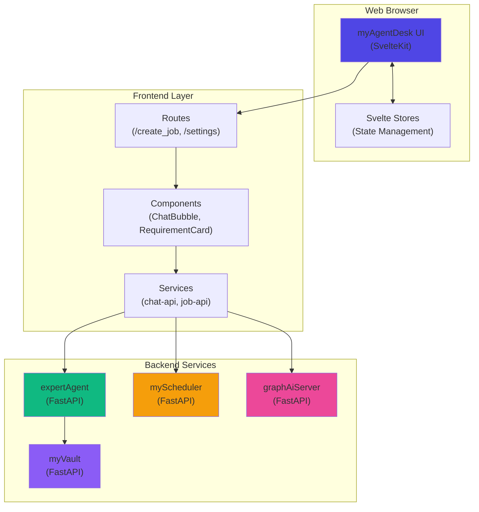
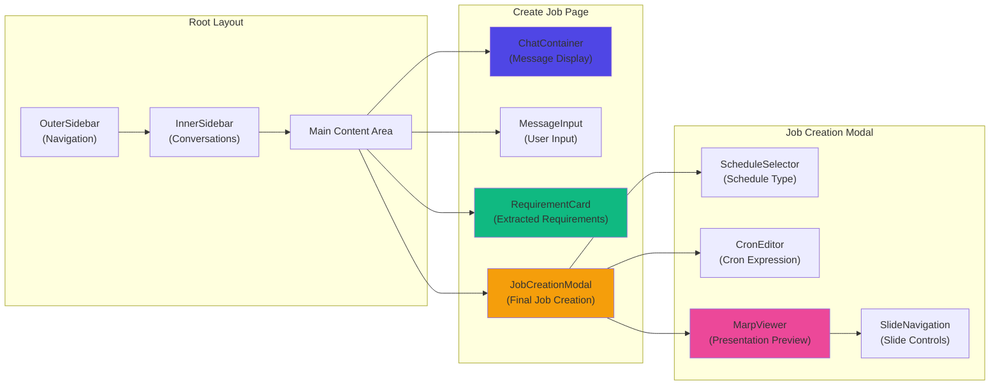

# myAgentDesk

🎨 **myAgentDesk** is a modern web interface for the MySwiftAgent ecosystem, providing an intuitive chat-based UI for AI agent interaction, job creation, and workflow management.

## Features

- 🤖 **AI Agent Chat Interface** - OpenWebUI-inspired conversational UI with real-time streaming
- 📋 **Interactive Job Creation** - Conversational workflow for defining and scheduling automated jobs
- 📊 **Marp Presentation Integration** - Generate and preview presentation slides from job requirements
- 🗂️ **Conversation Management** - Persistent conversation history with grouping by date
- 🎯 **Requirement Extraction** - AI-powered extraction of job requirements from natural language
- ⏰ **Schedule Management** - Visual cron editor with human-readable schedule descriptions
- 📱 **Responsive Design** - Mobile-friendly interface with adaptive layouts
- 🌙 **Dark Mode** - Class-based dark mode with localStorage persistence
- 🔐 **Multi-Backend Support** - Seamless integration with expertAgent, myScheduler, and GraphAI services
- ♿ **Accessibility** - ARIA labels, keyboard navigation, and semantic HTML

## Technology Stack

| Component | Technology | Version |
|-----------|------------|---------|
| Frontend Framework | SvelteKit | 2.5.0 |
| Language | TypeScript | 5.3.3 |
| Styling | Tailwind CSS | 3.4.0 |
| Build Tool | Vite | 5.0.10 |
| Unit Testing | Vitest | 1.1.0 |
| E2E Testing | Playwright | 1.40.0 |
| Markdown Rendering | marked | 16.4.1 |
| Code Highlighting | highlight.js | 11.11.1 |
| Presentation Engine | @marp-team/marp-core | 4.2.0 |
| Node Adapter | @sveltejs/adapter-node | 5.0.1 |
| Runtime | Node.js | 20.x+ |

## Prerequisites

- **Node.js**: 20.x or later
- **npm**: 10.x or later
- **Docker**: Optional, for containerized deployment

## Installation

```bash
# Navigate to myAgentDesk directory
cd myAgentDesk

# Install dependencies
npm install

# Copy environment variables
cp .env.example .env

# Edit .env with your configuration
```

## Running the Application

### Development Mode

```bash
# Start development server with hot reload
npm run dev

# Server will be available at http://localhost:5173
```

**Development Features:**
- Hot module replacement (HMR)
- API proxy to expertAgent (`/aiagent-api` → `http://localhost:8114`)
- TypeScript type checking in watch mode
- Detailed error messages

### Production Build

```bash
# Build for production
npm run build

# Preview production build
npm run preview

# Production server will run at http://localhost:8000
```

**Production Optimizations:**
- Minified JavaScript/CSS
- Pre-compressed assets (gzip/brotli)
- Code splitting
- Tree-shaking
- SSR (Server-Side Rendering)

### Docker Deployment

```bash
# Build Docker image
docker build -t myagentdesk:latest .

# Run container
docker run -p 8000:8000 \
  -e PORT=8000 \
  -e EXPERT_AGENT_URL=http://expertAgent:8103 \
  myagentdesk:latest

# Container will be available at http://localhost:8000
```

**Docker Features:**
- Multi-stage build (optimized for size)
- Non-root user execution (sveltekit:1001)
- Health check endpoint (`/health`)
- Node.js 20 Alpine base image

## Project Structure

```
myAgentDesk/
├── src/
│   ├── routes/                      # SvelteKit routes (file-based routing)
│   │   ├── +layout.svelte          # Root layout (sidebar, navigation)
│   │   ├── +page.svelte            # Home page (redirects to create_job)
│   │   ├── +page.ts                # Client-side routing logic
│   │   ├── create_job/             # Job creation workflow
│   │   │   └── +page.svelte        # Main job creation UI
│   │   ├── settings/               # Settings page
│   │   │   └── +page.svelte        # Configuration UI
│   │   ├── health/                 # Health check API
│   │   │   └── +server.ts          # Health endpoint
│   │   └── (preview)/              # Preview routes (layout group)
│   │       └── mockups/            # UI mockups and prototypes
│   │           └── feature-152/    # Feature mockup examples
│   ├── lib/                         # Shared libraries
│   │   ├── components/             # Reusable Svelte components
│   │   │   ├── Button.svelte       # Button component
│   │   │   ├── Card.svelte         # Card wrapper
│   │   │   ├── ChatBubble.svelte   # Chat message bubble
│   │   │   ├── AgentCard.svelte    # Agent selection card
│   │   │   ├── Sidebar.svelte      # Main sidebar
│   │   │   ├── InnerSidebar.svelte # Inner sidebar (conversations)
│   │   │   ├── OuterSidebar.svelte # Outer sidebar (navigation)
│   │   │   ├── sidebar/            # Sidebar components
│   │   │   │   ├── SearchBox.svelte
│   │   │   │   ├── ConversationItem.svelte
│   │   │   │   ├── ConversationGroup.svelte
│   │   │   │   └── SidebarHeader.svelte
│   │   │   └── create_job/         # Job creation components
│   │   │       ├── ChatContainer.svelte       # Chat message display
│   │   │       ├── MessageInput.svelte        # Message input box
│   │   │       ├── RequirementCard.svelte     # Requirement summary
│   │   │       ├── JobCreationModal.svelte    # Job creation dialog
│   │   │       ├── ScheduleSelector.svelte    # Schedule selection UI
│   │   │       ├── CronEditor.svelte          # Cron expression editor
│   │   │       ├── MarpViewer.svelte          # Marp presentation viewer
│   │   │       └── SlideNavigation.svelte     # Slide navigation controls
│   │   ├── stores/                 # Svelte stores (state management)
│   │   │   ├── conversations.ts    # Conversation history store
│   │   │   ├── chatSession.ts      # Chat session state
│   │   │   ├── sidebar.ts          # Sidebar open/close state
│   │   │   ├── layout.ts           # Layout configuration
│   │   │   └── locale.ts           # Locale/language settings
│   │   ├── services/               # API service layer
│   │   │   ├── config.ts           # API base URL configuration
│   │   │   ├── http.ts             # HTTP client wrapper
│   │   │   ├── chat-api.ts         # Chat API client
│   │   │   ├── job-api.ts          # Job API client
│   │   │   ├── schedule-api.ts     # Schedule API client
│   │   │   ├── marp-api.ts         # Marp presentation API
│   │   │   └── index.ts            # Service exports
│   │   ├── utils/                  # Utility functions
│   │   │   └── markdown.ts         # Markdown rendering utilities
│   │   ├── domain/                 # Domain types
│   │   │   └── types.ts            # TypeScript interfaces
│   │   └── mockups/                # UI mockup components
│   ├── app.html                     # HTML template
│   ├── app.css                      # Global styles (Tailwind)
│   └── __mocks__/                   # Test mocks
│       └── $app/                    # SvelteKit app mocks
├── static/                          # Static assets
├── tests/                           # End-to-end tests (Playwright)
├── coverage/                        # Test coverage reports
├── build/                           # Production build output
├── .svelte-kit/                     # SvelteKit build artifacts
├── svelte.config.js                 # SvelteKit configuration
├── vite.config.ts                   # Vite configuration
├── vitest.config.ts                 # Vitest configuration
├── playwright.config.ts             # Playwright configuration
├── tailwind.config.js               # Tailwind CSS configuration
├── postcss.config.js                # PostCSS configuration
├── tsconfig.json                    # TypeScript configuration
├── .eslintrc.cjs                    # ESLint configuration
├── .prettierrc                      # Prettier configuration
├── Dockerfile                       # Docker build configuration
├── .dockerignore                    # Docker ignore patterns
├── .env.example                     # Environment variable template
└── package.json                     # Project dependencies
```

## Configuration

### Environment Variables

Create a `.env` file in the project root:

```env
# Server Configuration
PORT=8000
HOST=0.0.0.0
NODE_ENV=production

# Backend API Integration
EXPERT_AGENT_URL=http://localhost:8103

# Optional: Cloudflare Integration (Phase 4)
CLOUDFLARE_API_URL=https://your-worker.your-subdomain.workers.dev
CLOUDFLARE_API_KEY=your-api-key-here

# Optional: Origin (for CORS if needed)
# ORIGIN=http://localhost:8000
```

### API Base URL Configuration

The API base URL can be configured in multiple ways:

1. **Environment Variables** (highest priority):
   - `PUBLIC_AGENT_API_BASE` - Public environment variable
   - `VITE_AGENT_API_BASE` - Vite environment variable

2. **Vite Proxy** (development only):
   - Configured in `vite.config.ts`
   - `/aiagent-api` → `http://localhost:8114` (default)

3. **Default** (fallback):
   - `/aiagent-api/v1`

**Example Configuration:**

```bash
# .env.local (development)
PUBLIC_AGENT_API_BASE=/aiagent-api/v1

# .env.production (production)
PUBLIC_AGENT_API_BASE=https://api.example.com/v1
```

## Available Scripts

| Script | Description |
|--------|-------------|
| `npm run dev` | Start development server (port 5173, hot reload) |
| `npm run build` | Build for production (SSR + static assets) |
| `npm run preview` | Preview production build (port 8000) |
| `npm test` | Run unit tests (Vitest) |
| `npm run test:e2e` | Run E2E tests (Playwright) |
| `npm run check` | Run svelte-check (type checking + diagnostics) |
| `npm run check:watch` | Run svelte-check in watch mode |
| `npm run lint` | Run ESLint and Prettier checks |
| `npm run format` | Format code with Prettier |
| `npm run type-check` | TypeScript type checking only |

## Testing

### Unit Tests

myAgentDesk uses **Vitest** for unit testing Svelte components and services.

```bash
# Run all tests
npm test

# Run tests in watch mode
npm run test -- --watch

# Run tests with coverage
npm run test -- --coverage

# Run specific test file
npm run test -- src/lib/components/Button.test.ts
```

**Test Coverage (as of 2025-01):**
- **Overall Coverage**: 13.71%
- **Component Coverage**: **71.59%** (main focus area)
- **Total Tests**: 42 passing
- **Test Files**: 16 files

**Example Test:**

```typescript
import { render, screen } from '@testing-library/svelte';
import { describe, it, expect } from 'vitest';
import Button from './Button.svelte';

describe('Button', () => {
  it('renders with label', () => {
    render(Button, { label: 'Click Me' });
    expect(screen.getByText('Click Me')).toBeTruthy();
  });

  it('handles click events', async () => {
    let clicked = false;
    const { component } = render(Button, { label: 'Test' });
    component.$on('click', () => { clicked = true; });
    await screen.getByText('Test').click();
    expect(clicked).toBe(true);
  });
});
```

### End-to-End Tests

E2E tests use **Playwright** for browser automation.

```bash
# Run E2E tests
npm run test:e2e

# Run E2E tests with UI
npm run test:e2e -- --ui

# Run E2E tests in specific browser
npm run test:e2e -- --project=chromium
```

## Architecture



### Component Architecture



## API Integration

### expertAgent Integration

myAgentDesk integrates with expertAgent for AI-powered chat and job requirement extraction.

**Endpoints Used:**

```bash
# Chat with AI agent
POST /aiagent-api/v1/aiagent/utility/action
Content-Type: application/json

{
  "user_input": "Create a daily job to fetch weather data",
  "model_name": "gpt-4o-mini"
}

# Extract job requirements
POST /aiagent-api/v1/aiagent/utility/jsonOutput
Content-Type: application/json

{
  "user_input": "Extract requirements from: ...",
  "model_name": "gemini-2.5-flash",
  "output_json_schema": {
    "data_source": "string",
    "process_description": "string",
    "output_format": "string",
    "schedule": "string"
  }
}
```

**Service Implementation:**

```typescript
// src/lib/services/chat-api.ts
import { getApiBase } from './config';

export async function sendMessage(message: string): Promise<string> {
  const response = await fetch(`${getApiBase()}/aiagent/utility/action`, {
    method: 'POST',
    headers: { 'Content-Type': 'application/json' },
    body: JSON.stringify({
      user_input: message,
      model_name: 'gpt-4o-mini'
    })
  });

  if (!response.ok) throw new Error(`Chat API error: ${response.status}`);
  const data = await response.json();
  return data.result;
}
```

### myScheduler Integration

Integration with myScheduler for job creation and scheduling.

**Endpoints Used:**

```bash
# Create scheduled job (async)
POST /api/v1/jobs/async
Content-Type: application/json

{
  "job_type": "workflow",
  "job_master_id": "daily-report",
  "cron": "0 9 * * *",
  "workflow_data": {
    "workflow_name": "generate_report",
    "input_data": {}
  }
}

# Check job creation status
GET /api/v1/jobs/{job_id}/status
```

**Service Implementation:**

```typescript
// src/lib/services/job-api.ts
import { getApiBase } from './config';

export async function createJobAsync(jobData: JobCreationRequest): Promise<string> {
  const response = await fetch(`${getApiBase()}/jobs/async`, {
    method: 'POST',
    headers: { 'Content-Type': 'application/json' },
    body: JSON.stringify(jobData)
  });

  if (!response.ok) throw new Error(`Job creation failed: ${response.status}`);
  const data = await response.json();
  return data.job_id; // Returns async job ID
}

export async function getJobStatus(jobId: string): Promise<JobResult> {
  const response = await fetch(`${getApiBase()}/jobs/${jobId}/status`);
  if (!response.ok) throw new Error(`Failed to get job status: ${response.status}`);
  return await response.json();
}
```

### Marp Presentation API

Integration for generating presentation slides from job requirements.

**Endpoints Used:**

```bash
# Generate Marp presentation
POST /aiagent-api/v1/marp/generate
Content-Type: application/json

{
  "conversation_id": "conv-123",
  "title": "Job Requirements",
  "output_dir": "/tmp/marp"
}

# Get PDF URL
GET /aiagent-api/v1/marp/pdf/{conversation_id}

# Get PNG URLs
GET /aiagent-api/v1/marp/pngs/{conversation_id}
```

**Service Implementation:**

```typescript
// src/lib/services/marp-api.ts
import { getApiBase } from './config';

export async function generateMarpPresentation(
  conversationId: string,
  title: string
): Promise<void> {
  const response = await fetch(`${getApiBase()}/marp/generate`, {
    method: 'POST',
    headers: { 'Content-Type': 'application/json' },
    body: JSON.stringify({ conversation_id: conversationId, title })
  });

  if (!response.ok) throw new Error(`Marp generation failed: ${response.status}`);
}

export async function getMarpPdfUrl(conversationId: string): Promise<string> {
  return `${getApiBase()}/marp/pdf/${conversationId}`;
}
```

## Key Features Deep Dive

### 1. Conversational Job Creation

The job creation workflow uses a conversational interface to extract requirements from natural language.

**Workflow:**

1. **Chat with AI** - User describes job requirements in natural language
2. **Requirement Extraction** - AI extracts structured data (data source, process, output, schedule)
3. **Requirement Review** - User reviews and confirms extracted requirements
4. **Schedule Configuration** - User configures schedule (cron expression or one-time)
5. **Presentation Generation** - System generates Marp presentation from requirements
6. **Job Creation** - User confirms and creates the scheduled job

**State Management:**

```typescript
// src/lib/stores/conversations.ts
import { writable } from 'svelte/store';

export interface Conversation {
  id: string;
  title: string;
  messages: Message[];
  requirements: RequirementState;
  createdAt: Date;
  updatedAt: Date;
}

export const conversationStore = writable<Conversation[]>([]);
export const activeConversation = writable<Conversation | null>(null);
```

### 2. Requirement Extraction

Uses expertAgent's JSON Output Agent to extract structured requirements from chat history.

**Extraction Schema:**

```typescript
interface RequirementState {
  data_source: string | null;          // Where to get data from
  process_description: string | null;  // What to do with the data
  output_format: string | null;        // How to format the output
  schedule: string | null;             // When to run (cron or description)
  completeness: number;                // 0-100 percentage
}
```

**Example Extraction:**

```
User: "I want to fetch weather data from OpenWeather API every morning at 9am
       and send a summary email to team@example.com"

Extracted Requirements:
- data_source: "OpenWeather API"
- process_description: "Fetch weather data and generate summary"
- output_format: "Email to team@example.com"
- schedule: "Every morning at 9am (0 9 * * *)"
- completeness: 100
```

### 3. Visual Schedule Editor

The schedule editor provides both visual and text-based cron expression editing.

**Features:**

- **Preset Schedules**: Every hour, daily, weekly, monthly
- **Visual Cron Editor**: Dropdown selectors for minute, hour, day, month, weekday
- **Natural Language Display**: "Every day at 09:00" (human-readable)
- **Validation**: Real-time validation of cron expressions
- **Preview**: Next 5 execution times

**Component:**

```svelte
<!-- src/lib/components/create_job/CronEditor.svelte -->
<script lang="ts">
  export let cronExpression: string = '0 9 * * *';

  function parseCron(cron: string) {
    const [minute, hour, day, month, weekday] = cron.split(' ');
    return { minute, hour, day, month, weekday };
  }

  function updateCron() {
    cronExpression = `${minute} ${hour} ${day} ${month} ${weekday}`;
  }
</script>

<div class="cron-editor">
  <select bind:value={minute} on:change={updateCron}>
    {#each Array(60) as _, i}
      <option value={i}>{i}</option>
    {/each}
  </select>
  <!-- More selectors... -->
</div>
```

### 4. Marp Presentation Integration

Generates presentation slides from job requirements using Marp (Markdown Presentation Ecosystem).

**Slide Structure:**

```markdown
---
marp: true
theme: default
---

# Job Requirements: Daily Weather Report

---

## Data Source
OpenWeather API

---

## Process Description
1. Fetch weather data
2. Generate summary
3. Send email

---

## Output Format
Email to team@example.com

---

## Schedule
Every day at 09:00 (0 9 * * *)
```

**Viewer Features:**

- **PDF Export**: Download presentation as PDF
- **PNG Export**: Individual slides as images
- **Navigation**: Previous/Next slide buttons
- **Slide Counter**: Current slide / Total slides
- **Responsive**: Adapts to screen size

### 5. Conversation History

Persistent conversation history with grouping by date.

**Storage:**

```typescript
// src/lib/stores/conversations.ts
import { writable } from 'svelte/store';

// Load from localStorage
const stored = localStorage.getItem('conversations');
const initial = stored ? JSON.parse(stored) : [];

export const conversationStore = writable<Conversation[]>(initial);

// Auto-save to localStorage
conversationStore.subscribe((conversations) => {
  localStorage.setItem('conversations', JSON.stringify(conversations));
});
```

**Grouping:**

```typescript
function groupConversationsByDate(conversations: Conversation[]) {
  const today = new Date();
  const yesterday = new Date(today);
  yesterday.setDate(yesterday.getDate() - 1);

  return {
    today: conversations.filter(c => isSameDay(c.updatedAt, today)),
    yesterday: conversations.filter(c => isSameDay(c.updatedAt, yesterday)),
    older: conversations.filter(c => c.updatedAt < yesterday)
  };
}
```

## Development Workflow

### Adding a New Component

```bash
# 1. Create component file
touch src/lib/components/MyComponent.svelte

# 2. Create test file
touch src/lib/components/MyComponent.test.ts

# 3. Implement component
# Edit MyComponent.svelte

# 4. Write tests
# Edit MyComponent.test.ts

# 5. Run tests
npm test

# 6. Add to parent component
# Import and use in parent .svelte file
```

### Adding a New API Endpoint

```bash
# 1. Add endpoint to service
# Edit src/lib/services/my-api.ts

# 2. Add types
# Edit src/lib/services/types.ts

# 3. Write tests
# Edit src/lib/services/my-api.test.ts

# 4. Run tests
npm test

# 5. Use in component
# Import and call from component
```

### Creating a New Page

```bash
# 1. Create route directory
mkdir src/routes/my-page

# 2. Create page component
touch src/routes/my-page/+page.svelte

# 3. Optional: Add page data loading
touch src/routes/my-page/+page.ts

# 4. Optional: Add page server logic
touch src/routes/my-page/+page.server.ts

# 5. Optional: Add layout
touch src/routes/my-page/+layout.svelte

# 6. Test by navigating to /my-page
```

## Troubleshooting

### Common Issues

#### Issue: API calls fail with CORS errors

**Solution:**

```bash
# Development: Check vite.config.ts proxy configuration
# Production: Ensure EXPERT_AGENT_URL is set correctly

# Verify backend allows CORS
curl -H "Origin: http://localhost:5173" \
  -H "Access-Control-Request-Method: POST" \
  -X OPTIONS http://localhost:8103/api/v1/health
```

#### Issue: Hot reload not working

**Solution:**

```bash
# Clear .svelte-kit directory
rm -rf .svelte-kit

# Restart dev server
npm run dev
```

#### Issue: TypeScript errors in tests

**Solution:**

```bash
# Run svelte-check to diagnose
npm run check

# Check tsconfig.json includes test files
# Ensure "include": ["src/**/*.ts", "src/**/*.test.ts"]
```

#### Issue: Docker build fails

**Solution:**

```bash
# Check Node version in Dockerfile
# Must be Node.js 20+

# Clear Docker cache
docker build --no-cache -t myagentdesk:latest .

# Check build logs
docker build -t myagentdesk:latest . 2>&1 | tee build.log
```

#### Issue: Conversation history not persisting

**Solution:**

```bash
# Check localStorage quota
# In browser console:
navigator.storage.estimate().then(estimate => {
  console.log('Used:', estimate.usage, 'Quota:', estimate.quota);
});

# Clear localStorage if corrupted
localStorage.removeItem('conversations');
location.reload();
```

### Debug Mode

Enable debug logging:

```typescript
// src/lib/services/http.ts
const DEBUG = import.meta.env.VITE_DEBUG === 'true';

if (DEBUG) {
  console.log('[HTTP]', method, url, data);
}
```

Set in `.env`:

```env
VITE_DEBUG=true
```

## Deployment

### Production Deployment Checklist

- [ ] Build and test production bundle (`npm run build && npm run preview`)
- [ ] Set `NODE_ENV=production` in environment
- [ ] Configure `EXPERT_AGENT_URL` to production backend
- [ ] Set `PORT` and `HOST` appropriately
- [ ] Enable HTTPS/TLS for secure communication
- [ ] Configure reverse proxy (nginx, Caddy) if needed
- [ ] Set up monitoring (health check at `/health`)
- [ ] Configure logging (structured JSON logs recommended)
- [ ] Test with production-like data
- [ ] Verify CORS configuration
- [ ] Enable Docker health checks
- [ ] Set resource limits (CPU, memory)
- [ ] Configure backup for localStorage persistence strategy

### Docker Compose Example

```yaml
version: '3.8'

services:
  myagentdesk:
    build: ./myAgentDesk
    ports:
      - "8000:8000"
    environment:
      - NODE_ENV=production
      - PORT=8000
      - EXPERT_AGENT_URL=http://expertAgent:8103
    depends_on:
      - expertAgent
    healthcheck:
      test: ["CMD", "node", "-e", "require('http').get('http://localhost:8000/health', (r) => process.exit(r.statusCode === 200 ? 0 : 1))"]
      interval: 30s
      timeout: 3s
      start_period: 5s
      retries: 3
    restart: unless-stopped

  expertAgent:
    image: expertAgent:latest
    ports:
      - "8103:8103"
    restart: unless-stopped
```

### Nginx Reverse Proxy

```nginx
server {
    listen 80;
    server_name myagentdesk.example.com;

    location / {
        proxy_pass http://localhost:8000;
        proxy_set_header Host $host;
        proxy_set_header X-Real-IP $remote_addr;
        proxy_set_header X-Forwarded-For $proxy_add_x_forwarded_for;
        proxy_set_header X-Forwarded-Proto $scheme;
    }

    # WebSocket support (if needed in future)
    location /ws {
        proxy_pass http://localhost:8000;
        proxy_http_version 1.1;
        proxy_set_header Upgrade $http_upgrade;
        proxy_set_header Connection "upgrade";
    }
}
```

## Contributing

This project follows the **MySwiftAgent** monorepo conventions.

**Development Guidelines:**

1. Read [CLAUDE.md](../CLAUDE.md) and [docs/claude/01-development-workflow.md](../docs/claude/01-development-workflow.md)
2. Create feature branch from `develop`
3. Write tests for new features (maintain 70%+ component coverage)
4. Run `npm run lint && npm run type-check && npm test` before commit
5. Follow commit message conventions
6. Create PR with appropriate labels (patch/minor/major)
7. Ensure CI/CD pipeline passes

**Code Style:**

- TypeScript strict mode
- ESLint + Prettier formatting
- Svelte best practices
- Tailwind utility-first CSS
- Accessibility (ARIA, semantic HTML)

**Testing Requirements:**

- Unit tests for all new components
- API service tests with mocked responses
- E2E tests for critical user flows (coming soon)
- Maintain 70%+ component coverage

## Roadmap

### Completed Features ✅

- ✅ SvelteKit + TypeScript project foundation
- ✅ Tailwind CSS styling (OpenWebUI + Dify design system)
- ✅ Dark mode support
- ✅ Conversation history with localStorage persistence
- ✅ Interactive job creation workflow
- ✅ Requirement extraction with AI
- ✅ Visual cron editor
- ✅ Marp presentation generation
- ✅ Docker deployment support
- ✅ Health check endpoint
- ✅ Unit tests (42 tests, 71.59% component coverage)
- ✅ CI/CD integration

### Future Enhancements 🚀

- ⏳ **Real-time Streaming** - Server-Sent Events (SSE) for AI responses
- ⏳ **Authentication** - JWT-based user authentication
- ⏳ **Multi-user Support** - User-scoped conversations
- ⏳ **Job Management UI** - View, edit, and delete scheduled jobs
- ⏳ **Job Execution History** - Logs and execution history
- ⏳ **Workflow Visualization** - GraphAI workflow visual editor
- ⏳ **Export/Import** - Conversation and job data portability
- ⏳ **Notification System** - Job completion alerts
- ⏳ **Advanced Search** - Full-text search across conversations
- ⏳ **Cloudflare Workers** - Edge deployment support
- ⏳ **WebSocket Support** - Real-time updates
- ⏳ **E2E Tests** - Playwright test suite
- ⏳ **Internationalization** - Multi-language support (i18n)
- ⏳ **Mobile App** - React Native or Capacitor wrapper

## License

MIT

## Related Projects

| Project | Description |
|---------|-------------|
| [expertAgent](../expertAgent) | AI agent backend (LangGraph, MCP) |
| [myScheduler](../myscheduler) | Job scheduling service (APScheduler) |
| [graphAiServer](../graphAiServer) | Workflow execution engine (GraphAI) |
| [myVault](../myVault) | Secret management service |
| [commonUI](../commonUI) | Shared UI components library |

## Support

For issues and questions:

- Check [Troubleshooting](#troubleshooting) section
- Review [SvelteKit Documentation](https://kit.svelte.dev/docs)
- Review [Tailwind CSS Documentation](https://tailwindcss.com/docs)
- Consult [MySwiftAgent CLAUDE.md](../CLAUDE.md)
- Open an issue in the main repository

## Acknowledgments

- **OpenWebUI** - UI design inspiration
- **Dify** - Workflow element design inspiration
- **SvelteKit** - Modern web framework
- **Tailwind CSS** - Utility-first CSS framework
- **Marp** - Markdown presentation ecosystem
